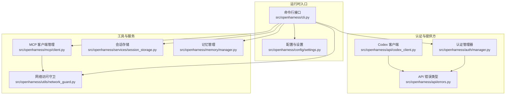
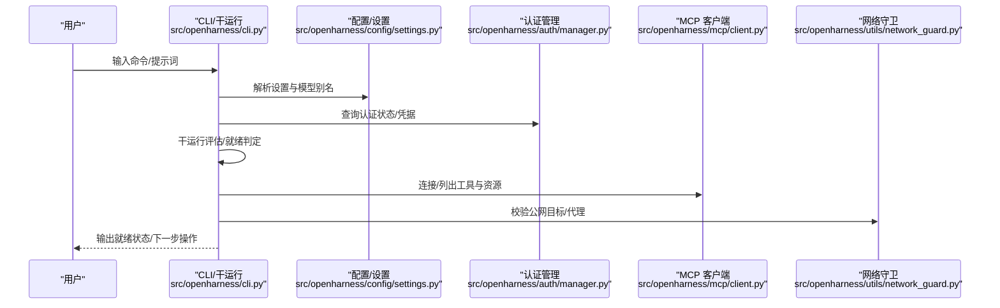
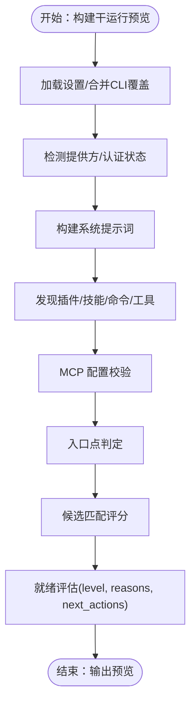
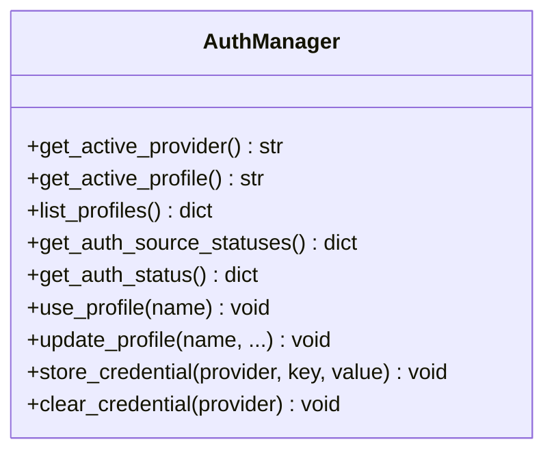
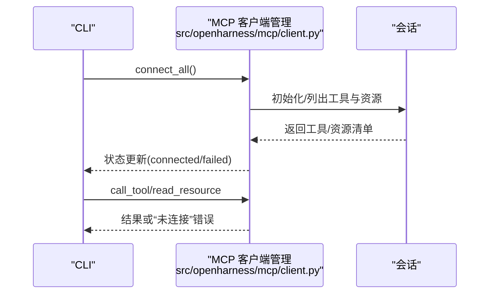
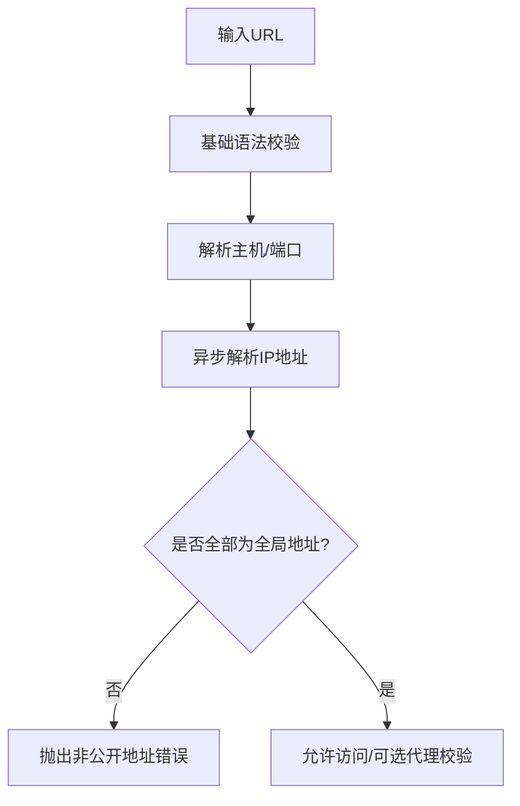
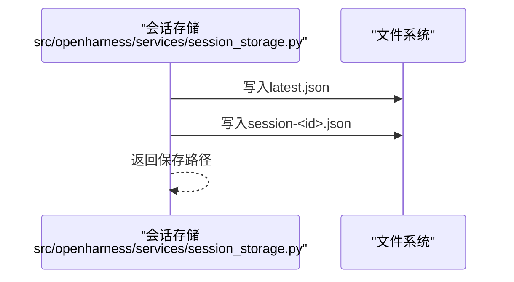
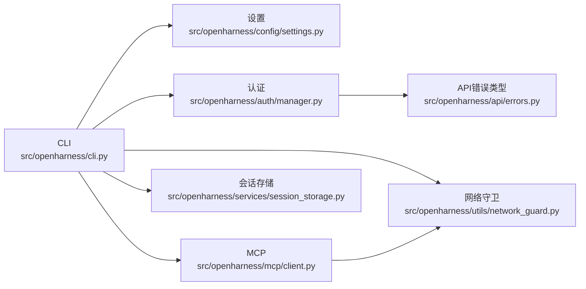

# 故障排除和常见问题

<cite>
**本文引用的文件**
- [README.md](file://README.md)
- [CONTRIBUTING.md](file://CONTRIBUTING.md)
- [.github/ISSUE_TEMPLATE/config.yml](file://.github/ISSUE_TEMPLATE/config.yml)
- [src/openharness/cli.py](file://src/openharness/cli.py)
- [src/openharness/api/errors.py](file://src/openharness/api/errors.py)
- [src/openharness/auth/manager.py](file://src/openharness/auth/manager.py)
- [src/openharness/config/settings.py](file://src/openharness/config/settings.py)
- [src/openharness/mcp/client.py](file://src/openharness/mcp/client.py)
- [src/openharness/utils/network_guard.py](file://src/openharness/utils/network_guard.py)
- [src/openharness/services/session_storage.py](file://src/openharness/services/session_storage.py)
- [src/openharness/memory/manager.py](file://src/openharness/memory/manager.py)
- [src/openharness/api/codex_client.py](file://src/openharness/api/codex_client.py)
- [tests/test_api/test_client.py](file://tests/test_api/test_client.py)
- [tests/test_auth/test_flows.py](file://tests/test_auth/test_flows.py)
- [scripts/test_docker_sandbox_e2e.py](file://scripts/test_docker_sandbox_e2e.py)
</cite>

## 目录
1. [简介](#简介)
2. [项目结构](#项目结构)
3. [核心组件](#核心组件)
4. [架构总览](#架构总览)
5. [详细组件分析](#详细组件分析)
6. [依赖关系分析](#依赖关系分析)
7. [性能考虑](#性能考虑)
8. [故障排除指南](#故障排除指南)
9. [结论](#结论)
10. [附录](#附录)

## 简介
本指南面向使用 OpenHarness 的开发者与用户，聚焦于“故障排除与常见问题”。内容涵盖：
- 常见问题的系统化诊断流程与调试技巧
- 错误类型与错误代码对照（按来源模块分类）
- 性能问题的识别与优化建议
- 网络连接、认证失败、工具执行等场景的排查步骤
- 社区支持与获取帮助的渠道
- 预防性维护与最佳实践

## 项目结构
OpenHarness 采用分层模块化设计，核心子系统包括：引擎（Agent Loop）、工具集、技能系统、权限治理、插件生态、MCP 客户端、内存与会话持久化、UI/TUI、配置与设置、沙箱与网络安全等。

图表来源
- [src/openharness/cli.py:1-800](file://src/openharness/cli.py#L1-L800)
- [src/openharness/config/settings.py:1-800](file://src/openharness/config/settings.py#L1-L800)
- [src/openharness/auth/manager.py:1-483](file://src/openharness/auth/manager.py#L1-L483)
- [src/openharness/api/errors.py:1-20](file://src/openharness/api/errors.py#L1-L20)
- [src/openharness/api/codex_client.py:392-407](file://src/openharness/api/codex_client.py#L392-L407)
- [src/openharness/mcp/client.py:1-299](file://src/openharness/mcp/client.py#L1-L299)
- [src/openharness/utils/network_guard.py:1-135](file://src/openharness/utils/network_guard.py#L1-L135)
- [src/openharness/services/session_storage.py:1-231](file://src/openharness/services/session_storage.py#L1-L231)
- [src/openharness/memory/manager.py:1-184](file://src/openharness/memory/manager.py#L1-L184)

章节来源
- [README.md:446-502](file://README.md#L446-L502)
- [src/openharness/cli.py:1-800](file://src/openharness/cli.py#L1-L800)

## 核心组件
- 命令行接口与干运行（Dry-run）：提供预检查、入口点判定、推荐匹配、MCP 配置校验与就绪状态评估。
- 认证与提供方：统一管理多提供商凭据、订阅桥接、OAuth 设备流、外部绑定与状态报告。
- 配置与设置：多源优先级解析（CLI > 环境变量 > 配置文件 > 默认），模型别名解析与权限模式。
- MCP 客户端：支持 STDIO/HTTP/WS 连接、自动重连、工具与资源发现、调用与资源读取。
- 网络访问守卫：强制公网可达、拒绝回环/私网地址、代理与重定向限制。
- 会话存储与记忆：会话快照持久化、索引与导出；记忆条目增删改查与签名去重。
- API 错误类型：统一上游 API 失败、认证失败、限流与通用请求失败分类。

章节来源
- [src/openharness/cli.py:333-597](file://src/openharness/cli.py#L333-L597)
- [src/openharness/auth/manager.py:116-318](file://src/openharness/auth/manager.py#L116-L318)
- [src/openharness/config/settings.py:534-800](file://src/openharness/config/settings.py#L534-L800)
- [src/openharness/mcp/client.py:29-179](file://src/openharness/mcp/client.py#L29-L179)
- [src/openharness/utils/network_guard.py:25-96](file://src/openharness/utils/network_guard.py#L25-L96)
- [src/openharness/services/session_storage.py:63-107](file://src/openharness/services/session_storage.py#L63-L107)
- [src/openharness/memory/manager.py:39-121](file://src/openharness/memory/manager.py#L39-L121)
- [src/openharness/api/errors.py:6-20](file://src/openharness/api/errors.py#L6-L20)

## 架构总览
下图展示一次典型交互从 CLI 到 API 的关键路径，以及 MCP 与网络守卫的介入点。

图表来源
- [src/openharness/cli.py:396-597](file://src/openharness/cli.py#L396-L597)
- [src/openharness/config/settings.py:534-800](file://src/openharness/config/settings.py#L534-L800)
- [src/openharness/auth/manager.py:186-289](file://src/openharness/auth/manager.py#L186-L289)
- [src/openharness/mcp/client.py:45-68](file://src/openharness/mcp/client.py#L45-L68)
- [src/openharness/utils/network_guard.py:36-96](file://src/openharness/utils/network_guard.py#L36-L96)

## 详细组件分析

### 组件A：干运行与就绪评估
- 功能要点
  - 解析设置、检测提供方、认证状态、系统提示词长度、MCP 配置验证
  - 入口点判定：交互会话、模型提示词、斜杠命令或未知命令
  - 就绪等级：ready/warning/blocked，并给出“下一步操作”建议
- 关键流程
  - 设置合并与 CLI 覆盖
  - 提供方检测与认证状态
  - MCP 配置校验（URL/命令存在性/工作目录）
  - 推荐匹配（技能/工具/命令）
  - 就绪评估与去重建议

图表来源
- [src/openharness/cli.py:396-597](file://src/openharness/cli.py#L396-L597)
- [src/openharness/cli.py:333-394](file://src/openharness/cli.py#L333-L394)

章节来源
- [src/openharness/cli.py:396-743](file://src/openharness/cli.py#L396-L743)

### 组件B：认证与提供方切换
- 功能要点
  - 支持多提供商（Anthropic、OpenAI、Copilot、Codex、Moonshot、Gemini、MiniMax、NVIDIA NIM、ModelScope 等）
  - 多种认证来源：环境变量、文件存储、外部绑定、OAuth 设备流
  - 提供配置概览、状态查询、切换与更新
- 关键流程
  - 获取活动提供方与配置文件
  - 汇总各认证来源状态（已配置/缺失/外部绑定详情）
  - 更新/切换配置文件中的活动配置

图表来源
- [src/openharness/auth/manager.py:71-483](file://src/openharness/auth/manager.py#L71-L483)

章节来源
- [src/openharness/auth/manager.py:116-318](file://src/openharness/auth/manager.py#L116-L318)
- [src/openharness/config/settings.py:534-800](file://src/openharness/config/settings.py#L534-L800)

### 组件C：MCP 客户端与连接管理
- 功能要点
  - 支持 STDIO/HTTP/WS 传输
  - 自动初始化、列出工具与资源
  - 工具调用与资源读取，异常包装为“未连接”错误
- 关键流程
  - 连接所有服务器（失败记录状态但不中断启动）
  - 会话注册与状态更新（连接/失败/工具列表/资源列表）
  - 工具调用/资源读取的异常转换

图表来源
- [src/openharness/mcp/client.py:45-68](file://src/openharness/mcp/client.py#L45-L68)
- [src/openharness/mcp/client.py:129-179](file://src/openharness/mcp/client.py#L129-L179)

章节来源
- [src/openharness/mcp/client.py:29-179](file://src/openharness/mcp/client.py#L29-L179)

### 组件D：网络访问守卫
- 功能要点
  - 仅允许 http/https，禁止嵌入凭证
  - 强制公网可达，拒绝回环/私网地址
  - 可选代理（需显式设置），严格信任环境控制
- 关键流程
  - URL 基础校验
  - 异步解析主机地址并判断是否全局地址
  - 逐跳跟随重定向并校验每一步目标

图表来源
- [src/openharness/utils/network_guard.py:25-96](file://src/openharness/utils/network_guard.py#L25-L96)

章节来源
- [src/openharness/utils/network_guard.py:21-96](file://src/openharness/utils/network_guard.py#L21-L96)

### 组件E：会话存储与记忆管理
- 功能要点
  - 会话快照持久化（最新与按 ID）
  - 会话列表与摘要提取
  - 记忆条目增删改查、签名去重、索引更新
- 关键流程
  - 生成项目会话目录与摘要
  - 序列化消息与用量快照
  - 写入最新与命名文件

图表来源
- [src/openharness/services/session_storage.py:63-107](file://src/openharness/services/session_storage.py#L63-L107)

章节来源
- [src/openharness/services/session_storage.py:63-231](file://src/openharness/services/session_storage.py#L63-L231)
- [src/openharness/memory/manager.py:39-121](file://src/openharness/memory/manager.py#L39-L121)

## 依赖关系分析
- CLI 依赖配置、认证、MCP、网络守卫与存储模块，用于构建干运行预览与就绪评估
- 认证管理器依赖设置与存储模块，提供认证状态与凭据管理
- MCP 客户端依赖网络守卫（HTTP 传输时）与 mcp SDK
- 网络守卫独立于业务逻辑，提供统一的安全校验
- 存储与记忆模块相互协作，前者负责会话持久化，后者负责知识型记忆

图表来源
- [src/openharness/cli.py:396-597](file://src/openharness/cli.py#L396-L597)
- [src/openharness/auth/manager.py:116-318](file://src/openharness/auth/manager.py#L116-L318)
- [src/openharness/mcp/client.py:29-179](file://src/openharness/mcp/client.py#L29-L179)
- [src/openharness/utils/network_guard.py:25-96](file://src/openharness/utils/network_guard.py#L25-L96)
- [src/openharness/services/session_storage.py:63-107](file://src/openharness/services/session_storage.py#L63-L107)
- [src/openharness/api/errors.py:6-20](file://src/openharness/api/errors.py#L6-L20)

章节来源
- [src/openharness/cli.py:396-597](file://src/openharness/cli.py#L396-L597)
- [src/openharness/auth/manager.py:116-318](file://src/openharness/auth/manager.py#L116-L318)

## 性能考虑
- 上游 API 重试与指数退避：在引擎与客户端中实现，避免瞬时过载导致的失败放大
- 并行工具执行：提升吞吐，但需注意资源竞争与限流
- Token 计数与成本追踪：通过用量快照与计费字段监控成本
- 记忆与会话压缩：自动紧凑化减少上下文膨胀，降低延迟与成本
- 网络访问守卫：避免不必要的内网/私网请求，减少超时与失败

章节来源
- [README.md:468-487](file://README.md#L468-L487)
- [src/openharness/services/session_storage.py:63-107](file://src/openharness/services/session_storage.py#L63-L107)

## 故障排除指南

### 一、认证与提供方问题
- 现象
  - “认证缺失”或“认证状态异常”
  - 使用订阅桥接（Codex/Claude）时报错
  - Copilot OAuth 登录后仍无法调用
- 诊断步骤
  - 使用干运行查看认证状态与提供方配置
  - 检查环境变量与配置文件中的密钥/绑定
  - 验证订阅桥接的外部绑定是否存在且有效
- 解决方案
  - 通过认证子命令登录或导入凭据
  - 更新/切换提供方配置文件中的认证来源
  - 对 Copilot 使用专用登录流程并检查状态

章节来源
- [src/openharness/cli.py:333-394](file://src/openharness/cli.py#L333-L394)
- [src/openharness/auth/manager.py:186-318](file://src/openharness/auth/manager.py#L186-L318)
- [src/openharness/config/settings.py:691-800](file://src/openharness/config/settings.py#L691-L800)

### 二、网络连接与代理问题
- 现象
  - 网页搜索/抓取失败
  - 代理设置无效或被拒绝
- 诊断步骤
  - 使用网络守卫校验目标 URL 是否为公网
  - 检查代理 URL 格式与凭据
  - 观察重定向链路是否超过最大次数
- 解决方案
  - 使用受信公共搜索引擎或自建 SearXNG
  - 显式设置 OPENHARNESS_WEB_PROXY（不含凭据）
  - 仅允许 http/https，移除嵌入凭证

章节来源
- [src/openharness/utils/network_guard.py:25-96](file://src/openharness/utils/network_guard.py#L25-L96)
- [README.md:570-584](file://README.md#L570-L584)

### 三、MCP 工具/资源不可用
- 现象
  - 工具调用报“未连接”或“会话丢失”
  - 资源读取失败
- 诊断步骤
  - 查看 MCP 状态列表，确认连接状态与工具/资源清单
  - 检查 STDIO 命令是否存在、工作目录是否正确
  - 校验 HTTP/WS URL 协议与端口
- 解决方案
  - 修复配置（命令/路径/URL/认证头）
  - 重新连接或重启 MCP 服务器
  - 在干运行中预览 MCP 配置并修正错误项

章节来源
- [src/openharness/mcp/client.py:29-179](file://src/openharness/mcp/client.py#L29-L179)
- [src/openharness/cli.py:89-122](file://src/openharness/cli.py#L89-L122)

### 四、工具执行失败
- 现象
  - 文件/Shell/Web 工具执行异常
  - 权限不足或路径规则阻断
- 诊断步骤
  - 检查权限模式与路径规则
  - 查看钩子事件与前置/后置拦截
  - 核对工具输入参数与类型
- 解决方案
  - 调整权限模式或添加白名单路径
  - 修正工具参数或禁用不必要钩子
  - 使用干运行预览工具签名与行为

章节来源
- [src/openharness/cli.py:244-331](file://src/openharness/cli.py#L244-L331)
- [src/openharness/config/settings.py:50-58](file://src/openharness/config/settings.py#L50-L58)

### 五、会话与记忆问题
- 现象
  - 会话无法恢复或快照损坏
  - 记忆条目重复或无法索引
- 诊断步骤
  - 检查会话目录与文件完整性
  - 校验消息序列化与用量快照
  - 查看记忆索引与签名一致性
- 解决方案
  - 清理损坏文件并重建索引
  - 使用导出功能备份转储
  - 通过锁文件避免并发写入冲突

章节来源
- [src/openharness/services/session_storage.py:123-207](file://src/openharness/services/session_storage.py#L123-L207)
- [src/openharness/memory/manager.py:39-121](file://src/openharness/memory/manager.py#L39-L121)

### 六、沙箱与容器问题（E2E）
- 现象
  - Docker 镜像构建失败或容器生命周期异常
  - 资源限制/网络隔离不生效
- 诊断步骤
  - 确认镜像可用与自动构建开关
  - 检查会话生命周期与命令执行返回码
  - 校验文件系统隔离与网络策略
- 解决方案
  - 手动构建镜像并重试
  - 调整资源限制与挂载路径
  - 关闭沙箱或调整隔离策略

章节来源
- [scripts/test_docker_sandbox_e2e.py:517-581](file://scripts/test_docker_sandbox_e2e.py#L517-L581)

### 七、浏览器打开与设备流安全
- 现象
  - 设备流登录页面无法打开或被注入恶意 URL
- 诊断步骤
  - 平台分支：Windows 使用 os.startfile，macOS/Linux 使用 open/xdg-open
  - 拒绝非 http(s) 协议与空 URL
- 解决方案
  - 使用平台原生方式打开 URL，避免 shell 注入风险
  - 仅在受信环境中接受设备流授权

章节来源
- [tests/test_auth/test_flows.py:55-125](file://tests/test_auth/test_flows.py#L55-L125)

## 错误类型与对照表

### API 错误类型
- 分类
  - 认证失败：上游服务拒绝提供的凭据
  - 速率限制：上游服务因限流拒绝请求
  - 请求失败：通用请求或传输失败
- 适用范围
  - 统一由 API 客户端捕获并转换为具体错误类型
  - Codex 客户端根据异常类型映射到上述类别

章节来源
- [src/openharness/api/errors.py:6-20](file://src/openharness/api/errors.py#L6-L20)
- [src/openharness/api/codex_client.py:392-407](file://src/openharness/api/codex_client.py#L392-L407)

### 干运行就绪等级
- ready：配置可用，可直接运行
- warning：可解析会话，但存在潜在问题（如认证缺失/MCP 配置错误）
- blocked：入口点不可用（如未知斜杠命令/无法解析运行时客户端）

章节来源
- [src/openharness/cli.py:333-394](file://src/openharness/cli.py#L333-L394)

### 网络守卫错误
- 类型：NetworkGuardError
- 场景：URL 不是 http/https、包含嵌入凭证、目标为非公网地址、重定向过多

章节来源
- [src/openharness/utils/network_guard.py:21-96](file://src/openharness/utils/network_guard.py#L21-L96)

### MCP 连接错误
- 类型：McpServerNotConnectedError
- 场景：服务器未连接、会话丢失、工具调用/资源读取异常

章节来源
- [src/openharness/mcp/client.py:25-179](file://src/openharness/mcp/client.py#L25-L179)

## 性能问题识别与优化

### 识别指标
- 上游 API 延迟与失败率
- 工具执行时间分布
- 会话上下文大小与紧凑化频率
- 记忆检索命中与评分

### 优化建议
- 启用并合理配置重试与指数退避
- 减少不必要的工具并行与重复调用
- 使用自动紧凑化与记忆压缩
- 控制系统提示词长度与上下文窗口
- 选择更靠近用户的就近 API 端点

章节来源
- [README.md:468-487](file://README.md#L468-L487)
- [src/openharness/services/session_storage.py:63-107](file://src/openharness/services/session_storage.py#L63-L107)

## 社区支持与获取帮助

### 贡献与反馈
- 使用问题模板提交 Bug/特性请求
- 提供环境信息、精确命令与错误输出
- 文档/维护类需求请明确为文档 PR

章节来源
- [CONTRIBUTING.md:63-69](file://CONTRIBUTING.md#L63-L69)
- [.github/ISSUE_TEMPLATE/config.yml:1-8](file://.github/ISSUE_TEMPLATE/config.yml#L1-L8)

### 快速定位
- README 中的快速开始与兼容性说明
- 干运行输出中的“下一步操作”建议
- 提供方与认证状态查询命令

章节来源
- [README.md:197-284](file://README.md#L197-L284)
- [src/openharness/cli.py:333-394](file://src/openharness/cli.py#L333-L394)

## 结论
通过干运行预检、认证与提供方状态核对、网络与 MCP 连接校验、工具与权限审查、会话与记忆恢复，以及社区支持渠道，大多数问题可在短时间内定位并解决。建议将干运行作为每次变更后的“安全预览”，并在生产环境中启用自动紧凑化与成本追踪以维持稳定与可控的成本。

## 附录

### 常用命令与位置参考
- 干运行预览：oh --dry-run [-p "..."]
- 提供方与认证：oh provider / oh auth
- MCP 管理：oh mcp list
- 会话与记忆：会话快照与导出、记忆增删改查

章节来源
- [README.md:197-284](file://README.md#L197-L284)
- [src/openharness/cli.py:784-800](file://src/openharness/cli.py#L784-L800)