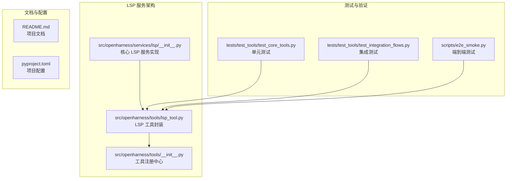
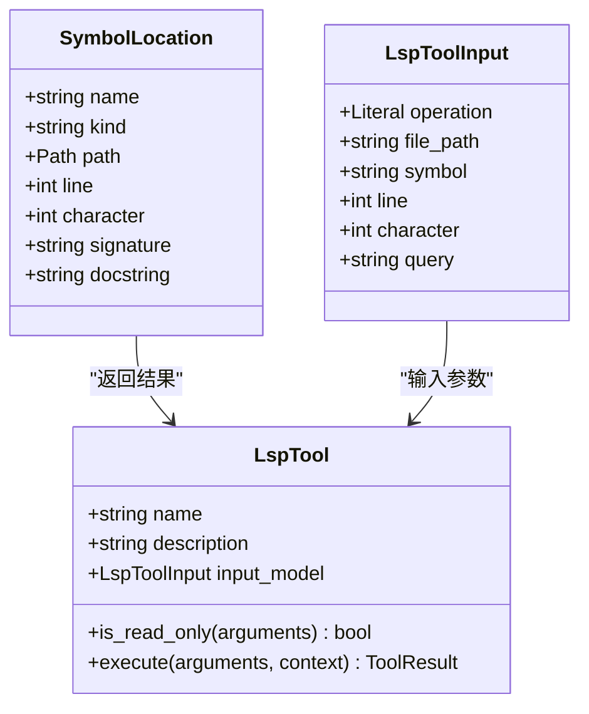
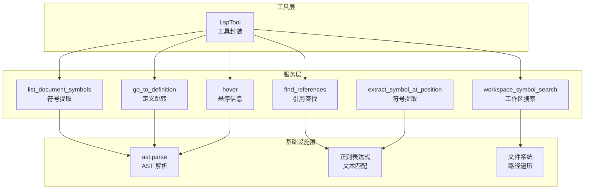
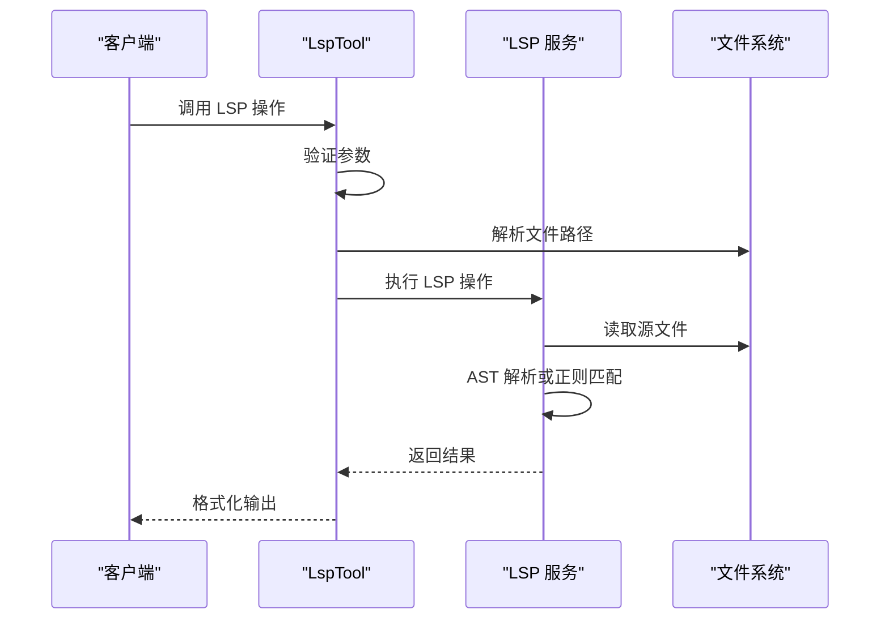
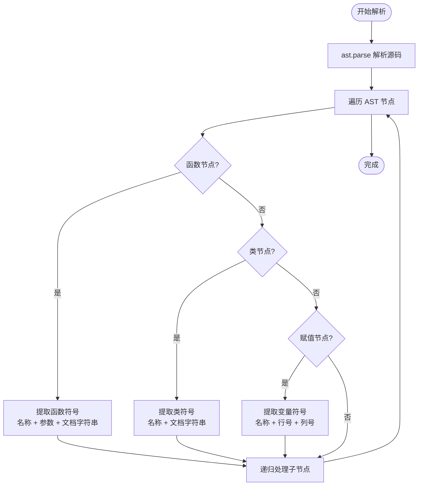
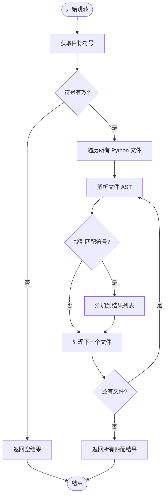
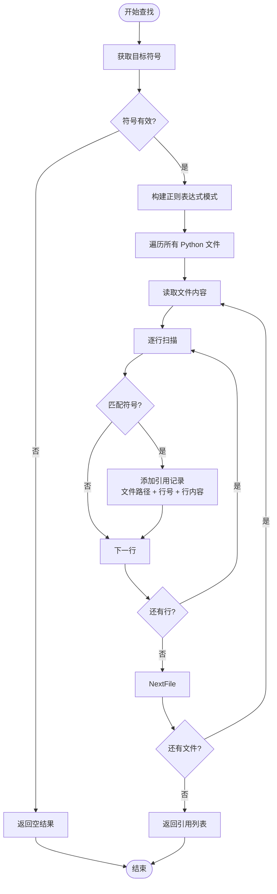
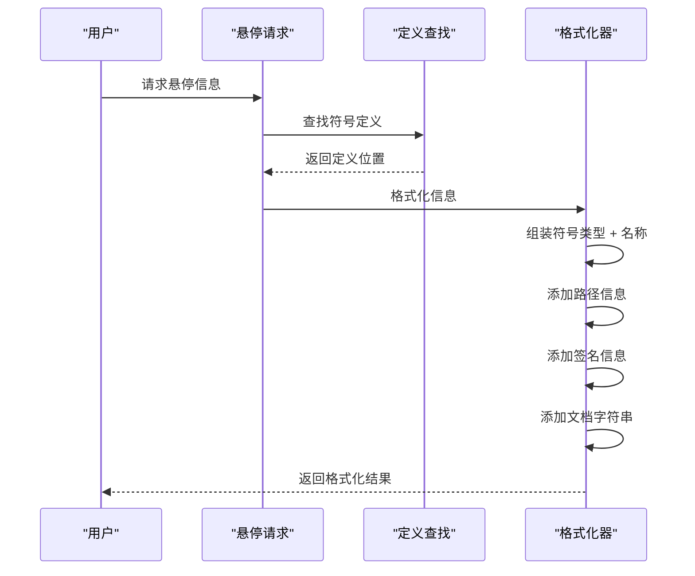
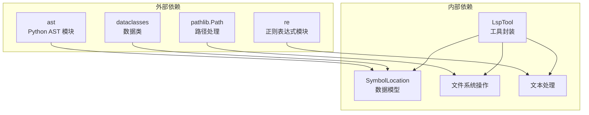
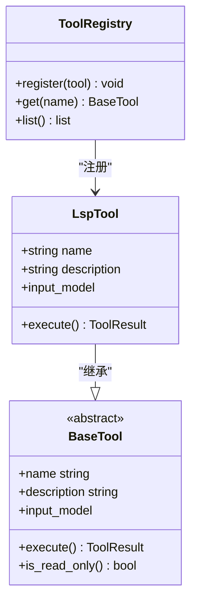

# LSP 服务

<cite>
**本文档引用的文件**
- [src/openharness/services/lsp/__init__.py](file://src/openharness/services/lsp/__init__.py)
- [src/openharness/tools/lsp_tool.py](file://src/openharness/tools/lsp_tool.py)
- [src/openharness/tools/__init__.py](file://src/openharness/tools/__init__.py)
- [tests/test_tools/test_core_tools.py](file://tests/test_tools/test_core_tools.py)
- [tests/test_tools/test_integration_flows.py](file://tests/test_tools/test_integration_flows.py)
- [scripts/e2e_smoke.py](file://scripts/e2e_smoke.py)
- [README.md](file://README.md)
- [pyproject.toml](file://pyproject.toml)
</cite>

## 目录
1. [简介](#简介)
2. [项目结构](#项目结构)
3. [核心组件](#核心组件)
4. [架构概览](#架构概览)
5. [详细组件分析](#详细组件分析)
6. [依赖关系分析](#依赖关系分析)
7. [性能考虑](#性能考虑)
8. [故障排除指南](#故障排除指南)
9. [结论](#结论)
10. [附录](#附录)

## 简介

OpenHarness 中的 LSP（Language Server Protocol）服务是一个轻量级的代码智能助手，专为 Python 源文件提供稳定只读操作。该服务旨在为模型提供定义、引用、悬停信息和符号查询等能力，从而实现类似 Claude Code 的工作流程。

与完整的语言服务器集成不同，OpenHarness 的 LSP 实现更加精简，专注于提供可靠的代码智能功能，同时保持较低的复杂度和资源消耗。

## 项目结构

OpenHarness 的 LSP 服务主要分布在以下关键位置：



**图表来源**
- [src/openharness/services/lsp/__init__.py:1-217](file://src/openharness/services/lsp/__init__.py#L1-L217)
- [src/openharness/tools/lsp_tool.py:1-155](file://src/openharness/tools/lsp_tool.py#L1-L155)
- [src/openharness/tools/__init__.py:1-102](file://src/openharness/tools/__init__.py#L1-L102)

**章节来源**
- [src/openharness/services/lsp/__init__.py:1-217](file://src/openharness/services/lsp/__init__.py#L1-L217)
- [src/openharness/tools/lsp_tool.py:1-155](file://src/openharness/tools/lsp_tool.py#L1-L155)
- [src/openharness/tools/__init__.py:1-102](file://src/openharness/tools/__init__.py#L1-L102)

## 核心组件

### LSP 服务核心功能

OpenHarness 的 LSP 服务提供了以下核心功能：

1. **符号提取**：从 Python 源文件中提取函数、类和变量符号
2. **工作区搜索**：在整个工作区中搜索符号
3. **定义跳转**：查找符号的定义位置
4. **引用查找**：找到符号的所有引用位置
5. **悬停信息**：提供符号的文档字符串和签名信息

### 数据结构设计



**图表来源**
- [src/openharness/services/lsp/__init__.py:21-32](file://src/openharness/services/lsp/__init__.py#L21-L32)
- [src/openharness/tools/lsp_tool.py:20-49](file://src/openharness/tools/lsp_tool.py#L20-L49)
- [src/openharness/tools/lsp_tool.py:51-118](file://src/openharness/tools/lsp_tool.py#L51-L118)

**章节来源**
- [src/openharness/services/lsp/__init__.py:21-217](file://src/openharness/services/lsp/__init__.py#L21-L217)
- [src/openharness/tools/lsp_tool.py:20-155](file://src/openharness/tools/lsp_tool.py#L20-L155)

## 架构概览

OpenHarness 的 LSP 服务采用分层架构设计，确保了模块化和可维护性：



**图表来源**
- [src/openharness/tools/lsp_tool.py:65-118](file://src/openharness/tools/lsp_tool.py#L65-L118)
- [src/openharness/services/lsp/__init__.py:34-204](file://src/openharness/services/lsp/__init__.py#L34-L204)

### 处理流程



**图表来源**
- [src/openharness/tools/lsp_tool.py:65-118](file://src/openharness/tools/lsp_tool.py#L65-L118)
- [src/openharness/services/lsp/__init__.py:34-204](file://src/openharness/services/lsp/__init__.py#L34-L204)

## 详细组件分析

### 符号提取服务

符号提取是 LSP 服务的核心功能之一，负责从 Python 源文件中识别和提取各种类型的符号：

#### AST 解析机制



**图表来源**
- [src/openharness/services/lsp/__init__.py:151-204](file://src/openharness/services/lsp/__init__.py#L151-L204)

#### 符号类型支持

| 符号类型 | 特征 | 示例 |
|---------|------|------|
| 函数 | def 关键字、参数列表、文档字符串 | `def greet(name):` |
| 类 | class 关键字、继承关系、方法定义 | `class Person:` |
| 变量 | 赋值语句、全局/局部作用域 | `MAX_SIZE = 100` |

**章节来源**
- [src/openharness/services/lsp/__init__.py:34-204](file://src/openharness/services/lsp/__init__.py#L34-L204)

### 定义跳转功能

定义跳转功能允许用户快速定位符号的定义位置：

#### 跳转算法流程



**图表来源**
- [src/openharness/services/lsp/__init__.py:55-72](file://src/openharness/services/lsp/__init__.py#L55-L72)

**章节来源**
- [src/openharness/services/lsp/__init__.py:55-72](file://src/openharness/services/lsp/__init__.py#L55-L72)

### 引用查找功能

引用查找功能用于发现符号在代码中的所有使用位置：

#### 引用检测算法



**图表来源**
- [src/openharness/services/lsp/__init__.py:75-93](file://src/openharness/services/lsp/__init__.py#L75-L93)

**章节来源**
- [src/openharness/services/lsp/__init__.py:75-93](file://src/openharness/services/lsp/__init__.py#L75-L93)

### 悬停信息功能

悬停信息功能提供符号的详细描述信息：

#### 悬停信息生成流程



**图表来源**
- [src/openharness/services/lsp/__init__.py:96-112](file://src/openharness/services/lsp/__init__.py#L96-L112)

**章节来源**
- [src/openharness/services/lsp/__init__.py:96-112](file://src/openharness/services/lsp/__init__.py#L96-L112)

## 依赖关系分析

### 组件间依赖关系



**图表来源**
- [src/openharness/services/lsp/__init__.py:9-14](file://src/openharness/services/lsp/__init__.py#L9-L14)
- [src/openharness/tools/lsp_tool.py:5-8](file://src/openharness/tools/lsp_tool.py#L5-L8)

### 工具注册与集成

LSP 工具通过工具注册中心进行统一管理：



**图表来源**
- [src/openharness/tools/__init__.py:45-92](file://src/openharness/tools/__init__.py#L45-L92)
- [src/openharness/tools/lsp_tool.py:51-59](file://src/openharness/tools/lsp_tool.py#L51-L59)

**章节来源**
- [src/openharness/tools/__init__.py:45-92](file://src/openharness/tools/__init__.py#L45-L92)
- [src/openharness/tools/lsp_tool.py:51-59](file://src/openharness/tools/lsp_tool.py#L51-L59)

## 性能考虑

### 时间复杂度分析

| 操作类型 | 时间复杂度 | 空间复杂度 | 说明 |
|---------|-----------|-----------|------|
| 符号提取 | O(n) | O(k) | n 为源码字符数，k 为符号数量 |
| 工作区搜索 | O(w×n) | O(m) | w 为文件数量，m 为匹配结果数 |
| 定义跳转 | O(w×n) | O(m) | 同上 |
| 引用查找 | O(w×n) | O(m) | 同上 |
| 悬停信息 | O(w×n) | O(1) | 基于定义跳转的结果 |

### 优化策略

1. **文件过滤**：自动跳过版本控制目录和缓存目录
2. **增量更新**：仅在文件变更时重新解析
3. **结果缓存**：缓存常用查询结果
4. **并发处理**：利用异步特性提高多文件处理效率

## 故障排除指南

### 常见问题与解决方案

#### 1. 文件路径问题

**问题**：LSP 工具无法找到指定文件
**解决方案**：
- 确保文件路径使用绝对路径或相对于工作目录的相对路径
- 检查文件是否存在且具有正确的扩展名

#### 2. 语言支持限制

**问题**：LSP 工具不支持非 Python 文件
**解决方案**：
- 当前版本仅支持 .py 文件
- 对于其他语言需要使用专门的 LSP 服务器

#### 3. 符号提取失败

**问题**：无法正确提取符号信息
**解决方案**：
- 检查源文件语法是否正确
- 确保文件编码为 UTF-8
- 验证符号名称的有效性

### 调试技巧

#### 使用测试验证功能

```python
# 单元测试示例
async def test_lsp_tool():
    # 创建测试文件
    (tmp_path / "pkg/utils.py").write_text(
        'def greet(name):\n    """Return a greeting."""\n    return f"hi {name}"\n'
    )
    
    # 测试符号提取
    result = await LspTool().execute(
        LspToolInput(operation="document_symbol", file_path="pkg/utils.py"),
        context
    )
    
    # 验证结果包含预期符号
    assert "function greet" in result.output
```

**章节来源**
- [tests/test_tools/test_core_tools.py:141-176](file://tests/test_tools/test_core_tools.py#L141-L176)

## 结论

OpenHarness 的 LSP 服务提供了一个轻量级但功能完备的代码智能解决方案。通过精心设计的架构和高效的算法实现，该服务能够在保持低复杂度的同时提供稳定的代码导航、符号查询和智能提示功能。

### 主要优势

1. **简洁高效**：相比完整语言服务器，实现更简单，资源消耗更低
2. **专注性强**：专门针对 Python 代码优化，提供准确的符号识别
3. **易于集成**：通过工具接口无缝集成到 OpenHarness 生态系统
4. **可扩展性**：模块化设计便于功能扩展和性能优化

### 发展方向

未来可以考虑的功能增强：
- 支持更多编程语言
- 添加语法高亮和错误检查
- 实现增量索引以提高性能
- 提供更丰富的代码重构功能

## 附录

### 使用示例

#### 基本符号提取

```bash
# 在工作区中搜索符号
oh -p "Find all functions named 'greet'"
```

#### 定义跳转

```bash
# 查找符号定义
oh -p "Go to definition of 'greet' in app.py"
```

#### 引用查找

```bash
# 查找符号引用
oh -p "Find all references to 'greet' in project"
```

### 配置选项

当前 LSP 服务的配置选项相对简单，主要通过工具参数进行控制：

| 参数 | 类型 | 描述 | 默认值 |
|------|------|------|--------|
| operation | string | 操作类型 | 必填 |
| file_path | string | 源文件路径 | 必填（除工作区搜索外） |
| symbol | string | 符号名称 | 可选 |
| line | integer | 行号 | 可选 |
| character | integer | 字符位置 | 可选 |
| query | string | 搜索查询 | 工作区搜索必需 |

### 支持的语言范围

目前 LSP 服务仅支持 Python 语言，这是基于以下考虑：

1. **专注性**：避免功能过于分散，专注于提供高质量的 Python 支持
2. **性能**：简化实现，提高处理速度
3. **维护性**：减少代码复杂度，便于长期维护

对于其他编程语言的需求，建议使用专门的 LSP 服务器或在 OpenHarness 中扩展相应的语言支持模块。