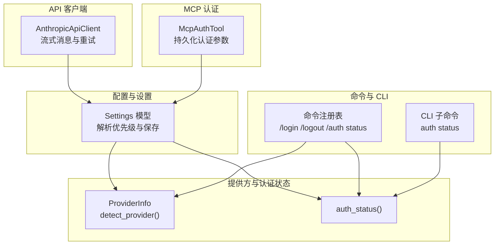
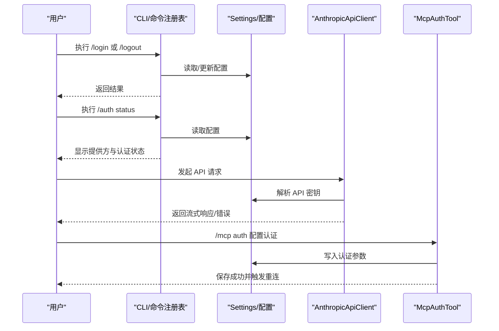
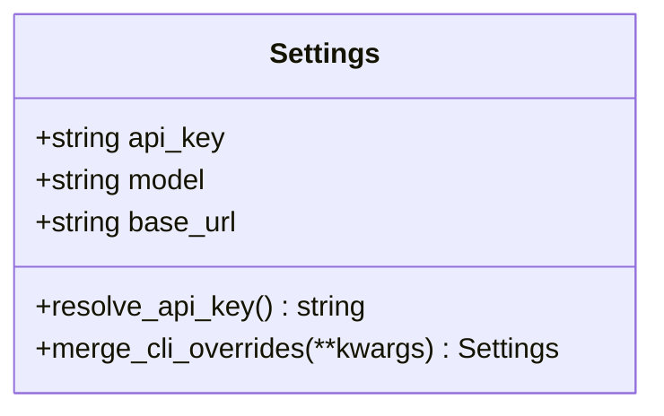
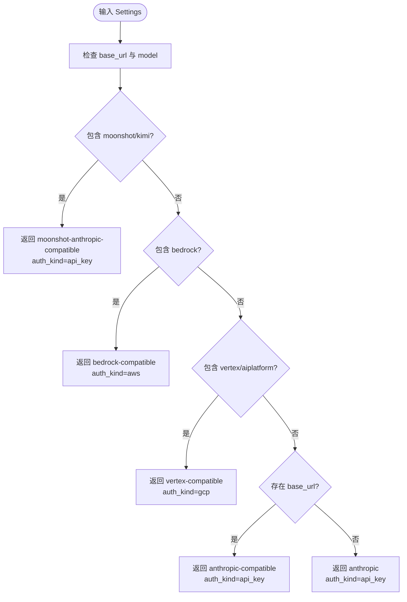
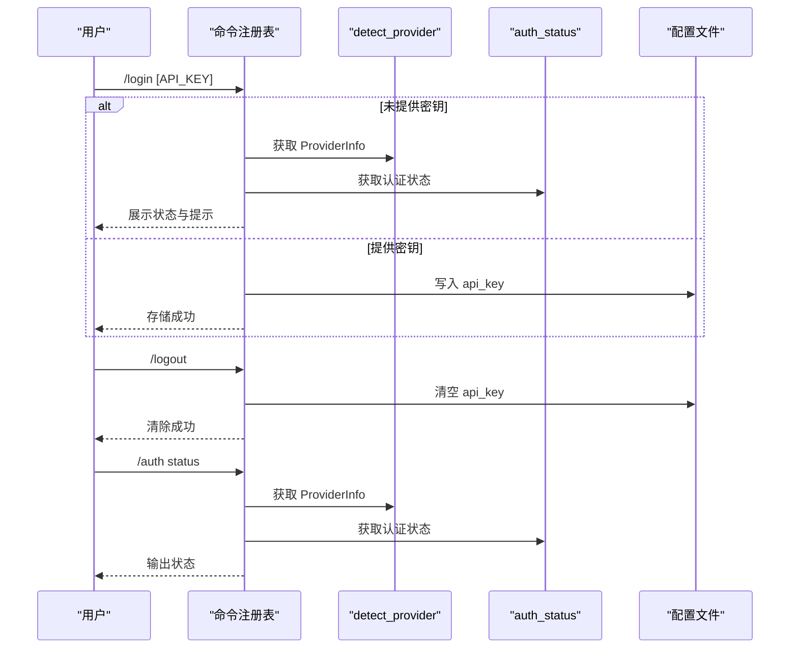
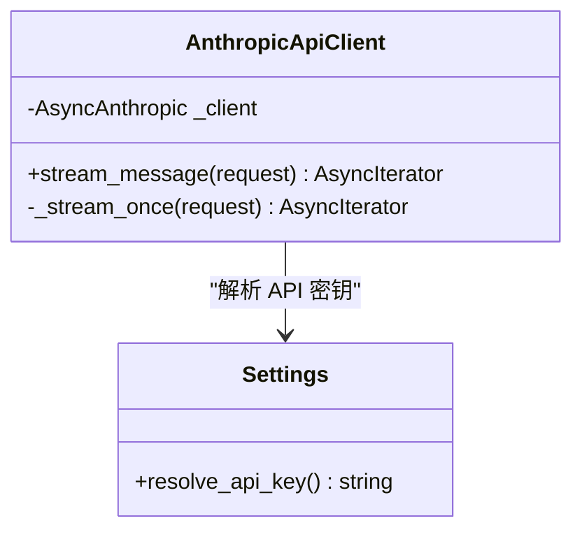
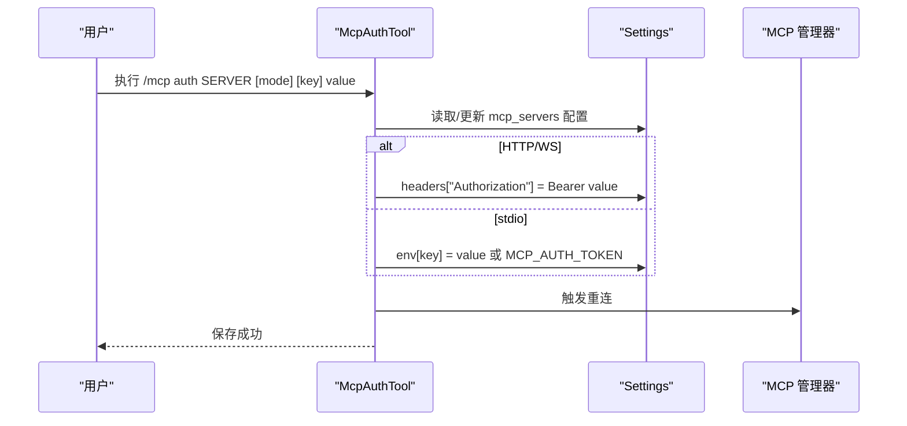
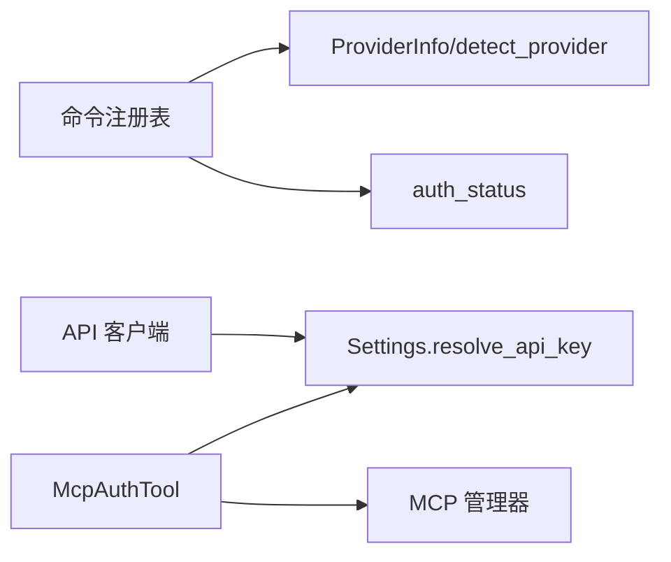

# OAuth 服务

<cite>
**本文引用的文件**
- [src/openharness/api/provider.py](file://src/openharness/api/provider.py)
- [src/openharness/api/client.py](file://src/openharness/api/client.py)
- [src/openharness/config/settings.py](file://src/openharness/config/settings.py)
- [src/openharness/commands/registry.py](file://src/openharness/commands/registry.py)
- [src/openharness/cli.py](file://src/openharness/cli.py)
- [src/openharness/tools/mcp_auth_tool.py](file://src/openharness/tools/mcp_auth_tool.py)
- [tests/test_tools/test_mcp_auth_tool.py](file://tests/test_tools/test_mcp_auth_tool.py)
</cite>

## 目录
1. [简介](#简介)
2. [项目结构](#项目结构)
3. [核心组件](#核心组件)
4. [架构总览](#架构总览)
5. [详细组件分析](#详细组件分析)
6. [依赖分析](#依赖分析)
7. [性能考虑](#性能考虑)
8. [故障排查指南](#故障排查指南)
9. [结论](#结论)
10. [附录](#附录)

## 简介
本文件面向开发者，系统化梳理 OpenHarness 中的“OAuth 服务”能力与相关安全认证机制。当前仓库中并未直接实现标准 OAuth 授权码流程（如授权码获取、令牌交换、刷新与撤销）。但项目提供了与第三方服务访问、API 密钥管理、用户授权状态展示以及 MCP 服务器认证集成紧密相关的基础设施与工具。本文将围绕以下主题展开：
- OAuth 在 OpenHarness 中的安全认证定位：以 API 密钥为主流的认证方式；在 MCP 场景下通过“Bearer Token”或环境变量进行访问控制。
- 核心认证流程与状态：登录/登出、认证状态检测、UI 展示与命令行交互。
- 支持的认证提供方与兼容性：基于基础 URL 与模型名称推断提供方类型与认证方式。
- 安全考虑与最佳实践：密钥存储、过期处理、撤销与最小权限原则。
- 与其他系统组件的集成：API 客户端、MCP 服务器、权限检查与前端 UI。

## 项目结构
与 OAuth/认证相关的核心模块分布如下：
- 配置与设置：集中于配置模型与加载逻辑，包含 API 密钥解析与持久化。
- 提供方与认证状态：提供方检测与认证状态字符串生成。
- 命令注册与 CLI：登录/登出、认证状态查询等命令入口。
- API 客户端：对上游服务的调用封装与错误翻译。
- MCP 认证工具：为 MCP 服务器持久化认证参数（头或环境变量），并触发重连。

图表来源
- [src/openharness/config/settings.py:49-96](file://src/openharness/config/settings.py#L49-L96)
- [src/openharness/api/provider.py:20-65](file://src/openharness/api/provider.py#L20-L65)
- [src/openharness/commands/registry.py:691-722](file://src/openharness/commands/registry.py#L691-L722)
- [src/openharness/cli.py:135-143](file://src/openharness/cli.py#L135-L143)
- [src/openharness/api/client.py:98-186](file://src/openharness/api/client.py#L98-L186)
- [src/openharness/tools/mcp_auth_tool.py:21-31](file://src/openharness/tools/mcp_auth_tool.py#L21-L31)

章节来源
- [src/openharness/config/settings.py:49-161](file://src/openharness/config/settings.py#L49-L161)
- [src/openharness/api/provider.py:10-65](file://src/openharness/api/provider.py#L10-L65)
- [src/openharness/commands/registry.py:691-722](file://src/openharness/commands/registry.py#L691-L722)
- [src/openharness/cli.py:135-143](file://src/openharness/cli.py#L135-L143)
- [src/openharness/api/client.py:98-186](file://src/openharness/api/client.py#L98-L186)
- [src/openharness/tools/mcp_auth_tool.py:21-31](file://src/openharness/tools/mcp_auth_tool.py#L21-L31)

## 核心组件
- 配置与设置（Settings）
  - 负责 API 密钥解析与持久化，支持环境变量覆盖与文件存储。
  - 关键字段：api_key、model、base_url 等。
  - 解析优先级：实例值 > 环境变量 > 配置文件 > 默认值。
- 提供方与认证状态（ProviderInfo、detect_provider、auth_status）
  - detect_provider：根据 base_url 与 model 推断提供方类型与认证方式（如 api_key、aws、gcp）。
  - auth_status：返回“已配置/缺失”的简要状态字符串。
- 命令与 CLI（登录/登出、认证状态）
  - /login：存储 API 密钥到配置文件。
  - /logout：清空存储的 API 密钥。
  - /auth status：显示提供方与认证状态。
- API 客户端（AnthropicApiClient）
  - 对上游 API 的封装，内置重试与错误翻译，区分认证失败等不可重试异常。
- MCP 认证工具（McpAuthTool）
  - 将认证模式（bearer/env/header）与值写入配置，支持 HTTP/WS 与 stdio 两类 MCP 服务器。
  - 触发 MCP 管理器重连，确保新凭据生效。

章节来源
- [src/openharness/config/settings.py:49-96](file://src/openharness/config/settings.py#L49-L96)
- [src/openharness/api/provider.py:20-65](file://src/openharness/api/provider.py#L20-L65)
- [src/openharness/commands/registry.py:691-722](file://src/openharness/commands/registry.py#L691-L722)
- [src/openharness/api/client.py:98-186](file://src/openharness/api/client.py#L98-L186)
- [src/openharness/tools/mcp_auth_tool.py:21-31](file://src/openharness/tools/mcp_auth_tool.py#L21-L31)

## 架构总览
下图展示了认证相关的关键交互路径：从命令行到配置、再到 API 客户端与 MCP 工具的调用链路。

图表来源
- [src/openharness/commands/registry.py:691-722](file://src/openharness/commands/registry.py#L691-L722)
- [src/openharness/config/settings.py:76-96](file://src/openharness/config/settings.py#L76-L96)
- [src/openharness/api/client.py:98-186](file://src/openharness/api/client.py#L98-L186)
- [src/openharness/tools/mcp_auth_tool.py:28-51](file://src/openharness/tools/mcp_auth_tool.py#L28-L51)

## 详细组件分析

### 组件一：配置与设置（Settings）
- 数据结构与职责
  - 包含 api_key、base_url、model 等字段，用于上游服务访问。
  - 提供 resolve_api_key：按优先级解析密钥，缺失时抛出异常。
  - 提供 load_settings/save_settings：从默认位置读取/写入 JSON 配置。
- 复杂度与性能
  - 加载/保存为 O(n)（n 为配置项数量），I/O 成本主导。
- 错误处理
  - 未找到密钥时抛出异常，提示设置环境变量或配置文件。
- 优化建议
  - 对频繁读取的配置可引入缓存；对大配置文件可分段读取。

图表来源
- [src/openharness/config/settings.py:49-96](file://src/openharness/config/settings.py#L49-L96)

章节来源
- [src/openharness/config/settings.py:49-161](file://src/openharness/config/settings.py#L49-L161)

### 组件二：提供方与认证状态（ProviderInfo、detect_provider、auth_status）
- 功能概述
  - detect_provider：根据 base_url 与 model 推断提供方名称与认证方式（api_key/aws/gcp），并给出语音能力说明。
  - auth_status：返回“configured/missing”，便于 UI 与命令行展示。
- 使用场景
  - 登录/登出命令中用于展示当前提供方与认证状态。
  - CLI 子命令 auth status 直接调用 auth_status 输出状态。

图表来源
- [src/openharness/api/provider.py:20-57](file://src/openharness/api/provider.py#L20-L57)

章节来源
- [src/openharness/api/provider.py:10-65](file://src/openharness/api/provider.py#L10-L65)
- [src/openharness/cli.py:135-143](file://src/openharness/cli.py#L135-L143)

### 组件三：命令与 CLI（登录/登出、认证状态）
- /login
  - 若未提供密钥则展示当前状态与提示；否则写入配置文件。
- /logout
  - 清空存储的 API 密钥。
- /auth status
  - 调用 detect_provider 与 auth_status，输出提供方与认证状态。

图表来源
- [src/openharness/commands/registry.py:691-722](file://src/openharness/commands/registry.py#L691-L722)
- [src/openharness/api/provider.py:20-65](file://src/openharness/api/provider.py#L20-L65)

章节来源
- [src/openharness/commands/registry.py:691-722](file://src/openharness/commands/registry.py#L691-L722)
- [src/openharness/cli.py:135-143](file://src/openharness/cli.py#L135-L143)

### 组件四：API 客户端（AnthropicApiClient）
- 功能概述
  - 封装上游 API 调用，支持流式事件与重试。
  - 对认证失败等不可重试错误进行区分与翻译。
- 关键点
  - 重试策略：指数退避+抖动，尊重 Retry-After。
  - 错误翻译：将上游认证/限流/请求错误映射为统一错误类型。
  - 依赖 Settings.resolve_api_key 获取密钥。

图表来源
- [src/openharness/api/client.py:98-186](file://src/openharness/api/client.py#L98-L186)
- [src/openharness/config/settings.py:76-96](file://src/openharness/config/settings.py#L76-L96)

章节来源
- [src/openharness/api/client.py:98-186](file://src/openharness/api/client.py#L98-L186)
- [src/openharness/config/settings.py:76-96](file://src/openharness/config/settings.py#L76-L96)

### 组件五：MCP 认证工具（McpAuthTool）
- 功能概述
  - 将认证模式（bearer/env/header）与值写入配置，支持 HTTP/WS 与 stdio 两类 MCP 服务器。
  - 可从活动管理器获取现有配置，自动注入并触发重连。
- 测试验证
  - 验证 HTTP/WS 通过 Authorization 头注入 Bearer Token。
  - 验证 stdio 通过环境变量注入。
  - 验证从管理器种子配置启动后自动注入。

图表来源
- [src/openharness/tools/mcp_auth_tool.py:28-51](file://src/openharness/tools/mcp_auth_tool.py#L28-L51)
- [tests/test_tools/test_mcp_auth_tool.py:35-101](file://tests/test_tools/test_mcp_auth_tool.py#L35-L101)

章节来源
- [src/openharness/tools/mcp_auth_tool.py:21-31](file://src/openharness/tools/mcp_auth_tool.py#L21-L31)
- [tests/test_tools/test_mcp_auth_tool.py:35-101](file://tests/test_tools/test_mcp_auth_tool.py#L35-L101)

## 依赖分析
- 组件耦合
  - 命令注册表依赖 ProviderInfo 与 auth_status 进行状态展示。
  - API 客户端依赖 Settings.resolve_api_key 获取密钥。
  - MCP 认证工具依赖 Settings 与 MCP 管理器进行配置持久化与重连。
- 外部依赖
  - 上游 API SDK（用于流式消息与错误类型）。
  - 文件系统（配置文件读写）。
- 循环依赖
  - 当前模块间无明显循环导入。

图表来源
- [src/openharness/commands/registry.py:691-722](file://src/openharness/commands/registry.py#L691-L722)
- [src/openharness/api/provider.py:20-65](file://src/openharness/api/provider.py#L20-L65)
- [src/openharness/api/client.py:98-186](file://src/openharness/api/client.py#L98-L186)
- [src/openharness/tools/mcp_auth_tool.py:28-51](file://src/openharness/tools/mcp_auth_tool.py#L28-L51)

章节来源
- [src/openharness/commands/registry.py:691-722](file://src/openharness/commands/registry.py#L691-L722)
- [src/openharness/api/provider.py:20-65](file://src/openharness/api/provider.py#L20-L65)
- [src/openharness/api/client.py:98-186](file://src/openharness/api/client.py#L98-L186)
- [src/openharness/tools/mcp_auth_tool.py:28-51](file://src/openharness/tools/mcp_auth_tool.py#L28-L51)

## 性能考虑
- 配置读写
  - 配置文件 I/O 为瓶颈，建议在高频场景下引入内存缓存与批量写入。
- API 调用
  - 重试策略采用指数退避与抖动，避免雪崩；合理设置最大延迟与最大重试次数。
- MCP 认证
  - 重连操作可能带来额外开销，应避免频繁变更认证参数。

## 故障排查指南
- 无法解析 API 密钥
  - 现象：调用 API 时抛出“未找到 API 密钥”异常。
  - 排查：确认环境变量或配置文件是否设置；使用 /auth status 查看状态。
- 认证失败
  - 现象：上游返回认证错误。
  - 排查：检查密钥有效性与提供方兼容性；确认 base_url 与 model 是否符合预期。
- MCP 认证不生效
  - 现象：修改认证后连接仍失败。
  - 排查：确认 /mcp auth 的模式与键名是否正确；检查是否触发了重连；查看配置文件中 headers/env 是否更新。

章节来源
- [src/openharness/config/settings.py:76-96](file://src/openharness/config/settings.py#L76-L96)
- [src/openharness/api/client.py:179-186](file://src/openharness/api/client.py#L179-L186)
- [src/openharness/tools/mcp_auth_tool.py:28-51](file://src/openharness/tools/mcp_auth_tool.py#L28-L51)

## 结论
- 当前 OpenHarness 的 OAuth 实现以“API 密钥”为核心，结合提供方检测与认证状态展示，满足大多数第三方服务访问场景。
- 在 MCP 场景下，通过“Bearer Token”或环境变量实现访问控制，具备良好的可扩展性。
- 若需引入标准 OAuth 授权码流程，可在现有配置与命令体系上扩展，新增授权码获取、令牌交换与刷新逻辑，并与 Settings 与 CLI 集成。

## 附录
- 使用指南（基于现有能力）
  - 设置 API 密钥：执行 /login [API_KEY]；或设置环境变量 ANTHROPIC_API_KEY。
  - 查看认证状态：执行 /auth status。
  - 清除密钥：执行 /logout。
  - 配置 MCP 认证：执行 /mcp auth SERVER [bearer|env|header] [KEY] VALUE。
- 安全最佳实践
  - 密钥存储：优先使用环境变量或受控配置文件；避免硬编码。
  - 最小权限：仅授予必要权限的密钥；定期轮换。
  - 过期处理：在上游密钥到期前主动轮换；在客户端捕获认证错误并提示用户。
  - 撤销机制：提供登出/清除密钥命令；在 MCP 场景下及时断开并清理认证参数。