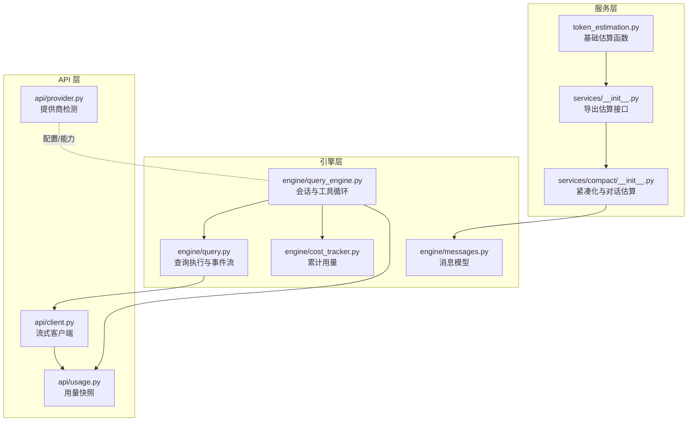
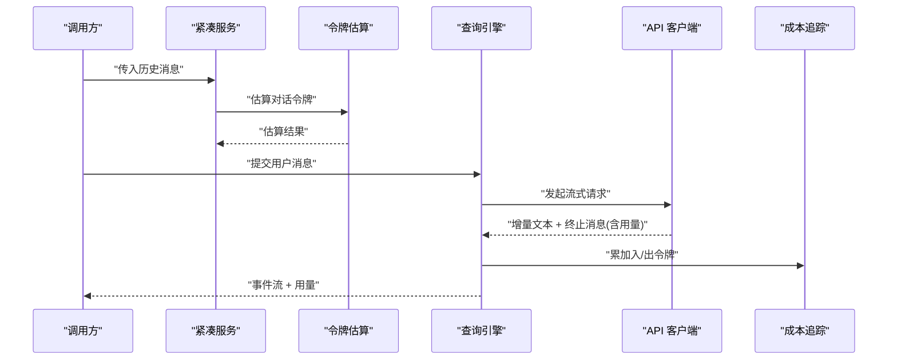
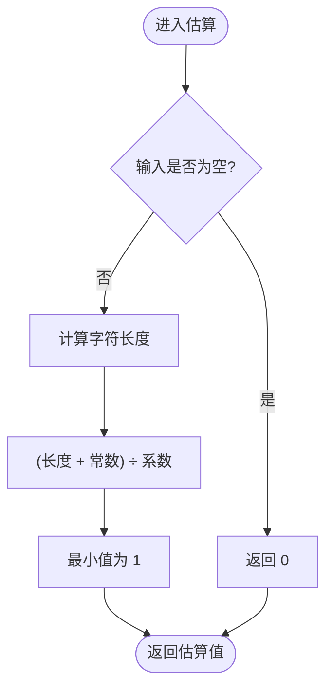
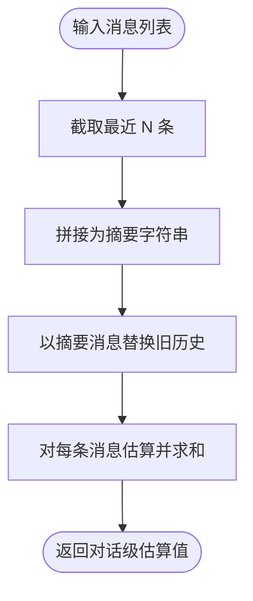
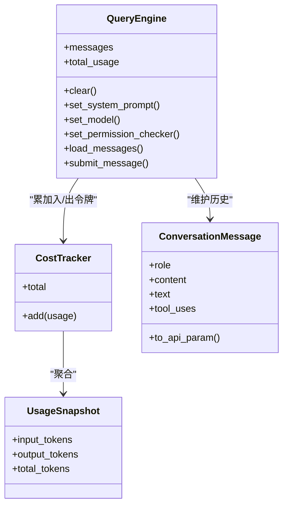
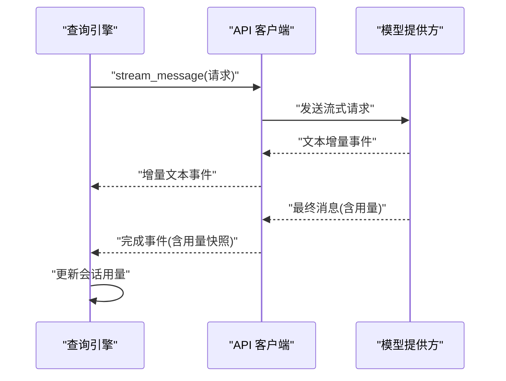
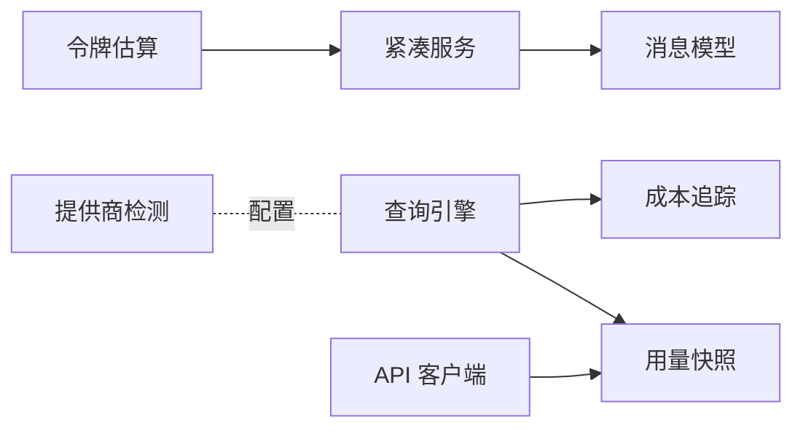

# 令牌估算服务

<cite>
**本文引用的文件**
- [token_estimation.py](file://src/openharness/services/token_estimation.py)
- [__init__.py（服务模块）](file://src/openharness/services/__init__.py)
- [__init__.py（紧凑服务）](file://src/openharness/services/compact/__init__.py)
- [test_compact.py](file://tests/test_services/test_compact.py)
- [cost_tracker.py](file://src/openharness/engine/cost_tracker.py)
- [usage.py](file://src/openharness/api/usage.py)
- [query_engine.py](file://src/openharness/engine/query_engine.py)
- [query.py](file://src/openharness/engine/query.py)
- [messages.py](file://src/openharness/engine/messages.py)
- [client.py](file://src/openharness/api/client.py)
- [provider.py](file://src/openharness/api/provider.py)
- [README.md](file://README.md)
</cite>

## 目录
1. [简介](#简介)
2. [项目结构](#项目结构)
3. [核心组件](#核心组件)
4. [架构总览](#架构总览)
5. [详细组件分析](#详细组件分析)
6. [依赖分析](#依赖分析)
7. [性能考虑](#性能考虑)
8. [故障排查指南](#故障排查指南)
9. [结论](#结论)
10. [附录](#附录)

## 简介
本文件系统性阐述 OpenHarness 中“令牌估算服务”的设计与实现，重点覆盖以下方面：
- 令牌估算在 LLM 对话中的价值：成本控制、性能优化、资源管理
- 估算算法实现原理：文本预处理、分词策略、不同模型的估算差异
- 估算精度保障机制：与实际 API 调用的对比验证、误差范围控制、动态调整策略
- 性能优化措施：缓存机制、批量估算、异步处理
- 与引擎系统的集成：与查询引擎、成本追踪、消息模型的协作
- 使用示例与配置指南：如何正确使用与扩展该服务

## 项目结构
令牌估算服务位于服务层，提供基础估算能力，并被紧凑服务复用；同时与引擎层的成本追踪、消息模型、API 客户端协同工作。

图表来源
- [token_estimation.py:1-16](file://src/openharness/services/token_estimation.py#L1-L16)
- [__init__.py（服务模块）:1-27](file://src/openharness/services/__init__.py#L1-L27)
- [__init__.py（紧凑服务）:1-58](file://src/openharness/services/compact/__init__.py#L1-L58)
- [query_engine.py:1-101](file://src/openharness/engine/query_engine.py#L1-L101)
- [query.py:1-212](file://src/openharness/engine/query.py#L1-L212)
- [cost_tracker.py:1-25](file://src/openharness/engine/cost_tracker.py#L1-L25)
- [messages.py:1-109](file://src/openharness/engine/messages.py#L1-L109)
- [client.py:1-186](file://src/openharness/api/client.py#L1-L186)
- [usage.py:1-18](file://src/openharness/api/usage.py#L1-L18)
- [provider.py:1-66](file://src/openharness/api/provider.py#L1-L66)

章节来源
- [token_estimation.py:1-16](file://src/openharness/services/token_estimation.py#L1-L16)
- [__init__.py（服务模块）:1-27](file://src/openharness/services/__init__.py#L1-L27)
- [__init__.py（紧凑服务）:1-58](file://src/openharness/services/compact/__init__.py#L1-L58)
- [query_engine.py:1-101](file://src/openharness/engine/query_engine.py#L1-L101)
- [query.py:1-212](file://src/openharness/engine/query.py#L1-L212)
- [cost_tracker.py:1-25](file://src/openharness/engine/cost_tracker.py#L1-L25)
- [messages.py:1-109](file://src/openharness/engine/messages.py#L1-L109)
- [client.py:1-186](file://src/openharness/api/client.py#L1-L186)
- [usage.py:1-18](file://src/openharness/api/usage.py#L1-L18)
- [provider.py:1-66](file://src/openharness/api/provider.py#L1-L66)

## 核心组件
- 基础估算函数
  - 文本级估算：基于字符长度的启发式规则，返回整数级令牌数
  - 消息集合估算：对多条消息分别估算后求和
- 紧凑服务
  - 对历史消息进行压缩，保留近期消息，用摘要替代旧消息
  - 对压缩后的消息进行对话级令牌估算
- 成本追踪
  - 在每次对话回合结束后聚合输入/输出令牌用量
- API 客户端与用量快照
  - 从模型调用中提取实际用量，封装为用量快照对象
- 查询引擎
  - 将用量快照写入成本追踪器，供会话生命周期内累计统计

章节来源
- [token_estimation.py:6-16](file://src/openharness/services/token_estimation.py#L6-L16)
- [__init__.py（紧凑服务）:48-51](file://src/openharness/services/compact/__init__.py#L48-L51)
- [cost_tracker.py:8-25](file://src/openharness/engine/cost_tracker.py#L8-L25)
- [usage.py:8-18](file://src/openharness/api/usage.py#L8-L18)
- [query_engine.py:96-100](file://src/openharness/engine/query_engine.py#L96-L100)

## 架构总览
令牌估算贯穿“服务层 → 引擎层 → API 层”的数据流，形成“估算 → 执行 → 记账”的闭环。

图表来源
- [__init__.py（紧凑服务）:48-51](file://src/openharness/services/compact/__init__.py#L48-L51)
- [token_estimation.py:6-16](file://src/openharness/services/token_estimation.py#L6-L16)
- [query_engine.py:96-100](file://src/openharness/engine/query_engine.py#L96-L100)
- [client.py:107-176](file://src/openharness/api/client.py#L107-L176)
- [cost_tracker.py:14-19](file://src/openharness/engine/cost_tracker.py#L14-L19)

## 详细组件分析

### 基础估算算法与实现
- 文本预处理
  - 输入为空时直接返回 0
  - 否则按字符长度计算，采用“长度加常数再除以系数”的启发式公式，确保短文本也能得到正数估算值
- 分词策略
  - 当前实现为字符级启发式，不依赖外部分词器或模型字典
  - 适合快速估算与边界检查，不适合高精度预算
- 不同模型的估算差异
  - 由于未引入具体模型的分词器，无法直接反映不同模型的分词差异
  - 可通过后续扩展引入模型特定的分词器或映射表

图表来源
- [token_estimation.py:6-10](file://src/openharness/services/token_estimation.py#L6-L10)

章节来源
- [token_estimation.py:6-16](file://src/openharness/services/token_estimation.py#L6-L16)

### 紧凑服务与对话级估算
- 摘要生成
  - 选取最近若干条消息，拼接为简洁摘要
  - 仅保留非空文本片段，避免噪声干扰
- 历史压缩
  - 用“摘要消息”替换较早的历史，减少上下文长度
- 对话级估算
  - 对压缩后的消息集合进行令牌估算，用于会话窗口控制与预算评估

图表来源
- [__init__.py（紧凑服务）:25-51](file://src/openharness/services/compact/__init__.py#L25-L51)

章节来源
- [__init__.py（紧凑服务）:9-51](file://src/openharness/services/compact/__init__.py#L9-L51)

### 与引擎系统的集成
- 查询引擎
  - 在每次对话回合结束后，接收来自 API 客户端的用量快照
  - 将用量累加到会话级成本追踪器
- 成本追踪
  - 提供输入/输出令牌累计与总令牌访问属性
- 消息模型
  - 通过消息文本字段参与估算，支持多轮对话的上下文压缩

图表来源
- [query_engine.py:18-101](file://src/openharness/engine/query_engine.py#L18-L101)
- [cost_tracker.py:8-25](file://src/openharness/engine/cost_tracker.py#L8-L25)
- [usage.py:8-18](file://src/openharness/api/usage.py#L8-L18)
- [messages.py:39-109](file://src/openharness/engine/messages.py#L39-L109)

章节来源
- [query_engine.py:18-101](file://src/openharness/engine/query_engine.py#L18-L101)
- [cost_tracker.py:8-25](file://src/openharness/engine/cost_tracker.py#L8-L25)
- [usage.py:8-18](file://src/openharness/api/usage.py#L8-L18)
- [messages.py:39-109](file://src/openharness/engine/messages.py#L39-L109)

### 与 API 客户端的用量对接
- 流式事件
  - 客户端在流式响应中产出增量文本事件与最终完成事件
  - 完成事件包含完整助手消息与用量快照
- 错误与重试
  - 对可重试错误采用指数退避与抖动策略
  - 认证失败等错误不重试，直接抛出业务异常
- 用量提取
  - 从最终消息中解析输入/输出令牌用量，构造用量快照对象

图表来源
- [client.py:107-176](file://src/openharness/api/client.py#L107-L176)
- [query.py:75-83](file://src/openharness/engine/query.py#L75-L83)
- [query_engine.py:96-100](file://src/openharness/engine/query_engine.py#L96-L100)

章节来源
- [client.py:107-176](file://src/openharness/api/client.py#L107-L176)
- [query.py:75-83](file://src/openharness/engine/query.py#L75-L83)
- [query_engine.py:96-100](file://src/openharness/engine/query_engine.py#L96-L100)

### 估算精度保障机制
- 与实际 API 的对比验证
  - 通过测试用例验证基础估算行为，确保空串与小文本的边界条件正确
- 误差范围控制
  - 当前估算为字符级启发式，误差可能较大；建议在关键预算场景引入更精确的分词器
- 动态调整策略
  - 可根据历史用量与估算偏差，动态调整启发式参数或切换到模型特定估算

章节来源
- [test_compact.py:15-18](file://tests/test_services/test_compact.py#L15-L18)

## 依赖分析
- 低耦合高内聚
  - 令牌估算服务仅依赖消息文本字段，与模型细节解耦
- 关键依赖链
  - 紧凑服务依赖令牌估算函数
  - 查询引擎依赖成本追踪器与用量快照
  - API 客户端依赖用量快照与消息模型
- 外部依赖
  - 提供商检测用于配置与能力判断，间接影响令牌估算的使用场景

图表来源
- [__init__.py（紧凑服务）:6](file://src/openharness/services/compact/__init__.py#L6)
- [query_engine.py:48](file://src/openharness/engine/query_engine.py#L48)
- [cost_tracker.py:12](file://src/openharness/engine/cost_tracker.py#L12)
- [client.py:18](file://src/openharness/api/client.py#L18)
- [provider.py:20-57](file://src/openharness/api/provider.py#L20-L57)

章节来源
- [__init__.py（紧凑服务）:6](file://src/openharness/services/compact/__init__.py#L6)
- [query_engine.py:48](file://src/openharness/engine/query_engine.py#L48)
- [cost_tracker.py:12](file://src/openharness/engine/cost_tracker.py#L12)
- [client.py:18](file://src/openharness/api/client.py#L18)
- [provider.py:20-57](file://src/openharness/api/provider.py#L20-L57)

## 性能考虑
- 缓存机制
  - 对于重复出现的固定提示词或模板，可缓存其估算结果，减少重复计算
- 批量估算
  - 在日志或摘要阶段，对多条消息进行批量估算，降低调用次数
- 异步处理
  - 在高并发场景下，将估算任务放入线程池或异步队列，避免阻塞主事件循环
- 精度与速度权衡
  - 字符级启发式开销极低；若预算敏感，可引入轻量分词器或模型映射表

## 故障排查指南
- 估算结果异常偏大/偏小
  - 检查输入文本是否包含不可见字符或特殊编码
  - 确认是否混用了不同模型的上下文格式
- 用量与估算不一致
  - 确认是否正确在每回合结束后累加入/出令牌
  - 核对 API 返回的用量字段是否为空或缺失
- 重试与超时
  - 若出现网络波动导致的重试，请检查客户端的重试策略与退避参数
- 权限与配额
  - 某些提供商可能限制请求频率或额度，需结合提供商检测与配置进行调整

章节来源
- [client.py:67-95](file://src/openharness/api/client.py#L67-L95)
- [client.py:111-136](file://src/openharness/api/client.py#L111-L136)
- [provider.py:20-57](file://src/openharness/api/provider.py#L20-L57)

## 结论
令牌估算服务以轻量的字符级启发式为核心，提供了低成本、易集成的估算能力，并与引擎层的成本追踪、消息模型、API 客户端形成闭环。在日常开发与调试中，它能够有效支撑会话压缩、预算粗估与资源管理；对于高精度预算需求，建议引入模型特定的分词器或映射表，并辅以误差校准与动态调整策略。

## 附录

### 使用示例与配置指南
- 导入与使用
  - 从服务模块导入估算函数，用于单条消息或消息集合的估算
  - 在紧凑服务中使用对话级估算，辅助历史压缩
- 配置要点
  - 根据提供商与模型选择合适的基座 URL 与模型标识
  - 在查询引擎中设置最大令牌数与系统提示词，以控制上下文长度
- 最佳实践
  - 在会话开始时先估算当前上下文，若接近阈值则触发压缩
  - 对关键操作（如长文档处理）单独记录实际用量，与估算对比以校准误差

章节来源
- [__init__.py（服务模块）:14](file://src/openharness/services/__init__.py#L14)
- [__init__.py（紧凑服务）:48-51](file://src/openharness/services/compact/__init__.py#L48-L51)
- [provider.py:20-57](file://src/openharness/api/provider.py#L20-L57)
- [query_engine.py:21-47](file://src/openharness/engine/query_engine.py#L21-L47)
- [README.md:82-124](file://README.md#L82-L124)