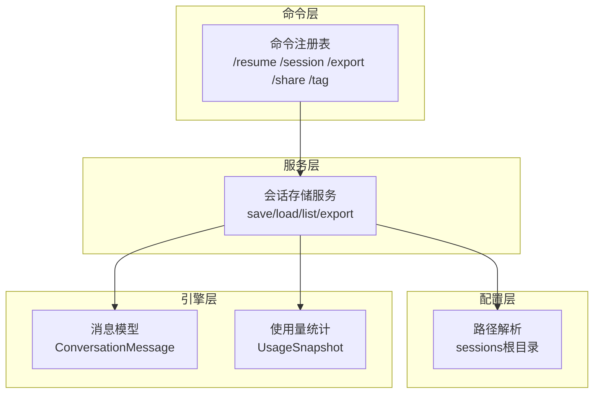
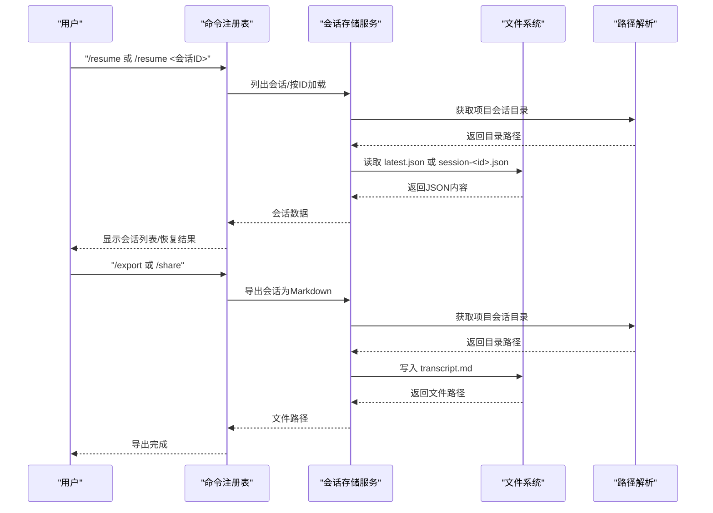
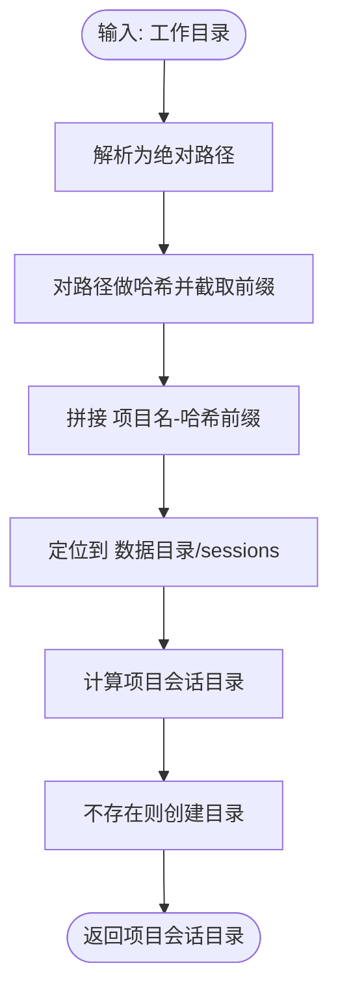
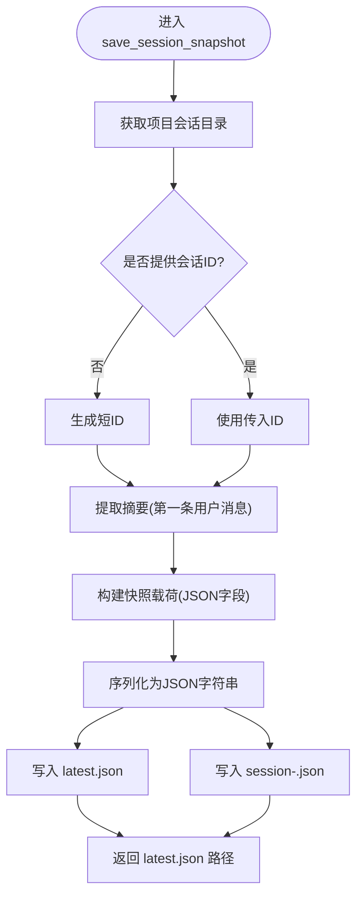
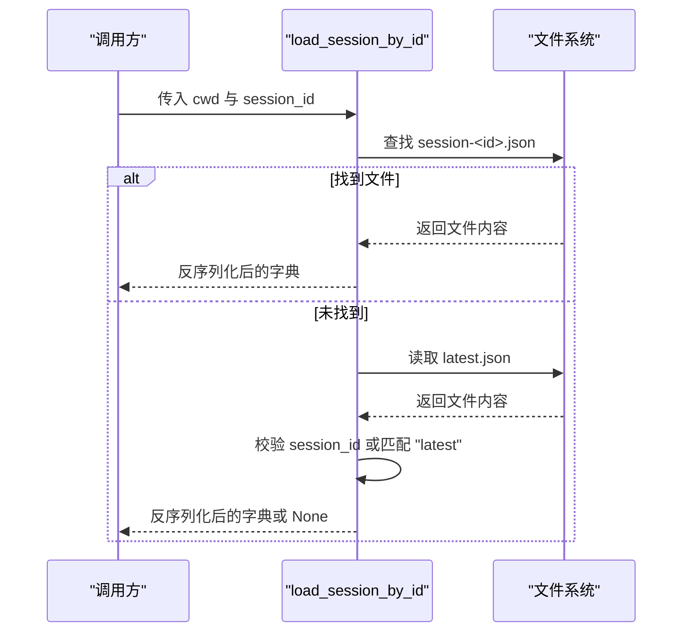
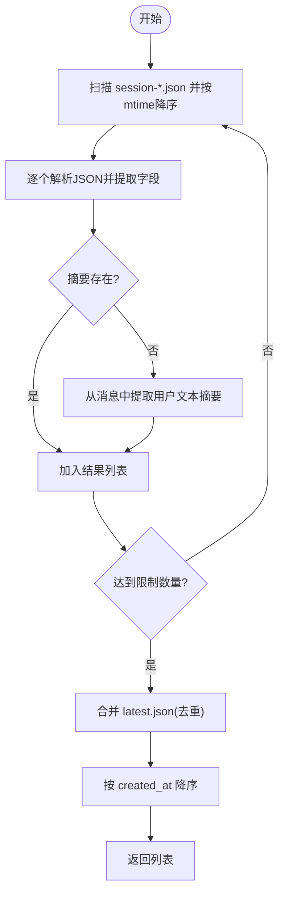
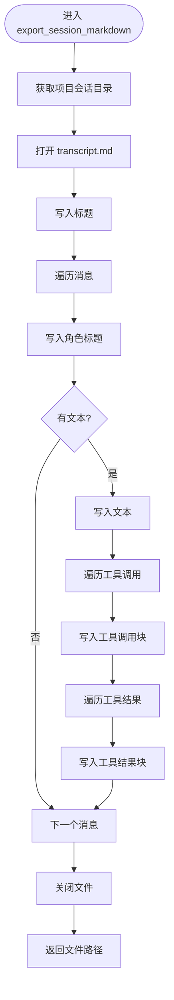
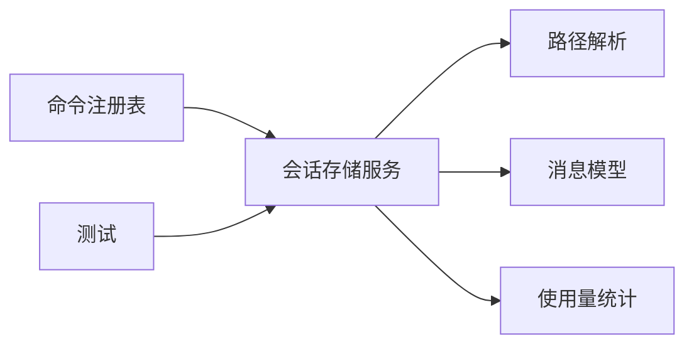

# 会话存储服务

<cite>
**本文引用的文件**
- [session_storage.py](file://src/openharness/services/session_storage.py)
- [paths.py](file://src/openharness/config/paths.py)
- [messages.py](file://src/openharness/engine/messages.py)
- [usage.py](file://src/openharness/api/usage.py)
- [registry.py](file://src/openharness/commands/registry.py)
- [test_session_storage.py](file://tests/test_services/test_session_storage.py)
</cite>

## 目录
1. [简介](#简介)
2. [项目结构](#项目结构)
3. [核心组件](#核心组件)
4. [架构总览](#架构总览)
5. [详细组件分析](#详细组件分析)
6. [依赖关系分析](#依赖关系分析)
7. [性能考虑](#性能考虑)
8. [故障排查指南](#故障排查指南)
9. [结论](#结论)
10. [附录](#附录)

## 简介
本文件系统性地阐述会话存储服务的设计与实现，覆盖项目级会话管理、数据结构设计、文件组织策略、会话快照保存与加载、会话列表管理、Markdown 导出、最佳实践（性能优化、数据备份、迁移策略）等内容。目标是帮助开发者与使用者在不深入源码的情况下，也能高效理解并正确使用会话存储能力。

## 项目结构
会话存储服务位于后端服务层，围绕“按项目隔离”的目录结构进行组织，并通过命令系统与用户交互。关键模块如下：
- 服务层：会话存储服务，负责快照保存、加载、列表与导出
- 配置层：路径解析，确定会话根目录
- 引擎层：消息模型与使用量统计，作为快照内容的一部分
- 命令层：对外暴露 /resume、/session、/export、/share、/tag 等命令，驱动会话存储服务

图表来源
- [registry.py:360-468](file://src/openharness/commands/registry.py#L360-L468)
- [session_storage.py:17-178](file://src/openharness/services/session_storage.py#L17-L178)
- [paths.py:71-75](file://src/openharness/config/paths.py#L71-L75)
- [messages.py:39-109](file://src/openharness/engine/messages.py#L39-L109)
- [usage.py:8-18](file://src/openharness/api/usage.py#L8-L18)

章节来源
- [session_storage.py:17-178](file://src/openharness/services/session_storage.py#L17-L178)
- [paths.py:71-75](file://src/openharness/config/paths.py#L71-L75)
- [messages.py:39-109](file://src/openharness/engine/messages.py#L39-L109)
- [usage.py:8-18](file://src/openharness/api/usage.py#L8-L18)
- [registry.py:360-468](file://src/openharness/commands/registry.py#L360-L468)

## 核心组件
- 项目会话目录：为每个工作目录生成稳定且唯一的会话目录，避免跨项目冲突
- 快照保存：同时写入“最新快照”和“按ID命名”的快照，便于快速恢复与长期归档
- 快照加载：支持从“最新快照”或指定ID加载
- 会话列表：列出最近若干个会话，包含摘要、消息数、模型与时间戳
- Markdown 导出：将对话转录为可分享的 Markdown 文档
- 路径解析：遵循 XDG 类约定，支持环境变量覆盖

章节来源
- [session_storage.py:17-178](file://src/openharness/services/session_storage.py#L17-L178)
- [paths.py:71-75](file://src/openharness/config/paths.py#L71-L75)

## 架构总览
下图展示了命令层如何调用会话存储服务，以及会话存储服务如何与路径解析、消息与使用量模型协作：

图表来源
- [registry.py:360-468](file://src/openharness/commands/registry.py#L360-L468)
- [session_storage.py:70-178](file://src/openharness/services/session_storage.py#L70-L178)
- [paths.py:71-75](file://src/openharness/config/paths.py#L71-L75)

## 详细组件分析

### 项目级会话管理与目录组织
- 按项目生成目录：对工作目录路径做哈希截断，结合项目名生成稳定目录名，避免跨项目冲突
- 目录创建：自动创建缺失目录
- 会话根目录：位于数据目录下的 sessions 子目录，可通过环境变量覆盖数据根目录

图表来源
- [session_storage.py:17-23](file://src/openharness/services/session_storage.py#L17-L23)
- [paths.py:71-75](file://src/openharness/config/paths.py#L71-L75)

章节来源
- [session_storage.py:17-23](file://src/openharness/services/session_storage.py#L17-L23)
- [paths.py:71-75](file://src/openharness/config/paths.py#L71-L75)

### 会话快照保存机制（save_session_snapshot）
- 输入参数：工作目录、模型名、系统提示词、消息列表、使用量快照、可选会话ID
- 摘要提取：从第一条非空用户消息中提取前80字符作为摘要
- 序列化：消息与使用量均通过 Pydantic 的 model_dump 进行序列化
- 文件写入：同时写入 latest.json 与 session-<id>.json
- 时间戳：记录创建时间；消息计数：基于消息列表长度
- 返回值：返回 latest.json 的路径

图表来源
- [session_storage.py:26-67](file://src/openharness/services/session_storage.py#L26-L67)
- [messages.py:39-67](file://src/openharness/engine/messages.py#L39-L67)
- [usage.py:8-18](file://src/openharness/api/usage.py#L8-L18)

章节来源
- [session_storage.py:26-67](file://src/openharness/services/session_storage.py#L26-L67)
- [messages.py:39-67](file://src/openharness/engine/messages.py#L39-L67)
- [usage.py:8-18](file://src/openharness/api/usage.py#L8-L18)

### 会话加载功能
- 加载最新快照：load_session_snapshot 读取 latest.json 并反序列化
- 按ID加载：load_session_by_id 支持 session-<id>.json 或当 session_id 为 "latest" 时回退到 latest.json

图表来源
- [session_storage.py:141-154](file://src/openharness/services/session_storage.py#L141-L154)

章节来源
- [session_storage.py:70-75](file://src/openharness/services/session_storage.py#L70-L75)
- [session_storage.py:141-154](file://src/openharness/services/session_storage.py#L141-L154)

### 会话列表管理（list_session_snapshots）
- 列表来源：扫描 session-*.json 文件，按修改时间降序排序
- 摘要生成：优先使用已存储摘要；若为空，则从消息内容中提取第一条用户消息文本的前80字符
- 字段包含：会话ID、摘要、消息数、模型、创建时间
- 分页与过滤：限制返回数量，默认20；仅返回最新项
- 合并 latest.json：若 latest.json 未对应任何 session-*.json，也会纳入列表一次

图表来源
- [session_storage.py:78-138](file://src/openharness/services/session_storage.py#L78-L138)

章节来源
- [session_storage.py:78-138](file://src/openharness/services/session_storage.py#L78-L138)

### Markdown 导出（export_session_markdown）
- 输出文件：transcript.md
- 格式化：标题、角色分节、正文、工具调用块、工具结果块
- 工具块渲染：工具调用以代码块形式输出，工具结果以独立代码块输出
- 编码：UTF-8

图表来源
- [session_storage.py:157-177](file://src/openharness/services/session_storage.py#L157-L177)

章节来源
- [session_storage.py:157-177](file://src/openharness/services/session_storage.py#L157-L177)

### 命令集成与使用场景
- /resume：列出会话或按ID恢复；若无保存会话则回退到 latest.json
- /session：显示会话目录状态、列出文件、打印路径、清理会话存储
- /export /share：导出当前会话转录为 Markdown
- /tag：将当前会话保存为带名称的快照与 Markdown

章节来源
- [registry.py:360-468](file://src/openharness/commands/registry.py#L360-L468)
- [test_session_storage.py:17-55](file://tests/test_services/test_session_storage.py#L17-L55)

## 依赖关系分析
- 会话存储服务依赖：
  - 路径解析：用于确定会话根目录
  - 消息模型：用于序列化对话内容
  - 使用量统计：用于序列化 token 使用情况
- 命令层依赖会话存储服务：提供用户交互入口
- 测试覆盖：验证快照保存/加载与 Markdown 导出的基本行为

图表来源
- [registry.py:360-468](file://src/openharness/commands/registry.py#L360-L468)
- [session_storage.py:17-178](file://src/openharness/services/session_storage.py#L17-L178)
- [paths.py:71-75](file://src/openharness/config/paths.py#L71-L75)
- [messages.py:39-109](file://src/openharness/engine/messages.py#L39-L109)
- [usage.py:8-18](file://src/openharness/api/usage.py#L8-L18)
- [test_session_storage.py:9-14](file://tests/test_services/test_session_storage.py#L9-L14)

章节来源
- [session_storage.py:17-178](file://src/openharness/services/session_storage.py#L17-L178)
- [paths.py:71-75](file://src/openharness/config/paths.py#L71-L75)
- [messages.py:39-109](file://src/openharness/engine/messages.py#L39-L109)
- [usage.py:8-18](file://src/openharness/api/usage.py#L8-L18)
- [registry.py:360-468](file://src/openharness/commands/registry.py#L360-L468)
- [test_session_storage.py:9-14](file://tests/test_services/test_session_storage.py#L9-L14)

## 性能考虑
- I/O 模式：所有操作均为本地文件读写，适合小到中型会话；大规模会话建议控制消息数量与附件大小
- JSON 解析：列表与加载均采用一次性读取与解析，复杂度与消息数量线性相关
- 目录扫描：按修改时间排序，适合频繁快照场景；若会话数量巨大，可考虑索引或数据库化
- 编码与序列化：统一 UTF-8 与 Pydantic dump，减少兼容性问题
- 建议：
  - 对超长会话进行定期归档与清理
  - 在高并发场景下增加文件锁或队列控制
  - 将会话目录置于高性能磁盘或SSD

## 故障排查指南
- 无法加载会话
  - 检查项目会话目录是否存在 latest.json 或 session-<id>.json
  - 确认 JSON 格式有效，必要时删除损坏文件后重新保存
- 列表为空
  - 确认会话目录内存在 session-*.json 或 latest.json
  - 检查 limit 参数与过滤条件
- 导出失败
  - 确认会话目录可写
  - 检查消息内容是否包含不可序列化字段
- 环境变量影响
  - OPENHARNESS_DATA_DIR 可覆盖数据根目录，确保权限正确

章节来源
- [session_storage.py:78-138](file://src/openharness/services/session_storage.py#L78-L138)
- [session_storage.py:141-154](file://src/openharness/services/session_storage.py#L141-L154)
- [session_storage.py:157-177](file://src/openharness/services/session_storage.py#L157-L177)
- [paths.py:44-51](file://src/openharness/config/paths.py#L44-L51)

## 结论
会话存储服务以简洁可靠的文件系统方案实现了项目级会话持久化，具备以下优势：
- 清晰的目录组织与稳定的命名规则
- 完整的快照保存、加载、列表与导出能力
- 与命令系统的自然集成，便于用户操作
在实际使用中，建议结合性能与可靠性需求，制定合理的会话生命周期管理策略，并配合备份与迁移流程，确保数据安全与可维护性。

## 附录
- 关键函数与职责速览
  - get_project_session_dir：按项目生成会话目录
  - save_session_snapshot：保存快照并生成摘要
  - load_session_snapshot：加载最新快照
  - load_session_by_id：按ID加载快照
  - list_session_snapshots：列出会话并支持摘要与分页
  - export_session_markdown：导出会话转录为 Markdown
- 命令映射
  - /resume：会话恢复与列表展示
  - /session：会话目录与文件管理
  - /export /share：Markdown 导出
  - /tag：命名快照与 Markdown 备份

章节来源
- [session_storage.py:17-178](file://src/openharness/services/session_storage.py#L17-L178)
- [registry.py:360-468](file://src/openharness/commands/registry.py#L360-L468)
- [test_session_storage.py:17-55](file://tests/test_services/test_session_storage.py#L17-L55)