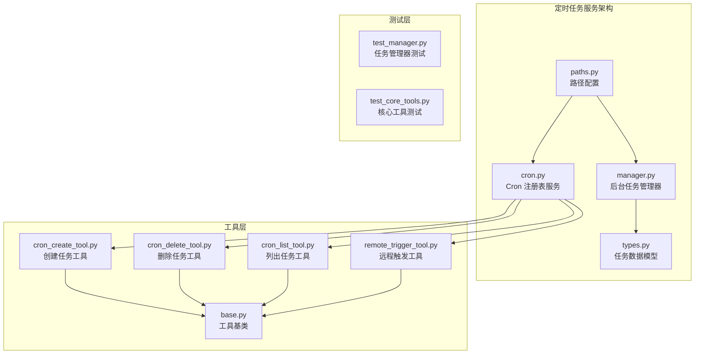
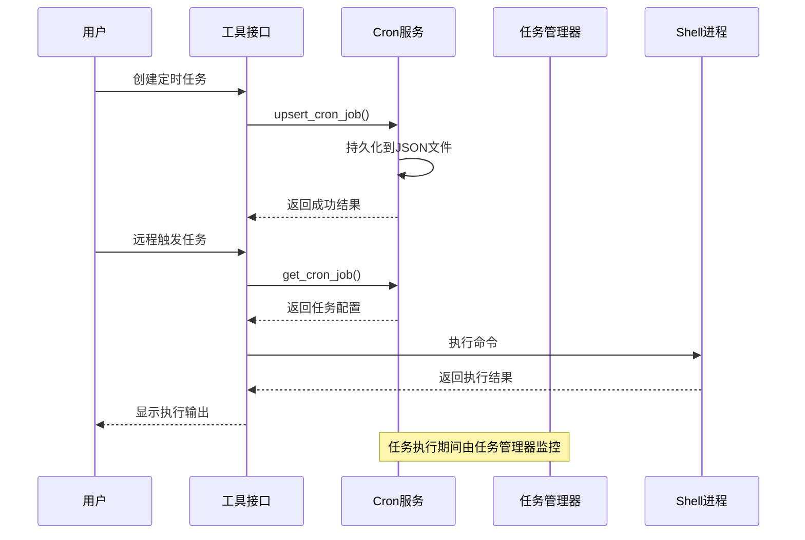
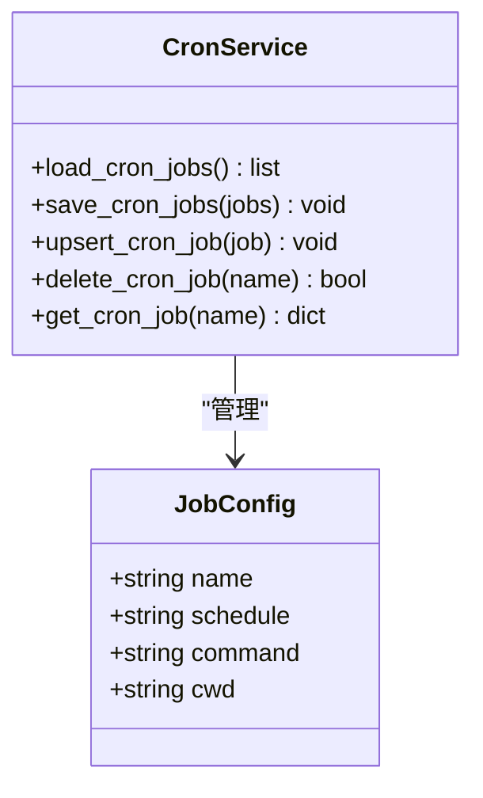
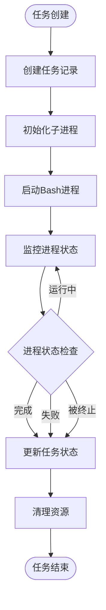
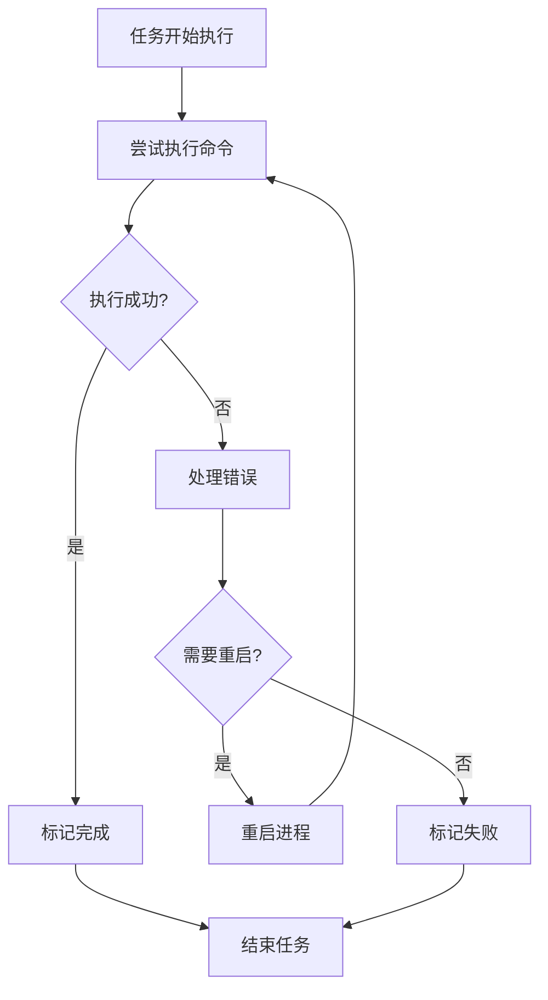
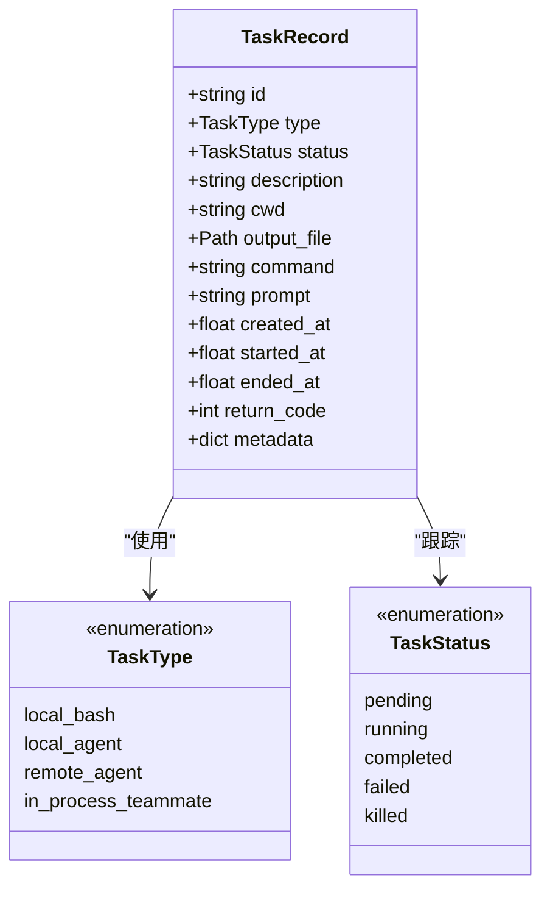
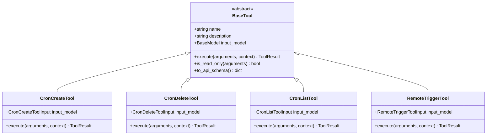
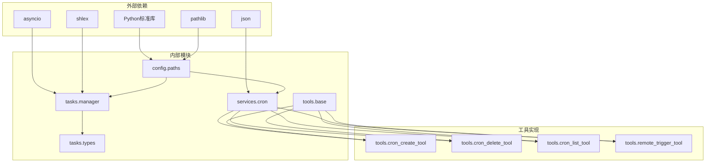

# 定时任务服务

<cite>
**本文档引用的文件**
- [cron.py](file://src/openharness/services/cron.py)
- [manager.py](file://src/openharness/tasks/manager.py)
- [types.py](file://src/openharness/tasks/types.py)
- [paths.py](file://src/openharness/config/paths.py)
- [cron_create_tool.py](file://src/openharness/tools/cron_create_tool.py)
- [cron_delete_tool.py](file://src/openharness/tools/cron_delete_tool.py)
- [cron_list_tool.py](file://src/openharness/tools/cron_list_tool.py)
- [remote_trigger_tool.py](file://src/openharness/tools/remote_trigger_tool.py)
- [base.py](file://src/openharness/tools/base.py)
- [README.md](file://README.md)
- [test_manager.py](file://tests/test_tasks/test_manager.py)
- [test_core_tools.py](file://tests/test_tools/test_core_tools.py)
</cite>

## 目录
1. [简介](#简介)
2. [项目结构](#项目结构)
3. [核心组件](#核心组件)
4. [架构概览](#架构概览)
5. [详细组件分析](#详细组件分析)
6. [依赖关系分析](#依赖关系分析)
7. [性能考虑](#性能考虑)
8. [故障排除指南](#故障排除指南)
9. [结论](#结论)
10. [附录](#附录)

## 简介

OpenHarness 的定时任务服务是一个基于本地 Cron 风格的任务调度系统，为开发者提供了强大的自动化能力。该服务支持周期性任务执行、计划任务管理、远程触发执行等功能，是 OpenHarness 生态系统中实现自动化流程的关键组件。

定时任务服务的核心价值体现在：
- **周期性任务执行**：通过 Cron 表达式定义任务执行频率
- **灵活的任务管理**：支持任务的创建、修改、删除、暂停、恢复等操作
- **远程触发机制**：允许按需立即执行已配置的任务
- **完整的生命周期管理**：从任务创建到执行完成的全过程监控
- **安全的权限控制**：与 OpenHarness 的权限系统深度集成

## 项目结构

定时任务服务在 OpenHarness 代码库中的组织结构如下：



**图表来源**
- [cron.py:1-54](file://src/openharness/services/cron.py#L1-L54)
- [manager.py:1-281](file://src/openharness/tasks/manager.py#L1-L281)
- [types.py:1-31](file://src/openharness/tasks/types.py#L1-L31)
- [paths.py:1-117](file://src/openharness/config/paths.py#L1-L117)

**章节来源**
- [cron.py:1-54](file://src/openharness/services/cron.py#L1-L54)
- [manager.py:1-281](file://src/openharness/tasks/manager.py#L1-L281)
- [types.py:1-31](file://src/openharness/tasks/types.py#L1-L31)
- [paths.py:1-117](file://src/openharness/config/paths.py#L1-L117)

## 核心组件

定时任务服务由以下核心组件构成：

### Cron 注册表服务
负责任务配置的持久化存储和管理，提供任务的增删改查操作。

### 后台任务管理器
管理任务的生命周期，包括任务创建、执行监控、状态更新、资源清理等。

### 任务数据模型
定义任务的标准数据结构，确保任务信息的一致性和完整性。

### 工具接口层
提供用户友好的命令行接口，支持任务的创建、删除、列表查看和远程触发。

**章节来源**
- [cron.py:12-53](file://src/openharness/services/cron.py#L12-L53)
- [manager.py:18-280](file://src/openharness/tasks/manager.py#L18-L280)
- [types.py:14-31](file://src/openharness/tasks/types.py#L14-L31)

## 架构概览

定时任务服务采用分层架构设计，确保各组件职责清晰、耦合度低：



**图表来源**
- [cron_create_tool.py:27-40](file://src/openharness/tools/cron_create_tool.py#L27-L40)
- [remote_trigger_tool.py:28-69](file://src/openharness/tools/remote_trigger_tool.py#L28-L69)
- [cron.py:30-35](file://src/openharness/services/cron.py#L30-L35)

## 详细组件分析

### Cron 注册表服务

Cron 注册表服务是定时任务的核心存储组件，负责任务配置的持久化和检索。

#### 核心功能



**图表来源**
- [cron.py:12-53](file://src/openharness/services/cron.py#L12-L53)

#### 数据持久化机制

任务配置采用 JSON 格式存储在 `~/.openharness/data/cron_jobs.json` 文件中，确保配置的可移植性和持久性。

#### 关键特性
- **原子性操作**：所有写操作都是原子性的，避免数据损坏
- **类型安全**：严格的类型检查确保配置的有效性
- **排序保证**：任务按名称排序存储，便于检索和显示

**章节来源**
- [cron.py:12-53](file://src/openharness/services/cron.py#L12-L53)
- [paths.py:97-99](file://src/openharness/config/paths.py#L97-L99)

### 后台任务管理器

后台任务管理器负责实际的任务执行和生命周期管理。

#### 任务执行架构



**图表来源**
- [manager.py:29-92](file://src/openharness/tasks/manager.py#L29-L92)
- [manager.py:170-191](file://src/openharness/tasks/manager.py#L170-L191)

#### 核心功能模块

| 功能模块 | 描述 | 关键方法 |
|---------|------|---------|
| 任务创建 | 启动新的后台任务 | `create_shell_task()`, `create_agent_task()` |
| 进程管理 | 监控和控制子进程 | `_start_process()`, `_watch_process()` |
| 输入输出 | 处理任务的输入输出流 | `write_to_task()`, `read_task_output()` |
| 状态管理 | 跟踪任务执行状态 | `update_task()`, `stop_task()` |

#### 错误处理机制



**图表来源**
- [manager.py:136-145](file://src/openharness/tasks/manager.py#L136-L145)
- [manager.py:242-256](file://src/openharness/tasks/manager.py#L242-L256)

**章节来源**
- [manager.py:18-280](file://src/openharness/tasks/manager.py#L18-L280)

### 任务数据模型

任务数据模型定义了定时任务的标准结构，确保所有任务信息的一致性。

#### 数据模型结构



**图表来源**
- [types.py:14-31](file://src/openharness/tasks/types.py#L14-L31)

#### 关键字段说明

| 字段名 | 类型 | 描述 | 用途 |
|-------|------|------|-----|
| `id` | string | 任务唯一标识符 | 任务识别和引用 |
| `type` | TaskType | 任务类型 | 决定执行方式和行为 |
| `status` | TaskStatus | 当前状态 | UI显示和状态跟踪 |
| `description` | string | 任务描述 | 用户界面展示 |
| `cwd` | string | 工作目录 | 命令执行上下文 |
| `output_file` | Path | 输出文件路径 | 日志和结果存储 |
| `command` | string | 执行命令 | 实际要运行的命令 |
| `prompt` | string | 提示词 | 代理任务的输入内容 |
| `created_at` | float | 创建时间戳 | 排序和统计 |
| `started_at` | float | 开始时间戳 | 性能监控 |
| `ended_at` | float | 结束时间戳 | 生命周期管理 |
| `return_code` | int | 退出码 | 执行结果判断 |
| `metadata` | dict | 元数据 | 扩展信息存储 |

**章节来源**
- [types.py:10-31](file://src/openharness/tasks/types.py#L10-L31)

### 工具接口层

工具接口层提供了用户友好的命令行交互方式，简化了定时任务的管理操作。

#### 工具架构



**图表来源**
- [base.py:30-76](file://src/openharness/tools/base.py#L30-L76)
- [cron_create_tool.py:20-40](file://src/openharness/tools/cron_create_tool.py#L20-L40)
- [cron_delete_tool.py:17-32](file://src/openharness/tools/cron_delete_tool.py#L17-L32)
- [cron_list_tool.py:15-38](file://src/openharness/tools/cron_list_tool.py#L15-L38)
- [remote_trigger_tool.py:21-69](file://src/openharness/tools/remote_trigger_tool.py#L21-L69)

#### 工具功能对比

| 工具名称 | 功能描述 | 输入参数 | 主要用途 |
|---------|----------|----------|----------|
| `cron_create` | 创建或更新定时任务 | `name`, `schedule`, `command`, `cwd` | 任务创建和修改 |
| `cron_delete` | 删除指定定时任务 | `name` | 任务清理 |
| `cron_list` | 列出所有定时任务 | 无 | 任务查看和审计 |
| `remote_trigger` | 立即执行指定任务 | `name`, `timeout_seconds` | 按需执行 |

**章节来源**
- [cron_create_tool.py:11-40](file://src/openharness/tools/cron_create_tool.py#L11-L40)
- [cron_delete_tool.py:11-32](file://src/openharness/tools/cron_delete_tool.py#L11-L32)
- [cron_list_tool.py:11-38](file://src/openharness/tools/cron_list_tool.py#L11-L38)
- [remote_trigger_tool.py:14-69](file://src/openharness/tools/remote_trigger_tool.py#L14-L69)

## 依赖关系分析

定时任务服务的依赖关系体现了清晰的分层架构：



**图表来源**
- [paths.py:1-117](file://src/openharness/config/paths.py#L1-L117)
- [cron.py:1-54](file://src/openharness/services/cron.py#L1-L54)
- [manager.py:1-281](file://src/openharness/tasks/manager.py#L1-L281)
- [base.py:1-76](file://src/openharness/tools/base.py#L1-L76)

### 关键依赖链

1. **配置层依赖**：所有组件都依赖于 `config.paths` 提供的路径解析功能
2. **服务层依赖**：工具层直接依赖 `services.cron` 提供的任务注册表功能
3. **执行层依赖**：任务管理器独立运行，不依赖外部服务，但可以被工具调用
4. **数据层依赖**：任务数据模型为所有组件提供统一的数据结构

**章节来源**
- [paths.py:15-117](file://src/openharness/config/paths.py#L15-L117)
- [cron.py:9](file://src/openharness/services/cron.py#L9)
- [manager.py:14](file://src/openharness/tasks/manager.py#L14)

## 性能考虑

定时任务服务在设计时充分考虑了性能优化：

### 异步执行模型
- 使用 `asyncio` 实现非阻塞的进程管理和 I/O 操作
- 支持并发任务执行，提高系统吞吐量
- 通过事件循环管理多个任务的生命周期

### 内存管理策略
- 任务输出采用流式写入，避免大文件内存占用
- 进程句柄在任务完成后及时清理
- 使用锁机制确保并发访问的安全性

### 存储优化
- JSON 文件格式便于人类阅读和编辑
- 任务按名称排序存储，提高查找效率
- 增量更新机制减少磁盘 I/O 操作

## 故障排除指南

### 常见问题及解决方案

#### 任务无法启动
**症状**：创建任务后立即失败
**可能原因**：
- Bash 路径不存在（/bin/bash）
- 权限不足执行命令
- 工作目录不存在

**解决步骤**：
1. 验证 Bash 可执行文件存在
2. 检查命令权限和语法
3. 确认工作目录存在且可访问

#### 任务长时间无响应
**症状**：任务状态一直显示为 running
**可能原因**：
- 命令本身阻塞
- 子进程异常退出但未被正确检测
- I/O 阻塞

**诊断方法**：
1. 检查任务输出文件
2. 查看系统进程状态
3. 分析命令执行日志

#### 任务管理器异常
**症状**：任务管理器崩溃或无法响应
**可能原因**：
- 资源泄漏
- 并发访问冲突
- 文件系统权限问题

**恢复措施**：
1. 重启 OpenHarness 服务
2. 清理临时文件
3. 检查磁盘空间和权限

**章节来源**
- [manager.py:136-145](file://src/openharness/tasks/manager.py#L136-L145)
- [manager.py:170-191](file://src/openharness/tasks/manager.py#L170-L191)

## 结论

OpenHarness 的定时任务服务通过精心设计的架构实现了高效、可靠的自动化任务管理。该服务的主要优势包括：

1. **简洁而强大的设计**：基于 Cron 风格的简单概念，易于理解和使用
2. **完整的生命周期管理**：从创建到执行再到清理的全流程覆盖
3. **安全的权限控制**：与 OpenHarness 整体安全体系无缝集成
4. **灵活的扩展性**：支持自定义任务类型和执行环境
5. **良好的可观测性**：完整的日志记录和状态跟踪机制

该服务为开发者提供了构建复杂自动化流程的基础平台，支持从简单的定时备份到复杂的多步骤工作流等各种应用场景。

## 附录

### 配置示例

#### 基本任务配置
```json
{
  "name": "nightly-backup",
  "schedule": "daily",
  "command": "rsync -av /home/user/docs/ backup-server:/backups/",
  "cwd": "/home/user"
}
```

#### 复杂任务配置
```json
{
  "name": "data-processing",
  "schedule": "0 2 * * *",
  "command": "python3 /opt/scripts/process_data.py --date $(date +%Y-%m-%d)",
  "cwd": "/opt/scripts"
}
```

### 使用指南

#### 创建定时任务
1. 使用 `cron_create` 工具创建新任务
2. 指定任务名称、执行计划和命令
3. 验证任务配置是否正确

#### 查看任务状态
1. 使用 `cron_list` 工具查看所有任务
2. 检查任务的执行历史和状态
3. 监控任务的性能指标

#### 远程触发任务
1. 使用 `remote_trigger` 工具立即执行任务
2. 设置合适的超时时间
3. 检查执行结果和错误信息

#### 删除任务
1. 使用 `cron_delete` 工具删除不需要的任务
2. 确认任务已被完全移除
3. 清理相关的日志文件

**章节来源**
- [README.md:182-186](file://README.md#L182-L186)
- [test_core_tools.py:223-247](file://tests/test_tools/test_core_tools.py#L223-L247)