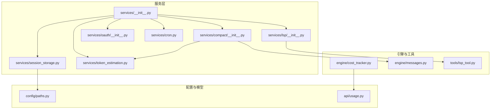
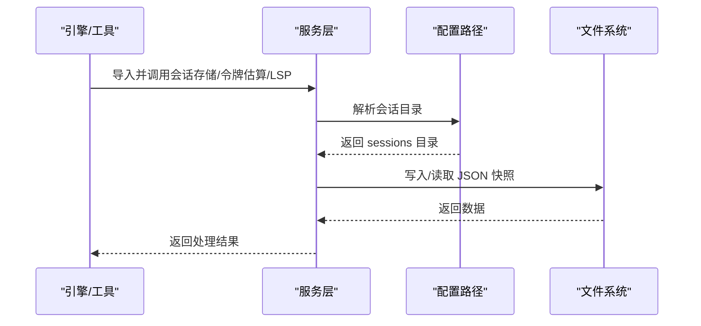
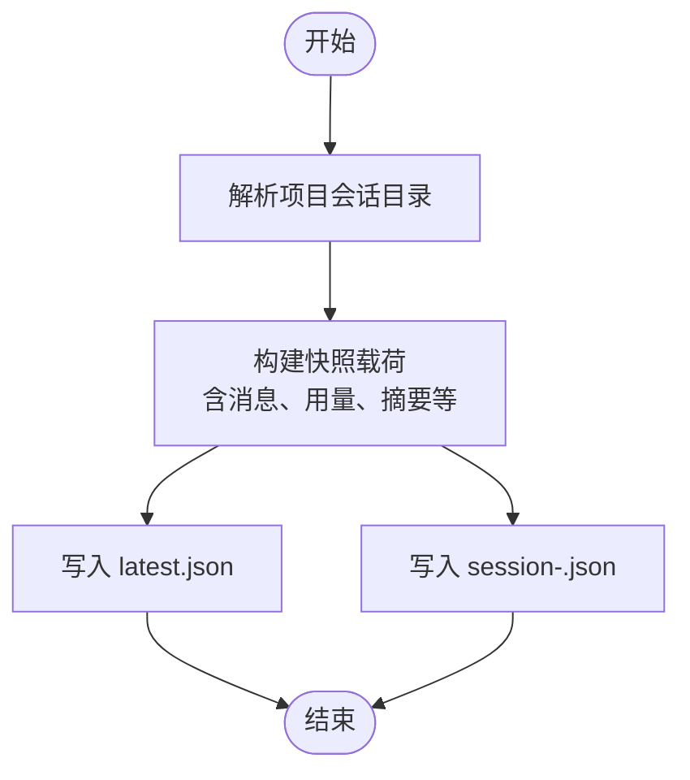
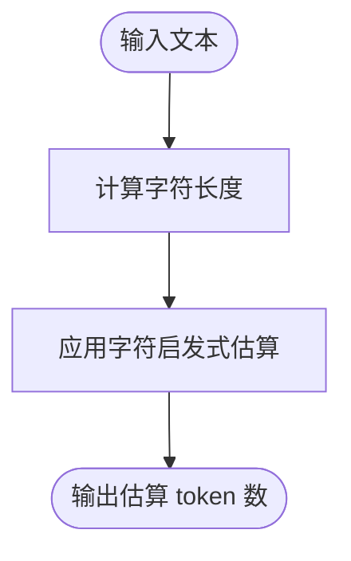
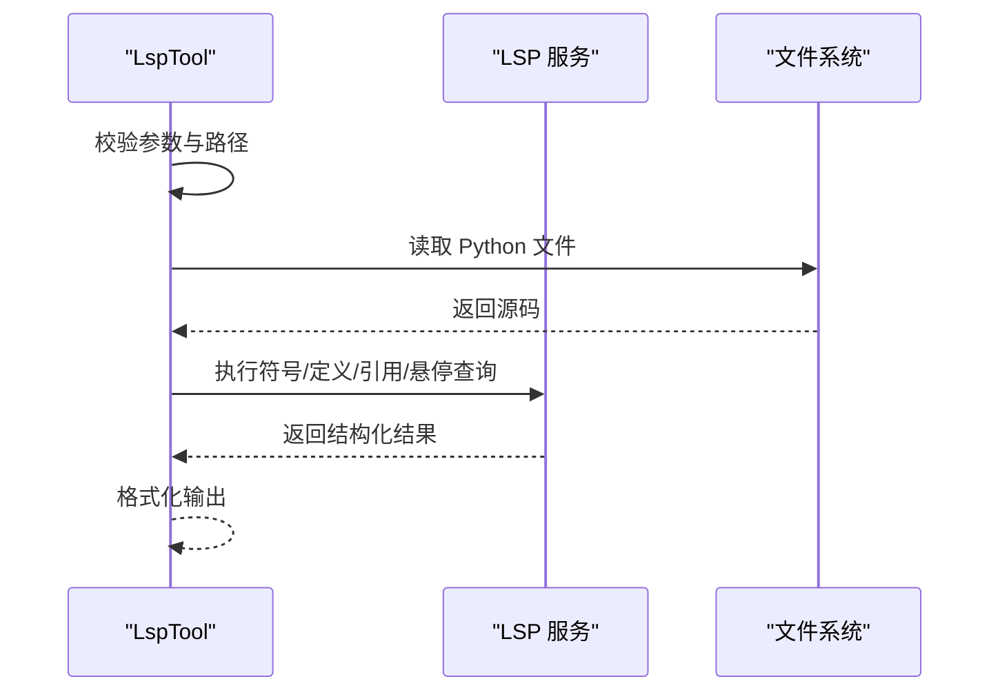
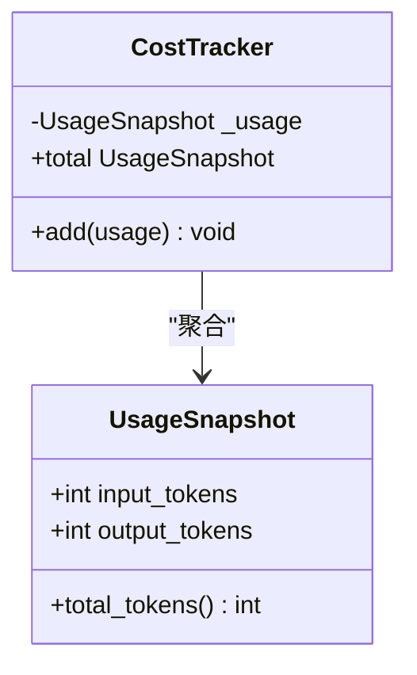
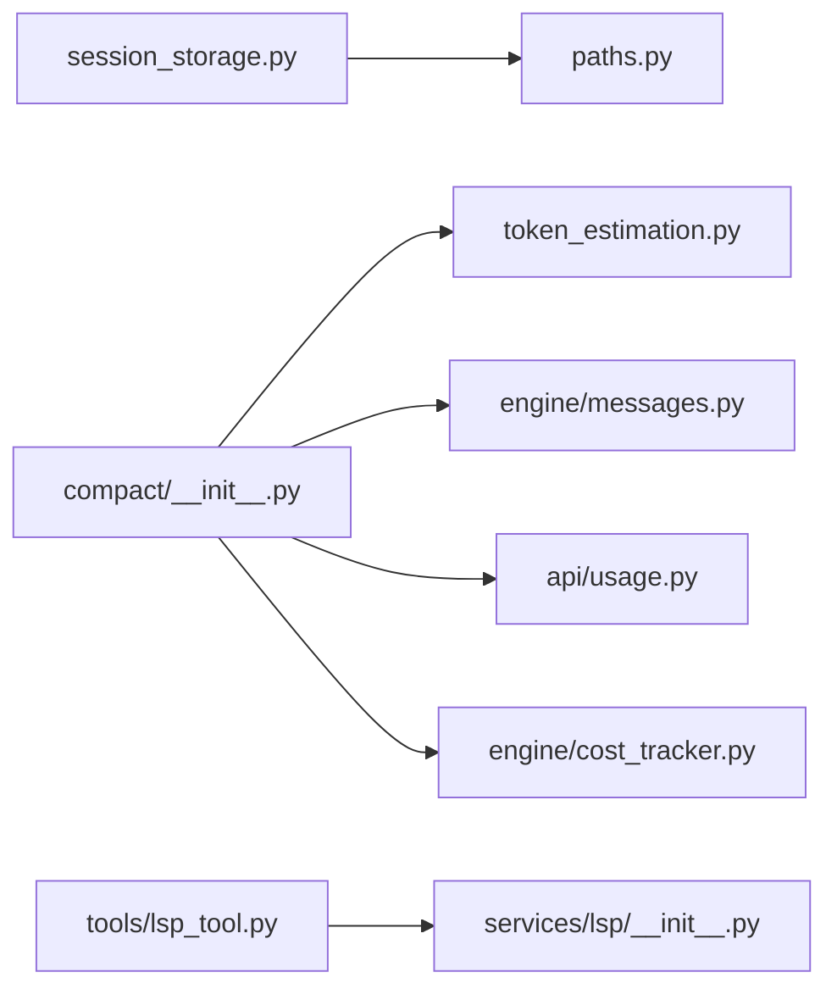

# 服务系统

<cite>
**本文引用的文件**
- [services/__init__.py](file://src/openharness/services/__init__.py)
- [services/session_storage.py](file://src/openharness/services/session_storage.py)
- [services/token_estimation.py](file://src/openharness/services/token_estimation.py)
- [services/lsp/__init__.py](file://src/openharness/services/lsp/__init__.py)
- [services/compact/__init__.py](file://src/openharness/services/compact/__init__.py)
- [services/cron.py](file://src/openharness/services/cron.py)
- [tools/lsp_tool.py](file://src/openharness/tools/lsp_tool.py)
- [engine/cost_tracker.py](file://src/openharness/engine/cost_tracker.py)
- [api/usage.py](file://src/openharness/api/usage.py)
- [config/paths.py](file://src/openharness/config/paths.py)
- [engine/messages.py](file://src/openharness/engine/messages.py)
- [tests/test_services/test_session_storage.py](file://tests/test_services/test_session_storage.py)
- [tests/test_services/test_compact.py](file://tests/test_services/test_compact.py)
</cite>

## 目录
1. [简介](#简介)
2. [项目结构](#项目结构)
3. [核心组件](#核心组件)
4. [架构总览](#架构总览)
5. [详细组件分析](#详细组件分析)
6. [依赖分析](#依赖分析)
7. [性能考量](#性能考量)
8. [故障排查指南](#故障排查指南)
9. [结论](#结论)
10. [附录](#附录)

## 简介
本文件系统性梳理 OpenHarness 的服务层设计与实现，重点覆盖以下方面：
- 可插拔服务架构与模块化组织：通过统一导出入口集中暴露服务能力，便于按需组合与替换。
- 会话存储服务：涵盖数据持久化、快照管理、Markdown 导出、并发访问注意事项。
- 令牌估算服务：基于字符启发式估算文本占用 token 数量，用于成本控制与提示长度预估。
- LSP 服务：轻量级 Python 符号检索与只读查询能力，配合工具调用实现代码智能辅助。
- OAuth 服务：当前目录存在占位文件，尚未实现具体功能，后续可按标准 OAuth 流程扩展。
- 服务扩展指南：如何新增自定义服务、注册与依赖注入的最佳实践。
- 实际使用示例与最佳实践：结合测试用例与工具调用路径，给出可操作建议。

## 项目结构
服务系统位于 src/openharness/services 目录下，采用“按功能域分包”的模块化组织方式：
- compact：对话压缩与令牌估算辅助
- lsp：轻量级符号与代码智能
- oauth：OAuth 功能占位（待实现）
- 其他：session_storage（会话存储）、token_estimation（令牌估算）、cron（本地定时任务注册）

图表来源
- [services/__init__.py:1-27](file://src/openharness/services/__init__.py#L1-L27)
- [services/session_storage.py:1-178](file://src/openharness/services/session_storage.py#L1-L178)
- [services/token_estimation.py:1-16](file://src/openharness/services/token_estimation.py#L1-L16)
- [services/compact/__init__.py:1-58](file://src/openharness/services/compact/__init__.py#L1-L58)
- [services/lsp/__init__.py:1-217](file://src/openharness/services/lsp/__init__.py#L1-L217)
- [services/oauth/__init__.py:1-1](file://src/openharness/services/oauth/__init__.py#L1-L1)
- [services/cron.py:1-54](file://src/openharness/services/cron.py#L1-L54)
- [engine/cost_tracker.py:1-25](file://src/openharness/engine/cost_tracker.py#L1-L25)
- [engine/messages.py:1-109](file://src/openharness/engine/messages.py#L1-L109)
- [tools/lsp_tool.py:1-155](file://src/openharness/tools/lsp_tool.py#L1-L155)
- [config/paths.py:1-117](file://src/openharness/config/paths.py#L1-L117)
- [api/usage.py:1-18](file://src/openharness/api/usage.py#L1-L18)

章节来源
- [services/__init__.py:1-27](file://src/openharness/services/__init__.py#L1-L27)
- [config/paths.py:1-117](file://src/openharness/config/paths.py#L1-L117)

## 核心组件
- 统一导出入口：通过 services/__init__.py 将会话存储、令牌估算、对话压缩等能力集中导出，便于上层按需导入与使用。
- 会话存储：提供项目级会话目录生成、快照保存/加载、会话列表、按 ID 加载、Markdown 导出等能力。
- 令牌估算：提供文本与消息级别的粗略 token 估算，用于成本控制与提示长度预估。
- 对话压缩：在历史消息过多时，以合成摘要替代旧消息，降低上下文开销。
- LSP 轻量服务：针对 Python 文件进行符号枚举、定义跳转、引用查找、悬停信息等只读查询。
- 成本追踪：聚合会话生命周期内的输入/输出 token 使用量，形成 UsageSnapshot。
- 配置路径：提供 XDG-like 的路径解析，支持环境变量覆盖，确保数据、日志、会话等目录可定制。

章节来源
- [services/__init__.py:1-27](file://src/openharness/services/__init__.py#L1-L27)
- [services/session_storage.py:1-178](file://src/openharness/services/session_storage.py#L1-L178)
- [services/token_estimation.py:1-16](file://src/openharness/services/token_estimation.py#L1-L16)
- [services/compact/__init__.py:1-58](file://src/openharness/services/compact/__init__.py#L1-L58)
- [services/lsp/__init__.py:1-217](file://src/openharness/services/lsp/__init__.py#L1-L217)
- [engine/cost_tracker.py:1-25](file://src/openharness/engine/cost_tracker.py#L1-L25)
- [api/usage.py:1-18](file://src/openharness/api/usage.py#L1-L18)
- [config/paths.py:1-117](file://src/openharness/config/paths.py#L1-L117)

## 架构总览
服务层围绕“模块化、可插拔、最小可用”原则构建，核心交互如下：
- 上层工具或引擎通过统一导出入口调用服务；
- 会话存储依赖配置路径解析生成会话目录，并以 JSON 快照持久化；
- 令牌估算与对话压缩为引擎侧提供上下文控制与成本预估；
- LSP 服务为工具提供只读代码智能能力；
- 成本追踪聚合 UsageSnapshot，支撑成本统计与告警。

图表来源
- [services/session_storage.py:17-67](file://src/openharness/services/session_storage.py#L17-L67)
- [config/paths.py:71-75](file://src/openharness/config/paths.py#L71-L75)

## 详细组件分析

### 会话存储服务
- 设计理念
  - 按项目生成唯一会话目录，避免多项目冲突；
  - 同时保存“最新快照”与“按 ID 快照”，便于回溯与分享；
  - 支持列出最近会话、按 ID 加载、导出 Markdown 转录。
- 数据持久化
  - 快照包含会话 ID、工作目录、模型名、系统提示、消息列表、用量快照、创建时间、摘要与消息数量；
  - 使用 JSON 序列化，保留结构化信息以便后续分析。
- 缓存策略
  - 采用文件系统缓存（JSON 文件），无需额外内存缓存；
  - 列表接口限制返回数量，避免一次性加载过多文件。
- 并发控制
  - 当前实现未内置锁机制；建议在外部调用处加互斥，或在写入时使用原子落盘（如临时文件 + 原子重命名）以避免竞态。
- 错误处理
  - 文件读写异常与 JSON 解析失败均被吞并并跳过，保证稳健性；
  - 加载最新快照不存在时返回空值，调用方需判空。
- 复杂度分析
  - 保存：O(n)（n 为消息数量，序列化消息列表）；
  - 加载：O(1)（直接读取 latest.json 或指定 session 文件）；
  - 列表：O(k log k)（k 为匹配文件数，排序）。

图表来源
- [services/session_storage.py:26-67](file://src/openharness/services/session_storage.py#L26-L67)
- [config/paths.py:71-75](file://src/openharness/config/paths.py#L71-L75)

章节来源
- [services/session_storage.py:1-178](file://src/openharness/services/session_storage.py#L1-L178)
- [config/paths.py:71-75](file://src/openharness/config/paths.py#L71-L75)
- [tests/test_services/test_session_storage.py:17-55](file://tests/test_services/test_session_storage.py#L17-L55)

### 令牌估算服务
- 设计理念
  - 提供简单高效的字符启发式估算，适合快速成本预估与阈值控制；
  - 与对话压缩配合，动态调整上下文规模。
- 准确性
  - 基于字符长度的近似算法，不考虑编码细节与特殊字符权重，可能与真实模型估算存在偏差；
  - 适用于粗粒度预算与上限控制，不建议用于精确计费。
- 性能优化
  - 单次估算 O(1)，批量估算 O(n)；
  - 适合在消息拼接前快速评估是否需要压缩。
- 成本控制
  - 结合 CostTracker 与 UsageSnapshot，形成端到端的成本聚合与展示。

图表来源
- [services/token_estimation.py:6-16](file://src/openharness/services/token_estimation.py#L6-L16)
- [services/compact/__init__.py:48-50](file://src/openharness/services/compact/__init__.py#L48-L50)

章节来源
- [services/token_estimation.py:1-16](file://src/openharness/services/token_estimation.py#L1-L16)
- [services/compact/__init__.py:1-58](file://src/openharness/services/compact/__init__.py#L1-L58)
- [engine/cost_tracker.py:1-25](file://src/openharness/engine/cost_tracker.py#L1-L25)
- [api/usage.py:1-18](file://src/openharness/api/usage.py#L1-L18)
- [tests/test_services/test_compact.py:15-37](file://tests/test_services/test_compact.py#L15-L37)

### LSP 服务与 LSP 工具
- LSP 服务（轻量级）
  - 支持 Python 文件的符号枚举、工作区符号搜索、定义跳转、引用查找、悬停信息；
  - 通过 AST 与正则表达式实现，避免引入重型语言服务器进程；
  - 过滤常见忽略目录（如 .git、node_modules 等），提升稳定性。
- LSP 工具
  - 作为只读工具，接收操作类型与参数，调用 LSP 服务并格式化输出；
  - 支持工作区符号查询、文档符号、定义跳转、引用查找、悬停信息；
  - 对路径进行解析与校验，确保仅处理 Python 文件。
- 适用场景
  - 在对话中提供符号导航、快速定位定义与引用，辅助模型完成更精准的任务执行。

图表来源
- [tools/lsp_tool.py:65-118](file://src/openharness/tools/lsp_tool.py#L65-L118)
- [services/lsp/__init__.py:34-112](file://src/openharness/services/lsp/__init__.py#L34-L112)

章节来源
- [services/lsp/__init__.py:1-217](file://src/openharness/services/lsp/__init__.py#L1-L217)
- [tools/lsp_tool.py:1-155](file://src/openharness/tools/lsp_tool.py#L1-L155)

### OAuth 服务
- 当前状态
  - 目录存在占位文件，尚未实现具体 OAuth 功能；
  - 建议后续按标准授权码流程或设备码流程扩展，注意安全与合规。
- 扩展要点
  - 令牌管理：刷新与撤销、安全存储、过期处理；
  - 认证流程：回调处理、状态校验、CSRF 防护；
  - 安全考虑：HTTPS、安全存储、最小权限、审计日志。

章节来源
- [services/oauth/__init__.py:1-1](file://src/openharness/services/oauth/__init__.py#L1-L1)

### 成本追踪与使用聚合
- CostTracker
  - 聚合会话生命周期内的 UsageSnapshot，支持累加输入/输出 token；
  - 提供 total 属性统一访问。
- UsageSnapshot
  - 表征单次调用的输入/输出 token，提供 total_tokens 辅助计算。

图表来源
- [api/usage.py:8-18](file://src/openharness/api/usage.py#L8-L18)
- [engine/cost_tracker.py:8-25](file://src/openharness/engine/cost_tracker.py#L8-L25)

章节来源
- [engine/cost_tracker.py:1-25](file://src/openharness/engine/cost_tracker.py#L1-L25)
- [api/usage.py:1-18](file://src/openharness/api/usage.py#L1-L18)

### 服务扩展指南
- 新增自定义服务
  - 在 src/openharness/services 下创建新包，实现功能模块；
  - 在 services/__init__.py 中添加导出项，确保对外可见。
- 服务注册与依赖注入
  - 通过统一导出入口集中注册，减少耦合；
  - 若涉及外部资源（如文件系统、网络），建议通过配置路径或工厂函数注入。
- 最佳实践
  - 明确职责边界，保持单一职责；
  - 提供清晰的错误处理与降级策略；
  - 为关键路径提供单元测试与集成测试。

章节来源
- [services/__init__.py:1-27](file://src/openharness/services/__init__.py#L1-L27)

## 依赖分析
- 模块内聚与耦合
  - 会话存储与路径解析强耦合（依赖 config/paths），但职责清晰；
  - 令牌估算与对话压缩相互依赖，共同服务于上下文控制；
  - LSP 工具依赖 LSP 服务，工具层负责参数校验与输出格式化。
- 外部依赖
  - 使用标准库与 pydantic（用于模型定义与校验）；
  - 未发现循环依赖，结构清晰。

图表来源
- [services/session_storage.py:13-14](file://src/openharness/services/session_storage.py#L13-L14)
- [services/compact/__init__.py:5-6](file://src/openharness/services/compact/__init__.py#L5-L6)
- [engine/messages.py:1-109](file://src/openharness/engine/messages.py#L1-L109)
- [tools/lsp_tool.py:10-16](file://src/openharness/tools/lsp_tool.py#L10-L16)
- [api/usage.py:1-18](file://src/openharness/api/usage.py#L1-L18)
- [engine/cost_tracker.py:1-25](file://src/openharness/engine/cost_tracker.py#L1-L25)

章节来源
- [services/session_storage.py:1-178](file://src/openharness/services/session_storage.py#L1-L178)
- [services/compact/__init__.py:1-58](file://src/openharness/services/compact/__init__.py#L1-L58)
- [tools/lsp_tool.py:1-155](file://src/openharness/tools/lsp_tool.py#L1-L155)
- [engine/messages.py:1-109](file://src/openharness/engine/messages.py#L1-L109)
- [api/usage.py:1-18](file://src/openharness/api/usage.py#L1-L18)
- [engine/cost_tracker.py:1-25](file://src/openharness/engine/cost_tracker.py#L1-L25)

## 性能考量
- 会话存储
  - 保存与加载为 O(n)（n 为消息数量），建议在批量写入时合并请求；
  - 列表接口限制返回数量，避免扫描过多文件。
- 令牌估算
  - 字符启发式估算极快，适合高频调用；
  - 批量估算时可复用中间结果，减少重复计算。
- LSP 服务
  - Python 文件遍历与 AST 解析为 O(m)（m 为文件大小之和）；
  - 工作区搜索为 O(w·m)（w 为匹配数量，m 为文件大小）；
  - 建议缓存已解析 AST 与符号索引，或在大工程中限制扫描范围。
- 并发与一致性
  - 文件写入建议采用原子落盘策略，避免竞态；
  - 对频繁读写的场景，可在上层增加互斥或队列化写入。

## 故障排查指南
- 会话存储
  - 现象：加载最新快照为空
  - 排查：确认 sessions 目录是否存在、latest.json 是否存在、文件是否可读
  - 参考路径：[services/session_storage.py:70-75](file://src/openharness/services/session_storage.py#L70-L75)
- 令牌估算
  - 现象：估算值偏高/偏低
  - 排查：确认输入文本编码与长度计算逻辑，必要时引入更精细的分词器
  - 参考路径：[services/token_estimation.py:6-16](file://src/openharness/services/token_estimation.py#L6-L16)
- LSP 工具
  - 现象：返回“文件不存在”或“仅支持 Python”
  - 排查：确认 file_path 是否绝对路径、后缀是否为 .py
  - 参考路径：[tools/lsp_tool.py:73-76](file://src/openharness/tools/lsp_tool.py#L73-L76)
- 成本追踪
  - 现象：累计值异常
  - 排查：确认每次 add 的 UsageSnapshot 来源与单位一致
  - 参考路径：[engine/cost_tracker.py:14-19](file://src/openharness/engine/cost_tracker.py#L14-L19)

章节来源
- [services/session_storage.py:70-75](file://src/openharness/services/session_storage.py#L70-L75)
- [services/token_estimation.py:6-16](file://src/openharness/services/token_estimation.py#L6-L16)
- [tools/lsp_tool.py:73-76](file://src/openharness/tools/lsp_tool.py#L73-L76)
- [engine/cost_tracker.py:14-19](file://src/openharness/engine/cost_tracker.py#L14-L19)

## 结论
OpenHarness 的服务层以模块化与可插拔为核心设计理念，围绕会话存储、令牌估算、对话压缩与 LSP 轻量服务构建了稳定的基础能力。当前 OAuth 服务尚属占位，后续可按标准流程扩展。通过统一导出入口与清晰的依赖关系，服务层为上层工具与引擎提供了可靠、可扩展的能力支撑。建议在生产环境中进一步完善并发控制、缓存策略与安全机制，以提升稳定性与性能。

## 附录
- 实际使用示例与最佳实践
  - 会话存储：在项目根目录下保存/加载会话快照，导出 Markdown 转录，便于归档与复现
    - 参考路径：[tests/test_services/test_session_storage.py:17-55](file://tests/test_services/test_session_storage.py#L17-L55)
  - 令牌估算：在发送消息前估算 token，若超过阈值则触发对话压缩
    - 参考路径：[tests/test_services/test_compact.py:15-37](file://tests/test_services/test_compact.py#L15-L37)
  - LSP 工具：在对话中查询符号定义、引用与悬停信息，辅助模型完成代码任务
    - 参考路径：[tools/lsp_tool.py:65-118](file://src/openharness/tools/lsp_tool.py#L65-L118)