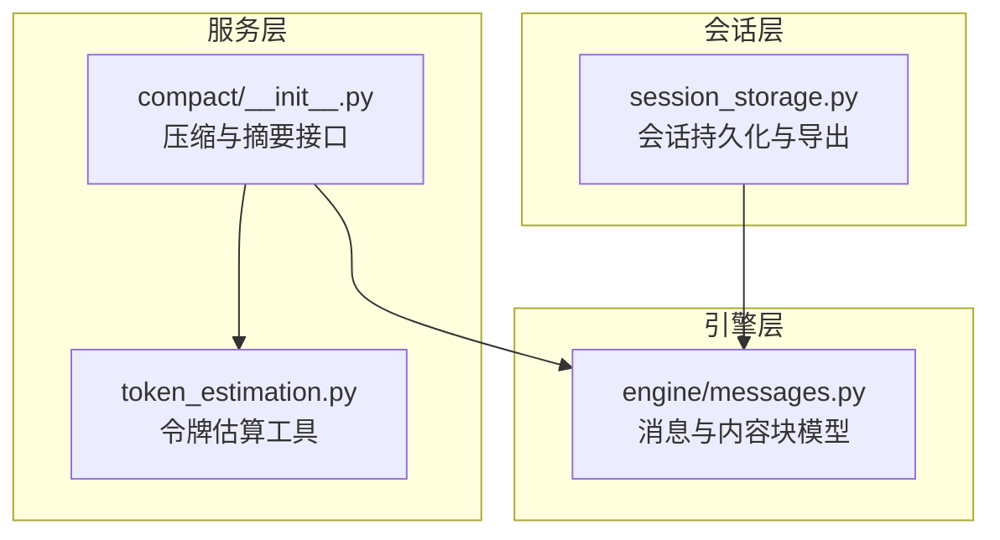
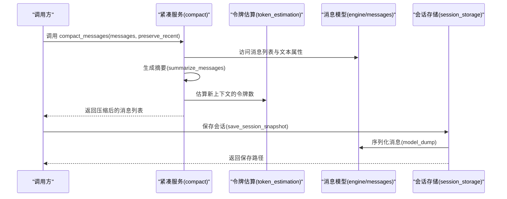
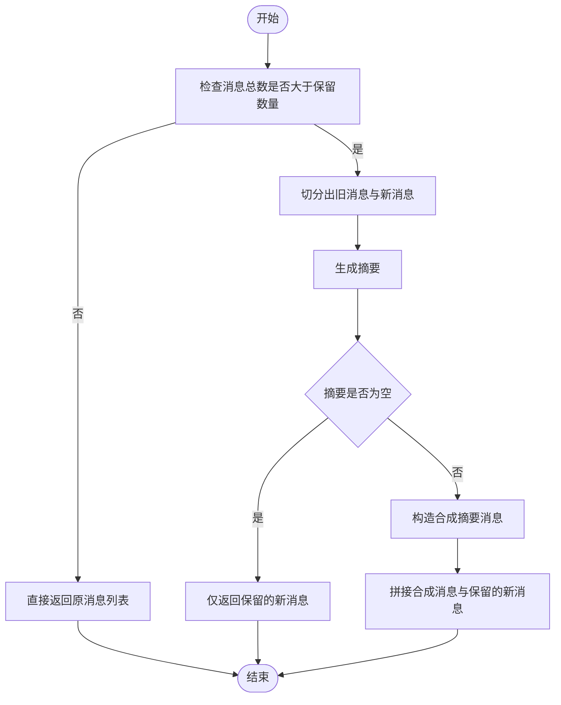
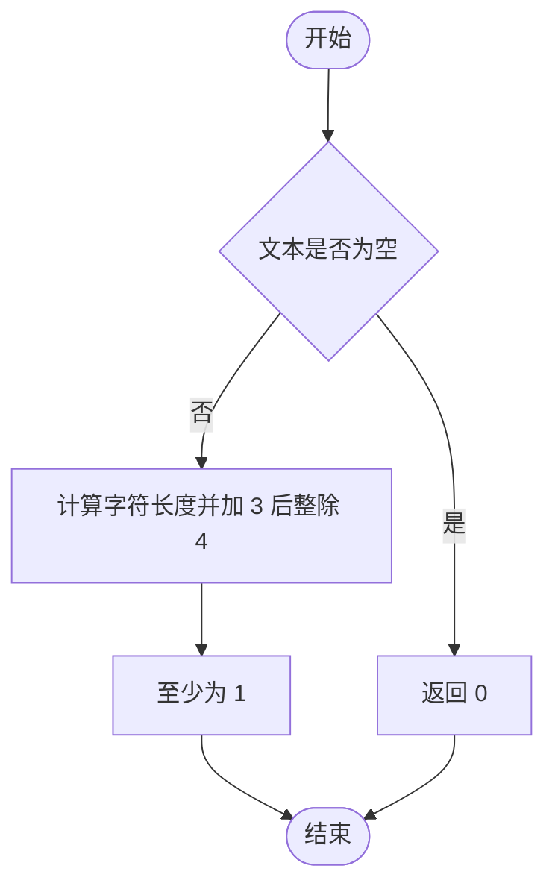
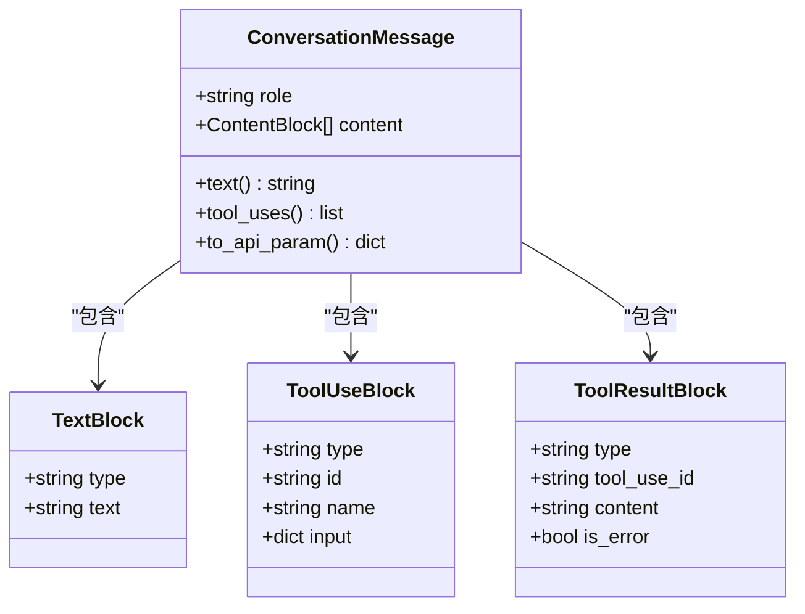
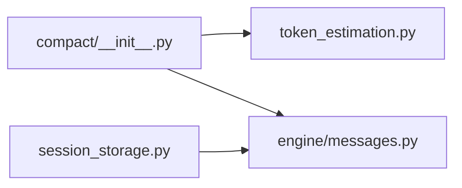

# 紧凑服务

<cite>
**本文引用的文件**
- [src/openharness/services/compact/__init__.py](file://src/openharness/services/compact/__init__.py)
- [src/openharness/services/token_estimation.py](file://src/openharness/services/token_estimation.py)
- [src/openharness/engine/messages.py](file://src/openharness/engine/messages.py)
- [src/openharness/services/session_storage.py](file://src/openharness/services/session_storage.py)
- [tests/test_services/test_compact.py](file://tests/test_services/test_compact.py)
</cite>

## 目录
1. [简介](#简介)
2. [项目结构](#项目结构)
3. [核心组件](#核心组件)
4. [架构总览](#架构总览)
5. [详细组件分析](#详细组件分析)
6. [依赖分析](#依赖分析)
7. [性能考虑](#性能考虑)
8. [故障排查指南](#故障排查指南)
9. [结论](#结论)
10. [附录：使用示例与配置](#附录使用示例与配置)

## 简介
紧凑服务是 OpenHarness 中用于对话历史压缩与估算的核心能力，旨在通过“摘要+保留最新消息”的策略降低上下文长度，从而提升模型推理效率、减少传输开销并优化存储占用。它不进行通用二进制压缩（如 gzip），而是对对话内容进行语义层面的“轻量摘要”与结构化保留，结合令牌估算工具，为后续调用提供上下文窗口友好的输入。

## 项目结构
紧凑服务位于服务层的 compact 子模块中，围绕以下关键文件组织：
- compact 模块：提供消息压缩、摘要生成与对话令牌估算
- token_estimation 模块：提供粗略令牌估算工具
- engine/messages 模块：定义对话消息与内容块的数据模型
- session_storage 模块：会话持久化与导出，便于与紧凑结果协同使用
- 测试模块：验证紧凑与令牌估算行为

图表来源
- [src/openharness/services/compact/__init__.py:1-58](file://src/openharness/services/compact/__init__.py#L1-L58)
- [src/openharness/services/token_estimation.py:1-16](file://src/openharness/services/token_estimation.py#L1-L16)
- [src/openharness/engine/messages.py:1-109](file://src/openharness/engine/messages.py#L1-L109)
- [src/openharness/services/session_storage.py:1-178](file://src/openharness/services/session_storage.py#L1-L178)

章节来源
- [src/openharness/services/compact/__init__.py:1-58](file://src/openharness/services/compact/__init__.py#L1-L58)
- [src/openharness/services/token_estimation.py:1-16](file://src/openharness/services/token_estimation.py#L1-L16)
- [src/openharness/engine/messages.py:1-109](file://src/openharness/engine/messages.py#L1-L109)
- [src/openharness/services/session_storage.py:1-178](file://src/openharness/services/session_storage.py#L1-L178)

## 核心组件
- 压缩函数：将较早的历史消息替换为一条由最近 N 条消息生成的“合成摘要”，同时保留最近的若干条消息以维持上下文连贯性
- 摘要函数：从指定数量的最新消息中提取角色与文本片段，形成紧凑的文本摘要
- 令牌估算：对消息文本进行粗略的令牌数量估算，辅助判断是否需要进一步压缩或提示用户

章节来源
- [src/openharness/services/compact/__init__.py:9-50](file://src/openharness/services/compact/__init__.py#L9-L50)
- [src/openharness/services/token_estimation.py:6-15](file://src/openharness/services/token_estimation.py#L6-L15)

## 架构总览
紧凑服务与消息模型、令牌估算以及会话存储之间的交互如下：

图表来源
- [src/openharness/services/compact/__init__.py:9-50](file://src/openharness/services/compact/__init__.py#L9-L50)
- [src/openharness/services/token_estimation.py:6-15](file://src/openharness/services/token_estimation.py#L6-L15)
- [src/openharness/engine/messages.py:39-67](file://src/openharness/engine/messages.py#L39-L67)
- [src/openharness/services/session_storage.py:26-67](file://src/openharness/services/session_storage.py#L26-L67)

## 详细组件分析

### 组件一：消息压缩（compact_messages）
- 功能概述：当历史消息超过阈值时，将最早的历史部分替换为一条包含摘要的合成消息，同时保留最近 N 条消息
- 关键参数
  - preserve_recent：保留的最新消息条数，默认 6
- 处理流程
  - 若消息总数不超过保留数量，则直接返回原列表
  - 否则将旧消息切片并生成摘要，若摘要为空则仅返回保留的新消息
  - 否则构造一条角色为助手、内容为“[conversation summary] + 摘要”的合成消息，并拼接保留的新消息

图表来源
- [src/openharness/services/compact/__init__.py:25-45](file://src/openharness/services/compact/__init__.py#L25-L45)

章节来源
- [src/openharness/services/compact/__init__.py:25-45](file://src/openharness/services/compact/__init__.py#L25-L45)

### 组件二：摘要生成（summarize_messages）
- 功能概述：从指定数量的最新消息中提取每条消息的角色与文本片段，拼接成紧凑文本摘要
- 关键参数
  - max_messages：参与摘要的最大消息数量，默认 8
- 文本截断：对每条消息的文本进行截断，避免过长摘要影响性能
- 空文本过滤：跳过空文本消息，确保摘要质量

章节来源
- [src/openharness/services/compact/__init__.py:9-22](file://src/openharness/services/compact/__init__.py#L9-L22)

### 组件三：令牌估算（estimate_conversation_tokens / estimate_tokens）
- 功能概述：对对话文本进行粗略令牌估算，辅助判断是否需要压缩或提示用户
- 实现要点
  - estimate_tokens：基于字符长度的启发式估算，空字符串返回 0，最小为 1
  - estimate_conversation_tokens：对所有消息文本求和
- 使用场景：在调用前评估上下文大小，决定是否触发压缩

图表来源
- [src/openharness/services/token_estimation.py:6-10](file://src/openharness/services/token_estimation.py#L6-L10)

章节来源
- [src/openharness/services/compact/__init__.py:48-50](file://src/openharness/services/compact/__init__.py#L48-L50)
- [src/openharness/services/token_estimation.py:6-15](file://src/openharness/services/token_estimation.py#L6-L15)

### 组件四：消息与内容块模型（engine/messages）
- 数据模型
  - TextBlock：纯文本内容块
  - ToolUseBlock：工具调用请求
  - ToolResultBlock：工具执行结果
  - ConversationMessage：包含角色与内容块列表的消息对象
- 关键属性与方法
  - text 属性：拼接所有文本块得到完整文本
  - tool_uses 属性：提取所有工具调用块
  - to_api_param：序列化为外部 API 参数格式
- 与紧凑服务的关系
  - 紧凑服务依赖消息的 text 属性与内容块结构进行摘要与估算

图表来源
- [src/openharness/engine/messages.py:11-36](file://src/openharness/engine/messages.py#L11-L36)
- [src/openharness/engine/messages.py:39-67](file://src/openharness/engine/messages.py#L39-L67)

章节来源
- [src/openharness/engine/messages.py:11-109](file://src/openharness/engine/messages.py#L11-L109)

### 组件五：与会话存储的协作（session_storage）
- 保存会话快照：将消息序列化为 JSON 并写入磁盘，同时记录摘要、消息计数与使用统计
- 导出 Markdown：将消息与工具调用结果导出为可读的 Markdown 文档
- 与紧凑服务的配合
  - 在保存前可先对消息进行压缩，以降低 JSON 体积与后续读取成本
  - 导出时同样利用消息的 text 与 tool_uses 属性，保证输出完整性

章节来源
- [src/openharness/services/session_storage.py:26-67](file://src/openharness/services/session_storage.py#L26-L67)
- [src/openharness/services/session_storage.py:157-177](file://src/openharness/services/session_storage.py#L157-L177)

## 依赖分析
- 内部依赖
  - compact 依赖 token_estimation 的估算函数
  - compact 依赖 engine/messages 的消息与内容块模型
  - session_storage 依赖 engine/messages 进行序列化
- 外部依赖
  - 无第三方压缩库依赖，采用纯文本摘要策略
- 耦合与内聚
  - compact 模块职责单一且内聚度高，仅围绕消息压缩与估算
  - 与会话存储通过消息模型解耦，便于独立演进

图表来源
- [src/openharness/services/compact/__init__.py:5-6](file://src/openharness/services/compact/__init__.py#L5-L6)
- [src/openharness/services/token_estimation.py:1-16](file://src/openharness/services/token_estimation.py#L1-L16)
- [src/openharness/engine/messages.py:1-109](file://src/openharness/engine/messages.py#L1-L109)
- [src/openharness/services/session_storage.py:12-14](file://src/openharness/services/session_storage.py#L12-L14)

章节来源
- [src/openharness/services/compact/__init__.py:5-6](file://src/openharness/services/compact/__init__.py#L5-L6)
- [src/openharness/services/token_estimation.py:1-16](file://src/openharness/services/token_estimation.py#L1-L16)
- [src/openharness/engine/messages.py:1-109](file://src/openharness/engine/messages.py#L1-L109)
- [src/openharness/services/session_storage.py:12-14](file://src/openharness/services/session_storage.py#L12-L14)

## 性能考虑
- 时间复杂度
  - 摘要生成：O(N)，N 为参与摘要的消息数
  - 压缩主流程：O(N)，包含切片与一次摘要生成
  - 令牌估算：O(M)，M 为消息总数
- 空间复杂度
  - 摘要字符串与合成消息为线性于文本长度
- 内存控制
  - 通过限制 max_messages 与 preserve_recent 控制摘要规模
  - 对文本进行截断，避免过长摘要占用内存
- 批量处理
  - 适合在批量消息到达后统一进行压缩，减少重复计算
- I/O 优化
  - 与会话存储配合，压缩后的消息体积更小，持久化与加载更快

## 故障排查指南
- 摘要为空
  - 现象：压缩后仅返回保留的新消息
  - 可能原因：旧消息中无有效文本
  - 建议：检查消息内容块类型与文本字段
- 令牌估算异常
  - 现象：估算值偏大或偏小
  - 可能原因：字符编码或文本截断导致估算偏差
  - 建议：确认输入文本编码与截断策略
- 会话导出不完整
  - 现象：Markdown 导出缺少工具调用或结果
  - 可能原因：消息内容块类型不匹配
  - 建议：确认消息模型与序列化逻辑

章节来源
- [tests/test_services/test_compact.py:15-36](file://tests/test_services/test_compact.py#L15-L36)
- [src/openharness/services/compact/__init__.py:9-22](file://src/openharness/services/compact/__init__.py#L9-L22)
- [src/openharness/engine/messages.py:50-67](file://src/openharness/engine/messages.py#L50-L67)

## 结论
紧凑服务通过“摘要+保留最新消息”的策略，在不改变语义的前提下显著降低上下文长度，提升模型推理效率与传输/存储效率。其设计简洁、内聚度高，与消息模型、令牌估算与会话存储形成清晰的协作关系。对于需要长期对话的场景，建议在保存会话前先进行压缩，并结合令牌估算动态调整保留数量。

## 附录：使用示例与配置
- 使用步骤
  - 准备消息列表：使用消息模型构造用户与助手消息
  - 估算令牌：在压缩前调用令牌估算，判断是否需要压缩
  - 执行压缩：调用压缩函数，设置保留的最新消息数量
  - 保存会话：将压缩后的消息保存到会话存储，或导出为 Markdown
- 配置项
  - preserve_recent：保留的最新消息数量（默认 6）
  - max_messages：参与摘要的最大消息数量（默认 8）
- 示例参考
  - 单元测试展示了摘要生成、压缩与令牌估算的基本用法

章节来源
- [tests/test_services/test_compact.py:21-36](file://tests/test_services/test_compact.py#L21-L36)
- [src/openharness/services/compact/__init__.py:9-50](file://src/openharness/services/compact/__init__.py#L9-L50)
- [src/openharness/services/session_storage.py:26-67](file://src/openharness/services/session_storage.py#L26-L67)