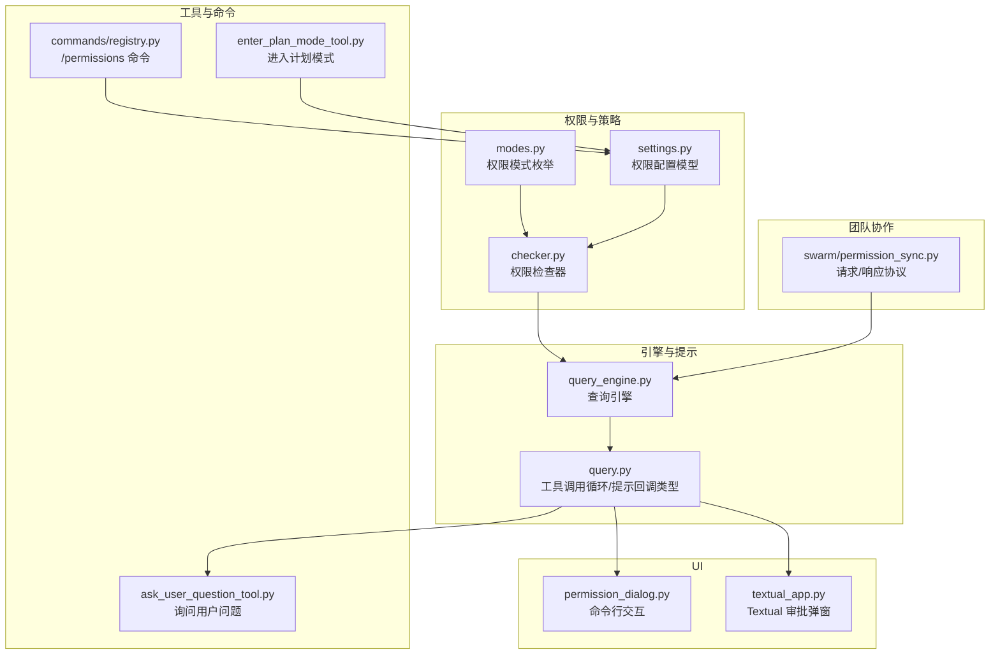
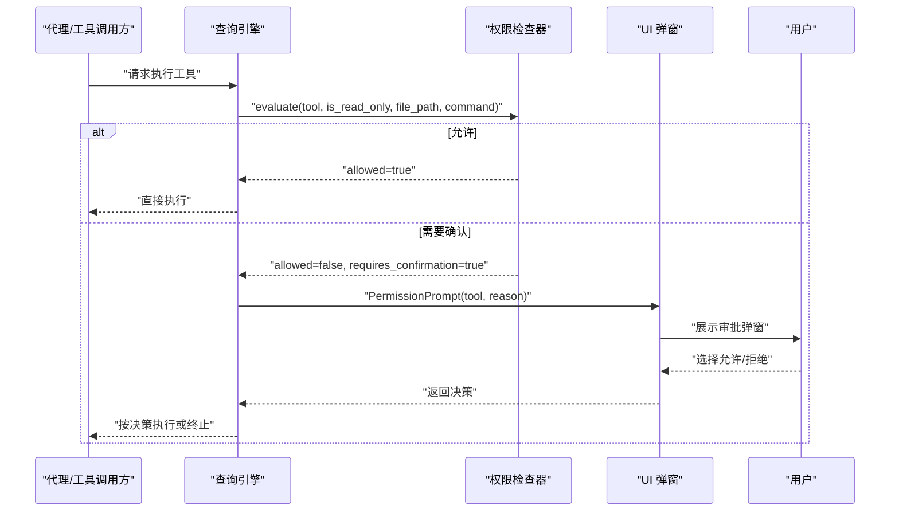
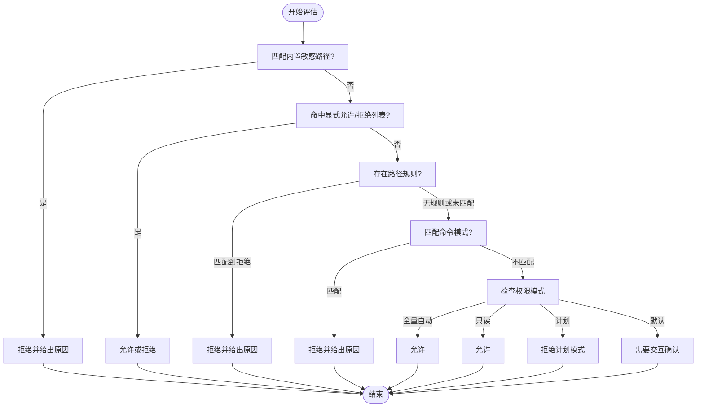
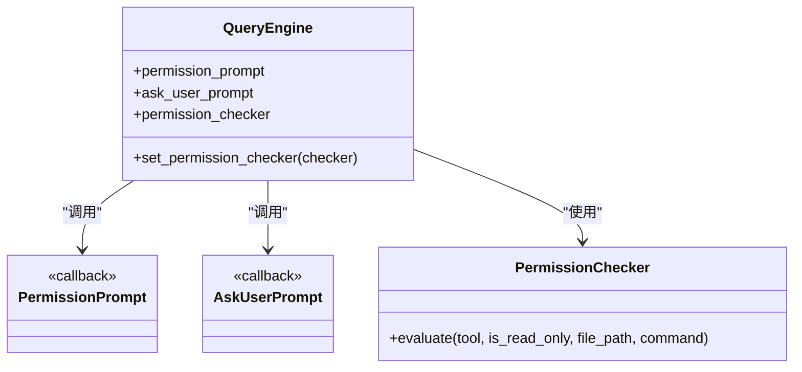
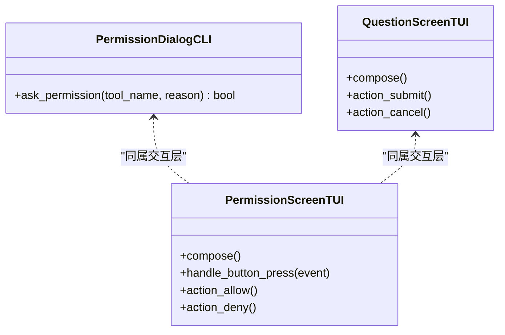
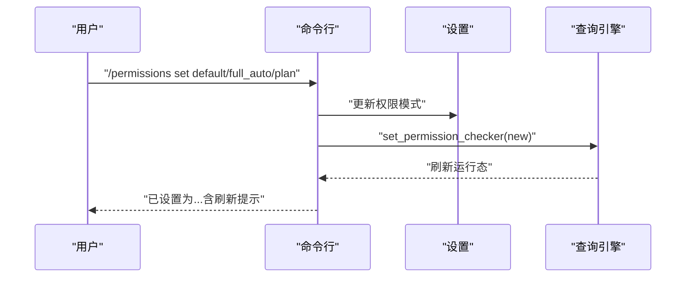
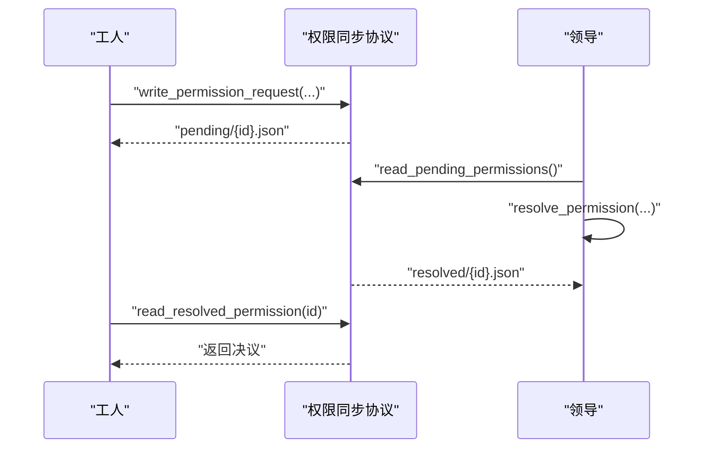
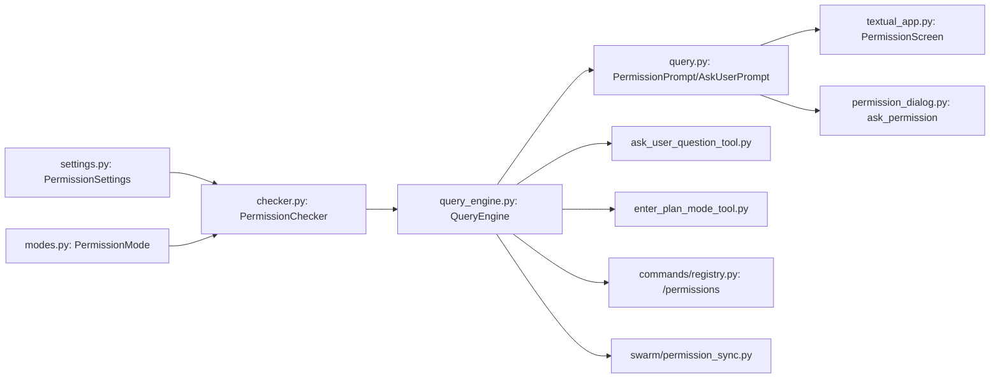

# 交互式审批

<cite>
**本文引用的文件**
- [checker.py](file://src/openharness/permissions/checker.py)
- [modes.py](file://src/openharness/permissions/modes.py)
- [settings.py](file://src/openharness/config/settings.py)
- [query_engine.py](file://src/openharness/engine/query_engine.py)
- [query.py](file://src/openharness/engine/query.py)
- [permission_dialog.py](file://src/openharness/ui/permission_dialog.py)
- [textual_app.py](file://src/openharness/ui/textual_app.py)
- [ask_user_question_tool.py](file://src/openharness/tools/ask_user_question_tool.py)
- [enter_plan_mode_tool.py](file://src/openharness/tools/enter_plan_mode_tool.py)
- [registry.py](file://src/openharness/commands/registry.py)
- [permission_sync.py](file://src/openharness/swarm/permission_sync.py)
- [test_checker.py](file://tests/test_permissions/test_checker.py)
- [test_query_engine.py](file://tests/test_engine/test_query_engine.py)
</cite>

## 目录
1. [简介](#简介)
2. [项目结构](#项目结构)
3. [核心组件](#核心组件)
4. [架构总览](#架构总览)
5. [详细组件分析](#详细组件分析)
6. [依赖关系分析](#依赖关系分析)
7. [性能考量](#性能考量)
8. [故障排查指南](#故障排查指南)
9. [结论](#结论)
10. [附录](#附录)

## 简介
本文件面向 OpenHarness 的“交互式审批”能力，系统性阐述交互式审批对话框的触发条件、显示逻辑与用户交互流程；解释审批请求的生成机制、权限级别判断与审批决策过程；提供可配置项与自定义方法；并总结用户体验设计原则与安全注意事项。同时对比交互式审批与自动化权限模式（全量自动、计划模式）的差异与适用场景。

## 项目结构
围绕交互式审批的关键代码分布在以下模块：
- 权限策略与模式：permissions/checker.py、permissions/modes.py、config/settings.py
- 引擎与提示回调：engine/query_engine.py、engine/query.py
- 用户界面与交互：ui/permission_dialog.py、ui/textual_app.py
- 工具与命令：tools/ask_user_question_tool.py、tools/enter_plan_mode_tool.py、commands/registry.py
- 团队协作与请求流转：swarm/permission_sync.py
- 测试用例：tests/test_permissions/test_checker.py、tests/test_engine/test_query_engine.py

图表来源
- [checker.py:57-156](file://src/openharness/permissions/checker.py#L57-L156)
- [modes.py:8-13](file://src/openharness/permissions/modes.py#L8-L13)
- [settings.py:50-58](file://src/openharness/config/settings.py#L50-L58)
- [query_engine.py:21-125](file://src/openharness/engine/query_engine.py#L21-L125)
- [query.py:53-156](file://src/openharness/engine/query.py#L53-L156)
- [permission_dialog.py:8-14](file://src/openharness/ui/permission_dialog.py#L8-L14)
- [textual_app.py:47-86](file://src/openharness/ui/textual_app.py#L47-L86)
- [ask_user_question_tool.py:21-47](file://src/openharness/tools/ask_user_question_tool.py#L21-L47)
- [enter_plan_mode_tool.py:16-28](file://src/openharness/tools/enter_plan_mode_tool.py#L16-L28)
- [registry.py:1487-1512](file://src/openharness/commands/registry.py#L1487-L1512)
- [permission_sync.py:1-20](file://src/openharness/swarm/permission_sync.py#L1-L20)

章节来源
- [checker.py:1-201](file://src/openharness/permissions/checker.py#L1-L201)
- [modes.py:1-14](file://src/openharness/permissions/modes.py#L1-L14)
- [settings.py:1-200](file://src/openharness/config/settings.py#L1-L200)
- [query_engine.py:1-200](file://src/openharness/engine/query_engine.py#L1-L200)
- [query.py:1-200](file://src/openharness/engine/query.py#L1-L200)
- [permission_dialog.py:1-15](file://src/openharness/ui/permission_dialog.py#L1-L15)
- [textual_app.py:1-200](file://src/openharness/ui/textual_app.py#L1-L200)
- [ask_user_question_tool.py:1-47](file://src/openharness/tools/ask_user_question_tool.py#L1-L47)
- [enter_plan_mode_tool.py:1-28](file://src/openharness/tools/enter_plan_mode_tool.py#L1-L28)
- [registry.py:1487-1512](file://src/openharness/commands/registry.py#L1487-L1512)
- [permission_sync.py:1-200](file://src/openharness/swarm/permission_sync.py#L1-L200)

## 核心组件
- 权限检查器：根据权限模式、工具白/黑名单、路径规则、命令模式等判定是否允许执行或需要交互确认。
- 权限模式：默认、计划、全量自动三种模式，决定工具执行策略与交互频率。
- 引擎提示回调：在需要用户确认时，通过 PermissionPrompt 回调触发 UI 层交互。
- UI 交互层：命令行与 Textual 弹窗两种交互方式，分别用于 CLI 会话与 TUI 会话。
- 工具与命令：ask_user_question_tool 提供运行时问答；enter_plan_mode_tool 与 /permissions 命令用于切换权限模式。
- 团队协作同步：在多智能体场景下，使用文件与邮箱协议进行请求/响应的跨进程/跨节点协调。

章节来源
- [checker.py:57-156](file://src/openharness/permissions/checker.py#L57-L156)
- [modes.py:8-13](file://src/openharness/permissions/modes.py#L8-L13)
- [query.py:53-156](file://src/openharness/engine/query.py#L53-L156)
- [permission_dialog.py:8-14](file://src/openharness/ui/permission_dialog.py#L8-L14)
- [textual_app.py:47-86](file://src/openharness/ui/textual_app.py#L47-L86)
- [ask_user_question_tool.py:21-47](file://src/openharness/tools/ask_user_question_tool.py#L21-L47)
- [enter_plan_mode_tool.py:16-28](file://src/openharness/tools/enter_plan_mode_tool.py#L16-L28)
- [registry.py:1487-1512](file://src/openharness/commands/registry.py#L1487-L1512)
- [permission_sync.py:1-200](file://src/openharness/swarm/permission_sync.py#L1-L200)

## 架构总览
交互式审批贯穿“策略判定—提示触发—用户交互—决策落地”的闭环。默认模式下，非只读且可能改变工作区的工具会被拦截并要求用户确认；在计划模式下，仅阻止变更类操作；全量自动模式则允许一切工具执行。引擎在工具调用前评估权限，必要时通过 PermissionPrompt 回调触发 UI 弹窗，用户选择后继续执行或终止。

图表来源
- [query_engine.py:21-125](file://src/openharness/engine/query_engine.py#L21-L125)
- [checker.py:75-156](file://src/openharness/permissions/checker.py#L75-L156)
- [textual_app.py:47-86](file://src/openharness/ui/textual_app.py#L47-L86)
- [permission_dialog.py:8-14](file://src/openharness/ui/permission_dialog.py#L8-L14)

## 详细组件分析

### 权限检查与决策流程
- 敏感路径保护：内置敏感路径模式集合，无论模式为何均严格禁止访问。
- 工具白/黑名单：显式允许/拒绝工具优先级高于其他规则。
- 路径规则：支持 glob 模式匹配，deny 规则优先于 allow。
- 命令模式：对高风险命令（如删除、安装）进行模式化匹配与拒绝。
- 模式策略：
  - 默认：只读工具放行，变更类工具需交互确认；提供 bash 包安装提示。
  - 计划：阻止变更类工具，直到退出计划模式。
  - 全量自动：放行所有工具。
- 返回值：PermissionDecision 同时携带 allowed、requires_confirmation 与 reason，便于 UI 与日志使用。

图表来源
- [checker.py:75-156](file://src/openharness/permissions/checker.py#L75-L156)

章节来源
- [checker.py:14-37](file://src/openharness/permissions/checker.py#L14-L37)
- [checker.py:75-156](file://src/openharness/permissions/checker.py#L75-L156)
- [modes.py:8-13](file://src/openharness/permissions/modes.py#L8-L13)
- [test_checker.py:12-35](file://tests/test_permissions/test_checker.py#L12-L35)

### 引擎中的交互触发与回调
- 查询引擎持有 PermissionPrompt 回调，当权限检查器返回需要确认时，引擎调用该回调以触发 UI 弹窗。
- 引擎还支持 AskUserPrompt，用于 ask_user_question 工具在运行时向用户提问。
- 引擎在初始化时注入 PermissionChecker，并可在运行时更新。

图表来源
- [query_engine.py:24-61](file://src/openharness/engine/query_engine.py#L24-L61)
- [query.py:137-156](file://src/openharness/engine/query.py#L137-L156)
- [checker.py:75-156](file://src/openharness/permissions/checker.py#L75-L156)

章节来源
- [query_engine.py:21-125](file://src/openharness/engine/query_engine.py#L21-L125)
- [query.py:53-156](file://src/openharness/engine/query.py#L53-L156)

### UI 交互与对话框
- 命令行交互：通过命令行会话的 PromptSession 进行 y/n 确认。
- TUI 弹窗：Textual 的 PermissionScreen 提供图形化“允许/拒绝”按钮，绑定快捷键与事件处理。
- 问答弹窗：QuestionScreen 支持短文本输入，用于 ask_user_question 工具。

图表来源
- [permission_dialog.py:8-14](file://src/openharness/ui/permission_dialog.py#L8-L14)
- [textual_app.py:47-136](file://src/openharness/ui/textual_app.py#L47-L136)

章节来源
- [permission_dialog.py:1-15](file://src/openharness/ui/permission_dialog.py#L1-L15)
- [textual_app.py:47-136](file://src/openharness/ui/textual_app.py#L47-L136)

### 工具与命令：运行时问答与模式切换
- ask_user_question：在运行时向用户提问并返回答案，依赖 QueryContext 中的 ask_user_prompt 回调。
- enter_plan_mode：切换权限模式至计划模式。
- /permissions 命令：支持 show、set、plan 等子命令，动态修改权限模式并持久化。

图表来源
- [registry.py:1487-1512](file://src/openharness/commands/registry.py#L1487-L1512)
- [settings.py:50-58](file://src/openharness/config/settings.py#L50-L58)
- [query_engine.py:122-124](file://src/openharness/engine/query_engine.py#L122-L124)

章节来源
- [ask_user_question_tool.py:21-47](file://src/openharness/tools/ask_user_question_tool.py#L21-L47)
- [enter_plan_mode_tool.py:16-28](file://src/openharness/tools/enter_plan_mode_tool.py#L16-L28)
- [registry.py:1487-1512](file://src/openharness/commands/registry.py#L1487-L1512)

### 多智能体协作中的请求与响应
在团队模式下，工人（worker）向领导（leader）发起权限请求，领导解析后写回响应。支持文件目录与邮箱两种存储/传递方式，确保跨进程/跨节点的一致性与可见性。

图表来源
- [permission_sync.py:1-20](file://src/openharness/swarm/permission_sync.py#L1-L20)
- [permission_sync.py:546-544](file://src/openharness/swarm/permission_sync.py#L546-L544)
- [permission_sync.py:653-687](file://src/openharness/swarm/permission_sync.py#L653-L687)

章节来源
- [permission_sync.py:1-200](file://src/openharness/swarm/permission_sync.py#L1-L200)

## 依赖关系分析
- 权限策略依赖：checker 依赖 settings 的 PermissionSettings 与 PermissionMode；modes 提供枚举。
- 引擎依赖：query_engine 依赖 checker；query 定义 PermissionPrompt/AskUserPrompt 类型。
- UI 依赖：textual_app 与 permission_dialog 分别提供 TUI 与 CLI 交互。
- 工具与命令：ask_user_question_tool 依赖 ask_user_prompt；enter_plan_mode_tool 与 /permissions 命令依赖 settings。
- 协作依赖：permission_sync 为 swarm 场景提供请求/响应协议。

图表来源
- [settings.py:50-58](file://src/openharness/config/settings.py#L50-L58)
- [modes.py:8-13](file://src/openharness/permissions/modes.py#L8-L13)
- [checker.py:57-156](file://src/openharness/permissions/checker.py#L57-L156)
- [query_engine.py:21-125](file://src/openharness/engine/query_engine.py#L21-L125)
- [query.py:53-156](file://src/openharness/engine/query.py#L53-L156)
- [textual_app.py:47-86](file://src/openharness/ui/textual_app.py#L47-L86)
- [permission_dialog.py:8-14](file://src/openharness/ui/permission_dialog.py#L8-L14)
- [ask_user_question_tool.py:21-47](file://src/openharness/tools/ask_user_question_tool.py#L21-L47)
- [enter_plan_mode_tool.py:16-28](file://src/openharness/tools/enter_plan_mode_tool.py#L16-L28)
- [registry.py:1487-1512](file://src/openharness/commands/registry.py#L1487-L1512)
- [permission_sync.py:1-200](file://src/openharness/swarm/permission_sync.py#L1-L200)

章节来源
- [settings.py:1-200](file://src/openharness/config/settings.py#L1-L200)
- [modes.py:1-14](file://src/openharness/permissions/modes.py#L1-L14)
- [checker.py:1-201](file://src/openharness/permissions/checker.py#L1-L201)
- [query_engine.py:1-200](file://src/openharness/engine/query_engine.py#L1-L200)
- [query.py:1-200](file://src/openharness/engine/query.py#L1-L200)
- [textual_app.py:1-200](file://src/openharness/ui/textual_app.py#L1-L200)
- [permission_dialog.py:1-15](file://src/openharness/ui/permission_dialog.py#L1-L15)
- [ask_user_question_tool.py:1-47](file://src/openharness/tools/ask_user_question_tool.py#L1-L47)
- [enter_plan_mode_tool.py:1-28](file://src/openharness/tools/enter_plan_mode_tool.py#L1-L28)
- [registry.py:1487-1512](file://src/openharness/commands/registry.py#L1487-L1512)
- [permission_sync.py:1-200](file://src/openharness/swarm/permission_sync.py#L1-L200)

## 性能考量
- 权限检查成本低：基于规则匹配与常量时间查找，开销可忽略。
- UI 交互阻塞：交互确认会阻塞当前工具执行，建议在必要时才触发，避免频繁打断。
- 模式切换影响：全量自动模式减少交互次数，但降低安全边界；计划模式适合审慎阶段。
- 大规模工具调用：在批量执行前统一切换到全量自动模式，执行后再切回默认模式，平衡效率与安全。

## 故障排查指南
- 交互未触发：确认 PermissionPrompt 回调已注入，且权限检查器返回 requires_confirmation。
- 拒绝后仍执行：检查 resolve_permission 是否正确写入 resolved 状态并被读取。
- 模式切换无效：确认 /permissions 命令成功更新设置并调用 set_permission_checker。
- 敏感路径误判：核对 SENSITIVE_PATH_PATTERNS 与实际路径是否匹配。
- 测试验证：参考测试用例断言交互提示与错误信息。

章节来源
- [test_query_engine.py:993-1017](file://tests/test_engine/test_query_engine.py#L993-L1017)
- [test_checker.py:12-35](file://tests/test_permissions/test_checker.py#L12-L35)

## 结论
交互式审批通过“策略判定—提示触发—用户交互—决策落地”的闭环，既保障了安全性，又维持了灵活性。默认模式适用于日常开发，计划模式用于关键阶段，全量自动模式用于批量任务。结合 UI 与命令行交互、运行时问答与团队协作协议，OpenHarness 在不同场景下提供了可配置、可观测、可扩展的权限控制方案。

## 附录

### 配置选项与自定义方法
- 权限模式：通过 /permissions 命令或设置文件切换，默认、计划、全量自动。
- 工具白/黑名单：在设置中配置 allowed_tools/denied_tools。
- 路径规则：使用 PathRuleConfig 的 pattern/allow 组合，支持 glob 模式。
- 命令模式：配置 denied_commands，对高风险命令进行拦截。
- 自定义提示回调：在 QueryEngine 初始化时注入 PermissionPrompt/AskUserPrompt，实现自定义交互体验。

章节来源
- [settings.py:43-58](file://src/openharness/config/settings.py#L43-L58)
- [registry.py:1487-1512](file://src/openharness/commands/registry.py#L1487-L1512)
- [query_engine.py:24-61](file://src/openharness/engine/query_engine.py#L24-L61)
- [query.py:53-156](file://src/openharness/engine/query.py#L53-L156)

### 与自动化权限模式的区别与适用场景
- 默认模式：变更类工具需交互确认，适合日常开发与探索性任务。
- 计划模式：阻止变更类工具，适合审慎阶段与关键评审。
- 全量自动：放行所有工具，适合批量任务与受控环境。

章节来源
- [modes.py:8-13](file://src/openharness/permissions/modes.py#L8-L13)
- [checker.py:128-141](file://src/openharness/permissions/checker.py#L128-L141)
- [test_query_engine.py:993-1017](file://tests/test_engine/test_query_engine.py#L993-L1017)