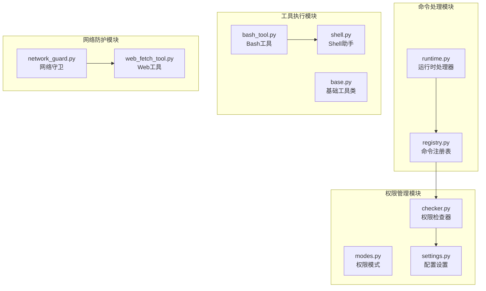
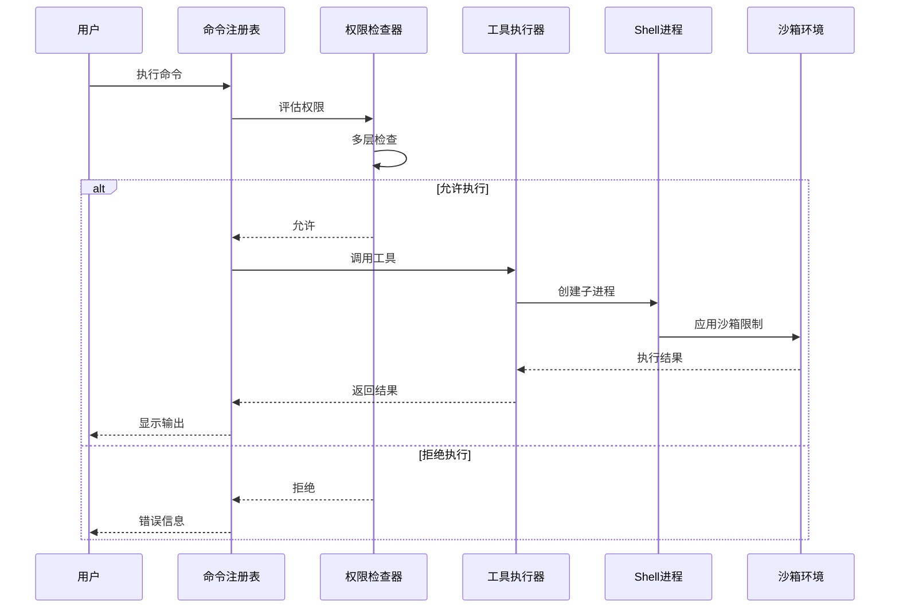
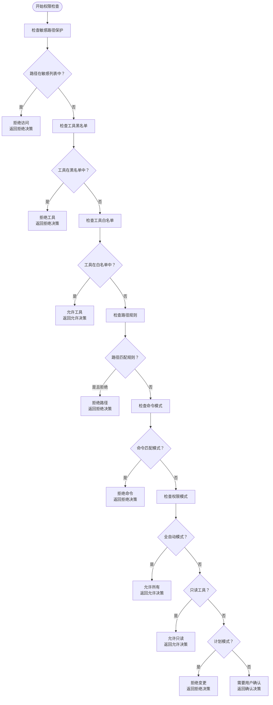
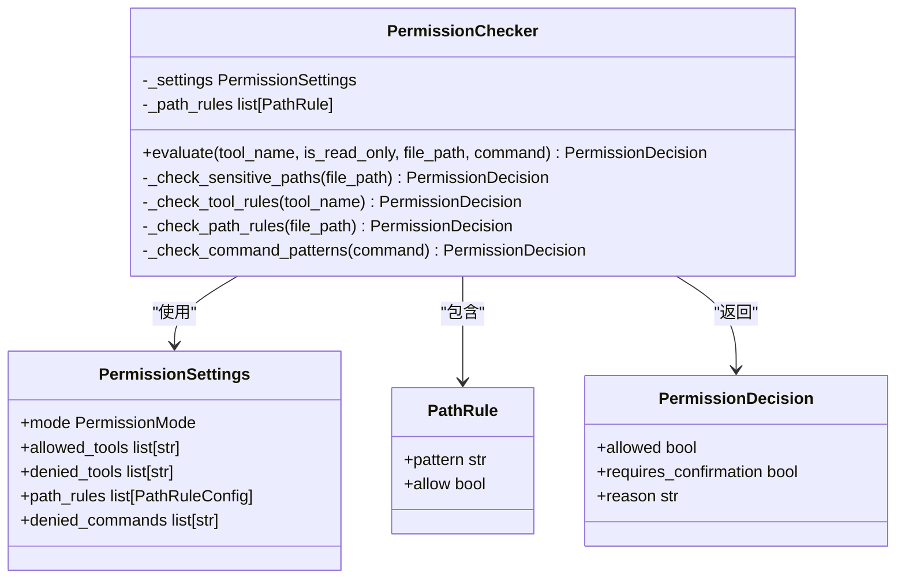
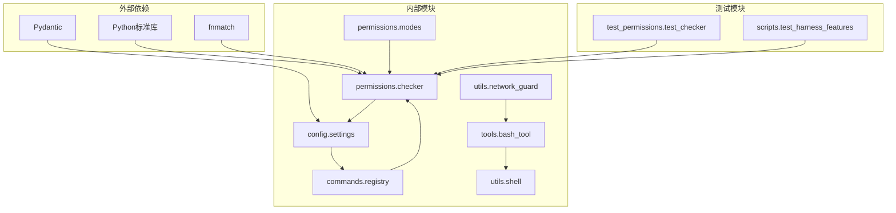

# 命令过滤机制

<cite>
**本文档引用的文件**
- [checker.py](file://src/openharness/permissions/checker.py)
- [modes.py](file://src/openharness/permissions/modes.py)
- [settings.py](file://src/openharness/config/settings.py)
- [registry.py](file://src/openharness/commands/registry.py)
- [bash_tool.py](file://src/openharness/tools/bash_tool.py)
- [base.py](file://src/openharness/tools/base.py)
- [shell.py](file://src/openharness/utils/shell.py)
- [network_guard.py](file://src/openharness/utils/network_guard.py)
- [web_fetch_tool.py](file://src/openharness/tools/web_fetch_tool.py)
- [runtime.py](file://ohmo/gateway/runtime.py)
- [test_checker.py](file://tests/test_permissions/test_checker.py)
- [test_harness_features.py](file://scripts/test_harness_features.py)
</cite>

## 目录
1. [简介](#简介)
2. [项目结构](#项目结构)
3. [核心组件](#核心组件)
4. [架构概览](#架构概览)
5. [详细组件分析](#详细组件分析)
6. [依赖关系分析](#依赖关系分析)
7. [性能考虑](#性能考虑)
8. [故障排除指南](#故障排除指南)
9. [结论](#结论)

## 简介

OpenHarness 的命令过滤系统是一个多层次的安全防护机制，旨在防止危险命令的执行并保护系统免受恶意操作的影响。该系统通过白名单机制、危险命令识别算法和实时过滤策略相结合的方式，为用户提供了一个安全可靠的命令执行环境。

系统的核心目标是：
- 防止文件删除、系统修改等危险操作
- 限制网络访问权限
- 提供灵活的权限管理模式
- 支持实时过滤和动态配置
- 最小化对正常用户操作的影响

## 项目结构

命令过滤系统主要分布在以下模块中：

**图表来源**
- [checker.py:1-201](file://src/openharness/permissions/checker.py#L1-L201)
- [registry.py:1-800](file://src/openharness/commands/registry.py#L1-L800)
- [bash_tool.py:1-219](file://src/openharness/tools/bash_tool.py#L1-L219)

## 核心组件

### 权限检查器 (PermissionChecker)

权限检查器是整个命令过滤系统的核心组件，负责评估工具调用是否被允许执行。它实现了多层检查逻辑：

1. **内置敏感路径保护**：保护高价值凭证和密钥材料
2. **显式工具白名单/黑名单**：基于配置的工具访问控制
3. **路径级规则匹配**：基于通配符的文件路径访问控制
4. **命令模式匹配**：基于模式的命令执行控制
5. **权限模式决策**：根据当前权限模式进行最终判断

### 权限模式 (PermissionMode)

系统支持三种不同的权限模式：
- **DEFAULT**：默认模式，需要确认的变更型工具
- **PLAN**：计划模式，阻止所有变更型工具
- **FULL_AUTO**：完全自动模式，允许所有工具

### 配置设置 (PermissionSettings)

权限设置提供了灵活的配置选项：
- `mode`：当前权限模式
- `allowed_tools`：允许的工具列表
- `denied_tools`：禁止的工具列表
- `path_rules`：路径规则列表
- `denied_commands`：禁止的命令模式

**章节来源**
- [checker.py:57-156](file://src/openharness/permissions/checker.py#L57-L156)
- [modes.py:8-14](file://src/openharness/permissions/modes.py#L8-L14)
- [settings.py:50-58](file://src/openharness/config/settings.py#L50-L58)

## 架构概览

命令过滤系统的整体架构采用分层设计，确保了安全性和灵活性的平衡：

**图表来源**
- [registry.py:1487-1512](file://src/openharness/commands/registry.py#L1487-L1512)
- [checker.py:75-156](file://src/openharness/permissions/checker.py#L75-L156)
- [bash_tool.py:34-85](file://src/openharness/tools/bash_tool.py#L34-L85)

## 详细组件分析

### 权限检查算法

权限检查器实现了复杂的决策逻辑，按照特定顺序进行多项检查：

**图表来源**
- [checker.py:88-156](file://src/openharness/permissions/checker.py#L88-L156)

#### 敏感路径保护

系统内置了针对高价值凭证和密钥材料的保护机制：

- SSH 密钥和配置文件
- AWS 凭证
- GCP 凭证
- Azure 凭证
- GPG 密钥
- Docker 凭证
- Kubernetes 凭证
- OpenHarness 自身的凭证存储

这些保护措施是强制性的，无法通过用户配置或权限模式覆盖。

#### 危险命令识别算法

系统使用多种策略来识别潜在的危险命令：

1. **文件删除命令**：`rm -rf`, `del`, `erase`
2. **系统修改命令**：`apt`, `yum`, `pacman`, `brew` 等包管理器
3. **网络访问命令**：`curl`, `wget`, `nc`, `telnet`
4. **权限提升命令**：`sudo`, `su`, `chmod`, `chown`
5. **系统服务命令**：`systemctl`, `service`, `killall`

识别算法使用通配符模式匹配，支持如 `rm -rf *` 这样的模糊匹配。

**章节来源**
- [checker.py:14-37](file://src/openharness/permissions/checker.py#L14-L37)
- [checker.py:119-126](file://src/openharness/permissions/checker.py#L119-L126)

### 命令注册表集成

命令注册表与权限检查系统深度集成，提供了以下功能：

1. **远程执行控制**：通过 `remote_invocable` 属性控制命令的远程执行能力
2. **管理员权限提升**：支持显式的远程管理员权限选择
3. **命令帮助系统**：提供详细的命令说明和使用示例
4. **别名支持**：支持命令别名映射

### 实时过滤策略

系统实现了多种实时过滤策略以确保安全性：

**图表来源**
- [checker.py:57-156](file://src/openharness/permissions/checker.py#L57-L156)
- [settings.py:50-58](file://src/openharness/config/settings.py#L50-L58)

**章节来源**
- [registry.py:165-203](file://src/openharness/commands/registry.py#L165-L203)
- [runtime.py:276-298](file://ohmo/gateway/runtime.py#L276-L298)

### 网络访问控制

系统提供了严格的网络访问控制机制：

1. **HTTP/HTTPS URL 验证**：确保只允许安全的协议
2. **公共地址验证**：拒绝回环和私有网络地址
3. **代理服务器支持**：支持配置代理服务器
4. **重定向跟踪**：验证每个重定向跳转的目标

**章节来源**
- [network_guard.py:25-51](file://src/openharness/utils/network_guard.py#L25-L51)
- [web_fetch_tool.py:87-92](file://src/openharness/tools/web_fetch_tool.py#L87-L92)

## 依赖关系分析

命令过滤系统的依赖关系体现了清晰的分层架构：

**图表来源**
- [checker.py:5-12](file://src/openharness/permissions/checker.py#L5-L12)
- [settings.py:19-25](file://src/openharness/config/settings.py#L19-L25)

**章节来源**
- [test_checker.py:1-128](file://tests/test_permissions/test_checker.py#L1-L128)
- [test_harness_features.py:156-224](file://scripts/test_harness_features.py#L156-L224)

## 性能考虑

命令过滤系统在设计时充分考虑了性能因素：

### 缓存策略
- 权限检查结果可以缓存以避免重复计算
- 路径规则编译后可重复使用
- 模式匹配结果可进行短期缓存

### 优化技术
- 使用高效的通配符匹配算法
- 早期退出策略减少不必要的检查
- 批量处理相似的权限请求
- 异步处理提高响应速度

### 内存管理
- 合理的内存使用避免长期运行时的内存泄漏
- 及时清理临时文件和资源
- 控制日志级别避免性能影响

## 故障排除指南

### 常见问题及解决方案

#### 权限检查失败
当遇到权限检查失败时，可以通过以下方式诊断：

1. **检查权限模式**：确认当前权限模式是否正确
2. **验证工具配置**：检查工具是否在白名单中
3. **审查路径规则**：确认路径规则是否过于严格
4. **检查命令模式**：验证命令是否被错误地标记为危险

#### 命令执行超时
如果命令执行超时，可能的原因包括：
- 命令本身执行时间过长
- 系统资源不足
- 网络连接问题
- 沙箱环境限制

#### 网络访问被拒绝
网络访问被拒绝的常见原因：
- 目标地址不是公共 IP
- 使用了不支持的协议
- 代理服务器配置错误
- DNS 解析失败

**章节来源**
- [bash_tool.py:62-74](file://src/openharness/tools/bash_tool.py#L62-L74)
- [network_guard.py:43-51](file://src/openharness/utils/network_guard.py#L43-L51)

## 结论

OpenHarness 的命令过滤系统通过多层次的安全防护机制，为用户提供了强大而灵活的命令执行控制能力。系统的设计充分考虑了安全性、可用性和性能之间的平衡，能够有效防止各种类型的危险操作，同时保持对正常用户操作的最小干扰。

关键优势包括：
- **全面的安全防护**：从路径保护到命令模式匹配的多层防护
- **灵活的配置选项**：支持细粒度的权限控制和动态调整
- **高性能设计**：优化的算法和缓存策略确保快速响应
- **易于扩展**：模块化的架构便于添加新的安全策略

未来的发展方向可能包括：
- 更智能的机器学习驱动的威胁检测
- 更精细的上下文感知权限控制
- 更强大的审计和日志功能
- 更好的用户体验和透明度