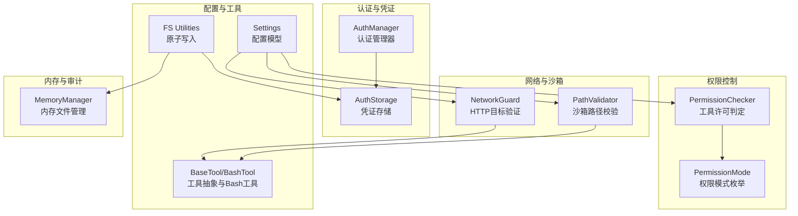
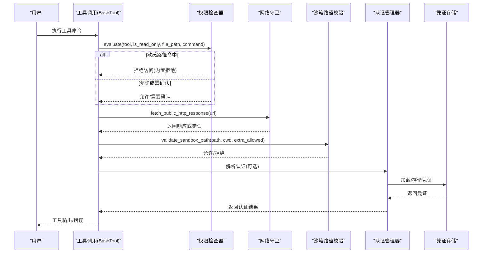
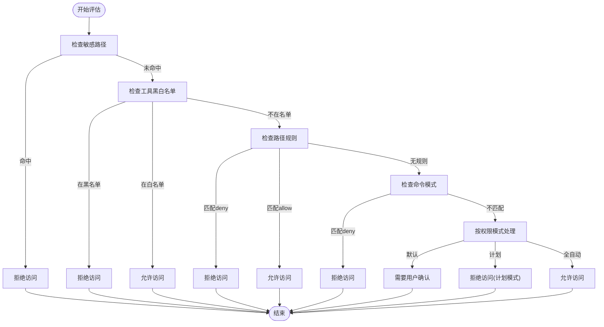
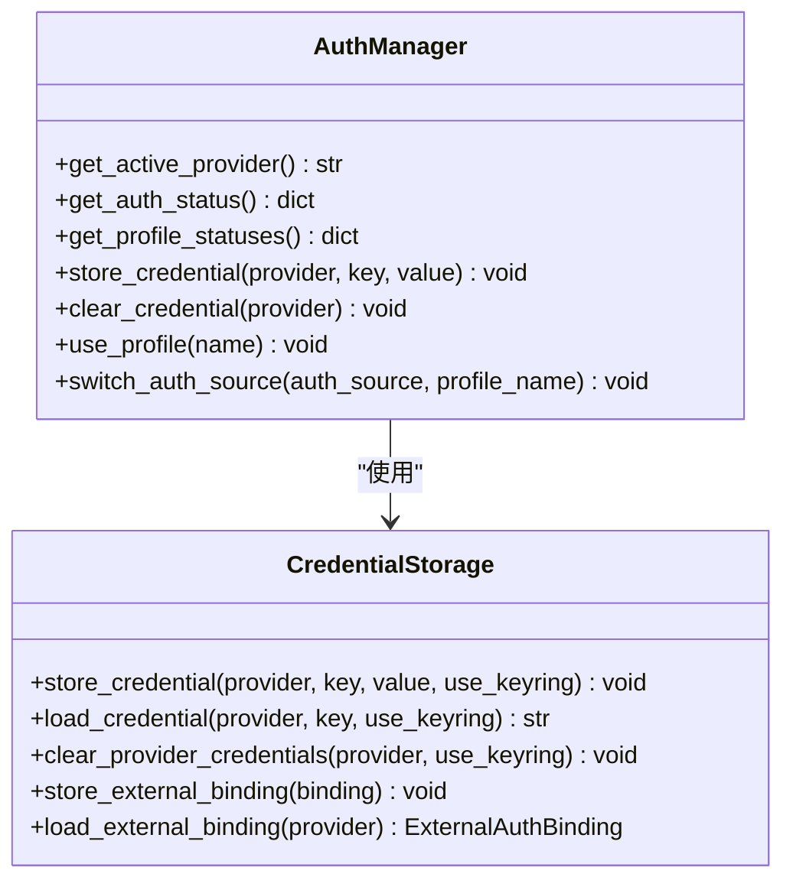
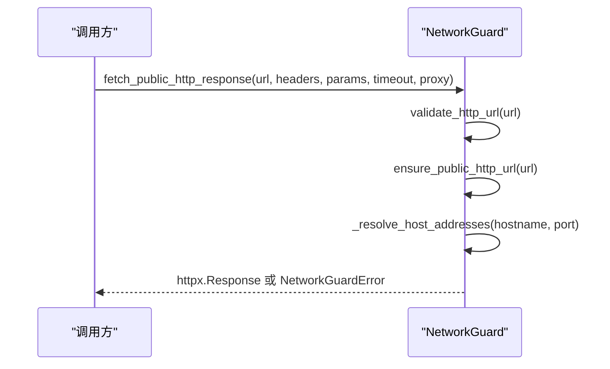
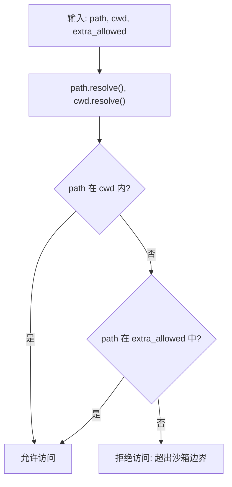
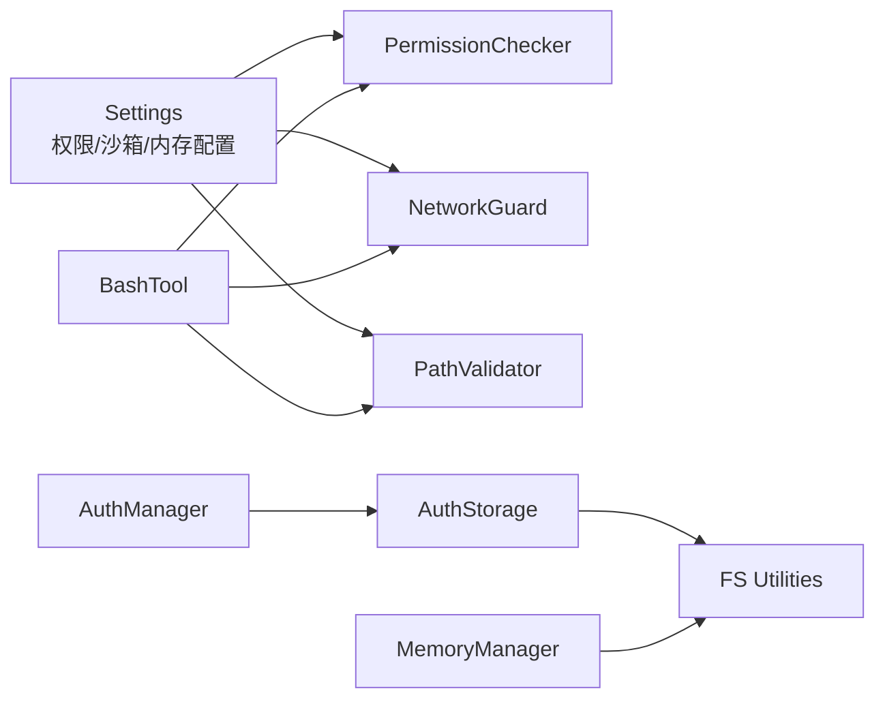

# 安全最佳实践

<cite>
**本文档引用的文件**
- [checker.py](file://src/openharness/permissions/checker.py)
- [modes.py](file://src/openharness/permissions/modes.py)
- [manager.py](file://src/openharness/auth/manager.py)
- [storage.py](file://src/openharness/auth/storage.py)
- [network_guard.py](file://src/openharness/utils/network_guard.py)
- [path_validator.py](file://src/openharness/sandbox/path_validator.py)
- [settings.py](file://src/openharness/config/settings.py)
- [fs.py](file://src/openharness/utils/fs.py)
- [manager.py](file://src/openharness/memory/manager.py)
- [base.py](file://src/openharness/tools/base.py)
- [bash_tool.py](file://src/openharness/tools/bash_tool.py)
- [test_checker.py](file://tests/test_permissions/test_checker.py)
- [test_flows.py](file://tests/test_auth/test_flows.py)
- [test_path_validator.py](file://tests/test_sandbox/test_path_validator.py)
- [test_project_plugin_security.py](file://tests/test_ui/test_project_plugin_security.py)
</cite>

## 目录
1. [简介](#简介)
2. [项目结构](#项目结构)
3. [核心组件](#核心组件)
4. [架构总览](#架构总览)
5. [详细组件分析](#详细组件分析)
6. [依赖关系分析](#依赖关系分析)
7. [性能考虑](#性能考虑)
8. [故障排除指南](#故障排除指南)
9. [结论](#结论)
10. [附录](#附录)

## 简介
本指南面向 OpenHarness 的使用者与运维人员，提供系统性的安全配置建议与最佳实践，覆盖默认权限设置、网络访问控制、文件系统保护、认证与凭证管理、审计与监控、常见威胁防护与应急响应流程，并结合代码实现说明安全配置对性能的影响与优化建议。

## 项目结构
OpenHarness 将安全能力分布在多个子系统中：
- 权限控制：基于模式与规则的工具执行许可判定
- 认证与凭证：统一的认证管理器与存储后端（文件/系统密钥环）
- 网络访问：出站 HTTP 请求的目标验证与限制
- 沙箱路径：工作目录边界与额外允许路径的校验
- 配置模型：集中化的安全相关配置项（权限、沙箱、内存等）
- 工具层：通用工具抽象与 Bash 工具的交互式命令预检
- 原子写入：持久化状态的原子性保障，降低崩溃导致的数据损坏风险

**图表来源**
- [checker.py:57-156](file://src/openharness/permissions/checker.py#L57-L156)
- [modes.py:8-14](file://src/openharness/permissions/modes.py#L8-L14)
- [manager.py:71-483](file://src/openharness/auth/manager.py#L71-L483)
- [storage.py:122-190](file://src/openharness/auth/storage.py#L122-L190)
- [network_guard.py:25-96](file://src/openharness/utils/network_guard.py#L25-L96)
- [path_validator.py:8-37](file://src/openharness/sandbox/path_validator.py#L8-L37)
- [settings.py:50-114](file://src/openharness/config/settings.py#L50-L114)
- [fs.py:39-77](file://src/openharness/utils/fs.py#L39-L77)
- [base.py:35-81](file://src/openharness/tools/base.py#L35-L81)
- [bash_tool.py:27-85](file://src/openharness/tools/bash_tool.py#L27-L85)
- [manager.py:39-121](file://src/openharness/memory/manager.py#L39-L121)

**章节来源**
- [checker.py:1-201](file://src/openharness/permissions/checker.py#L1-L201)
- [manager.py:1-483](file://src/openharness/auth/manager.py#L1-L483)
- [network_guard.py:1-135](file://src/openharness/utils/network_guard.py#L1-L135)
- [path_validator.py:1-38](file://src/openharness/sandbox/path_validator.py#L1-L38)
- [settings.py:1-800](file://src/openharness/config/settings.py#L1-L800)
- [fs.py:1-99](file://src/openharness/utils/fs.py#L1-L99)
- [base.py:1-81](file://src/openharness/tools/base.py#L1-L81)
- [bash_tool.py:1-219](file://src/openharness/tools/bash_tool.py#L1-L219)
- [manager.py:1-184](file://src/openharness/memory/manager.py#L1-L184)

## 核心组件
- 权限检查器（PermissionChecker）：根据权限模式、显式工具黑白名单、路径规则与命令模式匹配进行决策；内置敏感路径白名单拒绝列表，不受用户配置覆盖。
- 权限模式（PermissionMode）：默认（需要确认）、计划（仅允许只读/计划模式）、全自动（允许一切）。
- 认证管理器（AuthManager）：统一管理提供商认证状态、列出/切换配置文件、存储/清除凭证。
- 凭证存储（AuthStorage）：文件后端（默认 600 权限）+ 可选系统密钥环后端；提供原子写入与锁机制。
- 网络守卫（NetworkGuard）：校验 HTTP/HTTPS URL、拒绝非公网地址、逐跳验证重定向。
- 沙箱路径校验（PathValidator）：确保文件操作在工作目录边界内，支持额外允许路径。
- 配置模型（Settings）：集中定义权限、沙箱、内存等安全相关配置项。
- 工具抽象（BaseTool/BashTool）：标准化工具接口与 Bash 工具的交互式命令预检。
- 原子写入（FS Utilities）：所有持久化写入均采用原子替换，避免部分写入导致的数据损坏。
- 内存管理（MemoryManager）：团队内存中的敏感内容检查与原子写入。

**章节来源**
- [checker.py:57-156](file://src/openharness/permissions/checker.py#L57-L156)
- [modes.py:8-14](file://src/openharness/permissions/modes.py#L8-L14)
- [manager.py:71-483](file://src/openharness/auth/manager.py#L71-L483)
- [storage.py:122-190](file://src/openharness/auth/storage.py#L122-L190)
- [network_guard.py:25-96](file://src/openharness/utils/network_guard.py#L25-L96)
- [path_validator.py:8-37](file://src/openharness/sandbox/path_validator.py#L8-L37)
- [settings.py:50-114](file://src/openharness/config/settings.py#L50-L114)
- [base.py:35-81](file://src/openharness/tools/base.py#L35-L81)
- [bash_tool.py:27-85](file://src/openharness/tools/bash_tool.py#L27-L85)
- [fs.py:39-77](file://src/openharness/utils/fs.py#L39-L77)
- [manager.py:39-121](file://src/openharness/memory/manager.py#L39-L121)

## 架构总览
下图展示安全相关模块之间的交互关系与数据流：

**图表来源**
- [bash_tool.py:34-85](file://src/openharness/tools/bash_tool.py#L34-L85)
- [checker.py:75-156](file://src/openharness/permissions/checker.py#L75-L156)
- [network_guard.py:54-96](file://src/openharness/utils/network_guard.py#L54-L96)
- [path_validator.py:8-37](file://src/openharness/sandbox/path_validator.py#L8-L37)
- [manager.py:186-289](file://src/openharness/auth/manager.py#L186-L289)
- [storage.py:122-190](file://src/openharness/auth/storage.py#L122-L190)

## 详细组件分析

### 权限控制与工具许可
- 决策流程要点
  - 内置敏感路径拒绝：SSH、AWS、GCP、Azure、GPG、Docker、Kubernetes、OpenHarness 自身凭证等路径始终拒绝。
  - 显式工具黑名单优先于白名单。
  - 路径规则按 glob 匹配，deny 优先于 allow。
  - 命令模式匹配用于阻断高风险命令（如危险删除/安装）。
  - 模式策略：默认模式对变更型工具要求确认；计划模式阻止变更型工具；全自动模式允许一切。
  - 只读工具总是被允许。
- 安全增强
  - 对包安装/脚手架类命令给出明确提示，引导非交互参数。
  - 拒绝列表不可被用户配置绕过，形成纵深防御。

**图表来源**
- [checker.py:75-156](file://src/openharness/permissions/checker.py#L75-L156)

**章节来源**
- [checker.py:14-156](file://src/openharness/permissions/checker.py#L14-L156)
- [modes.py:8-14](file://src/openharness/permissions/modes.py#L8-L14)
- [test_checker.py:135-231](file://tests/test_permissions/test_checker.py#L135-L231)

### 认证与凭证管理
- 统一认证管理器
  - 支持多种提供商与认证源（API Key、OAuth、外部绑定等）。
  - 提供配置文件状态查询、活动配置切换、凭据存储/清除。
  - 与配置模型联动，支持按配置文件命名空间存储。
- 凭证存储
  - 文件后端：默认权限 600，原子写入，支持独占锁。
  - 密钥环后端：可用时优先使用，失败回退到文件后端。
  - 外部绑定：记录外部 CLI 管理的认证元数据。
- 安全要点
  - 不要在普通文本中存储机密；文件后端仅受 POSIX 权限保护。
  - 使用密钥环时，失败会回退到文件后端并记录警告。
  - 清理凭证时同步清理配置快照中的对应字段。

**图表来源**
- [manager.py:71-483](file://src/openharness/auth/manager.py#L71-L483)
- [storage.py:122-190](file://src/openharness/auth/storage.py#L122-L190)

**章节来源**
- [manager.py:186-483](file://src/openharness/auth/manager.py#L186-L483)
- [storage.py:122-270](file://src/openharness/auth/storage.py#L122-L270)

### 网络访问控制
- HTTP 目标验证
  - 仅允许 http/https，禁止嵌入凭证。
  - 解析主机并解析 IP 地址，拒绝非公网地址（loopback、私网等）。
  - 逐跳跟随重定向并逐一验证，限制最大重定向次数。
  - 支持通过环境变量指定代理，且代理 URL 同样受校验。
- 安全要点
  - 强制公网可达性，避免内部服务暴露。
  - 严格限制重定向链长度，防止重定向攻击。
  - 禁止代理中携带凭据，避免泄露。

**图表来源**
- [network_guard.py:54-96](file://src/openharness/utils/network_guard.py#L54-L96)

**章节来源**
- [network_guard.py:25-135](file://src/openharness/utils/network_guard.py#L25-L135)

### 沙箱路径边界保护
- 校验逻辑
  - 首先判断目标路径是否在工作目录相对路径内。
  - 若未通过，再检查是否在额外允许路径列表中。
  - 否则拒绝访问并返回原因。
- 安全要点
  - 阻止路径穿越（..）与符号链接逃逸。
  - 支持显式允许共享目录，但需谨慎配置。

**图表来源**
- [path_validator.py:8-37](file://src/openharness/sandbox/path_validator.py#L8-L37)

**章节来源**
- [path_validator.py:8-37](file://src/openharness/sandbox/path_validator.py#L8-L37)
- [test_path_validator.py:10-90](file://tests/test_sandbox/test_path_validator.py#L10-L90)

### 配置模型与安全开关
- 权限与沙箱配置
  - 权限模式、工具黑白名单、路径规则、命令模式。
  - 沙箱网络与文件系统限制（允许/拒绝域与路径）。
- 安全要点
  - 通过配置文件与环境变量控制权限策略。
  - 沙箱设置直接影响运行时隔离强度。

**章节来源**
- [settings.py:50-114](file://src/openharness/config/settings.py#L50-L114)

### 工具层与交互式命令预检
- 工具抽象
  - 标准化工具接口与执行上下文。
- Bash 工具
  - 预检交互式脚手架命令，提示非交互参数。
  - 超时与输出截断处理，避免长时间占用。
- 安全要点
  - 非交互式工具无法处理安装器提示，应使用非交互标志。
  - 超时后保留部分输出便于诊断。

**章节来源**
- [base.py:35-81](file://src/openharness/tools/base.py#L35-L81)
- [bash_tool.py:27-219](file://src/openharness/tools/bash_tool.py#L27-L219)

### 原子写入与持久化安全
- 原子写入
  - 临时文件 + 替换，保证写入完整性。
  - 写入后 fsync，必要时应用目标权限。
- 安全要点
  - 避免崩溃导致的半写文件。
  - 与独占锁配合，防止并发写入冲突。

**章节来源**
- [fs.py:39-99](file://src/openharness/utils/fs.py#L39-L99)

### 内存与团队敏感内容
- 团队内存中的敏感内容检查与原子写入，防止意外泄露。
- 安全要点
  - 在添加/更新团队内存条目前进行敏感内容检查。
  - 使用原子写入与独占锁，确保一致性。

**章节来源**
- [manager.py:39-121](file://src/openharness/memory/manager.py#L39-L121)

## 依赖关系分析
- 权限控制依赖配置模型中的权限设置，同时对工具层提供统一的许可判定入口。
- 认证管理器依赖凭证存储模块，负责凭据的加载/保存与外部绑定管理。
- 网络守卫与沙箱路径校验分别作用于网络与文件系统边界，共同构成运行时隔离。
- 原子写入为凭证与内存等关键状态提供持久化安全保障。
- 测试用例覆盖了权限拒绝、网络目标验证、沙箱边界与项目插件加载等关键安全场景。

**图表来源**
- [settings.py:50-114](file://src/openharness/config/settings.py#L50-L114)
- [checker.py:57-156](file://src/openharness/permissions/checker.py#L57-L156)
- [network_guard.py:25-96](file://src/openharness/utils/network_guard.py#L25-L96)
- [path_validator.py:8-37](file://src/openharness/sandbox/path_validator.py#L8-L37)
- [manager.py:71-483](file://src/openharness/auth/manager.py#L71-L483)
- [storage.py:122-190](file://src/openharness/auth/storage.py#L122-L190)
- [fs.py:39-77](file://src/openharness/utils/fs.py#L39-L77)
- [bash_tool.py:27-85](file://src/openharness/tools/bash_tool.py#L27-L85)
- [manager.py:39-121](file://src/openharness/memory/manager.py#L39-L121)

**章节来源**
- [test_checker.py:1-231](file://tests/test_permissions/test_checker.py#L1-L231)
- [test_flows.py:1-125](file://tests/test_auth/test_flows.py#L1-L125)
- [test_path_validator.py:1-90](file://tests/test_sandbox/test_path_validator.py#L1-L90)
- [test_project_plugin_security.py:1-62](file://tests/test_ui/test_project_plugin_security.py#L1-L62)

## 性能考虑
- 权限检查
  - glob 规则匹配与命令模式匹配开销较低，但在大量规则时建议精简。
  - 内置敏感路径检查为常量时间，影响可忽略。
- 网络请求
  - DNS 解析与逐跳验证会增加延迟，合理设置超时与最大重定向数。
  - 代理使用可能引入额外网络开销，建议在可信网络内启用。
- 沙箱路径校验
  - 路径解析与相对化计算成本低，主要瓶颈在文件系统 I/O。
- 原子写入
  - 临时文件 + 替换与 fsync 会带来磁盘写入放大，但保证一致性。
- 工具执行
  - Bash 工具的超时与输出截断有助于避免长时间占用，提升整体响应性。

[本节为通用性能讨论，无需特定文件来源]

## 故障排除指南
- 权限相关
  - 症状：变更型工具被拒绝。
  - 排查：检查权限模式、工具黑白名单、路径规则与命令模式。
  - 处理：在默认模式下等待确认，或切换到全自动模式（仅在信任场景）。
  - 参考测试：[test_checker.py:12-50](file://tests/test_permissions/test_checker.py#L12-L50)
- 网络访问
  - 症状：HTTP 请求被拒绝或超时。
  - 排查：确认 URL 协议、主机解析、是否为公网地址、重定向链长度。
  - 处理：修正 URL、禁用代理或调整超时设置。
  - 参考测试：[test_flows.py:55-99](file://tests/test_auth/test_flows.py#L55-L99)
- 沙箱路径
  - 症状：文件操作被拒绝。
  - 排查：检查工作目录边界、是否使用 .. 或符号链接、额外允许路径配置。
  - 处理：调整目标路径至允许范围或添加额外允许路径。
  - 参考测试：[test_path_validator.py:22-90](file://tests/test_sandbox/test_path_validator.py#L22-L90)
- 凭证存储
  - 症状：凭据无法加载或保存失败。
  - 排查：检查密钥环可用性、文件权限、锁文件状态。
  - 处理：安装可用的密钥环后端或手动修复文件权限。
  - 参考实现：[storage.py:87-110](file://src/openharness/auth/storage.py#L87-L110)
- 项目插件 MCP
  - 症状：项目插件中的 MCP 服务器未加载。
  - 排查：确认是否启用了 allow_project_plugins。
  - 处理：显式开启允许选项以加载项目插件中的 MCP。
  - 参考测试：[test_project_plugin_security.py:34-62](file://tests/test_ui/test_project_plugin_security.py#L34-L62)

**章节来源**
- [test_checker.py:1-231](file://tests/test_permissions/test_checker.py#L1-L231)
- [test_flows.py:1-125](file://tests/test_auth/test_flows.py#L1-L125)
- [test_path_validator.py:1-90](file://tests/test_sandbox/test_path_validator.py#L1-L90)
- [test_project_plugin_security.py:1-62](file://tests/test_ui/test_project_plugin_security.py#L1-L62)
- [storage.py:87-110](file://src/openharness/auth/storage.py#L87-L110)

## 结论
OpenHarness 通过多层安全机制（权限控制、认证管理、网络与文件系统边界、原子写入与持久化）构建了稳健的安全基线。建议在生产环境中默认采用“默认”权限模式，严格限制沙箱边界与网络访问，谨慎启用全自动模式与项目插件 MCP。定期审查权限规则与网络策略，结合测试用例验证安全配置的有效性。

[本节为总结性内容，无需特定文件来源]

## 附录

### 安全配置模板与检查清单
- 默认生产环境
  - 权限模式：默认
  - 工具黑名单：包含高风险工具（如 rm、dd、格式化命令）
  - 路径规则：仅允许项目目录与必要的共享目录
  - 命令模式：拒绝危险命令（如 rm -rf、格式化磁盘）
  - 网络：仅允许公网域名，禁用代理或限制代理域
  - 沙箱：启用网络与文件系统限制
  - 凭证：优先使用系统密钥环，文件后端权限设为 600
- 开发/CI 环境
  - 权限模式：默认或计划（视信任度）
  - 沙箱：适度放宽，但仍限制网络与写入
  - 凭证：使用环境变量或受限密钥环
- 特殊场景
  - 项目插件 MCP：默认关闭，需要时显式开启 allow_project_plugins
  - 团队内存：启用敏感内容检查与原子写入

[本节为概念性模板，无需特定文件来源]

### 常见威胁与防护措施
- 提示注入与 LLM 指向敏感路径
  - 防护：内置敏感路径拒绝列表不可绕过
  - 参考：[checker.py:14-37](file://src/openharness/permissions/checker.py#L14-L37)
- 交互式安装器与脚手架
  - 防护：Bash 工具预检并提示非交互参数
  - 参考：[bash_tool.py:155-219](file://src/openharness/tools/bash_tool.py#L155-L219)
- 非法网络访问
  - 防护：HTTP 目标验证与公网地址检查
  - 参考：[network_guard.py:25-96](file://src/openharness/utils/network_guard.py#L25-L96)
- 路径穿越与符号链接逃逸
  - 防护：沙箱路径校验与额外允许路径白名单
  - 参考：[path_validator.py:8-37](file://src/openharness/sandbox/path_validator.py#L8-L37)
- 凭证泄露与持久化损坏
  - 防护：原子写入与独占锁，密钥环优先
  - 参考：[fs.py:39-77](file://src/openharness/utils/fs.py#L39-L77)，[storage.py:122-190](file://src/openharness/auth/storage.py#L122-L190)

[本节为概念性内容，无需特定文件来源]

### 应急响应流程
- 发现异常
  - 检查权限决策日志与网络访问日志
  - 快速定位触发工具与命令
- 隔离与恢复
  - 切换到计划模式或收紧权限规则
  - 清理可疑凭据与外部绑定
  - 重新初始化沙箱与内存索引
- 复盘与加固
  - 更新路径规则与命令模式
  - 评估网络策略与代理配置
  - 回归测试关键安全场景

[本节为概念性流程，无需特定文件来源]