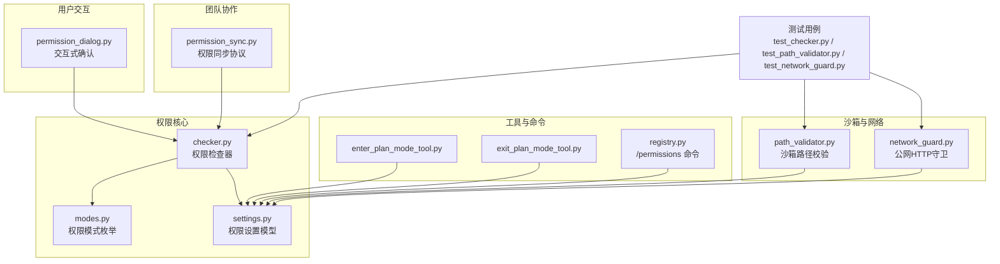
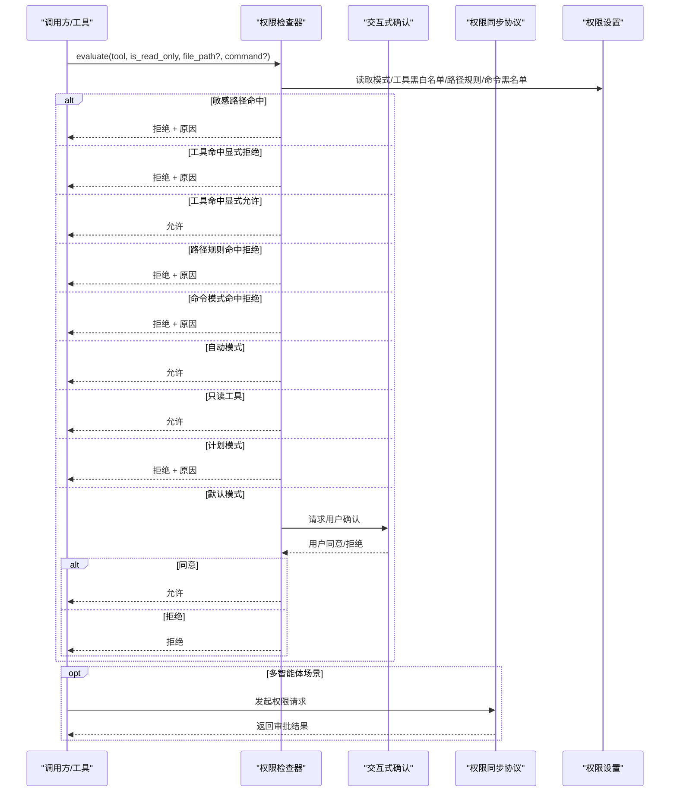
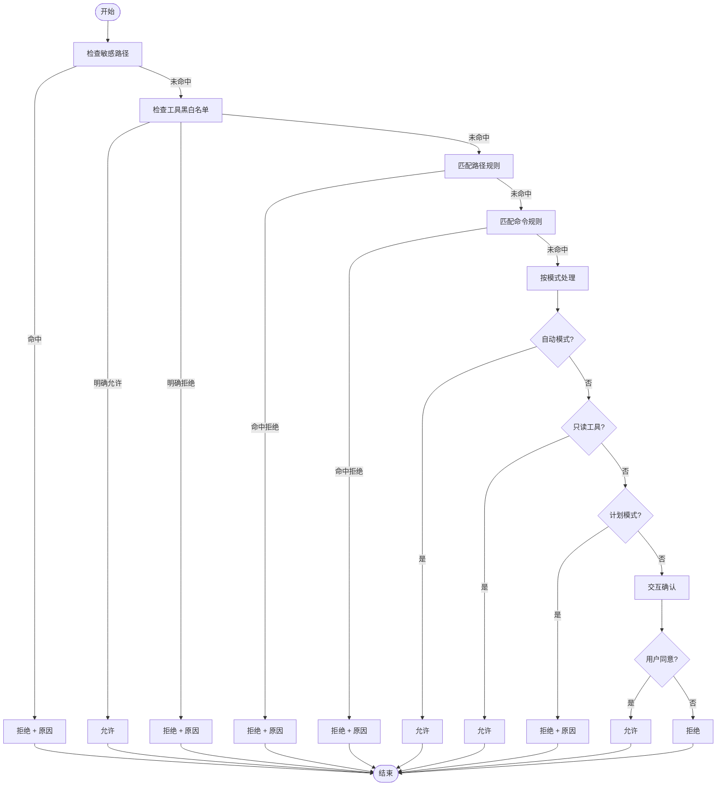
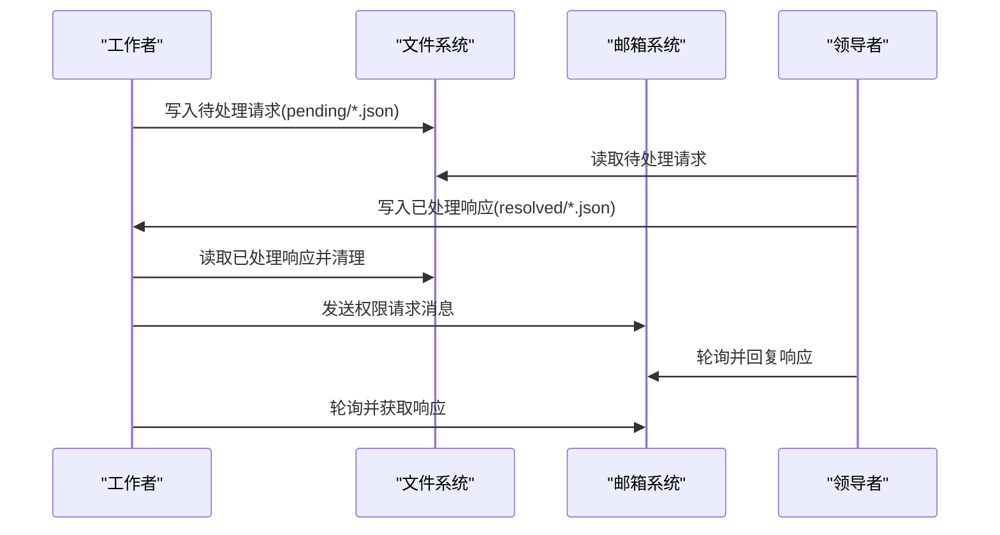
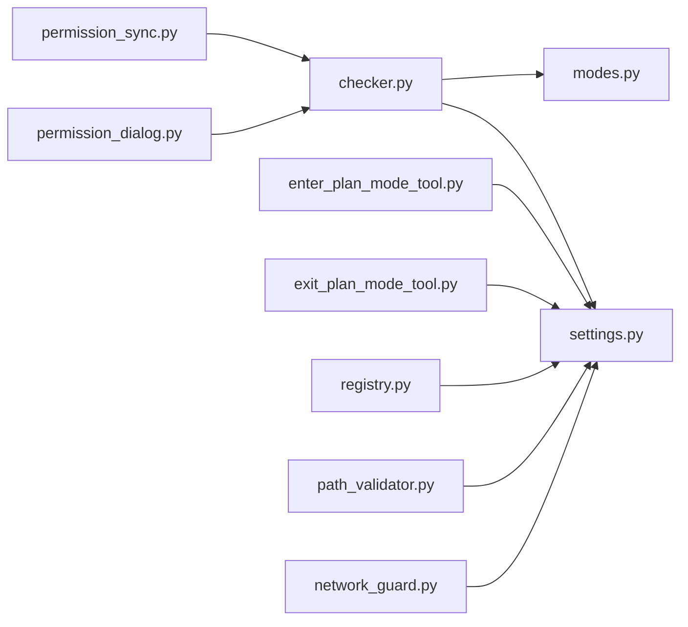

# 权限和安全

<cite>
**本文引用的文件**
- [checker.py](file://src/openharness/permissions/checker.py)
- [modes.py](file://src/openharness/permissions/modes.py)
- [settings.py](file://src/openharness/config/settings.py)
- [permission_dialog.py](file://src/openharness/ui/permission_dialog.py)
- [permission_sync.py](file://src/openharness/swarm/permission_sync.py)
- [enter_plan_mode_tool.py](file://src/openharness/tools/enter_plan_mode_tool.py)
- [exit_plan_mode_tool.py](file://src/openharness/tools/exit_plan_mode_tool.py)
- [registry.py](file://src/openharness/commands/registry.py)
- [network_guard.py](file://src/openharness/utils/network_guard.py)
- [path_validator.py](file://src/openharness/sandbox/path_validator.py)
- [test_checker.py](file://tests/test_permissions/test_checker.py)
- [test_path_validator.py](file://tests/test_sandbox/test_path_validator.py)
- [test_network_guard.py](file://tests/test_utils/test_network_guard.py)
</cite>

## 目录
1. [简介](#简介)
2. [项目结构](#项目结构)
3. [核心组件](#核心组件)
4. [架构总览](#架构总览)
5. [详细组件分析](#详细组件分析)
6. [依赖关系分析](#依赖关系分析)
7. [性能考量](#性能考量)
8. [故障排查指南](#故障排查指南)
9. [结论](#结论)
10. [附录：安全配置示例与最佳实践](#附录安全配置示例与最佳实践)

## 简介
本文件系统性阐述 OpenHarness 的权限与安全体系，重点覆盖多层级权限模式（默认模式、自动模式、计划模式）、路径规则配置、命令过滤机制、交互式审批对话框、沙箱边界与网络访问控制等。文档同时提供安全最佳实践、常见问题排查与性能优化建议，并通过图示展示关键流程。

## 项目结构
围绕权限与安全的关键模块分布如下：
- 权限核心：权限检查器、权限模式枚举、权限设置模型
- 用户交互：交互式权限确认对话框
- 团队协作：跨节点权限请求/响应协议（文件与邮箱两种方式）
- 工具与命令：进入/退出计划模式工具、/permissions 命令注册
- 沙箱与网络：路径边界校验、公网 HTTP 访问守卫
- 测试：权限决策、沙箱路径校验、网络守卫行为验证

**图表来源**
- [checker.py:57-156](file://src/openharness/permissions/checker.py#L57-L156)
- [modes.py:8-13](file://src/openharness/permissions/modes.py#L8-L13)
- [settings.py:50-58](file://src/openharness/config/settings.py#L50-L58)
- [permission_dialog.py:8-14](file://src/openharness/ui/permission_dialog.py#L8-L14)
- [permission_sync.py:101-268](file://src/openharness/swarm/permission_sync.py#L101-L268)
- [enter_plan_mode_tool.py:23-28](file://src/openharness/tools/enter_plan_mode_tool.py#L23-L28)
- [exit_plan_mode_tool.py:23-28](file://src/openharness/tools/exit_plan_mode_tool.py#L23-L28)
- [registry.py:1487-1512](file://src/openharness/commands/registry.py#L1487-L1512)
- [path_validator.py:8-37](file://src/openharness/sandbox/path_validator.py#L8-L37)
- [network_guard.py:25-96](file://src/openharness/utils/network_guard.py#L25-L96)

**章节来源**
- [checker.py:1-201](file://src/openharness/permissions/checker.py#L1-L201)
- [modes.py:1-14](file://src/openharness/permissions/modes.py#L1-L14)
- [settings.py:50-58](file://src/openharness/config/settings.py#L50-L58)
- [permission_dialog.py:1-15](file://src/openharness/ui/permission_dialog.py#L1-L15)
- [permission_sync.py:1-1169](file://src/openharness/swarm/permission_sync.py#L1-L1169)
- [enter_plan_mode_tool.py:1-29](file://src/openharness/tools/enter_plan_mode_tool.py#L1-L29)
- [exit_plan_mode_tool.py:1-29](file://src/openharness/tools/exit_plan_mode_tool.py#L1-L29)
- [registry.py:1487-1512](file://src/openharness/commands/registry.py#L1487-L1512)
- [path_validator.py:1-38](file://src/openharness/sandbox/path_validator.py#L1-L38)
- [network_guard.py:1-135](file://src/openharness/utils/network_guard.py#L1-L135)

## 核心组件
- 权限检查器（PermissionChecker）：根据权限模式、显式允许/拒绝列表、路径规则、命令模式、只读工具策略进行综合判定，返回是否允许及是否需要交互确认。
- 权限模式（PermissionMode）：默认模式（需要交互确认）、计划模式（阻断变更型操作）、自动模式（允许一切）。
- 权限设置（PermissionSettings）：包含模式、工具白名单/黑名单、路径规则、命令黑名单。
- 交互式确认（ask_permission）：在需要时弹出 y/N 提示，等待用户决策。
- 沙箱路径校验（validate_sandbox_path）：确保文件操作仅限于工作目录或额外允许目录范围内。
- 公网 HTTP 守卫（network_guard）：校验 URL 协议、主机、凭据字段，并拒绝私有/回环地址目标。

**章节来源**
- [checker.py:57-156](file://src/openharness/permissions/checker.py#L57-L156)
- [modes.py:8-13](file://src/openharness/permissions/modes.py#L8-L13)
- [settings.py:50-58](file://src/openharness/config/settings.py#L50-L58)
- [permission_dialog.py:8-14](file://src/openharness/ui/permission_dialog.py#L8-L14)
- [path_validator.py:8-37](file://src/openharness/sandbox/path_validator.py#L8-L37)
- [network_guard.py:25-96](file://src/openharness/utils/network_guard.py#L25-L96)

## 架构总览
OpenHarness 的权限与安全由“策略层 + 执行层 + 交互层 + 协作层”构成：
- 策略层：权限设置模型与模式定义，决定整体安全策略。
- 执行层：权限检查器按优先级评估工具调用，内置敏感路径保护与路径/命令规则匹配。
- 交互层：对需要确认的操作触发交互式对话框，获得用户许可后继续。
- 协作层：在多智能体场景下，提供文件/邮箱两种权限请求/响应通道，支持领导者集中审批。

**图表来源**
- [checker.py:75-156](file://src/openharness/permissions/checker.py#L75-L156)
- [permission_dialog.py:8-14](file://src/openharness/ui/permission_dialog.py#L8-L14)
- [permission_sync.py:335-387](file://src/openharness/swarm/permission_sync.py#L335-L387)

**章节来源**
- [checker.py:75-156](file://src/openharness/permissions/checker.py#L75-L156)
- [permission_dialog.py:8-14](file://src/openharness/ui/permission_dialog.py#L8-L14)
- [permission_sync.py:335-387](file://src/openharness/swarm/permission_sync.py#L335-L387)

## 详细组件分析

### 权限检查器（PermissionChecker）
- 敏感路径保护：内置针对 SSH、AWS、GCP、Azure、GPG、Docker、K8s、OpenHarness 自身凭证的通配规则，无条件拒绝，不受模式与用户配置影响。
- 工具级控制：显式允许列表优先于拒绝列表；若未命中则进入规则匹配。
- 路径规则：基于 glob 模式匹配，支持目录根匹配（追加尾随斜杠），拒绝优先于允许。
- 命令模式：对命令字符串进行 glob 匹配，命中即拒绝。
- 模式策略：
  - 自动模式：放行所有（除敏感路径外）。
  - 只读工具：无条件放行。
  - 计划模式：阻断变更型工具。
  - 默认模式：变更型工具需交互确认，提供 bash 行为提示。
- 辅助函数：
  - 路径匹配扩展：为目录工具提供“目录根”与“目录根/”两种形式参与匹配。
  - Bash 提示：识别安装/初始化类命令并给出工作区变更说明。

**图表来源**
- [checker.py:88-156](file://src/openharness/permissions/checker.py#L88-L156)

**章节来源**
- [checker.py:14-37](file://src/openharness/permissions/checker.py#L14-L37)
- [checker.py:57-156](file://src/openharness/permissions/checker.py#L57-L156)

### 权限模式（PermissionMode）
- default：默认模式，变更型工具需交互确认。
- plan：计划模式，阻断变更型工具，适合审阅/规划阶段。
- full_auto：自动模式，放行一切（仍受敏感路径保护）。

**章节来源**
- [modes.py:8-13](file://src/openharness/permissions/modes.py#L8-L13)

### 权限设置（PermissionSettings）
- 字段：mode、allowed_tools、denied_tools、path_rules、denied_commands。
- 与模型解析：支持从配置文件加载，路径规则以 PathRuleConfig 形式存储，命令黑名单以字符串模式存储。

**章节来源**
- [settings.py:43-58](file://src/openharness/config/settings.py#L43-L58)
- [settings.py:50-58](file://src/openharness/config/settings.py#L50-L58)

### 交互式权限对话框（ask_permission）
- 异步提示用户是否允许某个工具执行，返回布尔值作为最终决策依据之一。

**章节来源**
- [permission_dialog.py:8-14](file://src/openharness/ui/permission_dialog.py#L8-L14)

### 多智能体权限同步（permission_sync）
- 文件式：在团队目录下维护 pending/resolved 两个目录，写入/读取 JSON 请求与响应，带锁保证一致性。
- 邮箱式：通过消息总线发送/接收权限请求与响应，支持轮询与异步处理。
- 角色判定：通过环境变量识别领导者与工作者，支持领导者名称查询。
- 数据结构：SwarmPermissionRequest、PermissionResolution、SwarmPermissionResponse 等。

**图表来源**
- [permission_sync.py:409-460](file://src/openharness/swarm/permission_sync.py#L409-L460)
- [permission_sync.py:546-569](file://src/openharness/swarm/permission_sync.py#L546-L569)
- [permission_sync.py:766-800](file://src/openharness/swarm/permission_sync.py#L766-L800)

**章节来源**
- [permission_sync.py:1-1169](file://src/openharness/swarm/permission_sync.py#L1-L1169)

### 计划模式切换工具与命令
- 工具：enter_plan_mode_tool、exit_plan_mode_tool 修改设置中的权限模式并持久化。
- 命令：/permissions set <mode> 或 /permissions plan 支持远程可选，更新运行时权限检查器状态。

**章节来源**
- [enter_plan_mode_tool.py:23-28](file://src/openharness/tools/enter_plan_mode_tool.py#L23-L28)
- [exit_plan_mode_tool.py:23-28](file://src/openharness/tools/exit_plan_mode_tool.py#L23-L28)
- [registry.py:1487-1512](file://src/openharness/commands/registry.py#L1487-L1512)

### 沙箱路径边界与网络访问控制
- 沙箱路径校验：确保目标路径位于工作目录内，或在额外允许列表中；否则拒绝。
- 网络访问守卫：校验 URL 协议、主机、凭据字段；解析目标地址并拒绝非公网地址（回环/私网）；限制重定向次数并支持代理校验。

**章节来源**
- [path_validator.py:8-37](file://src/openharness/sandbox/path_validator.py#L8-L37)
- [network_guard.py:25-96](file://src/openharness/utils/network_guard.py#L25-L96)

## 依赖关系分析
- 权限检查器依赖：
  - 权限设置模型（含模式、工具黑白名单、路径规则、命令黑名单）
  - 权限模式枚举
  - 路径规则解析与匹配（glob）
- 交互确认依赖：
  - UI 会话（prompt_toolkit）
- 多智能体协作依赖：
  - 文件系统锁与目录结构
  - 邮箱消息总线
- 沙箱与网络依赖：
  - 路径解析与相对性判断
  - DNS 解析与 IP 地址判定

**图表来源**
- [checker.py:9-10](file://src/openharness/permissions/checker.py#L9-L10)
- [settings.py:23-25](file://src/openharness/config/settings.py#L23-L25)
- [permission_dialog.py](file://src/openharness/ui/permission_dialog.py#L5)
- [permission_sync.py:36-45](file://src/openharness/swarm/permission_sync.py#L36-L45)
- [enter_plan_mode_tool.py:7-8](file://src/openharness/tools/enter_plan_mode_tool.py#L7-L8)
- [exit_plan_mode_tool.py:7-8](file://src/openharness/tools/exit_plan_mode_tool.py#L7-L8)
- [registry.py](file://src/openharness/commands/registry.py#L1496)
- [path_validator.py](file://src/openharness/sandbox/path_validator.py#L5)
- [network_guard.py](file://src/openharness/utils/network_guard.py#L9)

**章节来源**
- [checker.py:1-201](file://src/openharness/permissions/checker.py#L1-L201)
- [settings.py:1-1030](file://src/openharness/config/settings.py#L1-L1030)
- [permission_dialog.py:1-15](file://src/openharness/ui/permission_dialog.py#L1-L15)
- [permission_sync.py:1-1169](file://src/openharness/swarm/permission_sync.py#L1-L1169)
- [enter_plan_mode_tool.py:1-29](file://src/openharness/tools/enter_plan_mode_tool.py#L1-L29)
- [exit_plan_mode_tool.py:1-29](file://src/openharness/tools/exit_plan_mode_tool.py#L1-L29)
- [registry.py:1487-1512](file://src/openharness/commands/registry.py#L1487-L1512)
- [path_validator.py:1-38](file://src/openharness/sandbox/path_validator.py#L1-L38)
- [network_guard.py:1-135](file://src/openharness/utils/network_guard.py#L1-L135)

## 性能考量
- 权限检查复杂度：
  - 路径规则与命令规则采用线性扫描，时间复杂度 O(R+P)，R 为规则数，P 为路径候选数（目录工具会增加一个候选）。
  - glob 匹配为字符串模式匹配，通常常数时间，整体开销与规则数量线性相关。
- 交互确认：
  - 异步提示可能引入 I/O 等待，建议在批量工具调用前合并策略或减少交互频率。
- 多智能体同步：
  - 文件式同步涉及磁盘 IO 与锁竞争，建议在高并发场景优先使用邮箱式同步。
- 网络守卫：
  - DNS 解析与 IP 判定为异步 IO，建议缓存解析结果或复用连接客户端。
- 沙箱路径校验：
  - 路径解析与相对性判断为常量时间，成本极低。

[本节为通用性能讨论，不直接分析具体文件，故无章节来源]

## 故障排查指南
- 敏感路径被误拒：
  - 确认路径是否命中内置敏感路径模式；如确属误判，可在路径规则中添加允许规则（注意仅允许必要范围）。
- 路径规则无效：
  - 检查规则 pattern 是否为空/空白/非字符串；无效规则会被跳过并记录警告。
- 计划模式无法执行变更：
  - 使用 /permissions plan 进入计划模式后，变更型工具将被阻断；退出计划模式或切换到自动模式。
- 自动模式仍被拒绝：
  - 确认是否为敏感路径；自动模式不会绕过敏感路径保护。
- 交互确认未触发：
  - 确认当前模式为默认模式且工具为变更型；只读工具与自动模式不会触发交互。
- 沙箱路径被拒绝：
  - 确认目标路径是否在工作目录内或额外允许列表中；避免符号链接指向外部路径。
- 公网 HTTP 请求失败：
  - 检查 URL 协议/主机/凭据字段；确保目标解析到公网地址；检查代理配置与重定向次数限制。

**章节来源**
- [test_checker.py:77-84](file://tests/test_permissions/test_checker.py#L77-L84)
- [test_checker.py:135-231](file://tests/test_permissions/test_checker.py#L135-L231)
- [test_path_validator.py:48-89](file://tests/test_sandbox/test_path_validator.py#L48-L89)
- [network_guard.py:25-96](file://src/openharness/utils/network_guard.py#L25-L96)

## 结论
OpenHarness 的权限与安全体系通过“内置敏感路径保护 + 模式化策略 + 规则化路径/命令控制 + 交互确认 + 多智能体协作 + 沙箱边界与网络守卫”的组合，实现了从单机到多智能体场景下的可控执行。默认模式兼顾安全与可用性，计划模式适合审阅阶段，自动模式适用于受控实验环境。建议在生产环境中严格限制自动模式使用，合理配置路径与命令规则，并启用交互确认与沙箱边界控制。

[本节为总结性内容，不直接分析具体文件，故无章节来源]

## 附录：安全配置示例与最佳实践

### 安全配置示例
- 设置权限模式
  - 使用 /permissions set default /plan/full_auto 切换模式。
  - 或通过工具 enter_plan_mode/exit_plan_mode 修改设置并保存。
- 配置路径规则
  - 在配置中添加 path_rules，使用 glob 模式限定允许/拒绝范围。
  - 示例：对特定目录允许读取、对系统目录拒绝写入。
- 配置命令黑名单
  - 在 denied_commands 中添加危险命令模式，如 rm -rf / 等。
- 沙箱文件系统限制
  - filesystem.allow_write、deny_read、deny_write 控制写入范围与禁止读取的敏感目录。
  - network.allowed_domains、denied_domains 控制网络访问范围。
- 公网 HTTP 访问
  - 使用网络守卫校验 URL 并拒绝非公网地址；支持代理配置与最大重定向限制。

**章节来源**
- [registry.py:1487-1512](file://src/openharness/commands/registry.py#L1487-L1512)
- [enter_plan_mode_tool.py:23-28](file://src/openharness/tools/enter_plan_mode_tool.py#L23-L28)
- [exit_plan_mode_tool.py:23-28](file://src/openharness/tools/exit_plan_mode_tool.py#L23-L28)
- [settings.py:84-113](file://src/openharness/config/settings.py#L84-L113)
- [network_guard.py:54-96](file://src/openharness/utils/network_guard.py#L54-L96)

### 最佳实践
- 敏感路径保护
  - 保持内置敏感路径规则不变；仅在极端情况下通过路径规则放宽，且范围最小化。
- 路径规则设计
  - 使用精确的 glob 模式；对目录工具使用“目录根/”形式确保目录本身也被拒绝。
  - 将允许规则与拒绝规则分离，优先使用拒绝规则以防御未知风险。
- 命令过滤
  - 对高危命令（删除、格式化、安装等）建立明确的拒绝模式；对允许的安装命令限定到受控范围。
- 模式选择
  - 开发/审阅阶段使用 plan 模式；日常开发使用 default 模式并开启交互确认；仅在受控沙箱中使用 full_auto。
- 交互确认
  - 对变更型工具强制要求交互确认；对只读工具保持自动放行。
- 沙箱与网络
  - 严格限制沙箱外路径访问；对公网 HTTP 请求进行地址合法性与域名白名单校验。
- 多智能体协作
  - 在团队目录中统一管理权限请求；领导者集中审批并应用规则更新；定期清理旧的已决请求文件。

[本节为通用最佳实践，不直接分析具体文件，故无章节来源]