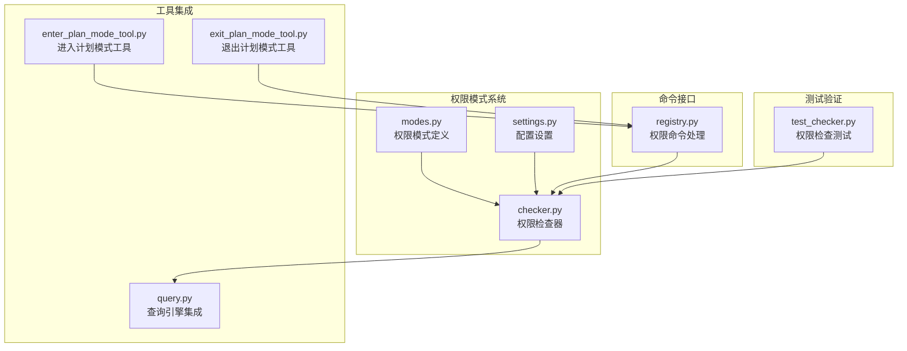
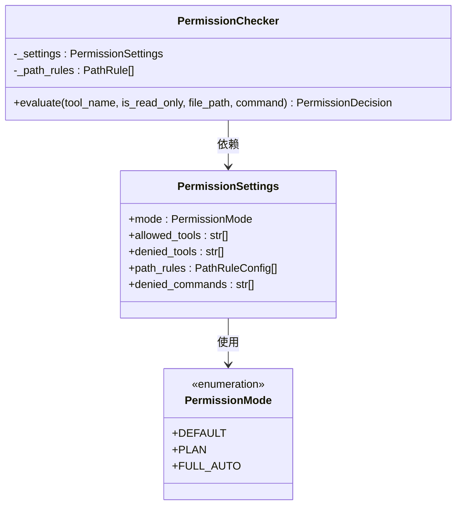
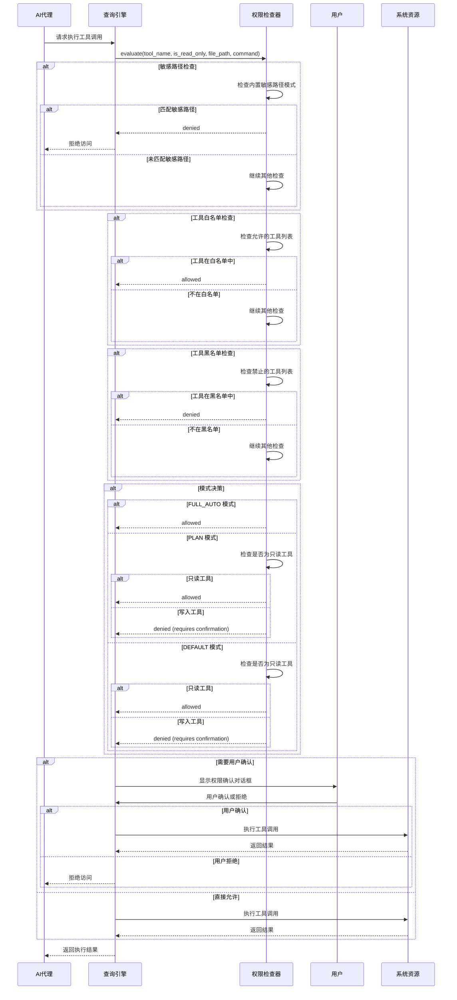
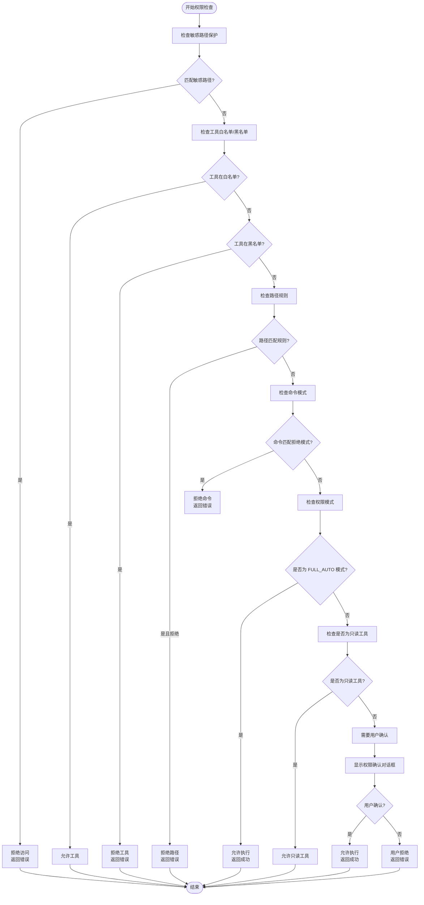
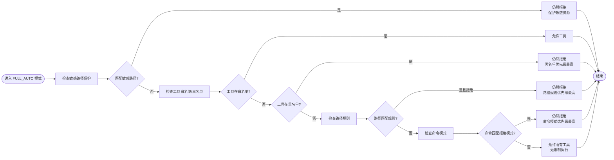
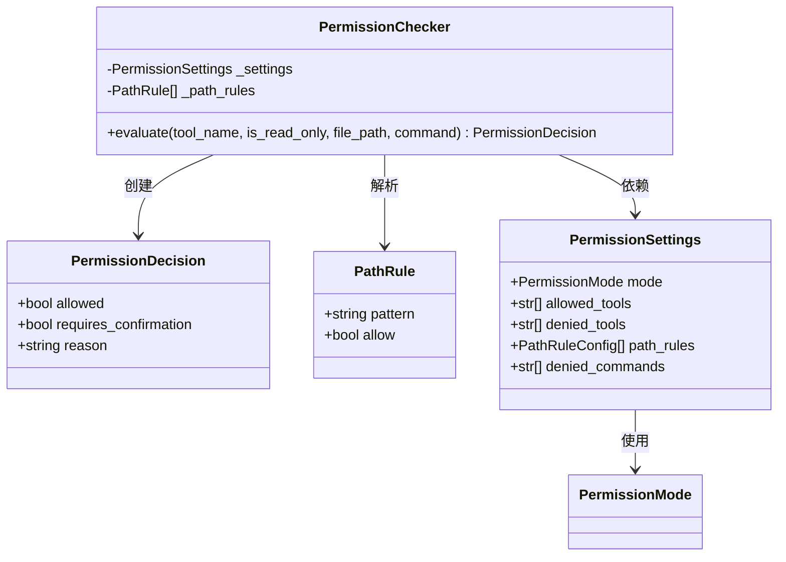
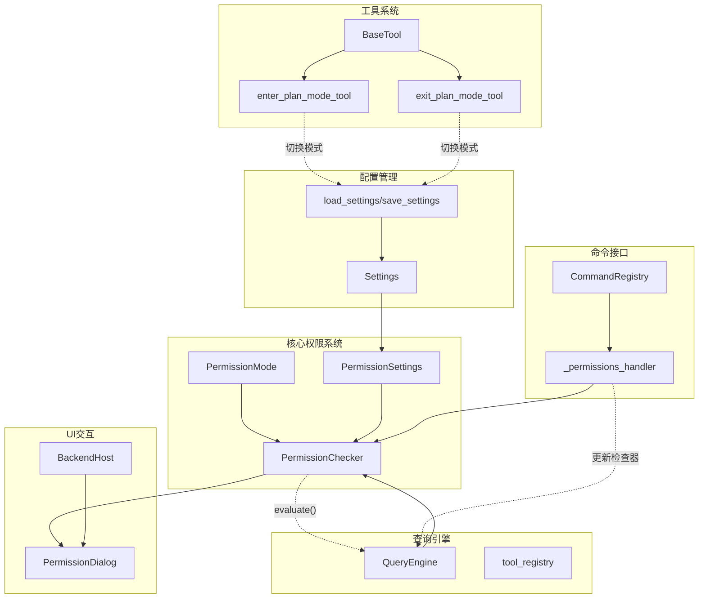

# 权限模式

<cite>
**本文档引用的文件**
- [modes.py](file://src/openharness/permissions/modes.py)
- [checker.py](file://src/openharness/permissions/checker.py)
- [settings.py](file://src/openharness/config/settings.py)
- [registry.py](file://src/openharness/commands/registry.py)
- [enter_plan_mode_tool.py](file://src/openharness/tools/enter_plan_mode_tool.py)
- [exit_plan_mode_tool.py](file://src/openharness/tools/exit_plan_mode_tool.py)
- [query.py](file://src/openharness/engine/query.py)
- [test_checker.py](file://tests/test_permissions/test_checker.py)
</cite>

## 目录
1. [简介](#简介)
2. [项目结构](#项目结构)
3. [核心组件](#核心组件)
4. [架构概览](#架构概览)
5. [详细组件分析](#详细组件分析)
6. [依赖关系分析](#依赖关系分析)
7. [性能考虑](#性能考虑)
8. [故障排除指南](#故障排除指南)
9. [结论](#结论)

## 简介

OpenHarness 的权限模式系统是一个多层次的安全控制框架，旨在为 AI 驱动的工具执行提供灵活而强大的访问控制。该系统提供了三种核心权限模式，每种模式都有不同的安全边界和使用场景：

- **DEFAULT 默认模式**：最严格的安全模式，要求用户确认所有可能修改系统的工具调用
- **PLAN 计划模式**：预授权机制，允许在特定会话中执行工具调用，但需要显式退出
- **FULL_AUTO 完全自动模式**：无限制执行模式，适用于受信任环境

该系统通过内置的敏感路径保护、工具白名单/黑名单机制、路径规则和命令模式匹配，确保即使在最宽松的模式下也能防止对关键系统资源的访问。

## 项目结构

权限模式系统主要分布在以下模块中：



**图表来源**
- [modes.py:1-14](file://src/openharness/permissions/modes.py#L1-L14)
- [checker.py:1-201](file://src/openharness/permissions/checker.py#L1-L201)
- [settings.py:50-58](file://src/openharness/config/settings.py#L50-L58)

**章节来源**
- [modes.py:1-14](file://src/openharness/permissions/modes.py#L1-L14)
- [checker.py:1-201](file://src/openharness/permissions/checker.py#L1-L201)
- [settings.py:50-58](file://src/openharness/config/settings.py#L50-L58)

## 核心组件

### 权限模式枚举

系统定义了三种基本权限模式：



**图表来源**
- [modes.py:8-13](file://src/openharness/permissions/modes.py#L8-L13)
- [settings.py:50-58](file://src/openharness/config/settings.py#L50-L58)
- [checker.py:57-156](file://src/openharness/permissions/checker.py#L57-L156)

### 内置敏感路径保护

系统包含一个不可绕过的敏感路径保护列表，涵盖各种凭证存储位置：

- SSH 密钥和配置：`*/.ssh/*`
- AWS 凭证：`*/.aws/credentials` 和 `*/.aws/config`
- GCP 凭证：`*/.config/gcloud/*`
- Azure 凭证：`*/.azure/*`
- GPG 密钥：`*/.gnupg/*`
- Docker 凭证：`*/.docker/config.json`
- Kubernetes 凭证：`*/.kube/config`
- OpenHarness 自身凭证：`*/.openharness/credentials.json` 和 `*/.openharness/copilot_auth.json`

**章节来源**
- [checker.py:14-37](file://src/openharness/permissions/checker.py#L14-L37)

## 架构概览

权限模式系统采用分层设计，从底层的敏感路径保护到高层的模式决策：



**图表来源**
- [checker.py:75-156](file://src/openharness/permissions/checker.py#L75-L156)
- [query.py:933-963](file://src/openharness/engine/query.py#L933-L963)

## 详细组件分析

### DEFAULT 默认模式

DEFAULT 模式是系统中最严格的安全模式，专为防止意外或恶意的系统修改而设计。

#### 触发条件
- 模式设置为 `PermissionMode.DEFAULT`
- 工具调用涉及可能修改系统的操作
- 工具不是只读工具

#### 执行流程



**图表来源**
- [checker.py:75-156](file://src/openharness/permissions/checker.py#L75-L156)

#### 安全边界
- **内置保护**：无法绕过的敏感路径保护
- **用户确认**：所有潜在破坏性操作都需要明确用户同意
- **上下文提示**：针对包安装等常见危险操作提供具体警告
- **会话限制**：确认仅在当前会话有效

**章节来源**
- [checker.py:143-156](file://src/openharness/permissions/checker.py#L143-L156)
- [test_checker.py:19-37](file://tests/test_permissions/test_checker.py#L19-L37)

### PLAN 计划模式

PLAN 模式提供了一种平衡的安全性和便利性的方法，特别适合需要进行一系列相关操作但又不想完全关闭安全检查的场景。

#### 触发条件
- 模式设置为 `PermissionMode.PLAN`
- 用户显式进入计划模式（通过 `/plan enter` 或 `enter_plan_mode` 工具）

#### 执行流程

```mermaid
stateDiagram-v2
[*] --> NormalMode : 默认状态
NormalMode --> PlanMode : 进入计划模式
PlanMode --> NormalMode : 退出计划模式
state PlanMode {
[*] --> ReadOnlyAllowed : 只读工具始终允许
ReadOnlyAllowed --> MutatingBlocked : 潜在修改工具被阻止
state MutatingBlocked {
[*] --> WaitingForExit : 等待用户退出计划模式
WaitingForExit --> PlanMode : 用户保持在计划模式
WaitingForExit --> NormalMode : 用户退出计划模式
}
ReadOnlyAllowed --> PlanMode : 用户保持在计划模式
}
state NormalMode {
[*] --> DefaultMode : 默认行为
DefaultMode --> NormalMode : 用户保持在普通模式
}
```

**图表来源**
- [checker.py:136-142](file://src/openharness/permissions/checker.py#L136-L142)
- [enter_plan_mode_tool.py:23-28](file://src/openharness/tools/enter_plan_mode_tool.py#L23-L28)
- [exit_plan_mode_tool.py:23-28](file://src/openharness/tools/exit_plan_mode_tool.py#L23-L28)

#### 安全边界
- **预授权机制**：在计划模式下，用户可以预先授权一系列相关操作
- **明确退出**：必须显式退出计划模式才能恢复默认的安全限制
- **会话范围**：计划模式仅在当前会话内有效
- **工具隔离**：潜在破坏性工具在计划模式下仍然被阻止

**章节来源**
- [checker.py:136-142](file://src/openharness/permissions/checker.py#L136-L142)
- [enter_plan_mode_tool.py:16-28](file://src/openharness/tools/enter_plan_mode_tool.py#L16-L28)
- [exit_plan_mode_tool.py:16-28](file://src/openharness/tools/exit_plan_mode_tool.py#L16-L28)

### FULL_AUTO 完全自动模式

FULL_AUTO 模式提供完全开放的工具执行能力，适用于受信任的开发环境或自动化场景。

#### 触发条件
- 模式设置为 `PermissionMode.FULL_AUTO`
- 用户明确切换到自动模式

#### 执行流程



**图表来源**
- [checker.py:128-131](file://src/openharness/permissions/checker.py#L128-L131)
- [checker.py:100-127](file://src/openharness/permissions/checker.py#L100-L127)

#### 安全边界
- **最高权限**：允许所有工具调用，无需用户确认
- **敏感资源保护**：内置敏感路径保护仍然有效，无法绕过
- **配置优先级**：白名单/黑名单、路径规则和命令模式仍然适用
- **风险意识**：建议仅在受信任环境中使用

**章节来源**
- [checker.py:128-131](file://src/openharness/permissions/checker.py#L128-L131)
- [test_checker.py:46-50](file://tests/test_permissions/test_checker.py#L46-L50)

### 权限检查器架构

权限检查器是整个系统的核心组件，负责执行具体的权限决策逻辑：



**图表来源**
- [checker.py:40-56](file://src/openharness/permissions/checker.py#L40-L56)
- [checker.py:57-74](file://src/openharness/permissions/checker.py#L57-L74)
- [settings.py:50-58](file://src/openharness/config/settings.py#L50-L58)

**章节来源**
- [checker.py:40-156](file://src/openharness/permissions/checker.py#L40-L156)

## 依赖关系分析

权限模式系统与其他组件的依赖关系如下：



**图表来源**
- [modes.py:8-13](file://src/openharness/permissions/modes.py#L8-L13)
- [checker.py:57-156](file://src/openharness/permissions/checker.py#L57-L156)
- [settings.py:50-58](file://src/openharness/config/settings.py#L50-L58)
- [enter_plan_mode_tool.py:16-28](file://src/openharness/tools/enter_plan_mode_tool.py#L16-L28)
- [exit_plan_mode_tool.py:16-28](file://src/openharness/tools/exit_plan_mode_tool.py#L16-L28)
- [registry.py:1477-1503](file://src/openharness/commands/registry.py#L1477-L1503)
- [query.py:933-963](file://src/openharness/engine/query.py#L933-L963)

**章节来源**
- [registry.py:1477-1512](file://src/openharness/commands/registry.py#L1477-L1512)
- [query.py:905-963](file://src/openharness/engine/query.py#L905-L963)

## 性能考虑

权限模式系统在设计时充分考虑了性能影响：

### 检查器优化
- **早期短路**：敏感路径检查在最前面执行，避免不必要的后续检查
- **缓存策略**：路径规则解析后缓存在内存中，避免重复解析
- **模式匹配优化**：使用高效的模式匹配算法，支持通配符和目录根路径

### 内存使用
- **规则存储**：路径规则以紧凑的数据结构存储
- **日志记录**：仅在调试级别启用详细日志，避免生产环境性能开销

### 并发处理
- **异步操作**：权限确认对话框支持异步等待用户响应
- **超时机制**：权限请求有合理的超时时间，防止长时间阻塞

## 故障排除指南

### 常见问题诊断

#### 问题：工具在 FULL_AUTO 模式下仍然被拒绝
**可能原因**：
- 工具在黑名单中
- 路径匹配到拒绝规则
- 命令匹配到拒绝模式
- 访问敏感路径

**解决方法**：
```python
# 检查工具状态
/permissions show

# 检查敏感路径保护
# 确认访问的路径不在敏感路径列表中
```

#### 问题：在 PLAN 模式下工具被阻止
**可能原因**：
- 工具不是只读工具
- 仍处于计划模式

**解决方法**：
```python
# 退出计划模式
/plan exit
# 或使用工具
exit_plan_mode
```

#### 问题：DEFAULT 模式下频繁出现确认提示
**可能原因**：
- 大量写入工具调用
- 包安装等常见危险操作

**解决方法**：
```python
# 临时切换到 FULL_AUTO（谨慎使用）
/permissions set full_auto

# 或者在计划模式下批量执行
/plan enter
# 执行相关工具
/plan exit
```

**章节来源**
- [test_checker.py:12-50](file://tests/test_permissions/test_checker.py#L12-L50)

### 调试技巧

#### 启用详细日志
```bash
export OPENHARNESS_LOG_LEVEL=DEBUG
```

#### 检查权限状态
```bash
/permissions show
```

#### 验证路径规则
```python
# 在 Python 中测试
from openharness.permissions import PermissionChecker
from openharness.config.settings import PermissionSettings

checker = PermissionChecker(PermissionSettings(mode="default"))
decision = checker.evaluate(
    "bash", 
    is_read_only=False, 
    file_path="/path/to/test",
    command="ls -la"
)
print(decision.reason)
```

## 结论

OpenHarness 的权限模式系统提供了一个全面而灵活的安全框架，能够在不同场景下平衡安全性与便利性：

### 设计优势
- **多层次保护**：从内置敏感路径保护到模式级别的访问控制
- **渐进式安全**：从最严格的 DEFAULT 模式到完全开放的 FULL_AUTO 模式
- **会话范围**：权限模式仅在当前会话内有效，便于管理和控制
- **透明度**：清晰的权限决策过程和可追溯的原因说明

### 使用建议

#### 开发环境
- **推荐模式**：DEFAULT 或 PLAN
- **理由**：需要严格的安全控制，避免意外修改

#### 生产环境
- **推荐模式**：DEFAULT
- **理由**：最高的安全保证，最小的攻击面

#### 自动化脚本
- **推荐模式**：FULL_AUTO（谨慎使用）
- **理由**：需要完全的执行自由，但应配合其他安全措施

#### 特殊场景
- **批量操作**：使用 PLAN 模式，执行完成后立即退出
- **紧急情况**：使用 FULL_AUTO，但应尽快恢复到 DEFAULT 模式

该系统通过精心设计的权限模型和丰富的配置选项，为不同需求和安全等级的用户提供了一个强大而灵活的工具执行控制平台。