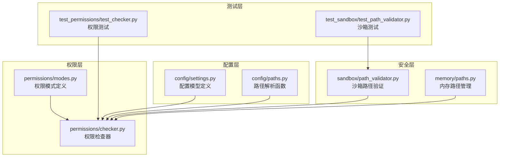
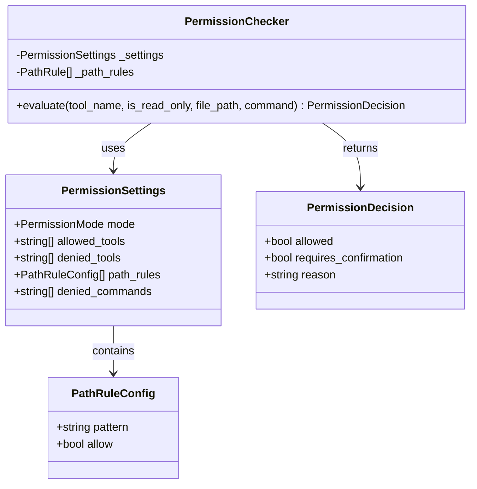
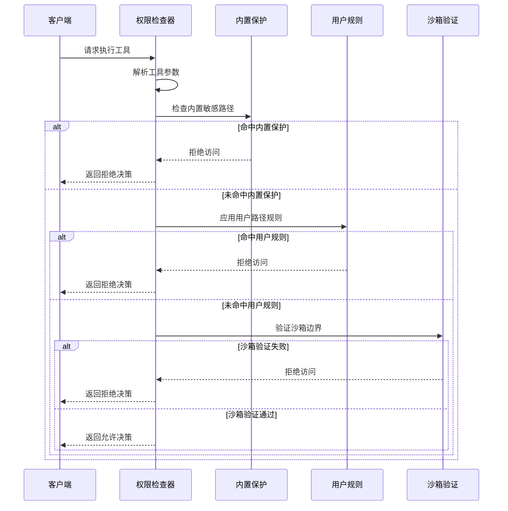
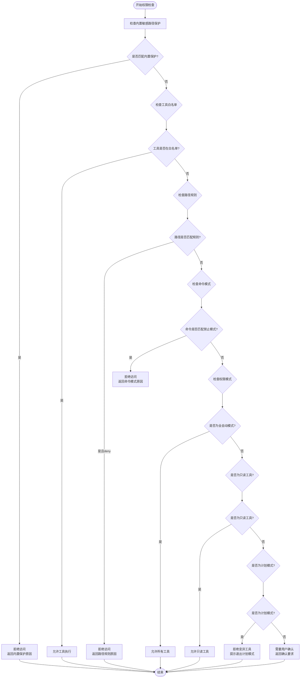
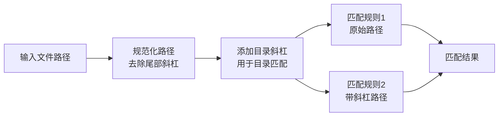
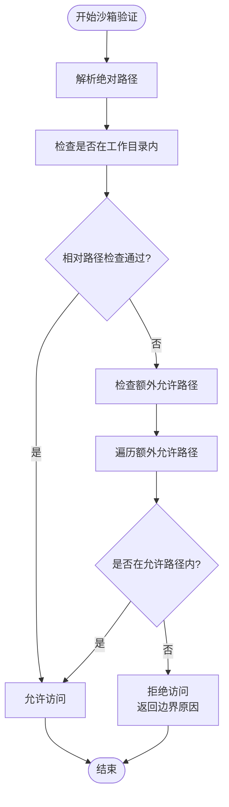
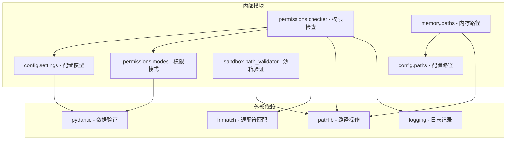

# 路径规则配置

<cite>
**本文档引用的文件**
- [路径规则核心实现](file://src/openharness/permissions/checker.py)
- [路径规则配置模型](file://src/openharness/config/settings.py)
- [路径规则配置解析](file://src/openharness/config/paths.py)
- [沙箱路径验证](file://src/openharness/sandbox/path_validator.py)
- [内存路径管理](file://src/openharness/memory/paths.py)
- [权限模式定义](file://src/openharness/permissions/modes.py)
- [路径规则单元测试](file://tests/test_permissions/test_checker.py)
- [沙箱路径验证单元测试](file://tests/test_sandbox/test_path_validator.py)
- [全局设置与配置](file://README.md)
</cite>

## 目录
1. [简介](#简介)
2. [项目结构](#项目结构)
3. [核心组件](#核心组件)
4. [架构概览](#架构概览)
5. [详细组件分析](#详细组件分析)
6. [依赖关系分析](#依赖关系分析)
7. [性能考虑](#性能考虑)
8. [故障排除指南](#故障排除指南)
9. [结论](#结论)
10. [附录](#附录)

## 简介

OpenHarness 的路径规则系统是一个多层次的安全防护机制，旨在保护系统免受恶意或意外的文件访问操作。该系统通过组合使用内置敏感路径保护、用户自定义路径规则和沙箱边界检查，构建了完整的文件访问安全体系。

系统支持多种路径匹配模式，包括通配符匹配和精确路径匹配，并提供了灵活的权限控制机制，包括默认模式、计划模式和全自动模式三种不同的权限级别。

## 项目结构

OpenHarness 的路径规则系统主要分布在以下模块中：



**图表来源**
- [路径规则核心实现:1-201](file://src/openharness/permissions/checker.py#L1-L201)
- [路径规则配置模型:43-58](file://src/openharness/config/settings.py#L43-L58)
- [路径规则配置解析:1-161](file://src/openharness/config/paths.py#L1-L161)

## 核心组件

### 路径规则配置模型

路径规则系统基于 Pydantic 模型构建，提供了类型安全的配置管理：



**图表来源**
- [路径规则配置模型:43-58](file://src/openharness/config/settings.py#L43-L58)
- [路径规则核心实现:40-156](file://src/openharness/permissions/checker.py#L40-L156)

### 内置敏感路径保护

系统内置了一套全面的敏感路径保护规则，这些规则在所有权限模式下都有效：

| 保护类别 | 匹配模式 | 说明 |
|---------|---------|------|
| SSH 密钥 | `*/.ssh/*` | SSH 私钥和公钥文件 |
| AWS 凭据 | `*/.aws/credentials`<br/>`*/.aws/config` | AWS 访问密钥和配置文件 |
| GCP 凭据 | `*/.config/gcloud/*` | Google Cloud 凭据文件 |
| Azure 凭据 | `*/.azure/*` | Azure 认证令牌 |
| GPG 密钥 | `*/.gnupg/*` | GnuPG 私钥库 |
| Docker 凭据 | `*/.docker/config.json` | Docker 镜像仓库凭据 |
| Kubernetes | `*/.kube/config` | kubectl 配置文件 |
| OpenHarness 凭据 | `*/.openharness/credentials.json`<br/>`*/.openharness/copilot_auth.json` | OpenHarness 自身的认证文件 |

**章节来源**
- [路径规则核心实现:14-37](file://src/openharness/permissions/checker.py#L14-L37)

## 架构概览

OpenHarness 的路径规则系统采用分层架构设计，确保安全性和灵活性：



**图表来源**
- [路径规则核心实现:75-156](file://src/openharness/permissions/checker.py#L75-L156)
- [沙箱路径验证:8-37](file://src/openharness/sandbox/path_validator.py#L8-L37)

## 详细组件分析

### 权限检查器工作流程

权限检查器是路径规则系统的核心组件，负责协调各种安全检查：



**图表来源**
- [路径规则核心实现:75-156](file://src/openharness/permissions/checker.py#L75-L156)

**章节来源**
- [路径规则核心实现:57-156](file://src/openharness/permissions/checker.py#L57-L156)

### 路径规则匹配算法

路径规则系统使用 fnmatch 模块进行通配符匹配，支持以下特殊字符：

- `*` - 匹配任意数量的字符（除路径分隔符外）
- `?` - 匹配单个字符
- `[...]` - 字符类匹配
- `**` - 在某些情况下支持递归匹配

系统还实现了智能路径规范化，确保目录路径正确处理：



**图表来源**
- [路径规则核心实现:159-169](file://src/openharness/permissions/checker.py#L159-L169)

**章节来源**
- [路径规则核心实现:159-169](file://src/openharness/permissions/checker.py#L159-L169)

### 沙箱路径验证机制

沙箱路径验证提供了额外的安全层，确保文件操作限制在指定的工作目录范围内：



**图表来源**
- [沙箱路径验证:8-37](file://src/openharness/sandbox/path_validator.py#L8-L37)

**章节来源**
- [沙箱路径验证:8-37](file://src/openharness/sandbox/path_validator.py#L8-L37)

## 依赖关系分析

路径规则系统的依赖关系清晰明确，遵循单一职责原则：



**图表来源**
- [路径规则核心实现:1-12](file://src/openharness/permissions/checker.py#L1-L12)
- [路径规则配置模型:1-25](file://src/openharness/config/settings.py#L1-L25)

**章节来源**
- [路径规则核心实现:1-12](file://src/openharness/permissions/checker.py#L1-L12)
- [路径规则配置模型:1-25](file://src/openharness/config/settings.py#L1-L25)

## 性能考虑

路径规则系统的性能优化主要体现在以下几个方面：

1. **早期短路检查**：内置敏感路径保护在最前执行，避免不必要的规则匹配
2. **缓存机制**：已解析的路径规则被缓存，避免重复计算
3. **最小化匹配次数**：每个路径最多进行两次匹配（有无斜杠两种形式）
4. **高效的数据结构**：使用元组存储内置规则，提供 O(1) 查找性能

## 故障排除指南

### 常见问题及解决方案

#### 1. 路径规则不生效

**症状**：配置的路径规则没有按预期工作

**可能原因**：
- 规则格式错误（非字符串或空字符串）
- 规则被跳过并记录警告日志
- 权限模式覆盖了规则效果

**解决步骤**：
1. 检查规则配置格式是否正确
2. 查看权限检查器的日志输出
3. 验证当前权限模式设置

**章节来源**
- [路径规则核心实现:67-73](file://src/openharness/permissions/checker.py#L67-L73)
- [路径规则单元测试:66-84](file://tests/test_permissions/test_checker.py#L66-L84)

#### 2. 沙箱访问被错误拒绝

**症状**：合法的文件访问被沙箱拒绝

**可能原因**：
- 文件位于工作目录之外
- 未正确配置额外允许路径
- 路径解析问题

**解决步骤**：
1. 验证目标文件的实际位置
2. 检查沙箱配置中的额外允许路径
3. 使用绝对路径进行访问

**章节来源**
- [沙箱路径验证:18-37](file://src/openharness/sandbox/path_validator.py#L18-L37)
- [沙箱路径验证单元测试:48-89](file://tests/test_sandbox/test_path_validator.py#L48-L89)

#### 3. 敏感路径误报

**症状**：正常文件被标记为敏感路径

**可能原因**：
- 路径模式过于宽泛
- 误将普通文件识别为敏感文件

**解决步骤**：
1. 检查敏感路径模式的准确性
2. 调整路径规则的精确度
3. 添加例外规则

**章节来源**
- [路径规则核心实现:18-37](file://src/openharness/permissions/checker.py#L18-L37)

## 结论

OpenHarness 的路径规则系统通过多层次的安全防护机制，为文件访问提供了全面的保护。系统的设计充分考虑了安全性、灵活性和易用性，既能够满足严格的安全需求，又不会过度限制正常的开发工作流。

关键特性包括：
- **内置敏感路径保护**：无需配置即可提供基础安全防护
- **灵活的路径规则系统**：支持通配符匹配和精确路径控制
- **多层安全验证**：权限检查、沙箱验证和路径规范化
- **清晰的权限模式**：适应不同场景的安全需求

## 附录

### 配置示例

#### 基本路径规则配置
```json
{
  "permission": {
    "path_rules": [
      {
        "pattern": "/etc/*",
        "allow": false
      },
      {
        "pattern": "/var/log/*",
        "allow": true
      }
    ]
  }
}
```

#### 高级路径规则配置
```json
{
  "permission": {
    "path_rules": [
      {
        "pattern": "*/node_modules/*",
        "allow": false
      },
      {
        "pattern": "*/.git/*",
        "allow": false
      },
      {
        "pattern": "**/*.pyc",
        "allow": false
      }
    ]
  }
}
```

### 最佳实践建议

1. **最小权限原则**：默认拒绝所有路径，仅允许必要的访问
2. **精确匹配优于宽泛匹配**：尽量使用具体路径而非通配符
3. **定期审查规则**：定期检查和更新路径规则
4. **测试规则效果**：在开发环境中测试路径规则的有效性
5. **监控日志输出**：关注权限检查器的日志信息

### 支持的通配符语法

- `*` - 匹配任意数量的字符
- `?` - 匹配单个字符  
- `[abc]` - 匹配括号内的任意字符
- `**` - 递归匹配子目录（在某些情况下）