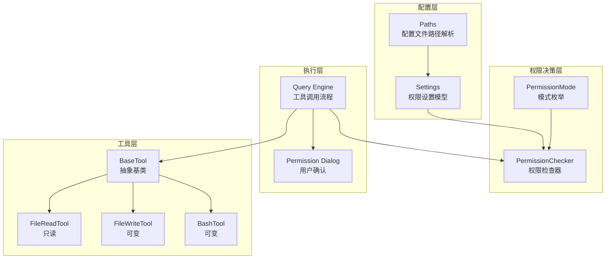
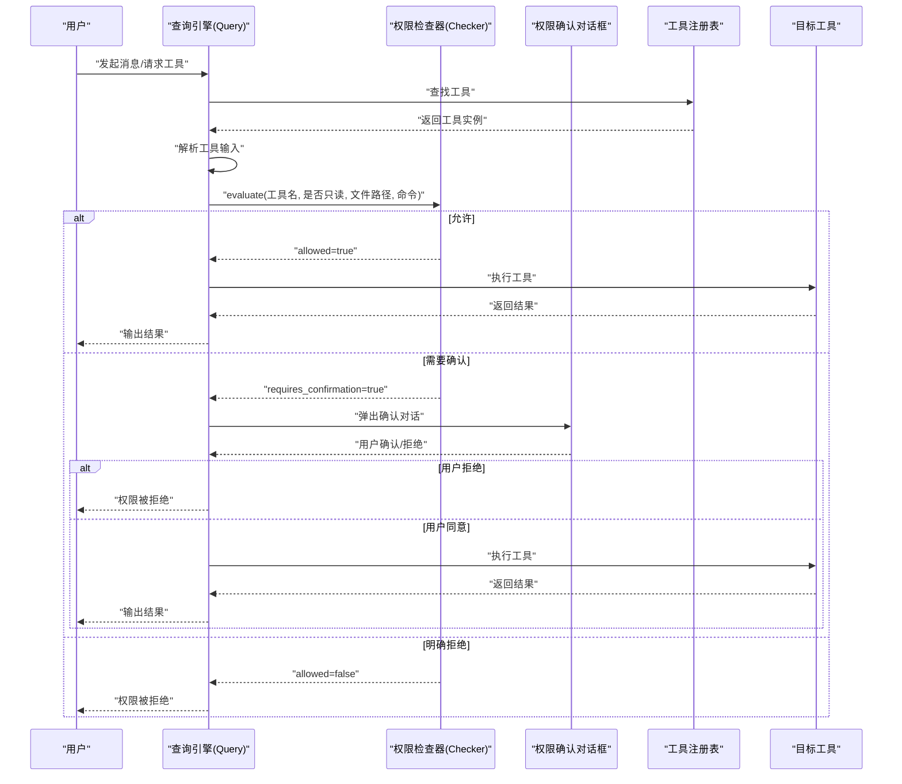
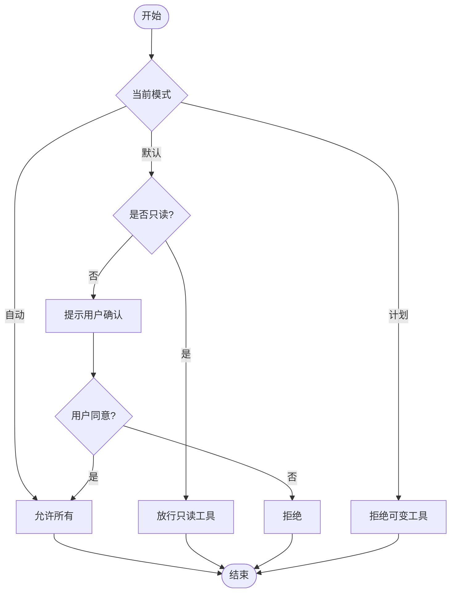
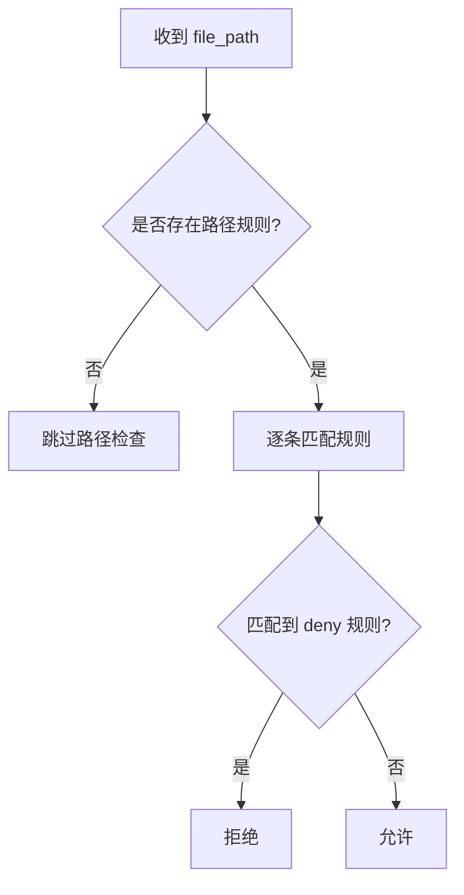
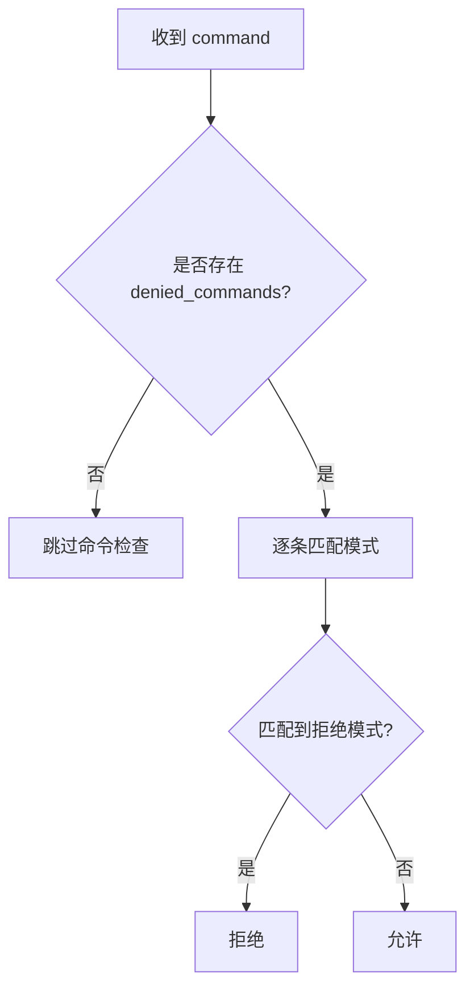
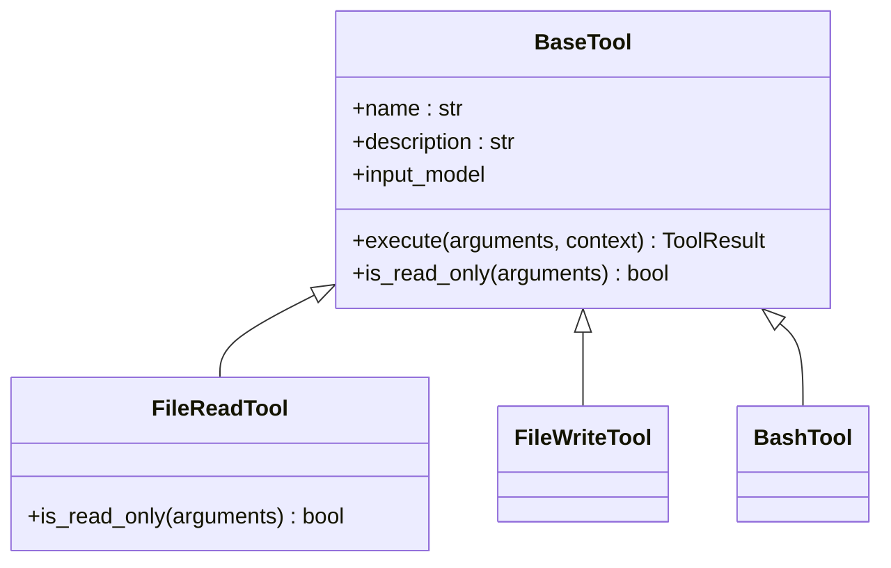
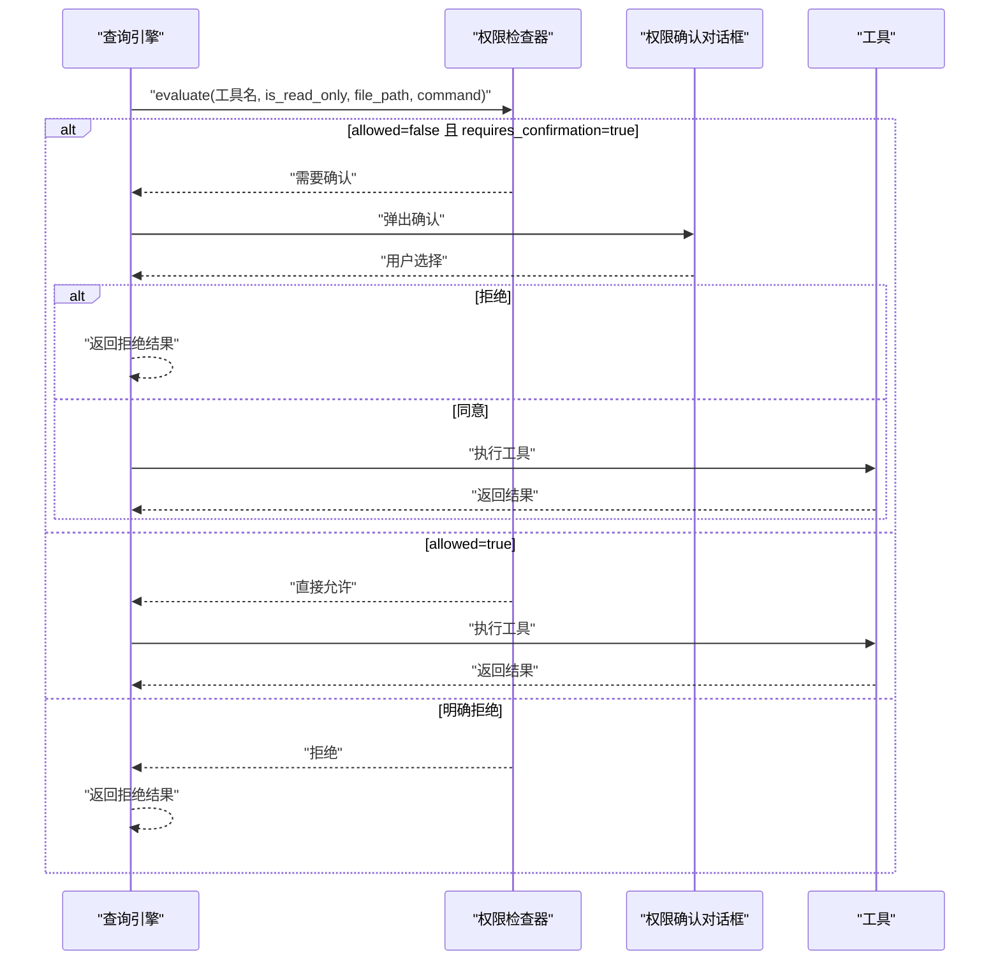
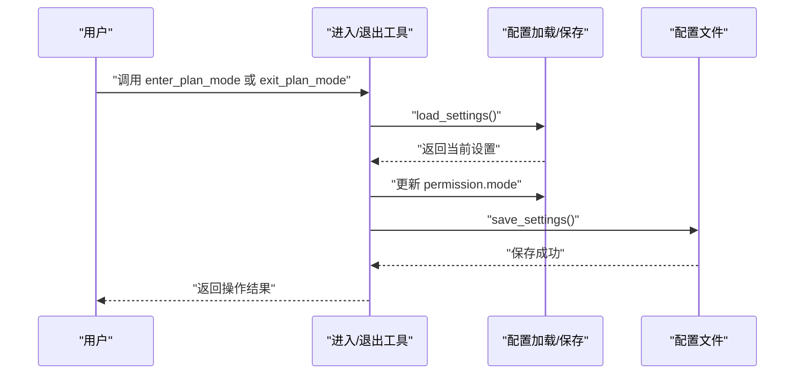
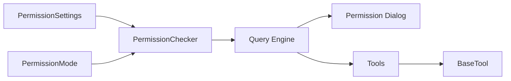

# 权限控制系统

<cite>
**本文引用的文件**
- [checker.py](file://src/openharness/permissions/checker.py)
- [modes.py](file://src/openharness/permissions/modes.py)
- [settings.py](file://src/openharness/config/settings.py)
- [paths.py](file://src/openharness/config/paths.py)
- [query.py](file://src/openharness/engine/query.py)
- [permission_dialog.py](file://src/openharness/ui/permission_dialog.py)
- [base.py](file://src/openharness/tools/base.py)
- [file_read_tool.py](file://src/openharness/tools/file_read_tool.py)
- [file_write_tool.py](file://src/openharness/tools/file_write_tool.py)
- [bash_tool.py](file://src/openharness/tools/bash_tool.py)
- [enter_plan_mode_tool.py](file://src/openharness/tools/enter_plan_mode_tool.py)
- [exit_plan_mode_tool.py](file://src/openharness/tools/exit_plan_mode_tool.py)
- [test_checker.py](file://tests/test_permissions/test_checker.py)
- [test_harness_features.py](file://scripts/test_harness_features.py)
</cite>

## 目录
1. [简介](#简介)
2. [项目结构](#项目结构)
3. [核心组件](#核心组件)
4. [架构总览](#架构总览)
5. [详细组件分析](#详细组件分析)
6. [依赖分析](#依赖分析)
7. [性能考虑](#性能考虑)
8. [故障排除指南](#故障排除指南)
9. [结论](#结论)
10. [附录](#附录)

## 简介
本文件面向系统管理员与安全负责人，全面解析 OpenHarness 的权限控制系统。内容涵盖多级安全模式（默认、自动、计划模式）的行为差异与适用场景；路径规则配置（模式匹配、允许/拒绝规则）；命令级别权限控制（危险命令拦截）；权限检查执行流程（工具调用前后）；最佳实践与常见风险防范；以及实际配置示例与故障排除。

## 项目结构
权限控制相关代码主要分布在以下模块：
- 配置层：权限设置模型、路径解析与配置文件读写
- 权限决策层：权限检查器与模式枚举
- 执行层：对话引擎在工具调用前后进行权限校验
- 工具层：只读/可变工具的区分与具体工具行为
- 用户交互层：权限确认对话框

**图表来源**
- [settings.py:31-60](file://src/openharness/config/settings.py#L31-L60)
- [paths.py:15-34](file://src/openharness/config/paths.py#L15-L34)
- [modes.py:8-13](file://src/openharness/permissions/modes.py#L8-L13)
- [checker.py:30-99](file://src/openharness/permissions/checker.py#L30-L99)
- [query.py:35-51](file://src/openharness/engine/query.py#L35-L51)
- [permission_dialog.py:8-14](file://src/openharness/ui/permission_dialog.py#L8-L14)
- [base.py:30-44](file://src/openharness/tools/base.py#L30-L44)
- [file_read_tool.py:27-29](file://src/openharness/tools/file_read_tool.py#L27-L29)
- [file_write_tool.py:27-36](file://src/openharness/tools/file_write_tool.py#L27-L36)
- [bash_tool.py:28-69](file://src/openharness/tools/bash_tool.py#L28-L69)

**章节来源**
- [settings.py:1-161](file://src/openharness/config/settings.py#L1-L161)
- [paths.py:1-117](file://src/openharness/config/paths.py#L1-L117)
- [modes.py:1-14](file://src/openharness/permissions/modes.py#L1-L14)
- [checker.py:1-100](file://src/openharness/permissions/checker.py#L1-L100)
- [query.py:1-212](file://src/openharness/engine/query.py#L1-L212)
- [permission_dialog.py:1-15](file://src/openharness/ui/permission_dialog.py#L1-L15)
- [base.py:1-76](file://src/openharness/tools/base.py#L1-L76)
- [file_read_tool.py:1-63](file://src/openharness/tools/file_read_tool.py#L1-L63)
- [file_write_tool.py:1-44](file://src/openharness/tools/file_write_tool.py#L1-L44)
- [bash_tool.py:1-70](file://src/openharness/tools/bash_tool.py#L1-L70)

## 核心组件
- 权限模式（PermissionMode）
  - 默认（default）：对可变工具要求用户确认
  - 计划（plan）：禁止可变工具，直到退出计划模式
  - 自动（full_auto）：允许所有工具，不阻断
- 权限检查器（PermissionChecker）
  - 检查顺序：显式允许/拒绝列表 → 路径规则 → 命令模式匹配 → 模式策略（自动/只读/计划/默认）
- 配置模型（PermissionSettings）
  - 字段：mode、allowed_tools、denied_tools、path_rules、denied_commands
- 执行流程（Query Engine）
  - 在工具解析输入后、执行前进行权限评估；必要时弹出确认对话

**章节来源**
- [modes.py:8-13](file://src/openharness/permissions/modes.py#L8-L13)
- [checker.py:30-99](file://src/openharness/permissions/checker.py#L30-L99)
- [settings.py:31-39](file://src/openharness/config/settings.py#L31-L39)
- [query.py:159-182](file://src/openharness/engine/query.py#L159-L182)

## 架构总览
下图展示从对话到工具执行的权限控制链路，强调“调用前检查、必要时确认、调用后钩子”的整体流程。

**图表来源**
- [query.py:159-182](file://src/openharness/engine/query.py#L159-L182)
- [checker.py:52-99](file://src/openharness/permissions/checker.py#L52-L99)
- [permission_dialog.py:8-14](file://src/openharness/ui/permission_dialog.py#L8-L14)

## 详细组件分析

### 多级安全模式
- 默认模式（default）
  - 只读工具直接放行
  - 可变工具需要用户确认
- 计划模式（plan）
  - 禁止一切可变工具，直至退出计划模式
- 自动模式（full_auto）
  - 放行所有工具，不进行额外确认

**图表来源**
- [checker.py:83-99](file://src/openharness/permissions/checker.py#L83-L99)
- [modes.py:8-13](file://src/openharness/permissions/modes.py#L8-L13)

**章节来源**
- [modes.py:8-13](file://src/openharness/permissions/modes.py#L8-L13)
- [checker.py:83-99](file://src/openharness/permissions/checker.py#L83-L99)
- [test_checker.py:7-31](file://tests/test_permissions/test_checker.py#L7-L31)

### 路径规则配置
- 规则类型：glob 模式匹配
- 规则字段：pattern（通配符）、allow（布尔）
- 生效条件：当工具输入包含 file_path 且存在路径规则时
- 匹配逻辑：按顺序遍历规则，命中即按 allow 决定允许或拒绝

**图表来源**
- [checker.py:60-68](file://src/openharness/permissions/checker.py#L60-L68)
- [settings.py:24-28](file://src/openharness/config/settings.py#L24-L28)

**章节来源**
- [checker.py:36-41](file://src/openharness/permissions/checker.py#L36-L41)
- [checker.py:60-68](file://src/openharness/permissions/checker.py#L60-L68)
- [settings.py:24-28](file://src/openharness/config/settings.py#L24-L28)
- [test_harness_features.py:157-178](file://scripts/test_harness_features.py#L157-L178)

### 命令级别权限控制
- 支持通过 denied_commands 设置命令模式匹配规则
- 当工具输入包含 command 时，按 fnmatch 逐条匹配
- 命中即拒绝，不进入后续流程

**图表来源**
- [checker.py:70-77](file://src/openharness/permissions/checker.py#L70-L77)
- [settings.py:38](file://src/openharness/config/settings.py#L38)

**章节来源**
- [checker.py:70-77](file://src/openharness/permissions/checker.py#L70-L77)
- [settings.py:38](file://src/openharness/config/settings.py#L38)
- [test_harness_features.py:181-190](file://scripts/test_harness_features.py#L181-L190)

### 工具只读性与可变性
- BaseTool 提供 is_read_only 抽象，默认为 False
- 只读工具（如文件读取）在默认模式下无需确认即可执行
- 可变工具（如文件写入、shell 命令）在默认模式需确认，在计划模式一律拒绝

**图表来源**
- [base.py:30-44](file://src/openharness/tools/base.py#L30-L44)
- [file_read_tool.py:27-29](file://src/openharness/tools/file_read_tool.py#L27-L29)
- [file_write_tool.py:27-36](file://src/openharness/tools/file_write_tool.py#L27-L36)
- [bash_tool.py:28-69](file://src/openharness/tools/bash_tool.py#L28-L69)

**章节来源**
- [base.py:30-44](file://src/openharness/tools/base.py#L30-L44)
- [file_read_tool.py:27-29](file://src/openharness/tools/file_read_tool.py#L27-L29)
- [file_write_tool.py:27-36](file://src/openharness/tools/file_write_tool.py#L27-L36)
- [bash_tool.py:28-69](file://src/openharness/tools/bash_tool.py#L28-L69)

### 权限检查执行流程
- 输入解析完成后，提取 file_path 与 command
- 调用 PermissionChecker.evaluate 进行决策
- 若 requires_confirmation 为真且存在确认回调，则弹出对话框
- 用户拒绝则终止；同意或无需确认则执行工具

**图表来源**
- [query.py:159-182](file://src/openharness/engine/query.py#L159-L182)
- [checker.py:52-99](file://src/openharness/permissions/checker.py#L52-L99)
- [permission_dialog.py:8-14](file://src/openharness/ui/permission_dialog.py#L8-L14)

**章节来源**
- [query.py:159-182](file://src/openharness/engine/query.py#L159-L182)
- [checker.py:52-99](file://src/openharness/permissions/checker.py#L52-L99)
- [permission_dialog.py:8-14](file://src/openharness/ui/permission_dialog.py#L8-L14)

### 计划模式切换工具
- 进入计划模式：将配置中的权限模式设为 plan，并持久化保存
- 退出计划模式：将配置中的权限模式恢复为 default，并持久化保存

**图表来源**
- [enter_plan_mode_tool.py:23-28](file://src/openharness/tools/enter_plan_mode_tool.py#L23-L28)
- [exit_plan_mode_tool.py:23-28](file://src/openharness/tools/exit_plan_mode_tool.py#L23-L28)
- [settings.py:123-161](file://src/openharness/config/settings.py#L123-L161)

**章节来源**
- [enter_plan_mode_tool.py:16-28](file://src/openharness/tools/enter_plan_mode_tool.py#L16-L28)
- [exit_plan_mode_tool.py:16-28](file://src/openharness/tools/exit_plan_mode_tool.py#L16-L28)
- [settings.py:123-161](file://src/openharness/config/settings.py#L123-L161)

## 依赖分析
- 权限检查器依赖配置模型与模式枚举
- 查询引擎在执行工具前注入 file_path 与 command 并调用检查器
- 用户交互层提供确认对话框，作为权限检查器的补充
- 工具层通过 is_read_only 标识只读性，影响默认模式下的放行策略

**图表来源**
- [checker.py:9-10](file://src/openharness/permissions/checker.py#L9-L10)
- [modes.py:8-13](file://src/openharness/permissions/modes.py#L8-L13)
- [query.py:159-167](file://src/openharness/engine/query.py#L159-L167)
- [base.py:30-44](file://src/openharness/tools/base.py#L30-L44)

**章节来源**
- [checker.py:9-10](file://src/openharness/permissions/checker.py#L9-L10)
- [modes.py:8-13](file://src/openharness/permissions/modes.py#L8-L13)
- [query.py:159-167](file://src/openharness/engine/query.py#L159-L167)
- [base.py:30-44](file://src/openharness/tools/base.py#L30-L44)

## 性能考虑
- 权限检查为常量时间复杂度：规则线性扫描、模式匹配 O(n)；整体开销极低
- 建议：
  - 控制 path_rules 与 denied_commands 数量，避免过多规则导致匹配耗时
  - 对高频工具使用 allowed_tools/denied_tools 快速短路判断
  - 在默认模式下尽量减少需要用户确认的可变工具数量，降低交互延迟

[本节为通用建议，无需特定文件引用]

## 故障排除指南
- 症状：可变工具在默认模式被拒绝
  - 排查：确认工具是否为只读；若为可变工具，需用户确认
  - 解决：在交互中确认，或切换到自动模式
- 症状：计划模式下无法执行任何可变工具
  - 排查：确认当前模式为 plan
  - 解决：调用退出计划模式工具恢复为 default
- 症状：路径规则未生效
  - 排查：确认配置文件路径与格式；确认工具输入包含 file_path
  - 解决：修正 pattern 语法；确保 allow/deny 语义正确
- 症状：命令模式匹配未生效
  - 排查：确认 denied_commands 中的模式字符串；确认工具输入包含 command
  - 解决：调整模式字符串；使用合适的通配符

**章节来源**
- [test_checker.py:7-31](file://tests/test_permissions/test_checker.py#L7-L31)
- [test_harness_features.py:157-178](file://scripts/test_harness_features.py#L157-L178)
- [test_harness_features.py:181-190](file://scripts/test_harness_features.py#L181-L190)

## 结论
OpenHarness 的权限控制系统以“调用前检查+必要时确认”为核心，结合多级模式与细粒度规则，既保证了灵活性，又提供了可控的安全边界。通过合理配置路径规则与命令模式，配合计划模式的强制隔离，可以有效降低误操作与高危行为的风险。

[本节为总结，无需特定文件引用]

## 附录

### 配置示例与最佳实践
- 配置文件位置
  - 默认：用户主目录下的隐藏目录，可通过环境变量覆盖
  - 参考路径解析函数用于定位配置文件
- 最佳实践
  - 使用默认模式配合 allowed_tools/denied_tools 精准放行/限制
  - 对关键路径设置 deny 规则，防止写入敏感目录
  - 对高危命令（如删除根目录）使用 denied_commands 模式匹配
  - 在开发/审计阶段启用计划模式，完成后再退出
  - 定期审查与精简规则，保持最小权限原则

**章节来源**
- [paths.py:15-34](file://src/openharness/config/paths.py#L15-L34)
- [settings.py:123-161](file://src/openharness/config/settings.py#L123-L161)