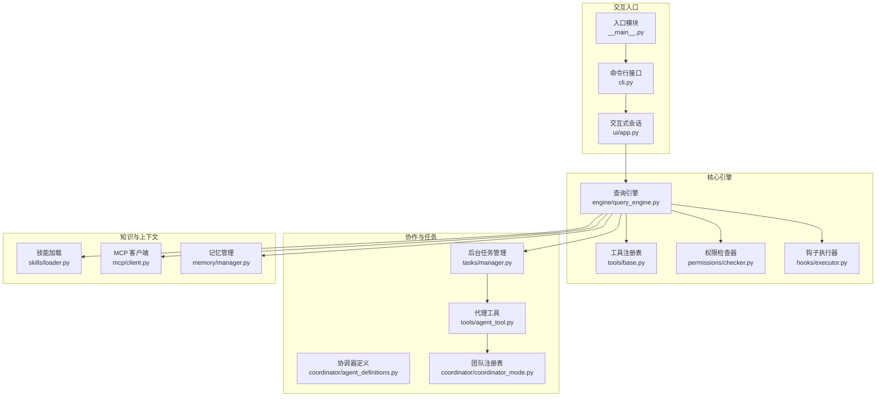
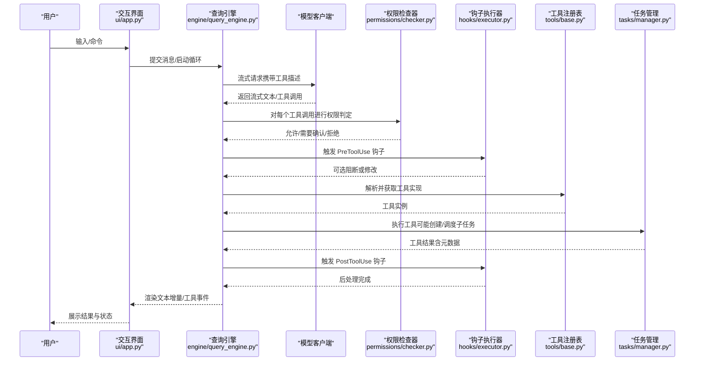
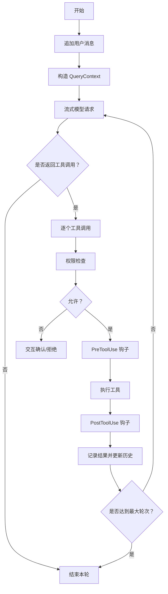
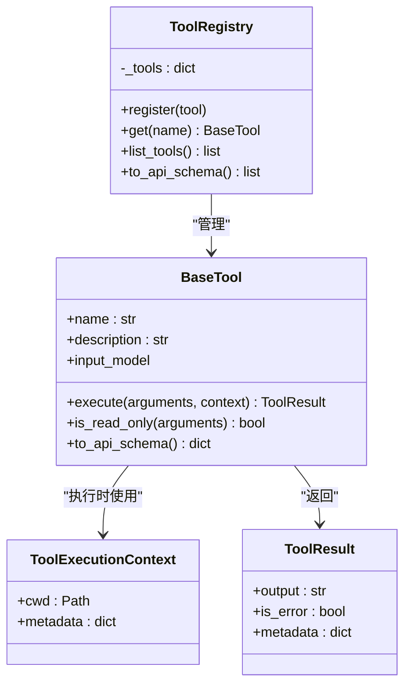
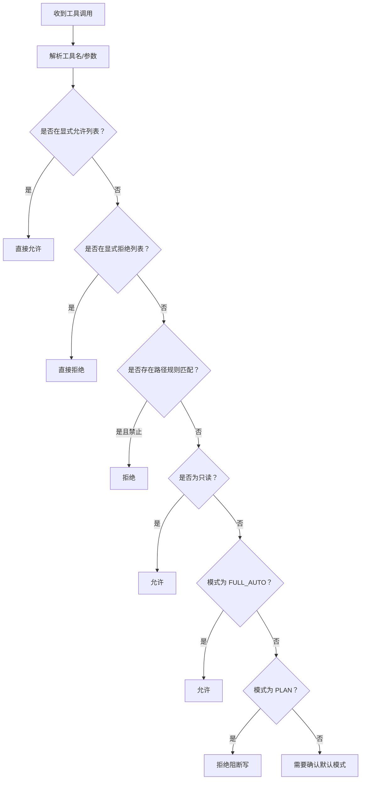
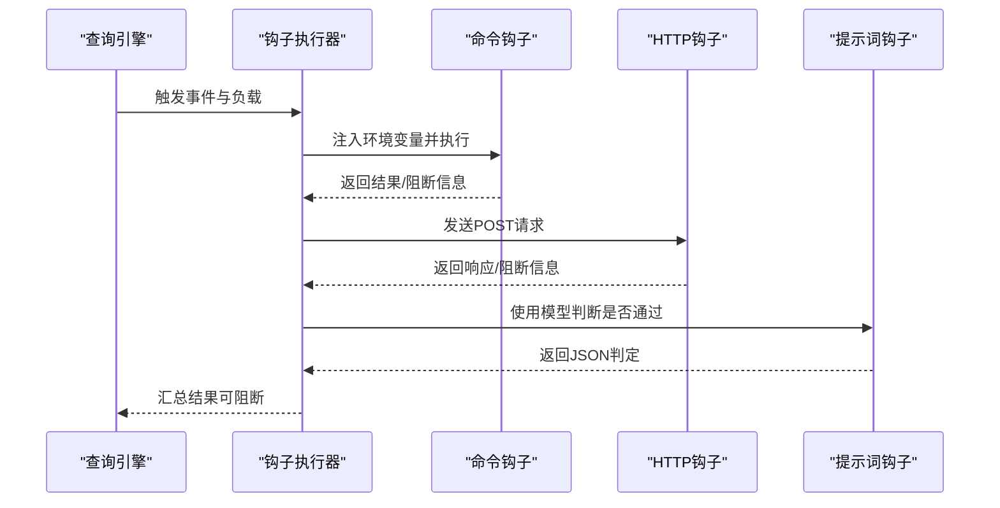
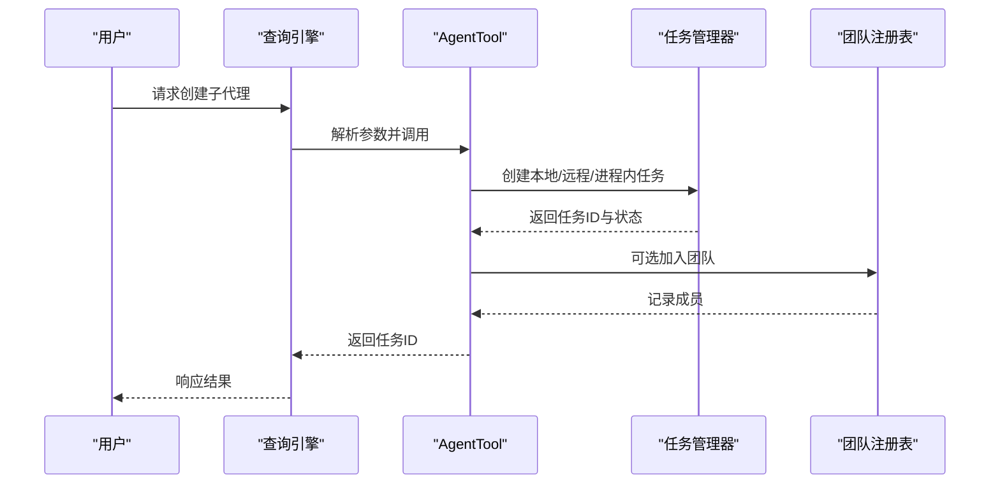
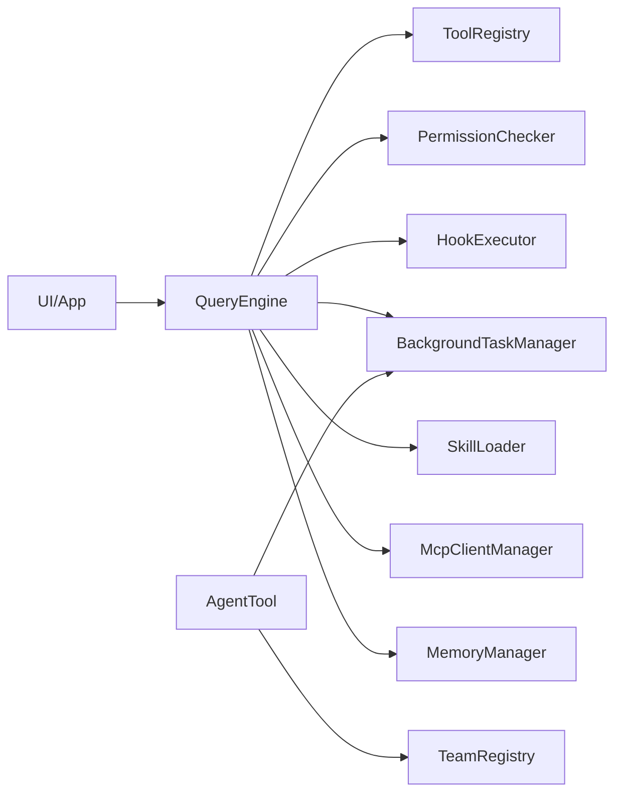

# Agent Harness 概念

<cite>
**本文引用的文件**
- [README.md](file://README.md)
- [__main__.py](file://src/openharness/__main__.py)
- [cli.py](file://src/openharness/cli.py)
- [query_engine.py](file://src/openharness/engine/query_engine.py)
- [base.py](file://src/openharness/tools/base.py)
- [checker.py](file://src/openharness/permissions/checker.py)
- [executor.py](file://src/openharness/hooks/executor.py)
- [manager.py](file://src/openharness/tasks/manager.py)
- [agent_definitions.py](file://src/openharness/coordinator/agent_definitions.py)
- [coordinator_mode.py](file://src/openharness/coordinator/coordinator_mode.py)
- [agent_tool.py](file://src/openharness/tools/agent_tool.py)
- [loader.py](file://src/openharness/skills/loader.py)
- [client.py](file://src/openharness/mcp/client.py)
- [manager.py](file://src/openharness/memory/manager.py)
- [app.py](file://src/openharness/ui/app.py)
</cite>

## 目录
1. [引言](#引言)
2. [项目结构](#项目结构)
3. [核心组件](#核心组件)
4. [架构总览](#架构总览)
5. [详细组件分析](#详细组件分析)
6. [依赖分析](#依赖分析)
7. [性能考量](#性能考量)
8. [故障排查指南](#故障排查指南)
9. [结论](#结论)
10. [附录](#附录)

## 引言
本文件围绕 OpenHarness 的 Agent Harness 概念进行系统化阐释：定义其本质、设计思想与在 AI 编码助手中的关键作用；说明模型智能与基础设施的关系，以及如何通过 Harness 将大模型（LLM）的能力与实际工具、权限系统有效结合；阐述多代理协调的概念与实现方式；并提供与同类架构的对比分析、实际使用场景与最佳实践建议。

## 项目结构
OpenHarness 以“Harness 架构”为核心，将 LLM 的智能与基础设施解耦：模型负责推理决策，Harness 负责执行、观察、记忆与安全边界。整体采用子系统分层组织，便于扩展与组合。

图示来源
- [cli.py:1-378](file://src/openharness/cli.py#L1-L378)
- [__main__.py:1-7](file://src/openharness/__main__.py#L1-L7)
- [app.py:1-149](file://src/openharness/ui/app.py#L1-L149)
- [query_engine.py:1-101](file://src/openharness/engine/query_engine.py#L1-L101)
- [base.py:1-76](file://src/openharness/tools/base.py#L1-L76)
- [checker.py:1-100](file://src/openharness/permissions/checker.py#L1-L100)
- [executor.py:1-217](file://src/openharness/hooks/executor.py#L1-L217)
- [agent_definitions.py:1-23](file://src/openharness/coordinator/agent_definitions.py#L1-L23)
- [coordinator_mode.py:1-63](file://src/openharness/coordinator/coordinator_mode.py#L1-L63)
- [agent_tool.py:1-56](file://src/openharness/tools/agent_tool.py#L1-L56)
- [manager.py:1-281](file://src/openharness/tasks/manager.py#L1-L281)
- [loader.py:1-97](file://src/openharness/skills/loader.py#L1-L97)
- [client.py:1-175](file://src/openharness/mcp/client.py#L1-L175)
- [manager.py:1-51](file://src/openharness/memory/manager.py#L1-L51)

章节来源
- [README.md:127-170](file://README.md#L127-L170)
- [cli.py:1-378](file://src/openharness/cli.py#L1-L378)
- [query_engine.py:1-101](file://src/openharness/engine/query_engine.py#L1-L101)

## 核心组件
- 查询引擎（QueryEngine）：承载对话历史与“模型循环”，负责将用户输入推进到工具调用与结果反馈的闭环。
- 工具体系（ToolRegistry/BaseTool）：标准化工具抽象，统一输入校验、API 描述与执行上下文。
- 权限系统（PermissionChecker）：基于模式与路径规则对工具调用进行即时判定，支持自动、计划模式与交互确认。
- 钩子系统（HookExecutor）：生命周期事件驱动的扩展点，支持命令、HTTP、提示词驱动的条件判断与阻断。
- 多代理与任务（AgentTool/BackgroundTaskManager/TeamRegistry）：支持本地/远程/进程内代理子任务的创建、编排与状态管理。
- 技能系统（SkillLoader）：按需加载领域知识，增强模型在特定任务上的表现。
- MCP 客户端（McpClientManager）：连接外部 MCP 服务器，暴露工具与资源给模型与工具调用。
- 记忆管理（MemoryManager）：项目级持久化记忆索引与条目维护。
- 交互界面（UI/App）：提供交互式 TUI 与非交互打印模式，统一事件渲染与输出格式。

章节来源
- [query_engine.py:18-101](file://src/openharness/engine/query_engine.py#L18-L101)
- [base.py:13-76](file://src/openharness/tools/base.py#L13-L76)
- [checker.py:30-100](file://src/openharness/permissions/checker.py#L30-L100)
- [executor.py:38-217](file://src/openharness/hooks/executor.py#L38-L217)
- [agent_tool.py:14-56](file://src/openharness/tools/agent_tool.py#L14-L56)
- [manager.py:18-281](file://src/openharness/tasks/manager.py#L18-L281)
- [coordinator_mode.py:8-63](file://src/openharness/coordinator/coordinator_mode.py#L8-L63)
- [loader.py:21-97](file://src/openharness/skills/loader.py#L21-L97)
- [client.py:20-175](file://src/openharness/mcp/client.py#L20-L175)
- [manager.py:11-51](file://src/openharness/memory/manager.py#L11-L51)
- [app.py:15-149](file://src/openharness/ui/app.py#L15-L149)

## 架构总览
Agent Harness 的核心是“模型循环”：模型决定做什么，Harness 决定怎么做（安全、可观测、可扩展）。该循环贯穿工具注册、权限检查、钩子执行、工具调用与结果回传，形成可组合、可观测、可治理的闭环。

图示来源
- [app.py:50-149](file://src/openharness/ui/app.py#L50-L149)
- [query_engine.py:81-101](file://src/openharness/engine/query_engine.py#L81-L101)
- [checker.py:43-100](file://src/openharness/permissions/checker.py#L43-L100)
- [executor.py:49-192](file://src/openharness/hooks/executor.py#L49-L192)
- [base.py:55-76](file://src/openharness/tools/base.py#L55-L76)
- [manager.py:29-93](file://src/openharness/tasks/manager.py#L29-L93)

## 详细组件分析

### 组件一：Agent 循环与查询引擎
- 设计要点
  - 维护对话历史与成本统计，支持动态更新系统提示、模型与权限检查器。
  - 将工具集合以 API Schema 形式注入模型，使模型能自描述地选择工具。
  - 在每次工具调用前后触发钩子，确保可观测与可扩展。
- 关键流程
  - 用户输入 → 追加消息 → 构造上下文 → 流式查询 → 解析工具调用 → 权限判定 → 钩子执行 → 工具执行 → 结果回写 → 下一轮循环。

图示来源
- [query_engine.py:81-101](file://src/openharness/engine/query_engine.py#L81-L101)
- [checker.py:43-100](file://src/openharness/permissions/checker.py#L43-L100)
- [executor.py:49-192](file://src/openharness/hooks/executor.py#L49-L192)

章节来源
- [query_engine.py:18-101](file://src/openharness/engine/query_engine.py#L18-L101)
- [README.md:149-169](file://README.md#L149-L169)

### 组件二：工具抽象与注册
- 设计要点
  - 统一的工具基类与执行上下文，保证所有工具具备一致的输入校验、描述与执行接口。
  - 工具注册表集中管理工具映射，支持 API Schema 导出，供模型理解可用能力。
- 实践意义
  - 通过标准化输入与描述，降低模型选择工具的复杂度，提升稳定性与可测试性。

图示来源
- [base.py:13-76](file://src/openharness/tools/base.py#L13-L76)

章节来源
- [base.py:13-76](file://src/openharness/tools/base.py#L13-L76)

### 组件三：权限系统与安全边界
- 设计要点
  - 支持默认、自动、计划三种模式；路径规则与命令模式匹配；显式允许/拒绝列表。
  - 读操作默认放行；写操作在默认模式下需要确认；计划模式完全阻断写入。
- 实践意义
  - 将“安全”从模型逻辑中抽离，形成可配置、可审计、可插拔的安全层。

图示来源
- [checker.py:43-100](file://src/openharness/permissions/checker.py#L43-L100)

章节来源
- [checker.py:1-100](file://src/openharness/permissions/checker.py#L1-L100)
- [README.md:233-252](file://README.md#L233-L252)

### 组件四：钩子系统与生命周期扩展
- 设计要点
  - 命令钩子、HTTP 钩子、提示词钩子与代理钩子四类，支持超时、阻断失败等策略。
  - 通过事件与负载匹配器，精准控制钩子触发范围。
- 实践意义
  - 将“横切关注点”（如安全审核、日志上报、二次确认）与业务逻辑解耦，提升可维护性与可测试性。

图示来源
- [executor.py:49-192](file://src/openharness/hooks/executor.py#L49-L192)

章节来源
- [executor.py:1-217](file://src/openharness/hooks/executor.py#L1-L217)

### 组件五：多代理协调与任务编排
- 设计要点
  - AgentTool 支持创建本地/远程/进程内代理子任务，并可选加入团队。
  - BackgroundTaskManager 管理子进程、输出与重启，提供统一的输入/输出通道。
  - TeamRegistry 记录团队成员与消息，支撑跨代理协作。
- 实践意义
  - 将“单代理思考”扩展为“多代理协作”，通过任务与团队机制实现分工与协同。

图示来源
- [agent_tool.py:35-56](file://src/openharness/tools/agent_tool.py#L35-L56)
- [manager.py:29-93](file://src/openharness/tasks/manager.py#L29-L93)
- [coordinator_mode.py:24-51](file://src/openharness/coordinator/coordinator_mode.py#L24-L51)

章节来源
- [agent_definitions.py:8-23](file://src/openharness/coordinator/agent_definitions.py#L8-L23)
- [coordinator_mode.py:1-63](file://src/openharness/coordinator/coordinator_mode.py#L1-L63)
- [agent_tool.py:1-56](file://src/openharness/tools/agent_tool.py#L1-L56)
- [manager.py:1-281](file://src/openharness/tasks/manager.py#L1-L281)

### 组件六：技能系统与知识注入
- 设计要点
  - 按需加载用户/插件/内置技能，支持 YAML Frontmatter 与标题/段落解析。
  - 与系统提示装配配合，增强模型在特定领域的表现。
- 实践意义
  - 将“显式知识”与“隐式推理”结合，提升任务成功率与一致性。

章节来源
- [loader.py:21-97](file://src/openharness/skills/loader.py#L21-L97)
- [README.md:194-212](file://README.md#L194-L212)

### 组件七：MCP 集成与外部能力扩展
- 设计要点
  - 支持 STDIO 传输的 MCP 服务器连接、工具与资源列举、调用与读取。
  - 将外部能力以工具形式注入模型工具集，实现“模型+外部生态”的统一调用。
- 实践意义
  - 通过 MCP 将企业内部系统、代码库与第三方服务无缝接入 Agent Harness。

章节来源
- [client.py:20-175](file://src/openharness/mcp/client.py#L20-L175)

### 组件八：记忆与上下文持久化
- 设计要点
  - 项目级记忆索引与条目管理，支持新增、删除与索引同步。
  - 与技能/系统提示结合，形成可沉淀的知识资产。
- 实践意义
  - 将“短期对话记忆”扩展为“长期项目知识”，提升复用效率与一致性。

章节来源
- [manager.py:11-51](file://src/openharness/memory/manager.py#L11-L51)

### 组件九：交互界面与输出模式
- 设计要点
  - 交互式 TUI 与非交互打印模式，统一事件渲染与输出格式（文本/JSON/流式 JSON）。
  - 支持后端主机与前端 React 启动分离，便于集成与自动化。
- 实践意义
  - 既满足日常开发体验，也满足脚本与流水线集成需求。

章节来源
- [app.py:15-149](file://src/openharness/ui/app.py#L15-L149)
- [README.md:254-279](file://README.md#L254-L279)

## 依赖分析
- 组件内聚与耦合
  - QueryEngine 作为中枢，依赖工具注册表、权限检查器、钩子执行器与任务管理器，体现高内聚低耦合的设计。
  - 多代理与任务编排通过 AgentTool 与 TeamRegistry 解耦于核心引擎，便于独立演进。
- 外部依赖
  - MCP 客户端依赖 mcp SDK；钩子系统支持 HTTP 与命令执行；UI 依赖 React Ink 与后端协议。
- 潜在循环依赖
  - 当前模块间以接口与类型导入为主，未见明显循环依赖迹象。

图示来源
- [query_engine.py:18-101](file://src/openharness/engine/query_engine.py#L18-L101)
- [base.py:55-76](file://src/openharness/tools/base.py#L55-L76)
- [checker.py:30-100](file://src/openharness/permissions/checker.py#L30-L100)
- [executor.py:38-217](file://src/openharness/hooks/executor.py#L38-L217)
- [agent_tool.py:28-56](file://src/openharness/tools/agent_tool.py#L28-L56)
- [manager.py:18-281](file://src/openharness/tasks/manager.py#L18-L281)
- [coordinator_mode.py:18-63](file://src/openharness/coordinator/coordinator_mode.py#L18-L63)
- [loader.py:21-37](file://src/openharness/skills/loader.py#L21-L37)
- [client.py:20-175](file://src/openharness/mcp/client.py#L20-L175)
- [manager.py:11-51](file://src/openharness/memory/manager.py#L11-L51)
- [app.py:15-48](file://src/openharness/ui/app.py#L15-L48)

章节来源
- [query_engine.py:18-101](file://src/openharness/engine/query_engine.py#L18-L101)
- [agent_tool.py:28-56](file://src/openharness/tools/agent_tool.py#L28-L56)
- [manager.py:18-281](file://src/openharness/tasks/manager.py#L18-L281)
- [coordinator_mode.py:18-63](file://src/openharness/coordinator/coordinator_mode.py#L18-L63)

## 性能考量
- 流式输出与增量渲染：通过流式事件与增量文本拼接，降低首帧延迟，提升感知速度。
- 工具并发与锁：任务输出/输入通道采用异步锁，避免竞争条件；进程监控与重启策略减少长时间挂起风险。
- 成本追踪：查询引擎内置用量统计，便于成本控制与优化。
- 权限与钩子短路：在工具调用前快速判定，减少无效执行开销。

## 故障排查指南
- 权限相关
  - 症状：工具被拒绝或需要确认。
  - 排查：检查权限模式、路径规则与命令拒绝列表；确认工具是否在允许/拒绝列表中。
- 钩子失败
  - 症状：钩子阻断或报错。
  - 排查：查看命令钩子退出码与输出、HTTP 钩子状态码与响应体、提示词钩子返回的 JSON 结构。
- 多代理任务
  - 症状：子任务无法接收输入或异常退出。
  - 排查：确认任务类型与命令构建、重启计数与进程状态、输出文件尾部内容。
- MCP 连接
  - 症状：MCP 工具/资源不可用。
  - 排查：检查服务器配置、STDIO 启动参数与初始化结果、会话状态与错误详情。

章节来源
- [checker.py:43-100](file://src/openharness/permissions/checker.py#L43-L100)
- [executor.py:65-147](file://src/openharness/hooks/executor.py#L65-L147)
- [manager.py:127-161](file://src/openharness/tasks/manager.py#L127-L161)
- [client.py:121-175](file://src/openharness/mcp/client.py#L121-L175)

## 结论
Agent Harness 的价值在于将“模型智能”与“基础设施”清晰分离：模型负责推理与决策，Harness 负责执行、安全、可观测与可扩展。通过工具、权限、钩子、任务与多代理编排等子系统，OpenHarness 提供了轻量、可组合、可治理的 Agent 基础设施，既能满足日常开发体验，也能支撑复杂协作与生产级集成。

## 附录
- 与其他类似架构的对比
  - 相比“重型框架”，OpenHarness 更强调“Harness 架构”的极简与可解释性，工具数量与代码规模显著更小，便于研究与定制。
  - 相比“纯模型侧实现”，OpenHarness 明确区分“智能”与“执行”，将安全、可观测与可扩展性内置为基础设施能力。
- 实际使用场景
  - 日常编码：通过工具与权限系统保障安全，借助技能与记忆提升效率。
  - 协作开发：多代理分工与团队编排，实现跨角色协作与任务追踪。
  - 生产集成：非交互模式与流式事件输出，适配 CI/CD 与自动化脚本。
- 最佳实践
  - 明确权限模式与路径规则，优先使用只读工具验证再逐步开放写操作。
  - 利用钩子实现“先审后用”，在关键路径上引入提示词钩子进行二次校验。
  - 通过技能与记忆沉淀项目知识，减少重复工作与上下文切换。
  - 使用多代理与任务管理器实现长耗时任务拆分与并行化。

章节来源
- [README.md:41-56](file://README.md#L41-L56)
- [README.md:172-212](file://README.md#L172-L212)
- [README.md:233-279](file://README.md#L233-L279)