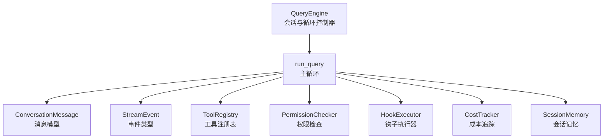
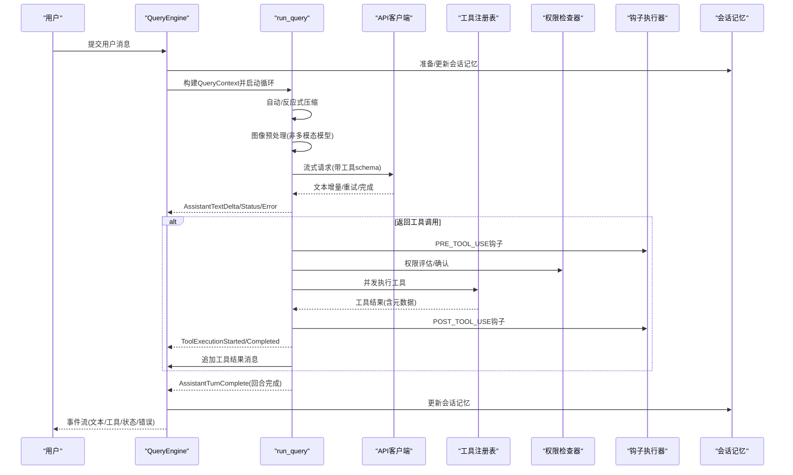
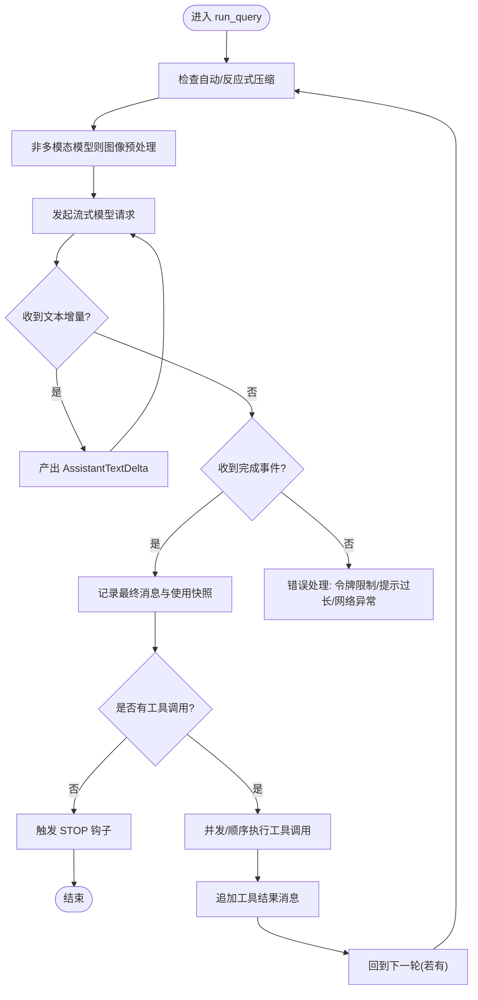
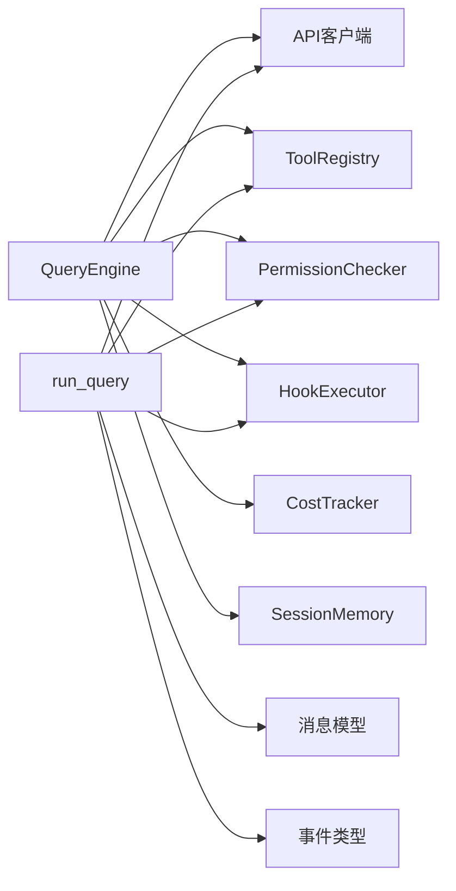

# 代理循环机制

<cite>
**本文引用的文件**
- [src/openharness/engine/query_engine.py](file://src/openharness/engine/query_engine.py)
- [src/openharness/engine/query.py](file://src/openharness/engine/query.py)
- [src/openharness/engine/messages.py](file://src/openharness/engine/messages.py)
- [src/openharness/engine/stream_events.py](file://src/openharness/engine/stream_events.py)
- [src/openharness/engine/cost_tracker.py](file://src/openharness/engine/cost_tracker.py)
- [src/openharness/tools/base.py](file://src/openharness/tools/base.py)
- [src/openharness/hooks/executor.py](file://src/openharness/hooks/executor.py)
- [src/openharness/permissions/checker.py](file://src/openharness/permissions/checker.py)
- [src/openharness/services/session_memory/__init__.py](file://src/openharness/services/session_memory/__init__.py)
- [tests/test_engine/test_query_engine.py](file://tests/test_engine/test_query_engine.py)
</cite>

## 目录
1. [简介](#简介)
2. [项目结构](#项目结构)
3. [核心组件](#核心组件)
4. [架构总览](#架构总览)
5. [详细组件分析](#详细组件分析)
6. [依赖关系分析](#依赖关系分析)
7. [性能考量](#性能考量)
8. [故障排查指南](#故障排查指南)
9. [结论](#结论)
10. [附录：扩展与自定义](#附录扩展与自定义)

## 简介
本文件系统性阐述 OpenHarness 的代理循环机制，重点围绕 QueryEngine 类及其协作模块，解释查询执行流程、消息处理机制、工具调用循环、流式事件处理、成本追踪与会话记忆管理等关键特性，并提供可操作的扩展点与自定义选项说明。读者将理解从“用户输入”到“AI 模型响应”再到“工具执行”的完整闭环，以及在该闭环中如何实现安全控制、性能优化与可观测性。

## 项目结构
与代理循环直接相关的引擎与支撑模块位于 openharness.engine 子包，核心文件如下：
- 查询引擎与循环：query_engine.py、query.py
- 消息模型与序列化：messages.py
- 流式事件类型：stream_events.py
- 成本追踪：cost_tracker.py
- 工具抽象与注册表：tools/base.py
- 权限检查器：permissions/checker.py
- 钩子执行器：hooks/executor.py
- 会话记忆服务：services/session_memory/__init__.py
- 行为验证（测试）：tests/test_engine/test_query_engine.py

图示来源
- [src/openharness/engine/query_engine.py:21-307](file://src/openharness/engine/query_engine.py#L21-L307)
- [src/openharness/engine/query.py:633-884](file://src/openharness/engine/query.py#L633-L884)
- [src/openharness/engine/messages.py:65-223](file://src/openharness/engine/messages.py#L65-L223)
- [src/openharness/engine/stream_events.py:12-91](file://src/openharness/engine/stream_events.py#L12-L91)
- [src/openharness/tools/base.py:60-81](file://src/openharness/tools/base.py#L60-L81)
- [src/openharness/permissions/checker.py:57-201](file://src/openharness/permissions/checker.py#L57-L201)
- [src/openharness/hooks/executor.py:41-243](file://src/openharness/hooks/executor.py#L41-L243)
- [src/openharness/engine/cost_tracker.py:8-25](file://src/openharness/engine/cost_tracker.py#L8-L25)
- [src/openharness/services/session_memory/__init__.py:17-140](file://src/openharness/services/session_memory/__init__.py#L17-L140)

章节来源
- [src/openharness/engine/query_engine.py:21-307](file://src/openharness/engine/query_engine.py#L21-L307)
- [src/openharness/engine/query.py:633-884](file://src/openharness/engine/query.py#L633-L884)

## 核心组件
- QueryEngine：持有对话历史、工具感知的代理循环，负责提交用户消息、驱动 run_query 循环、聚合使用量、触发会话记忆与自动整理、调度自动记忆抽取与 AutoDream。
- run_query：核心异步循环，按轮次执行，包含自动/反应式压缩、图像预处理、模型流式输出、工具并发执行、事件产出与状态更新。
- ConversationMessage/ContentBlock：统一的消息与内容块模型，支持文本、图片、工具调用与工具结果。
- StreamEvent：流式事件集合，包括增量文本、回合完成、工具执行开始/结束、错误与状态事件、压缩进度事件。
- ToolRegistry/BaseTool：工具注册与抽象，提供工具模式与执行接口。
- PermissionChecker：基于模式与规则的工具执行权限判定。
- HookExecutor：生命周期钩子执行器，支持命令、HTTP、提示词与智能体模式的条件判断。
- CostTracker：会话级使用量累计。
- SessionMemory：文件化会话记忆，用于跨轮次上下文压缩与恢复。

章节来源
- [src/openharness/engine/query_engine.py:21-307](file://src/openharness/engine/query_engine.py#L21-L307)
- [src/openharness/engine/query.py:633-884](file://src/openharness/engine/query.py#L633-L884)
- [src/openharness/engine/messages.py:14-223](file://src/openharness/engine/messages.py#L14-L223)
- [src/openharness/engine/stream_events.py:12-91](file://src/openharness/engine/stream_events.py#L12-L91)
- [src/openharness/tools/base.py:17-81](file://src/openharness/tools/base.py#L17-L81)
- [src/openharness/permissions/checker.py:57-201](file://src/openharness/permissions/checker.py#L57-L201)
- [src/openharness/hooks/executor.py:41-243](file://src/openharness/hooks/executor.py#L41-L243)
- [src/openharness/engine/cost_tracker.py:8-25](file://src/openharness/engine/cost_tracker.py#L8-L25)
- [src/openharness/services/session_memory/__init__.py:17-140](file://src/openharness/services/session_memory/__init__.py#L17-L140)

## 架构总览
下图展示了从用户输入到工具执行与最终回复的端到端流程，以及关键事件与数据流：

图示来源
- [src/openharness/engine/query_engine.py:227-307](file://src/openharness/engine/query_engine.py#L227-L307)
- [src/openharness/engine/query.py:633-884](file://src/openharness/engine/query.py#L633-L884)
- [src/openharness/hooks/executor.py:64-78](file://src/openharness/hooks/executor.py#L64-L78)
- [src/openharness/permissions/checker.py:75-156](file://src/openharness/permissions/checker.py#L75-L156)
- [src/openharness/services/session_memory/__init__.py:62-74](file://src/openharness/services/session_memory/__init__.py#L62-L74)

## 详细组件分析

### QueryEngine：会话与循环控制器
- 职责
  - 维护对话历史与工具元数据，提供清空、替换、设置系统提示、模型、推理努力、最大轮次、权限检查器等能力。
  - 在每次用户输入后构建 QueryContext，调用 run_query 执行循环，并在回合完成后刷新内部消息。
  - 支持“继续未完成”场景，无需新增用户消息即可继续工具调用循环。
  - 聚合使用量、准备/更新会话记忆、抽取持久化记忆、调度 AutoDream。
- 关键属性与方法
  - 属性：messages、max_turns、api_client、model、system_prompt、tool_metadata、total_usage
  - 方法：submit_message、continue_pending、has_pending_continuation、clear、set_* 系列、_prepare_session_memory/_update_session_memory/_extract_durable_memories/_schedule_auto_dream
- 与 run_query 的交互
  - 将当前消息列表与可选的“协调者上下文”消息传入 run_query，接收事件流与使用快照；回合完成后将 run_query 内部的最终消息列表回写至 QueryEngine 的消息缓存。

章节来源
- [src/openharness/engine/query_engine.py:21-307](file://src/openharness/engine/query_engine.py#L21-L307)

### run_query：工具感知的异步循环
- 自动/反应式压缩
  - 每轮开始前检查是否需要压缩，必要时先进行微压缩（清理旧工具结果），再进行 LLM 基础摘要压缩；支持流式进度事件。
- 图像预处理
  - 对于非多模态模型，扫描用户消息中的图片块，通过 image_to_text 工具转换为文本描述，保持 UI 响应性。
- 模型流式请求
  - 生成 ApiMessageRequest，携带系统提示、消息、工具 schema 与推理努力；逐段产出 AssistantTextDelta；在重试事件中发出状态提示；在完成事件中获取最终消息与使用快照。
- 错误处理
  - 识别“提示过长/完成令牌上限”等错误，分别尝试降低 max_tokens 或进行反应式压缩；网络类错误转为 ErrorEvent。
- 工具调用循环
  - 单工具：顺序执行，立即产出 ToolExecutionStarted/Completed。
  - 多工具：并发执行，收集结果后再统一产出 ToolExecutionCompleted。
  - 工具执行前后触发 PRE_TOOL_USE/POST_TOOL_USE 钩子；根据权限策略决定是否允许或需要用户确认；对敏感路径与命令进行内置保护。
- 回合完成
  - 将最终助手消息追加到消息列表，产出 AssistantTurnComplete；若无工具调用则触发 STOP 钩子。

图示来源
- [src/openharness/engine/query.py:633-884](file://src/openharness/engine/query.py#L633-L884)

章节来源
- [src/openharness/engine/query.py:633-884](file://src/openharness/engine/query.py#L633-L884)

### 消息模型与序列化：ConversationMessage/ContentBlock
- 支持的内容块：文本、图片、工具调用、工具结果。
- 提供 from_user_text/from_user_content、to_api_param、is_effectively_empty 等便捷方法。
- sanitize_conversation_messages 用于规范化历史消息，剔除空助手消息与不完整的工具尾部，确保后续请求合法。

章节来源
- [src/openharness/engine/messages.py:14-223](file://src/openharness/engine/messages.py#L14-L223)

### 流式事件：StreamEvent 体系
- AssistantTextDelta：模型文本增量。
- AssistantTurnComplete：回合完成，携带消息与使用快照。
- ToolExecutionStarted/Completed：工具执行开始与完成，包含输出与元数据。
- ErrorEvent/StatusEvent：错误与状态提示。
- CompactProgressEvent：压缩阶段的结构化进度事件（钩子开始、上下文折叠、会话记忆、压缩开始/重试/结束/失败等）。

章节来源
- [src/openharness/engine/stream_events.py:12-91](file://src/openharness/engine/stream_events.py#L12-L91)

### 工具系统：ToolRegistry 与 BaseTool
- ToolRegistry：维护工具名到实现的映射，提供 to_api_schema 以暴露给模型。
- BaseTool：抽象工具执行接口，支持只读标记与 API Schema 输出。
- _execute_tool_call：统一的工具执行入口，串联钩子、权限检查、执行、输出截断与元数据记录。

章节来源
- [src/openharness/tools/base.py:17-81](file://src/openharness/tools/base.py#L17-L81)
- [src/openharness/engine/query.py:887-1018](file://src/openharness/engine/query.py#L887-L1018)

### 权限控制：PermissionChecker
- 内置敏感路径白名单与显式工具允许/拒绝列表。
- 支持 FULL_AUTO、PLAN、默认三种模式；只读工具始终放行；计划模式阻断变更型工具；默认模式要求确认。
- 命令级拒绝模式匹配；对 bash 安装类命令给出友好提示。

章节来源
- [src/openharness/permissions/checker.py:57-201](file://src/openharness/permissions/checker.py#L57-L201)

### 钩子系统：HookExecutor
- 支持命令、HTTP、提示词与智能体四种钩子类型，按事件过滤与参数注入执行。
- 在工具调用前后触发 PRE_TOOL_USE/POST_TOOL_USE，在回合结束触发 STOP；在压缩过程中触发 hooks_start 等阶段事件。

章节来源
- [src/openharness/hooks/executor.py:41-243](file://src/openharness/hooks/executor.py#L41-L243)

### 成本追踪：CostTracker
- 累加 input_tokens 与 output_tokens，提供 total 使用快照。

章节来源
- [src/openharness/engine/cost_tracker.py:8-25](file://src/openharness/engine/cost_tracker.py#L8-L25)

### 会话记忆：文件化存储与压缩
- 会话记忆文件按项目与会话 ID 生成稳定路径，定期更新 checkpoint。
- build_session_memory_document 汇聚任务焦点状态、近期对话与活动工件，限制长度并截断。
- session_memory_to_compact_text 用于在压缩时插入上下文摘要。

章节来源
- [src/openharness/services/session_memory/__init__.py:17-140](file://src/openharness/services/session_memory/__init__.py#L17-L140)

## 依赖关系分析
- QueryEngine 依赖：API 客户端、工具注册表、权限检查器、钩子执行器、成本追踪器、会话记忆服务。
- run_query 依赖：API 客户端、工具注册表、权限检查器、钩子执行器、压缩服务、消息模型、事件类型。
- 工具执行依赖：BaseTool 抽象、ToolRegistry、PermissionChecker、HookExecutor、输出截断与元数据记录。
- 会话记忆依赖：消息模型、token 估算、原子写入。

图示来源
- [src/openharness/engine/query_engine.py:21-307](file://src/openharness/engine/query_engine.py#L21-L307)
- [src/openharness/engine/query.py:633-884](file://src/openharness/engine/query.py#L633-L884)

章节来源
- [src/openharness/engine/query_engine.py:21-307](file://src/openharness/engine/query_engine.py#L21-L307)
- [src/openharness/engine/query.py:633-884](file://src/openharness/engine/query.py#L633-L884)

## 性能考量
- 请求级输出令牌上限约束：在单次请求中对 max_tokens 进行安全上限钳制，避免某些兼容模型拒绝大值导致失败。
- 反应式压缩：当检测到“提示过长”错误时，自动触发压缩并重试，保障会话连续性。
- 并发工具执行：多工具调用采用 gather 并发执行，返回后统一产出事件，减少等待时间。
- 输出截断：超长工具输出自动落盘并以内联摘要替代，避免消息膨胀。
- 会话记忆：定期 checkpoint 与摘要注入，降低上下文长度，提升稳定性。

章节来源
- [src/openharness/engine/query.py:90-127](file://src/openharness/engine/query.py#L90-L127)
- [src/openharness/engine/query.py:841-879](file://src/openharness/engine/query.py#L841-L879)
- [src/openharness/engine/query.py:524-554](file://src/openharness/engine/query.py#L524-L554)
- [src/openharness/services/session_memory/__init__.py:77-108](file://src/openharness/services/session_memory/__init__.py#L77-L108)

## 故障排查指南
- “提示过长/上下文窗口不足”
  - 现象：抛出“提示过长/上下文长度/最大上下文/输入令牌超出”等错误。
  - 处理：自动进行反应式压缩；若仍失败，检查 context_window_tokens 与 auto_compact_threshold_tokens 设置。
- “完成令牌过大被拒绝”
  - 现象：模型返回“max_tokens/completion tokens 过大”。
  - 处理：解析提供商限制并动态下调 max_tokens 后重试。
- “网络/连接/超时”
  - 现象：网络错误事件。
  - 处理：检查网络连通性与代理配置，重试或调整超时。
- “空助手消息”
  - 现象：模型返回空助手消息。
  - 处理：丢弃该消息并提示，避免污染会话。
- “未知工具/输入无效”
  - 现象：工具不存在或输入校验失败。
  - 处理：返回错误结果，检查工具注册与输入模式。
- “权限拒绝/需要确认”
  - 现象：权限检查器要求确认或拒绝。
  - 处理：根据模式与规则调整，或在默认模式下进行确认。

章节来源
- [src/openharness/engine/query.py:66-127](file://src/openharness/engine/query.py#L66-L127)
- [src/openharness/engine/query.py:753-782](file://src/openharness/engine/query.py#L753-L782)
- [src/openharness/engine/query.py:887-1018](file://src/openharness/engine/query.py#L887-L1018)
- [src/openharness/permissions/checker.py:75-156](file://src/openharness/permissions/checker.py#L75-L156)

## 结论
OpenHarness 的代理循环以 QueryEngine 为核心，结合 run_query 的工具感知循环、消息模型、事件体系、权限控制与钩子系统，实现了从用户输入到工具执行再到模型回复的完整闭环。通过自动/反应式压缩、并发工具执行、输出截断与会话记忆，系统在安全性、性能与可用性之间取得平衡。开发者可通过扩展工具、配置权限模式、编写钩子与定制会话记忆策略来满足复杂场景需求。

## 附录：扩展与自定义
- 启动与执行
  - 启动：通过命令行入口进入 CLI 应用，具体入口参见 [入口脚本:1-7](file://src/openharness/__main__.py#L1-L7)。
  - 执行：构造 QueryEngine 实例，调用 submit_message 提交用户消息；或调用 continue_pending 继续未完成的工具循环。
  - 终止：当模型不再请求工具调用时，循环自然结束；也可通过 max_turns 限制轮次。
- 自定义选项
  - API 客户端：实现 SupportsStreamingMessages 接口，支持流式文本增量与重试事件。
  - 工具注册表：注册自定义 BaseTool 实现，提供输入模式与只读标记。
  - 权限策略：通过 PermissionSettings 配置模式、允许/拒绝列表与路径规则。
  - 钩子：注册命令/HTTP/提示词/智能体钩子，拦截 PRE_TOOL_USE/POST_TOOL_USE/STOP 等事件。
  - 会话记忆：启用 session_memory_enabled，定制 session_id 与记忆文件位置。
  - 成本追踪：使用 total_usage 获取累计输入/输出令牌数。
- 典型用例参考
  - 流式文本回复与工具调用：参见测试用例 [plain_text_reply:217-246](file://tests/test_engine/test_query_engine.py#L217-L246)、[executes_tool_calls:291-339](file://tests/test_engine/test_query_engine.py#L291-L339)。
  - 压缩与重试：参见 [clamps_oversized_max_tokens:248-267](file://tests/test_engine/test_query_engine.py#L248-L267)、[retries_with_provider_limit:269-289](file://tests/test_engine/test_query_engine.py#L269-L289)、[reactive_compact:484-518](file://tests/test_engine/test_query_engine.py#L484-L518)。
  - 钩子与权限：参见 [respects_pre_tool_hook_blocks:640-695](file://tests/test_engine/test_query_engine.py#L640-L695)、[stop_hook_fires:732-751](file://tests/test_engine/test_query_engine.py#L732-L751)。

章节来源
- [src/openharness/__main__.py:1-7](file://src/openharness/__main__.py#L1-L7)
- [tests/test_engine/test_query_engine.py:217-800](file://tests/test_engine/test_query_engine.py#L217-L800)