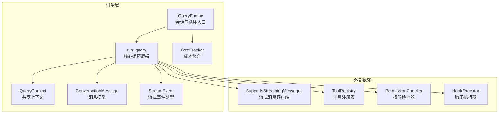
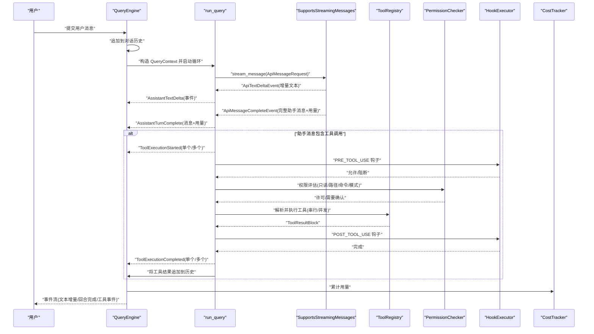
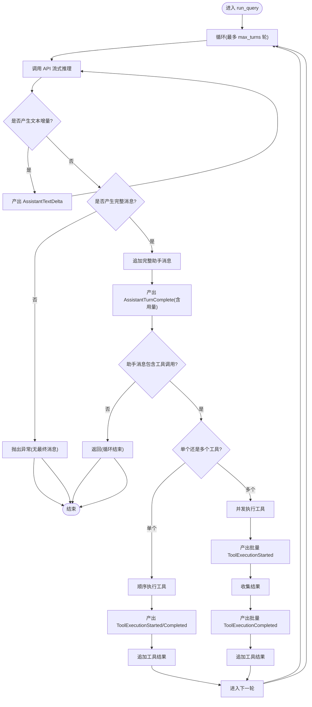
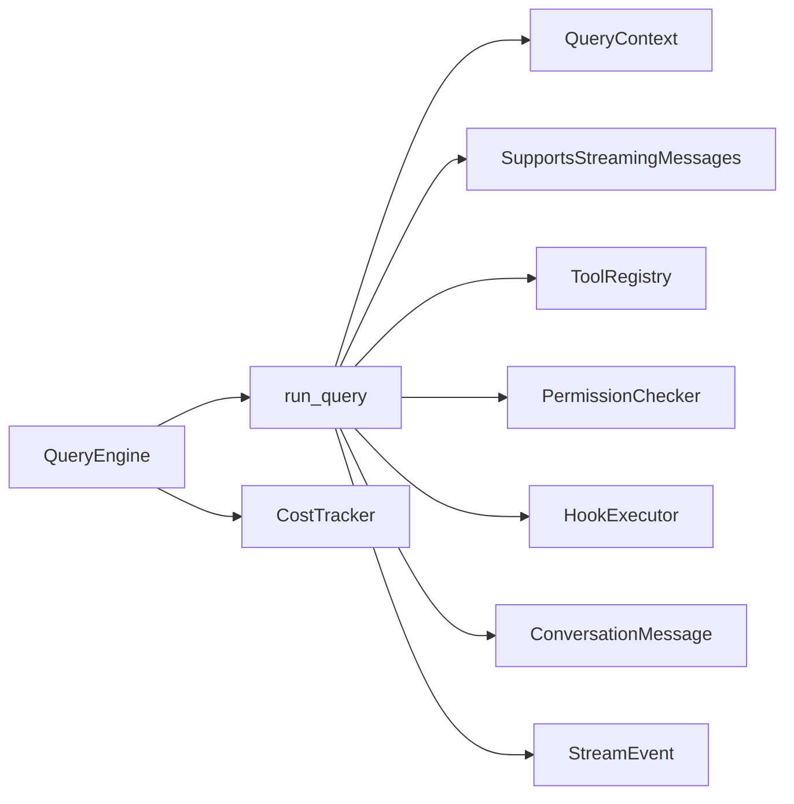

# 代理循环机制

<cite>
**本文引用的文件**
- [src/openharness/engine/query_engine.py](file://src/openharness/engine/query_engine.py)
- [src/openharness/engine/query.py](file://src/openharness/engine/query.py)
- [src/openharness/engine/messages.py](file://src/openharness/engine/messages.py)
- [src/openharness/engine/stream_events.py](file://src/openharness/engine/stream_events.py)
- [src/openharness/engine/cost_tracker.py](file://src/openharness/engine/cost_tracker.py)
- [src/openharness/api/client.py](file://src/openharness/api/client.py)
- [src/openharness/tools/base.py](file://src/openharness/tools/base.py)
- [src/openharness/hooks/executor.py](file://src/openharness/hooks/executor.py)
- [src/openharness/permissions/checker.py](file://src/openharness/permissions/checker.py)
- [src/openharness/api/usage.py](file://src/openharness/api/usage.py)
- [src/openharness/commands/registry.py](file://src/openharness/commands/registry.py)
- [tests/test_engine/test_query_engine.py](file://tests/test_engine/test_query_engine.py)
- [frontend/terminal/src/hooks/useBackendSession.ts](file://frontend/terminal/src/hooks/useBackendSession.ts)
- [frontend/terminal/src/components/Composer.tsx](file://frontend/terminal/src/components/Composer.tsx)
</cite>

## 目录
1. [简介](#简介)
2. [项目结构](#项目结构)
3. [核心组件](#核心组件)
4. [架构总览](#架构总览)
5. [详细组件分析](#详细组件分析)
6. [依赖分析](#依赖分析)
7. [性能考虑](#性能考虑)
8. [故障排查指南](#故障排查指南)
9. [结论](#结论)
10. [附录](#附录)

## 简介
本文件围绕 OpenHarness 的代理循环机制进行深入技术解析，重点阐述 QueryEngine 如何通过 QueryContext 驱动一次完整的“消息提交—查询执行—工具调用—响应处理”闭环。文档覆盖以下关键主题：
- 代理循环的完整流程与阶段划分
- QueryContext 的职责与配置项
- 异步流式事件处理机制（文本增量、回合完成、工具执行开始/结束）
- 对话历史管理、成本跟踪与消息抽象的设计理念
- 错误处理策略与性能优化建议
- 面向高级开发者的扩展点与最佳实践

## 项目结构
OpenHarness 将代理循环相关能力集中在 engine 子模块，并通过 API 客户端、工具注册表、权限检查器、钩子执行器等协作组件共同完成端到端流程。

图表来源
- [src/openharness/engine/query_engine.py:18-101](file://src/openharness/engine/query_engine.py#L18-L101)
- [src/openharness/engine/query.py:53-212](file://src/openharness/engine/query.py#L53-L212)
- [src/openharness/engine/messages.py:39-109](file://src/openharness/engine/messages.py#L39-L109)
- [src/openharness/engine/stream_events.py:12-50](file://src/openharness/engine/stream_events.py#L12-L50)
- [src/openharness/engine/cost_tracker.py:8-25](file://src/openharness/engine/cost_tracker.py#L8-L25)
- [src/openharness/api/client.py:60-186](file://src/openharness/api/client.py#L60-L186)
- [src/openharness/tools/base.py:55-76](file://src/openharness/tools/base.py#L55-L76)
- [src/openharness/permissions/checker.py:30-100](file://src/openharness/permissions/checker.py#L30-L100)
- [src/openharness/hooks/executor.py:38-217](file://src/openharness/hooks/executor.py#L38-L217)

章节来源
- [src/openharness/engine/query_engine.py:18-101](file://src/openharness/engine/query_engine.py#L18-L101)
- [src/openharness/engine/query.py:53-212](file://src/openharness/engine/query.py#L53-L212)

## 核心组件
- QueryEngine：持有对话历史与工具感知的循环，负责接收用户输入、构建 QueryContext、驱动 run_query 并聚合成本。
- run_query：核心循环函数，封装一轮或多轮的“模型推理—工具调用—结果回传”的迭代过程。
- QueryContext：贯穿一次查询运行期的共享上下文，包含模型参数、工具模式、权限提示、用户回调、钩子执行器等。
- ConversationMessage：统一的消息抽象，支持文本块、工具调用块、工具结果块的序列化与转换。
- StreamEvent：流式事件类型集合，用于向前端或上层消费者推送增量文本、回合完成、工具执行开始/结束等事件。
- CostTracker：会话生命周期内的用量聚合器，按回合累加输入/输出 token 数量。
- SupportsStreamingMessages：协议接口，定义流式消息请求与事件产出；AnthropicApiClient 提供具体实现并内置重试与错误翻译。
- ToolRegistry/Tool 执行：工具注册与执行抽象，支持并发工具调用与钩子前后置拦截。
- PermissionChecker：基于配置的权限评估器，支持显式白名单/黑名单、路径规则、命令模式与交互确认。
- HookExecutor：可插拔的钩子执行引擎，支持命令、HTTP、提示词型钩子，用于 PRE/POST 工具使用等生命周期事件。

章节来源
- [src/openharness/engine/query_engine.py:18-101](file://src/openharness/engine/query_engine.py#L18-L101)
- [src/openharness/engine/query.py:35-51](file://src/openharness/engine/query.py#L35-L51)
- [src/openharness/engine/messages.py:39-109](file://src/openharness/engine/messages.py#L39-L109)
- [src/openharness/engine/stream_events.py:12-50](file://src/openharness/engine/stream_events.py#L12-L50)
- [src/openharness/engine/cost_tracker.py:8-25](file://src/openharness/engine/cost_tracker.py#L8-L25)
- [src/openharness/api/client.py:60-186](file://src/openharness/api/client.py#L60-L186)
- [src/openharness/tools/base.py:55-76](file://src/openharness/tools/base.py#L55-L76)
- [src/openharness/permissions/checker.py:30-100](file://src/openharness/permissions/checker.py#L30-L100)
- [src/openharness/hooks/executor.py:38-217](file://src/openharness/hooks/executor.py#L38-L217)

## 架构总览
下图展示了从用户提交消息到最终回合完成的端到端数据流与控制流：

图表来源
- [src/openharness/engine/query_engine.py:81-101](file://src/openharness/engine/query_engine.py#L81-L101)
- [src/openharness/engine/query.py:53-122](file://src/openharness/engine/query.py#L53-L122)
- [src/openharness/api/client.py:107-177](file://src/openharness/api/client.py#L107-L177)
- [src/openharness/tools/base.py:13-28](file://src/openharness/tools/base.py#L13-L28)
- [src/openharness/hooks/executor.py:49-64](file://src/openharness/hooks/executor.py#L49-L64)
- [src/openharness/permissions/checker.py:43-99](file://src/openharness/permissions/checker.py#L43-L99)

## 详细组件分析

### QueryEngine：会话与循环入口
- 职责
  - 维护对话历史与成本统计
  - 构造 QueryContext 并驱动 run_query
  - 暴露消息读取、清空、替换、更新系统提示/模型/权限检查器等能力
- 关键行为
  - submit_message：追加用户消息，创建 QueryContext，遍历 run_query 产生的事件流，遇到用量时累加到 CostTracker
  - total_usage：对外暴露累计用量
  - load_messages/clear/set_*：管理会话状态

章节来源
- [src/openharness/engine/query_engine.py:18-101](file://src/openharness/engine/query_engine.py#L18-L101)

### QueryContext：共享上下文
- 字段概览
  - api_client、tool_registry、permission_checker、cwd、model、system_prompt、max_tokens
  - permission_prompt、ask_user_prompt、max_turns、hook_executor、tool_metadata
- 作用
  - 作为 run_query 的唯一输入，确保循环内各阶段共享一致的配置与资源
  - 支持可选的用户交互回调（权限确认、询问用户）与钩子扩展

章节来源
- [src/openharness/engine/query.py:35-51](file://src/openharness/engine/query.py#L35-L51)

### run_query：核心代理循环
- 循环控制
  - 基于 max_turns 的最大轮次限制，每轮最多一次模型推理与一次工具调用链
- 流程拆解
  - 推理阶段：调用 api_client.stream_message，逐条产出 ApiTextDeltaEvent，随后产出 ApiMessageCompleteEvent（包含完整助手消息与用量）
  - 事件产出：AssistantTextDelta 与 AssistantTurnComplete 事件分别对应文本增量与回合完成
  - 工具调用阶段：若助手消息包含 ToolUseBlock，则进入工具执行
    - 单工具：顺序执行，立即产出 ToolExecutionStarted/Completed
    - 多工具：并发执行，先批量产出 ToolExecutionStarted，再批量产出 ToolExecutionCompleted
  - 结果回传：将工具结果以 ToolResultBlock 形式追加到历史消息，继续下一轮
- 错误与边界
  - 若未收到最终消息则抛出异常
  - 超过最大轮次抛出异常
  - 工具执行前可被 PRE_TOOL_USE 钩子阻断
  - 权限评估失败可要求用户确认或直接拒绝

图表来源
- [src/openharness/engine/query.py:53-122](file://src/openharness/engine/query.py#L53-L122)

章节来源
- [src/openharness/engine/query.py:53-122](file://src/openharness/engine/query.py#L53-L122)

### 工具执行与权限校验
- 钩子拦截
  - PRE_TOOL_USE：在执行前根据匹配规则与判定逻辑决定是否阻断
  - POST_TOOL_USE：在执行后记录结果，便于审计与后续处理
- 权限评估
  - 显式工具白名单/黑名单
  - 路径级规则（glob 匹配）
  - 命令模式匹配（如危险命令）
  - 模式：全自动、计划模式、默认模式（默认需确认）
  - 只读工具总是允许
- 执行上下文
  - ToolExecutionContext 提供 cwd 与 metadata（含 ask_user_prompt、tool_registry、tool_metadata），便于工具访问会话信息

章节来源
- [src/openharness/hooks/executor.py:49-64](file://src/openharness/hooks/executor.py#L49-L64)
- [src/openharness/permissions/checker.py:43-99](file://src/openharness/permissions/checker.py#L43-L99)
- [src/openharness/tools/base.py:13-28](file://src/openharness/tools/base.py#L13-L28)

### 消息抽象与流式事件
- ConversationMessage
  - 角色：user/assistant
  - 内容：TextBlock、ToolUseBlock、ToolResultBlock 的多态组合
  - 辅助方法：from_user_text、text 属性、tool_uses 访问器、to_api_param 序列化
- 流式事件
  - AssistantTextDelta：增量文本
  - AssistantTurnComplete：回合完成（含完整消息与用量）
  - ToolExecutionStarted/Completed：工具执行生命周期事件

章节来源
- [src/openharness/engine/messages.py:39-109](file://src/openharness/engine/messages.py#L39-L109)
- [src/openharness/engine/stream_events.py:12-50](file://src/openharness/engine/stream_events.py#L12-L50)

### 成本跟踪与用量聚合
- UsageSnapshot：记录 input_tokens 与 output_tokens
- CostTracker：按回合累加用量，提供 total 查询
- QueryEngine 在每次收到回合完成事件时，将用量合并到 CostTracker

章节来源
- [src/openharness/api/usage.py:8-17](file://src/openharness/api/usage.py#L8-L17)
- [src/openharness/engine/cost_tracker.py:8-25](file://src/openharness/engine/cost_tracker.py#L8-L25)
- [src/openharness/engine/query_engine.py:98-100](file://src/openharness/engine/query_engine.py#L98-L100)

### 异步流式事件处理机制
- API 层
  - SupportsStreamingMessages 定义 stream_message 接口
  - AnthropicApiClient 实现流式推理，逐条产出 ApiTextDeltaEvent，最后产出 ApiMessageCompleteEvent
  - 内置指数退避与抖动的重试逻辑，区分可重试与不可重试错误
- 引擎层
  - run_query 将底层事件映射为上层 StreamEvent，逐个产出给调用方
  - QueryEngine 在收到回合完成事件时，同步更新用量

章节来源
- [src/openharness/api/client.py:60-186](file://src/openharness/api/client.py#L60-L186)
- [src/openharness/engine/query.py:71-83](file://src/openharness/engine/query.py#L71-L83)
- [src/openharness/engine/query_engine.py:97-101](file://src/openharness/engine/query_engine.py#L97-L101)

### 对话历史管理与前端集成
- 对话历史
  - QueryEngine 维护内存中的 ConversationMessage 列表
  - 支持 clear/load_messages 替换历史
  - commands/registry 中提供压缩与用量查看命令
- 前端集成
  - useBackendSession 解析来自后端的 OHJSON 协议事件，分别处理 assistant_delta、assistant_complete、tool_started/completed 等
  - Composer 提供输入框与状态显示，配合后端事件驱动 UI 更新

章节来源
- [src/openharness/engine/query_engine.py:60-80](file://src/openharness/engine/query_engine.py#L60-L80)
- [src/openharness/commands/registry.py:255-283](file://src/openharness/commands/registry.py#L255-L283)
- [frontend/terminal/src/hooks/useBackendSession.ts:71-150](file://frontend/terminal/src/hooks/useBackendSession.ts#L71-L150)
- [frontend/terminal/src/components/Composer.tsx:5-33](file://frontend/terminal/src/components/Composer.tsx#L5-L33)

## 依赖分析
- 组件耦合
  - QueryEngine 依赖 QueryContext、API 客户端、工具注册表、权限检查器、钩子执行器、成本跟踪器
  - run_query 仅依赖 QueryContext 与 API 客户端，保持高内聚低耦合
- 外部依赖
  - Anthropic Messages API 的流式协议与用量字段
  - 工具注册表与权限配置
  - 钩子定义与执行环境

图表来源
- [src/openharness/engine/query_engine.py:18-101](file://src/openharness/engine/query_engine.py#L18-L101)
- [src/openharness/engine/query.py:53-212](file://src/openharness/engine/query.py#L53-L212)

章节来源
- [src/openharness/engine/query_engine.py:18-101](file://src/openharness/engine/query_engine.py#L18-L101)
- [src/openharness/engine/query.py:53-212](file://src/openharness/engine/query.py#L53-L212)

## 性能考虑
- 并发工具调用
  - 多工具场景采用 asyncio.gather 并发执行，显著降低端到端延迟
- 流式文本增量
  - 通过 ApiTextDeltaEvent 实时推送文本，改善用户体验与感知延迟
- 用量聚合
  - 每回合完成后即时累加用量，避免额外扫描开销
- 重试与退避
  - API 层内置指数退避与抖动，减少瞬时错误对整体性能的影响
- 历史压缩
  - 提供压缩命令，减少消息长度，间接提升推理效率

章节来源
- [src/openharness/engine/query.py:109-111](file://src/openharness/engine/query.py#L109-L111)
- [src/openharness/api/client.py:77-96](file://src/openharness/api/client.py#L77-L96)
- [src/openharness/commands/registry.py:255-283](file://src/openharness/commands/registry.py#L255-L283)

## 故障排查指南
- 常见错误与定位
  - “模型流未产生最终消息”：检查 API 客户端实现与网络稳定性
  - “超过最大轮次限制”：确认工具调用是否正确返回结果，避免无限循环
  - “未知工具”或“输入校验失败”：核对工具注册表与输入模式
  - “权限拒绝”：检查权限配置、路径规则与命令模式
  - “PRE_TOOL_USE 阻断”：检查钩子匹配规则与判定逻辑
- 前端事件映射
  - 确保后端 OHJSON 事件类型与前端 useBackendSession 分支一一对应
  - 关注 assistant_delta 与 assistant_complete 的配对，避免 UI 状态错位

章节来源
- [src/openharness/engine/query.py:79-81](file://src/openharness/engine/query.py#L79-L81)
- [src/openharness/engine/query.py:124-158](file://src/openharness/engine/query.py#L124-L158)
- [src/openharness/permissions/checker.py:52-99](file://src/openharness/permissions/checker.py#L52-L99)
- [src/openharness/hooks/executor.py:49-64](file://src/openharness/hooks/executor.py#L49-L64)
- [frontend/terminal/src/hooks/useBackendSession.ts:99-123](file://frontend/terminal/src/hooks/useBackendSession.ts#L99-L123)

## 结论
OpenHarness 的代理循环以 QueryEngine 为核心入口，通过 QueryContext 将模型、工具、权限、钩子与会话状态整合为统一的执行上下文。run_query 将“流式文本增量—回合完成—工具调用—结果回传”串联为可观察、可扩展的流水线，结合成本跟踪与权限控制，形成安全、可观测且高性能的代理执行框架。对于高级开发者，可在工具注册表、钩子系统与权限策略方面进行深度定制，同时利用并发工具调用与流式事件进一步优化端到端体验。

## 附录
- 代码示例路径（不展示具体代码内容）
  - QueryEngine.submit_message 的完整调用链：[src/openharness/engine/query_engine.py:81-101](file://src/openharness/engine/query_engine.py#L81-L101)
  - run_query 的核心循环与工具调用分支：[src/openharness/engine/query.py:53-122](file://src/openharness/engine/query.py#L53-L122)
  - ConversationMessage 的消息构造与序列化：[src/openharness/engine/messages.py:45-68](file://src/openharness/engine/messages.py#L45-L68)
  - 流式事件类型定义：[src/openharness/engine/stream_events.py:12-50](file://src/openharness/engine/stream_events.py#L12-L50)
  - 成本聚合与用量模型：[src/openharness/engine/cost_tracker.py:8-25](file://src/openharness/engine/cost_tracker.py#L8-L25), [src/openharness/api/usage.py:8-17](file://src/openharness/api/usage.py#L8-L17)
  - API 客户端的流式实现与重试策略：[src/openharness/api/client.py:107-177](file://src/openharness/api/client.py#L107-L177)
  - 工具注册与执行抽象：[src/openharness/tools/base.py:55-76](file://src/openharness/tools/base.py#L55-L76)
  - 权限检查器评估逻辑：[src/openharness/permissions/checker.py:43-99](file://src/openharness/permissions/checker.py#L43-L99)
  - 钩子执行器的生命周期事件：[src/openharness/hooks/executor.py:49-64](file://src/openharness/hooks/executor.py#L49-L64)
  - 前端事件处理与 UI 集成：[frontend/terminal/src/hooks/useBackendSession.ts:71-150](file://frontend/terminal/src/hooks/useBackendSession.ts#L71-L150), [frontend/terminal/src/components/Composer.tsx:5-33](file://frontend/terminal/src/components/Composer.tsx#L5-L33)
  - 单元测试示例（文本回复、工具调用、钩子阻断、用户提问）：[tests/test_engine/test_query_engine.py:68-252](file://tests/test_engine/test_query_engine.py#L68-L252)