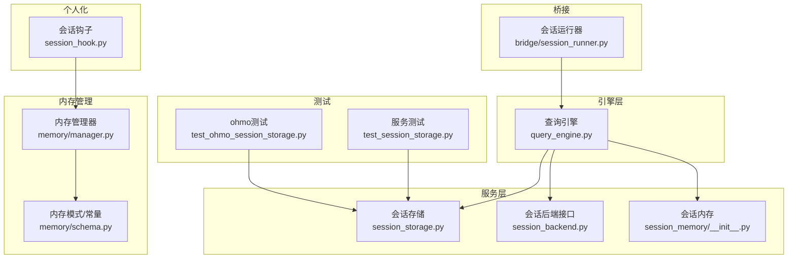
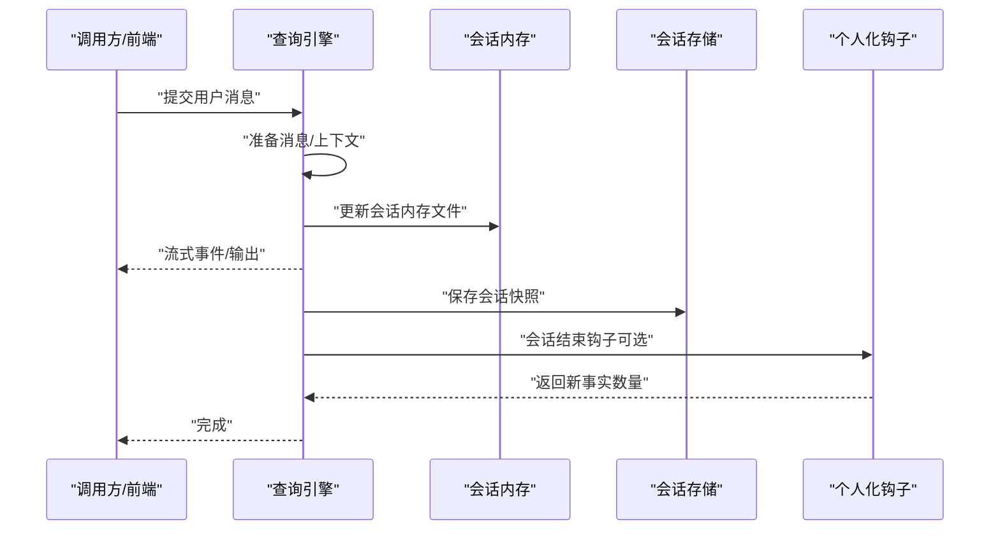
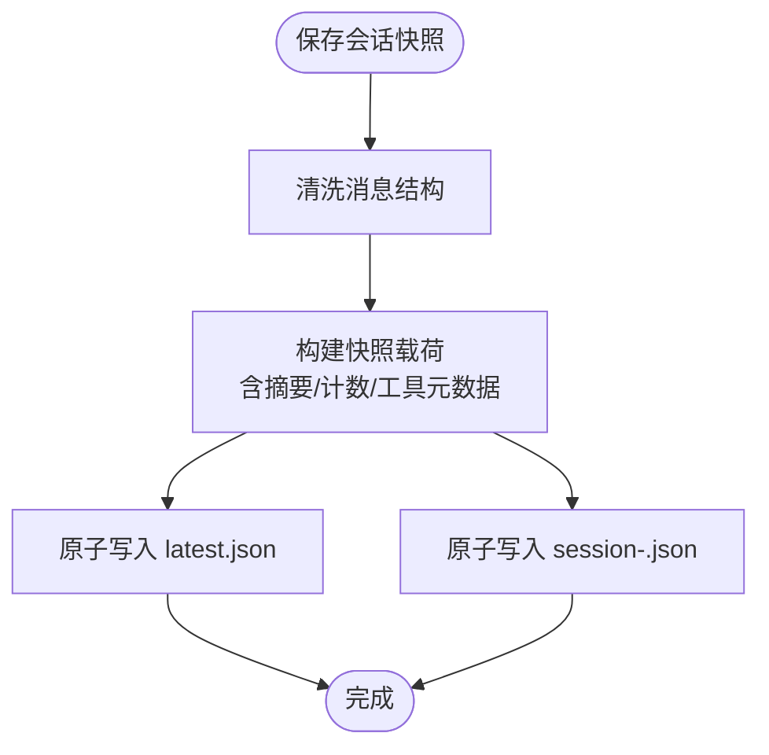
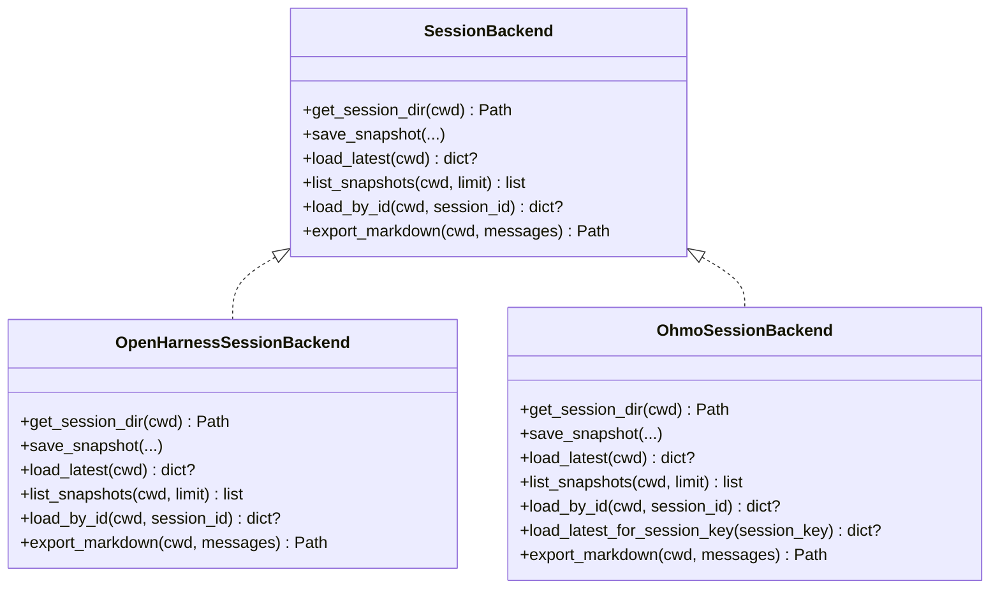
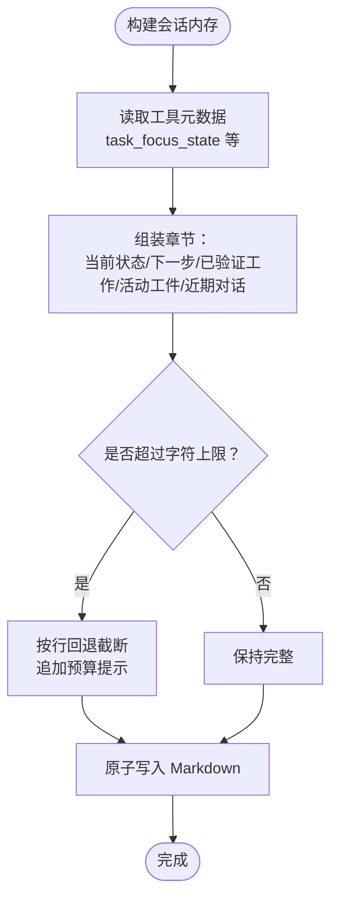
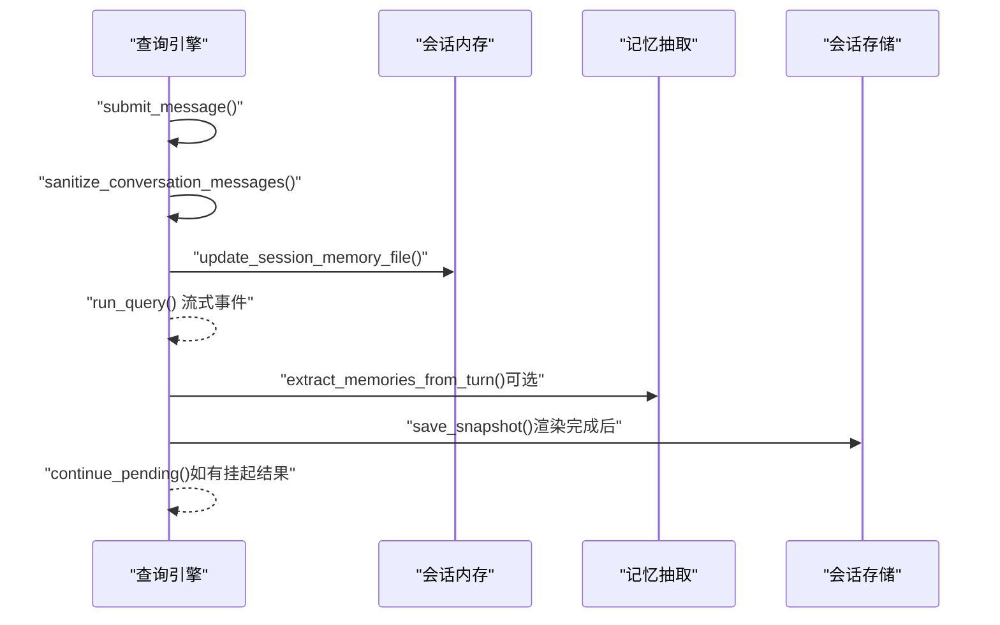
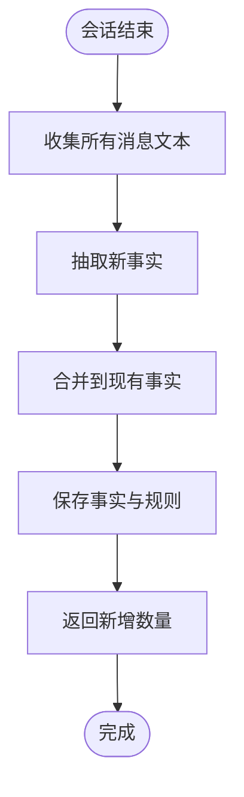
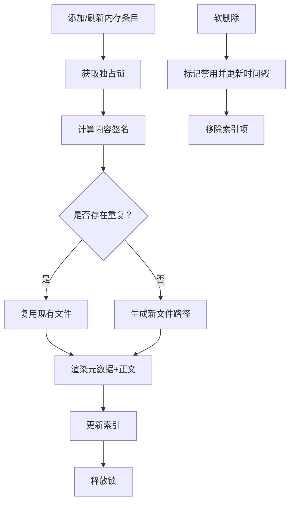
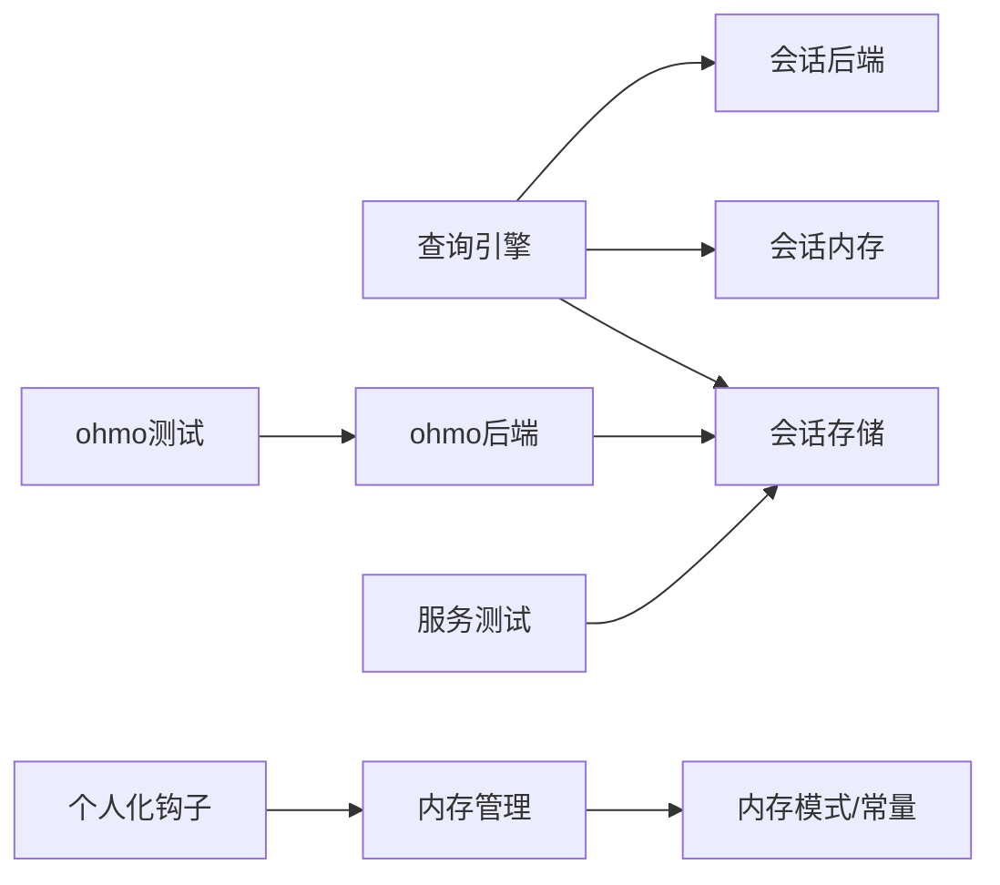

# 会话管理系统

<cite>
**本文引用的文件**
- [session_storage.py](file://src/openharness/services/session_storage.py)
- [session_memory/__init__.py](file://src/openharness/services/session_memory/__init__.py)
- [session_backend.py](file://src/openharness/services/session_backend.py)
- [session_runner.py](file://src/openharness/bridge/session_runner.py)
- [session_hook.py](file://src/openharness/personalization/session_hook.py)
- [manager.py](file://src/openharness/memory/manager.py)
- [schema.py](file://src/openharness/memory/schema.py)
- [query_engine.py](file://src/openharness/engine/query_engine.py)
- [test_session_storage.py](file://tests/test_services/test_session_storage.py)
- [test_ohmo_session_storage.py](file://tests/test_ohmo/test_ohmo_session_storage.py)
</cite>

## 目录
1. [简介](#简介)
2. [项目结构](#项目结构)
3. [核心组件](#核心组件)
4. [架构总览](#架构总览)
5. [详细组件分析](#详细组件分析)
6. [依赖关系分析](#依赖关系分析)
7. [性能考量](#性能考量)
8. [故障排查指南](#故障排查指南)
9. [结论](#结论)
10. [附录](#附录)

## 简介
本技术文档围绕 OpenHarness 的会话管理系统展开，系统性阐述会话存储机制、内存管理策略、持久化流程、状态维护与恢复、清理策略，以及会话与工具元数据的关系。同时说明会话在多代理协调中的作用，并提供配置选项、性能优化建议、备份与迁移方案及故障恢复机制。文档面向不同技术背景的读者，既提供高层概览也包含代码级细节与可视化图示。

## 项目结构
会话管理涉及以下关键模块：
- 服务层：会话存储（JSON 快照）、会话后端抽象与默认实现、会话内存（紧凑记忆）
- 引擎层：查询引擎在用户回合结束时触发会话内存更新与可选的持久化提取
- 个人化钩子：会话结束时从消息中抽取事实并生成规则
- 内存管理：项目/团队知识库的增删改查与去重
- 桥接层：外部桥接会话的启动与终止
- 测试：覆盖快照保存/加载、Markdown 导出、兼容旧格式等

图表来源
- [session_storage.py:1-231](file://src/openharness/services/session_storage.py#L1-L231)
- [session_memory/__init__.py:1-140](file://src/openharness/services/session_memory/__init__.py#L1-L140)
- [session_backend.py:1-98](file://src/openharness/services/session_backend.py#L1-L98)
- [query_engine.py:170-307](file://src/openharness/engine/query_engine.py#L170-L307)
- [session_hook.py:1-66](file://src/openharness/personalization/session_hook.py#L1-L66)
- [manager.py:1-184](file://src/openharness/memory/manager.py#L1-L184)
- [schema.py:1-444](file://src/openharness/memory/schema.py#L1-L444)
- [session_runner.py:1-47](file://src/openharness/bridge/session_runner.py#L1-L47)
- [test_session_storage.py:1-94](file://tests/test_services/test_session_storage.py#L1-L94)
- [test_ohmo_session_storage.py:1-90](file://tests/test_ohmo/test_ohmo_session_storage.py#L1-L90)

章节来源
- [session_storage.py:1-231](file://src/openharness/services/session_storage.py#L1-L231)
- [session_memory/__init__.py:1-140](file://src/openharness/services/session_memory/__init__.py#L1-L140)
- [session_backend.py:1-98](file://src/openharness/services/session_backend.py#L1-L98)
- [query_engine.py:170-307](file://src/openharness/engine/query_engine.py#L170-L307)
- [session_hook.py:1-66](file://src/openharness/personalization/session_hook.py#L1-L66)
- [manager.py:1-184](file://src/openharness/memory/manager.py#L1-L184)
- [schema.py:1-444](file://src/openharness/memory/schema.py#L1-L444)
- [session_runner.py:1-47](file://src/openharness/bridge/session_runner.py#L1-L47)
- [test_session_storage.py:1-94](file://tests/test_services/test_session_storage.py#L1-L94)
- [test_ohmo_session_storage.py:1-90](file://tests/test_ohmo/test_ohmo_session_storage.py#L1-L90)

## 核心组件
- 会话存储（JSON 快照）：负责项目级会话的保存、加载、列表与 Markdown 导出；支持“最新”与按 ID 存档；对消息进行清洗以保证向前兼容。
- 会话后端抽象：定义统一接口，提供默认实现（基于本地数据目录），并为 ohmo 提供专用后端（可按会话键维护独立“最新”）。
- 会话内存（紧凑记忆）：将当前任务目标、下一步、已验证工作、活动工件与近期对话摘要写入 Markdown 文件，用于跨上下文连续性。
- 查询引擎：在用户回合结束后自动更新会话内存，并可选地抽取持久化记忆；记录使用统计并在渲染事件后保存快照。
- 个人化钩子：在会话结束时从消息文本抽取事实，合并到现有事实集并生成规则文件。
- 内存管理：项目/团队知识库的增删改查、签名去重、过期判定与索引维护。
- 桥接会话运行器：通过子进程启动外部桥接会话，提供终止能力。

章节来源
- [session_storage.py:63-108](file://src/openharness/services/session_storage.py#L63-L108)
- [session_backend.py:14-98](file://src/openharness/services/session_backend.py#L14-L98)
- [session_memory/__init__.py:62-108](file://src/openharness/services/session_memory/__init__.py#L62-L108)
- [query_engine.py:170-184](file://src/openharness/engine/query_engine.py#L170-L184)
- [session_hook.py:22-66](file://src/openharness/personalization/session_hook.py#L22-L66)
- [manager.py:39-121](file://src/openharness/memory/manager.py#L39-L121)
- [schema.py:103-108](file://src/openharness/memory/schema.py#L103-L108)
- [session_runner.py:32-47](file://src/openharness/bridge/session_runner.py#L32-L47)

## 架构总览
会话管理采用分层设计：引擎层触发状态更新与持久化，服务层负责具体 IO，后端抽象屏蔽存储位置差异，个人化与内存管理作为增强能力与之解耦。

图表来源
- [query_engine.py:227-279](file://src/openharness/engine/query_engine.py#L227-L279)
- [session_memory/__init__.py:62-74](file://src/openharness/services/session_memory/__init__.py#L62-L74)
- [session_storage.py:63-108](file://src/openharness/services/session_storage.py#L63-L108)
- [session_hook.py:22-66](file://src/openharness/personalization/session_hook.py#L22-L66)

## 详细组件分析

### 组件A：会话存储（JSON 快照）
- 职责
  - 保存会话快照：同时写入“最新”与按 ID 的命名文件，便于回溯与并发访问。
  - 加载最近会话与按 ID 加载，支持摘要与消息计数等字段。
  - 清洗消息结构，兼容旧版本空 assistant 内容等异常。
  - 导出 Markdown 转录，便于人工审阅与审计。
- 关键点
  - 工具元数据仅保留白名单键，其余类型进行安全转换。
  - 使用原子写入确保并发一致性与崩溃安全。
  - 项目目录按路径哈希派生，避免同名冲突。
- 复杂度
  - 列表与加载：O(n) 遍历匹配文件，n 为会话文件数量。
  - 写入：O(1) 原子写入，整体受磁盘吞吐限制。

图表来源
- [session_storage.py:63-108](file://src/openharness/services/session_storage.py#L63-L108)
- [session_storage.py:110-121](file://src/openharness/services/session_storage.py#L110-L121)

章节来源
- [session_storage.py:18-108](file://src/openharness/services/session_storage.py#L18-L108)
- [session_storage.py:110-191](file://src/openharness/services/session_storage.py#L110-L191)
- [session_storage.py:210-231](file://src/openharness/services/session_storage.py#L210-L231)
- [test_session_storage.py:18-42](file://tests/test_services/test_session_storage.py#L18-L42)
- [test_session_storage.py:64-94](file://tests/test_services/test_session_storage.py#L64-L94)

### 组件B：会话后端抽象与默认实现
- 职责
  - 定义统一接口：获取会话目录、保存快照、加载最新、列出快照、按 ID 加载、导出 Markdown。
  - 默认实现：基于本地数据目录的会话存储。
  - ohmo 后端：支持按会话键维护独立“最新”，并兼容 ohmo 应用标识。
- 设计要点
  - 接口隔离，便于替换存储介质（如远程对象存储）。
  - ohmo 后端扩展了会话键与“latest-<token>.json”的映射，实现多通道/多租户的最新态管理。

图表来源
- [session_backend.py:14-98](file://src/openharness/services/session_backend.py#L14-L98)
- [session_storage.py:54-60](file://src/openharness/services/session_storage.py#L54-L60)
- [ohmo/session_storage.py:151-203](file://ohmo/session_storage.py#L151-L203)

章节来源
- [session_backend.py:14-98](file://src/openharness/services/session_backend.py#L14-L98)
- [ohmo/session_storage.py:41-99](file://ohmo/session_storage.py#L41-L99)
- [ohmo/session_storage.py:102-131](file://ohmo/session_storage.py#L102-L131)
- [ohmo/session_storage.py:151-203](file://ohmo/session_storage.py#L151-L203)

### 组件C：会话内存（紧凑记忆）
- 职责
  - 将任务焦点状态（目标、下一步、已验证工作、活动工件）与近期对话摘要写入 Markdown。
  - 控制最大字符数与最近行数，必要时截断并提示预算约束。
  - 提供将已持久化会话内存注入到上下文的能力（限制 token 数）。
- 数据结构与复杂度
  - 文本拼接与截断：O(n)，n 为内容长度。
  - 截断策略：按行回退，确保完整性。
- 与工具元数据的关系
  - 从工具元数据读取 task_focus_state 等键，作为紧凑记忆的核心输入。

图表来源
- [session_memory/__init__.py:77-108](file://src/openharness/services/session_memory/__init__.py#L77-L108)
- [session_memory/__init__.py:111-120](file://src/openharness/services/session_memory/__init__.py#L111-L120)

章节来源
- [session_memory/__init__.py:13-14](file://src/openharness/services/session_memory/__init__.py#L13-L14)
- [session_memory/__init__.py:77-108](file://src/openharness/services/session_memory/__init__.py#L77-L108)
- [session_memory/__init__.py:111-120](file://src/openharness/services/session_memory/__init__.py#L111-L120)
- [query_engine.py:170-184](file://src/openharness/engine/query_engine.py#L170-L184)

### 组件D：查询引擎与会话生命周期
- 职责
  - 在用户回合结束后自动更新会话内存与抽取持久化记忆。
  - 记录使用统计并在渲染事件后保存会话快照。
  - 支持挂起的工具结果继续推理，维持多代理协作的一致性。
- 关键流程
  - 用户消息提交 → 构建上下文 → 执行推理 → 流式事件 → 更新会话内存 → 抽取持久化记忆 → 保存快照。

图表来源
- [query_engine.py:227-279](file://src/openharness/engine/query_engine.py#L227-L279)
- [query_engine.py:280-307](file://src/openharness/engine/query_engine.py#L280-L307)
- [session_memory/__init__.py:62-74](file://src/openharness/services/session_memory/__init__.py#L62-L74)
- [session_storage.py:63-108](file://src/openharness/services/session_storage.py#L63-L108)

章节来源
- [query_engine.py:170-184](file://src/openharness/engine/query_engine.py#L170-L184)
- [query_engine.py:186-211](file://src/openharness/engine/query_engine.py#L186-L211)
- [query_engine.py:227-307](file://src/openharness/engine/query_engine.py#L227-L307)

### 组件E：个人化钩子与规则生成
- 职责
  - 会话结束时从消息文本抽取事实，合并到现有事实集，生成规则 Markdown 并持久化。
  - 返回新增事实数量，便于日志与审计。
- 与会话的关系
  - 作为会话生命周期钩子，与会话存储解耦，可按需启用。

图表来源
- [session_hook.py:22-66](file://src/openharness/personalization/session_hook.py#L22-L66)

章节来源
- [session_hook.py:22-66](file://src/openharness/personalization/session_hook.py#L22-L66)

### 组件F：内存管理（项目/团队知识库）
- 职责
  - 增删改查内存条目，计算内容签名进行去重，支持 TTL 与禁用标记。
  - 维护 MEMORY.md 索引，软删除并更新索引。
- 与会话的关系
  - 可由查询引擎在会话中抽取持久化记忆，写入项目/团队知识库，形成“会话→记忆”的闭环。

图表来源
- [manager.py:39-121](file://src/openharness/memory/manager.py#L39-L121)
- [manager.py:124-159](file://src/openharness/memory/manager.py#L124-L159)
- [schema.py:103-108](file://src/openharness/memory/schema.py#L103-L108)
- [schema.py:234-261](file://src/openharness/memory/schema.py#L234-L261)

章节来源
- [manager.py:39-121](file://src/openharness/memory/manager.py#L39-L121)
- [manager.py:124-159](file://src/openharness/memory/manager.py#L124-L159)
- [schema.py:103-108](file://src/openharness/memory/schema.py#L103-L108)
- [schema.py:234-261](file://src/openharness/memory/schema.py#L234-L261)

### 组件G：桥接会话运行器
- 职责
  - 通过子进程启动外部桥接会话，提供会话句柄与终止能力。
- 与会话的关系
  - 作为外部会话的生命周期管理器，与内部会话存储相互独立但可并存。

章节来源
- [session_runner.py:13-47](file://src/openharness/bridge/session_runner.py#L13-L47)

## 依赖关系分析
- 引擎层依赖服务层（会话存储与会话内存），并通过后端抽象解耦存储实现。
- 个人化钩子与内存管理作为增强能力，与核心会话流程弱耦合。
- ohmo 后端扩展了会话键与“latest-<token>.json”的映射，满足多通道/多租户场景。
- 测试覆盖了快照保存/加载、Markdown 导出、兼容旧格式等关键路径。

图表来源
- [query_engine.py:170-307](file://src/openharness/engine/query_engine.py#L170-L307)
- [session_storage.py:63-108](file://src/openharness/services/session_storage.py#L63-L108)
- [session_memory/__init__.py:62-74](file://src/openharness/services/session_memory/__init__.py#L62-L74)
- [session_backend.py:51-98](file://src/openharness/services/session_backend.py#L51-L98)
- [session_hook.py:22-66](file://src/openharness/personalization/session_hook.py#L22-L66)
- [manager.py:39-121](file://src/openharness/memory/manager.py#L39-L121)
- [schema.py:103-108](file://src/openharness/memory/schema.py#L103-L108)
- [ohmo/session_storage.py:151-203](file://ohmo/session_storage.py#L151-L203)
- [test_session_storage.py:18-42](file://tests/test_services/test_session_storage.py#L18-L42)
- [test_ohmo_session_storage.py:11-29](file://tests/test_ohmo/test_ohmo_session_storage.py#L11-L29)

章节来源
- [query_engine.py:170-307](file://src/openharness/engine/query_engine.py#L170-L307)
- [session_backend.py:51-98](file://src/openharness/services/session_backend.py#L51-L98)
- [ohmo/session_storage.py:151-203](file://ohmo/session_storage.py#L151-L203)
- [test_session_storage.py:18-42](file://tests/test_services/test_session_storage.py#L18-L42)
- [test_ohmo_session_storage.py:11-29](file://tests/test_ohmo/test_ohmo_session_storage.py#L11-L29)

## 性能考量
- 原子写入与最小化 IO：会话快照与会话内存均采用原子写入，降低竞态与损坏风险。
- 截断策略：会话内存与 Markdown 导出具备字符/行数上限控制，避免超预算。
- 消息清洗：加载时对历史数据进行清洗，减少无效节点带来的序列化/解析成本。
- 并发控制：内存管理使用独占锁，避免索引与文件竞争。
- 可选持久化：记忆抽取与会话内存更新可按设置开关，平衡性能与连续性。
- 建议
  - 对频繁会话的场景，优先使用会话内存而非每次全量注入，减少 token 占用。
  - 合理设置 auto_extract_max_records，避免单轮抽取过多导致延迟。
  - 使用会话键（ohmo）实现多通道并发“最新态”，避免全局锁争用。

[本节为通用指导，无需特定文件来源]

## 故障排查指南
- 无法加载会话或显示为空
  - 检查“latest.json”是否存在，确认项目目录哈希是否正确。
  - 若存在旧格式空 assistant 内容，系统会自动清洗，确认清洗逻辑是否生效。
- 会话内存未更新
  - 确认设置中 session_memory_enabled 已开启。
  - 检查工具元数据中 session_id 是否存在，否则回退为"default"。
- Markdown 导出缺失或不完整
  - 确认导出函数被调用且路径存在。
  - 检查消息内容是否包含文本/工具调用/工具结果块。
- ohmo 会话键无法命中
  - 确认 session_key 与“latest-<token>.json”映射一致。
  - 检查 workspace 初始化与权限。

章节来源
- [test_session_storage.py:64-94](file://tests/test_services/test_session_storage.py#L64-L94)
- [test_ohmo_session_storage.py:57-90](file://tests/test_ohmo/test_ohmo_session_storage.py#L57-L90)
- [session_memory/__init__.py:62-74](file://src/openharness/services/session_memory/__init__.py#L62-L74)
- [session_storage.py:210-231](file://src/openharness/services/session_storage.py#L210-L231)
- [ohmo/session_storage.py:35-85](file://ohmo/session_storage.py#L35-L85)

## 结论
OpenHarness 的会话管理系统通过“快照+紧凑记忆+后端抽象”的组合，实现了高可用、可扩展、可审计的会话生命周期管理。引擎层在关键节点触发状态更新与持久化，服务层提供稳健的 IO 能力，个人化与内存管理作为增强能力与核心流程解耦。配合测试覆盖与清晰的错误处理，系统在多代理协作与多通道场景下具备良好的稳定性与可维护性。

[本节为总结，无需特定文件来源]

## 附录

### 会话配置选项与最佳实践
- 会话内存
  - 开关：session_memory_enabled
  - 最大字符数与最近行数：MAX_SESSION_MEMORY_CHARS、MAX_RECENT_LINES
  - 建议：在长对话中启用，避免将完整历史注入上下文。
- 持久化记忆抽取
  - 开关：memory.enabled 与 auto_extract_enabled
  - 最大记录数：auto_extract_max_records
  - 建议：根据模型上下文窗口与任务复杂度调整，避免过度抽取。
- 会话后端
  - 默认：本地数据目录
  - ohmo：按会话键维护独立“最新”，适合多通道/多租户。
- 个人化规则
  - 建议：在会话结束时启用，以便持续优化系统行为。

[本节为通用指导，无需特定文件来源]

### 备份、迁移与故障恢复
- 备份
  - JSON 快照：定期复制 sessions 目录。
  - 会话内存：复制 session-memory 目录。
  - 规则与事实：备份个人化生成的规则文件。
- 迁移
  - 会话键映射：ohmo 后端使用会话键派生 token，迁移时需重建映射文件。
  - 兼容性：加载时对历史快照进行消息清洗，确保向前兼容。
- 故障恢复
  - 原子写入失败：重试或检查磁盘空间与权限。
  - 会话键丢失：通过 session_id 回退到 latest.json 或重新初始化 workspace。

[本节为通用指导，无需特定文件来源]