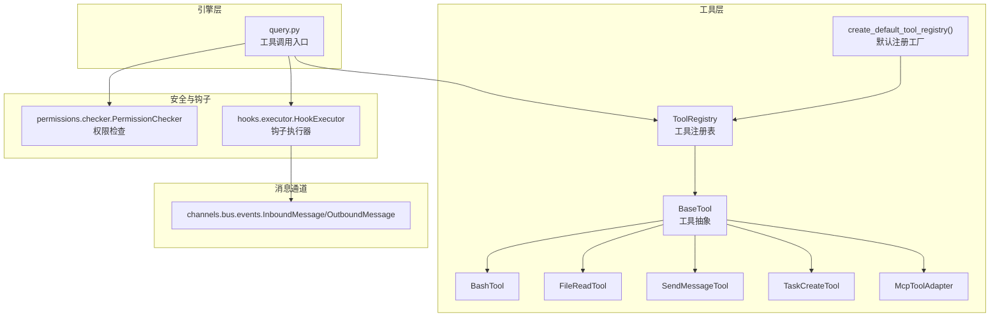
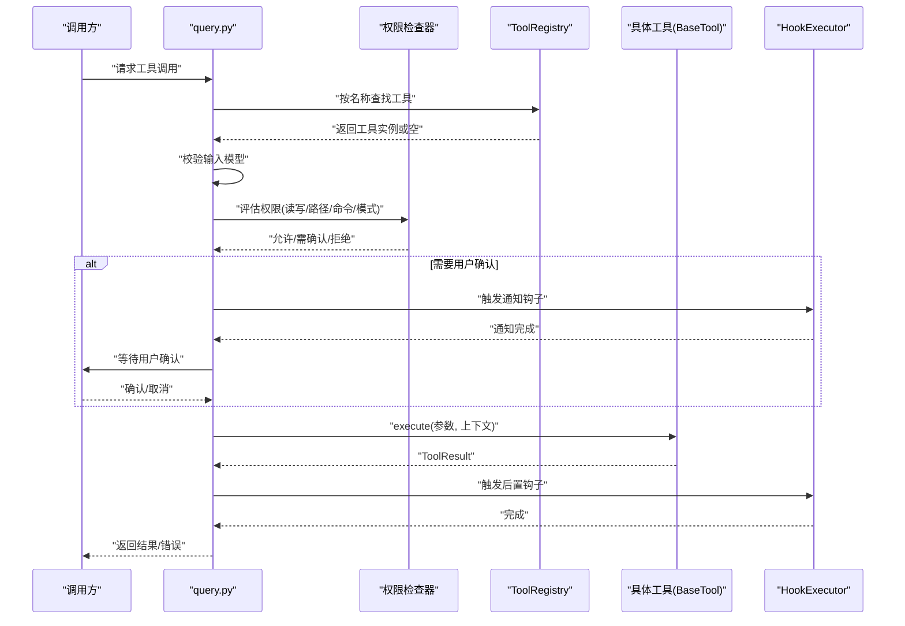
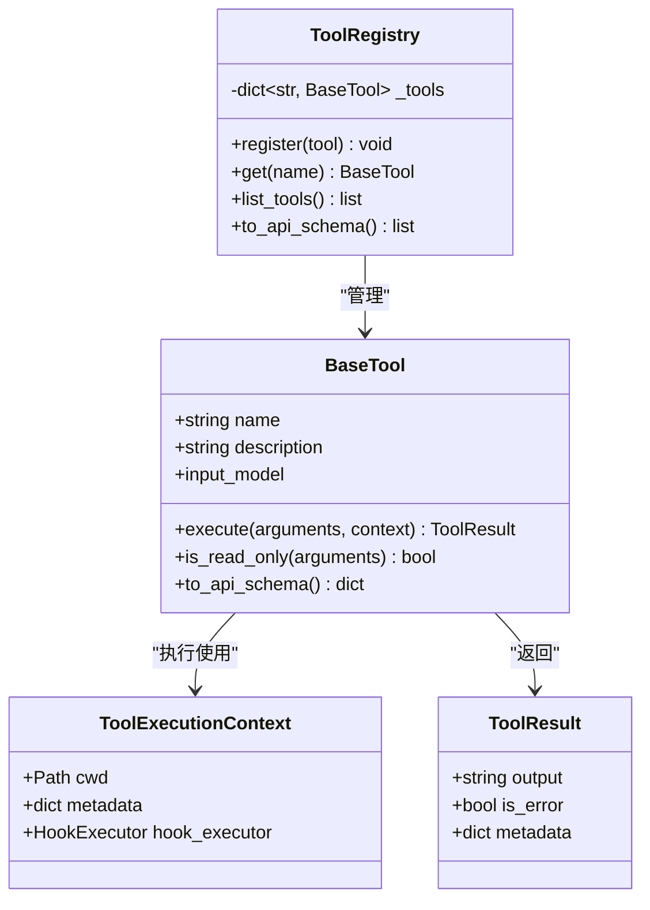
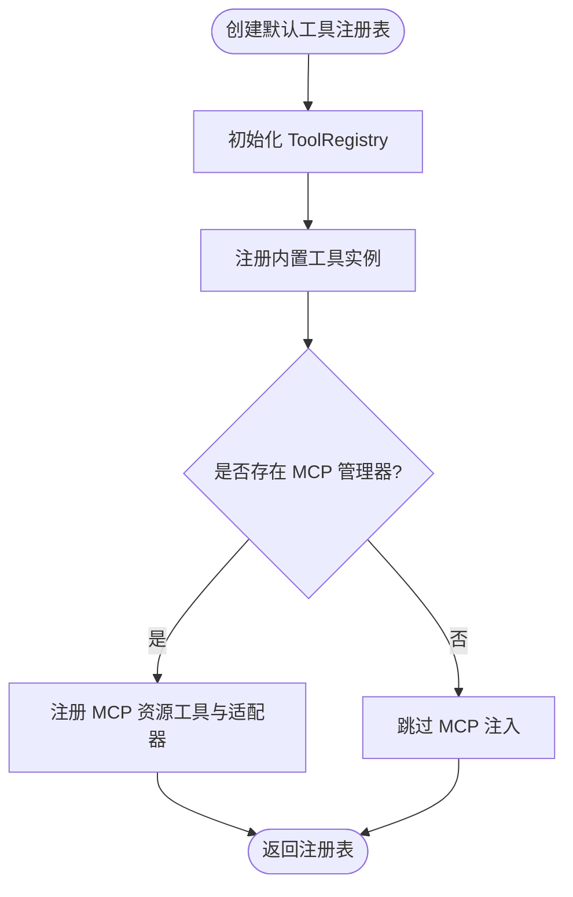
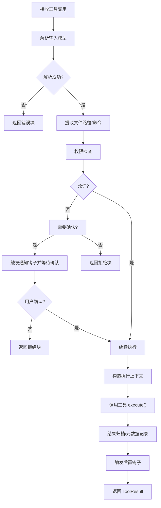
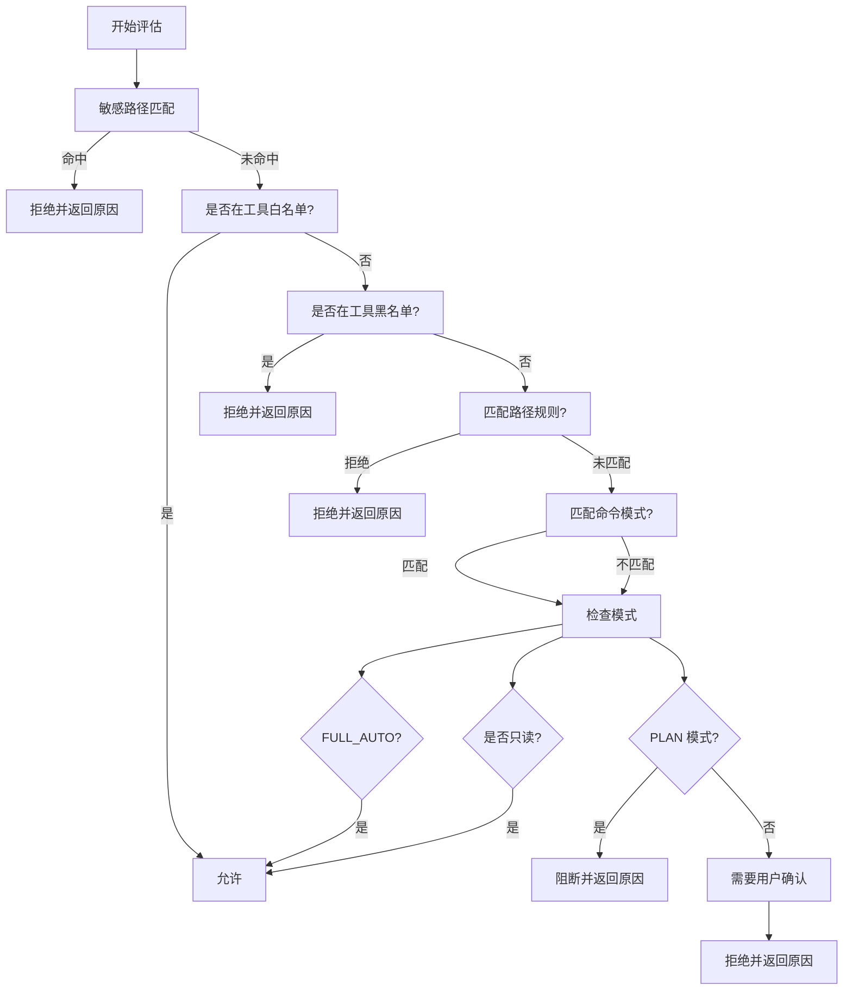
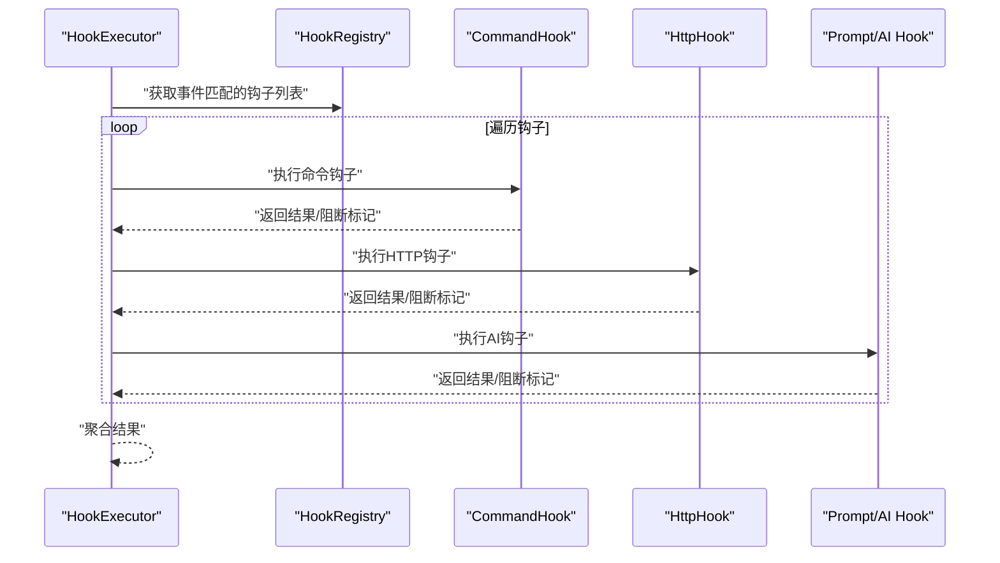
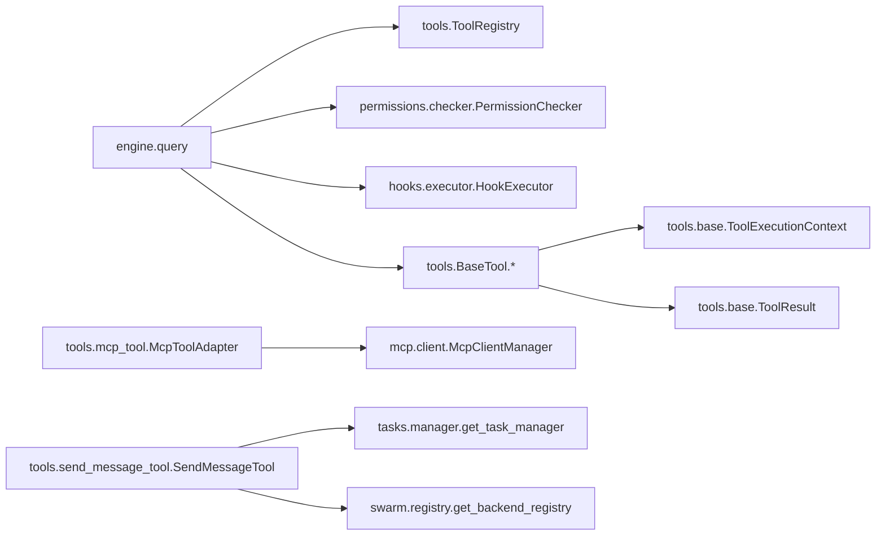

# 工具系统架构

<cite>
**本文引用的文件**
- [src/openharness/tools/base.py](file://src/openharness/tools/base.py)
- [src/openharness/tools/__init__.py](file://src/openharness/tools/__init__.py)
- [src/openharness/engine/query.py](file://src/openharness/engine/query.py)
- [src/openharness/permissions/checker.py](file://src/openharness/permissions/checker.py)
- [src/openharness/hooks/executor.py](file://src/openharness/hooks/executor.py)
- [src/openharness/tools/bash_tool.py](file://src/openharness/tools/bash_tool.py)
- [src/openharness/tools/file_read_tool.py](file://src/openharness/tools/file_read_tool.py)
- [src/openharness/tools/mcp_tool.py](file://src/openharness/tools/mcp_tool.py)
- [src/openharness/tools/send_message_tool.py](file://src/openharness/tools/send_message_tool.py)
- [src/openharness/tools/task_create_tool.py](file://src/openharness/tools/task_create_tool.py)
- [src/openharness/channels/bus/events.py](file://src/openharness/channels/bus/events.py)
- [tests/test_tools/test_core_tools.py](file://tests/test_tools/test_core_tools.py)
- [tests/test_tools/test_integration_flows.py](file://tests/test_tools/test_integration_flows.py)
- [tests/test_mcp/test_http_flow.py](file://tests/test_mcp/test_http_flow.py)
- [tests/test_mcp/test_stdio_flow.py](file://tests/test_mcp/test_stdio_flow.py)
</cite>

## 目录
1. [引言](#引言)
2. [项目结构](#项目结构)
3. [核心组件](#核心组件)
4. [架构总览](#架构总览)
5. [详细组件分析](#详细组件分析)
6. [依赖关系分析](#依赖关系分析)
7. [性能考量](#性能考量)
8. [故障排查指南](#故障排查指南)
9. [结论](#结论)
10. [附录：工具开发指南与最佳实践](#附录工具开发指南与最佳实践)

## 引言
本文件面向 OpenHarness 的工具系统，系统性阐述工具抽象、注册机制、执行流程、权限与消息集成、扩展点与自定义工具开发方法，并通过图示与测试用例路径帮助读者快速理解与落地。

## 项目结构
工具系统位于 openharness.tools 子模块，围绕抽象基类、注册表、默认注册工厂以及若干内置工具实现构成；执行链路由引擎层发起，贯穿权限检查、钩子通知、工具执行与结果归档；权限系统与钩子系统分别负责安全策略与生命周期事件扩展。

图表来源
- [src/openharness/tools/base.py:35-81](file://src/openharness/tools/base.py#L35-L81)
- [src/openharness/tools/__init__.py:48-98](file://src/openharness/tools/__init__.py#L48-L98)
- [src/openharness/engine/query.py:900-1018](file://src/openharness/engine/query.py#L900-L1018)
- [src/openharness/permissions/checker.py:57-156](file://src/openharness/permissions/checker.py#L57-L156)
- [src/openharness/hooks/executor.py:41-243](file://src/openharness/hooks/executor.py#L41-L243)
- [src/openharness/channels/bus/events.py:8-39](file://src/openharness/channels/bus/events.py#L8-L39)

章节来源
- [src/openharness/tools/base.py:1-81](file://src/openharness/tools/base.py#L1-L81)
- [src/openharness/tools/__init__.py:1-108](file://src/openharness/tools/__init__.py#L1-L108)

## 核心组件
- 工具抽象与结果
  - BaseTool：定义工具名称、描述、输入模型、执行接口与只读判定、API 模式导出。
  - ToolResult：标准化输出、错误标记与元数据。
  - ToolExecutionContext：跨工具共享上下文（工作目录、元数据、钩子执行器）。
- 注册表与默认注册
  - ToolRegistry：按名称映射工具实例，支持查询、枚举与 API 模式导出。
  - create_default_tool_registry：集中注册内置工具，必要时注入 MCP 工具适配器。
- 执行与权限
  - 引擎 query.py：解析输入、权限评估、执行工具、结果归档与钩子通知。
  - 权限 checker：敏感路径保护、显式白/黑名单、命令模式匹配、读写与模式控制。
  - 钩子 executor：命令/HTTP/Prompt 类型钩子，事件驱动的前后置处理。
- 消息系统
  - channels.bus.events：入站/出站消息载体，用于与外部渠道对接。

章节来源
- [src/openharness/tools/base.py:17-81](file://src/openharness/tools/base.py#L17-L81)
- [src/openharness/tools/__init__.py:48-98](file://src/openharness/tools/__init__.py#L48-L98)
- [src/openharness/engine/query.py:900-1058](file://src/openharness/engine/query.py#L900-L1058)
- [src/openharness/permissions/checker.py:14-201](file://src/openharness/permissions/checker.py#L14-L201)
- [src/openharness/hooks/executor.py:41-243](file://src/openharness/hooks/executor.py#L41-L243)
- [src/openharness/channels/bus/events.py:8-39](file://src/openharness/channels/bus/events.py#L8-L39)

## 架构总览
下图展示一次工具调用从引擎到工具、权限与钩子的整体交互。

图表来源
- [src/openharness/engine/query.py:900-1018](file://src/openharness/engine/query.py#L900-L1018)
- [src/openharness/permissions/checker.py:75-156](file://src/openharness/permissions/checker.py#L75-L156)
- [src/openharness/hooks/executor.py:64-78](file://src/openharness/hooks/executor.py#L64-L78)

## 详细组件分析

### 组件一：工具抽象与注册表（BaseTool、ToolRegistry）
- 设计要点
  - 抽象接口统一：所有工具必须声明 name/description/input_model，并实现异步 execute。
  - 只读语义：is_read_only 默认返回 False，可被覆盖以表达“只读”工具。
  - API 导出：to_api_schema 输出 Anthropic Messages API 兼容的 schema。
  - 注册表：以名称为键存储工具实例，支持枚举与批量导出。
- 数据结构与复杂度
  - 注册表内部为字典映射，注册/查询均为 O(1)。
  - API 导出遍历所有工具，复杂度 O(N)。
- 错误处理与边界
  - 未找到工具时返回错误块；输入校验失败直接返回错误块。
  - ToolResult 支持 is_error 与 metadata，便于上层记录状态与诊断。

图表来源
- [src/openharness/tools/base.py:17-81](file://src/openharness/tools/base.py#L17-L81)

章节来源
- [src/openharness/tools/base.py:17-81](file://src/openharness/tools/base.py#L17-L81)
- [src/openharness/tools/__init__.py:48-98](file://src/openharness/tools/__init__.py#L48-L98)

### 组件二：默认工具注册工厂（create_default_tool_registry）
- 职责
  - 创建 ToolRegistry 并批量注册内置工具实例。
  - 在存在 MCP 管理器时，动态注册资源列举与读取工具及 MCP 工具适配器。
- 关键行为
  - 顺序注册：覆盖工具集合，确保一致性。
  - MCP 注入：遍历管理器列出的工具信息，生成适配器并注册。

图表来源
- [src/openharness/tools/__init__.py:48-98](file://src/openharness/tools/__init__.py#L48-L98)

章节来源
- [src/openharness/tools/__init__.py:48-98](file://src/openharness/tools/__init__.py#L48-L98)

### 组件三：工具执行流程与权限系统集成（query.py）
- 流程要点
  - 输入解析：使用工具 input_model 进行 Pydantic 校验，失败即返回错误。
  - 路径/命令提取：从原始输入与解析对象中抽取 file_path/command，用于权限评估。
  - 权限评估：调用 PermissionChecker.evaluate，支持敏感路径阻断、显式白/黑名单、命令模式匹配、读写与模式控制。
  - 用户确认：在需要时触发通知钩子并等待用户确认。
  - 执行工具：构造 ToolExecutionContext（携带 registry、钩子执行器、元数据），调用工具 execute。
  - 结果归档：根据输出长度选择内联或落盘，记录携带的元数据与路径。
  - 后置钩子：触发 POST_TOOL_USE 钩子，传递输入/输出/错误标记。
- 性能与可观测性
  - 记录执行耗时与输出长度，便于监控与日志分析。

图表来源
- [src/openharness/engine/query.py:900-1058](file://src/openharness/engine/query.py#L900-L1058)

章节来源
- [src/openharness/engine/query.py:900-1058](file://src/openharness/engine/query.py#L900-L1058)

### 组件四：权限系统（permissions.checker）
- 敏感路径保护
  - 内置敏感路径模式（SSH、AWS、GCP、Azure、GPG、Docker、K8s、OpenHarness 凭据目录）始终阻断。
- 规则体系
  - 显式工具白名单/黑名单。
  - 基于 glob 的路径规则，支持允许/拒绝。
  - 命令模式匹配（如安装/脚手架命令）。
- 模式控制
  - FULL_AUTO：自动放行。
  - PLAN：仅允许只读工具，阻断变更型工具。
  - 默认：只读工具自动放行，变更型工具需确认。
- 提示与理由
  - 对易引发变更的命令给出提示，便于用户理解。

图表来源
- [src/openharness/permissions/checker.py:75-156](file://src/openharness/permissions/checker.py#L75-L156)

章节来源
- [src/openharness/permissions/checker.py:14-201](file://src/openharness/permissions/checker.py#L14-L201)

### 组件五：钩子系统（hooks.executor）
- 功能
  - 命令钩子：在沙箱环境中执行外部命令，收集 stdout/stderr，支持超时与阻断策略。
  - HTTP 钩子：向远端服务发送 JSON 请求，记录状态码与响应。
  - Prompt/Agent 钩子：通过模型判断事件是否满足条件，返回严格 JSON。
- 安全
  - 参数注入时进行 shell 转义，避免注入风险。
  - 失败时可配置阻断策略，保障系统稳定性。
- 与工具执行的协作
  - 在权限确认前触发通知钩子，执行后触发后置钩子，形成闭环。

图表来源
- [src/openharness/hooks/executor.py:64-243](file://src/openharness/hooks/executor.py#L64-L243)

章节来源
- [src/openharness/hooks/executor.py:41-243](file://src/openharness/hooks/executor.py#L41-L243)

### 组件六：典型工具实现与使用模式
- BashTool
  - 功能：在本地仓库执行 shell 命令，捕获 stdout/stderr，支持超时与非交互提示。
  - 关键点：交互式脚手架命令预检、超时处理、输出截断与格式化。
- FileReadTool
  - 功能：UTF-8 文本文件读取，带行号与范围选择。
  - 关键点：沙箱路径校验、二进制检测、目录/文件类型校验。
- McpToolAdapter
  - 功能：将 MCP 服务器工具适配为标准工具，动态构建输入模型。
  - 关键点：名称清洗、JSON 类型映射、必填字段处理。
- SendMessageTool
  - 功能：向本地任务或 Swarm 团队成员发送消息。
  - 关键点：任务 ID 与 agent_id 分支处理、后端路由。
- TaskCreateTool
  - 功能：创建后台任务（本地 shell 或本地 agent）。
  - 关键点：类型分支、必要参数校验、异常转 ToolResult。

章节来源
- [src/openharness/tools/bash_tool.py:19-219](file://src/openharness/tools/bash_tool.py#L19-L219)
- [src/openharness/tools/file_read_tool.py:12-73](file://src/openharness/tools/file_read_tool.py#L12-L73)
- [src/openharness/tools/mcp_tool.py:14-73](file://src/openharness/tools/mcp_tool.py#L14-L73)
- [src/openharness/tools/send_message_tool.py:17-59](file://src/openharness/tools/send_message_tool.py#L17-L59)
- [src/openharness/tools/task_create_tool.py:13-57](file://src/openharness/tools/task_create_tool.py#L13-L57)

## 依赖关系分析
- 组件耦合
  - 引擎 query.py 依赖 ToolRegistry、PermissionChecker、HookExecutor 与工具 input_model。
  - 工具实现依赖 BaseTool 抽象与 ToolExecutionContext。
  - MCP 适配器依赖 MCP 管理器与动态输入模型生成。
- 外部依赖
  - 沙箱与子进程：BashTool 使用沙箱子进程；钩子执行器也使用子进程。
  - 消息通道：Inbound/OutboundMessage 作为消息系统载体。

图表来源
- [src/openharness/engine/query.py:900-1058](file://src/openharness/engine/query.py#L900-L1058)
- [src/openharness/tools/base.py:17-81](file://src/openharness/tools/base.py#L17-L81)
- [src/openharness/tools/mcp_tool.py:9-11](file://src/openharness/tools/mcp_tool.py#L9-L11)
- [src/openharness/tools/send_message_tool.py:9-12](file://src/openharness/tools/send_message_tool.py#L9-L12)

章节来源
- [src/openharness/engine/query.py:900-1058](file://src/openharness/engine/query.py#L900-L1058)
- [src/openharness/tools/base.py:17-81](file://src/openharness/tools/base.py#L17-L81)
- [src/openharness/tools/mcp_tool.py:14-73](file://src/openharness/tools/mcp_tool.py#L14-L73)
- [src/openharness/tools/send_message_tool.py:17-59](file://src/openharness/tools/send_message_tool.py#L17-L59)

## 性能考量
- I/O 与超时
  - BashTool 对子进程设置超时与输出读取超时，避免长时间阻塞。
  - 输出截断与延迟读取减少内存峰值。
- 权限评估
  - 路径/命令匹配采用简单遍历与模式匹配，建议合理配置规则数量与模式复杂度。
- 结果归档
  - 大输出自动落盘并内联提示，降低消息体大小与传输成本。

## 故障排查指南
- 输入校验失败
  - 症状：立即返回错误块，内容包含校验异常。
  - 排查：核对工具 input_model 字段与取值范围。
- 权限被拒
  - 症状：返回拒绝块，可能需要用户确认或调整权限模式。
  - 排查：检查敏感路径、路径规则、命令模式与当前模式。
- 工具不存在
  - 症状：未知工具名错误块。
  - 排查：确认工具已注册或名称拼写正确。
- MCP 工具不可用
  - 症状：连接错误或无可用工具。
  - 排查：检查 MCP 服务器状态与工具清单。
- 钩子执行失败
  - 症状：命令/HTTP/Prompt 钩子返回失败，可能阻断后续流程。
  - 排查：查看返回原因与阻断标记，检查命令/网络/模型配置。

章节来源
- [src/openharness/engine/query.py:900-1058](file://src/openharness/engine/query.py#L900-L1058)
- [src/openharness/permissions/checker.py:75-156](file://src/openharness/permissions/checker.py#L75-L156)
- [src/openharness/hooks/executor.py:80-136](file://src/openharness/hooks/executor.py#L80-L136)

## 结论
OpenHarness 的工具系统以清晰的抽象与注册机制为基础，结合严格的权限检查与灵活的钩子扩展，形成了可演进、可治理、可审计的工具执行框架。内置工具覆盖文件、命令、任务、消息、MCP 等关键场景，适合在多范式工作流中复用与扩展。

## 附录：工具开发指南与最佳实践
- 实现步骤
  - 定义输入模型：使用 Pydantic BaseModel，明确字段与约束。
  - 继承 BaseTool：设置 name/description/input_model，实现 execute。
  - 只读声明：若工具不产生副作用，重写 is_read_only 返回 True。
  - 上下文使用：从 ToolExecutionContext 获取 cwd、metadata、hook_executor。
  - 结果规范：返回 ToolResult，必要时填充 metadata。
- 参数验证
  - 使用 input_model.model_validate 进行输入校验；在工具内部补充业务约束。
  - 对路径类参数进行绝对化与规范化处理，必要时结合沙箱路径校验。
- 执行与安全
  - 对潜在危险命令进行预检与提示，优先使用非交互式标志。
  - 对外部系统调用（HTTP/子进程）设置超时与错误处理。
- 权限与模式
  - 明确工具是否只读；变更型工具在默认模式下需用户确认。
  - 合理配置路径规则与命令模式，避免误伤或绕过。
- 钩子集成
  - 在关键节点触发通知/后置钩子，记录事件与结果。
  - 对命令钩子进行 shell 转义，防止注入。
- 测试与验证
  - 单元测试覆盖输入校验、边界条件与错误路径。
  - 集成测试验证工具在注册表中的可用性与执行链路。

章节来源
- [src/openharness/tools/base.py:35-81](file://src/openharness/tools/base.py#L35-L81)
- [src/openharness/tools/bash_tool.py:34-85](file://src/openharness/tools/bash_tool.py#L34-L85)
- [src/openharness/tools/file_read_tool.py:31-65](file://src/openharness/tools/file_read_tool.py#L31-L65)
- [src/openharness/tools/mcp_tool.py:26-36](file://src/openharness/tools/mcp_tool.py#L26-L36)
- [src/openharness/tools/send_message_tool.py:31-58](file://src/openharness/tools/send_message_tool.py#L31-L58)
- [src/openharness/tools/task_create_tool.py:30-56](file://src/openharness/tools/task_create_tool.py#L30-L56)
- [tests/test_tools/test_core_tools.py:1-200](file://tests/test_tools/test_core_tools.py#L1-L200)
- [tests/test_tools/test_integration_flows.py:103-139](file://tests/test_tools/test_integration_flows.py#L103-L139)
- [tests/test_mcp/test_http_flow.py:74-90](file://tests/test_mcp/test_http_flow.py#L74-L90)
- [tests/test_mcp/test_stdio_flow.py:39-54](file://tests/test_mcp/test_stdio_flow.py#L39-L54)