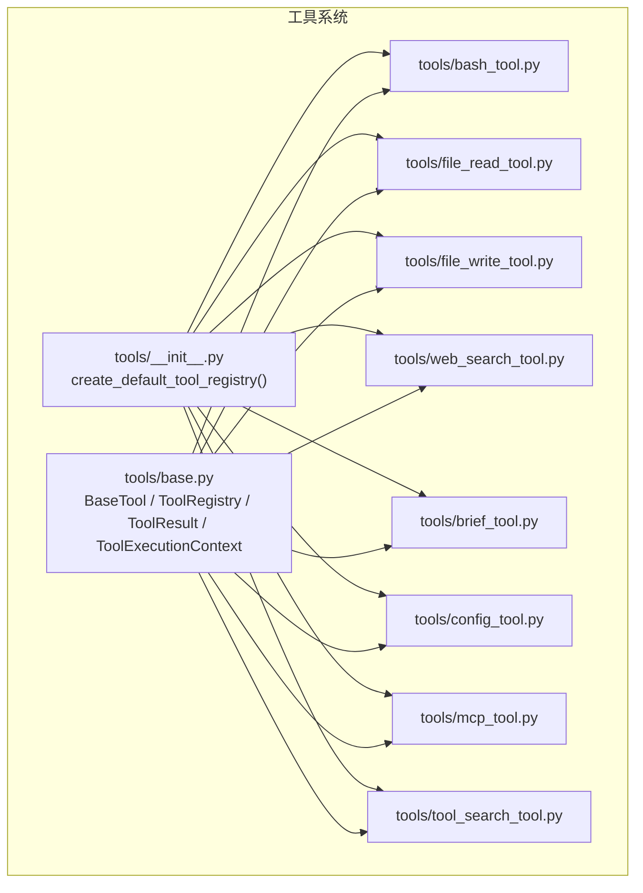
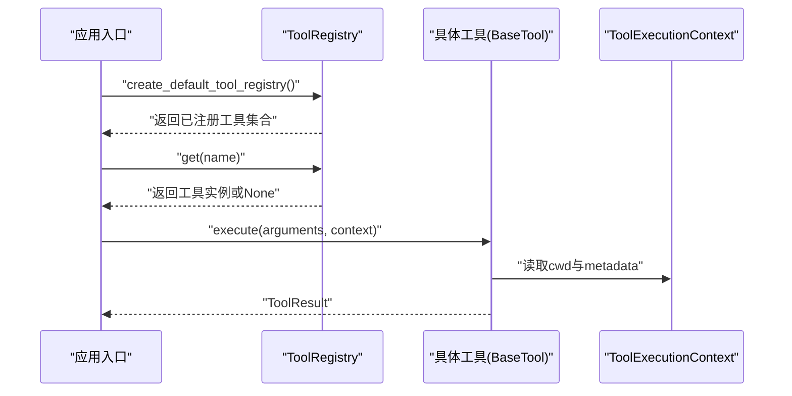
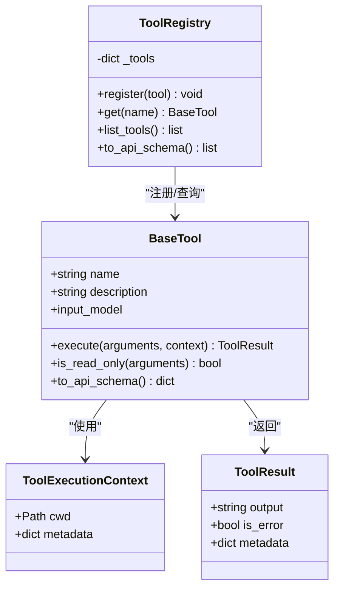
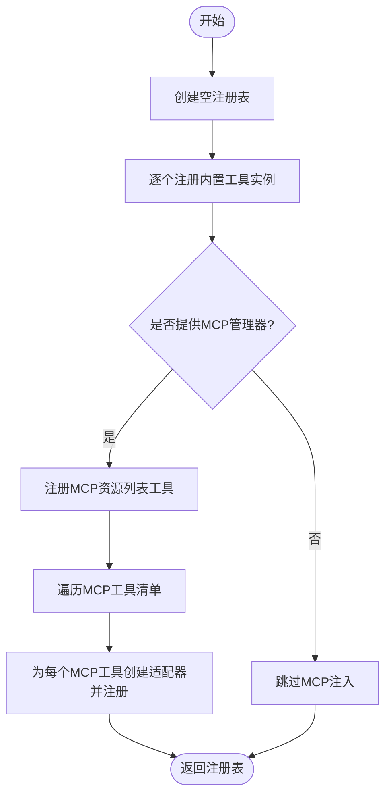
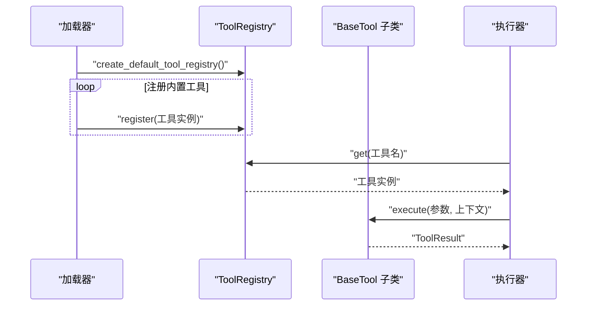
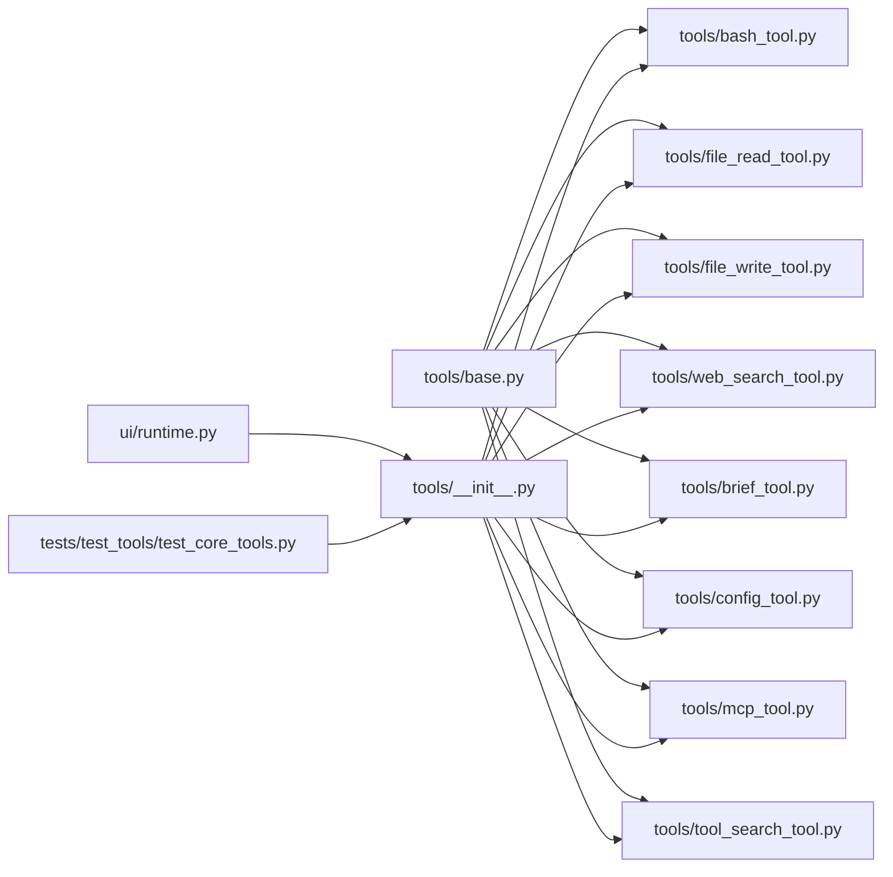

# 工具系统架构

<cite>
**本文引用的文件**
- [tools/__init__.py](file://src/openharness/tools/__init__.py)
- [tools/base.py](file://src/openharness/tools/base.py)
- [tools/brief_tool.py](file://src/openharness/tools/brief_tool.py)
- [tools/config_tool.py](file://src/openharness/tools/config_tool.py)
- [tools/bash_tool.py](file://src/openharness/tools/bash_tool.py)
- [tools/file_read_tool.py](file://src/openharness/tools/file_read_tool.py)
- [tools/file_write_tool.py](file://src/openharness/tools/file_write_tool.py)
- [tools/web_search_tool.py](file://src/openharness/tools/web_search_tool.py)
- [tools/mcp_tool.py](file://src/openharness/tools/mcp_tool.py)
- [tools/tool_search_tool.py](file://src/openharness/tools/tool_search_tool.py)
- [plugins/types.py](file://src/openharness/plugins/types.py)
- [skills/types.py](file://src/openharness/skills/types.py)
- [ui/runtime.py](file://src/openharness/ui/runtime.py)
- [tests/test_tools/test_core_tools.py](file://tests/test_tools/test_core_tools.py)
</cite>

## 目录
1. [引言](#引言)
2. [项目结构](#项目结构)
3. [核心组件](#核心组件)
4. [架构总览](#架构总览)
5. [详细组件分析](#详细组件分析)
6. [依赖分析](#依赖分析)
7. [性能考虑](#性能考虑)
8. [故障排查指南](#故障排查指南)
9. [结论](#结论)
10. [附录：最佳实践与扩展指南](#附录最佳实践与扩展指南)

## 引言
本文件系统化梳理 OpenHarness 的工具系统架构，围绕以下主题展开：
- 工具基类设计与接口规范
- 注册表机制与生命周期管理
- 输入验证体系与输出格式标准化
- 工具发现、加载与实例化流程
- 工具元数据管理与版本兼容策略
- 自定义工具开发与集成实践

目标是帮助开发者快速理解工具系统的运行机制，并安全高效地扩展新工具。

## 项目结构
工具系统主要位于 src/openharness/tools 目录，核心包括：
- 基类与注册表：base.py
- 内置工具实现：bash、file_*、web_search、brief、config、mcp 适配器等
- 默认注册表构建：tools/__init__.py
- 使用示例与集成点：ui/runtime.py、tests/test_tools/test_core_tools.py 等

图表来源
- [tools/base.py:1-76](file://src/openharness/tools/base.py#L1-L76)
- [tools/__init__.py:45-92](file://src/openharness/tools/__init__.py#L45-L92)

章节来源
- [tools/__init__.py:1-102](file://src/openharness/tools/__init__.py#L1-L102)
- [tools/base.py:1-76](file://src/openharness/tools/base.py#L1-L76)

## 核心组件
- 工具基类 BaseTool：定义统一的工具接口（名称、描述、输入模型、执行方法），并提供只读判定与 API 模式导出能力。
- 执行上下文 ToolExecutionContext：封装工作目录与通用元数据，贯穿工具调用链。
- 结果模型 ToolResult：标准化输出文本、错误标记与附加元数据。
- 注册表 ToolRegistry：以名称映射到工具实例，支持查询、列举与 API 模式导出。

这些组件共同构成工具系统的“契约层”，确保所有工具在统一抽象下运行。

章节来源
- [tools/base.py:13-76](file://src/openharness/tools/base.py#L13-L76)

## 架构总览
工具系统采用“基类 + 注册表 + 默认装配”的模式：
- 基类定义接口与行为约定
- 注册表负责工具发现与分发
- 默认装配函数集中创建内置工具集合，并可按需注入外部能力（如 MCP）

图表来源
- [tools/__init__.py:45-92](file://src/openharness/tools/__init__.py#L45-L92)
- [tools/base.py:55-76](file://src/openharness/tools/base.py#L55-L76)

## 详细组件分析

### 基类与注册表：BaseTool、ToolExecutionContext、ToolResult、ToolRegistry
- BaseTool
  - 必须实现 name/description/input_model 与 execute 方法
  - 可选覆盖 is_read_only 以声明是否只读
  - 提供 to_api_schema 将自身转换为 API 规范所需的模式字典
- ToolExecutionContext
  - 包含 cwd 与 metadata 字段，便于工具按需访问工作目录与上下文信息
- ToolResult
  - 统一输出文本、错误标志与元数据，便于上层消费与日志记录
- ToolRegistry
  - 提供 register/get/list_tools/to_api_schema 等能力，支撑工具发现与导出

图表来源
- [tools/base.py:13-76](file://src/openharness/tools/base.py#L13-L76)

章节来源
- [tools/base.py:13-76](file://src/openharness/tools/base.py#L13-L76)

### 默认注册表与工具装配：create_default_tool_registry
- 负责创建默认工具集合，批量注册内置工具
- 支持传入 MCP 管理器，动态注入 MCP 资源列表与工具适配器
- 返回完整的 ToolRegistry 实例，供上层直接使用

图表来源
- [tools/__init__.py:45-92](file://src/openharness/tools/__init__.py#L45-L92)

章节来源
- [tools/__init__.py:45-92](file://src/openharness/tools/__init__.py#L45-L92)

### 典型工具实现与输入验证

#### Bash 工具：命令执行与超时控制
- 输入模型包含命令、工作目录覆盖与超时秒数
- 异步子进程执行，捕获标准输出与错误输出
- 超时处理与截断策略，返回 ToolResult 并携带退出码元数据

章节来源
- [tools/bash_tool.py:13-70](file://src/openharness/tools/bash_tool.py#L13-L70)

#### 文件读写工具：路径解析与内容读取
- 输入模型包含路径、偏移行号、行数限制（读）
- 输入模型包含路径、内容、是否自动创建目录（写）
- 路径解析遵循 cwd 与用户家目录展开规则
- 读取工具声明为只读；写入工具更新文件内容

章节来源
- [tools/file_read_tool.py:12-63](file://src/openharness/tools/file_read_tool.py#L12-L63)
- [tools/file_write_tool.py:12-44](file://src/openharness/tools/file_write_tool.py#L12-L44)

#### 简报工具：文本截断与只读特性
- 输入模型包含原文与最大字符数
- is_read_only 显式声明为只读
- 输出为截断后的文本，末尾追加省略号

章节来源
- [tools/brief_tool.py:10-34](file://src/openharness/tools/brief_tool.py#L10-L34)

#### 配置工具：设置读取与更新
- 输入模型包含动作（显示/设置）、键名与值
- 通过设置模块进行读取与保存
- 设置未知键时返回错误结果

章节来源
- [tools/config_tool.py:11-38](file://src/openharness/tools/config_tool.py#L11-L38)

#### Web 搜索工具：网络请求与结果解析
- 输入模型包含查询词、最大结果数与可选搜索端点
- 异步 HTTP 客户端发起请求，解析 HTML 结果并抽取标题、URL、摘要
- 输出为结构化文本，声明为只读

章节来源
- [tools/web_search_tool.py:15-118](file://src/openharness/tools/web_search_tool.py#L15-L118)

#### MCP 工具适配器：动态暴露外部工具
- 从 MCP 工具清单生成输入模型（基于 JSON Schema）
- 名称规范化，避免非法字符
- 调用时转发参数至 MCP 管理器并返回结果

章节来源
- [tools/mcp_tool.py:14-56](file://src/openharness/tools/mcp_tool.py#L14-L56)

#### 工具检索工具：基于上下文的搜索
- 从 ToolExecutionContext.metadata 中读取 ToolRegistry
- 对工具名称与描述进行大小写不敏感匹配
- 输出匹配列表或提示无匹配

章节来源
- [tools/tool_search_tool.py:10-39](file://src/openharness/tools/tool_search_tool.py#L10-L39)

### 工具发现、加载与实例化流程
- 发现：通过 create_default_tool_registry 统一收集内置工具
- 加载：将工具实例注册到 ToolRegistry
- 实例化：根据名称从注册表获取工具实例
- 执行：调用工具 execute，传入参数模型与执行上下文

图表来源
- [tools/__init__.py:45-92](file://src/openharness/tools/__init__.py#L45-L92)
- [tools/base.py:55-76](file://src/openharness/tools/base.py#L55-L76)

## 依赖分析
- 工具基类与注册表位于 tools/base.py，被所有具体工具依赖
- 默认注册表装配函数位于 tools/__init__.py，被 UI 运行时与测试用例广泛使用
- MCP 适配器依赖 MCP 客户端与类型定义，用于动态暴露外部工具
- 插件与技能类型定义位于 plugins/types.py 与 skills/types.py，为工具生态提供扩展载体

图表来源
- [tools/base.py:1-76](file://src/openharness/tools/base.py#L1-L76)
- [tools/__init__.py:1-102](file://src/openharness/tools/__init__.py#L1-L102)
- [ui/runtime.py:114](file://src/openharness/ui/runtime.py#L114)
- [tests/test_tools/test_core_tools.py:30](file://tests/test_tools/test_core_tools.py#L30)

章节来源
- [plugins/types.py:14-33](file://src/openharness/plugins/types.py#L14-L33)
- [skills/types.py:8-17](file://src/openharness/skills/types.py#L8-L17)

## 性能考虑
- I/O 密集工具（文件读写、Web 搜索）建议：
  - 控制单次输出长度，必要时进行截断
  - 合理设置超时时间，避免阻塞
- CPU 密集工具（如正则解析）建议：
  - 使用异步客户端与并发策略
  - 缓存热点结果，减少重复计算
- 注册表查询：
  - 名称映射查找为 O(1)，注册表规模增长时仍保持高效

## 故障排查指南
- 工具未找到
  - 检查是否正确注册到 ToolRegistry
  - 确认名称拼写与大小写
- 执行失败
  - 查看 ToolResult.is_error 与输出文本
  - 检查上下文 cwd 是否正确
- MCP 工具异常
  - 确认 MCP 管理器状态与工具清单可用
  - 检查输入模型与 JSON Schema 映射
- 配置工具报错
  - 确认键名存在且值类型符合预期

章节来源
- [tools/bash_tool.py:28-70](file://src/openharness/tools/bash_tool.py#L28-L70)
- [tools/mcp_tool.py:26-33](file://src/openharness/tools/mcp_tool.py#L26-L33)
- [tools/config_tool.py:26-38](file://src/openharness/tools/config_tool.py#L26-L38)

## 结论
OpenHarness 的工具系统以清晰的基类抽象、稳定的注册表机制与可扩展的装配流程为核心，既保证了内置工具的一致性与易用性，也为外部能力（如 MCP）提供了无缝接入点。通过统一的输入验证与输出格式，系统实现了跨工具的互操作与可观测性。

## 附录：最佳实践与扩展指南

### 工具开发最佳实践
- 输入验证
  - 使用 Pydantic 模型定义输入字段与约束（范围、必填、默认值）
  - 在 execute 中先校验参数，再执行业务逻辑
- 只读声明
  - 对不修改持久状态的工具显式覆盖 is_read_only 返回 True
- 输出标准化
  - 使用 ToolResult 返回统一格式文本，必要时在 metadata 中附加结构化信息
- 错误处理
  - 将错误信息写入 output，并设置 is_error=True
  - 对外部依赖（网络、进程）设置合理超时与重试策略
- 名称与描述
  - 工具名称应简洁唯一，描述应准确反映功能与副作用

### 生命周期管理
- 创建：在 create_default_tool_registry 或自定义装配函数中注册工具实例
- 查询：通过 ToolRegistry.get(name) 获取工具
- 执行：构造 ToolExecutionContext（包含 cwd 与 metadata），调用 execute
- 卸载：当前实现未提供卸载接口，建议通过重新创建注册表或隔离作用域实现“卸载”效果

### 版本兼容性处理
- 输入模型演进
  - 新增字段建议设为可选并提供默认值，避免破坏既有调用
  - 严格控制字段类型与约束，防止运行期校验失败
- 输出格式
  - 保持 ToolResult 的结构稳定，避免破坏上层解析
- 接口稳定性
  - 不要删除或重命名现有工具名称与描述
  - 如需变更，提供迁移指引并在后续版本中逐步淘汰旧版本

### 自定义工具创建与集成步骤
- 定义输入模型
  - 基于 Pydantic BaseModel，明确字段含义与约束
- 实现工具类
  - 继承 BaseTool，设置 name/description/input_model
  - 实现 execute，必要时覆盖 is_read_only
- 注册工具
  - 在 create_default_tool_registry 中添加实例
  - 或在自定义装配函数中注册
- 测试与验证
  - 编写单元测试，覆盖正常路径与边界条件
  - 使用 ToolExecutionContext 模拟不同 cwd 与 metadata 场景

章节来源
- [tools/base.py:30-53](file://src/openharness/tools/base.py#L30-L53)
- [tools/__init__.py:45-92](file://src/openharness/tools/__init__.py#L45-L92)
- [tests/test_tools/test_core_tools.py:33-248](file://tests/test_tools/test_core_tools.py#L33-L248)