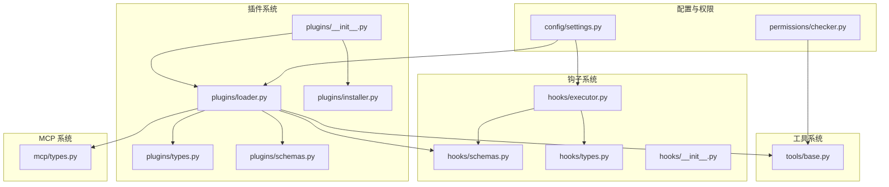
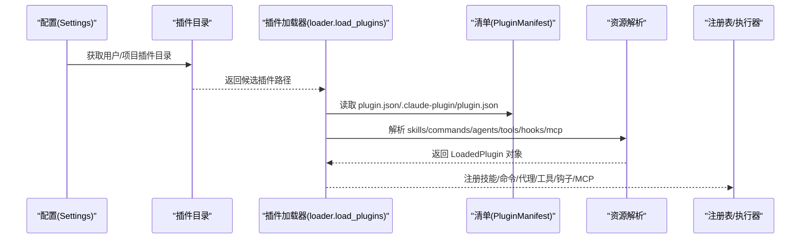
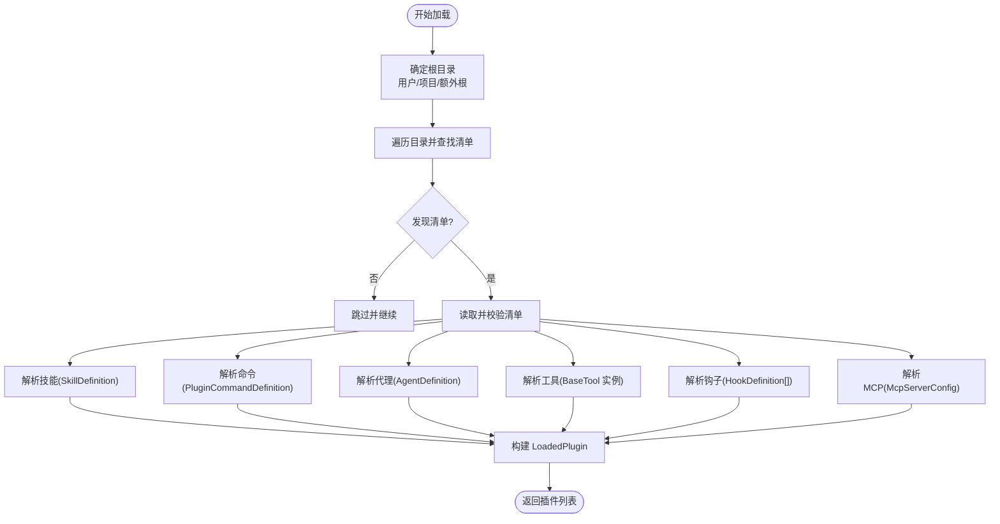
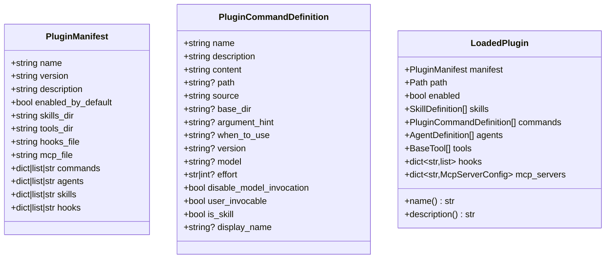
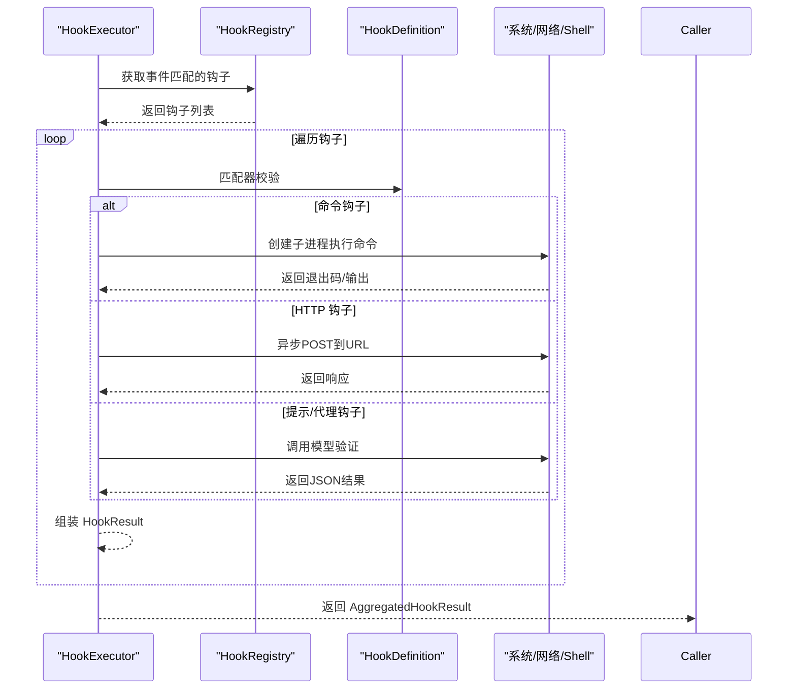
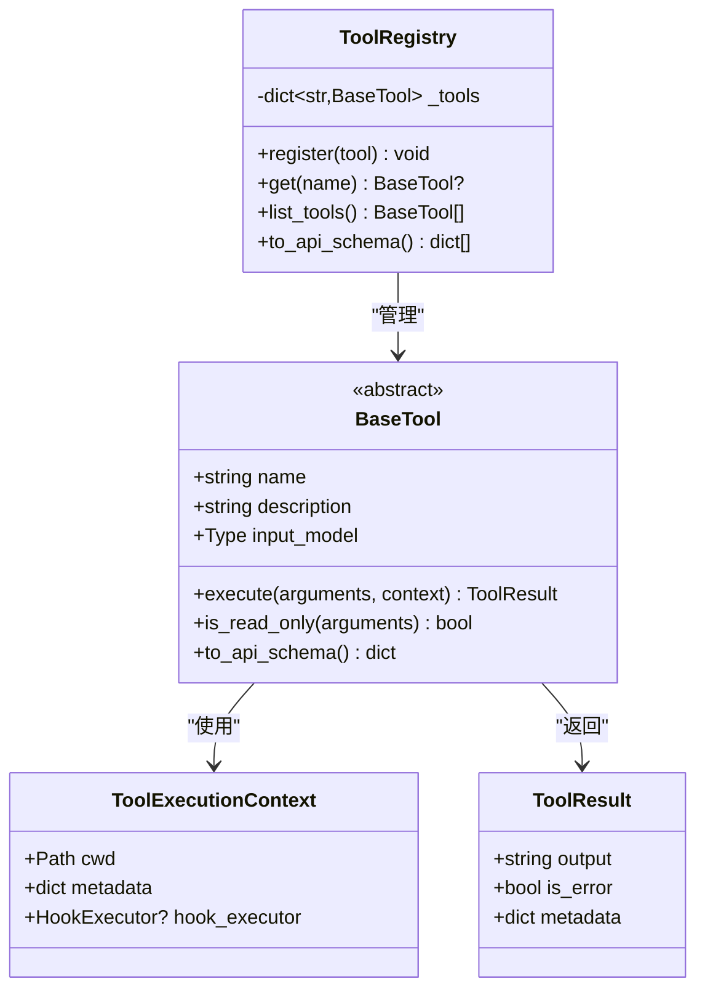
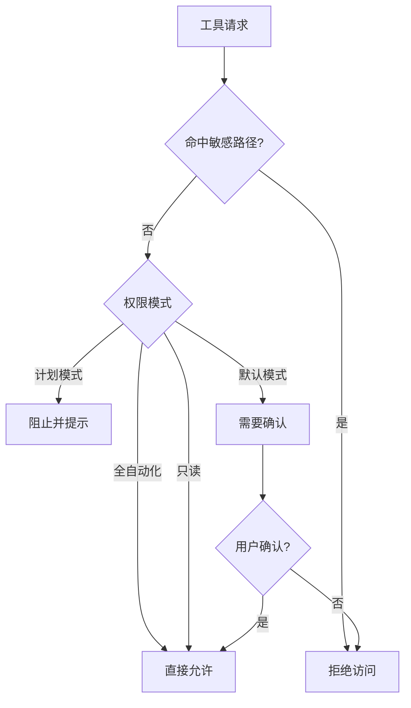
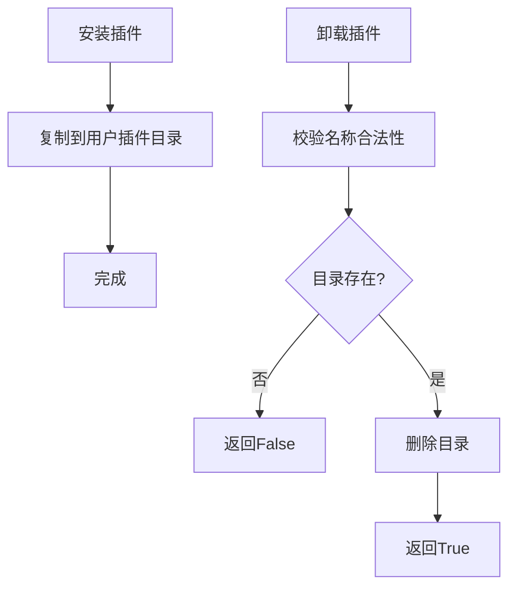
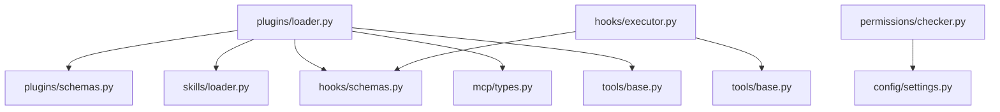

# 插件系统设计

<cite>
**本文档引用的文件**
- [plugins/__init__.py](file://src/openharness/plugins/__init__.py)
- [plugins/loader.py](file://src/openharness/plugins/loader.py)
- [plugins/types.py](file://src/openharness/plugins/types.py)
- [plugins/schemas.py](file://src/openharness/plugins/schemas.py)
- [plugins/installer.py](file://src/openharness/plugins/installer.py)
- [hooks/__init__.py](file://src/openharness/hooks/__init__.py)
- [hooks/types.py](file://src/openharness/hooks/types.py)
- [hooks/schemas.py](file://src/openharness/hooks/schemas.py)
- [hooks/executor.py](file://src/openharness/hooks/executor.py)
- [tools/base.py](file://src/openharness/tools/base.py)
- [mcp/types.py](file://src/openharness/mcp/types.py)
- [config/settings.py](file://src/openharness/config/settings.py)
- [permissions/checker.py](file://src/openharness/permissions/checker.py)
- [test_plugins/test_loader.py](file://tests/test_plugins/test_loader.py)
- [test_plugins/test_lifecycle_flow.py](file://tests/test_plugins/test_lifecycle_flow.py)
</cite>

## 目录
1. [简介](#简介)
2. [项目结构](#项目结构)
3. [核心组件](#核心组件)
4. [架构总览](#架构总览)
5. [详细组件分析](#详细组件分析)
6. [依赖关系分析](#依赖关系分析)
7. [性能考虑](#性能考虑)
8. [故障排除指南](#故障排除指南)
9. [结论](#结论)
10. [附录](#附录)

## 简介
本文件面向 OpenHarness 的插件系统，提供从架构设计到实现细节的完整技术文档。重点覆盖以下方面：
- 插件发现与加载机制（用户插件目录、项目插件目录、清单文件解析）
- 生命周期管理（安装、加载、卸载）
- 钩子系统（事件驱动、命令/HTTP/Prompt/Agent 四类钩子）
- 工具插件、技能插件、代理插件、钩子插件、MCP 插件的集成方式
- 安全机制与权限控制
- 开发指南与最佳实践

## 项目结构
OpenHarness 插件系统主要位于 src/openharness/plugins 及其相关模块中，并与钩子系统、工具系统、MCP 系统、权限系统协同工作。

**图表来源**
- [plugins/__init__.py:1-54](file://src/openharness/plugins/__init__.py#L1-L54)
- [plugins/loader.py:1-731](file://src/openharness/plugins/loader.py#L1-L731)
- [hooks/executor.py:1-243](file://src/openharness/hooks/executor.py#L1-L243)
- [tools/base.py:1-81](file://src/openharness/tools/base.py#L1-L81)
- [mcp/types.py:1-77](file://src/openharness/mcp/types.py#L1-L77)
- [config/settings.py:534-580](file://src/openharness/config/settings.py#L534-L580)
- [permissions/checker.py:1-201](file://src/openharness/permissions/checker.py#L1-L201)

**章节来源**
- [plugins/__init__.py:1-54](file://src/openharness/plugins/__init__.py#L1-L54)
- [plugins/loader.py:36-124](file://src/openharness/plugins/loader.py#L36-L124)
- [config/settings.py:534-580](file://src/openharness/config/settings.py#L534-L580)

## 核心组件
- 插件清单模型：定义插件元数据与默认目录布局
- 插件运行时类型：封装已加载插件及其贡献内容（技能、命令、代理、工具、钩子、MCP）
- 插件加载器：负责发现与加载插件，解析清单与各类资源
- 插件安装器：提供安装/卸载能力
- 钩子执行器：按事件类型执行命令/HTTP/Prompt/Agent 钩子
- 工具基类：统一工具接口与注册表
- MCP 类型：标准化 MCP 服务器配置
- 权限检查器：对工具调用进行策略评估

**章节来源**
- [plugins/schemas.py:8-25](file://src/openharness/plugins/schemas.py#L8-L25)
- [plugins/types.py:18-60](file://src/openharness/plugins/types.py#L18-L60)
- [plugins/loader.py:107-162](file://src/openharness/plugins/loader.py#L107-L162)
- [plugins/installer.py:23-40](file://src/openharness/plugins/installer.py#L23-L40)
- [hooks/executor.py:41-243](file://src/openharness/hooks/executor.py#L41-L243)
- [tools/base.py:35-81](file://src/openharness/tools/base.py#L35-L81)
- [mcp/types.py:40-77](file://src/openharness/mcp/types.py#L40-L77)
- [permissions/checker.py:57-156](file://src/openharness/permissions/checker.py#L57-L156)

## 架构总览
插件系统采用“清单驱动 + 资源发现”的模式。加载流程如下：
- 解析用户与项目插件根目录
- 发现并读取 plugin.json 或 .claude-plugin/plugin.json
- 按清单字段定位 skills_dir、tools_dir、hooks_file、mcp_file
- 解析技能、命令、代理、工具、钩子、MCP 配置
- 将插件贡献内容合并到全局注册表

**图表来源**
- [plugins/loader.py:107-162](file://src/openharness/plugins/loader.py#L107-L162)
- [plugins/schemas.py:8-25](file://src/openharness/plugins/schemas.py#L8-L25)
- [config/settings.py:557-563](file://src/openharness/config/settings.py#L557-L563)

## 详细组件分析

### 插件发现与加载
- 目录发现：支持用户级与项目级插件目录，默认路径分别为配置目录下的 plugins 与工作区 .openharness/plugins
- 清单发现：优先查找 plugin.json；也兼容 .claude-plugin/plugin.json
- 加载策略：根据 Settings 中 allow_project_plugins 控制是否允许加载项目插件；默认禁用项目插件以提升安全性
- 资源解析：
  - 技能：遵循 Claude Code 的 SKILL.md 布局，支持直接在 skills_dir 下或子目录下
  - 命令：支持 commands 目录扫描与 manifest.commands 显式声明
  - 代理：agents 目录下按层级命名生成代理名称
  - 工具：tools 目录下动态导入 Python 模块，实例化 BaseTool 子类
  - 钩子：hooks.json 或 hooks/hooks.json 结构化格式
  - MCP：mcp.json 或 .mcp.json，标准化为 McpServerConfig

**图表来源**
- [plugins/loader.py:61-162](file://src/openharness/plugins/loader.py#L61-L162)
- [plugins/loader.py:251-307](file://src/openharness/plugins/loader.py#L251-L307)
- [plugins/loader.py:320-476](file://src/openharness/plugins/loader.py#L320-L476)
- [plugins/loader.py:479-618](file://src/openharness/plugins/loader.py#L479-L618)
- [plugins/loader.py:691-730](file://src/openharness/plugins/loader.py#L691-L730)
- [plugins/loader.py:621-677](file://src/openharness/plugins/loader.py#L621-L677)
- [plugins/loader.py:680-688](file://src/openharness/plugins/loader.py#L680-L688)

**章节来源**
- [plugins/loader.py:61-124](file://src/openharness/plugins/loader.py#L61-L124)
- [plugins/loader.py:126-162](file://src/openharness/plugins/loader.py#L126-L162)
- [plugins/loader.py:251-307](file://src/openharness/plugins/loader.py#L251-L307)
- [plugins/loader.py:320-476](file://src/openharness/plugins/loader.py#L320-L476)
- [plugins/loader.py:479-618](file://src/openharness/plugins/loader.py#L479-L618)
- [plugins/loader.py:621-677](file://src/openharness/plugins/loader.py#L621-L677)
- [plugins/loader.py:680-688](file://src/openharness/plugins/loader.py#L680-L688)
- [plugins/loader.py:691-730](file://src/openharness/plugins/loader.py#L691-L730)

### 插件清单与运行时类型
- 清单字段：name、version、description、enabled_by_default、skills_dir、tools_dir、hooks_file、mcp_file，以及 commands/agents/skills/hooks 等扩展字段
- 运行时类型：LoadedPlugin 聚合了清单、路径、启用状态与各资源集合；PluginCommandDefinition 描述插件命令

**图表来源**
- [plugins/schemas.py:8-25](file://src/openharness/plugins/schemas.py#L8-L25)
- [plugins/types.py:19-60](file://src/openharness/plugins/types.py#L19-L60)

**章节来源**
- [plugins/schemas.py:8-25](file://src/openharness/plugins/schemas.py#L8-L25)
- [plugins/types.py:18-60](file://src/openharness/plugins/types.py#L18-L60)

### 钩子系统
- 钩子类型：命令钩子、HTTP 钩子、提示验证钩子、代理验证钩子
- 执行器：根据事件类型选择对应执行逻辑，支持超时、阻断失败、环境注入
- 匹配器：支持基于工具名/提示/event 的通配匹配
- 结果聚合：统一返回 HookResult 列表，支持阻断判断与原因提取

**图表来源**
- [hooks/executor.py:64-212](file://src/openharness/hooks/executor.py#L64-L212)
- [hooks/schemas.py:10-58](file://src/openharness/hooks/schemas.py#L10-L58)
- [hooks/types.py:9-39](file://src/openharness/hooks/types.py#L9-L39)

**章节来源**
- [hooks/executor.py:41-243](file://src/openharness/hooks/executor.py#L41-L243)
- [hooks/schemas.py:10-58](file://src/openharness/hooks/schemas.py#L10-L58)
- [hooks/types.py:9-39](file://src/openharness/hooks/types.py#L9-L39)

### 工具插件与注册
- 工具基类：统一 execute 接口、输入模型、只读判定、API Schema 导出
- 工具注册：ToolRegistry 提供名称到实例映射
- 插件工具加载：在 tools_dir 下扫描 .py 文件，动态导入并实例化 BaseTool 子类

**图表来源**
- [tools/base.py:35-81](file://src/openharness/tools/base.py#L35-L81)

**章节来源**
- [tools/base.py:17-81](file://src/openharness/tools/base.py#L17-L81)
- [plugins/loader.py:691-730](file://src/openharness/plugins/loader.py#L691-L730)

### MCP 插件集成
- 配置文件：mcp.json/.mcp.json，标准化为 McpServerConfig
- 运行时：通过 McpClientManager 连接并暴露工具/资源

**图表来源**
- [plugins/loader.py:680-688](file://src/openharness/plugins/loader.py#L680-L688)
- [mcp/types.py:40-77](file://src/openharness/mcp/types.py#L40-L77)

**章节来源**
- [plugins/loader.py:680-688](file://src/openharness/plugins/loader.py#L680-L688)
- [mcp/types.py:40-77](file://src/openharness/mcp/types.py#L40-L77)

### 安全与权限控制
- 项目插件默认禁用：防止不受信任代码在工作区自动执行
- 敏感路径保护：内置敏感路径白名单，拒绝访问
- 权限模式：全自动化、计划模式、默认模式（需确认）
- 工具只读豁免：只读工具可直接放行
- 命令模式匹配：对高风险命令进行模式匹配与提示

**图表来源**
- [permissions/checker.py:88-156](file://src/openharness/permissions/checker.py#L88-L156)
- [config/settings.py:554-558](file://src/openharness/config/settings.py#L554-L558)

**章节来源**
- [permissions/checker.py:57-156](file://src/openharness/permissions/checker.py#L57-L156)
- [config/settings.py:554-558](file://src/openharness/config/settings.py#L554-L558)

### 插件安装与卸载
- 安装：将源插件目录复制到用户插件根目录
- 卸载：校验名称合法性，删除对应子目录
- 安全性：禁止路径穿越，确保仅操作用户插件根目录

**图表来源**
- [plugins/installer.py:23-40](file://src/openharness/plugins/installer.py#L23-L40)

**章节来源**
- [plugins/installer.py:11-40](file://src/openharness/plugins/installer.py#L11-L40)

## 依赖关系分析
- 插件加载器依赖：
  - 清单模型（Pydantic）
  - 技能解析器（技能加载）
  - 钩子模式（钩子定义）
  - MCP 类型（MCP 配置）
  - 工具基类（工具实例化）
- 钩子执行器依赖：
  - 钩子模式
  - 工具上下文（cwd、模型）
  - Shell 工具（子进程）
  - HTTP 客户端（异步）
- 权限检查器依赖：
  - 配置中的权限设置
  - 路径规则与命令模式

**图表来源**
- [plugins/loader.py:28-31](file://src/openharness/plugins/loader.py#L28-L31)
- [hooks/executor.py:16-26](file://src/openharness/hooks/executor.py#L16-L26)
- [permissions/checker.py:9](file://src/openharness/permissions/checker.py#L9)

**章节来源**
- [plugins/loader.py:28-31](file://src/openharness/plugins/loader.py#L28-L31)
- [hooks/executor.py:16-26](file://src/openharness/hooks/executor.py#L16-L26)
- [permissions/checker.py:9](file://src/openharness/permissions/checker.py#L9)

## 性能考虑
- 动态导入工具模块：仅在启用插件时加载工具，避免不必要的模块初始化
- 并发执行钩子：HTTP/模型验证使用异步客户端，减少阻塞
- 超时控制：命令钩子与 HTTP/模型钩子均设置超时，防止长时间阻塞
- 资源扫描：命令/技能/代理扫描采用深度优先遍历，注意大目录的 IO 成本

[本节为通用指导，无需具体文件分析]

## 故障排除指南
- 项目插件未加载
  - 现象：工作区 .openharness/plugins 下的插件未被加载
  - 原因：Settings.allow_project_plugins 默认为 False
  - 处理：在信任的工作区中设置 allow_project_plugins=true
- 插件工具未导入
  - 现象：插件启用但工具列表为空
  - 原因：插件被显式禁用或工具模块导入/实例化失败
  - 处理：检查 enabled_by_default 与工具类构造
- 钩子执行失败
  - 现象：命令/HTTP/模型钩子失败或超时
  - 原因：命令不可执行、网络异常、模型返回非预期 JSON
  - 处理：检查命令可用性、网络连通性、模型返回格式
- 卸载失败
  - 现象：卸载抛出非法名称错误
  - 原因：名称包含路径穿越字符
  - 处理：使用合法插件目录名

**章节来源**
- [test_plugins/test_loader.py:142-183](file://tests/test_plugins/test_loader.py#L142-L183)
- [test_plugins/test_loader.py:200-222](file://tests/test_plugins/test_loader.py#L200-L222)
- [test_plugins/test_lifecycle_flow.py:97-110](file://tests/test_plugins/test_lifecycle_flow.py#L97-L110)
- [hooks/executor.py:80-136](file://src/openharness/hooks/executor.py#L80-L136)
- [hooks/executor.py:138-167](file://src/openharness/hooks/executor.py#L138-L167)
- [hooks/executor.py:169-212](file://src/openharness/hooks/executor.py#L169-L212)

## 结论
OpenHarness 插件系统通过“清单驱动 + 资源发现 + 事件钩子 + 权限控制”的组合，实现了灵活、可扩展且安全的插件生态。其设计原则包括：
- 最小权限：默认禁用项目插件，敏感路径保护
- 可观测性：钩子系统提供事件可观测与可阻断
- 可移植性：统一工具接口与 MCP 配置
- 可维护性：清晰的目录约定与清单规范

[本节为总结，无需具体文件分析]

## 附录

### 插件开发指南与 API 规范
- 目录结构
  - plugin.json：插件清单
  - skills/：技能目录（支持 SKILL.md）
  - commands/：命令目录（支持 SKILL.md 与多文件）
  - agents/：代理目录（支持嵌套命名空间）
  - tools/：工具目录（Python 模块，导出 BaseTool 子类）
  - hooks.json 或 hooks/hooks.json：钩子配置
  - mcp.json 或 .mcp.json：MCP 服务器配置
- 清单字段
  - 必填：name、version、description
  - 可选：enabled_by_default、skills_dir、tools_dir、hooks_file、mcp_file、commands、agents、skills、hooks
- 工具开发
  - 继承 BaseTool，实现 execute 与输入模型
  - 在 tools_dir 下以 .py 文件形式提供
- 钩子开发
  - 支持命令、HTTP、提示、代理四类钩子
  - 使用匹配器限定触发条件
- 安全建议
  - 不要依赖项目插件的默认启用
  - 对外部命令与网络请求设置合理超时
  - 避免在钩子中执行高风险命令

**章节来源**
- [plugins/schemas.py:8-25](file://src/openharness/plugins/schemas.py#L8-L25)
- [plugins/loader.py:251-307](file://src/openharness/plugins/loader.py#L251-L307)
- [plugins/loader.py:320-476](file://src/openharness/plugins/loader.py#L320-L476)
- [plugins/loader.py:479-618](file://src/openharness/plugins/loader.py#L479-L618)
- [plugins/loader.py:621-677](file://src/openharness/plugins/loader.py#L621-L677)
- [plugins/loader.py:680-688](file://src/openharness/plugins/loader.py#L680-L688)
- [tools/base.py:35-81](file://src/openharness/tools/base.py#L35-L81)
- [hooks/schemas.py:10-58](file://src/openharness/hooks/schemas.py#L10-L58)