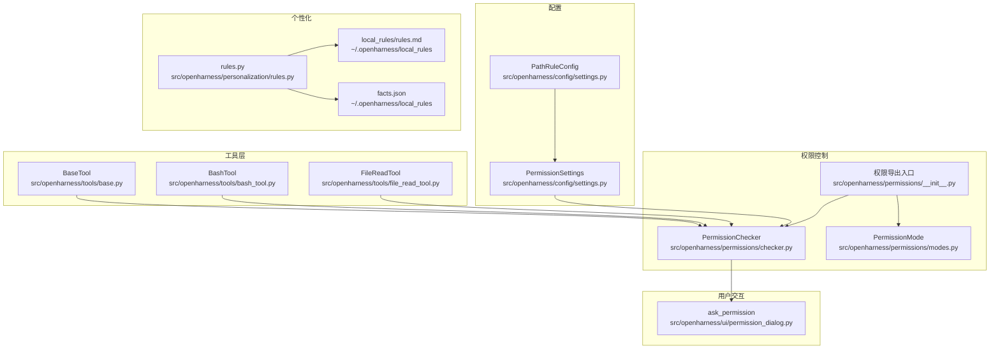
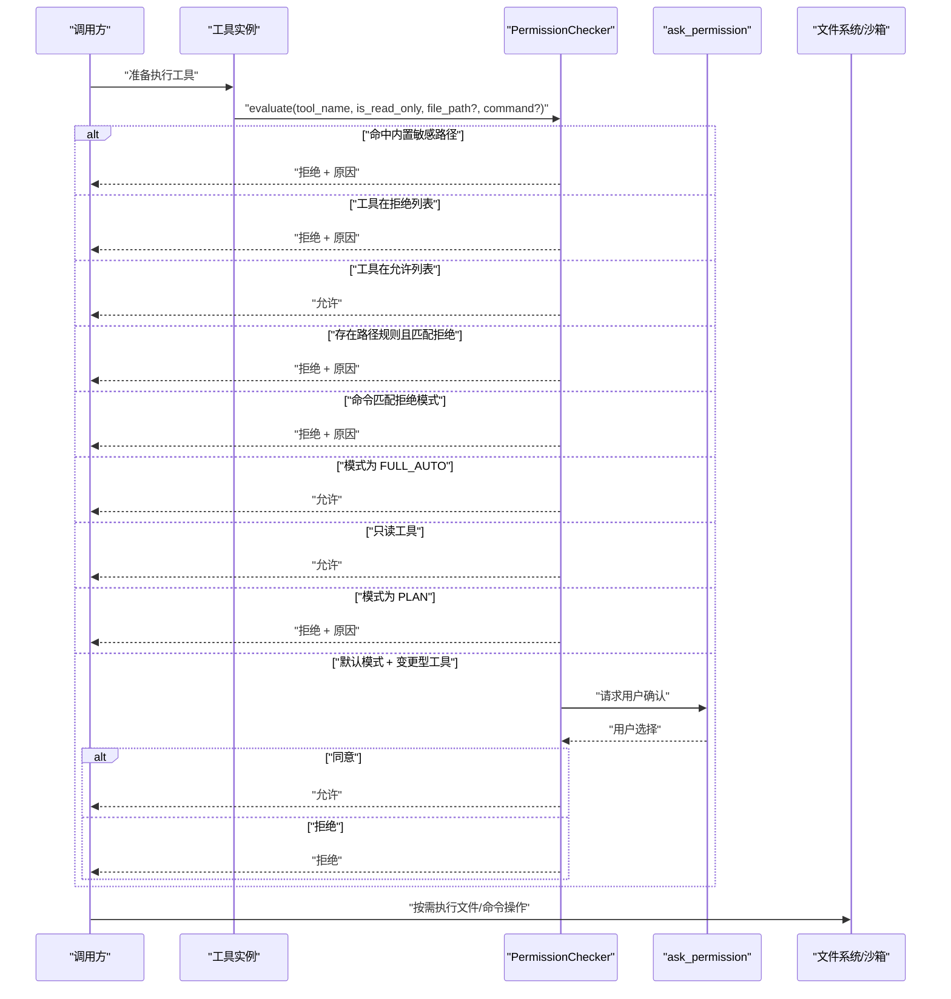
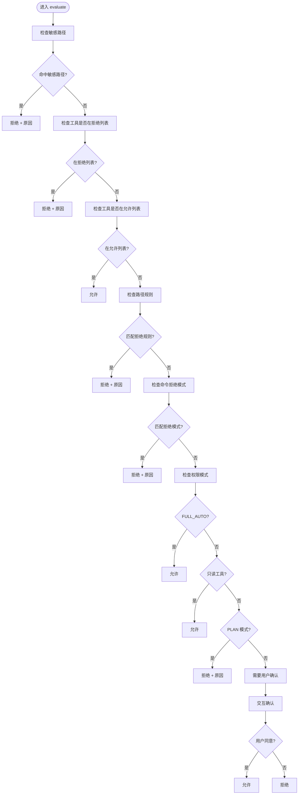
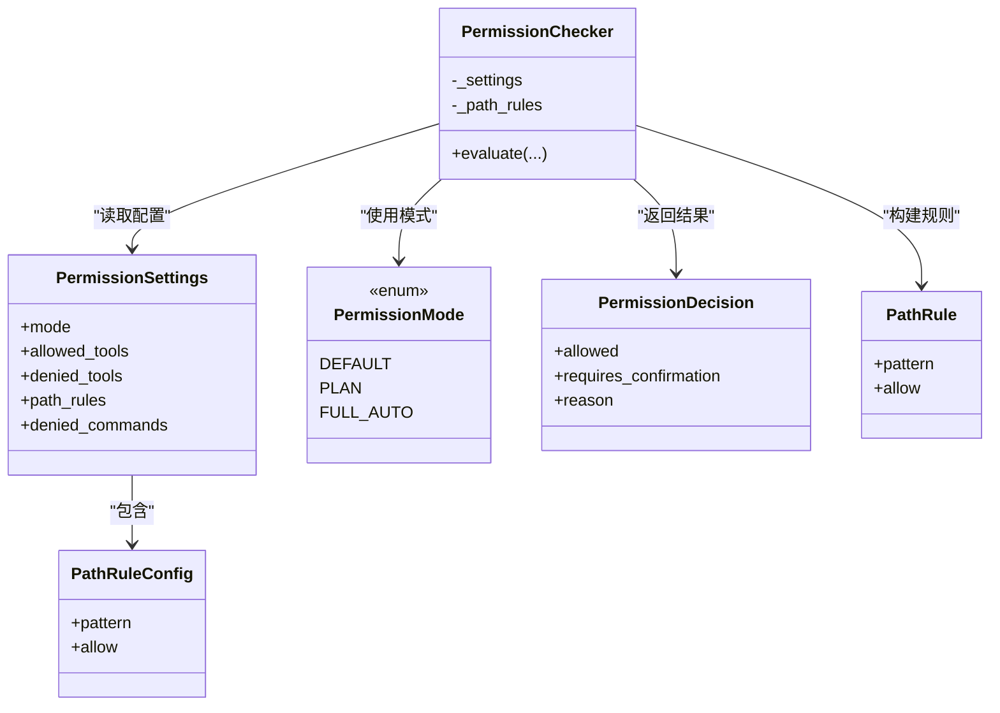

# 权限控制系统

<cite>
**本文引用的文件**
- [checker.py](file://src/openharness/permissions/checker.py)
- [modes.py](file://src/openharness/permissions/modes.py)
- [__init__.py](file://src/openharness/permissions/__init__.py)
- [settings.py](file://src/openharness/config/settings.py)
- [base.py](file://src/openharness/tools/base.py)
- [bash_tool.py](file://src/openharness/tools/bash_tool.py)
- [file_read_tool.py](file://src/openharness/tools/file_read_tool.py)
- [permission_dialog.py](file://src/openharness/ui/permission_dialog.py)
- [rules.py](file://src/openharness/personalization/rules.py)
- [test_checker.py](file://tests/test_permissions/test_checker.py)
</cite>

## 目录
1. [简介](#简介)
2. [项目结构](#项目结构)
3. [核心组件](#核心组件)
4. [架构总览](#架构总览)
5. [详细组件分析](#详细组件分析)
6. [依赖关系分析](#依赖关系分析)
7. [性能考量](#性能考量)
8. [故障排查指南](#故障排查指南)
9. [结论](#结论)
10. [附录：配置与最佳实践](#附录配置与最佳实践)

## 简介
本文件面向 OpenHarness 的权限控制系统，聚焦于 PermissionChecker 的工作原理与权限决策流程，阐释多层级权限模式（默认模式、计划模式、全量自动模式）的设计理念与差异；详解路径规则系统、命令过滤机制、敏感路径保护策略以及个性化规则的存储与加载；并提供权限配置示例、最佳实践与扩展指南，覆盖工具调用、文件访问、命令执行等典型场景。

## 项目结构
权限控制相关代码主要分布在以下模块：
- 权限核心：permissions 包下的 checker、modes、__init__
- 配置模型：config.settings 中的 PermissionSettings、PathRuleConfig
- 工具抽象与实现：tools.base、具体工具如 bash_tool、file_read_tool
- 用户交互：ui.permission_dialog 提供确认提示
- 个性化规则：personalization.rules 提供本地规则与事实的持久化接口
- 测试：tests/test_permissions/test_checker.py 覆盖关键行为

图表来源
- [checker.py:57-156](file://src/openharness/permissions/checker.py#L57-L156)
- [modes.py:8-14](file://src/openharness/permissions/modes.py#L8-L14)
- [__init__.py:14-26](file://src/openharness/permissions/__init__.py#L14-L26)
- [settings.py:43-58](file://src/openharness/config/settings.py#L43-L58)
- [base.py:35-49](file://src/openharness/tools/base.py#L35-L49)
- [bash_tool.py:27-34](file://src/openharness/tools/bash_tool.py#L27-L34)
- [file_read_tool.py:20-29](file://src/openharness/tools/file_read_tool.py#L20-L29)
- [permission_dialog.py:8-14](file://src/openharness/ui/permission_dialog.py#L8-L14)
- [rules.py:18-46](file://src/openharness/personalization/rules.py#L18-L46)

章节来源
- [checker.py:1-201](file://src/openharness/permissions/checker.py#L1-L201)
- [modes.py:1-14](file://src/openharness/permissions/modes.py#L1-L14)
- [__init__.py:1-27](file://src/openharness/permissions/__init__.py#L1-L27)
- [settings.py:43-58](file://src/openharness/config/settings.py#L43-L58)
- [base.py:1-81](file://src/openharness/tools/base.py#L1-L81)
- [bash_tool.py:1-219](file://src/openharness/tools/bash_tool.py#L1-L219)
- [file_read_tool.py:1-73](file://src/openharness/tools/file_read_tool.py#L1-L73)
- [permission_dialog.py:1-15](file://src/openharness/ui/permission_dialog.py#L1-L15)
- [rules.py:1-65](file://src/openharness/personalization/rules.py#L1-L65)

## 核心组件
- PermissionMode：定义三种权限模式，默认模式、计划模式、全量自动模式。
- PermissionSettings：权限配置模型，包含模式、允许/拒绝工具列表、路径规则、命令拒绝模式。
- PathRuleConfig：路径规则项，支持 glob 模式匹配与显式允许/拒绝。
- PermissionChecker：权限决策引擎，负责综合模式、工具白/黑名单、路径规则、命令模式与敏感路径保护进行判定，并返回是否允许、是否需要确认及原因。
- PermissionDecision：权限决策结果数据类，包含允许标志、是否需要确认、原因说明。
- PathRule：内部规则对象，封装 pattern 与 allow 字段。
- SENSITIVE_PATH_PATTERNS：内置敏感路径模式集合，覆盖 SSH、AWS、GCP、Azure、GPG、Docker、Kubernetes、OpenHarness 自身凭证等，始终生效且不可绕过。

章节来源
- [modes.py:8-14](file://src/openharness/permissions/modes.py#L8-L14)
- [settings.py:43-58](file://src/openharness/config/settings.py#L43-L58)
- [checker.py:40-57](file://src/openharness/permissions/checker.py#L40-L57)
- [checker.py:57-156](file://src/openharness/permissions/checker.py#L57-L156)

## 架构总览
权限检查贯穿工具生命周期：工具注册后由工具调用方在执行前调用 PermissionChecker 进行预检，依据决策结果决定直接放行、要求用户确认或直接拒绝。敏感路径保护作为“防御纵深”优先级最高，不受任何模式或用户配置影响。

图表来源
- [checker.py:75-156](file://src/openharness/permissions/checker.py#L75-L156)
- [permission_dialog.py:8-14](file://src/openharness/ui/permission_dialog.py#L8-L14)

## 详细组件分析

### PermissionChecker 决策流程
- 敏感路径保护：对 file_path 进行候选路径生成（目录末尾追加斜杠以匹配目录根），逐一与内置 SENSITIVE_PATH_PATTERNS 比对，一旦命中立即拒绝。
- 工具白/黑名单：若工具在拒绝列表直接拒绝；若在允许列表直接允许。
- 路径规则：若存在路径规则且匹配到拒绝规则，则拒绝。
- 命令拒绝模式：对 command 使用 fnmatch 进行模式匹配，命中即拒绝。
- 模式控制：
  - FULL_AUTO：允许所有工具。
  - PLAN：阻止变更型工具，直到退出计划模式。
  - DEFAULT：只读工具允许；变更型工具需要用户确认。
- 用户确认：当需要确认时，通过交互对话框询问用户，依据用户选择放行或拒绝。

图表来源
- [checker.py:75-156](file://src/openharness/permissions/checker.py#L75-L156)

章节来源
- [checker.py:75-156](file://src/openharness/permissions/checker.py#L75-L156)

### 多层级权限模式
- 默认模式（DEFAULT）
  - 行为：只读工具直接允许；变更型工具需要用户确认。
  - 适用：日常开发与探索，兼顾安全与效率。
- 计划模式（PLAN）
  - 行为：阻止所有变更型工具，直至退出计划模式。
  - 适用：严格审计与风险控制场景。
- 全量自动（FULL_AUTO）
  - 行为：允许所有工具，但敏感路径保护仍强制生效。
  - 适用：受控沙箱内或可信环境的自动化任务。

章节来源
- [modes.py:8-14](file://src/openharness/permissions/modes.py#L8-L14)
- [checker.py:128-141](file://src/openharness/permissions/checker.py#L128-L141)

### 路径规则系统
- 规则来源：PermissionSettings.path_rules，每条规则包含 pattern（glob 模式）与 allow（布尔）。
- 解析与校验：构造 PathRule 对象时会去除首尾空白并校验 pattern 类型与非空；无效规则会被跳过并记录警告。
- 命中策略：对 file_path 生成候选路径（含末尾斜杠），逐条规则匹配；遇到拒绝规则立即拒绝；允许规则不改变后续判断。
- 作用范围：仅对带 file_path 的工具有效；对 bash 等无文件路径的工具无效。

章节来源
- [settings.py:43-48](file://src/openharness/config/settings.py#L43-L48)
- [settings.py:50-58](file://src/openharness/config/settings.py#L50-L58)
- [checker.py:60-74](file://src/openharness/permissions/checker.py#L60-L74)
- [checker.py:108-118](file://src/openharness/permissions/checker.py#L108-L118)
- [test_checker.py:52-131](file://tests/test_permissions/test_checker.py#L52-L131)

### 命令过滤机制
- 拒绝模式：PermissionSettings.denied_commands 列表，使用 fnmatch 进行模糊匹配。
- 生效条件：仅对带有 command 的工具（如 bash）生效。
- 提示增强：针对包安装/脚手架类命令，会在拒绝时附加提示，说明此类命令会修改工作区，需非交互方式或先在外部终端执行。

章节来源
- [settings.py](file://src/openharness/config/settings.py#L57)
- [checker.py:119-126](file://src/openharness/permissions/checker.py#L119-L126)
- [checker.py:172-200](file://src/openharness/permissions/checker.py#L172-L200)
- [bash_tool.py:179-203](file://src/openharness/tools/bash_tool.py#L179-L203)

### 敏感路径保护
- 内置模式：覆盖 SSH、AWS、GCP、Azure、GPG、Docker、Kubernetes、OpenHarness 凭证等常见高价值路径。
- 命中优先级：高于任何模式与用户配置，无法被允许列表或路径规则绕过。
- 候选路径：对目录路径追加斜杠以匹配目录本身。

章节来源
- [checker.py:14-37](file://src/openharness/permissions/checker.py#L14-L37)
- [checker.py:88-98](file://src/openharness/permissions/checker.py#L88-L98)
- [test_checker.py:132-231](file://tests/test_permissions/test_checker.py#L132-L231)

### 个性化规则
- 存储位置：~/.openharness/local_rules 下的 rules.md 与 facts.json。
- 功能：rules.py 提供本地规则与事实的读写与合并能力，便于扩展基于事实的规则。
- 应用建议：可结合工具调用上下文提取事实，动态调整路径规则或命令模式。

章节来源
- [rules.py:18-46](file://src/openharness/personalization/rules.py#L18-L46)

### 工具与权限的集成点
- BaseTool.is_read_only：用于标记工具是否只读，影响默认模式下的放行策略。
- BashTool：支持非交互式执行，但会进行交互性预检与超时处理；命令执行前由 PermissionChecker 决定是否允许。
- FileReadTool：在沙箱启用时进行路径合法性校验，避免越权访问。

章节来源
- [base.py:46-49](file://src/openharness/tools/base.py#L46-L49)
- [bash_tool.py:34-85](file://src/openharness/tools/bash_tool.py#L34-L85)
- [file_read_tool.py:31-46](file://src/openharness/tools/file_read_tool.py#L31-L46)

## 依赖关系分析
- PermissionChecker 依赖：
  - PermissionSettings：从配置中读取模式、工具黑白名单、路径规则、命令拒绝模式。
  - PermissionMode：决定模式分支逻辑。
  - 内置敏感路径模式：硬编码在 checker.py 中。
- 工具侧依赖：
  - BaseTool：统一的工具抽象与只读标记。
  - 各具体工具：如 BashTool、FileReadTool 在执行前接受 PermissionChecker 的决策。
- 用户交互：
  - ask_permission：在默认模式下对变更型工具进行确认。

图表来源
- [settings.py:43-58](file://src/openharness/config/settings.py#L43-L58)
- [modes.py:8-14](file://src/openharness/permissions/modes.py#L8-L14)
- [checker.py:60-74](file://src/openharness/permissions/checker.py#L60-L74)
- [checker.py:40-57](file://src/openharness/permissions/checker.py#L40-L57)

章节来源
- [settings.py:43-58](file://src/openharness/config/settings.py#L43-L58)
- [modes.py:8-14](file://src/openharness/permissions/modes.py#L8-L14)
- [checker.py:40-74](file://src/openharness/permissions/checker.py#L40-L74)

## 性能考量
- 规则匹配复杂度：路径规则与命令模式均采用线性扫描，规则数量较多时建议精简与合并重叠模式，减少匹配开销。
- 日志与警告：解析无效路径规则时会产生日志告警，建议在生产环境中关注并清理错误配置。
- 交互确认：默认模式下的用户确认为同步阻塞，应尽量减少频繁的变更型工具调用，或在批量任务中谨慎使用。

## 故障排查指南
- 规则未生效
  - 检查 pattern 是否为空、类型是否为字符串；无效规则会被跳过并记录警告。
  - 确认路径是否正确（目录路径建议以斜杠结尾以匹配目录自身）。
- 敏感路径被误拒
  - 确认路径是否命中内置敏感路径模式；该保护不可绕过。
- 变更型工具被拒绝
  - 检查当前模式是否为 PLAN；或在 DEFAULT 模式下是否需要确认。
  - 若为 bash 命令，确认是否包含被拒绝的命令模式。
- 交互确认提示不出现
  - 仅在默认模式且工具为变更型时触发；只读工具或 FULL_AUTO 模式不会弹窗。

章节来源
- [test_checker.py:77-84](file://tests/test_permissions/test_checker.py#L77-L84)
- [test_checker.py:132-231](file://tests/test_permissions/test_checker.py#L132-L231)
- [checker.py:144-156](file://src/openharness/permissions/checker.py#L144-L156)

## 结论
OpenHarness 的权限控制系统通过“内置敏感路径保护 + 多层级模式 + 路径规则 + 命令过滤 + 用户确认”的组合，实现了从防御纵深到灵活控制的完整闭环。默认模式平衡安全与效率，计划模式提供强约束，全量自动模式满足自动化需求。配合路径规则与命令模式，可精细化控制工具与命令的使用范围；个性化规则则为长期演进提供了扩展空间。

## 附录：配置与最佳实践

### 配置示例
- 基础权限模式
  - 将 mode 设为 default/plan/full_auto 之一。
- 工具白/黑名单
  - allowed_tools/denied_tools：按工具名精确控制。
- 路径规则
  - path_rules：使用 glob 模式，allow 控制允许/拒绝。
  - 示例：对特定目录拒绝写入，对特定文件允许读取。
- 命令拒绝模式
  - denied_commands：使用 fnmatch 模式，如拒绝危险命令或交互式脚手架命令。

章节来源
- [settings.py:50-58](file://src/openharness/config/settings.py#L50-L58)
- [test_checker.py:87-131](file://tests/test_permissions/test_checker.py#L87-L131)

### 最佳实践
- 优先使用默认模式，仅在受控场景切换至计划或全量自动模式。
- 将敏感路径保护视为不可逾越的红线，不要尝试绕过。
- 路径规则应尽量具体且最小化，避免过度宽泛导致误伤。
- 对包安装/脚手架类命令，建议在外部终端先行执行，或在命令中加入非交互参数。
- 定期审查 denied_tools/allowed_tools 与 path_rules，保持与团队安全策略一致。

### 扩展与自定义
- 新增路径规则
  - 在 PermissionSettings.path_rules 中添加新的 PathRuleConfig，注意 pattern 格式与 allow 值。
- 自定义命令拒绝模式
  - 在 PermissionSettings.denied_commands 中添加新的拒绝模式，确保覆盖目标命令特征。
- 个性化规则开发
  - 使用 personalization.rules 的接口读写 rules.md 与 facts.json，结合工具调用上下文动态生成规则。
- 工具只读标记
  - 在工具实现中覆写 is_read_only 返回 True，使其在默认模式下无需确认即可运行。

章节来源
- [rules.py:18-46](file://src/openharness/personalization/rules.py#L18-L46)
- [base.py:46-49](file://src/openharness/tools/base.py#L46-L49)
- [settings.py:43-48](file://src/openharness/config/settings.py#L43-L48)