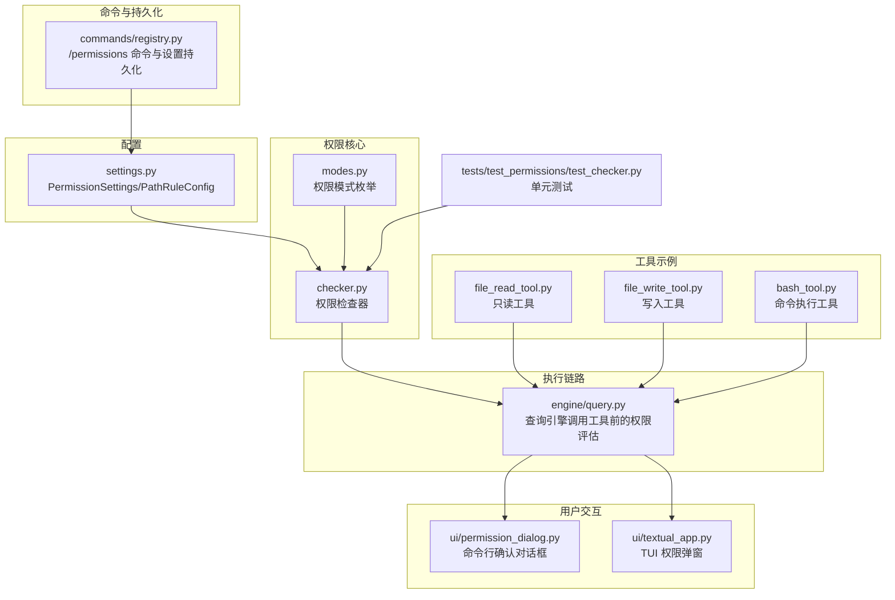
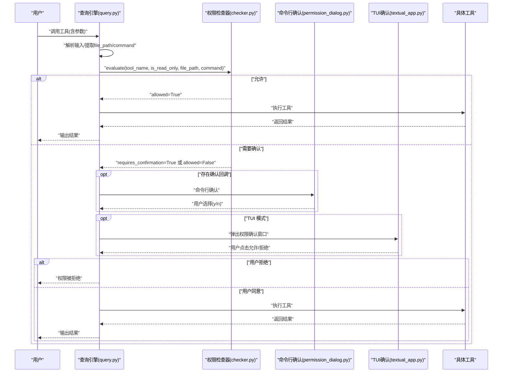
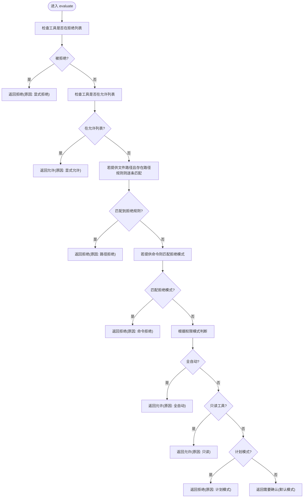
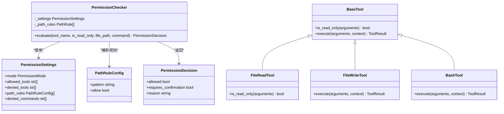
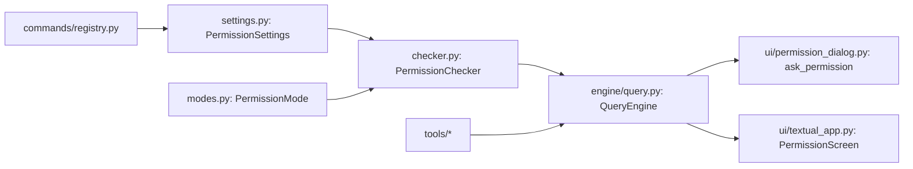

# 权限控制系统

<cite>
**本文引用的文件**
- [checker.py](file://src/openharness/permissions/checker.py)
- [modes.py](file://src/openharness/permissions/modes.py)
- [settings.py](file://src/openharness/config/settings.py)
- [query.py](file://src/openharness/engine/query.py)
- [permission_dialog.py](file://src/openharness/ui/permission_dialog.py)
- [textual_app.py](file://src/openharness/ui/textual_app.py)
- [file_read_tool.py](file://src/openharness/tools/file_read_tool.py)
- [file_write_tool.py](file://src/openharness/tools/file_write_tool.py)
- [bash_tool.py](file://src/openharness/tools/bash_tool.py)
- [registry.py](file://src/openharness/commands/registry.py)
- [test_checker.py](file://tests/test_permissions/test_checker.py)
</cite>

## 目录
1. [简介](#简介)
2. [项目结构](#项目结构)
3. [核心组件](#核心组件)
4. [架构总览](#架构总览)
5. [详细组件分析](#详细组件分析)
6. [依赖分析](#依赖分析)
7. [性能考虑](#性能考虑)
8. [故障排查指南](#故障排查指南)
9. [结论](#结论)
10. [附录](#附录)

## 简介
本文件面向 OpenHarness 的权限控制系统，系统性阐述权限检查器的设计原理与多级安全模式实现，深入解析路径规则配置、访问控制列表（ACL）与动态权限评估机制。文档同时说明权限模式的分类与适用场景（严格模式、宽松模式与自定义模式），并给出权限缓存策略与性能优化建议、实际配置案例与安全最佳实践，以及权限绕过与审计日志相关内容。

## 项目结构
权限控制相关代码主要分布在以下模块：
- 权限核心：checker.py、modes.py
- 配置模型：settings.py
- 执行链路：engine/query.py
- 用户交互：ui/permission_dialog.py、ui/textual_app.py
- 工具示例：tools/file_read_tool.py、file_write_tool.py、bash_tool.py
- 命令注册与持久化：commands/registry.py
- 测试用例：tests/test_permissions/test_checker.py

图表来源
- [checker.py:1-100](file://src/openharness/permissions/checker.py#L1-L100)
- [modes.py:1-14](file://src/openharness/permissions/modes.py#L1-L14)
- [settings.py:31-39](file://src/openharness/config/settings.py#L31-L39)
- [query.py:140-212](file://src/openharness/engine/query.py#L140-L212)
- [permission_dialog.py:1-15](file://src/openharness/ui/permission_dialog.py#L1-L15)
- [textual_app.py:40-123](file://src/openharness/ui/textual_app.py#L40-L123)
- [file_read_tool.py:20-30](file://src/openharness/tools/file_read_tool.py#L20-L30)
- [file_write_tool.py:20-37](file://src/openharness/tools/file_write_tool.py#L20-L37)
- [bash_tool.py:21-27](file://src/openharness/tools/bash_tool.py#L21-L27)
- [registry.py:39-49](file://src/openharness/commands/registry.py#L39-L49)
- [test_checker.py:1-32](file://tests/test_permissions/test_checker.py#L1-L32)

章节来源
- [checker.py:1-100](file://src/openharness/permissions/checker.py#L1-L100)
- [modes.py:1-14](file://src/openharness/permissions/modes.py#L1-L14)
- [settings.py:31-39](file://src/openharness/config/settings.py#L31-L39)
- [query.py:140-212](file://src/openharness/engine/query.py#L140-L212)
- [permission_dialog.py:1-15](file://src/openharness/ui/permission_dialog.py#L1-L15)
- [textual_app.py:40-123](file://src/openharness/ui/textual_app.py#L40-L123)
- [file_read_tool.py:20-30](file://src/openharness/tools/file_read_tool.py#L20-L30)
- [file_write_tool.py:20-37](file://src/openharness/tools/file_write_tool.py#L20-L37)
- [bash_tool.py:21-27](file://src/openharness/tools/bash_tool.py#L21-L27)
- [registry.py:39-49](file://src/openharness/commands/registry.py#L39-L49)
- [test_checker.py:1-32](file://tests/test_permissions/test_checker.py#L1-L32)

## 核心组件
- 权限决策数据结构：PermissionDecision，用于返回允许与否、是否需要确认及原因。
- 路径规则数据结构：PathRule，基于通配符的路径规则，支持允许/拒绝。
- 权限检查器：PermissionChecker，负责综合工具名、只读属性、文件路径、命令模式与权限模式进行动态评估。
- 权限模式：PermissionMode，包含默认、计划模式、全自动三种模式。
- 配置模型：PermissionSettings 与 PathRuleConfig，承载权限模式、工具白名单/黑名单、路径规则与命令拒绝模式等。
- 执行链路：在工具执行前由查询引擎调用权限检查器，并根据结果决定是否继续或请求用户确认。
- 用户交互：命令行与 TUI 两种确认方式，分别通过异步对话框实现。

章节来源
- [checker.py:13-28](file://src/openharness/permissions/checker.py#L13-L28)
- [checker.py:30-100](file://src/openharness/permissions/checker.py#L30-L100)
- [modes.py:8-14](file://src/openharness/permissions/modes.py#L8-L14)
- [settings.py:24-39](file://src/openharness/config/settings.py#L24-L39)
- [query.py:159-182](file://src/openharness/engine/query.py#L159-L182)
- [permission_dialog.py:8-15](file://src/openharness/ui/permission_dialog.py#L8-L15)
- [textual_app.py:42-81](file://src/openharness/ui/textual_app.py#L42-L81)

## 架构总览
下图展示了从工具调用到权限评估再到用户确认的整体流程，以及各模块之间的依赖关系。

图表来源
- [query.py:159-182](file://src/openharness/engine/query.py#L159-L182)
- [checker.py:43-99](file://src/openharness/permissions/checker.py#L43-L99)
- [permission_dialog.py:8-15](file://src/openharness/ui/permission_dialog.py#L8-L15)
- [textual_app.py:42-81](file://src/openharness/ui/textual_app.py#L42-L81)

## 详细组件分析

### 权限检查器设计与评估逻辑
- 评估顺序
  1) 工具 ACL：若在显式拒绝列表则直接拒绝；若在显式允许列表则直接允许。
  2) 路径规则：若提供文件路径且存在路径规则，则按顺序匹配，遇到拒绝规则立即拒绝。
  3) 命令模式：若提供命令且匹配拒绝模式（通配符），则拒绝。
  4) 权限模式：
     - 全自动：允许所有工具。
     - 只读工具：总是允许。
     - 计划模式：阻止所有变更型工具。
     - 默认模式：变更型工具需用户确认。
- 返回值：PermissionDecision 包含 allowed、requires_confirmation 与 reason，便于 UI 展示与日志记录。

图表来源
- [checker.py:43-99](file://src/openharness/permissions/checker.py#L43-L99)

章节来源
- [checker.py:30-100](file://src/openharness/permissions/checker.py#L30-L100)

### 权限模式与应用场景
- 默认模式（default）
  - 场景：日常开发与协作，平衡安全性与效率。
  - 行为：只读工具直接允许；变更型工具需要用户确认。
- 计划模式（plan）
  - 场景：规划阶段或批量任务执行前的安全隔离。
  - 行为：禁止一切变更型工具，直到退出计划模式。
- 全自动（full_auto）
  - 场景：受控环境或自动化流水线中，信任上下文与规则。
  - 行为：允许所有工具，不触发确认流程。

章节来源
- [modes.py:8-14](file://src/openharness/permissions/modes.py#L8-L14)
- [checker.py:79-92](file://src/openharness/permissions/checker.py#L79-L92)
- [test_checker.py:7-31](file://tests/test_permissions/test_checker.py#L7-L31)

### 路径规则配置与访问控制列表
- 路径规则（PathRuleConfig）
  - 字段：pattern（通配符）、allow（布尔）。
  - 解析：PermissionChecker 在初始化时将 settings 中的 path_rules 转换为内部 PathRule 列表。
- 访问控制列表（ACL）
  - allowed_tools：白名单，命中即放行。
  - denied_tools：黑名单，命中即拒绝。
- 命令拒绝模式（denied_commands）
  - 支持通配符匹配典型高危命令，如危险删除命令等。

章节来源
- [settings.py:24-39](file://src/openharness/config/settings.py#L24-L39)
- [checker.py:33-42](file://src/openharness/permissions/checker.py#L33-L42)
- [checker.py:52-77](file://src/openharness/permissions/checker.py#L52-L77)

### 动态权限评估与工具集成
- 工具只读判定
  - BaseTool.is_read_only 默认返回 False；只读工具可覆盖该方法返回 True。
  - 示例：文件读取工具明确声明只读。
- 执行前评估
  - 查询引擎在调用工具前提取 file_path 与 command 参数，交由权限检查器评估。
  - 若需要确认，优先使用已注入的 permission_prompt 回调（命令行或 TUI）。

图表来源
- [checker.py:30-100](file://src/openharness/permissions/checker.py#L30-L100)
- [settings.py:31-39](file://src/openharness/config/settings.py#L31-L39)
- [file_read_tool.py:20-30](file://src/openharness/tools/file_read_tool.py#L20-L30)
- [file_write_tool.py:20-37](file://src/openharness/tools/file_write_tool.py#L20-L37)
- [bash_tool.py:21-27](file://src/openharness/tools/bash_tool.py#L21-L27)

章节来源
- [query.py:159-182](file://src/openharness/engine/query.py#L159-L182)
- [file_read_tool.py:27-29](file://src/openharness/tools/file_read_tool.py#L27-L29)

### 用户交互与确认流程
- 命令行确认：通过异步会话提示用户批准或拒绝。
- TUI 确认：在文本界面中弹出模态框，支持按键与按钮操作。
- 两者均在需要确认时被查询引擎调用，确认后才继续执行工具。

章节来源
- [permission_dialog.py:8-15](file://src/openharness/ui/permission_dialog.py#L8-L15)
- [textual_app.py:42-81](file://src/openharness/ui/textual_app.py#L42-L81)
- [query.py:169-176](file://src/openharness/engine/query.py#L169-L176)

### 权限绕过与审计日志
- 绕过风险点
  - 全自动模式下不会触发确认，应谨慎启用。
  - 工具白名单可绕过多数规则，需最小授权原则。
  - 路径规则未覆盖的路径可能被忽略，需确保规则完整。
- 审计建议
  - 记录每次权限决策（工具名、输入摘要、决策结果、原因、用户确认与否）。
  - 对拒绝与确认事件进行统计与告警。
  - 将拒绝原因与用户反馈纳入审计日志，便于回溯。

[本节为概念性建议，不直接分析具体文件，故无章节来源]

## 依赖分析
- 权限检查器依赖配置模型与权限模式枚举。
- 查询引擎在工具执行前调用权限检查器，并根据返回值决定是否继续或请求确认。
- 用户交互模块作为确认回调注入到执行上下文中，供查询引擎调用。
- 工具层通过 is_read_only 协助判断是否需要确认。

图表来源
- [checker.py:9-10](file://src/openharness/permissions/checker.py#L9-L10)
- [modes.py:8-14](file://src/openharness/permissions/modes.py#L8-L14)
- [settings.py:31-39](file://src/openharness/config/settings.py#L31-L39)
- [query.py:162-167](file://src/openharness/engine/query.py#L162-L167)
- [permission_dialog.py:8-15](file://src/openharness/ui/permission_dialog.py#L8-L15)
- [textual_app.py:42-81](file://src/openharness/ui/textual_app.py#L42-L81)
- [registry.py:39-49](file://src/openharness/commands/registry.py#L39-L49)

章节来源
- [checker.py:9-10](file://src/openharness/permissions/checker.py#L9-L10)
- [modes.py:8-14](file://src/openharness/permissions/modes.py#L8-L14)
- [settings.py:31-39](file://src/openharness/config/settings.py#L31-L39)
- [query.py:162-167](file://src/openharness/engine/query.py#L162-L167)
- [permission_dialog.py:8-15](file://src/openharness/ui/permission_dialog.py#L8-L15)
- [textual_app.py:42-81](file://src/openharness/ui/textual_app.py#L42-L81)
- [registry.py:39-49](file://src/openharness/commands/registry.py#L39-L49)

## 性能考虑
- 规则匹配复杂度
  - 路径规则与命令拒绝模式采用顺序匹配，时间复杂度 O(R+C)，其中 R 为路径规则数、C 为命令拒绝模式数。
  - 建议限制规则数量与层级深度，避免过多通配符导致匹配开销。
- 缓存策略
  - 当前实现未内置缓存。可在 PermissionChecker 内部增加 LRU 缓存以复用最近的决策结果，键可包含工具名、只读标志、文件路径与命令的哈希。
  - 对于频繁调用的只读工具，可优先缓存其“允许”结果。
- I/O 与交互
  - 用户确认涉及阻塞 I/O，建议在 UI 层面异步处理，避免阻塞主执行流。
- 配置加载
  - 设置加载与合并发生在应用启动阶段，运行时仅读取，避免重复解析。

[本节为通用性能建议，不直接分析具体文件，故无章节来源]

## 故障排查指南
- 常见问题
  - 工具被意外拒绝：检查是否命中拒绝列表、路径规则或命令拒绝模式。
  - 变更型工具未触发确认：确认当前模式是否为默认模式，或是否存在确认回调。
  - 路径规则无效：确认 pattern 是否正确、allow 设置是否符合预期。
- 调试步骤
  - 启用详细日志，记录 PermissionDecision 的 reason 字段。
  - 使用单元测试验证不同模式下的行为。
- 相关测试
  - 默认模式下只读工具应直接允许，变更型工具应要求确认。
  - 计划模式下任何变更型工具应被拒绝。
  - 全自动模式下变更型工具应被允许。

章节来源
- [test_checker.py:7-31](file://tests/test_permissions/test_checker.py#L7-L31)

## 结论
OpenHarness 的权限控制系统以清晰的评估顺序与灵活的配置模型为基础，结合多级安全模式与路径/命令规则，实现了对工具调用的细粒度控制。通过在执行前统一评估与可插拔的确认机制，系统在保证安全的同时兼顾了易用性。建议在生产环境中采用最小授权原则、完善审计日志，并结合缓存策略提升性能。

## 附录

### 权限配置示例与最佳实践
- 最小授权原则
  - 仅在 allowed_tools 中列出必要工具，避免使用全局通配符。
- 路径规则
  - 使用精确路径或有限层级通配符，避免覆盖敏感目录。
  - 对高风险目录设置拒绝规则。
- 命令拒绝模式
  - 添加常见高危命令的拒绝模式，如危险删除、格式化等。
- 模式选择
  - 日常开发使用默认模式；批量任务前切换至计划模式；自动化流水线可考虑全自动模式但需严格审计。
- 持久化与传播
  - 通过命令接口持久化权限设置，确保跨会话一致。

[本节为通用实践建议，不直接分析具体文件，故无章节来源]