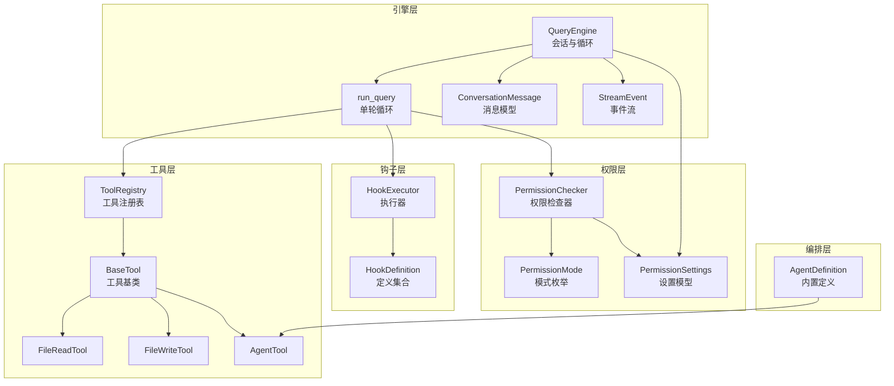
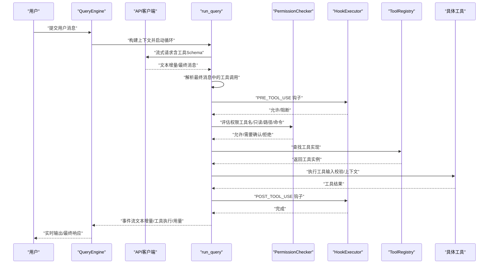
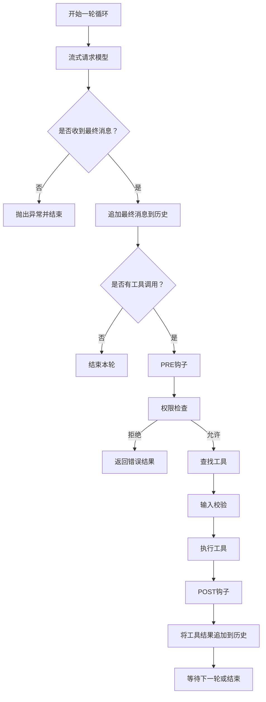
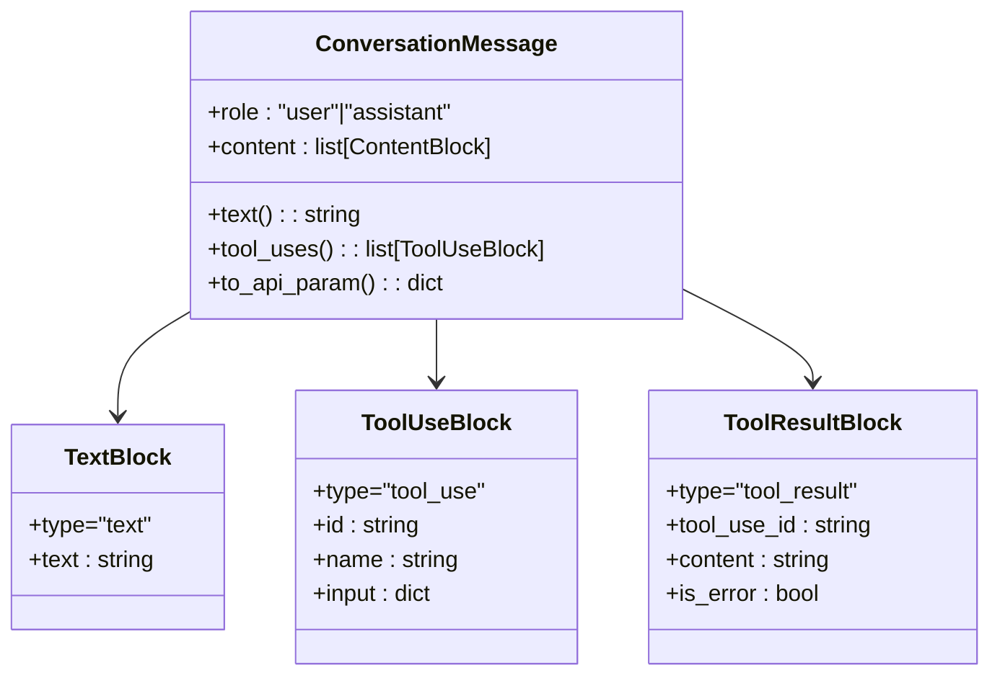
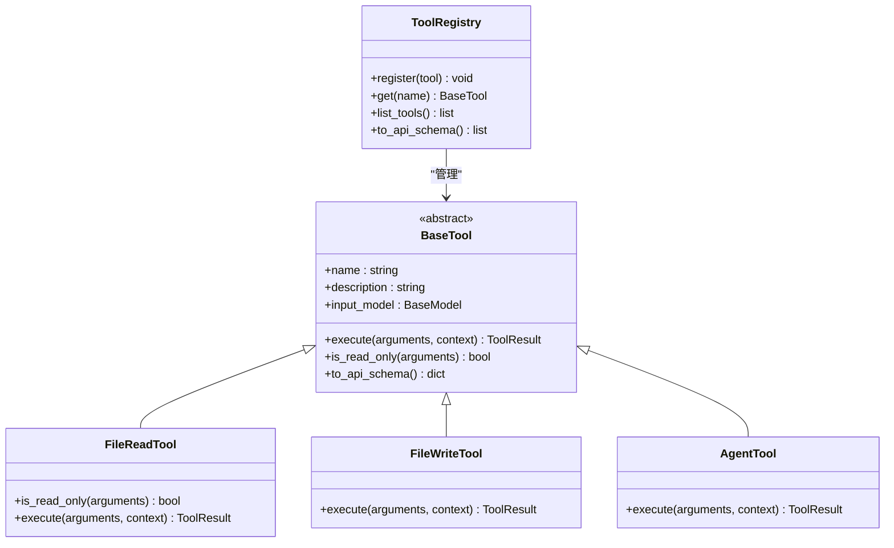
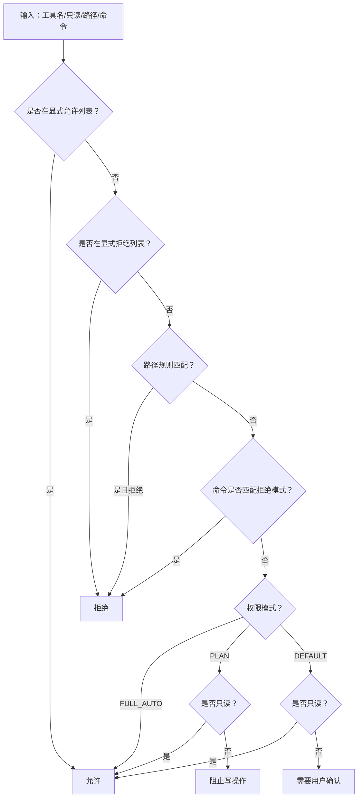
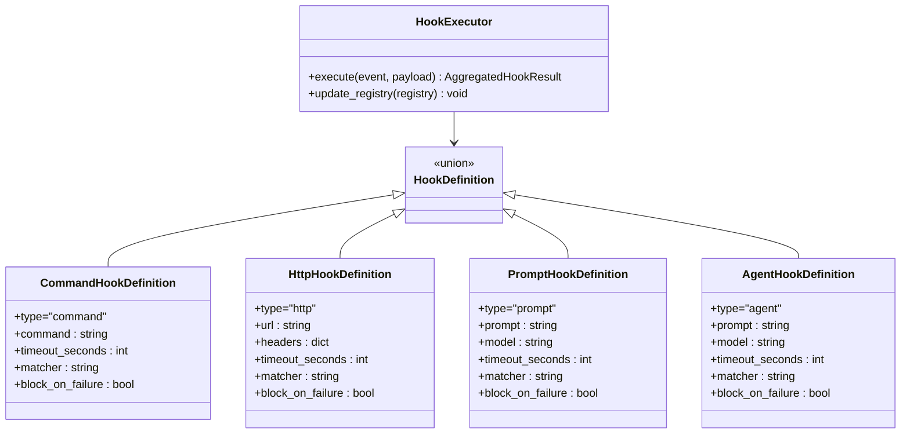
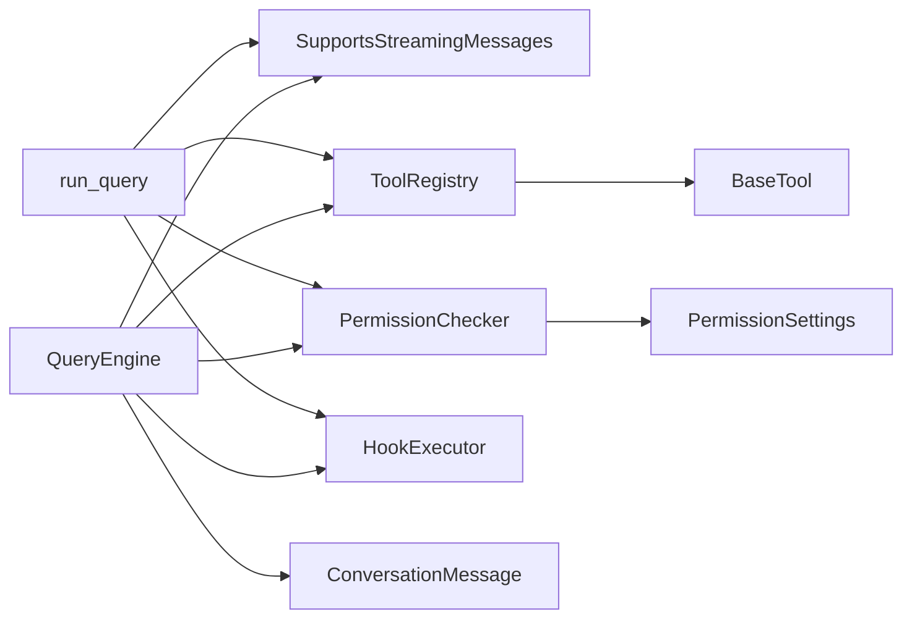

# 核心概念

<cite>
**本文引用的文件**
- [README.md](file://README.md)
- [query_engine.py](file://src/openharness/engine/query_engine.py)
- [query.py](file://src/openharness/engine/query.py)
- [messages.py](file://src/openharness/engine/messages.py)
- [stream_events.py](file://src/openharness/engine/stream_events.py)
- [base.py](file://src/openharness/tools/base.py)
- [file_read_tool.py](file://src/openharness/tools/file_read_tool.py)
- [file_write_tool.py](file://src/openharness/tools/file_write_tool.py)
- [agent_tool.py](file://src/openharness/tools/agent_tool.py)
- [checker.py](file://src/openharness/permissions/checker.py)
- [modes.py](file://src/openharness/permissions/modes.py)
- [settings.py](file://src/openharness/config/settings.py)
- [executor.py](file://src/openharness/hooks/executor.py)
- [schemas.py](file://src/openharness/hooks/schemas.py)
- [agent_definitions.py](file://src/openharness/coordinator/agent_definitions.py)
</cite>

## 目录
1. [引言](#引言)
2. [项目结构](#项目结构)
3. [核心组件](#核心组件)
4. [架构总览](#架构总览)
5. [详细组件分析](#详细组件分析)
6. [依赖分析](#依赖分析)
7. [性能考虑](#性能考虑)
8. [故障排查指南](#故障排查指南)
9. [结论](#结论)
10. [附录](#附录)

## 引言
本文件围绕 OpenHarness 的核心概念进行深入解释：Agent Harness 的定义与意义、模型智能与基础设施的关系、代理循环（Agent Loop）的工作原理、工具系统架构、权限控制系统、消息抽象与对话历史管理，并辅以架构图与流程图帮助理解。内容兼顾概念性说明与实现细节，适合不同经验层次的开发者。

## 项目结构
OpenHarness 采用按功能域分层的模块化组织方式，核心子系统包括：
- engine：代理循环与消息抽象
- tools：工具注册与执行
- permissions：权限控制
- hooks：生命周期钩子
- config：设置与加载
- coordinator：多智能体编排
- 其他：命令、记忆、任务、MCP、UI 等

**图表来源**
- [query_engine.py:18-101](file://src/openharness/engine/query_engine.py#L18-L101)
- [query.py:35-212](file://src/openharness/engine/query.py#L35-L212)
- [messages.py:39-109](file://src/openharness/engine/messages.py#L39-L109)
- [stream_events.py:12-50](file://src/openharness/engine/stream_events.py#L12-L50)
- [base.py:30-76](file://src/openharness/tools/base.py#L30-L76)
- [file_read_tool.py:20-63](file://src/openharness/tools/file_read_tool.py#L20-L63)
- [file_write_tool.py:20-44](file://src/openharness/tools/file_write_tool.py#L20-L44)
- [agent_tool.py:28-56](file://src/openharness/tools/agent_tool.py#L28-L56)
- [checker.py:30-100](file://src/openharness/permissions/checker.py#L30-L100)
- [modes.py:8-14](file://src/openharness/permissions/modes.py#L8-L14)
- [settings.py:31-64](file://src/openharness/config/settings.py#L31-L64)
- [executor.py:38-217](file://src/openharness/hooks/executor.py#L38-L217)
- [schemas.py:10-59](file://src/openharness/hooks/schemas.py#L10-L59)
- [agent_definitions.py:8-23](file://src/openharness/coordinator/agent_definitions.py#L8-L23)

**章节来源**
- [README.md:127-170](file://README.md#L127-L170)

## 核心组件
- Agent Harness 定义：Harness 是将 LLM 包装为可用代理的完整基础设施，提供“双手、双眼、记忆与安全边界”。模型负责智能，Harness 负责执行、观察、记忆与安全。
- 模型智能与基础设施：模型决定“做什么”，Harness 决定“如何做”——安全、高效、可观测。
- 代理循环（Agent Loop）：一次循环包含“查询生成（模型推理）→ 工具调用（权限检查/钩子/执行）→ 结果回传（消息历史更新）→ 循环继续或结束”。

**章节来源**
- [README.md:59-73](file://README.md#L59-L73)
- [README.md:149-168](file://README.md#L149-L168)

## 架构总览
下图展示从用户输入到工具执行与权限检查的端到端流程，以及消息与事件在各组件间的传递。

**图表来源**
- [query_engine.py:81-101](file://src/openharness/engine/query_engine.py#L81-L101)
- [query.py:53-122](file://src/openharness/engine/query.py#L53-L122)
- [query.py:124-212](file://src/openharness/engine/query.py#L124-L212)
- [checker.py:43-100](file://src/openharness/permissions/checker.py#L43-L100)
- [executor.py:49-63](file://src/openharness/hooks/executor.py#L49-L63)
- [base.py:55-76](file://src/openharness/tools/base.py#L55-L76)

## 详细组件分析

### 代理循环（Agent Loop）
- 单轮流程
  - 发送消息与工具 Schema 给模型，接收文本增量与最终消息。
  - 若最终消息包含工具调用，则进入工具执行阶段；否则结束循环。
- 工具执行
  - 钩子：PRE_TOOL_USE → 权限检查 → 查找工具 → 执行 → POST_TOOL_USE。
  - 输入验证：使用 Pydantic 模型对工具输入进行校验。
  - 并发策略：单个工具串行，多个工具并发执行。
- 用量统计：每轮结束后合并用量快照。

**图表来源**
- [query.py:53-122](file://src/openharness/engine/query.py#L53-L122)
- [query.py:124-212](file://src/openharness/engine/query.py#L124-L212)

**章节来源**
- [query_engine.py:81-101](file://src/openharness/engine/query_engine.py#L81-L101)
- [query.py:53-122](file://src/openharness/engine/query.py#L53-L122)
- [stream_events.py:12-50](file://src/openharness/engine/stream_events.py#L12-L50)

### 消息抽象与对话历史
- 消息类型
  - 文本块：纯文本内容。
  - 工具调用块：模型请求执行某个命名工具。
  - 工具结果块：工具执行结果回传给模型。
- 消息模型
  - ConversationMessage：封装角色与内容列表。
  - 提供 from_user_text、to_api_param、assistant_message_from_api 等辅助方法。
- 历史管理
  - QueryEngine 维护消息列表，支持清空、替换、更新系统提示等。

**图表来源**
- [messages.py:11-109](file://src/openharness/engine/messages.py#L11-L109)

**章节来源**
- [messages.py:39-109](file://src/openharness/engine/messages.py#L39-L109)
- [query_engine.py:50-80](file://src/openharness/engine/query_engine.py#L50-L80)

### 工具系统架构
- 工具基类与注册表
  - BaseTool：统一的工具接口，包含名称、描述、输入模型、执行方法与只读判定。
  - ToolRegistry：工具名到实现的映射，支持注册、查找、导出 API Schema。
- 典型工具
  - 只读工具：如文件读取，is_read_only 返回真，受更宽松的权限策略保护。
  - 可变工具：如文件写入，直接执行，遵循默认权限策略。
  - 复合工具：如 AgentTool，用于派生子任务，支持本地/远程/进程内团队成员模式。
- 生命周期钩子
  - 在工具执行前后分别触发 PRE_TOOL_USE 与 POST_TOOL_USE，可由命令、HTTP 或提示词驱动的钩子实现。

**图表来源**
- [base.py:30-76](file://src/openharness/tools/base.py#L30-L76)
- [file_read_tool.py:20-63](file://src/openharness/tools/file_read_tool.py#L20-L63)
- [file_write_tool.py:20-44](file://src/openharness/tools/file_write_tool.py#L20-L44)
- [agent_tool.py:28-56](file://src/openharness/tools/agent_tool.py#L28-L56)

**章节来源**
- [base.py:30-76](file://src/openharness/tools/base.py#L30-L76)
- [file_read_tool.py:27-55](file://src/openharness/tools/file_read_tool.py#L27-L55)
- [file_write_tool.py:27-36](file://src/openharness/tools/file_write_tool.py#L27-L36)
- [agent_tool.py:35-55](file://src/openharness/tools/agent_tool.py#L35-L55)

### 权限控制系统
- 设计理念
  - 多级安全模式：默认（需要确认）、计划模式（阻止写操作）、全自动（沙箱环境）。
  - 路径规则：基于通配符的路径允许/拒绝规则，结合命令模式匹配进一步限制危险命令。
  - 工具白名单/黑名单：显式允许/拒绝特定工具。
  - 只读豁免：只读工具不受默认模式限制。
- 评估流程
  - 优先检查工具白/黑名单与路径规则。
  - 命令模式匹配拒绝高危命令。
  - 根据模式与只读属性决定立即允许、需要确认或直接拒绝。
  - 支持交互式确认回调（PermissionPrompt）。

**图表来源**
- [checker.py:43-100](file://src/openharness/permissions/checker.py#L43-L100)
- [modes.py:8-14](file://src/openharness/permissions/modes.py#L8-L14)
- [settings.py:31-39](file://src/openharness/config/settings.py#L31-L39)

**章节来源**
- [checker.py:30-100](file://src/openharness/permissions/checker.py#L30-L100)
- [modes.py:8-14](file://src/openharness/permissions/modes.py#L8-L14)
- [settings.py:31-64](file://src/openharness/config/settings.py#L31-L64)

### 钩子系统（生命周期）
- 类型
  - 命令钩子：执行 shell 命令，支持超时与失败阻断。
  - HTTP 钩子：向远端服务 POST 事件负载。
  - 提示词钩子：通过模型判断条件是否满足，严格 JSON 输出。
  - Agent 钩子：更深入的模型判断，适合复杂决策。
- 执行
  - HookExecutor 根据事件类型与匹配器选择并执行钩子，聚合结果并支持阻断策略。
  - 在工具执行前（PRE）与后（POST）注入横切逻辑，便于审计、告警与扩展。

**图表来源**
- [executor.py:38-217](file://src/openharness/hooks/executor.py#L38-L217)
- [schemas.py:10-59](file://src/openharness/hooks/schemas.py#L10-L59)

**章节来源**
- [executor.py:49-63](file://src/openharness/hooks/executor.py#L49-L63)
- [schemas.py:10-59](file://src/openharness/hooks/schemas.py#L10-L59)

### 多智能体与编排
- 内置代理定义：提供通用、执行导向与探索导向的角色定义，便于快速选择。
- 子代理派生：AgentTool 支持本地/远程/进程内团队成员三种模式，可加入团队并协同工作。

**章节来源**
- [agent_definitions.py:8-23](file://src/openharness/coordinator/agent_definitions.py#L8-L23)
- [agent_tool.py:28-56](file://src/openharness/tools/agent_tool.py#L28-L56)

## 依赖分析
- 组件耦合
  - QueryEngine 依赖 API 客户端、工具注册表、权限检查器、钩子执行器与消息模型。
  - run_query 作为循环核心，串联 API 流式响应、权限检查、工具执行与钩子。
  - 工具通过 ToolRegistry 注册，权限检查器依据设置与模式进行判定。
- 外部集成点
  - LLM 提供方（通过 SupportsStreamingMessages 接口抽象）。
  - 配置文件（settings.json）与环境变量加载。

**图表来源**
- [query_engine.py:18-49](file://src/openharness/engine/query_engine.py#L18-L49)
- [query.py:35-51](file://src/openharness/engine/query.py#L35-L51)
- [base.py:55-76](file://src/openharness/tools/base.py#L55-L76)
- [checker.py:30-42](file://src/openharness/permissions/checker.py#L30-L42)
- [settings.py:31-64](file://src/openharness/config/settings.py#L31-L64)

**章节来源**
- [query_engine.py:18-49](file://src/openharness/engine/query_engine.py#L18-L49)
- [query.py:35-51](file://src/openharness/engine/query.py#L35-L51)

## 性能考虑
- 并发工具执行：当存在多个工具调用时，循环并发执行以缩短总耗时，但需注意资源竞争与顺序一致性。
- 输入校验与权限检查：在工具执行前进行，避免无效调用带来的开销。
- 用量统计：每轮记录用量快照，便于成本控制与优化。
- I/O 限制：文件读写工具对大文件与二进制文件有明确限制，建议配合搜索与摘要工具减少不必要的大文件访问。

[本节为通用指导，无需列出章节来源]

## 故障排查指南
- 模型未返回最终消息
  - 现象：循环抛出异常，提示流结束但无最终消息。
  - 排查：检查 API 客户端配置、网络连通性与工具 Schema 是否正确。
  - 参考路径：[query.py:79-81](file://src/openharness/engine/query.py#L79-L81)
- 工具未知或输入校验失败
  - 现象：返回“未知工具”或“输入无效”。
  - 排查：确认工具已注册、输入模型字段完整且类型正确。
  - 参考路径：[query.py:143-157](file://src/openharness/engine/query.py#L143-L157)
- 权限被拒绝
  - 现象：工具执行被拒绝或需要确认。
  - 排查：检查权限模式、路径规则、命令拒绝列表与只读属性。
  - 参考路径：[checker.py:50-100](file://src/openharness/permissions/checker.py#L50-L100)
- 钩子失败或阻断
  - 现象：PRE/POST 钩子导致执行被阻断。
  - 排查：查看钩子类型、超时、失败阻断策略与返回的 JSON 结果。
  - 参考路径：[executor.py:49-63](file://src/openharness/hooks/executor.py#L49-L63)

**章节来源**
- [query.py:79-81](file://src/openharness/engine/query.py#L79-L81)
- [query.py:143-157](file://src/openharness/engine/query.py#L143-L157)
- [checker.py:50-100](file://src/openharness/permissions/checker.py#L50-L100)
- [executor.py:49-63](file://src/openharness/hooks/executor.py#L49-L63)

## 结论
OpenHarness 将“模型智能”与“基础设施”清晰分离：模型负责意图与规划，Harness 负责安全、可观测与高效执行。通过消息抽象、工具注册表、权限检查与钩子系统，形成可扩展、可演进的代理循环体系。该架构既适合研究探索，也便于工程化落地与定制扩展。

[本节为总结性内容，无需列出章节来源]

## 附录
- 设置与加载
  - 支持多源配置合并：CLI 参数 > 环境变量 > 配置文件 > 默认值。
  - 权限设置包含模式、工具白/黑名单、路径规则与命令拒绝列表。
- 常用工具参考
  - 文件读取：只读工具，支持偏移与行数限制。
  - 文件写入：可选创建目录，直接写入文本。
  - 代理派生：支持本地/远程/进程内团队成员模式。

**章节来源**
- [settings.py:99-161](file://src/openharness/config/settings.py#L99-L161)
- [file_read_tool.py:12-55](file://src/openharness/tools/file_read_tool.py#L12-L55)
- [file_write_tool.py:12-36](file://src/openharness/tools/file_write_tool.py#L12-L36)
- [agent_tool.py:14-55](file://src/openharness/tools/agent_tool.py#L14-L55)