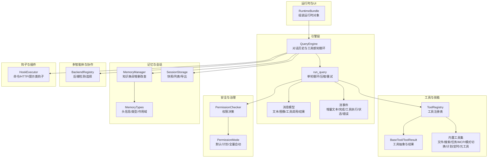
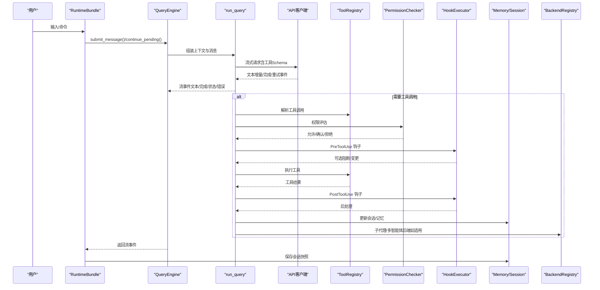
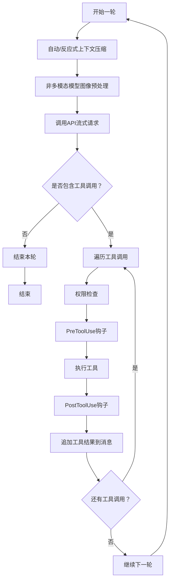
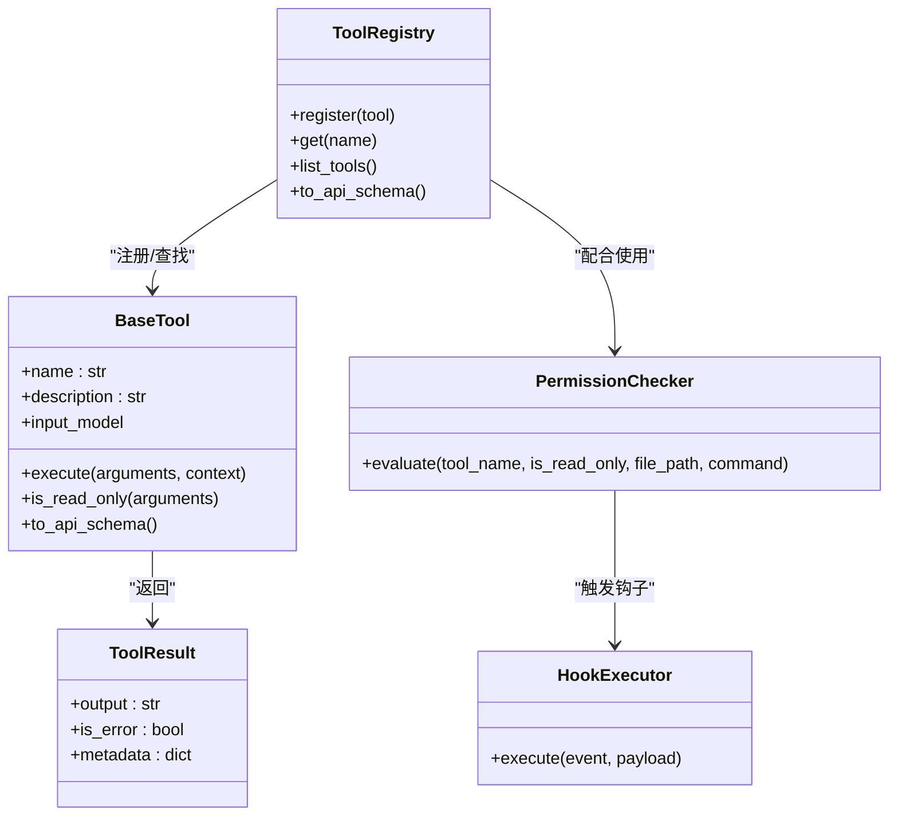
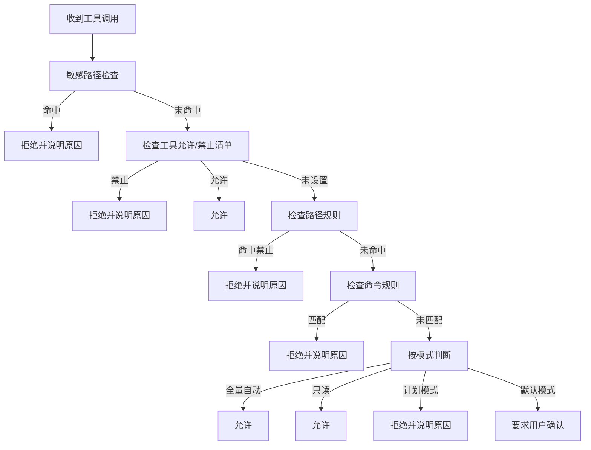
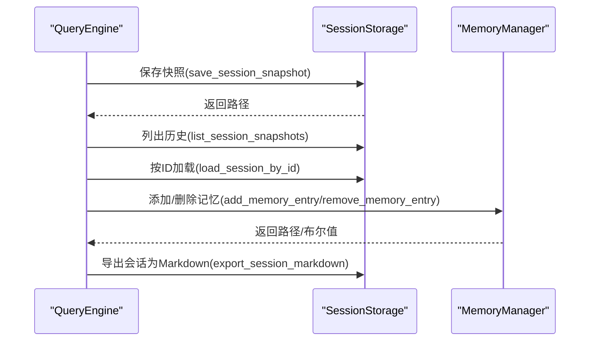
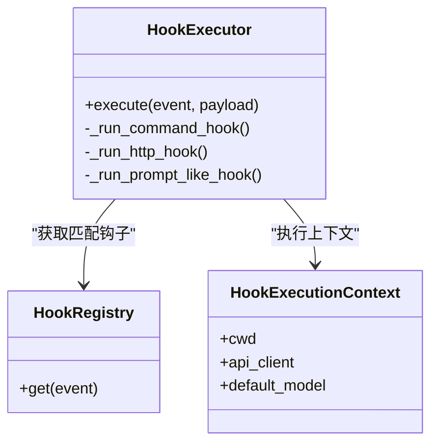
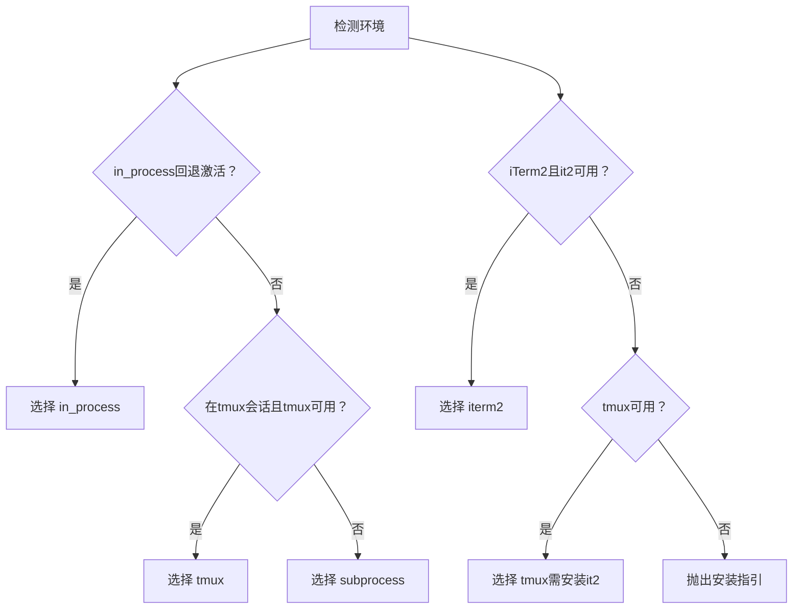
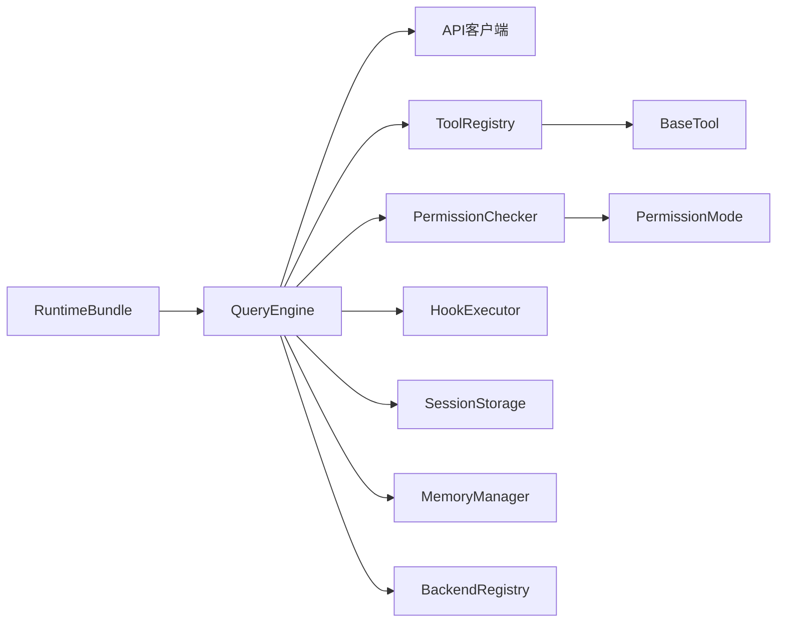

# 核心概念

<cite>
**本文引用的文件**
- [README.md](file://README.md)
- [query_engine.py](file://src/openharness/engine/query_engine.py)
- [query.py](file://src/openharness/engine/query.py)
- [messages.py](file://src/openharness/engine/messages.py)
- [stream_events.py](file://src/openharness/engine/stream_events.py)
- [base.py](file://src/openharness/tools/base.py)
- [__init__.py](file://src/openharness/tools/__init__.py)
- [checker.py](file://src/openharness/permissions/checker.py)
- [modes.py](file://src/openharness/permissions/modes.py)
- [manager.py](file://src/openharness/memory/manager.py)
- [types.py](file://src/openharness/memory/types.py)
- [registry.py](file://src/openharness/swarm/registry.py)
- [executor.py](file://src/openharness/hooks/executor.py)
- [session_storage.py](file://src/openharness/services/session_storage.py)
- [runtime.py](file://src/openharness/ui/runtime.py)
</cite>

## 目录
1. [引言](#引言)
2. [项目结构](#项目结构)
3. [核心组件](#核心组件)
4. [架构总览](#架构总览)
5. [详细组件分析](#详细组件分析)
6. [依赖分析](#依赖分析)
7. [性能考量](#性能考量)
8. [故障排查指南](#故障排查指南)
9. [结论](#结论)
10. [附录](#附录)

## 引言
本文件面向不同经验水平的开发者，系统化阐述 OpenHarness 的核心概念与实现：代理循环（Agent Loop）、工具系统、权限控制、会话与记忆、插件与钩子、多智能体协作等。通过代码级图示与路径引用，帮助读者建立对系统工作流、数据流与控制流的深入理解，并提供可操作的使用模式与最佳实践。

## 项目结构
OpenHarness 将“模型 + 工具 + 知识 + 观测 + 安全边界”整合为一个可扩展的“代理夹具”（Agent Harness）。其核心子系统围绕引擎、工具、技能、权限、钩子、命令、MCP、内存、任务、协调器、提示工程、配置、UI 等模块协同工作。

图表来源
- [query_engine.py:21-307](file://src/openharness/engine/query_engine.py#L21-L307)
- [query.py:633-800](file://src/openharness/engine/query.py#L633-L800)
- [messages.py:65-223](file://src/openharness/engine/messages.py#L65-L223)
- [stream_events.py:12-91](file://src/openharness/engine/stream_events.py#L12-L91)
- [base.py:35-81](file://src/openharness/tools/base.py#L35-L81)
- [__init__.py:48-108](file://src/openharness/tools/__init__.py#L48-L108)
- [checker.py:57-201](file://src/openharness/permissions/checker.py#L57-L201)
- [modes.py:8-14](file://src/openharness/permissions/modes.py#L8-L14)
- [manager.py:34-184](file://src/openharness/memory/manager.py#L34-L184)
- [types.py:10-34](file://src/openharness/memory/types.py#L10-L34)
- [registry.py:97-411](file://src/openharness/swarm/registry.py#L97-L411)
- [executor.py:41-243](file://src/openharness/hooks/executor.py#L41-L243)
- [session_storage.py:63-231](file://src/openharness/services/session_storage.py#L63-L231)
- [runtime.py:120-443](file://src/openharness/ui/runtime.py#L120-L443)

章节来源
- [README.md:446-502](file://README.md#L446-L502)
- [runtime.py:246-443](file://src/openharness/ui/runtime.py#L246-L443)

## 核心组件
- 代理循环（Agent Loop）
  - QueryEngine 负责维护对话历史、系统提示、模型参数与工具元数据；在每轮中调用 run_query，驱动模型生成文本或请求工具调用，并在工具执行前后注入权限检查、钩子与会话记忆。
  - run_query 实现“模型流式输出 → 判断是否需要工具 → 并行/串行执行工具 → 追加结果 → 继续下一轮”的循环，内置上下文压缩、令牌上限保护、网络/超时重试与错误分类处理。
- 工具系统
  - ToolRegistry 提供统一注册表，BaseTool 抽象定义工具名称、描述、输入模型与执行接口；create_default_tool_registry 汇聚 43+ 内置工具，支持 MCP 动态注入。
- 权限控制
  - PermissionChecker 基于多级模式（默认/计划/全量自动）与路径规则、命令模式匹配进行即时决策；内置敏感路径白名单保护与 Bash 命令提示。
- 记忆与会话
  - MemoryManager 提供知识条目的增删改查与索引管理；SessionStorage 支持按项目目录持久化会话快照、列出历史与导出 Markdown。
- 钩子与插件
  - HookExecutor 执行命令/HTTP/提示类钩子，支持阻断失败、超时与 JSON 结果解析；插件可扩展工具与命令。
- 多智能体协作
  - BackendRegistry 自动检测 tmux/iTerm2/子进程等后端，提供 in-process 回退策略，支撑异步子代理生命周期。

章节来源
- [query_engine.py:21-307](file://src/openharness/engine/query_engine.py#L21-L307)
- [query.py:633-800](file://src/openharness/engine/query.py#L633-L800)
- [base.py:35-81](file://src/openharness/tools/base.py#L35-L81)
- [__init__.py:48-108](file://src/openharness/tools/__init__.py#L48-L108)
- [checker.py:57-201](file://src/openharness/permissions/checker.py#L57-L201)
- [modes.py:8-14](file://src/openharness/permissions/modes.py#L8-L14)
- [manager.py:34-184](file://src/openharness/memory/manager.py#L34-L184)
- [session_storage.py:63-231](file://src/openharness/services/session_storage.py#L63-L231)
- [executor.py:41-243](file://src/openharness/hooks/executor.py#L41-L243)
- [registry.py:97-411](file://src/openharness/swarm/registry.py#L97-L411)

## 架构总览
下图展示从用户输入到模型响应、工具调用与结果回灌的完整链路，以及与权限、钩子、会话存储、MCP、多智能体后端的交互。

图表来源
- [runtime.py:579-732](file://src/openharness/ui/runtime.py#L579-L732)
- [query_engine.py:227-307](file://src/openharness/engine/query_engine.py#L227-L307)
- [query.py:633-800](file://src/openharness/engine/query.py#L633-L800)
- [messages.py:65-223](file://src/openharness/engine/messages.py#L65-L223)
- [stream_events.py:12-91](file://src/openharness/engine/stream_events.py#L12-L91)
- [base.py:35-81](file://src/openharness/tools/base.py#L35-L81)
- [checker.py:75-156](file://src/openharness/permissions/checker.py#L75-L156)
- [executor.py:64-212](file://src/openharness/hooks/executor.py#L64-L212)
- [session_storage.py:63-108](file://src/openharness/services/session_storage.py#L63-L108)
- [registry.py:128-183](file://src/openharness/swarm/registry.py#L128-L183)

## 详细组件分析

### 代理循环（Agent Loop）与消息处理
- 循环控制
  - QueryEngine.submit_message/continue_pending 负责追加用户消息、准备会话记忆、构建查询上下文并驱动 run_query。
  - run_query 在每轮开始前检查并触发自动/反应式上下文压缩；对非多模态模型自动预处理图片为文本；捕获并分类 API 错误（令牌上限、上下文过长、网络异常），必要时进行重试或降采样。
- 工具调用循环
  - 当模型返回 tool_use，引擎遍历工具调用，逐个执行：权限检查、PreToolUse 钩子、工具执行、PostToolUse 钩子、结果归档与会话更新。
- 事件与流式输出
  - AssistantTextDelta 用于增量文本渲染；AssistantTurnComplete 标记一轮结束；ToolExecutionStarted/Completed 提供工具执行阶段事件；StatusEvent/ErrorEvent 用于状态与错误提示；CompactProgressEvent 描述压缩进度。
- 数据模型
  - ConversationMessage/ContentBlock（文本/图像/工具调用/工具结果）统一承载消息内容；sanitize_conversation_messages 清理不合规尾部工具回合，保证恢复会话的兼容性。

图表来源
- [query_engine.py:227-307](file://src/openharness/engine/query_engine.py#L227-L307)
- [query.py:633-800](file://src/openharness/engine/query.py#L633-L800)
- [messages.py:119-171](file://src/openharness/engine/messages.py#L119-L171)
- [stream_events.py:12-91](file://src/openharness/engine/stream_events.py#L12-L91)

章节来源
- [query_engine.py:21-307](file://src/openharness/engine/query_engine.py#L21-L307)
- [query.py:633-800](file://src/openharness/engine/query.py#L633-L800)
- [messages.py:65-223](file://src/openharness/engine/messages.py#L65-L223)
- [stream_events.py:12-91](file://src/openharness/engine/stream_events.py#L12-L91)

### 工具系统：注册表、执行流程与权限集成
- 注册表与工具抽象
  - ToolRegistry 提供注册/查找/导出 API Schema；BaseTool 定义工具名称、描述、输入模型与执行接口；ToolResult 规范化输出与错误标记。
  - create_default_tool_registry 汇聚文件/搜索/任务/MCP/模式切换/计划/定时/元工具等 43+ 内置工具，并根据 MCP 管理器动态注入远程工具。
- 执行流程
  - run_query 中解析工具调用，经 PermissionChecker 决策后，交由 HookExecutor 执行 PreToolUse/PostToolUse 生命周期钩子，再调用具体工具执行，最后将结果以 ToolResultBlock 归档至消息。
- 权限集成
  - 权限检查贯穿工具执行前（读写/命令/路径规则/敏感路径保护），并在默认模式下对变更型操作要求交互确认；计划模式完全阻断写入。

图表来源
- [base.py:35-81](file://src/openharness/tools/base.py#L35-L81)
- [__init__.py:48-108](file://src/openharness/tools/__init__.py#L48-L108)
- [checker.py:57-156](file://src/openharness/permissions/checker.py#L57-L156)
- [executor.py:64-78](file://src/openharness/hooks/executor.py#L64-L78)

章节来源
- [base.py:17-81](file://src/openharness/tools/base.py#L17-L81)
- [__init__.py:48-108](file://src/openharness/tools/__init__.py#L48-L108)
- [checker.py:57-156](file://src/openharness/permissions/checker.py#L57-L156)
- [executor.py:41-243](file://src/openharness/hooks/executor.py#L41-L243)

### 权限控制系统：设计理念与实现细节
- 多级模式
  - 默认：对变更型操作要求确认；只读工具直接放行；计划模式完全阻断写入；全量自动允许一切。
- 路径与命令规则
  - 支持基于 glob 的路径规则与命令模式匹配；内置敏感路径白名单（SSH、AWS、GCP、Azure、GPG、Docker、K8s、OpenHarness 凭据等）。
- 决策流程
  - 优先匹配敏感路径保护；其次检查显式允许/禁止清单；再匹配路径规则与命令规则；最后依据模式决定是否放行或要求确认；对 Bash 命令提供额外提示。

图表来源
- [checker.py:75-156](file://src/openharness/permissions/checker.py#L75-L156)
- [modes.py:8-14](file://src/openharness/permissions/modes.py#L8-L14)

章节来源
- [checker.py:14-201](file://src/openharness/permissions/checker.py#L14-L201)
- [modes.py:8-14](file://src/openharness/permissions/modes.py#L8-L14)

### 会话管理与记忆系统
- 会话快照
  - 保存最新与指定 ID 的会话 JSON，包含模型、系统提示、消息序列、用量统计与可持久化工具元数据；支持列出历史与按 ID 加载；导出 Markdown 转录。
- 记忆条目
  - 增删改查知识条目，自动去重与签名，维护索引文件；支持团队级机密校验与锁定；提供原子写入与文件锁保障一致性。
- 元数据携带
  - QueryEngine 在提交/继续时将工具元数据（如权限模式、最近工作日志、任务焦点、异步代理状态等）随轮次传递，确保跨轮次上下文一致。

图表来源
- [session_storage.py:63-231](file://src/openharness/services/session_storage.py#L63-L231)
- [manager.py:39-184](file://src/openharness/memory/manager.py#L39-L184)
- [query_engine.py:155-184](file://src/openharness/engine/query_engine.py#L155-L184)

章节来源
- [session_storage.py:18-231](file://src/openharness/services/session_storage.py#L18-L231)
- [manager.py:34-184](file://src/openharness/memory/manager.py#L34-L184)
- [types.py:10-34](file://src/openharness/memory/types.py#L10-L34)

### 插件机制与钩子系统
- 钩子类型
  - 命令钩子：在沙箱中执行外部命令，支持超时与阻断；HTTP 钩子：向远端服务 POST 事件负载；提示类钩子：通过模型判定条件是否满足。
- 匹配与注入
  - 基于事件与负载字段（如 tool_name/prompt/event）进行通配匹配；支持将负载序列化为环境变量或参数注入命令模板。
- 生命周期
  - RuntimeBundle 在会话开始/结束时触发 SESSION_START/SESSION_END；命令执行前后可插入钩子以实现审计、告警、二次验证等。

图表来源
- [executor.py:41-243](file://src/openharness/hooks/executor.py#L41-L243)
- [runtime.py:446-471](file://src/openharness/ui/runtime.py#L446-L471)

章节来源
- [executor.py:41-243](file://src/openharness/hooks/executor.py#L41-L243)
- [runtime.py:446-471](file://src/openharness/ui/runtime.py#L446-L471)

### 多智能体与团队协作
- 后端检测与选择
  - BackendRegistry 优先选择 in_process（若已启用回退）→ tmux（在会话内且二进制可用）→ subprocess（安全回退）；同时提供面板后端检测（tmux/iTerm2/外部 tmux）。
- 回退策略
  - 若面板后端不可用，标记 in-process 回退，后续统一使用 in_process，直至进程重启或显式切换。
- 应用场景
  - 通过 agent/send_message 等工具触发异步子代理任务，结合任务聚焦状态与工作日志记录，形成可追踪的协作闭环。

图表来源
- [registry.py:128-268](file://src/openharness/swarm/registry.py#L128-L268)

章节来源
- [registry.py:97-411](file://src/openharness/swarm/registry.py#L97-L411)

## 依赖分析
- 组件耦合
  - QueryEngine 依赖 API 客户端、ToolRegistry、PermissionChecker、HookExecutor、会话/记忆服务；run_query 作为核心调度器，串联消息、工具、权限与钩子。
  - ToolRegistry 与 BaseTool 低耦合，便于插件扩展；权限检查与钩子解耦，支持灵活策略组合。
- 外部依赖与集成点
  - API 客户端（Anthropic/Claude、Copilot、Codex、OpenAI 兼容）；MCP 管理器；Docker 沙箱；终端面板（tmux/iTerm2）。
- 潜在循环依赖
  - 通过模块导入分层避免循环；RuntimeBundle 作为装配中心，避免跨模块直接耦合。

图表来源
- [runtime.py:246-443](file://src/openharness/ui/runtime.py#L246-L443)
- [query_engine.py:21-120](file://src/openharness/engine/query_engine.py#L21-L120)
- [base.py:35-81](file://src/openharness/tools/base.py#L35-L81)
- [checker.py:57-156](file://src/openharness/permissions/checker.py#L57-L156)
- [executor.py:41-78](file://src/openharness/hooks/executor.py#L41-L78)
- [session_storage.py:63-108](file://src/openharness/services/session_storage.py#L63-L108)
- [manager.py:34-121](file://src/openharness/memory/manager.py#L34-L121)
- [registry.py:97-183](file://src/openharness/swarm/registry.py#L97-L183)

章节来源
- [runtime.py:246-443](file://src/openharness/ui/runtime.py#L246-L443)
- [query_engine.py:21-120](file://src/openharness/engine/query_engine.py#L21-L120)

## 性能考量
- 上下文压缩
  - 自动/反应式压缩在令牌阈值触发时先尝试微压缩（清理旧工具结果），仍不足则进行 LLM 主持的摘要压缩，减少重复计算与传输。
- 令牌上限保护
  - 对请求 max_tokens 进行安全上限裁剪，适配不同供应商限制；当模型返回令牌上限错误时，动态调整并重试。
- 并行工具执行
  - 工具调用循环支持并发执行（由上层调用方与工具实现决定），提升吞吐；同时注意资源竞争与幂等性。
- 会话与记忆持久化
  - 仅持久化受控键集合，避免冗余；原子写入与文件锁降低竞态风险。
- UI 与事件流
  - 使用增量事件（AssistantTextDelta）与状态事件（StatusEvent）保持界面响应性；错误事件（ErrorEvent）统一格式化提示。

[本节为通用指导，无需特定文件引用]

## 故障排查指南
- 常见错误与处理
  - “提示过长/上下文超出”：触发反应式压缩；检查 auto_compact_threshold_tokens 与 context_window_tokens 设置。
  - “令牌上限过大/不支持”：自动裁剪 max_tokens 并重试；必要时降低 max_tokens 或开启自动压缩。
  - “网络/连接/超时”：输出 ErrorEvent 并提示检查网络；可增加重试等待或调整超时配置。
  - “空助手消息”：丢弃并警告，避免污染会话；检查上游模型输出与消息规范化。
- 权限相关
  - 明确拒绝原因（敏感路径/路径规则/命令规则/模式限制）；在默认模式下可通过交互确认或切换到全量自动/计划模式。
- 会话恢复
  - 使用 list_session_snapshots 查看历史；load_session_by_id 恢复指定会话；export_session_markdown 导出转录以便复盘。
- 钩子问题
  - 命令钩子超时/失败会阻断（取决于 block_on_failure）；HTTP 钩子失败会记录状态码与响应；提示类钩子需返回严格 JSON {"ok": true/false}。

章节来源
- [query.py:66-127](file://src/openharness/engine/query.py#L66-L127)
- [query.py:753-782](file://src/openharness/engine/query.py#L753-L782)
- [checker.py:75-156](file://src/openharness/permissions/checker.py#L75-L156)
- [session_storage.py:131-207](file://src/openharness/services/session_storage.py#L131-L207)
- [executor.py:80-136](file://src/openharness/hooks/executor.py#L80-L136)
- [executor.py:138-167](file://src/openharness/hooks/executor.py#L138-L167)
- [executor.py:169-212](file://src/openharness/hooks/executor.py#L169-L212)

## 结论
OpenHarness 通过“工具感知的代理循环 + 分层权限 + 钩子与插件 + 会话与记忆 + 多智能体后端”的架构，实现了可观察、可扩展、可治理的智能体基础设施。开发者可基于工具抽象快速扩展能力，利用权限与钩子保障安全与可观测性，借助会话与记忆实现长期任务与跨轮次上下文延续，并通过多智能体后端支撑复杂协作场景。

[本节为总结性内容，无需特定文件引用]

## 附录
- 使用模式建议
  - 新增自定义工具：继承 BaseTool，定义输入模型与执行逻辑，注册到 ToolRegistry；在权限模式下测试变更型工具。
  - 新增钩子：编写命令/HTTP/提示类钩子，按事件与负载匹配；在开发阶段启用阻断失败以快速定位问题。
  - 会话管理：定期导出会话转录；合理设置 auto_compact_threshold_tokens 与 max_turns；在 CI/脚本中使用 --output-format stream-json 获取事件流。
  - 多智能体：在支持的终端环境中启用 tmux/iTerm2；关注子代理任务状态与通知，必要时回退到 in_process。

[本节为通用指导，无需特定文件引用]