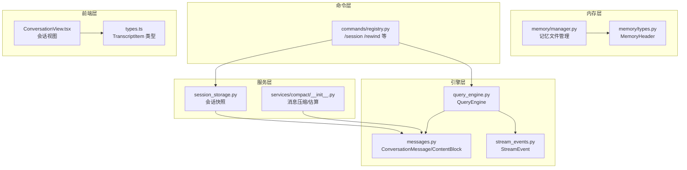
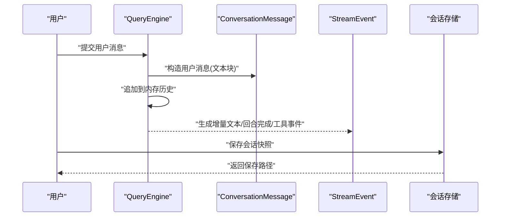
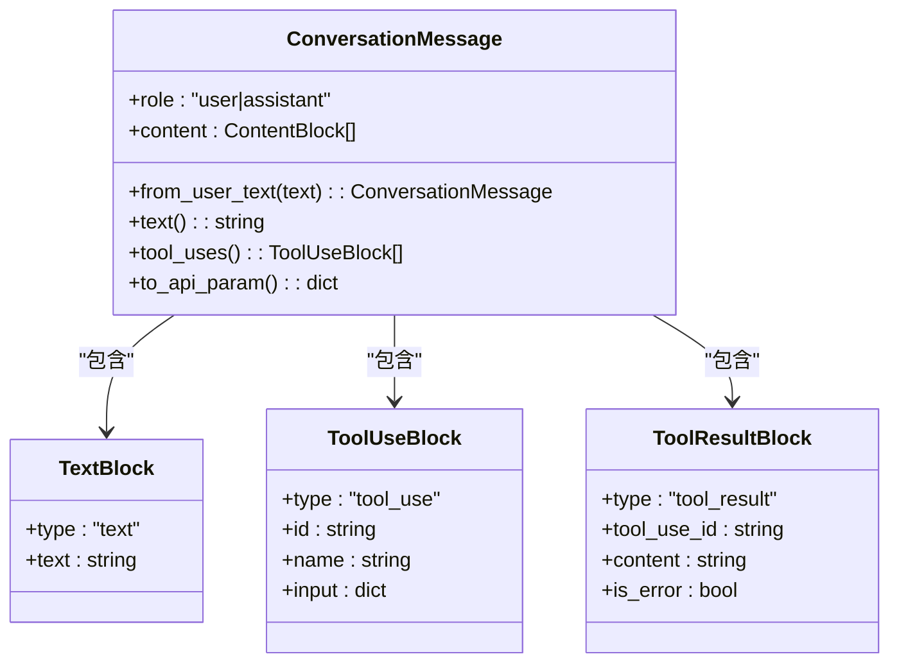
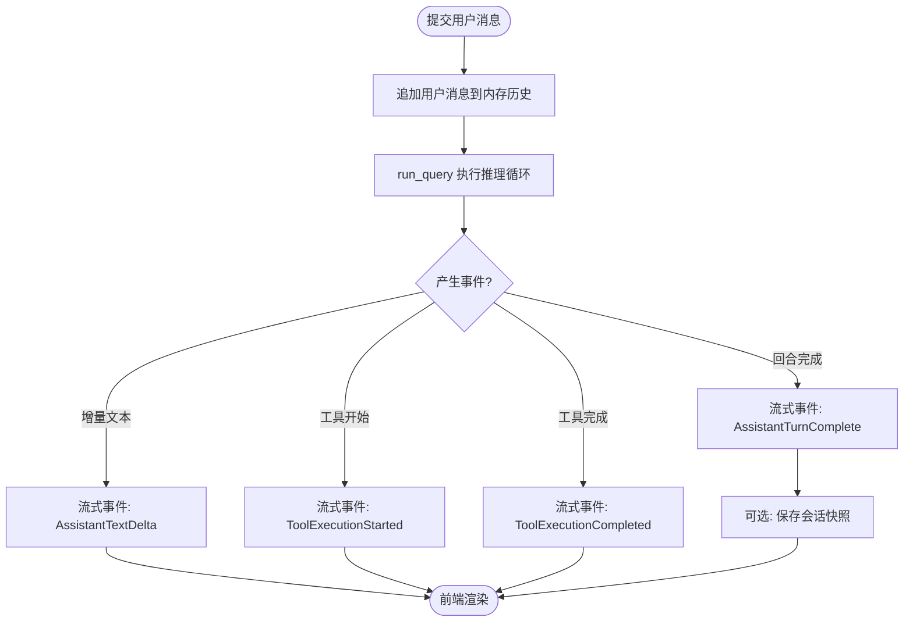
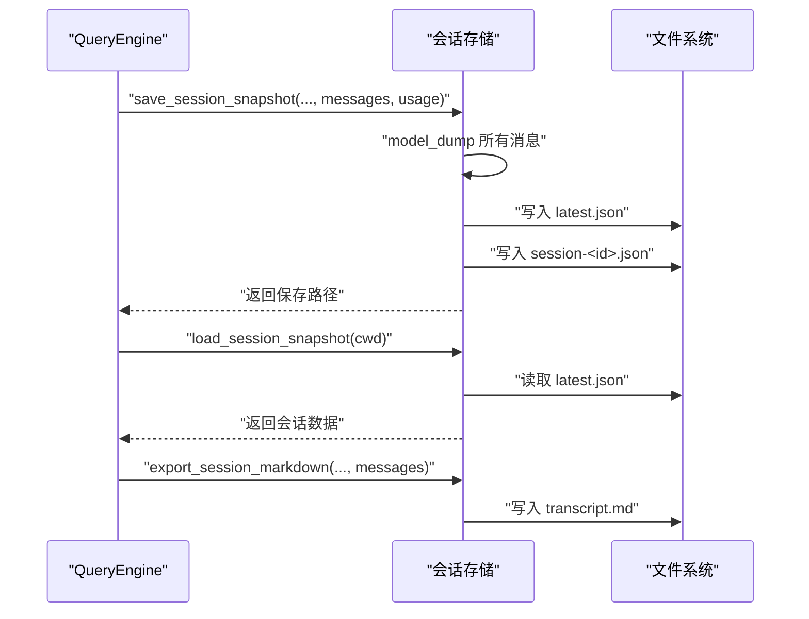
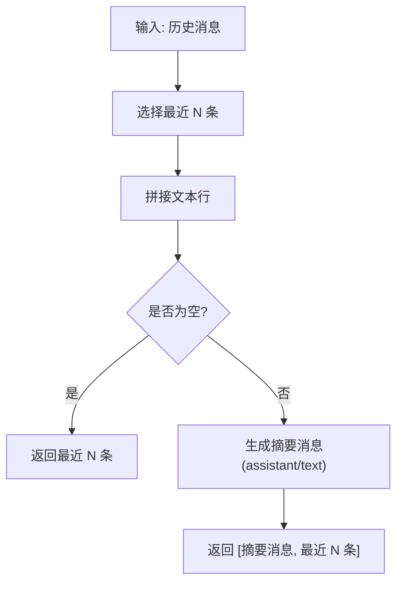
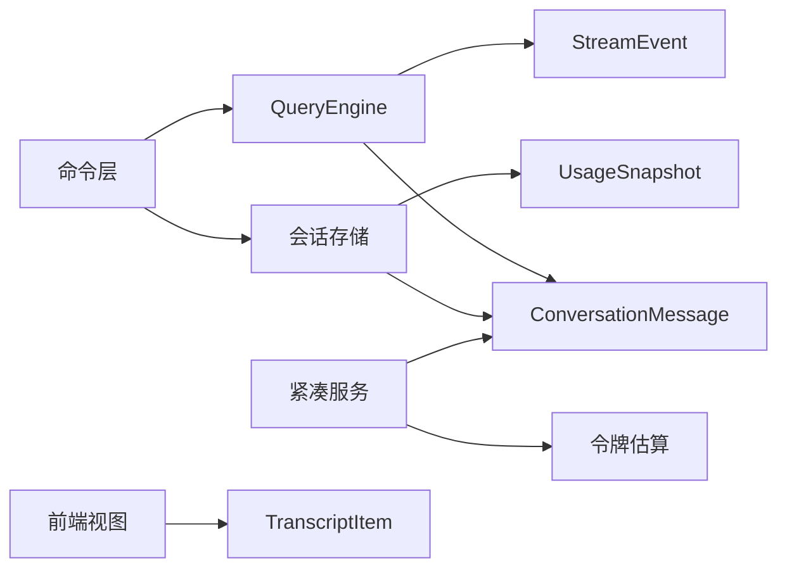

# 消息抽象与管理

<cite>
**本文引用的文件**
- [src/openharness/engine/messages.py](file://src/openharness/engine/messages.py)
- [src/openharness/engine/query_engine.py](file://src/openharness/engine/query_engine.py)
- [src/openharness/services/session_storage.py](file://src/openharness/services/session_storage.py)
- [src/openharness/services/compact/__init__.py](file://src/openharness/services/compact/__init__.py)
- [src/openharness/engine/stream_events.py](file://src/openharness/engine/stream_events.py)
- [src/openharness/memory/types.py](file://src/openharness/memory/types.py)
- [src/openharness/memory/manager.py](file://src/openharness/memory/manager.py)
- [src/openharness/commands/registry.py](file://src/openharness/commands/registry.py)
- [frontend/terminal/src/components/ConversationView.tsx](file://frontend/terminal/src/components/ConversationView.tsx)
- [frontend/terminal/src/types.ts](file://frontend/terminal/src/types.ts)
</cite>

## 目录
1. [引言](#引言)
2. [项目结构](#项目结构)
3. [核心组件](#核心组件)
4. [架构总览](#架构总览)
5. [详细组件分析](#详细组件分析)
6. [依赖分析](#依赖分析)
7. [性能考虑](#性能考虑)
8. [故障排查指南](#故障排查指南)
9. [结论](#结论)
10. [附录：消息格式与扩展规范](#附录消息格式与扩展规范)

## 引言
本文件聚焦 OpenHarness 的消息抽象与管理机制，围绕 ConversationMessage 及其内容块（ContentBlock）模型展开，系统阐述消息的建模、序列化/反序列化、持久化与会话存储、对话历史的检索与内存管理、消息元数据与来源标识、消息过滤/去重/聚合策略，以及消息格式标准与扩展指南。目标是帮助开发者在不直接阅读代码的前提下，全面理解消息层的设计与使用方式。

## 项目结构
消息系统主要分布在以下模块：
- 引擎层：消息模型与序列化、查询引擎中的消息管理
- 服务层：会话快照的保存/加载/导出
- 紧凑服务：消息压缩与令牌估算
- 内存层：项目记忆文件的管理
- 命令层：会话操作命令（列出、标记、回溯等）
- 前端层：会话展示与转录项类型

图表来源
- [src/openharness/engine/messages.py:1-109](file://src/openharness/engine/messages.py#L1-L109)
- [src/openharness/engine/query_engine.py:1-101](file://src/openharness/engine/query_engine.py#L1-L101)
- [src/openharness/engine/stream_events.py:1-49](file://src/openharness/engine/stream_events.py#L1-L49)
- [src/openharness/services/session_storage.py:1-178](file://src/openharness/services/session_storage.py#L1-L178)
- [src/openharness/services/compact/__init__.py:1-57](file://src/openharness/services/compact/__init__.py#L1-L57)
- [src/openharness/memory/types.py:1-17](file://src/openharness/memory/types.py#L1-L17)
- [src/openharness/memory/manager.py:1-51](file://src/openharness/memory/manager.py#L1-L51)
- [src/openharness/commands/registry.py:470-482](file://src/openharness/commands/registry.py#L470-L482)
- [frontend/terminal/src/components/ConversationView.tsx:1-54](file://frontend/terminal/src/components/ConversationView.tsx#L1-L54)
- [frontend/terminal/src/types.ts:6-12](file://frontend/terminal/src/types.ts#L6-L12)

章节来源
- [src/openharness/engine/messages.py:1-109](file://src/openharness/engine/messages.py#L1-L109)
- [src/openharness/engine/query_engine.py:1-101](file://src/openharness/engine/query_engine.py#L1-L101)
- [src/openharness/services/session_storage.py:1-178](file://src/openharness/services/session_storage.py#L1-L178)
- [src/openharness/services/compact/__init__.py:1-57](file://src/openharness/services/compact/__init__.py#L1-L57)
- [src/openharness/memory/manager.py:1-51](file://src/openharness/memory/manager.py#L1-L51)
- [src/openharness/commands/registry.py:470-482](file://src/openharness/commands/registry.py#L470-L482)
- [frontend/terminal/src/components/ConversationView.tsx:1-54](file://frontend/terminal/src/components/ConversationView.tsx#L1-L54)
- [frontend/terminal/src/types.ts:6-12](file://frontend/terminal/src/types.ts#L6-L12)

## 核心组件
- ConversationMessage：单条用户或助手消息，包含角色与内容块列表
- ContentBlock：内容块联合类型，支持文本、工具调用、工具结果三类
- TextBlock/ToolUseBlock/ToolResultBlock：三类内容块的具体模型
- QueryEngine：持有对话历史，负责消息追加与流式事件产出
- StreamEvent：流式事件类型，承载增量文本、回合完成、工具执行开始/完成等
- 会话存储：基于 JSON 的快照持久化，支持按 ID 与“最新”两种命名
- 紧凑服务：消息压缩与令牌估算，用于控制上下文长度
- 记忆文件：项目级记忆文件的增删与索引维护
- 命令接口：/session 与 /rewind 等命令对会话进行管理与回溯

章节来源
- [src/openharness/engine/messages.py:11-109](file://src/openharness/engine/messages.py#L11-L109)
- [src/openharness/engine/query_engine.py:18-101](file://src/openharness/engine/query_engine.py#L18-L101)
- [src/openharness/engine/stream_events.py:12-49](file://src/openharness/engine/stream_events.py#L12-L49)
- [src/openharness/services/session_storage.py:26-178](file://src/openharness/services/session_storage.py#L26-L178)
- [src/openharness/services/compact/__init__.py:9-57](file://src/openharness/services/compact/__init__.py#L9-L57)
- [src/openharness/memory/manager.py:11-51](file://src/openharness/memory/manager.py#L11-L51)
- [src/openharness/commands/registry.py:470-482](file://src/openharness/commands/registry.py#L470-L482)

## 架构总览
消息从用户输入进入 QueryEngine，经由内容块封装后写入内存历史；同时通过流式事件向前端推送增量文本与工具执行状态；最终可持久化为会话快照，供后续加载与导出。

图表来源
- [src/openharness/engine/query_engine.py:81-101](file://src/openharness/engine/query_engine.py#L81-L101)
- [src/openharness/engine/messages.py:39-67](file://src/openharness/engine/messages.py#L39-L67)
- [src/openharness/engine/stream_events.py:12-49](file://src/openharness/engine/stream_events.py#L12-L49)
- [src/openharness/services/session_storage.py:26-67](file://src/openharness/services/session_storage.py#L26-L67)

## 详细组件分析

### ConversationMessage 与内容块模型
- 角色限定为 user 或 assistant
- 内容块列表默认为空，支持三种类型：
  - 文本块：纯文本
  - 工具调用块：包含唯一 id、名称与输入参数
  - 工具结果块：包含对应工具调用 id、结果内容与错误标志
- 提供便捷构造器与属性：
  - from_user_text：从原始文本快速构造用户消息
  - text 属性：拼接所有文本块
  - tool_uses 属性：提取所有工具调用块
  - to_api_param：转换为外部 SDK 参数格式
- 序列化/反序列化：
  - serialize_content_block：本地内容块转对外 wire 格式
  - assistant_message_from_api：从外部 SDK 消息对象还原为 ConversationMessage

图表来源
- [src/openharness/engine/messages.py:11-109](file://src/openharness/engine/messages.py#L11-L109)

章节来源
- [src/openharness/engine/messages.py:11-109](file://src/openharness/engine/messages.py#L11-L109)

### 查询引擎与消息生命周期
- QueryEngine 维护内存中的对话历史列表，并在每次提交时追加一条用户消息
- 运行流程中根据当前历史与工具注册表驱动模型推理，产出流式事件
- 支持清空历史、替换历史、设置系统提示与模型等运行期配置

图表来源
- [src/openharness/engine/query_engine.py:81-101](file://src/openharness/engine/query_engine.py#L81-L101)
- [src/openharness/engine/stream_events.py:12-49](file://src/openharness/engine/stream_events.py#L12-L49)

章节来源
- [src/openharness/engine/query_engine.py:18-101](file://src/openharness/engine/query_engine.py#L18-L101)
- [src/openharness/engine/stream_events.py:12-49](file://src/openharness/engine/stream_events.py#L12-L49)

### 序列化、反序列化与持久化策略
- 本地序列化：
  - ConversationMessage 使用 Pydantic 模型，可通过 model_dump(mode="json") 输出字典
  - 内容块通过 serialize_content_block 转换为对外 wire 格式
- 外部反序列化：
  - assistant_message_from_api 将外部 SDK 的 content 列表还原为本地消息
- 会话快照持久化：
  - 保存为 JSON 文件，包含 session_id、cwd、model、system_prompt、messages、usage、created_at、summary、message_count
  - 同时以 session-<id>.json 与 latest.json 两种形式保存，便于按 ID 或最新会话访问
  - 支持列出历史会话、按 ID 加载、导出 Markdown 转录

图表来源
- [src/openharness/services/session_storage.py:26-178](file://src/openharness/services/session_storage.py#L26-L178)
- [src/openharness/engine/messages.py:51-67](file://src/openharness/engine/messages.py#L51-L67)

章节来源
- [src/openharness/services/session_storage.py:26-178](file://src/openharness/services/session_storage.py#L26-L178)
- [src/openharness/engine/messages.py:51-88](file://src/openharness/engine/messages.py#L51-L88)

### 对话历史存储结构、检索与内存管理
- 存储结构：
  - 会话目录按项目根路径哈希派生，确保多项目隔离
  - 快照文件包含摘要字段，来源于第一条非空用户消息的文本片段
- 检索算法：
  - 列表：优先枚举 session-*.json 并按修改时间排序，再合并 latest.json（若未被覆盖）
  - 加载：优先按 ID 查找 session-<id>.json，否则回退到 latest.json
- 内存管理：
  - QueryEngine 在 clear 时清空历史并重置用量统计
  - 前端仅渲染最近若干条记录，避免无限增长

章节来源
- [src/openharness/services/session_storage.py:17-138](file://src/openharness/services/session_storage.py#L17-L138)
- [src/openharness/engine/query_engine.py:60-63](file://src/openharness/engine/query_engine.py#L60-L63)
- [frontend/terminal/src/components/ConversationView.tsx:17-35](file://frontend/terminal/src/components/ConversationView.tsx#L17-L35)

### 元数据、时间戳与来源标识
- 元数据：
  - 会话快照包含 session_id、cwd、model、system_prompt、message_count、usage 等
- 时间戳：
  - created_at 字段记录保存时间
- 来源标识：
  - messages 中每条消息携带 role（user/assistant），内容块携带 type（text/tool_use/tool_result）

章节来源
- [src/openharness/services/session_storage.py:46-56](file://src/openharness/services/session_storage.py#L46-L56)
- [src/openharness/engine/messages.py:42-43](file://src/openharness/engine/messages.py#L42-L43)

### 消息过滤、去重与聚合
- 过滤：
  - 前端渲染时仅显示可见范围内的最近若干条
  - 会话列表中若摘要缺失，自动从第一条用户消息抽取文本片段
- 去重：
  - 当前未见显式去重逻辑；如需去重可在应用层基于消息指纹或内容哈希实现
- 聚合：
  - 紧凑服务提供“压缩历史为摘要消息”的能力，保留最近若干条，其余以合成摘要替代

图表来源
- [src/openharness/services/compact/__init__.py:25-45](file://src/openharness/services/compact/__init__.py#L25-L45)

章节来源
- [src/openharness/services/compact/__init__.py:9-57](file://src/openharness/services/compact/__init__.py#L9-L57)
- [frontend/terminal/src/components/ConversationView.tsx:17-35](file://frontend/terminal/src/components/ConversationView.tsx#L17-L35)

### 会话命令与回溯
- /session 命令族：
  - show/ls/path/tag/clear：查看、列出、定位、标记与清理会话目录
  - tag 会将当前快照与转录复制为带名称的文件
- /rewind 回溯：
  - 从末尾弹出消息，直到遇到第一个非空用户消息为止，从而回退到上一个完整回合

章节来源
- [src/openharness/commands/registry.py:470-482](file://src/openharness/commands/registry.py#L470-L482)

## 依赖分析
- 模块耦合：
  - QueryEngine 依赖 ConversationMessage 与流式事件类型
  - 会话存储依赖 ConversationMessage 与用量快照
  - 紧凑服务依赖 ConversationMessage 与令牌估算工具
  - 命令层依赖会话存储与 QueryEngine
  - 前端视图依赖 TranscriptItem 类型与消息文本
- 外部依赖：
  - JSON 序列化用于会话持久化
  - Pydantic 用于模型校验与序列化
  - 哈希与路径操作用于会话目录组织

图表来源
- [src/openharness/engine/query_engine.py:10-15](file://src/openharness/engine/query_engine.py#L10-L15)
- [src/openharness/services/session_storage.py:12-14](file://src/openharness/services/session_storage.py#L12-L14)
- [src/openharness/services/compact/__init__.py:5-6](file://src/openharness/services/compact/__init__.py#L5-L6)
- [src/openharness/commands/registry.py:470-482](file://src/openharness/commands/registry.py#L470-L482)
- [frontend/terminal/src/components/ConversationView.tsx:6-12](file://frontend/terminal/src/components/ConversationView.tsx#L6-L12)

章节来源
- [src/openharness/engine/query_engine.py:10-15](file://src/openharness/engine/query_engine.py#L10-L15)
- [src/openharness/services/session_storage.py:12-14](file://src/openharness/services/session_storage.py#L12-L14)
- [src/openharness/services/compact/__init__.py:5-6](file://src/openharness/services/compact/__init__.py#L5-L6)
- [src/openharness/commands/registry.py:470-482](file://src/openharness/commands/registry.py#L470-L482)
- [frontend/terminal/src/components/ConversationView.tsx:6-12](file://frontend/terminal/src/components/ConversationView.tsx#L6-L12)

## 性能考虑
- 上下文长度控制：
  - 使用紧凑服务将历史压缩为摘要消息，减少令牌占用
  - 估算对话总令牌数，辅助阈值控制
- I/O 与序列化：
  - 会话快照采用整包 JSON 写入，建议在批量保存时合并写入，避免频繁落盘
- 内存占用：
  - 前端仅渲染最近若干条，降低渲染压力
  - QueryEngine 清空历史可释放内存

章节来源
- [src/openharness/services/compact/__init__.py:25-57](file://src/openharness/services/compact/__init__.py#L25-L57)
- [src/openharness/engine/query_engine.py:60-63](file://src/openharness/engine/query_engine.py#L60-L63)
- [frontend/terminal/src/components/ConversationView.tsx:17-35](file://frontend/terminal/src/components/ConversationView.tsx#L17-L35)

## 故障排查指南
- 会话加载失败：
  - 检查 latest.json 是否存在且为合法 JSON
  - 若按 ID 加载失败，确认 session-<id>.json 是否存在
- 导出 Markdown 缺失摘要：
  - 确认第一条用户消息包含非空文本块
- 前端不显示消息：
  - 检查 TranscriptItem 的 role 与 text 字段是否正确映射
  - 确认前端仅渲染最近若干条记录

章节来源
- [src/openharness/services/session_storage.py:70-154](file://src/openharness/services/session_storage.py#L70-L154)
- [frontend/terminal/src/types.ts:6-12](file://frontend/terminal/src/types.ts#L6-L12)

## 结论
OpenHarness 的消息抽象以 ConversationMessage 为核心，结合三类内容块实现对文本、工具调用与工具结果的统一建模；通过流式事件与会话快照实现从内存到持久化的完整闭环；配合紧凑服务与前端裁剪策略，有效控制上下文长度与渲染开销。命令层提供了会话管理与回溯能力，满足日常调试与复盘需求。

## 附录：消息格式与扩展规范

### 消息与内容块格式
- ConversationMessage
  - 字段：role（"user"|"assistant"）、content（ContentBlock 列表）
  - 方法：from_user_text、text、tool_uses、to_api_param
- ContentBlock 联合类型
  - 文本块：type="text"，text=str
  - 工具调用块：type="tool_use"，id=str（唯一）、name=str、input=dict
  - 工具结果块：type="tool_result"，tool_use_id=str、content=str、is_error=bool
- 外部 SDK 映射
  - assistant_message_from_api：将外部 SDK 的 content 列表还原为本地消息

章节来源
- [src/openharness/engine/messages.py:11-109](file://src/openharness/engine/messages.py#L11-L109)

### 序列化与反序列化
- 本地序列化：使用 Pydantic 的 model_dump(mode="json") 输出字典
- wire 格式：serialize_content_block 将本地内容块转换为对外格式
- 外部反序列化：assistant_message_from_api 将外部 SDK 消息还原为本地消息

章节来源
- [src/openharness/engine/messages.py:51-109](file://src/openharness/engine/messages.py#L51-L109)

### 会话快照字段规范
- session_id：会话唯一标识
- cwd：项目工作目录
- model：当前模型名
- system_prompt：系统提示词
- messages：消息数组（每条消息为字典）
- usage：用量快照
- created_at：保存时间戳
- summary：摘要（来自第一条非空用户消息）
- message_count：消息数量

章节来源
- [src/openharness/services/session_storage.py:46-56](file://src/openharness/services/session_storage.py#L46-L56)

### 扩展指南
- 新增内容块类型：
  - 定义新块模型并加入 ContentBlock 联合类型
  - 实现 serialize_content_block 的序列化分支
  - 如需外部 SDK 映射，补充 assistant_message_from_api 的解析分支
- 自定义会话元数据：
  - 在保存时扩展 payload 字段，注意保持向后兼容
- 去重策略：
  - 基于消息指纹或内容哈希在应用层实现去重逻辑
- 聚合策略：
  - 可在紧凑服务基础上扩展更细粒度的摘要规则（如按主题分组）

章节来源
- [src/openharness/engine/messages.py:36-88](file://src/openharness/engine/messages.py#L36-L88)
- [src/openharness/services/session_storage.py:46-56](file://src/openharness/services/session_storage.py#L46-L56)
- [src/openharness/services/compact/__init__.py:25-45](file://src/openharness/services/compact/__init__.py#L25-L45)