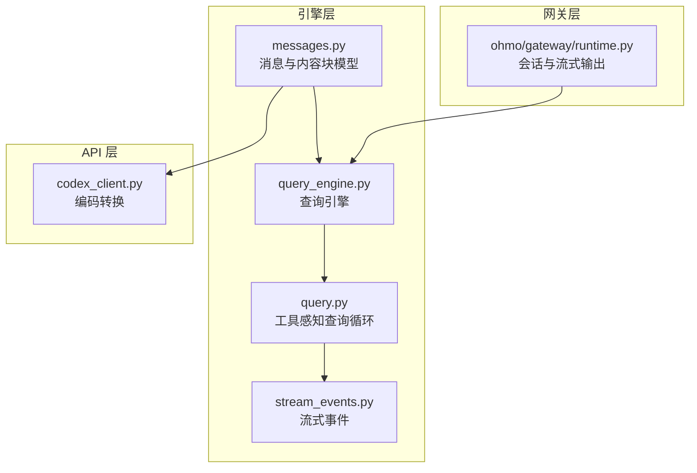
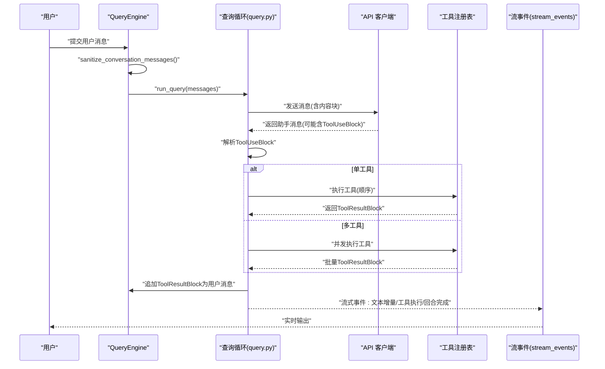
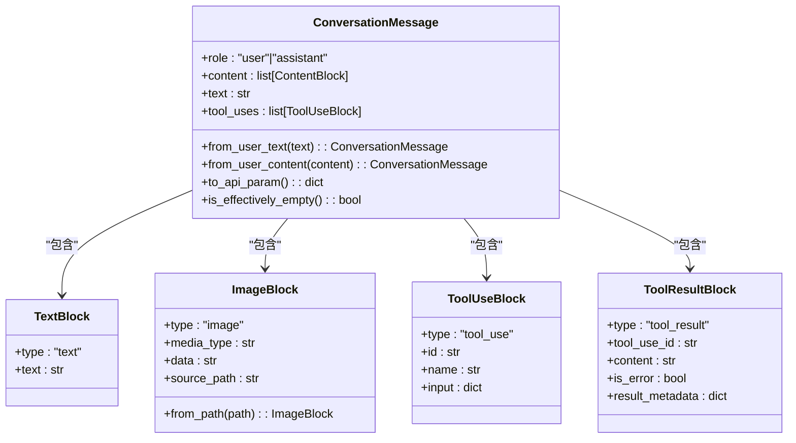
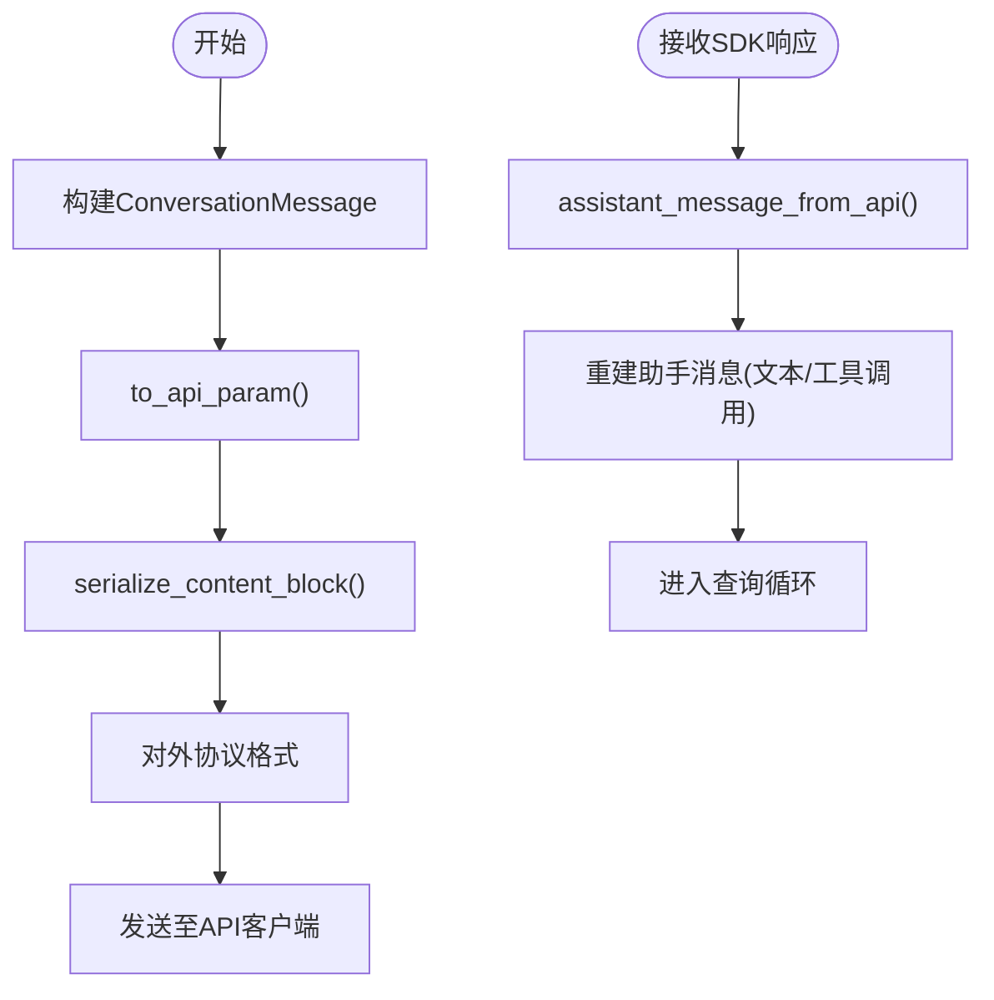
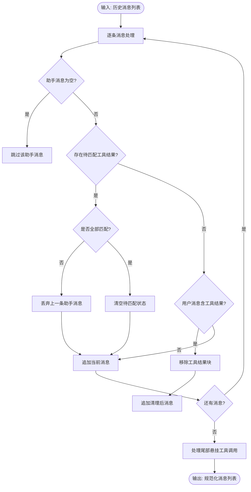
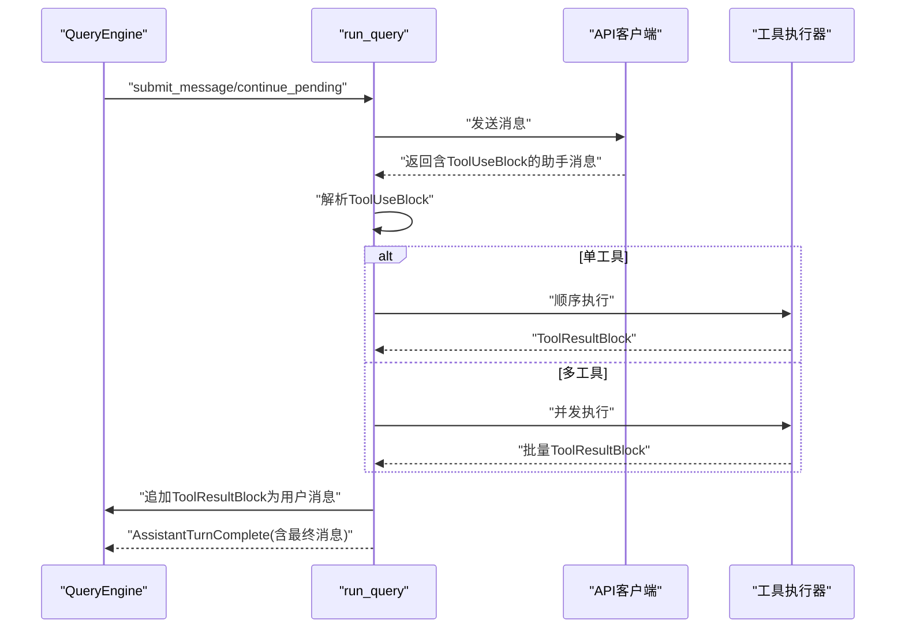
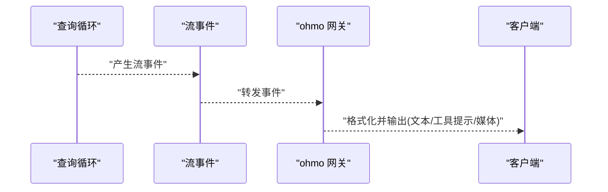
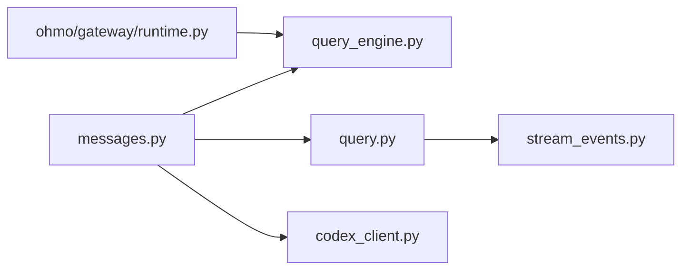

# 消息系统架构

<cite>
**本文引用的文件**
- [src/openharness/engine/messages.py](file://src/openharness/engine/messages.py)
- [tests/test_engine/test_messages.py](file://tests/test_engine/test_messages.py)
- [src/openharness/engine/query_engine.py](file://src/openharness/engine/query_engine.py)
- [src/openharness/engine/query.py](file://src/openharness/engine/query.py)
- [src/openharness/engine/stream_events.py](file://src/openharness/engine/stream_events.py)
- [src/openharness/api/codex_client.py](file://src/openharness/api/codex_client.py)
- [ohmo/gateway/runtime.py](file://ohmo/gateway/runtime.py)
</cite>

## 目录
1. [简介](#简介)
2. [项目结构](#项目结构)
3. [核心组件](#核心组件)
4. [架构总览](#架构总览)
5. [详细组件分析](#详细组件分析)
6. [依赖关系分析](#依赖关系分析)
7. [性能考量](#性能考量)
8. [故障排查指南](#故障排查指南)
9. [结论](#结论)
10. [附录：消息格式与最佳实践](#附录消息格式与最佳实践)

## 简介
本文件面向 OpenHarness 的消息系统，聚焦 ConversationMessage 及其内容块（TextBlock、ImageBlock、ToolUseBlock、ToolResultBlock）的设计与实现，系统阐述消息的序列化/反序列化、清理与验证机制，以及在代理循环中的传递与处理流程。文档同时给出消息格式规范、数据结构定义、使用场景与最佳实践，并通过图示展示关键流程。

## 项目结构
消息系统位于引擎层，围绕 ConversationMessage 与内容块展开，贯穿消息构建、序列化、清理、工具调用回路与事件流输出等环节。下图概览了与消息系统直接相关的模块与交互：

图表来源
- [src/openharness/engine/messages.py:1-223](file://src/openharness/engine/messages.py#L1-L223)
- [src/openharness/engine/query_engine.py:1-307](file://src/openharness/engine/query_engine.py#L1-L307)
- [src/openharness/engine/query.py:1-1058](file://src/openharness/engine/query.py#L1-L1058)
- [src/openharness/engine/stream_events.py:1-91](file://src/openharness/engine/stream_events.py#L1-L91)
- [src/openharness/api/codex_client.py:98-135](file://src/openharness/api/codex_client.py#L98-L135)
- [ohmo/gateway/runtime.py:343-407](file://ohmo/gateway/runtime.py#L343-L407)

章节来源
- [src/openharness/engine/messages.py:1-223](file://src/openharness/engine/messages.py#L1-L223)
- [src/openharness/engine/query_engine.py:1-307](file://src/openharness/engine/query_engine.py#L1-L307)
- [src/openharness/engine/query.py:1-1058](file://src/openharness/engine/query.py#L1-L1058)
- [src/openharness/engine/stream_events.py:1-91](file://src/openharness/engine/stream_events.py#L1-L91)
- [src/openharness/api/codex_client.py:98-135](file://src/openharness/api/codex_client.py#L98-L135)
- [ohmo/gateway/runtime.py:343-407](file://ohmo/gateway/runtime.py#L343-L407)

## 核心组件
- 内容块类型
  - TextBlock：纯文本内容块
  - ImageBlock：多模态图片内容块（内联 base64 编码）
  - ToolUseBlock：模型请求执行的工具调用
  - ToolResultBlock：工具执行结果返回给模型
- ConversationMessage：单条用户或助手消息，由内容块列表组成
- 辅助函数
  - serialize_content_block：将本地内容块序列化为对外协议格式
  - assistant_message_from_api：从外部 SDK 响应构造助手消息
  - sanitize_conversation_messages：恢复历史对话时进行安全规范化与尾部清理

章节来源
- [src/openharness/engine/messages.py:14-222](file://src/openharness/engine/messages.py#L14-L222)

## 架构总览
消息系统围绕“构建—序列化—清理—工具调用—结果回传—事件流输出”闭环工作：
- 构建：通过 ConversationMessage.from_user_text/from_user_content 快速构造用户消息；助手消息由外部 SDK 响应经 assistant_message_from_api 转换
- 序列化：to_api_param 将消息转为 SDK 参数；serialize_content_block 将内容块转为对外协议
- 清理：sanitize_conversation_messages 规范化历史消息，丢弃不完整的工具回合与空消息
- 工具调用：查询循环检测 ToolUseBlock，顺序或并发执行工具，生成 ToolResultBlock 并追加到用户消息
- 事件流：引擎以流式事件形式向外发布增量文本、工具执行状态、最终回合完成等信息

图表来源
- [src/openharness/engine/query_engine.py:227-307](file://src/openharness/engine/query_engine.py#L227-L307)
- [src/openharness/engine/query.py:814-1000](file://src/openharness/engine/query.py#L814-L1000)
- [src/openharness/engine/stream_events.py:12-91](file://src/openharness/engine/stream_events.py#L12-L91)

## 详细组件分析

### ConversationMessage 与内容块类图

图表来源
- [src/openharness/engine/messages.py:14-117](file://src/openharness/engine/messages.py#L14-L117)

章节来源
- [src/openharness/engine/messages.py:14-117](file://src/openharness/engine/messages.py#L14-L117)

### 序列化与反序列化流程
- 序列化
  - ConversationMessage.to_api_param：将消息转为 SDK 参数，内部调用 serialize_content_block
  - serialize_content_block：根据内容块类型输出对应字段（文本、图片 base64、工具调用、工具结果）
- 反序列化
  - assistant_message_from_api：从外部 SDK 响应中提取 content，重建助手消息（仅支持 text/tool_use）

图表来源
- [src/openharness/engine/messages.py:101-222](file://src/openharness/engine/messages.py#L101-L222)

章节来源
- [src/openharness/engine/messages.py:101-222](file://src/openharness/engine/messages.py#L101-L222)

### 消息清理与验证（sanitize_conversation_messages）
该函数用于恢复历史对话时的安全规范化，主要行为：
- 过滤无效/空的助手消息
- 识别并丢弃“悬挂”的工具调用回合（即存在工具调用但未收到匹配的工具结果）
- 在用户消息中移除孤立的工具结果块，保留其他文本内容
- 维护 pending_tool_use_ids 与索引，确保成对的工具调用-结果序列

图表来源
- [src/openharness/engine/messages.py:119-171](file://src/openharness/engine/messages.py#L119-L171)
- [tests/test_engine/test_messages.py:12-62](file://tests/test_engine/test_messages.py#L12-L62)

章节来源
- [src/openharness/engine/messages.py:119-171](file://src/openharness/engine/messages.py#L119-L171)
- [tests/test_engine/test_messages.py:12-62](file://tests/test_engine/test_messages.py#L12-L62)

### 工具调用与消息回环（QueryEngine 与 query.py）
- QueryEngine.submit_message/continue_pending
  - 预处理：调用 sanitize_conversation_messages 规范化历史
  - 执行：构建 QueryContext，调用 run_query 进入工具感知循环
  - 结果：在 AssistantTurnComplete 时更新消息历史，累计用量
- 查询循环（query.py）
  - 解析最终助手消息中的 ToolUseBlock
  - 单工具顺序执行，多工具并发执行，统一产出 ToolResultBlock 并追加为用户消息
  - 严格保证每个 tool_use 必须有对应的 tool_result，否则会触发清理逻辑

图表来源
- [src/openharness/engine/query_engine.py:227-307](file://src/openharness/engine/query_engine.py#L227-L307)
- [src/openharness/engine/query.py:814-1000](file://src/openharness/engine/query.py#L814-L1000)

章节来源
- [src/openharness/engine/query_engine.py:227-307](file://src/openharness/engine/query_engine.py#L227-L307)
- [src/openharness/engine/query.py:814-1000](file://src/openharness/engine/query.py#L814-L1000)

### 流式事件与网关输出
- 流式事件
  - AssistantTextDelta：增量文本
  - ToolExecutionStarted/Completed：工具执行生命周期
  - AssistantTurnComplete：回合完成，携带最终消息与用量
- 网关层
  - ohmo 网关将引擎事件转换为通道消息，支持进度提示、媒体输出等

图表来源
- [src/openharness/engine/stream_events.py:12-91](file://src/openharness/engine/stream_events.py#L12-L91)
- [ohmo/gateway/runtime.py:343-407](file://ohmo/gateway/runtime.py#L343-L407)
- [ohmo/gateway/runtime.py:554-590](file://ohmo/gateway/runtime.py#L554-L590)

章节来源
- [src/openharness/engine/stream_events.py:12-91](file://src/openharness/engine/stream_events.py#L12-L91)
- [ohmo/gateway/runtime.py:343-407](file://ohmo/gateway/runtime.py#L343-L407)
- [ohmo/gateway/runtime.py:554-590](file://ohmo/gateway/runtime.py#L554-L590)

## 依赖关系分析
- ConversationMessage 依赖 ContentBlock 联合类型，通过 discriminator 字段区分不同内容块
- QueryEngine 依赖 messages 模块进行消息规范化与 API 参数转换
- 查询循环依赖工具注册表执行 ToolUseBlock，并将 ToolResultBlock 追加为用户消息
- API 客户端负责将消息序列化为对外协议格式（如 Codex 客户端）

图表来源
- [src/openharness/engine/messages.py:14-222](file://src/openharness/engine/messages.py#L14-L222)
- [src/openharness/engine/query_engine.py:1-307](file://src/openharness/engine/query_engine.py#L1-L307)
- [src/openharness/engine/query.py:1-1058](file://src/openharness/engine/query.py#L1-L1058)
- [src/openharness/engine/stream_events.py:1-91](file://src/openharness/engine/stream_events.py#L1-L91)
- [src/openharness/api/codex_client.py:98-135](file://src/openharness/api/codex_client.py#L98-L135)
- [ohmo/gateway/runtime.py:343-407](file://ohmo/gateway/runtime.py#L343-L407)

章节来源
- [src/openharness/engine/messages.py:14-222](file://src/openharness/engine/messages.py#L14-L222)
- [src/openharness/engine/query_engine.py:1-307](file://src/openharness/engine/query_engine.py#L1-L307)
- [src/openharness/engine/query.py:1-1058](file://src/openharness/engine/query.py#L1-L1058)
- [src/openharness/engine/stream_events.py:1-91](file://src/openharness/engine/stream_events.py#L1-L91)
- [src/openharness/api/codex_client.py:98-135](file://src/openharness/api/codex_client.py#L98-L135)
- [ohmo/gateway/runtime.py:343-407](file://ohmo/gateway/runtime.py#L343-L407)

## 性能考量
- 合理设置 max_tokens 与 context_window_tokens，避免一次性请求过大导致失败或超时
- 使用并发工具执行策略时，注意异常聚合与资源限制，确保未匹配的 tool_use 不遗留
- 对工具输出进行内联/离线分流，控制消息体积，必要时启用会话记忆与自动压缩
- 在网关层按需缓冲与节流，避免高频事件造成前端压力

## 故障排查指南
- “会话中断后继续导致提供方拒绝”
  - 现象：恢复历史后提供方报错，提示工具调用未匹配结果
  - 处理：确认使用 sanitize_conversation_messages 清理悬挂工具回合
- “用户消息中出现孤立工具结果”
  - 现象：用户消息包含 ToolResultBlock 但无对应 ToolUseBlock
  - 处理：清理函数会移除这些结果块，保留其他文本；若仍异常，检查工具执行链路
- “工具调用未得到结果”
  - 现象：模型发出 ToolUseBlock 但后续未收到 ToolResultBlock
  - 处理：并发执行时确保 return_exceptions=True，避免单点异常阻塞其余工具；确认工具权限与输入校验

章节来源
- [src/openharness/engine/messages.py:119-171](file://src/openharness/engine/messages.py#L119-L171)
- [src/openharness/engine/query.py:841-880](file://src/openharness/engine/query.py#L841-L880)

## 结论
OpenHarness 的消息系统以 ConversationMessage 为核心，通过内容块抽象支持多模态与工具调用，配合序列化/反序列化与清理机制，确保在复杂代理循环中保持消息一致性与可恢复性。结合流式事件与网关输出，系统实现了从消息构建到实时反馈的完整闭环。

## 附录：消息格式与最佳实践

### 数据结构定义
- ContentBlock 联合类型
  - TextBlock：type="text"，text=str
  - ImageBlock：type="image"，media_type=str，data=str(base64)，source_path=str
  - ToolUseBlock：type="tool_use"，id=str，name=str，input=dict
  - ToolResultBlock：type="tool_result"，tool_use_id=str，content=str，is_error=bool，result_metadata=dict
- ConversationMessage
  - role："user"|"assistant"
  - content：list[ContentBlock]

章节来源
- [src/openharness/engine/messages.py:14-117](file://src/openharness/engine/messages.py#L14-L117)

### 消息格式规范
- 序列化为对外协议
  - 文本：{"type":"text","text": "..."}
  - 图片：{"type":"image","source":{"type":"base64","media_type":"...","data":"..."}}
  - 工具调用：{"type":"tool_use","id":"...","name":"...","input":{...}}
  - 工具结果：{"type":"tool_result","tool_use_id":"...","content":"...","is_error":true|false}
- 反序列化
  - 助手消息：从 SDK 响应 content 中重建，支持 text 与 tool_use

章节来源
- [src/openharness/engine/messages.py:174-222](file://src/openharness/engine/messages.py#L174-L222)
- [src/openharness/api/codex_client.py:98-135](file://src/openharness/api/codex_client.py#L98-L135)

### 使用场景与最佳实践
- 用户文本输入
  - 使用 ConversationMessage.from_user_text 快速构建
  - 若需要多模态或工具调用，使用 from_user_content 显式组合内容块
- 多模态消息
  - 使用 ImageBlock.from_path 加载本地图片，自动 base64 编码与 MIME 推断
- 工具调用
  - 模型侧：在助手消息中包含 ToolUseBlock
  - 执行侧：并发执行多个 ToolUseBlock，统一产出 ToolResultBlock 并追加为用户消息
- 清理与验证
  - 恢复历史前务必调用 sanitize_conversation_messages，确保工具调用-结果成对
  - 对空消息与无效块进行过滤，避免提供方拒绝
- 事件与输出
  - 优先使用流式事件增量输出，减少一次性大响应
  - 在网关层对工具提示、媒体输出进行格式化与节流

章节来源
- [src/openharness/engine/messages.py:79-117](file://src/openharness/engine/messages.py#L79-L117)
- [src/openharness/engine/messages.py:119-171](file://src/openharness/engine/messages.py#L119-L171)
- [src/openharness/engine/query.py:814-1000](file://src/openharness/engine/query.py#L814-L1000)
- [src/openharness/engine/stream_events.py:12-91](file://src/openharness/engine/stream_events.py#L12-L91)