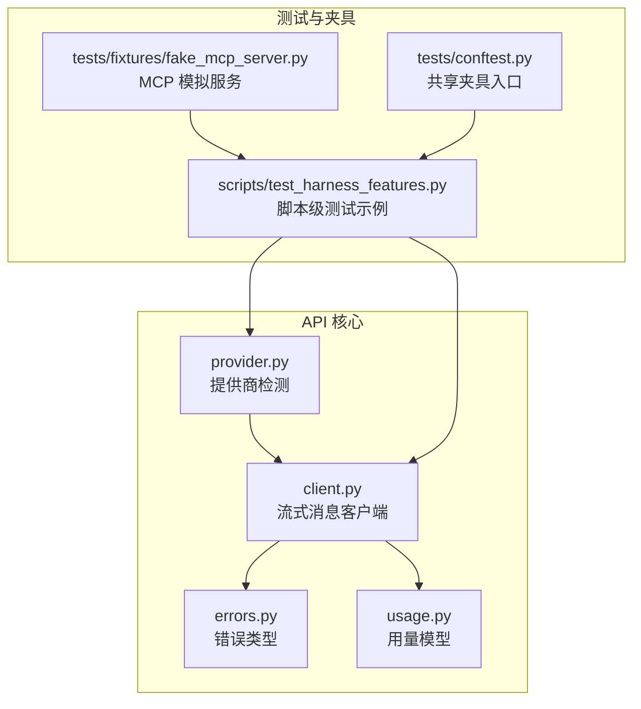
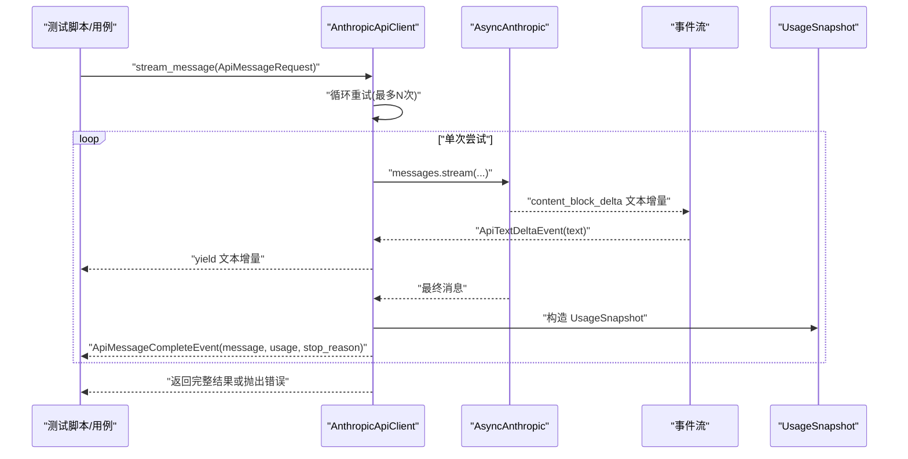
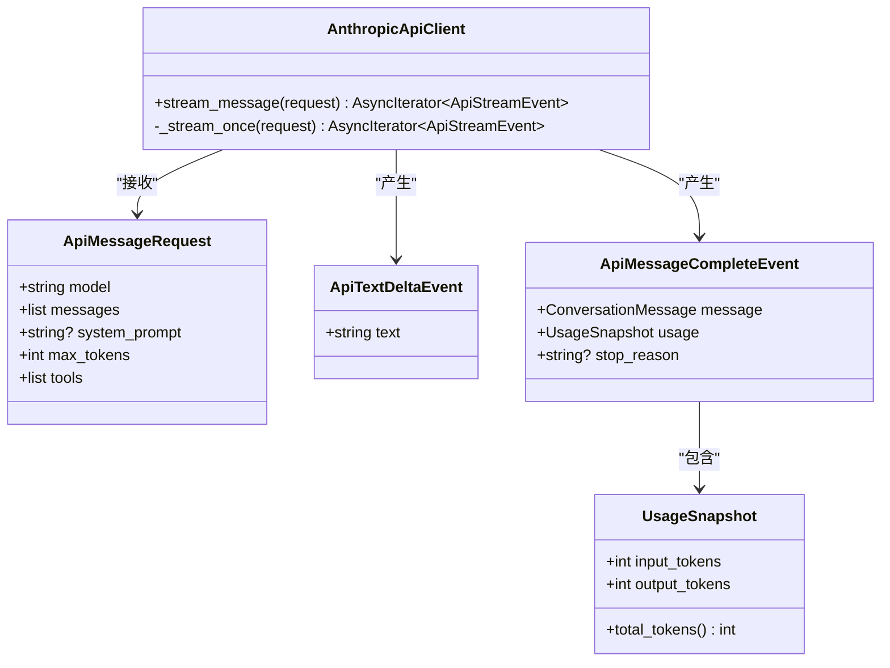
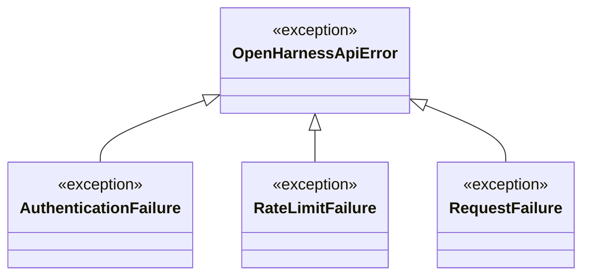
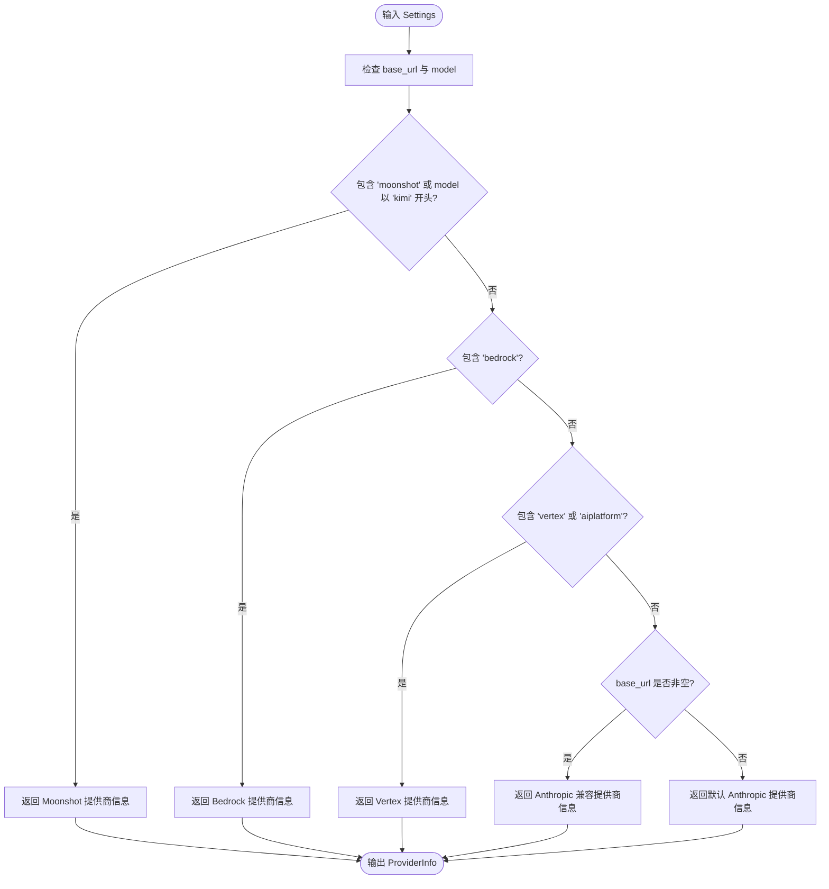
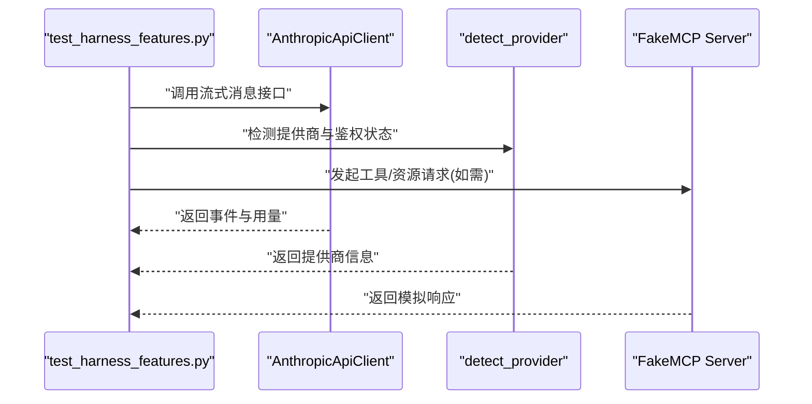
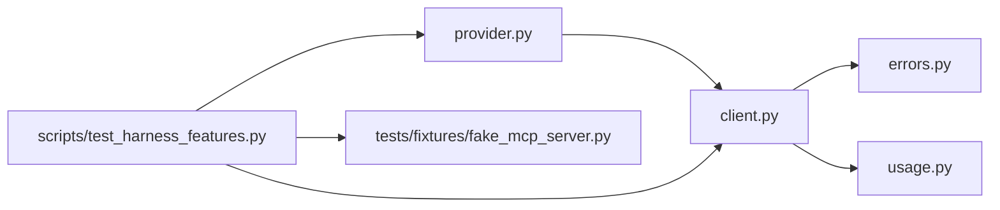

# API 测试套件

<cite>
**本文引用的文件**
- [src/openharness/api/client.py](file://src/openharness/api/client.py)
- [src/openharness/api/errors.py](file://src/openharness/api/errors.py)
- [src/openharness/api/provider.py](file://src/openharness/api/provider.py)
- [src/openharness/api/usage.py](file://src/openharness/api/usage.py)
- [scripts/test_harness_features.py](file://scripts/test_harness_features.py)
- [tests/conftest.py](file://tests/conftest.py)
- [tests/fixtures/fake_mcp_server.py](file://tests/fixtures/fake_mcp_server.py)
</cite>

## 目录
1. [简介](#简介)
2. [项目结构](#项目结构)
3. [核心组件](#核心组件)
4. [架构总览](#架构总览)
5. [详细组件分析](#详细组件分析)
6. [依赖关系分析](#依赖关系分析)
7. [性能考量](#性能考量)
8. [故障排查指南](#故障排查指南)
9. [结论](#结论)
10. [附录](#附录)

## 简介
本文件面向 OpenHarness 的 API 测试套件，系统性阐述 LLM API 集成测试、错误处理测试与使用统计测试的设计目标与测试范围，并给出测试用例编写方法（请求模拟、响应验证、异常处理）、测试数据准备与清理策略、测试环境配置要求，以及最佳实践与调试技巧。读者无需深入源码即可理解如何维护与扩展 API 相关测试。

## 项目结构
OpenHarness 将 API 相关能力集中在 src/openharness/api 子模块中，包含客户端封装、错误类型定义、提供商检测与用量模型；测试方面，仓库提供了脚本级功能测试示例与通用测试夹具，便于在真实或模拟环境中执行集成测试。

图表来源
- [src/openharness/api/client.py:1-186](file://src/openharness/api/client.py#L1-L186)
- [src/openharness/api/errors.py:1-20](file://src/openharness/api/errors.py#L1-L20)
- [src/openharness/api/provider.py:1-66](file://src/openharness/api/provider.py#L1-L66)
- [src/openharness/api/usage.py:1-18](file://src/openharness/api/usage.py#L1-L18)
- [scripts/test_harness_features.py:46-76](file://scripts/test_harness_features.py#L46-L76)
- [tests/fixtures/fake_mcp_server.py:1-22](file://tests/fixtures/fake_mcp_server.py#L1-L22)
- [tests/conftest.py:1-2](file://tests/conftest.py#L1-L2)

章节来源
- [src/openharness/api/client.py:1-186](file://src/openharness/api/client.py#L1-L186)
- [src/openharness/api/errors.py:1-20](file://src/openharness/api/errors.py#L1-L20)
- [src/openharness/api/provider.py:1-66](file://src/openharness/api/provider.py#L1-L66)
- [src/openharness/api/usage.py:1-18](file://src/openharness/api/usage.py#L1-L18)
- [scripts/test_harness_features.py:46-76](file://scripts/test_harness_features.py#L46-L76)
- [tests/fixtures/fake_mcp_server.py:1-22](file://tests/fixtures/fake_mcp_server.py#L1-L22)
- [tests/conftest.py:1-2](file://tests/conftest.py#L1-L2)

## 核心组件
- 流式消息客户端：封装异步流式调用、重试逻辑、事件解析与用量统计，支持文本增量事件与完整消息事件。
- 错误体系：统一抽象上游 API 失败，细分为认证失败、限流失败与通用请求失败。
- 提供商检测：根据配置推断当前提供商与鉴权方式，辅助 UI 与诊断。
- 用量模型：记录输入/输出 token 并计算总量，用于统计与成本追踪。

章节来源
- [src/openharness/api/client.py:98-176](file://src/openharness/api/client.py#L98-L176)
- [src/openharness/api/errors.py:6-20](file://src/openharness/api/errors.py#L6-L20)
- [src/openharness/api/provider.py:20-66](file://src/openharness/api/provider.py#L20-L66)
- [src/openharness/api/usage.py:8-18](file://src/openharness/api/usage.py#L8-L18)

## 架构总览
下图展示从测试到 API 客户端、错误翻译与用量统计的关键交互路径，体现“请求—重试—事件—最终消息—用量”的完整链路。

图表来源
- [src/openharness/api/client.py:107-176](file://src/openharness/api/client.py#L107-L176)
- [src/openharness/api/usage.py:8-18](file://src/openharness/api/usage.py#L8-L18)

## 详细组件分析

### 组件一：流式消息客户端（AnthropicApiClient）
- 设计目标
  - 对上游异步 SDK 进行薄封装，统一事件格式与错误语义。
  - 内置指数退避+抖动重试，自动处理可重试状态码与 Retry-After 头。
  - 解析流式事件，产出文本增量与完整消息，并附带用量快照。
- 关键行为
  - 请求参数映射：模型、消息列表、系统提示、最大令牌数、工具列表。
  - 事件分发：文本增量事件与完整消息事件。
  - 用量统计：基于最终消息的输入/输出 token 构造用量快照。
  - 错误翻译：将上游错误映射为统一的 OpenHarnessApiError 子类。
- 测试关注点
  - 正常流式响应的事件序列与完整性校验。
  - 可重试错误的延迟与次数控制。
  - 认证失败与限流错误的快速失败与错误类型断言。
  - 用量统计字段的正确性与边界值（零值、缺失）处理。

图表来源
- [src/openharness/api/client.py:30-57](file://src/openharness/api/client.py#L30-L57)
- [src/openharness/api/client.py:98-176](file://src/openharness/api/client.py#L98-L176)
- [src/openharness/api/usage.py:8-18](file://src/openharness/api/usage.py#L8-L18)

章节来源
- [src/openharness/api/client.py:67-136](file://src/openharness/api/client.py#L67-L136)
- [src/openharness/api/client.py:138-176](file://src/openharness/api/client.py#L138-L176)
- [src/openharness/api/usage.py:8-18](file://src/openharness/api/usage.py#L8-L18)

### 组件二：错误类型体系（OpenHarnessApiError）
- 设计目标
  - 将上游 API 的多种失败场景归一化为可测试的错误类型，便于断言与隔离。
- 错误分类
  - 认证失败：凭据被拒绝。
  - 限流失败：触发速率限制。
  - 通用请求失败：网络、超时、传输错误等。
- 测试要点
  - 针对不同上游错误进行映射测试，确保类型一致。
  - 快速失败路径：认证错误不应进入重试流程。
  - 异常堆栈与错误信息的可读性与一致性。

图表来源
- [src/openharness/api/errors.py:6-20](file://src/openharness/api/errors.py#L6-L20)

章节来源
- [src/openharness/api/errors.py:6-20](file://src/openharness/api/errors.py#L6-L20)
- [src/openharness/api/client.py:179-185](file://src/openharness/api/client.py#L179-L185)

### 组件三：提供商检测与鉴权状态（detect_provider, auth_status）
- 设计目标
  - 基于配置推断当前提供商与鉴权方式，辅助 UI 展示与诊断。
- 关键点
  - 通过 base_url 与 model 字段判断提供商族谱（如 Moonshot、Bedrock、Vertex 或 Anthropic 兼容）。
  - 返回语音支持能力与原因，便于前端决策。
  - 鉴权状态字符串用于快速判断是否已配置密钥。
- 测试要点
  - 不同 base_url 与 model 组合下的提供商识别准确性。
  - 语音支持与原因字段的合理性。
  - 缺失密钥时的鉴权状态判定。

图表来源
- [src/openharness/api/provider.py:20-57](file://src/openharness/api/provider.py#L20-L57)

章节来源
- [src/openharness/api/provider.py:20-66](file://src/openharness/api/provider.py#L20-L66)

### 组件四：用量统计（UsageSnapshot）
- 设计目标
  - 统一记录输入/输出 token，提供总量属性，便于统计与成本追踪。
- 测试要点
  - 输入/输出 token 的边界值（零、缺失）处理。
  - 总量计算的正确性与溢出防护。

章节来源
- [src/openharness/api/usage.py:8-18](file://src/openharness/api/usage.py#L8-L18)

### 组件五：测试脚本与夹具（脚本级测试示例与 MCP 模拟服务）
- 脚本级测试示例
  - 提供重试配置与延迟计算的单元级验证，确保指数退避与抖动符合预期。
  - 提供真实模型调用的集成测试示例，验证流式响应与输出内容。
- MCP 模拟服务
  - 作为轻量 stdio MCP 服务器，用于集成测试中的工具与资源访问场景。

图表来源
- [scripts/test_harness_features.py:46-76](file://scripts/test_harness_features.py#L46-L76)
- [tests/fixtures/fake_mcp_server.py:1-22](file://tests/fixtures/fake_mcp_server.py#L1-L22)
- [src/openharness/api/provider.py:20-66](file://src/openharness/api/provider.py#L20-L66)

章节来源
- [scripts/test_harness_features.py:46-76](file://scripts/test_harness_features.py#L46-L76)
- [tests/fixtures/fake_mcp_server.py:1-22](file://tests/fixtures/fake_mcp_server.py#L1-L22)

## 依赖关系分析
- 组件耦合
  - 客户端依赖错误类型与用量模型；提供商检测为配置层辅助；脚本测试直接依赖客户端与提供商检测。
- 外部依赖
  - 异步 SDK（AsyncAnthropic）与事件流协议；MCP 模拟服务用于工具/资源集成测试。
- 潜在环路
  - 当前模块间无循环导入迹象，职责清晰。

图表来源
- [src/openharness/api/client.py:1-186](file://src/openharness/api/client.py#L1-L186)
- [src/openharness/api/errors.py:1-20](file://src/openharness/api/errors.py#L1-L20)
- [src/openharness/api/provider.py:1-66](file://src/openharness/api/provider.py#L1-L66)
- [src/openharness/api/usage.py:1-18](file://src/openharness/api/usage.py#L1-L18)
- [scripts/test_harness_features.py:46-76](file://scripts/test_harness_features.py#L46-L76)
- [tests/fixtures/fake_mcp_server.py:1-22](file://tests/fixtures/fake_mcp_server.py#L1-L22)

章节来源
- [src/openharness/api/client.py:1-186](file://src/openharness/api/client.py#L1-L186)
- [src/openharness/api/errors.py:1-20](file://src/openharness/api/errors.py#L1-L20)
- [src/openharness/api/provider.py:1-66](file://src/openharness/api/provider.py#L1-L66)
- [src/openharness/api/usage.py:1-18](file://src/openharness/api/usage.py#L1-L18)
- [scripts/test_harness_features.py:46-76](file://scripts/test_harness_features.py#L46-L76)
- [tests/fixtures/fake_mcp_server.py:1-22](file://tests/fixtures/fake_mcp_server.py#L1-L22)

## 性能考量
- 重试策略
  - 指数退避与抖动可降低集中重试导致的级联效应；上限时间避免过长等待。
  - 可重试状态码与 Retry-After 头优先级处理，提升稳定性与公平性。
- 事件消费
  - 流式事件按增量产出，减少一次性内存占用；建议在测试中对事件序列进行顺序与完整性校验。
- 用量统计
  - 用量快照仅在最终消息后生成，避免重复计算；注意在高并发场景下的统计一致性。

## 故障排查指南
- 常见问题定位
  - 认证失败：确认密钥配置与提供商鉴权方式；避免将认证错误纳入重试。
  - 限流失败：观察上游返回的 Retry-After 头，调整调用频率或等待策略。
  - 网络/超时：检查基础 URL、代理与防火墙设置；验证指数退避是否生效。
- 日志与断言
  - 在测试中对关键警告日志与异常类型进行断言，确保错误路径覆盖全面。
- 资源清理
  - 使用临时配置与模拟服务时，确保在测试结束后恢复默认设置，避免影响其他测试。

章节来源
- [src/openharness/api/client.py:118-136](file://src/openharness/api/client.py#L118-L136)
- [src/openharness/api/client.py:179-185](file://src/openharness/api/client.py#L179-L185)

## 结论
OpenHarness 的 API 测试套件围绕“流式客户端—错误体系—提供商检测—用量统计”构建，既满足集成测试需求，又具备良好的可测试性与可观测性。通过脚本级测试示例与 MCP 模拟服务，可以低成本地验证重试、事件流与用量统计等关键路径。建议在后续迭代中补充单元测试与端到端场景，进一步完善覆盖率与回归保障。

## 附录

### 测试用例编写方法
- 请求模拟
  - 使用真实模型调用时，通过脚本示例验证重试配置与输出内容；必要时结合提供商检测确保 URL 与模型匹配。
  - 使用 MCP 模拟服务验证工具/资源访问链路。
- 响应验证
  - 事件序列：断言文本增量事件与完整消息事件的顺序与完整性。
  - 用量统计：断言输入/输出 token 与总量的正确性。
  - 错误类型：针对认证失败、限流失败与通用请求失败分别断言。
- 异常情况处理
  - 快速失败：认证错误不应重试。
  - 可重试错误：断言重试次数、延迟分布与上限时间。
  - 超时/网络：断言异常类型与日志信息。

章节来源
- [scripts/test_harness_features.py:46-76](file://scripts/test_harness_features.py#L46-L76)
- [tests/fixtures/fake_mcp_server.py:1-22](file://tests/fixtures/fake_mcp_server.py#L1-L22)
- [src/openharness/api/client.py:107-176](file://src/openharness/api/client.py#L107-L176)
- [src/openharness/api/errors.py:6-20](file://src/openharness/api/errors.py#L6-L20)

### 测试数据准备与清理策略
- 准备
  - 设置必要的环境变量（如模型名称），确保脚本示例可运行。
  - 启动 MCP 模拟服务用于工具/资源测试。
- 清理
  - 测试结束后恢复默认配置，关闭模拟服务进程，避免污染全局状态。

章节来源
- [scripts/test_harness_features.py:65-72](file://scripts/test_harness_features.py#L65-L72)
- [tests/fixtures/fake_mcp_server.py:20-22](file://tests/fixtures/fake_mcp_server.py#L20-L22)

### 测试环境配置要求
- Python 运行时与依赖
  - 支持异步 SDK 与 MCP 框架的运行环境。
- 环境变量
  - 模型名称与提供商基础 URL（如需真实调用）。
- 权限与网络
  - 确保对外网访问与代理配置的正确性，以便进行真实调用与重试测试。

章节来源
- [scripts/test_harness_features.py:67-72](file://scripts/test_harness_features.py#L67-L72)
- [src/openharness/api/provider.py:20-57](file://src/openharness/api/provider.py#L20-L57)

### 最佳实践与调试技巧
- 最佳实践
  - 将重试配置与延迟计算作为独立单元测试项，确保可重复性。
  - 使用最小化的真实调用验证端到端链路，同时保留模拟服务用于工具/资源场景。
  - 对错误类型进行显式断言，避免宽泛的异常捕获。
- 调试技巧
  - 打开详细日志，观察重试次数、状态码与延迟；利用用量快照核对 token 数量。
  - 在脚本中加入简短的期望输出校验，快速定位响应内容问题。