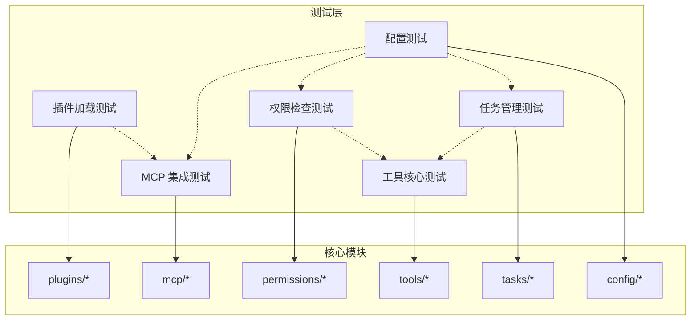
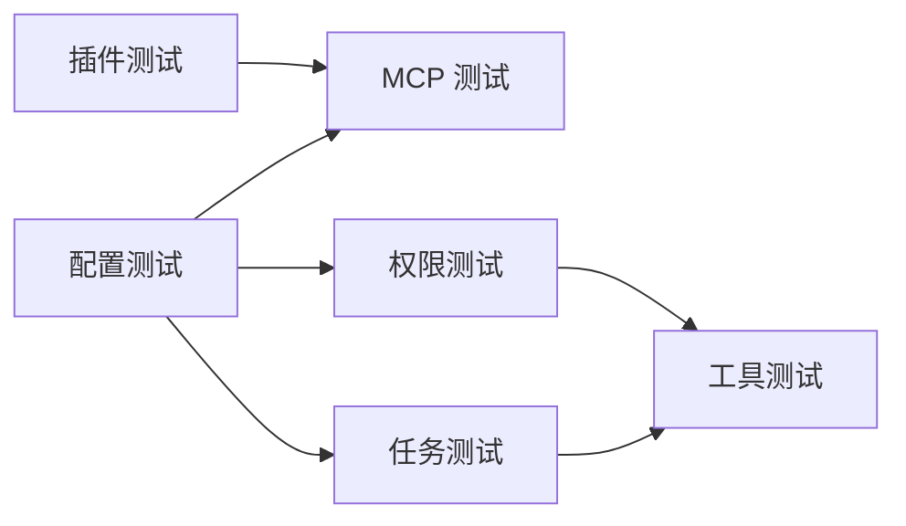

# 其他模块测试

<cite>
**本文引用的文件**
- [tests/conftest.py](file://tests/conftest.py)
- [tests/test_commands/test_cli.py](file://tests/test_commands/test_cli.py)
- [tests/test_config/test_settings.py](file://tests/test_config/test_settings.py)
- [tests/test_coordinator/test_registry.py](file://tests/test_coordinator/test_registry.py)
- [tests/test_hooks/test_executor.py](file://tests/test_hooks/test_executor.py)
- [tests/test_mcp/test_integration.py](file://tests/test_mcp/test_integration.py)
- [tests/test_memory/test_memdir.py](file://tests/test_memory/test_memdir.py)
- [tests/test_permissions/test_checker.py](file://tests/test_permissions/test_checker.py)
- [tests/test_plugins/test_loader.py](file://tests/test_plugins/test_loader.py)
- [tests/test_skills/test_loader.py](file://tests/test_skills/test_loader.py)
- [tests/test_tasks/test_manager.py](file://tests/test_tasks/test_manager.py)
- [tests/test_tools/test_core_tools.py](file://tests/test_tools/test_core_tools.py)
- [tests/test_ui/test_modes.py](file://tests/test_ui/test_modes.py)
- [tests/test_services/test_session_storage.py](file://tests/test_services/test_session_storage.py)
- [tests/test_prompts/test_system_prompt.py](file://tests/test_prompts/test_system_prompt.py)
- [tests/fixtures/fake_mcp_server.py](file://tests/fixtures/fake_mcp_server.py)
</cite>

## 目录
1. 引言
2. 项目结构
3. 核心组件
4. 架构总览
5. 详细组件分析
6. 依赖分析
7. 性能考虑
8. 故障排查指南
9. 结论
10. 附录

## 引言
本文件面向 OpenHarness 的“其他模块测试”，系统梳理命令系统、配置、协调器、钩子、MCP 协议、记忆系统、权限、插件、提示工程、服务、技能、任务管理等模块的测试策略与方法。文档强调：
- 各模块测试的独特关注点与验证路径
- 跨模块测试的协调方式与测试数据共享策略
- 通用测试指导原则与最佳实践，帮助开发者持续扩展测试覆盖

## 项目结构
测试组织遵循按功能域分层：tests 下的各子目录对应核心模块，每个模块包含若干测试文件，覆盖单元、集成与端到端场景。共享夹具与环境变量通过 conftest 与 monkeypatch 等机制统一注入。

```mermaid
graph TB
subgraph "测试目录"
TCFG["test_config"]
TCOM["test_commands"]
TCOOR["test_coordinator"]
THOOK["test_hooks"]
TMCP["test_mcp"]
TMEM["test_memory"]
TPERM["test_permissions"]
TPLUG["test_plugins"]
TSKILL["test_skills"]
TTOOLS["test_tools"]
TUI["test_ui"]
TSVC["test_services"]
TPROMPT["test_prompts"]
TTASK["test_tasks"]
TFIX["fixtures"]
end
TCFG --> |"设置加载/保存"| CORECFG["src/openharness/config/*"]
TCOM --> |"CLI 行为"| CLI["src/openharness/cli.py"]
TCOOR --> |"团队注册表"| COOR["src/openharness/coordinator/*"]
THOOK --> |"钩子执行"| HOOKMOD["src/openharness/hooks/*"]
TMCP --> |"MCP 配置/适配"| MCP["src/openharness/mcp/*"]
TMEM --> |"内存目录/检索"| MEM["src/openharness/memory/*"]
TPERM --> |"权限决策"| PERM["src/openharness/permissions/*"]
TPLUG --> |"插件加载"| PLUG["src/openharness/plugins/*"]
TSKILL --> |"技能加载"| SKILL["src/openharness/skills/*"]
TTOOLS --> |"工具集"| TOOLS["src/openharness/tools/*"]
TUI --> |"UI 模式"| UI["src/openharness/ui/*"]
TSVC --> |"会话存储"| SVC["src/openharness/services/*"]
TPROMPT --> |"系统提示构建"| PROMPT["src/openharness/prompts/*"]
TTASK --> |"后台任务"| TASK["src/openharness/tasks/*"]
TFIX --> |"MCP 仿真服务器"| FIXMCP["tests/fixtures/fake_mcp_server.py"]
```

图表来源
- [tests/test_config/test_settings.py:1-114](file://tests/test_config/test_settings.py#L1-L114)
- [tests/test_commands/test_cli.py:1-13](file://tests/test_commands/test_cli.py#L1-L13)
- [tests/test_coordinator/test_registry.py:1-28](file://tests/test_coordinator/test_registry.py#L1-L28)
- [tests/test_hooks/test_executor.py:1-73](file://tests/test_hooks/test_executor.py#L1-L73)
- [tests/test_mcp/test_integration.py:1-80](file://tests/test_mcp/test_integration.py#L1-L80)
- [tests/test_memory/test_memdir.py:1-53](file://tests/test_memory/test_memdir.py#L1-L53)
- [tests/test_permissions/test_checker.py:1-32](file://tests/test_permissions/test_checker.py#L1-L32)
- [tests/test_plugins/test_loader.py:1-83](file://tests/test_plugins/test_loader.py#L1-L83)
- [tests/test_skills/test_loader.py:1-30](file://tests/test_skills/test_loader.py#L1-L30)
- [tests/test_tools/test_core_tools.py:1-248](file://tests/test_tools/test_core_tools.py#L1-L248)
- [tests/test_ui/test_modes.py:1-26](file://tests/test_ui/test_modes.py#L1-L26)
- [tests/test_services/test_session_storage.py:1-55](file://tests/test_services/test_session_storage.py#L1-L55)
- [tests/test_prompts/test_system_prompt.py:1-65](file://tests/test_prompts/test_system_prompt.py#L1-L65)
- [tests/test_tasks/test_manager.py:1-86](file://tests/test_tasks/test_manager.py#L1-L86)
- [tests/fixtures/fake_mcp_server.py:1-22](file://tests/fixtures/fake_mcp_server.py#L1-L22)

章节来源
- [tests/conftest.py:1-2](file://tests/conftest.py#L1-L2)

## 核心组件
- 命令系统测试：验证 CLI 帮助输出与基本行为，确保入口可访问且输出稳定。
- 配置测试：覆盖默认值、环境变量优先级、CLI 覆盖合并、文件读写持久化、权限设置合并与环境覆盖。
- 协调器测试：验证最小团队注册表的创建、添加、消息传递与删除。
- 钩子测试：验证命令型钩子执行与策略型钩子阻断能力，使用假流式客户端模拟响应。
- MCP 测试：验证 MCP 服务器配置合并、工具注册与资源列表、工具调用返回值。
- 记忆系统测试：验证记忆目录稳定性、入口生成、提示拼接与相关记忆检索。
- 权限测试：验证不同模式下的工具允许/阻断与确认需求。
- 插件测试：验证插件加载、技能与钩子合并、MCP 服务器合并。
- 技能测试：验证内置技能与用户自定义技能加载。
- 工具测试：验证文件读写编辑、Glob/Grep、Bash 执行、工具搜索、简述、技能调用、笔记本编辑、LSP 符号/跳转/引用/悬停、工作树切换、Cron 与远程触发。
- UI 测试：验证输入会话模式与输出渲染样式切换。
- 服务测试：验证会话快照保存/加载与 Markdown 导出。
- 提示工程测试：验证系统提示构建对环境信息、无 Git、自定义提示与默认基础提示的影响。
- 任务管理测试：验证后台 Shell/Agent 任务创建、输出读取、重启与停止。

章节来源
- [tests/test_commands/test_cli.py:1-13](file://tests/test_commands/test_cli.py#L1-L13)
- [tests/test_config/test_settings.py:1-114](file://tests/test_config/test_settings.py#L1-L114)
- [tests/test_coordinator/test_registry.py:1-28](file://tests/test_coordinator/test_registry.py#L1-L28)
- [tests/test_hooks/test_executor.py:1-73](file://tests/test_hooks/test_executor.py#L1-L73)
- [tests/test_mcp/test_integration.py:1-80](file://tests/test_mcp/test_integration.py#L1-L80)
- [tests/test_memory/test_memdir.py:1-53](file://tests/test_memory/test_memdir.py#L1-L53)
- [tests/test_permissions/test_checker.py:1-32](file://tests/test_permissions/test_checker.py#L1-L32)
- [tests/test_plugins/test_loader.py:1-83](file://tests/test_plugins/test_loader.py#L1-L83)
- [tests/test_skills/test_loader.py:1-30](file://tests/test_skills/test_loader.py#L1-L30)
- [tests/test_tools/test_core_tools.py:1-248](file://tests/test_tools/test_core_tools.py#L1-L248)
- [tests/test_ui/test_modes.py:1-26](file://tests/test_ui/test_modes.py#L1-L26)
- [tests/test_services/test_session_storage.py:1-55](file://tests/test_services/test_session_storage.py#L1-L55)
- [tests/test_prompts/test_system_prompt.py:1-65](file://tests/test_prompts/test_system_prompt.py#L1-L65)
- [tests/test_tasks/test_manager.py:1-86](file://tests/test_tasks/test_manager.py#L1-L86)

## 架构总览
下图展示测试层与核心模块之间的交互关系，以及跨模块协作（如插件合并 MCP 配置、权限检查影响工具执行、任务管理与工具执行的组合）。

图表来源
- [tests/test_plugins/test_loader.py:1-83](file://tests/test_plugins/test_loader.py#L1-L83)
- [tests/test_mcp/test_integration.py:1-80](file://tests/test_mcp/test_integration.py#L1-L80)
- [tests/test_permissions/test_checker.py:1-32](file://tests/test_permissions/test_checker.py#L1-L32)
- [tests/test_tools/test_core_tools.py:1-248](file://tests/test_tools/test_core_tools.py#L1-L248)
- [tests/test_tasks/test_manager.py:1-86](file://tests/test_tasks/test_manager.py#L1-L86)
- [tests/test_config/test_settings.py:1-114](file://tests/test_config/test_settings.py#L1-L114)

## 详细组件分析

### 命令系统测试
- 关注点
  - CLI 入口可用性与帮助输出稳定性
  - 与 Typer/CliRunner 的集成是否正确
- 方法
  - 使用 CliRunner 调用 --help 并断言退出码与输出片段
- 复杂度
  - O(1)，轻量级端到端验证
- 最佳实践
  - 保持帮助文本简洁明确；新增命令时同步更新帮助测试

章节来源
- [tests/test_commands/test_cli.py:1-13](file://tests/test_commands/test_cli.py#L1-L13)

### 配置测试
- 关注点
  - 默认值一致性、API Key 解析优先级（实例 > 环境变量）、缺失处理
  - CLI 覆盖合并策略（仅在显式传入时生效）
  - 文件读写持久化（创建父目录、回环序列化/反序列化）
  - 权限设置合并与环境变量覆盖
- 方法
  - Settings 对象直接断言字段；monkeypatch 注入环境变量；tmp_path 创建临时文件
- 复杂度
  - O(n) 遍历字段与覆盖项，整体线性
- 最佳实践
  - 为每种覆盖来源（文件、环境、CLI）单独用例；对异常路径（缺失键）进行显式断言

章节来源
- [tests/test_config/test_settings.py:1-114](file://tests/test_config/test_settings.py#L1-L114)

### 协调器测试
- 关注点
  - 团队注册表生命周期：创建、添加代理、发送消息、列出、删除
  - 重复创建应抛出异常
- 方法
  - TeamRegistry 直接调用并断言状态与消息历史
- 复杂度
  - O(1) 操作，O(n) 列表/消息遍历（n 为消息数）
- 最佳实践
  - 每个操作后断言内部状态；对异常分支进行显式断言

章节来源
- [tests/test_coordinator/test_registry.py:1-28](file://tests/test_coordinator/test_registry.py#L1-L28)

### 钩子测试
- 关注点
  - 命令型钩子在会话开始时执行并产生输出
  - 策略型钩子基于匹配器阻断工具调用，并给出原因
- 方法
  - 使用 HookRegistry 注册事件，构造 HookExecutionContext（含假 API 客户端与默认模型），异步执行并断言 blocked/reason 与输出
- 复杂度
  - O(1) 单次执行；异步流式客户端模拟输出
- 最佳实践
  - 为每类事件（PRE_TOOL_USE/SESSION_START 等）准备独立用例；对阻断与放行分别断言

章节来源
- [tests/test_hooks/test_executor.py:1-73](file://tests/test_hooks/test_executor.py#L1-L73)

### MCP 协议测试
- 关注点
  - 设置与插件中的 MCP 服务器配置合并（命名空间隔离）
  - 工具注册表中 MCP 工具可用、输入校验、执行返回值
  - 资源列表工具返回资源 URI
- 方法
  - 构造 Settings 与 LoadedPlugin，调用 load_mcp_server_configs；创建默认工具注册表；执行工具并断言输出
  - 使用 tests/fixtures 中的 fake_mcp_server 作为 stdio 服务器
- 复杂度
  - O(servers + tools)；工具执行为 O(1)
- 最佳实践
  - 为每个 MCP 服务器与工具准备独立用例；对输入 schema 进行最小有效输入验证

章节来源
- [tests/test_mcp/test_integration.py:1-80](file://tests/test_mcp/test_integration.py#L1-L80)
- [tests/fixtures/fake_mcp_server.py:1-22](file://tests/fixtures/fake_mcp_server.py#L1-L22)

### 记忆系统测试
- 关注点
  - 记忆目录路径稳定性与入口文件生成
  - 加载记忆提示包含“持久化记忆目录”与条目标题
  - 相关记忆检索按语义命中排序
- 方法
  - monkeypatch 设置 OPENHARNESS_DATA_DIR；tmp_path 创建项目目录；断言路径存在、提示内容与检索结果
- 复杂度
  - 路径与文件 IO O(1)；检索复杂度取决于实现（通常 O(n log n) 或更高）
- 最佳实践
  - 使用稳定的临时目录；为不同场景（有/无 Git、不同文件名）补充用例

章节来源
- [tests/test_memory/test_memdir.py:1-53](file://tests/test_memory/test_memdir.py#L1-L53)

### 权限测试
- 关注点
  - DEFAULT 模式：只读工具放行、变更类工具需确认
  - PLAN 模式：禁止变更类工具
  - FULL_AUTO：放行所有工具
- 方法
  - 构造 PermissionChecker 与 PermissionSettings，evaluate 并断言 allowed、requires_confirmation 与 reason
- 复杂度
  - O(1) 单次评估
- 最佳实践
  - 为每种模式与工具类型（只读/变更）准备用例；对拒绝原因字符串进行断言

章节来源
- [tests/test_permissions/test_checker.py:1-32](file://tests/test_permissions/test_checker.py#L1-L32)

### 插件测试
- 关注点
  - 从项目目录加载插件，解析 manifest、skills、hooks、mcp.json
  - 插件技能与钩子合并至全局注册表
  - 插件 MCP 服务器与设置中的服务器合并（带前缀）
- 方法
  - 写入虚拟插件目录与 JSON 文件；调用 load_plugins、load_skill_registry、load_hook_registry；断言内容与合并结果
- 复杂度
  - O(n_skills + n_hooks + n_mcp)；I/O 为主
- 最佳实践
  - 为每种清单（plugin.json、hooks.json、mcp.json）编写用例；对合并冲突与命名冲突进行边界测试

章节来源
- [tests/test_plugins/test_loader.py:1-83](file://tests/test_plugins/test_loader.py#L1-L83)

### 技能测试
- 关注点
  - 内置技能（如 simplify、review）可被加载
  - 用户自定义技能可被加载并标记来源
- 方法
  - 设置 OPENHARNESS_CONFIG_DIR；创建用户技能文件；断言技能名称、来源与内容
- 复杂度
  - O(n_skills)；I/O 为主
- 最佳实践
  - 为内置与用户技能分别断言；对编码与空内容进行边界测试

章节来源
- [tests/test_skills/test_loader.py:1-30](file://tests/test_skills/test_loader.py#L1-L30)

### 服务测试
- 关注点
  - 会话快照保存与加载（模型、消息、用量）
  - Markdown 导出包含标题与消息内容
- 方法
  - 保存快照并断言文件存在；加载并断言字段；导出 Markdown 并断言内容
- 复杂度
  - O(n_messages)；I/O 为主
- 最佳实践
  - 对不同消息角色与用量进行断言；对空会话与异常场景进行边界测试

章节来源
- [tests/test_services/test_session_storage.py:1-55](file://tests/test_services/test_session_storage.py#L1-L55)

### 提示工程测试
- 关注点
  - 系统提示包含环境信息（OS、平台、Shell、CWD、日期、Python 版本、Git 状态）
  - 无 Git 仓库时不出现分支信息
  - 自定义提示优先于默认基础提示
  - 默认提示包含基础模板
- 方法
  - 构造 EnvironmentInfo 并断言提示内容片段
- 复杂度
  - O(1) 字符串拼接与条件判断
- 最佳实践
  - 为每种环境组合与提示模式准备用例；对截断与换行进行断言

章节来源
- [tests/test_prompts/test_system_prompt.py:1-65](file://tests/test_prompts/test_system_prompt.py#L1-L65)

### 任务管理测试
- 关注点
  - 创建 Shell/Agent 任务并读取输出
  - 写入已停止的 Agent 任务会自动重启进程
  - 停止任务后状态为 killed
- 方法
  - BackgroundTaskManager 创建任务；等待 waiters；断言状态、输出与元数据 restart_count
- 复杂度
  - O(1) 单次操作；等待超时控制在合理范围
- 最佳实践
  - 对长时间运行任务进行超时与中断测试；对重启次数与输出累积进行断言

章节来源
- [tests/test_tasks/test_manager.py:1-86](file://tests/test_tasks/test_manager.py#L1-L86)

### 工具测试
- 关注点
  - 文件工具：写入、偏移读取、编辑替换
  - Glob/Grep：通配与正则匹配
  - Bash：命令执行与输出
  - 工具搜索与简述：返回工具列表与长度限制
  - 技能、待办、配置：调用与副作用
  - 笔记本编辑：单元格修改与保存
  - LSP：符号、跳转、引用、悬停
  - 工作树：Git 初始化、提交、进入/退出工作树
  - Cron 与远程触发：创建、列出、触发、删除
- 方法
  - ToolExecutionContext 提供 cwd 与元数据；对每个工具构造输入并断言输出或文件内容
- 复杂度
  - 多数 O(1)；Glob/Grep 取决于文件数量；LSP 与 Git 取决于项目规模
- 最佳实践
  - 为每个工具输入 schema 的最小有效值编写用例；对错误路径（文件不存在、权限不足）进行断言

章节来源
- [tests/test_tools/test_core_tools.py:1-248](file://tests/test_tools/test_core_tools.py#L1-L248)

### UI 测试
- 关注点
  - 输入会话根据模式动态更新提示前缀
  - 输出渲染器可切换样式
- 方法
  - 设置模式并断言提示；设置样式并断言名称
- 复杂度
  - O(1)
- 最佳实践
  - 为每种模式组合与样式名称编写用例

章节来源
- [tests/test_ui/test_modes.py:1-26](file://tests/test_ui/test_modes.py#L1-L26)

## 依赖分析
- 组件内聚与耦合
  - 各模块测试相对独立，主要通过核心模块的公共接口进行验证
  - 插件测试与 MCP 测试存在间接耦合（插件提供 MCP 服务器配置）
  - 权限测试与工具测试存在策略耦合（权限决定工具是否可执行）
  - 任务管理与工具测试存在执行耦合（任务中可能调用工具）
- 外部依赖
  - mcp.server.fastmcp（用于 MCP 仿真服务器）
  - Typer/CliRunner（CLI 测试）
  - asyncio（异步任务与等待器）
- 循环依赖
  - 未发现直接循环依赖；测试之间通过模块接口解耦

图表来源
- [tests/test_plugins/test_loader.py:1-83](file://tests/test_plugins/test_loader.py#L1-L83)
- [tests/test_mcp/test_integration.py:1-80](file://tests/test_mcp/test_integration.py#L1-L80)
- [tests/test_permissions/test_checker.py:1-32](file://tests/test_permissions/test_checker.py#L1-L32)
- [tests/test_tools/test_core_tools.py:1-248](file://tests/test_tools/test_core_tools.py#L1-L248)
- [tests/test_tasks/test_manager.py:1-86](file://tests/test_tasks/test_manager.py#L1-L86)
- [tests/test_config/test_settings.py:1-114](file://tests/test_config/test_settings.py#L1-L114)

章节来源
- [tests/test_plugins/test_loader.py:1-83](file://tests/test_plugins/test_loader.py#L1-L83)
- [tests/test_mcp/test_integration.py:1-80](file://tests/test_mcp/test_integration.py#L1-L80)
- [tests/test_permissions/test_checker.py:1-32](file://tests/test_permissions/test_checker.py#L1-L32)
- [tests/test_tools/test_core_tools.py:1-248](file://tests/test_tools/test_core_tools.py#L1-L248)
- [tests/test_tasks/test_manager.py:1-86](file://tests/test_tasks/test_manager.py#L1-L86)
- [tests/test_config/test_settings.py:1-114](file://tests/test_config/test_settings.py#L1-L114)

## 性能考虑
- I/O 密集：配置读写、会话导出、文件工具、Git/LSP 操作是性能瓶颈
- 异步执行：任务管理与钩子执行采用异步，注意等待器超时与并发安全
- 资源清理：临时目录与进程应在测试结束后清理，避免资源泄漏
- 建议
  - 对大文件与多文件场景进行压力测试；对超时与重试策略进行参数化
  - 在 CI 中对慢用例进行分组与并行化

## 故障排查指南
- CLI 测试失败
  - 检查 --help 输出是否包含预期文本；确认 Typer 应用入口正确
- 配置测试失败
  - 检查环境变量是否被正确注入；确认文件路径与权限；核对 CLI 覆盖逻辑
- 钩子测试失败
  - 检查 HookRegistry 注册事件与匹配器；确认假客户端输出格式
- MCP 测试失败
  - 检查服务器合并命名空间；确认工具输入 schema 与执行返回值
- 记忆系统测试失败
  - 检查 OPENHARNESS_DATA_DIR 是否正确；确认入口文件与检索索引
- 权限测试失败
  - 检查模式枚举与 evaluate 返回值；确认拒绝原因字符串
- 插件测试失败
  - 检查插件目录结构与 JSON 清单；确认合并策略
- 工具测试失败
  - 检查 cwd 与元数据；核对输入 schema 与文件权限
- 任务管理测试失败
  - 检查 waiters 与状态机；确认重启计数与输出累积
- UI 与服务测试失败
  - 检查样式名称与提示前缀；确认快照与导出文件内容

章节来源
- [tests/test_commands/test_cli.py:1-13](file://tests/test_commands/test_cli.py#L1-L13)
- [tests/test_config/test_settings.py:1-114](file://tests/test_config/test_settings.py#L1-L114)
- [tests/test_hooks/test_executor.py:1-73](file://tests/test_hooks/test_executor.py#L1-L73)
- [tests/test_mcp/test_integration.py:1-80](file://tests/test_mcp/test_integration.py#L1-L80)
- [tests/test_memory/test_memdir.py:1-53](file://tests/test_memory/test_memdir.py#L1-L53)
- [tests/test_permissions/test_checker.py:1-32](file://tests/test_permissions/test_checker.py#L1-L32)
- [tests/test_plugins/test_loader.py:1-83](file://tests/test_plugins/test_loader.py#L1-L83)
- [tests/test_tools/test_core_tools.py:1-248](file://tests/test_tools/test_core_tools.py#L1-L248)
- [tests/test_tasks/test_manager.py:1-86](file://tests/test_tasks/test_manager.py#L1-L86)
- [tests/test_ui/test_modes.py:1-26](file://tests/test_ui/test_modes.py#L1-L26)
- [tests/test_services/test_session_storage.py:1-55](file://tests/test_services/test_session_storage.py#L1-L55)

## 结论
本文系统梳理了 OpenHarness 各模块测试策略与方法，强调了跨模块协作与测试数据共享的重要性。通过统一的夹具与环境注入、清晰的断言边界与最佳实践，可以持续提升测试覆盖率与稳定性。建议在后续迭代中：
- 为每个模块建立“测试矩阵”（输入/输出/异常）
- 将跨模块用例拆分为可复用的夹具与辅助函数
- 在 CI 中引入并行化与超时保护

## 附录
- 通用测试指导原则
  - 单一职责：每个用例聚焦一个行为或边界
  - 可重复性：使用 tmp_path 与 monkeypatch 确保可重复
  - 明确断言：对成功与失败路径均进行断言
  - 边界覆盖：空值、越界、非法字符、权限不足
  - 异步安全：对 asyncio 用例设置合理超时
  - 数据隔离：跨用例间不共享可变状态
- 跨模块测试协调
  - 使用 conftest 统一夹具；通过 Settings 与上下文对象共享配置
  - 对插件与 MCP 的合并场景，分别验证“设置侧”和“插件侧”的输入
  - 对权限与工具的耦合场景，以 PermissionChecker 为中心设计用例
- 测试数据共享策略
  - 使用 tmp_path 生成临时目录，避免全局状态污染
  - 通过 monkeypatch 注入环境变量，模拟真实运行时
  - 对外部进程（如 Git、MCP 服务器）使用仿真或本地可控实例