# 工具测试套件

<cite>
**本文档引用的文件**
- [README.md](file://README.md)
- [pyproject.toml](file://pyproject.toml)
- [tests/conftest.py](file://tests/conftest.py)
- [tests/test_tools/test_core_tools.py](file://tests/test_tools/test_core_tools.py)
- [tests/test_tools/test_integration_flows.py](file://tests/test_tools/test_integration_flows.py)
- [tests/test_tools/test_mcp_auth_tool.py](file://tests/test_tools/test_mcp_auth_tool.py)
- [tests/test_tools/test_task_tools.py](file://tests/test_tools/test_task_tools.py)
- [tests/test_tools/test_web_fetch_tool.py](file://tests/test_tools/test_web_fetch_tool.py)
- [tests/test_mcp/test_integration.py](file://tests/test_mcp/test_integration.py)
- [tests/test_mcp/test_stdio_flow.py](file://tests/test_mcp/test_stdio_flow.py)
- [tests/fixtures/fake_mcp_server.py](file://tests/fixtures/fake_mcp_server.py)
- [tests/test_permissions/test_checker.py](file://tests/test_permissions/test_checker.py)
- [scripts/e2e_smoke.py](file://scripts/e2e_smoke.py)
- [scripts/test_harness_features.py](file://scripts/test_harness_features.py)
- [scripts/test_real_skills_plugins.py](file://scripts/test_real_skills_plugins.py)
- [scripts/test_cli_flags.py](file://scripts/test_cli_flags.py)
</cite>

## 目录
1. [简介](#简介)
2. [项目结构](#项目结构)
3. [核心组件](#核心组件)
4. [架构总览](#架构总览)
5. [详细组件分析](#详细组件分析)
6. [依赖关系分析](#依赖关系分析)
7. [性能考虑](#性能考虑)
8. [故障排查指南](#故障排查指南)
9. [结论](#结论)
10. [附录](#附录)

## 简介
本文件系统性梳理 OpenHarness 的工具测试套件，覆盖核心工具测试、集成流程测试、MCP 认证工具测试、任务工具测试、Web 获取工具测试等，并解释测试设计原则（单元测试、集成测试、端到端测试的组合）、测试数据准备与环境配置、权限测试、错误处理测试与性能测试等关键场景，最后提供测试维护与扩展指南。

## 项目结构
OpenHarness 测试体系由多层测试组成：
- 单元测试：针对具体模块或工具的最小可验证单元，如工具执行、权限检查、配置读写等。
- 集成测试：跨多个工具或子系统的协作流程，验证工具注册表、任务管理器、MCP 管理器等协同工作。
- 端到端测试：通过真实模型调用与脚本驱动的完整场景，覆盖真实 API、插件、技能、权限策略等。

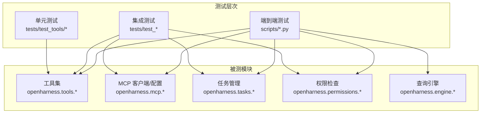

**图表来源**
- [tests/test_tools/test_core_tools.py:1-248](file://tests/test_tools/test_core_tools.py#L1-L248)
- [tests/test_tools/test_integration_flows.py:1-282](file://tests/test_tools/test_integration_flows.py#L1-L282)
- [tests/test_mcp/test_integration.py:1-80](file://tests/test_mcp/test_integration.py#L1-L80)
- [scripts/e2e_smoke.py:1-808](file://scripts/e2e_smoke.py#L1-L808)

**章节来源**
- [README.md: 282-298:282-298](file://README.md#L282-L298)
- [pyproject.toml: 47-49:47-49](file://pyproject.toml#L47-L49)

## 核心组件
- 工具测试套件：覆盖文件 I/O、搜索、笔记本、代理、任务、MCP、模式切换、计划、元工具等内置工具的执行与组合。
- 权限测试套件：验证默认模式、计划模式、全自动模式下的读写与命令执行权限决策。
- MCP 测试套件：验证 MCP 配置合并、工具适配器注册、STDIO 连接与资源读取。
- 任务与团队工具测试：验证任务创建、输出读取、更新元数据、代理工具模式。
- Web 搜索与抓取测试：基于本地 HTTP 服务器模拟网页抓取与搜索结果解析。
- 端到端测试脚本：涵盖重试、技能加载、并行工具执行、路径权限、CLI 标志、真实技能与插件等。

**章节来源**
- [tests/test_tools/test_core_tools.py: 1-L248:1-248](file://tests/test_tools/test_core_tools.py#L1-L248)
- [tests/test_permissions/test_checker.py: 1-L32:1-32](file://tests/test_permissions/test_checker.py#L1-L32)
- [tests/test_mcp/test_integration.py: 1-L80:1-80](file://tests/test_mcp/test_integration.py#L1-L80)
- [tests/test_mcp/test_stdio_flow.py: 1-L55:1-55](file://tests/test_mcp/test_stdio_flow.py#L1-L55)
- [tests/test_tools/test_task_tools.py: 1-L111:1-111](file://tests/test_tools/test_task_tools.py#L1-L111)
- [tests/test_tools/test_web_fetch_tool.py: 1-L87:1-87](file://tests/test_tools/test_web_fetch_tool.py#L1-L87)
- [scripts/test_harness_features.py: 1-L241:1-241](file://scripts/test_harness_features.py#L1-L241)
- [scripts/test_real_skills_plugins.py: 1-L348:1-348](file://scripts/test_real_skills_plugins.py#L1-L348)
- [scripts/test_cli_flags.py: 1-L159:1-159](file://scripts/test_cli_flags.py#L1-L159)

## 架构总览
下图展示测试套件与被测模块之间的交互关系，以及端到端场景如何串联工具、MCP、任务与权限模块。

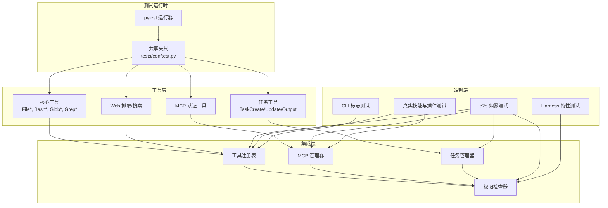

**图表来源**
- [tests/test_tools/test_core_tools.py:1-248](file://tests/test_tools/test_core_tools.py#L1-L248)
- [tests/test_tools/test_task_tools.py:1-111](file://tests/test_tools/test_task_tools.py#L1-L111)
- [tests/test_tools/test_mcp_auth_tool.py:1-102](file://tests/test_tools/test_mcp_auth_tool.py#L1-L102)
- [tests/test_tools/test_web_fetch_tool.py:1-87](file://tests/test_tools/test_web_fetch_tool.py#L1-L87)
- [scripts/e2e_smoke.py:1-808](file://scripts/e2e_smoke.py#L1-L808)
- [scripts/test_harness_features.py:1-241](file://scripts/test_harness_features.py#L1-L241)
- [scripts/test_real_skills_plugins.py:1-348](file://scripts/test_real_skills_plugins.py#L1-L348)
- [scripts/test_cli_flags.py:1-159](file://scripts/test_cli_flags.py#L1-L159)

## 详细组件分析

### 核心工具测试（文件 I/O、搜索、Shell、LSP、工作树、计划任务）
- 文件 I/O：验证写入、读取、编辑、Glob/Grep 能力，确保偏移与限制参数正确生效。
- Shell 工具：验证命令执行返回值与输出一致性。
- LSP 工具：验证符号检索、跳转定义、引用查找、悬停信息等。
- 工作树工具：通过 Git 初始化与提交，验证工作树创建与退出。
- 计划任务工具：验证定时任务创建、列出、远程触发与删除。

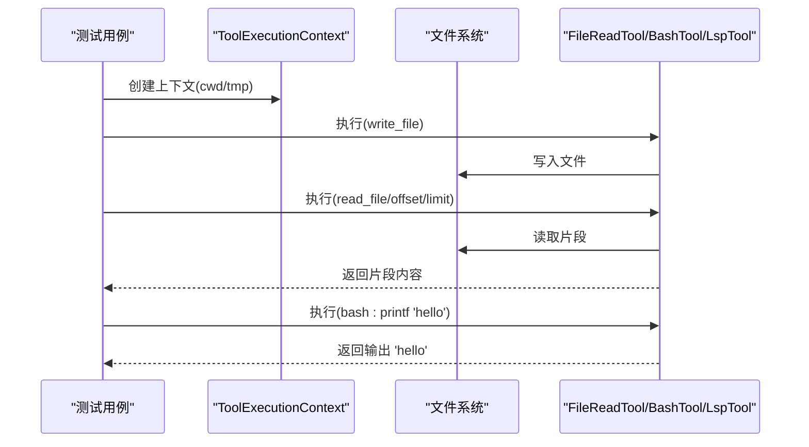

**图表来源**
- [tests/test_tools/test_core_tools.py: 34-L82:34-82](file://tests/test_tools/test_core_tools.py#L34-L82)

**章节来源**
- [tests/test_tools/test_core_tools.py: 34-L82:34-82](file://tests/test_tools/test_core_tools.py#L34-L82)
- [tests/test_tools/test_core_tools.py: 142-L177:142-177](file://tests/test_tools/test_core_tools.py#L142-L177)
- [tests/test_tools/test_core_tools.py: 180-L220:180-220](file://tests/test_tools/test_core_tools.py#L180-L220)
- [tests/test_tools/test_core_tools.py: 223-L248:223-248](file://tests/test_tools/test_core_tools.py#L223-L248)

### 集成流程测试（跨工具编排）
- 注册表编排：从默认工具注册表中获取工具，按顺序执行写入、搜索、编辑、读取。
- 任务与待办：工具搜索、写入待办、创建任务、更新进度与状态、轮询输出。
- 技能与配置：设置主题、显示配置、加载技能内容。
- 代理消息：启动代理任务、发送消息、重启并验证输出。
- 用户问答：通过回调注入答案，写入并校验结果。
- 笔记本与计划任务：编辑 Jupyter Notebook、创建/触发/删除定时任务。
- LSP 工作流：在多文件间进行符号检索、定义跳转、悬停信息。

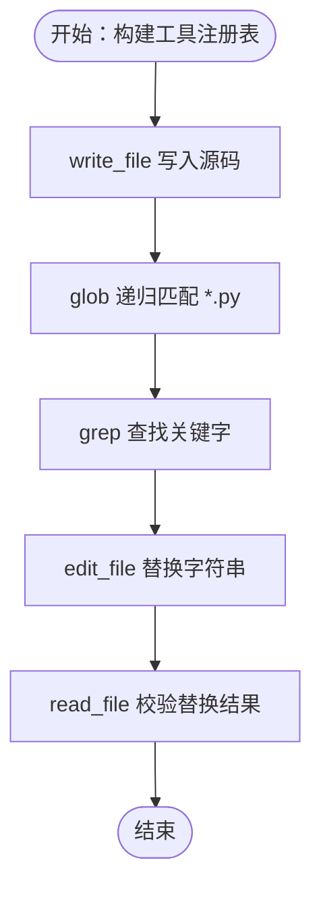

**图表来源**
- [tests/test_tools/test_integration_flows.py: 14-L45:14-45](file://tests/test_tools/test_integration_flows.py#L14-L45)

**章节来源**
- [tests/test_tools/test_integration_flows.py: 14-L45:14-45](file://tests/test_tools/test_integration_flows.py#L14-L45)
- [tests/test_tools/test_integration_flows.py: 48-L98:48-98](file://tests/test_tools/test_integration_flows.py#L48-L98)
- [tests/test_tools/test_integration_flows.py: 100-L127:100-127](file://tests/test_tools/test_integration_flows.py#L100-L127)
- [tests/test_tools/test_integration_flows.py: 130-L174:130-174](file://tests/test_tools/test_integration_flows.py#L130-L174)
- [tests/test_tools/test_integration_flows.py: 177-L204:177-204](file://tests/test_tools/test_integration_flows.py#L177-L204)
- [tests/test_tools/test_integration_flows.py: 207-L240:207-240](file://tests/test_tools/test_integration_flows.py#L207-L240)
- [tests/test_tools/test_integration_flows.py: 243-L282:243-282](file://tests/test_tools/test_integration_flows.py#L243-L282)

### MCP 认证工具测试
- HTTP 头部认证：保存 Bearer Token 到设置并更新 MCP 服务器配置，触发重连。
- STDIO 环境变量认证：为 STDIO 服务器设置环境变量。
- 活跃管理器配置：从已连接管理器的种子配置派生新认证并触发重连。

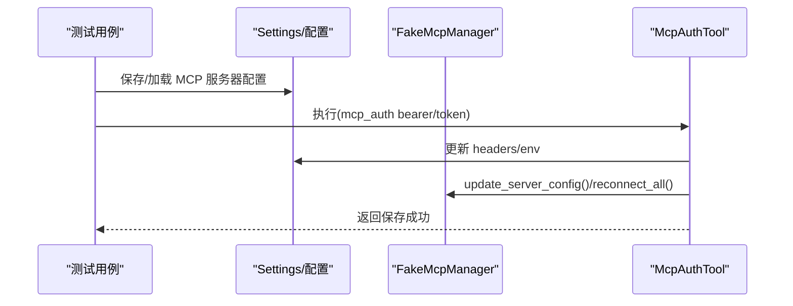

**图表来源**
- [tests/test_tools/test_mcp_auth_tool.py: 35-L58:35-58](file://tests/test_tools/test_mcp_auth_tool.py#L35-L58)
- [tests/test_tools/test_mcp_auth_tool.py: 62-L81:62-81](file://tests/test_tools/test_mcp_auth_tool.py#L62-L81)
- [tests/test_tools/test_mcp_auth_tool.py: 84-L102:84-102](file://tests/test_tools/test_mcp_auth_tool.py#L84-L102)

**章节来源**
- [tests/test_tools/test_mcp_auth_tool.py: 35-L58:35-58](file://tests/test_tools/test_mcp_auth_tool.py#L35-L58)
- [tests/test_tools/test_mcp_auth_tool.py: 62-L81:62-81](file://tests/test_tools/test_mcp_auth_tool.py#L62-L81)
- [tests/test_tools/test_mcp_auth_tool.py: 84-L102:84-102](file://tests/test_tools/test_mcp_auth_tool.py#L84-L102)

### 任务工具测试
- 任务创建与输出：创建本地 Bash 任务，轮询输出直至包含预期文本。
- 团队创建：验证团队创建返回值。
- 任务更新：设置进度、状态备注与描述，断言持久化后的元数据一致。
- 代理工具：验证远程代理与进程内队友两种模式的创建与元数据。

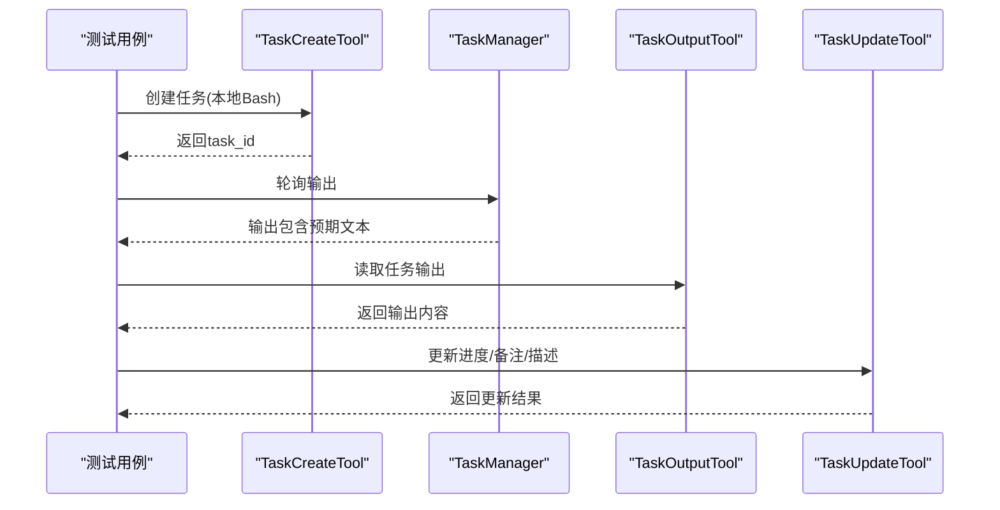

**图表来源**
- [tests/test_tools/test_task_tools.py: 19-L45:19-45](file://tests/test_tools/test_task_tools.py#L19-L45)
- [tests/test_tools/test_task_tools.py: 58-L88:58-88](file://tests/test_tools/test_task_tools.py#L58-L88)
- [tests/test_tools/test_task_tools.py: 91-L111:91-111](file://tests/test_tools/test_task_tools.py#L91-L111)

**章节来源**
- [tests/test_tools/test_task_tools.py: 19-L45:19-45](file://tests/test_tools/test_task_tools.py#L19-L45)
- [tests/test_tools/test_task_tools.py: 48-L55:48-55](file://tests/test_tools/test_task_tools.py#L48-L55)
- [tests/test_tools/test_task_tools.py: 58-L88:58-88](file://tests/test_tools/test_task_tools.py#L58-L88)
- [tests/test_tools/test_task_tools.py: 91-L111:91-111](file://tests/test_tools/test_task_tools.py#L91-L111)

### Web 获取工具测试
- 基于本地 HTTP 服务器的 HTML 抓取：验证响应头、内容长度与正文解析。
- Web 搜索：通过自定义搜索 URL 返回结构化结果，断言链接与摘要字段。

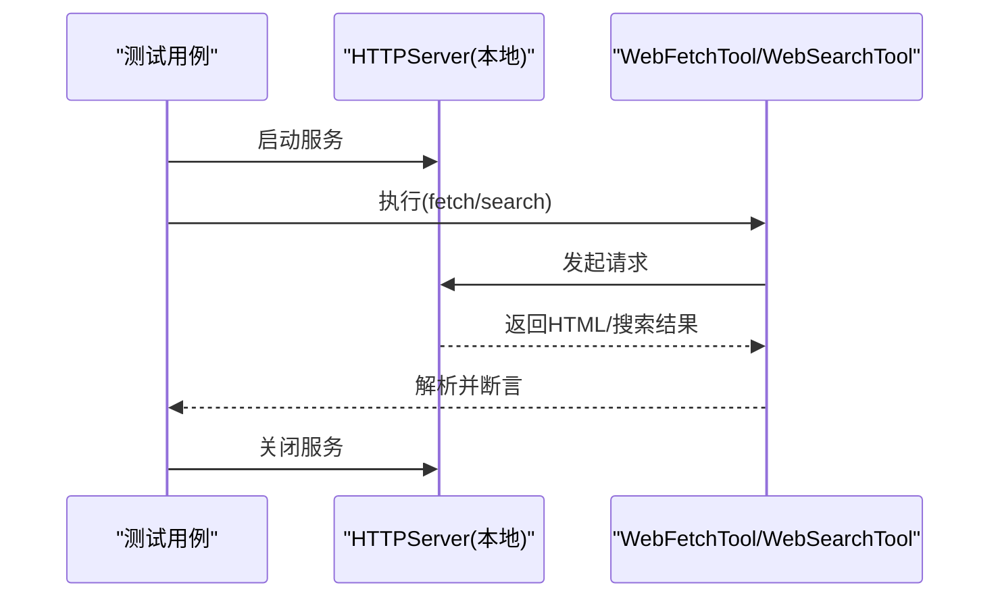

**图表来源**
- [tests/test_tools/test_web_fetch_tool.py: 41-L61:41-61](file://tests/test_tools/test_web_fetch_tool.py#L41-L61)
- [tests/test_tools/test_web_fetch_tool.py: 63-L87:63-87](file://tests/test_tools/test_web_fetch_tool.py#L63-L87)

**章节来源**
- [tests/test_tools/test_web_fetch_tool.py: 41-L61:41-61](file://tests/test_tools/test_web_fetch_tool.py#L41-L61)
- [tests/test_tools/test_web_fetch_tool.py: 63-L87:63-87](file://tests/test_tools/test_web_fetch_tool.py#L63-L87)

### MCP 集成测试
- 配置合并：将插件中的 MCP 服务器配置与用户设置合并，确保键名唯一。
- 工具注册：MCP 工具在注册表中可用，输入模式校验通过，执行返回约定格式。
- 资源读取：列出资源与读取资源 URI 的结果包含预期内容。

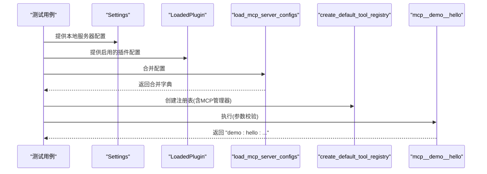

**图表来源**
- [tests/test_mcp/test_integration.py: 35-L50:35-50](file://tests/test_mcp/test_integration.py#L35-L50)
- [tests/test_mcp/test_integration.py: 52-L80:52-80](file://tests/test_mcp/test_integration.py#L52-L80)

**章节来源**
- [tests/test_mcp/test_integration.py: 35-L50:35-50](file://tests/test_mcp/test_integration.py#L35-L50)
- [tests/test_mcp/test_integration.py: 52-L80:52-80](file://tests/test_mcp/test_integration.py#L52-L80)

### MCP STDIO 流测试
- 实际 STDIO 连接：通过假服务器脚本启动 MCP 服务，连接后列出工具与资源。
- 工具与资源调用：注册表中 MCP 工具可用，执行返回约定格式；资源读取包含预期内容。

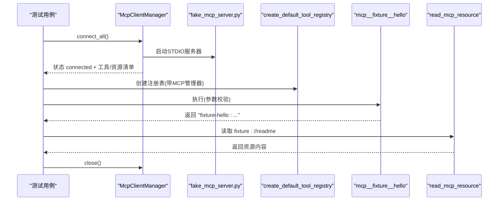

**图表来源**
- [tests/test_mcp/test_stdio_flow.py: 16-L55:16-55](file://tests/test_mcp/test_stdio_flow.py#L16-L55)
- [tests/fixtures/fake_mcp_server.py: 1-L22:1-22](file://tests/fixtures/fake_mcp_server.py#L1-L22)

**章节来源**
- [tests/test_mcp/test_stdio_flow.py: 16-L55:16-55](file://tests/test_mcp/test_stdio_flow.py#L16-L55)
- [tests/fixtures/fake_mcp_server.py: 1-L22:1-22](file://tests/fixtures/fake_mcp_server.py#L1-L22)

### 权限测试
- 默认模式：只允许只读操作，修改类操作需要确认。
- 计划模式：阻止所有写入与破坏性操作。
- 全自动模式：允许修改类操作。

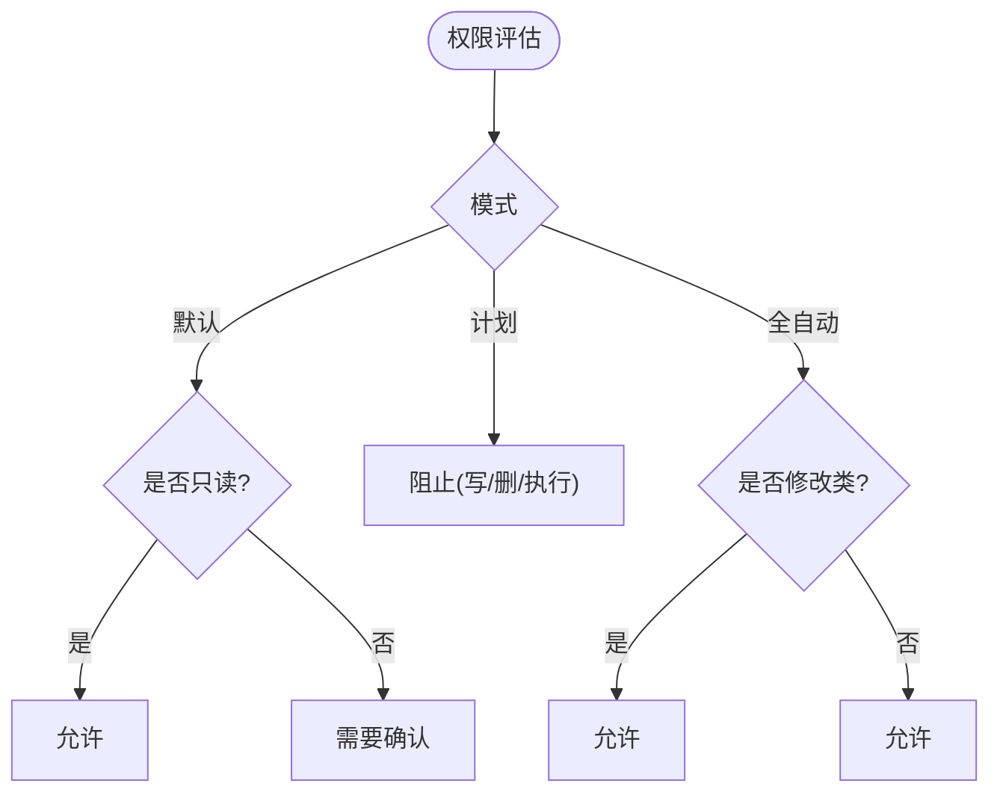

**图表来源**
- [tests/test_permissions/test_checker.py: 7-L32:7-32](file://tests/test_permissions/test_checker.py#L7-L32)

**章节来源**
- [tests/test_permissions/test_checker.py: 7-L32:7-32](file://tests/test_permissions/test_checker.py#L7-L32)

### 端到端测试概览
- 烟雾测试（6 个场景）：文件 I/O、搜索编辑、任务流、技能流、MCP 模型/资源、上下文流、代理流、插件组合、用户问答、任务更新、笔记本、LSP、计划任务、工作树、问题/PR 上下文、MCP 认证流等。
- Harness 特性测试：API 重试配置与真实调用、技能加载与系统提示注入、并行工具执行代码存在性、路径级权限与命令拒绝模式。
- 真实技能与插件测试：安装并加载真实技能与插件，验证钩子结构与命令内容。
- CLI 标志测试：帮助输出分组、打印模式、JSON 输出、子命令列表与认证状态。

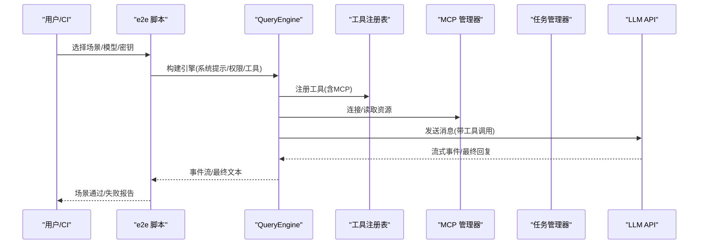

**图表来源**
- [scripts/e2e_smoke.py: 694-L757:694-757](file://scripts/e2e_smoke.py#L694-L757)
- [scripts/test_harness_features.py: 44-L73:44-73](file://scripts/test_harness_features.py#L44-L73)
- [scripts/test_real_skills_plugins.py: 50-L71:50-71](file://scripts/test_real_skills_plugins.py#L50-L71)
- [scripts/test_cli_flags.py: 40-L69:40-69](file://scripts/test_cli_flags.py#L40-L69)

**章节来源**
- [scripts/e2e_smoke.py: 415-L691:415-691](file://scripts/e2e_smoke.py#L415-L691)
- [scripts/test_harness_features.py: 44-L73:44-73](file://scripts/test_harness_features.py#L44-L73)
- [scripts/test_real_skills_plugins.py: 50-L71:50-71](file://scripts/test_real_skills_plugins.py#L50-L71)
- [scripts/test_cli_flags.py: 40-L69:40-69](file://scripts/test_cli_flags.py#L40-L69)

## 依赖关系分析
- 测试运行器：pytest 配置位于 pyproject.toml，异步模式开启，测试目录 tests。
- 工具注册表：默认注册表提供工具名称到实现的映射，MCP 工具以命名空间前缀注册。
- MCP 管理器：负责连接 STDIO/HTTP 服务器，暴露工具与资源列表，支持重连。
- 任务管理器：提供任务创建、输出读取、元数据更新与查询。
- 权限检查器：根据模式与规则评估工具调用许可。

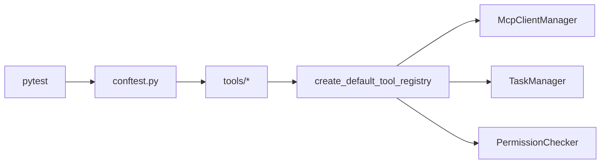

**图表来源**
- [pyproject.toml: 47-49:47-49](file://pyproject.toml#L47-L49)
- [tests/conftest.py: 1-L2:1-2](file://tests/conftest.py#L1-L2)
- [tests/test_tools/test_integration_flows.py: 10-L17:10-17](file://tests/test_tools/test_integration_flows.py#L10-L17)

**章节来源**
- [pyproject.toml: 47-49:47-49](file://pyproject.toml#L47-L49)
- [tests/conftest.py: 1-L2:1-2](file://tests/conftest.py#L1-L2)
- [tests/test_tools/test_integration_flows.py: 10-L17:10-17](file://tests/test_tools/test_integration_flows.py#L10-L17)

## 性能考虑
- 并行工具执行：查询循环支持并发执行工具，同时保留单工具快速路径，减少不必要的等待。
- 任务输出轮询：在集成测试中采用指数退避与超时控制，避免忙等。
- MCP 连接复用：通过管理器连接一次，多次工具调用复用连接，降低握手开销。
- 端到端场景：使用临时目录隔离测试数据，避免磁盘 IO 影响其他测试。

**章节来源**
- [scripts/test_harness_features.py: 142-L151:142-151](file://scripts/test_harness_features.py#L142-L151)
- [tests/test_tools/test_integration_flows.py: 89-L96:89-96](file://tests/test_tools/test_integration_flows.py#L89-L96)
- [tests/test_mcp/test_stdio_flow.py: 16-L33:16-33](file://tests/test_mcp/test_stdio_flow.py#L16-L33)

## 故障排查指南
- 权限相关失败
  - 症状：写入/删除/执行被阻止。
  - 排查：确认当前模式（默认/计划/全自动），检查路径规则与命令拒绝列表。
  - 参考：[tests/test_permissions/test_checker.py:21-32](file://tests/test_permissions/test_checker.py#L21-L32)
- MCP 认证未生效
  - 症状：工具调用失败或无权限。
  - 排查：确认设置中 headers/env 是否更新，管理器是否触发重连。
  - 参考：[tests/test_tools/test_mcp_auth_tool.py:35-58](file://tests/test_tools/test_mcp_auth_tool.py#L35-L58)
- 任务输出为空或延迟
  - 症状：task_output 未立即返回。
  - 排查：增加轮询间隔与超时，确认任务类型与命令输出。
  - 参考：[tests/test_tools/test_task_tools.py:35-44](file://tests/test_tools/test_task_tools.py#L35-L44)
- Web 抓取/搜索异常
  - 症状：HTML 解析失败或搜索结果缺失。
  - 排查：检查本地服务器响应头、内容类型与编码，确认搜索 URL 参数。
  - 参考：[tests/test_tools/test_web_fetch_tool.py:41-61](file://tests/test_tools/test_web_fetch_tool.py#L41-L61)
- 端到端场景失败
  - 症状：最终文本不匹配或工具序列缺失。
  - 排查：核对场景期望工具集合、验证函数、临时目录清理与环境变量。
  - 参考：[scripts/e2e_smoke.py:93-104](file://scripts/e2e_smoke.py#L93-L104)

**章节来源**
- [tests/test_permissions/test_checker.py: 21-L32:21-32](file://tests/test_permissions/test_checker.py#L21-L32)
- [tests/test_tools/test_mcp_auth_tool.py: 35-L58:35-58](file://tests/test_tools/test_mcp_auth_tool.py#L35-L58)
- [tests/test_tools/test_task_tools.py: 35-L44:35-44](file://tests/test_tools/test_task_tools.py#L35-L44)
- [tests/test_tools/test_web_fetch_tool.py: 41-L61:41-61](file://tests/test_tools/test_web_fetch_tool.py#L41-L61)
- [scripts/e2e_smoke.py: 93-L104:93-104](file://scripts/e2e_smoke.py#L93-L104)

## 结论
OpenHarness 的测试套件通过“单元 + 集成 + 端到端”的分层设计，覆盖了工具执行、权限策略、MCP 集成、任务编排与真实场景验证。测试数据与环境通过夹具与临时目录隔离，确保可重复性与稳定性。建议在新增工具或功能时，同步补充单元与集成测试，并在关键路径加入端到端场景以保障整体质量。

## 附录

### 测试数据准备与环境配置
- 临时目录：使用 pytest 的 tmp_path 或临时目录隔离测试数据。
- 环境变量：OPENHARNESS_CONFIG_DIR、OPENHARNESS_DATA_DIR、ANTHROPIC_BASE_URL、ANTHROPIC_MODEL、ANTHROPIC_AUTH_TOKEN。
- MCP 服务器：可通过 STDIO 启动假服务器脚本，或配置 HTTP 服务器。
- Git 支持：工作树测试需初始化仓库并设置用户信息。

**章节来源**
- [tests/test_tools/test_core_tools.py: 180-L220:180-220](file://tests/test_tools/test_core_tools.py#L180-L220)
- [tests/test_tools/test_integration_flows.py: 48-L51:48-51](file://tests/test_tools/test_integration_flows.py#L48-L51)
- [tests/test_tools/test_mcp_auth_tool.py: 36-L44:36-44](file://tests/test_tools/test_mcp_auth_tool.py#L36-L44)
- [tests/fixtures/fake_mcp_server.py: 1-L22:1-22](file://tests/fixtures/fake_mcp_server.py#L1-L22)

### 测试策略与组合
- 单元测试：验证工具输入校验、执行逻辑与边界条件。
- 集成测试：验证工具注册表、任务管理器、MCP 管理器与权限检查器的协同。
- 端到端测试：通过真实模型调用与脚本驱动场景，覆盖复杂业务流程与外部依赖。

**章节来源**
- [README.md: 282-298:282-298](file://README.md#L282-L298)
- [scripts/test_harness_features.py: 206-L236:206-236](file://scripts/test_harness_features.py#L206-L236)
- [scripts/test_real_skills_plugins.py: 308-L343:308-343](file://scripts/test_real_skills_plugins.py#L308-L343)
- [scripts/test_cli_flags.py: 127-L154:127-154](file://scripts/test_cli_flags.py#L127-L154)

### 维护与扩展指南
- 新增工具测试：遵循现有测试命名与组织方式，在 tests/test_tools 下添加对应文件，使用 asyncio 标记与 ToolExecutionContext。
- 新增集成测试：在 tests/test_tools 中添加跨工具编排场景，利用 create_default_tool_registry 与临时目录。
- 新增 MCP 测试：编写 STDIO/HTTP 服务器脚本，或复用假服务器，验证工具注册与资源读取。
- 新增端到端场景：在 scripts/e2e_smoke.py 中定义场景与验证函数，确保最终文本与工具序列符合预期。
- 权限与错误处理：为关键分支添加权限决策与异常路径测试，确保失败场景可预期且可诊断。

**章节来源**
- [tests/test_tools/test_core_tools.py: 1-L248:1-248](file://tests/test_tools/test_core_tools.py#L1-L248)
- [tests/test_tools/test_integration_flows.py: 1-L282:1-282](file://tests/test_tools/test_integration_flows.py#L1-L282)
- [tests/test_mcp/test_stdio_flow.py: 1-L55:1-55](file://tests/test_mcp/test_stdio_flow.py#L1-L55)
- [scripts/e2e_smoke.py: 415-L691:415-691](file://scripts/e2e_smoke.py#L415-L691)