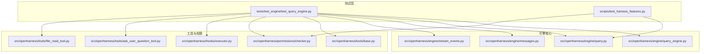
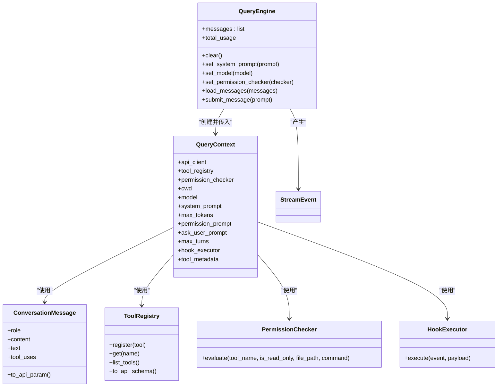
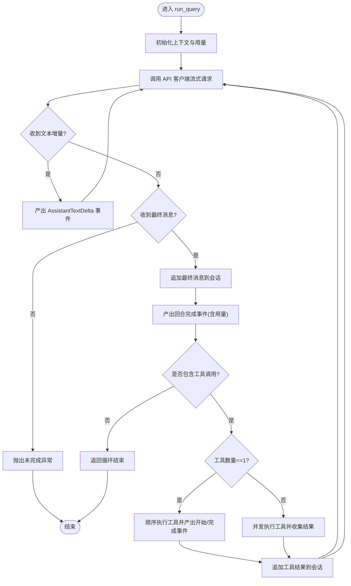
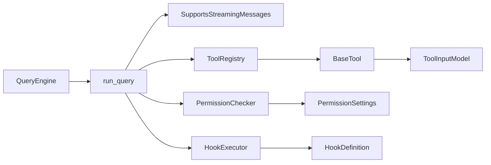

# 引擎测试套件

<cite>
**本文引用的文件**
- [tests/test_engine/test_query_engine.py](file://tests/test_engine/test_query_engine.py)
- [src/openharness/engine/query_engine.py](file://src/openharness/engine/query_engine.py)
- [src/openharness/engine/query.py](file://src/openharness/engine/query.py)
- [src/openharness/engine/messages.py](file://src/openharness/engine/messages.py)
- [src/openharness/engine/stream_events.py](file://src/openharness/engine/stream_events.py)
- [src/openharness/tools/base.py](file://src/openharness/tools/base.py)
- [src/openharness/hooks/executor.py](file://src/openharness/hooks/executor.py)
- [src/openharness/permissions/checker.py](file://src/openharness/permissions/checker.py)
- [src/openharness/tools/ask_user_question_tool.py](file://src/openharness/tools/ask_user_question_tool.py)
- [src/openharness/tools/file_read_tool.py](file://src/openharness/tools/file_read_tool.py)
- [scripts/test_harness_features.py](file://scripts/test_harness_features.py)
</cite>

## 目录
1. [简介](#简介)
2. [项目结构](#项目结构)
3. [核心组件](#核心组件)
4. [架构总览](#架构总览)
5. [详细组件分析](#详细组件分析)
6. [依赖分析](#依赖分析)
7. [性能考虑](#性能考虑)
8. [故障排查指南](#故障排查指南)
9. [结论](#结论)
10. [附录](#附录)

## 简介
本文件面向 OpenHarness 引擎测试套件，系统性阐述查询引擎（QueryEngine）的测试设计与实现要点，覆盖代理循环测试、消息处理测试、工具调用测试、权限与钩子拦截测试、用户交互工具测试等。文档同时解释测试用例如何验证引擎的正确行为（对话管理、状态跟踪、性能指标），并给出测试数据构造方法、测试场景设计思路、调试技巧与性能测试方法，帮助开发者确保引擎的稳定性与可靠性。

## 项目结构
OpenHarness 的测试集中在 tests/test_engine 下，核心围绕 QueryEngine 及其协作模块（消息模型、流事件、工具注册表、权限检查器、钩子执行器等）。脚本目录 scripts 提供端到端功能测试，用于验证重试机制、并行工具执行路径、路径级权限等特性。



图表来源
- [tests/test_engine/test_query_engine.py:1-252](file://tests/test_engine/test_query_engine.py#L1-L252)
- [src/openharness/engine/query_engine.py:1-101](file://src/openharness/engine/query_engine.py#L1-L101)
- [src/openharness/engine/query.py:1-212](file://src/openharness/engine/query.py#L1-L212)
- [src/openharness/engine/messages.py:1-109](file://src/openharness/engine/messages.py#L1-L109)
- [src/openharness/engine/stream_events.py:1-50](file://src/openharness/engine/stream_events.py#L1-L50)
- [src/openharness/tools/base.py:1-76](file://src/openharness/tools/base.py#L1-L76)
- [src/openharness/tools/ask_user_question_tool.py:1-47](file://src/openharness/tools/ask_user_question_tool.py#L1-L47)
- [src/openharness/tools/file_read_tool.py:1-63](file://src/openharness/tools/file_read_tool.py#L1-L63)
- [src/openharness/permissions/checker.py:1-100](file://src/openharness/permissions/checker.py#L1-L100)
- [src/openharness/hooks/executor.py:1-217](file://src/openharness/hooks/executor.py#L1-L217)
- [scripts/test_harness_features.py:1-241](file://scripts/test_harness_features.py#L1-L241)

章节来源
- [tests/test_engine/test_query_engine.py:1-252](file://tests/test_engine/test_query_engine.py#L1-L252)
- [scripts/test_harness_features.py:1-241](file://scripts/test_harness_features.py#L1-L241)

## 核心组件
- 查询引擎 QueryEngine：负责维护会话历史、聚合使用量、驱动一次完整的“用户提问—模型回复—工具调用—结果回传”的循环，并通过流式事件对外输出。
- 查询循环 run_query：实现核心代理循环逻辑，支持单工具顺序执行与多工具并发执行，处理文本增量、回合完成、工具执行开始/完成等事件。
- 消息模型与流事件：定义对话消息、文本块、工具调用/结果块以及引擎产生的流事件类型，保证消息序列化与事件一致性。
- 工具注册表与工具基类：提供工具注册、API Schema 导出、工具输入校验与执行上下文传递。
- 权限检查器：基于配置模式与规则（工具白/黑名单、路径规则、命令模式匹配）进行决策，必要时触发用户确认或直接拒绝。
- 钩子执行器：在工具使用前后注入可编程拦截逻辑，支持命令、HTTP、提示词型与智能体型钩子，统一返回阻断/放行与原因。
- 用户交互工具 ask_user_question：允许模型请求用户回答问题，由外部回调提供答案，增强人机协作能力。
- 文件读取工具 file_read：演示只读工具的实现方式，包含路径解析、二进制检测、范围读取与编号输出。

章节来源
- [src/openharness/engine/query_engine.py:1-101](file://src/openharness/engine/query_engine.py#L1-L101)
- [src/openharness/engine/query.py:1-212](file://src/openharness/engine/query.py#L1-L212)
- [src/openharness/engine/messages.py:1-109](file://src/openharness/engine/messages.py#L1-L109)
- [src/openharness/engine/stream_events.py:1-50](file://src/openharness/engine/stream_events.py#L1-L50)
- [src/openharness/tools/base.py:1-76](file://src/openharness/tools/base.py#L1-L76)
- [src/openharness/permissions/checker.py:1-100](file://src/openharness/permissions/checker.py#L1-L100)
- [src/openharness/hooks/executor.py:1-217](file://src/openharness/hooks/executor.py#L1-L217)
- [src/openharness/tools/ask_user_question_tool.py:1-47](file://src/openharness/tools/ask_user_question_tool.py#L1-L47)
- [src/openharness/tools/file_read_tool.py:1-63](file://src/openharness/tools/file_read_tool.py#L1-L63)

## 架构总览
下图展示测试用例如何驱动 QueryEngine，经由 run_query 执行模型与工具调用，并通过流事件反馈给上层消费者。

```mermaid
sequenceDiagram
participant Test as "测试用例"
participant Engine as "QueryEngine"
participant Loop as "run_query"
participant API as "模拟/真实 API 客户端"
participant Tools as "工具注册表"
participant Perm as "权限检查器"
participant Hooks as "钩子执行器"
Test->>Engine : "submit_message(用户输入)"
Engine->>Loop : "构建 QueryContext 并启动循环"
Loop->>API : "stream_message(模型请求)"
API-->>Loop : "ApiTextDeltaEvent 文本增量"
Loop-->>Engine : "AssistantTextDelta 事件"
API-->>Loop : "ApiMessageCompleteEvent 最终消息+用量"
Loop-->>Engine : "AssistantTurnComplete 事件"
alt 存在工具调用
Loop->>Hooks : "PRE_TOOL_USE 钩子"
Hooks-->>Loop : "允许/阻断及原因"
Loop->>Perm : "evaluate(工具名, 是否只读, 路径/命令)"
Perm-->>Loop : "允许/需要确认/拒绝"
Loop->>Tools : "执行工具(并发或顺序)"
Tools-->>Loop : "ToolResult"
Loop->>Hooks : "POST_TOOL_USE 钩子"
Hooks-->>Loop : "记录结果"
Loop-->>Engine : "ToolExecutionStarted/Completed 事件"
end
Engine-->>Test : "异步事件流"
```

图表来源
- [src/openharness/engine/query_engine.py:81-101](file://src/openharness/engine/query_engine.py#L81-L101)
- [src/openharness/engine/query.py:53-122](file://src/openharness/engine/query.py#L53-L122)
- [src/openharness/hooks/executor.py:49-63](file://src/openharness/hooks/executor.py#L49-L63)
- [src/openharness/permissions/checker.py:43-99](file://src/openharness/permissions/checker.py#L43-L99)

## 详细组件分析

### 测试用例概览与目标
- 代理循环测试：验证从提交用户消息到模型最终回复的完整流程，包括文本增量事件与回合完成事件。
- 消息处理测试：验证工具调用的解析与执行，以及工具结果回传后模型的二次回复。
- 工具调用测试：覆盖单工具顺序执行与多工具并发执行路径，确保事件顺序与结果正确。
- 权限与钩子拦截测试：验证 PRE_TOOL_USE 钩子对工具调用的阻断与错误输出。
- 用户交互工具测试：验证 ask_user_question 工具通过外部回调返回用户答案。

章节来源
- [tests/test_engine/test_query_engine.py:68-252](file://tests/test_engine/test_query_engine.py#L68-L252)

#### 代理循环测试
- 目标：验证 QueryEngine 在纯文本回复场景下的行为，包括事件类型、用量统计与消息历史长度。
- 关键断言：
  - 第一个事件为文本增量事件，内容与期望一致；
  - 最后一个事件为回合完成事件；
  - 总用量统计正确；
  - 会话消息数量符合预期（用户消息 + 助手消息）。

章节来源
- [tests/test_engine/test_query_engine.py:68-97](file://tests/test_engine/test_query_engine.py#L68-L97)

#### 消息处理测试（工具调用）
- 目标：验证模型在回复中包含工具调用时，引擎能正确识别并执行工具，随后将工具结果回传给模型以生成最终回复。
- 关键断言：
  - 触发 ToolExecutionStarted 事件；
  - 至少一个 ToolExecutionCompleted 事件，且输出包含预期片段；
  - 回合结束时，最终消息文本包含汇总信息；
  - 会话消息数量符合“用户—助手—工具结果—助手”四条消息。

章节来源
- [tests/test_engine/test_query_engine.py:99-146](file://tests/test_engine/test_query_engine.py#L99-L146)

#### 权限与钩子拦截测试
- 目标：验证 PRE_TOOL_USE 钩子在匹配工具名时可阻断工具调用，并返回错误结果。
- 关键断言：
  - 工具执行完成事件存在；
  - 结果标记为错误；
  - 输出包含钩子提供的拒绝原因。

章节来源
- [tests/test_engine/test_query_engine.py:148-204](file://tests/test_engine/test_query_engine.py#L148-L204)

#### 用户交互工具测试
- 目标：验证 ask_user_question 工具通过外部回调获取用户答案，并将答案作为工具结果返回给模型。
- 关键断言：
  - 工具执行完成事件存在；
  - 输出为用户回调返回的答案；
  - 回合完成事件的消息文本与最终输出一致。

章节来源
- [tests/test_engine/test_query_engine.py:206-252](file://tests/test_engine/test_query_engine.py#L206-L252)

### 类与数据结构关系


图表来源
- [src/openharness/engine/query_engine.py:18-101](file://src/openharness/engine/query_engine.py#L18-L101)
- [src/openharness/engine/query.py:35-51](file://src/openharness/engine/query.py#L35-L51)
- [src/openharness/engine/messages.py:39-61](file://src/openharness/engine/messages.py#L39-L61)
- [src/openharness/engine/stream_events.py:44-50](file://src/openharness/engine/stream_events.py#L44-L50)
- [src/openharness/tools/base.py:55-76](file://src/openharness/tools/base.py#L55-L76)
- [src/openharness/permissions/checker.py:30-99](file://src/openharness/permissions/checker.py#L30-L99)
- [src/openharness/hooks/executor.py:38-63](file://src/openharness/hooks/executor.py#L38-L63)

### 查询循环算法流程


图表来源
- [src/openharness/engine/query.py:53-122](file://src/openharness/engine/query.py#L53-L122)

### 工具调用与权限检查流程
```mermaid
sequenceDiagram
participant Loop as "run_query"
participant Hooks as "HookExecutor"
participant Perm as "PermissionChecker"
participant Reg as "ToolRegistry"
participant Tool as "具体工具"
Loop->>Hooks : "PRE_TOOL_USE(工具名, 输入)"
Hooks-->>Loop : "允许/阻断及原因"
alt 阻断
Loop-->>Loop : "构造错误结果"
else 允许
Loop->>Perm : "evaluate(工具名, 只读, 路径/命令)"
Perm-->>Loop : "允许/需要确认/拒绝"
alt 需要确认
Loop->>Loop : "等待用户确认(若提供回调)"
else 拒绝
Loop-->>Loop : "构造错误结果"
end
Loop->>Reg : "获取工具实例"
Reg-->>Loop : "返回工具"
Loop->>Tool : "execute(解析后的输入, 上下文)"
Tool-->>Loop : "ToolResult"
Loop->>Hooks : "POST_TOOL_USE(工具名, 输入, 输出, 错误标志)"
Hooks-->>Loop : "记录结果"
end
```

图表来源
- [src/openharness/engine/query.py:124-212](file://src/openharness/engine/query.py#L124-L212)
- [src/openharness/hooks/executor.py:49-63](file://src/openharness/hooks/executor.py#L49-L63)
- [src/openharness/permissions/checker.py:43-99](file://src/openharness/permissions/checker.py#L43-L99)
- [src/openharness/tools/base.py:30-45](file://src/openharness/tools/base.py#L30-L45)

### 端到端功能测试（脚本）
- API 重试配置与真实调用：验证重试次数、可重试状态码与指数退避延迟；运行真实模型调用以确保重试链路可用。
- 技能系统加载与注入：验证内置技能加载、系统提示中技能段落与 SkillTool 调用。
- 并行工具执行路径：通过源码检查确认 run_query 中存在 asyncio.gather 与单工具快速路径。
- 路径级权限与命令模式匹配：验证路径规则与命令拒绝模式的生效。

章节来源
- [scripts/test_harness_features.py:42-202](file://scripts/test_harness_features.py#L42-L202)

## 依赖分析
- 组件内聚与耦合：
  - QueryEngine 与 QueryContext 高内聚，前者仅负责生命周期与状态管理，后者承载运行期上下文；
  - run_query 对 API 客户端、工具注册表、权限检查器、钩子执行器形成松耦合依赖，便于测试替身注入；
  - 工具基类与注册表提供统一抽象，便于扩展新工具；
  - 权限检查器与钩子执行器分别承担策略与拦截职责，避免业务逻辑耦合。
- 外部依赖点：
  - API 客户端接口（流式消息）；
  - 工具输入模型（Pydantic）；
  - 钩子执行器依赖 HTTP 客户端与子进程执行环境。



图表来源
- [src/openharness/engine/query_engine.py:18-101](file://src/openharness/engine/query_engine.py#L18-L101)
- [src/openharness/engine/query.py:35-51](file://src/openharness/engine/query.py#L35-L51)
- [src/openharness/tools/base.py:30-53](file://src/openharness/tools/base.py#L30-L53)
- [src/openharness/permissions/checker.py:30-42](file://src/openharness/permissions/checker.py#L30-L42)
- [src/openharness/hooks/executor.py:38-63](file://src/openharness/hooks/executor.py#L38-L63)

## 性能考虑
- 并发工具执行：当存在多个工具调用时，引擎采用 asyncio.gather 并发执行，显著降低总响应时间；单工具场景走顺序路径，减少调度开销。
- 流式文本增量：通过 ApiTextDeltaEvent 实现边生成边输出，降低首字节延迟，提升用户体验。
- 使用量统计：每轮回合完成后更新用量，便于成本控制与审计。
- 端到端性能测试建议：
  - 使用脚本中的真实模型调用路径测量端到端延迟与吞吐；
  - 针对不同工具组合与并发度进行基准测试；
  - 记录并对比不同模型参数（如 max_tokens）对性能的影响。

章节来源
- [src/openharness/engine/query.py:101-118](file://src/openharness/engine/query.py#L101-L118)
- [scripts/test_harness_features.py:140-152](file://scripts/test_harness_features.py#L140-L152)

## 故障排查指南
- 常见问题定位
  - 模型未产生最终消息：检查 API 客户端实现与网络稳定性，关注异常分支。
  - 工具调用被 PRE_TOOL_USE 阻断：检查钩子匹配器与拒绝原因，确认阻断策略是否符合预期。
  - 权限拒绝或需要确认：核对工具白/黑名单、路径规则与命令模式匹配，确认是否提供用户确认回调。
  - 工具输入校验失败：检查工具输入模型定义与调用参数，确保字段类型与约束满足。
- 调试技巧
  - 使用最小化测试用例复现问题，逐步增加复杂度（多工具、嵌套工具、钩子链）。
  - 替换 API 客户端为 Deterministic Streaming 客户端，固定响应序列以便稳定复现。
  - 在工具执行前插入日志或断点，观察输入解析与权限决策路径。
  - 利用端到端脚本验证真实模型调用链路，排除本地环境差异。
- 性能测试方法
  - 基准测试：固定输入与工具组合，重复执行 N 次，统计 P50/P95 延迟与吞吐。
  - 并发压测：逐步增加工具数量与并发度，观察事件产出速率与内存占用。
  - 资源监控：结合系统监控工具观察 CPU、内存与网络 I/O 指标。

章节来源
- [src/openharness/engine/query.py:79-81](file://src/openharness/engine/query.py#L79-L81)
- [src/openharness/engine/query.py:124-212](file://src/openharness/engine/query.py#L124-L212)
- [src/openharness/hooks/executor.py:49-63](file://src/openharness/hooks/executor.py#L49-L63)
- [src/openharness/permissions/checker.py:43-99](file://src/openharness/permissions/checker.py#L43-L99)

## 结论
OpenHarness 的引擎测试套件通过高内聚的 QueryEngine 与松耦合的 run_query 循环，实现了对代理循环、消息处理、工具调用、权限与钩子拦截、用户交互等关键路径的全面覆盖。测试用例以确定性客户端与最小化场景为核心，确保行为可验证、可复现。配合端到端脚本与性能测试方法，能够有效保障引擎在真实生产环境中的稳定性与可靠性。

## 附录
- 测试数据构造方法
  - 使用 Deterministic Streaming 客户端按序产出文本增量与最终消息，便于断言顺序与内容。
  - 使用固定字符串或临时文件作为工具输入，确保结果可预测。
  - 通过 HookRegistry 注册特定匹配器与提示词，控制 PRE_TOOL_USE 的阻断行为。
- 测试场景设计思路
  - 单一工具：验证顺序执行路径与事件顺序。
  - 多个工具：验证并发执行与结果聚合。
  - 权限与钩子：验证拦截与错误传播。
  - 用户交互：验证回调注入与最终输出。
- 相关实现参考路径
  - [QueryEngine.submit_message:81-101](file://src/openharness/engine/query_engine.py#L81-L101)
  - [run_query 主循环:53-122](file://src/openharness/engine/query.py#L53-L122)
  - [消息与事件模型:1-109](file://src/openharness/engine/messages.py#L1-L109), [事件类型:1-50](file://src/openharness/engine/stream_events.py#L1-L50)
  - [工具注册与执行:55-76](file://src/openharness/tools/base.py#L55-L76)
  - [权限检查:43-99](file://src/openharness/permissions/checker.py#L43-L99)
  - [钩子执行:49-63](file://src/openharness/hooks/executor.py#L49-L63)
  - [用户交互工具:32-47](file://src/openharness/tools/ask_user_question_tool.py#L32-L47)
  - [文件读取工具:31-55](file://src/openharness/tools/file_read_tool.py#L31-L55)
  - [端到端功能测试:140-202](file://scripts/test_harness_features.py#L140-L202)