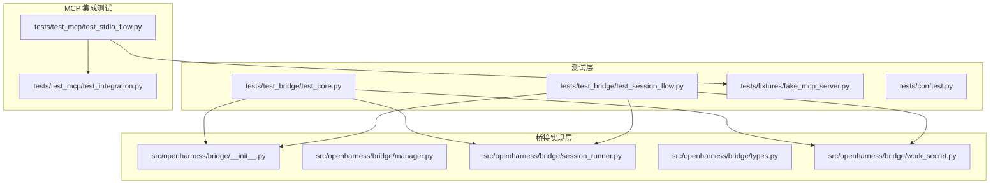
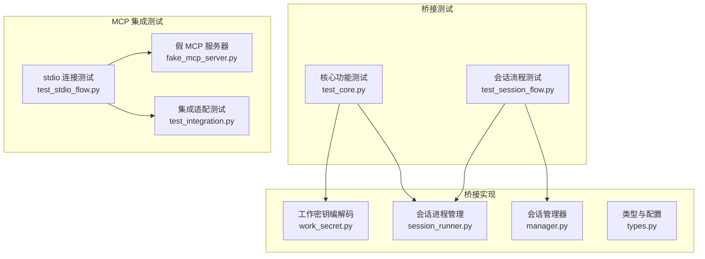
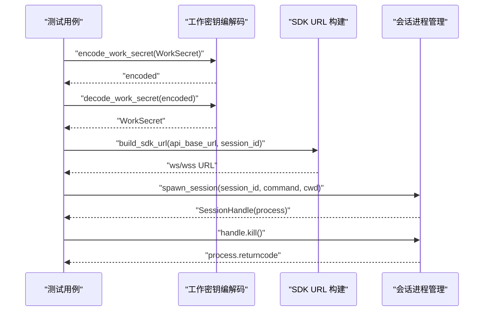
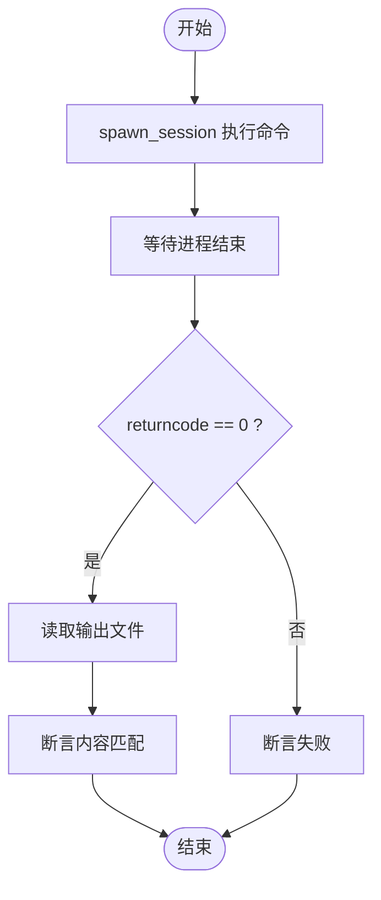
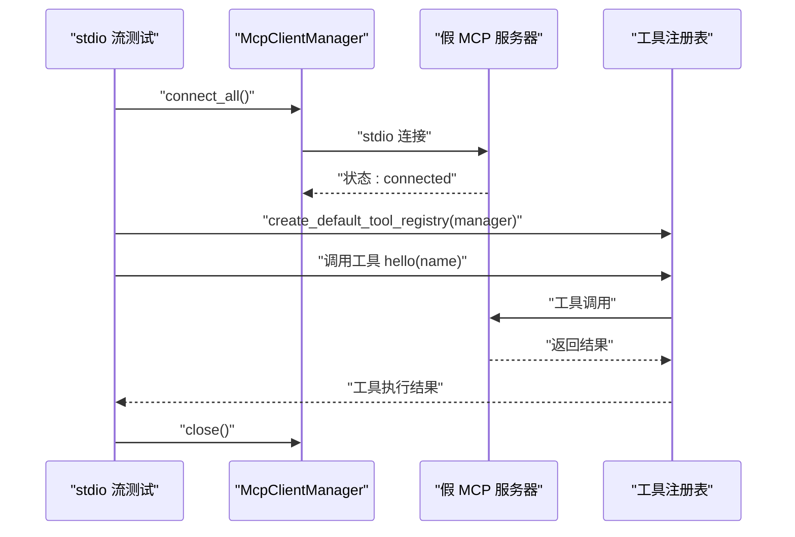
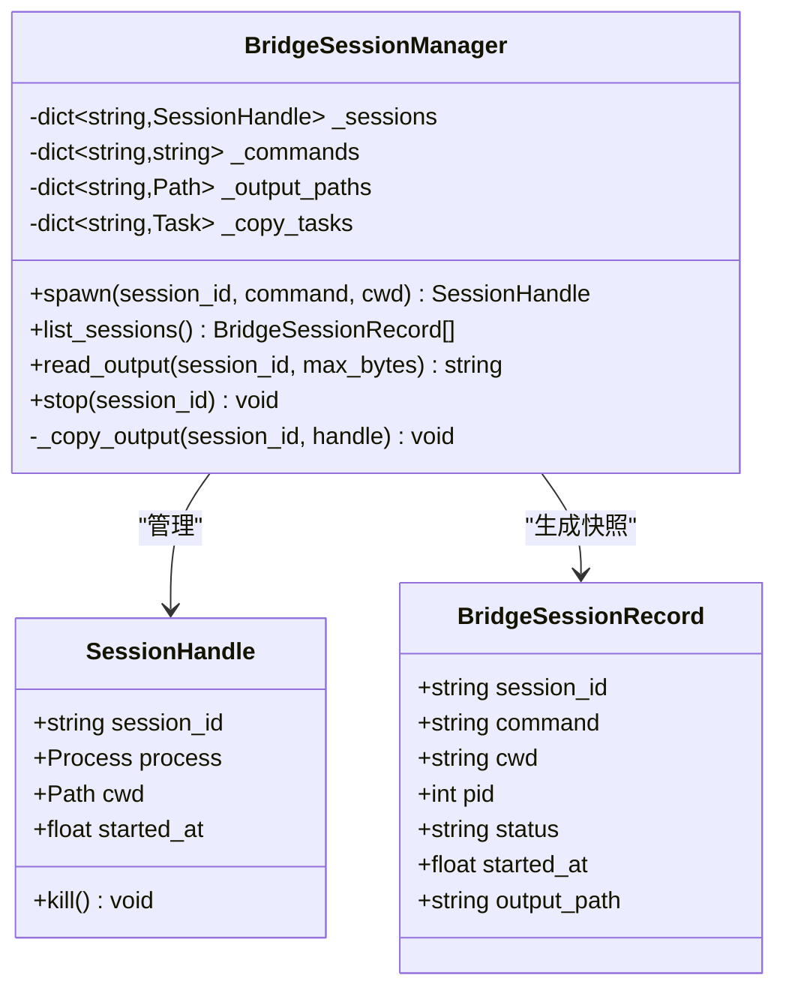
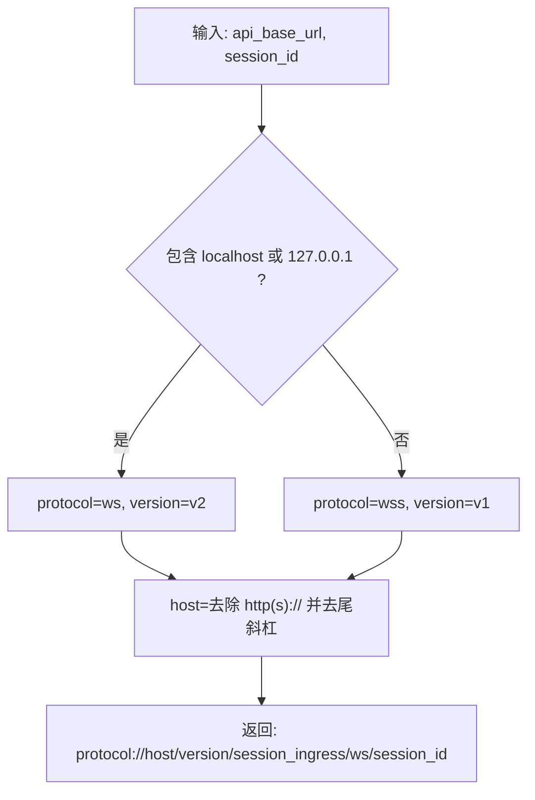
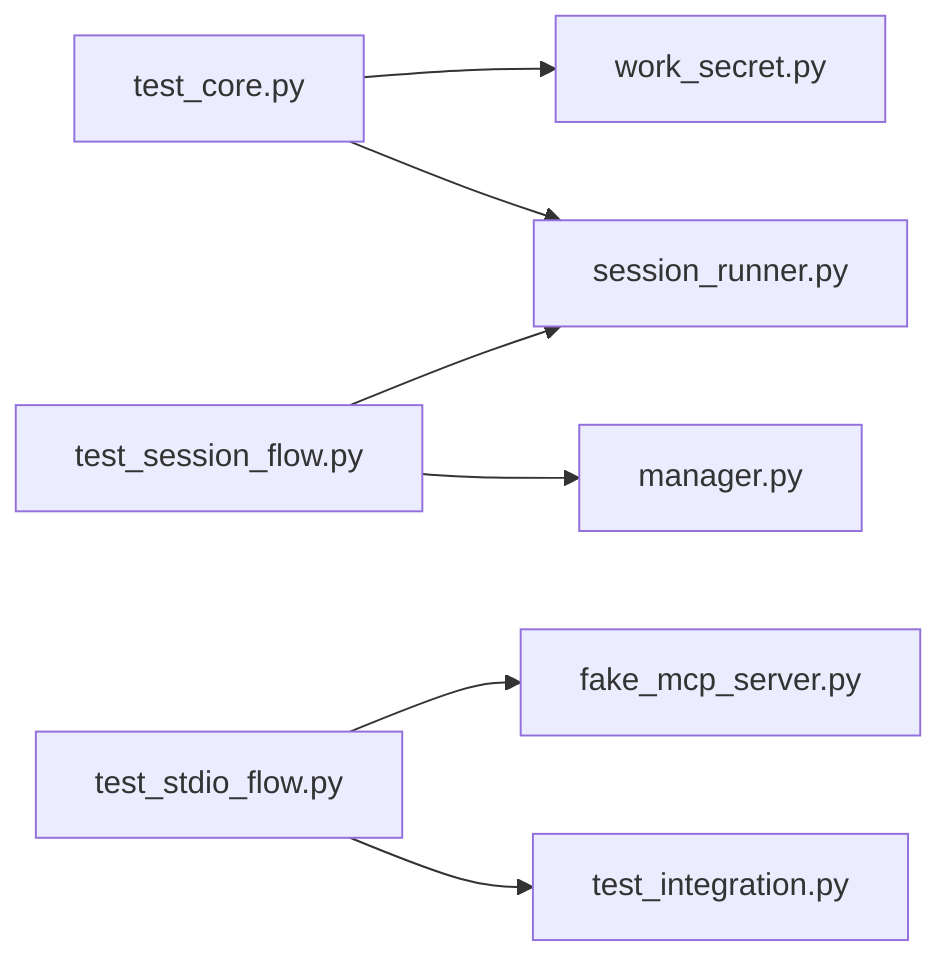

# 桥接测试套件

<cite>
**本文引用的文件**
- [README.md](file://README.md)
- [tests/test_bridge/test_core.py](file://tests/test_bridge/test_core.py)
- [tests/test_bridge/test_session_flow.py](file://tests/test_bridge/test_session_flow.py)
- [tests/fixtures/fake_mcp_server.py](file://tests/fixtures/fake_mcp_server.py)
- [tests/conftest.py](file://tests/conftest.py)
- [src/openharness/bridge/__init__.py](file://src/openharness/bridge/__init__.py)
- [src/openharness/bridge/manager.py](file://src/openharness/bridge/manager.py)
- [src/openharness/bridge/session_runner.py](file://src/openharness/bridge/session_runner.py)
- [src/openharness/bridge/types.py](file://src/openharness/bridge/types.py)
- [src/openharness/bridge/work_secret.py](file://src/openharness/bridge/work_secret.py)
- [tests/test_mcp/test_integration.py](file://tests/test_mcp/test_integration.py)
- [tests/test_mcp/test_stdio_flow.py](file://tests/test_mcp/test_stdio_flow.py)
</cite>

## 目录
1. [简介](#简介)
2. [项目结构](#项目结构)
3. [核心组件](#核心组件)
4. [架构总览](#架构总览)
5. [详细组件分析](#详细组件分析)
6. [依赖分析](#依赖分析)
7. [性能考虑](#性能考虑)
8. [故障排查指南](#故障排查指南)
9. [结论](#结论)
10. [附录](#附录)

## 简介
本文件面向 OpenHarness 的桥接测试套件，系统化梳理 MCP 会话桥接的测试设计与实现，覆盖以下主题：
- 核心桥接功能测试：工作密钥编解码、SDK URL 构建、会话进程生命周期管理
- 会话流程测试：在指定工作目录写入输出、会话状态与输出读取
- 假 MCP 服务器的作用与配置：用于真实 stdio 流集成测试
- 生命周期与状态管理：会话启动、运行、停止、输出复制与状态转换
- 错误恢复测试场景：超时终止、异常处理与资源清理
- 测试数据准备与环境隔离：临时目录、日志输出路径、并发任务隔离
- 调试指南与常见问题：日志定位、进程状态检查、URL 协议版本选择

## 项目结构
桥接测试位于 tests/test_bridge 下，核心被测模块位于 src/openharness/bridge。MCP 集成测试位于 tests/test_mcp，其中包含一个假 MCP 服务器脚本作为 stdio 测试目标。

图表来源
- [tests/test_bridge/test_core.py:1-31](file://tests/test_bridge/test_core.py#L1-L31)
- [tests/test_bridge/test_session_flow.py:1-33](file://tests/test_bridge/test_session_flow.py#L1-L33)
- [tests/fixtures/fake_mcp_server.py:1-22](file://tests/fixtures/fake_mcp_server.py#L1-L22)
- [src/openharness/bridge/__init__.py:1-21](file://src/openharness/bridge/__init__.py#L1-L21)
- [src/openharness/bridge/manager.py:1-108](file://src/openharness/bridge/manager.py#L1-L108)
- [src/openharness/bridge/session_runner.py:1-47](file://src/openharness/bridge/session_runner.py#L1-L47)
- [src/openharness/bridge/types.py:1-38](file://src/openharness/bridge/types.py#L1-L38)
- [src/openharness/bridge/work_secret.py:1-42](file://src/openharness/bridge/work_secret.py#L1-L42)
- [tests/test_mcp/test_integration.py:1-80](file://tests/test_mcp/test_integration.py#L1-L80)
- [tests/test_mcp/test_stdio_flow.py:1-55](file://tests/test_mcp/test_stdio_flow.py#L1-L55)

章节来源
- [README.md:127-147](file://README.md#L127-L147)

## 核心组件
- 工作密钥与 SDK URL
  - 工作密钥结构体定义与编解码函数，确保跨进程传递的安全与可移植性
  - SDK URL 构建函数根据基础地址自动选择 ws/wss 与版本路径
- 会话管理与生命周期
  - 会话句柄封装子进程对象，提供统一的终止接口与超时处理
  - 会话管理器负责记录命令、输出路径、并发复制任务，并维护会话状态快照
- 类型与配置
  - 定义工作项类型、会话配置默认参数（如超时时间、最大会话数）

章节来源
- [src/openharness/bridge/types.py:12-38](file://src/openharness/bridge/types.py#L12-L38)
- [src/openharness/bridge/work_secret.py:11-42](file://src/openharness/bridge/work_secret.py#L11-L42)
- [src/openharness/bridge/session_runner.py:11-47](file://src/openharness/bridge/session_runner.py#L11-L47)
- [src/openharness/bridge/manager.py:14-108](file://src/openharness/bridge/manager.py#L14-L108)

## 架构总览
桥接测试围绕“会话进程管理 + 工作密钥编解码 + SDK URL 构建”三大能力展开，同时通过假 MCP 服务器验证 stdio 流的真实连通性与工具调用。

图表来源
- [tests/test_bridge/test_core.py:10-31](file://tests/test_bridge/test_core.py#L10-L31)
- [tests/test_bridge/test_session_flow.py:9-33](file://tests/test_bridge/test_session_flow.py#L9-L33)
- [src/openharness/bridge/work_secret.py:11-42](file://src/openharness/bridge/work_secret.py#L11-L42)
- [src/openharness/bridge/session_runner.py:30-47](file://src/openharness/bridge/session_runner.py#L30-L47)
- [src/openharness/bridge/manager.py:36-96](file://src/openharness/bridge/manager.py#L36-L96)
- [src/openharness/bridge/types.py:20-38](file://src/openharness/bridge/types.py#L20-L38)
- [tests/fixtures/fake_mcp_server.py:5-22](file://tests/fixtures/fake_mcp_server.py#L5-L22)
- [tests/test_mcp/test_integration.py:17-80](file://tests/test_mcp/test_integration.py#L17-L80)
- [tests/test_mcp/test_stdio_flow.py:16-55](file://tests/test_mcp/test_stdio_flow.py#L16-L55)

## 详细组件分析

### 核心功能测试（test_core.py）
- 工作密钥往返测试：编码后解码应与原结构一致
- SDK URL 构建测试：本地地址使用 ws/wss 与不同版本路径
- 会话生命周期测试：spawn 后进程未退出，kill 后返回码非空

图表来源
- [tests/test_bridge/test_core.py:13-31](file://tests/test_bridge/test_core.py#L13-L31)
- [src/openharness/bridge/work_secret.py:11-42](file://src/openharness/bridge/work_secret.py#L11-L42)
- [src/openharness/bridge/session_runner.py:30-47](file://src/openharness/bridge/session_runner.py#L30-L47)

章节来源
- [tests/test_bridge/test_core.py:13-31](file://tests/test_bridge/test_core.py#L13-L31)

### 会话流程测试（test_session_flow.py）
- 输出写入测试：在指定工作目录执行命令，等待进程结束，断言输出文件存在且内容正确
- 密钥与 URL 流程测试：构造工作密钥，编码解码，构建 SDK URL 并断言协议与版本

图表来源
- [tests/test_bridge/test_session_flow.py:14-23](file://tests/test_bridge/test_session_flow.py#L14-L23)

章节来源
- [tests/test_bridge/test_session_flow.py:14-33](file://tests/test_bridge/test_session_flow.py#L14-L33)

### 假 MCP 服务器与 stdio 集成
- 假服务器提供工具与资源示例，便于 stdio 连接测试
- stdio 流测试通过 McpClientManager 连接服务器，验证工具列表、资源列表与调用结果

图表来源
- [tests/test_mcp/test_stdio_flow.py:16-55](file://tests/test_mcp/test_stdio_flow.py#L16-L55)
- [tests/fixtures/fake_mcp_server.py:5-22](file://tests/fixtures/fake_mcp_server.py#L5-L22)
- [tests/test_mcp/test_integration.py:17-80](file://tests/test_mcp/test_integration.py#L17-L80)

章节来源
- [tests/test_mcp/test_stdio_flow.py:16-55](file://tests/test_mcp/test_stdio_flow.py#L16-L55)
- [tests/fixtures/fake_mcp_server.py:1-22](file://tests/fixtures/fake_mcp_server.py#L1-L22)

### 会话管理器与生命周期管理
- 会话管理器负责：
  - spawn：创建子进程、记录命令与输出路径、启动输出复制任务
  - list_sessions：生成 UI 友好的状态快照（running/completed/failed）
  - read_output：读取截断后的输出文本
  - stop：终止指定会话并清理
- 输出复制采用异步流式读取，保证实时落盘

图表来源
- [src/openharness/bridge/session_runner.py:11-47](file://src/openharness/bridge/session_runner.py#L11-L47)
- [src/openharness/bridge/manager.py:14-108](file://src/openharness/bridge/manager.py#L14-L108)

章节来源
- [src/openharness/bridge/manager.py:27-108](file://src/openharness/bridge/manager.py#L27-L108)
- [src/openharness/bridge/session_runner.py:11-47](file://src/openharness/bridge/session_runner.py#L11-L47)

### 工作密钥与 SDK URL
- 工作密钥编解码：采用 base64url 编码，包含版本号、会话入口令牌与 API 基础地址
- URL 构建：根据是否本地地址选择 ws/wss 与版本路径（v1/v2），主机名去除协议前缀并去尾斜杠

图表来源
- [src/openharness/bridge/work_secret.py:11-42](file://src/openharness/bridge/work_secret.py#L11-L42)
- [src/openharness/bridge/types.py:20-38](file://src/openharness/bridge/types.py#L20-L38)

章节来源
- [src/openharness/bridge/work_secret.py:11-42](file://src/openharness/bridge/work_secret.py#L11-L42)
- [src/openharness/bridge/types.py:20-38](file://src/openharness/bridge/types.py#L20-L38)

## 依赖分析
- 模块内聚与耦合
  - 会话管理器与会话运行器强耦合：前者依赖后者创建与控制进程
  - 工作密钥编解码与 SDK URL 构建相互独立，但共同服务于会话连接
- 外部依赖
  - MCP 集成测试依赖假服务器脚本与 McpClientManager
  - 测试使用临时目录进行隔离，避免跨用例污染

图表来源
- [tests/test_bridge/test_core.py:10-31](file://tests/test_bridge/test_core.py#L10-L31)
- [tests/test_bridge/test_session_flow.py:9-33](file://tests/test_bridge/test_session_flow.py#L9-L33)
- [src/openharness/bridge/work_secret.py:11-42](file://src/openharness/bridge/work_secret.py#L11-L42)
- [src/openharness/bridge/session_runner.py:30-47](file://src/openharness/bridge/session_runner.py#L30-L47)
- [src/openharness/bridge/manager.py:36-96](file://src/openharness/bridge/manager.py#L36-L96)
- [tests/test_mcp/test_stdio_flow.py:16-55](file://tests/test_mcp/test_stdio_flow.py#L16-L55)
- [tests/fixtures/fake_mcp_server.py:5-22](file://tests/fixtures/fake_mcp_server.py#L5-L22)
- [tests/test_mcp/test_integration.py:17-80](file://tests/test_mcp/test_integration.py#L17-L80)

章节来源
- [tests/test_bridge/test_core.py:10-31](file://tests/test_bridge/test_core.py#L10-L31)
- [tests/test_bridge/test_session_flow.py:9-33](file://tests/test_bridge/test_session_flow.py#L9-L33)
- [tests/test_mcp/test_stdio_flow.py:16-55](file://tests/test_mcp/test_stdio_flow.py#L16-L55)

## 性能考虑
- 异步输出复制：使用流式读取与异步任务，避免阻塞主线程，适合长时间运行的会话
- 输出截断：读取输出时限制最大字节数，防止内存膨胀
- URL 构建：字符串拼接与条件判断开销极低，适合高频调用
- 会话超时：会话管理器配置了默认超时，结合进程终止机制，避免僵尸进程

## 故障排查指南
- 无法连接假 MCP 服务器
  - 检查 stdio 连接参数与脚本路径
  - 确认服务器脚本可执行且返回预期工具与资源
- 会话未产生输出或输出为空
  - 确认 spawn 的命令正确写入文件
  - 检查输出路径是否存在且有写权限
- URL 协议不匹配
  - 本地地址应使用 ws，远程地址使用 wss
  - 版本路径遵循本地 v2、远程 v1 的规则
- 会话无法终止
  - 使用 kill 接口，若超时则强制 kill
  - 检查进程是否已退出，避免重复终止
- 日志与状态
  - 使用会话管理器的 read_output 获取最新输出
  - 通过 list_sessions 查看状态快照，确认运行/完成/失败

章节来源
- [src/openharness/bridge/session_runner.py:20-28](file://src/openharness/bridge/session_runner.py#L20-L28)
- [src/openharness/bridge/manager.py:71-96](file://src/openharness/bridge/manager.py#L71-L96)
- [src/openharness/bridge/work_secret.py:35-42](file://src/openharness/bridge/work_secret.py#L35-L42)

## 结论
桥接测试套件通过“工作密钥编解码 + SDK URL 构建 + 会话进程管理”的组合，覆盖了 MCP 会话桥接的关键能力。配合假 MCP 服务器的 stdio 集成测试，验证了从连接、工具发现到实际调用的完整链路。测试用例强调环境隔离、输出落盘与生命周期管理，为后续扩展与回归提供了可靠保障。

## 附录
- 测试数据准备策略
  - 使用 pytest 的 tmp_path 提供隔离的工作目录
  - 输出文件写入到会话管理器指定的日志目录，便于断言与审计
- 测试环境隔离方法
  - 每个测试用例在独立的临时目录执行，避免共享状态
  - 会话管理器为每个会话创建独立输出文件，支持并发读取与截断
- 常见问题与建议
  - 若出现进程无法终止，优先尝试 kill，再 fallback 到强制 kill
  - 对于 URL 构建错误，优先核对基础地址与本地标识判断逻辑
  - 在 MCP 集成测试中，确保假服务器脚本与测试脚本在同一目录层级，避免路径解析失败