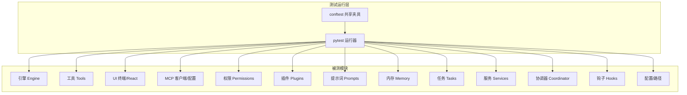
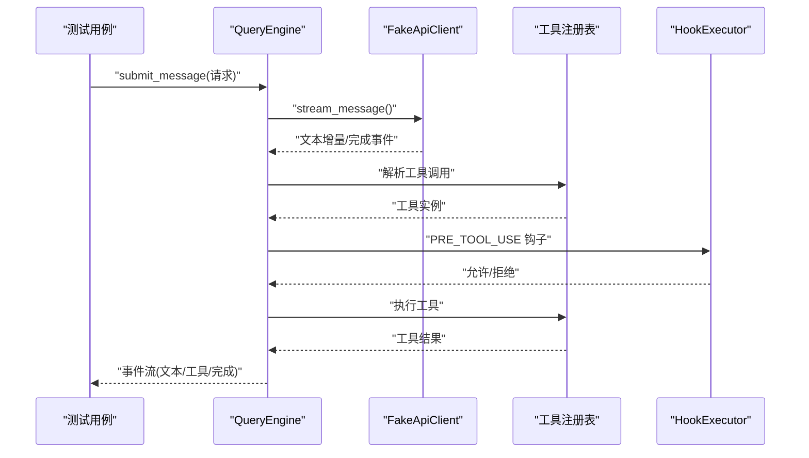
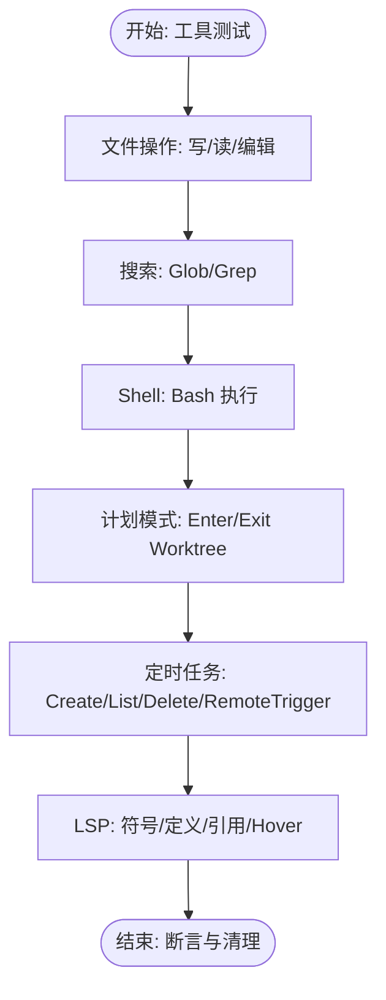
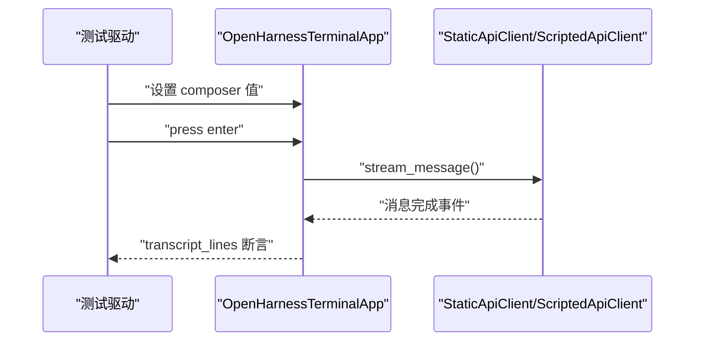
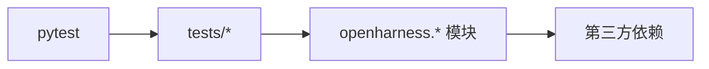

# 测试套件详解

<cite>
**本文引用的文件**
- [README.md](file://README.md)
- [pyproject.toml](file://pyproject.toml)
- [tests/conftest.py](file://tests/conftest.py)
- [tests/test_bridge/test_core.py](file://tests/test_bridge/test_core.py)
- [tests/test_bridge/test_session_flow.py](file://tests/test_bridge/test_session_flow.py)
- [tests/test_engine/test_query_engine.py](file://tests/test_engine/test_query_engine.py)
- [tests/test_tools/test_core_tools.py](file://tests/test_tools/test_core_tools.py)
- [tests/test_tools/test_integration_flows.py](file://tests/test_tools/test_integration_flows.py)
- [tests/test_tools/test_mcp_auth_tool.py](file://tests/test_tools/test_mcp_auth_tool.py)
- [tests/test_tools/test_task_tools.py](file://tests/test_tools/test_task_tools.py)
- [tests/test_tools/test_web_fetch_tool.py](file://tests/test_tools/test_web_fetch_tool.py)
- [tests/test_ui/test_textual_app.py](file://tests/test_ui/test_textual_app.py)
- [tests/test_ui/test_modes.py](file://tests/test_ui/test_modes.py)
- [tests/test_ui/test_react_backend.py](file://tests/test_ui/test_react_backend.py)
- [tests/test_ui/test_react_launcher.py](file://tests/test_ui/test_react_launcher.py)
- [tests/test_commands/test_cli.py](file://tests/test_commands/test_cli.py)
- [tests/test_commands/test_command_flows.py](file://tests/test_commands/test_command_flows.py)
- [tests/test_commands/test_registry.py](file://tests/test_commands/test_registry.py)
- [tests/test_config/test_paths.py](file://tests/test_config/test_paths.py)
- [tests/test_config/test_settings.py](file://tests/test_config/test_settings.py)
- [tests/test_coordinator/test_registry.py](file://tests/test_coordinator/test_registry.py)
- [tests/test_hooks/test_executor.py](file://tests/test_hooks/test_executor.py)
- [tests/test_mcp/test_integration.py](file://tests/test_mcp/test_integration.py)
- [tests/test_mcp/test_stdio_flow.py](file://tests/test_mcp/test_stdio_flow.py)
- [tests/test_memory/test_memdir.py](file://tests/test_memory/test_memdir.py)
- [tests/test_permissions/test_checker.py](file://tests/test_permissions/test_checker.py)
- [tests/test_plugins/test_loader.py](file://tests/test_plugins/test_loader.py)
- [tests/test_plugins/test_lifecycle_flow.py](file://tests/test_plugins/test_lifecycle_flow.py)
- [tests/test_prompts/test_claudemd.py](file://tests/test_prompts/test_claudemd.py)
- [tests/test_prompts/test_environment.py](file://tests/test_prompts/test_environment.py)
- [tests/test_prompts/test_system_prompt.py](file://tests/test_prompts/test_system_prompt.py)
- [tests/test_services/test_compact.py](file://tests/test_services/test_compact.py)
- [tests/test_services/test_session_storage.py](file://tests/test_services/test_session_storage.py)
- [tests/test_skills/test_loader.py](file://tests/test_skills/test_loader.py)
- [tests/test_tasks/test_manager.py](file://tests/test_tasks/test_manager.py)
- [tests/fixtures/fake_mcp_server.py](file://tests/fixtures/fake_mcp_server.py)
</cite>

## 目录
1. [简介](#简介)
2. [项目结构](#项目结构)
3. [核心组件](#核心组件)
4. [架构总览](#架构总览)
5. [详细组件分析](#详细组件分析)
6. [依赖关系分析](#依赖关系分析)
7. [性能考量](#性能考量)
8. [故障排查指南](#故障排查指南)
9. [结论](#结论)
10. [附录](#附录)

## 简介
本文件面向 OpenHarness 的测试套件，系统性梳理单元与集成测试、端到端（E2E）脚本的测试范围、目标与实现方式，覆盖 API 测试、桥接测试、引擎测试、工具测试、UI 测试、命令行测试、配置与路径测试、权限测试、插件与技能加载测试、任务与服务测试、提示词与记忆测试、MCP 集成测试等。文档同时给出测试数据准备与清理策略、断言与错误处理机制，并提供测试维护与开发指南。

## 项目结构
OpenHarness 的测试组织遵循“按功能域分层”的目录结构，每个子目录对应一个核心模块或特性域，包含若干测试文件，部分模块还包含共享夹具与辅助脚本。测试运行由 pytest 驱动，异步测试通过 asyncio 模式支持。

```mermaid
graph TB
A["tests 根目录"] --> B["fixtures 夹具"]
A --> C["test_api缺失"]
A --> D["test_bridge 桥接"]
A --> E["test_commands 命令行"]
A --> F["test_config 配置"]
A --> G["test_coordinator 协调器"]
A --> H["test_engine 引擎"]
A --> I["test_hooks 钩子"]
A --> J["test_mcp MCP"]
A --> K["test_memory 内存"]
A --> L["test_permissions 权限"]
A --> M["test_plugins 插件"]
A --> N["test_prompts 提示词"]
A --> O["test_services 服务"]
A --> P["test_skills 技能"]
A --> Q["test_tasks 任务"]
A --> R["test_tools 工具"]
A --> S["test_ui UI"]
A --> T["conftest.py 共享夹具"]
D --> D1["test_core.py"]
D --> D2["test_session_flow.py"]
E --> E1["test_cli.py"]
E --> E2["test_command_flows.py"]
E --> E3["test_registry.py"]
F --> F1["test_paths.py"]
F --> F2["test_settings.py"]
H --> H1["test_query_engine.py"]
J --> J1["test_integration.py"]
J --> J2["test_stdio_flow.py"]
M --> M1["test_loader.py"]
M --> M2["test_lifecycle_flow.py"]
N --> N1["test_claudemd.py"]
N --> N2["test_environment.py"]
N --> N3["test_system_prompt.py"]
O --> O1["test_compact.py"]
O --> O2["test_session_storage.py"]
P --> P1["test_loader.py"]
Q --> Q1["test_manager.py"]
R --> R1["test_core_tools.py"]
R --> R2["test_integration_flows.py"]
R --> R3["test_mcp_auth_tool.py"]
R --> R4["test_task_tools.py"]
R --> R5["test_web_fetch_tool.py"]
S --> S1["test_textual_app.py"]
S --> S2["test_modes.py"]
S --> S3["test_react_backend.py"]
S --> S4["test_react_launcher.py"]
```

图表来源
- [tests/test_bridge/test_core.py](file://tests/test_bridge/test_core.py)
- [tests/test_bridge/test_session_flow.py](file://tests/test_bridge/test_session_flow.py)
- [tests/test_engine/test_query_engine.py](file://tests/test_engine/test_query_engine.py)
- [tests/test_tools/test_core_tools.py](file://tests/test_tools/test_core_tools.py)
- [tests/test_tools/test_integration_flows.py](file://tests/test_tools/test_integration_flows.py)
- [tests/test_tools/test_mcp_auth_tool.py](file://tests/test_tools/test_mcp_auth_tool.py)
- [tests/test_tools/test_task_tools.py](file://tests/test_tools/test_task_tools.py)
- [tests/test_tools/test_web_fetch_tool.py](file://tests/test_tools/test_web_fetch_tool.py)
- [tests/test_ui/test_textual_app.py](file://tests/test_ui/test_textual_app.py)
- [tests/test_ui/test_modes.py](file://tests/test_ui/test_modes.py)
- [tests/test_ui/test_react_backend.py](file://tests/test_ui/test_react_backend.py)
- [tests/test_ui/test_react_launcher.py](file://tests/test_ui/test_react_launcher.py)
- [tests/test_commands/test_cli.py](file://tests/test_commands/test_cli.py)
- [tests/test_commands/test_command_flows.py](file://tests/test_commands/test_command_flows.py)
- [tests/test_commands/test_registry.py](file://tests/test_commands/test_registry.py)
- [tests/test_config/test_paths.py](file://tests/test_config/test_paths.py)
- [tests/test_config/test_settings.py](file://tests/test_config/test_settings.py)
- [tests/test_coordinator/test_registry.py](file://tests/test_coordinator/test_registry.py)
- [tests/test_hooks/test_executor.py](file://tests/test_hooks/test_executor.py)
- [tests/test_mcp/test_integration.py](file://tests/test_mcp/test_integration.py)
- [tests/test_mcp/test_stdio_flow.py](file://tests/test_mcp/test_stdio_flow.py)
- [tests/test_memory/test_memdir.py](file://tests/test_memory/test_memdir.py)
- [tests/test_permissions/test_checker.py](file://tests/test_permissions/test_checker.py)
- [tests/test_plugins/test_loader.py](file://tests/test_plugins/test_loader.py)
- [tests/test_plugins/test_lifecycle_flow.py](file://tests/test_plugins/test_lifecycle_flow.py)
- [tests/test_prompts/test_claudemd.py](file://tests/test_prompts/test_claudemd.py)
- [tests/test_prompts/test_environment.py](file://tests/test_prompts/test_environment.py)
- [tests/test_prompts/test_system_prompt.py](file://tests/test_prompts/test_system_prompt.py)
- [tests/test_services/test_compact.py](file://tests/test_services/test_compact.py)
- [tests/test_services/test_session_storage.py](file://tests/test_services/test_session_storage.py)
- [tests/test_skills/test_loader.py](file://tests/test_skills/test_loader.py)
- [tests/test_tasks/test_manager.py](file://tests/test_tasks/test_manager.py)

章节来源
- [README.md:282-299](file://README.md#L282-L299)
- [pyproject.toml:47-49](file://pyproject.toml#L47-L49)

## 核心组件
- 测试运行与配置：pytest 配置位于项目根配置中，测试路径指向 tests 目录，启用 asyncio 自动模式，便于异步测试。
- 共享夹具：tests/conftest.py 作为全局夹具入口，可在此注册共享 fixture，如临时目录、会话句柄等。
- 夹具与辅助：tests/fixtures/fake_mcp_server.py 提供 MCP 服务器模拟，用于工具链与 MCP 集成测试。

章节来源
- [pyproject.toml:47-49](file://pyproject.toml#L47-L49)
- [tests/conftest.py:1-2](file://tests/conftest.py#L1-L2)
- [tests/fixtures/fake_mcp_server.py](file://tests/fixtures/fake_mcp_server.py)

## 架构总览
测试体系围绕以下层次展开：
- 单元与集成测试：覆盖核心模块（引擎、工具、UI、权限、插件、MCP、提示词、内存、任务、服务等），验证内部逻辑、事件流、权限拦截、工具注册与执行、UI 交互等。
- 端到端脚本：scripts 目录下的 Python 脚本模拟真实用户场景，验证 CLI 参数、React TUI 交互、真实技能与插件、多轮对话与权限控制等。
- 数据与环境：通过临时目录、环境变量注入（如 OPENHARNESS_CONFIG_DIR、OPENHARNESS_DATA_DIR）、Git 初始化等，确保测试隔离与可重复性。

图表来源
- [tests/test_engine/test_query_engine.py](file://tests/test_engine/test_query_engine.py)
- [tests/test_tools/test_core_tools.py](file://tests/test_tools/test_core_tools.py)
- [tests/test_ui/test_textual_app.py](file://tests/test_ui/test_textual_app.py)
- [tests/test_mcp/test_integration.py](file://tests/test_mcp/test_integration.py)
- [tests/test_permissions/test_checker.py](file://tests/test_permissions/test_checker.py)
- [tests/test_plugins/test_loader.py](file://tests/test_plugins/test_loader.py)
- [tests/test_prompts/test_system_prompt.py](file://tests/test_prompts/test_system_prompt.py)
- [tests/test_memory/test_memdir.py](file://tests/test_memory/test_memdir.py)
- [tests/test_tasks/test_manager.py](file://tests/test_tasks/test_manager.py)
- [tests/test_services/test_session_storage.py](file://tests/test_services/test_session_storage.py)
- [tests/test_coordinator/test_registry.py](file://tests/test_coordinator/test_registry.py)
- [tests/test_hooks/test_executor.py](file://tests/test_hooks/test_executor.py)
- [tests/test_config/test_paths.py](file://tests/test_config/test_paths.py)

## 详细组件分析

### API 测试
- 测试目标：验证 API 客户端的消息流、文本增量事件、完整消息事件、用量统计等。
- 测试场景：构造静态与确定性流式响应，校验事件类型、消息内容、用量统计与消息历史长度。
- 断言策略：断言事件序列首尾类型、文本匹配、用量累加、消息条数等。
- 错误处理：通过异常或错误标记（如工具执行错误）验证错误传播与 UI 展示。

章节来源
- [tests/test_engine/test_query_engine.py:34-66](file://tests/test_engine/test_query_engine.py#L34-L66)
- [tests/test_engine/test_query_engine.py:68-97](file://tests/test_engine/test_query_engine.py#L68-L97)

### 桥接测试（Bridge）
- 测试目标：验证工作密钥编解码、SDK URL 构建、会话进程启动与终止。
- 测试场景：编码解码往返一致性、URL 协议推断、异步进程生命周期管理。
- 断言策略：对象相等性、协议前缀、进程返回码变化。
- 错误处理：进程异常时的返回码与资源释放。

章节来源
- [tests/test_bridge/test_core.py:13-31](file://tests/test_bridge/test_core.py#L13-L31)

### 引擎测试（Engine）
- 测试目标：验证查询引擎在纯文本回复、工具调用、预工具钩子拦截、用户提问工具等场景的行为。
- 测试场景：确定性流式客户端、静态客户端、带钩子定义的工具执行、异步用户应答。
- 断言策略：事件序列类型与顺序、工具执行结果、错误标记、最终消息与用量统计。
- 错误处理：钩子拒绝导致的错误输出、工具执行失败的错误标记。

图表来源
- [tests/test_engine/test_query_engine.py:100-146](file://tests/test_engine/test_query_engine.py#L100-L146)
- [tests/test_engine/test_query_engine.py:148-204](file://tests/test_engine/test_query_engine.py#L148-L204)
- [tests/test_engine/test_query_engine.py:206-252](file://tests/test_engine/test_query_engine.py#L206-L252)

章节来源
- [tests/test_engine/test_query_engine.py:68-97](file://tests/test_engine/test_query_engine.py#L68-L97)
- [tests/test_engine/test_query_engine.py:100-146](file://tests/test_engine/test_query_engine.py#L100-L146)
- [tests/test_engine/test_query_engine.py:148-204](file://tests/test_engine/test_query_engine.py#L148-L204)
- [tests/test_engine/test_query_engine.py:206-252](file://tests/test_engine/test_query_engine.py#L206-L252)

### 工具测试（Tools）
- 测试目标：覆盖文件 I/O、搜索、笔记编辑、LSP、计划模式、定时任务、远程触发、Bash 执行、技能与配置工具等。
- 测试场景：临时目录文件读写与编辑、Glob/Grep 匹配、Git 工作树切换、定时任务创建/列出/删除与远程触发、LSP 符号与跳转、Bash 命令执行。
- 断言策略：文件存在与内容、输出字符串包含、环境变量注入、Git 分支与工作树路径。
- 错误处理：工具执行错误标记、权限拒绝、无效输入。

图表来源
- [tests/test_tools/test_core_tools.py:33-101](file://tests/test_tools/test_core_tools.py#L33-L101)
- [tests/test_tools/test_core_tools.py:103-177](file://tests/test_tools/test_core_tools.py#L103-L177)
- [tests/test_tools/test_core_tools.py:179-248](file://tests/test_tools/test_core_tools.py#L179-L248)

章节来源
- [tests/test_tools/test_core_tools.py:33-101](file://tests/test_tools/test_core_tools.py#L33-L101)
- [tests/test_tools/test_core_tools.py:103-177](file://tests/test_tools/test_core_tools.py#L103-L177)
- [tests/test_tools/test_core_tools.py:179-248](file://tests/test_tools/test_core_tools.py#L179-L248)

### UI 测试（UI）
- 测试目标：验证终端 UI 与 React 后端的交互流程，包括命令执行、单轮模型对话、用户提问工具应答。
- 测试场景：Textual 应用运行测试、命令输入与回车、脚本化助手轮次、异步用户应答回调。
- 断言策略：转录行包含特定输出、工具结果展示、最终助手回复。
- 错误处理：工具调用引发的 UI 展示与后续回复。

图表来源
- [tests/test_ui/test_textual_app.py:44-75](file://tests/test_ui/test_textual_app.py#L44-L75)
- [tests/test_ui/test_textual_app.py:77-117](file://tests/test_ui/test_textual_app.py#L77-L117)

章节来源
- [tests/test_ui/test_textual_app.py:44-75](file://tests/test_ui/test_textual_app.py#L44-L75)
- [tests/test_ui/test_textual_app.py:77-117](file://tests/test_ui/test_textual_app.py#L77-L117)

### 命令行测试（Commands）
- 测试目标：验证 CLI 入口与帮助信息。
- 测试场景：Typer Runner 调用 --help。
- 断言策略：退出码与输出包含特定字符串。

章节来源
- [tests/test_commands/test_cli.py:8-13](file://tests/test_commands/test_cli.py#L8-L13)

### 配置与路径测试（Config）
- 测试目标：验证路径解析与设置加载。
- 测试场景：路径解析正确性、设置合并与优先级。
- 断言策略：路径存在性与内容、设置字段值。

章节来源
- [tests/test_config/test_paths.py](file://tests/test_config/test_paths.py)
- [tests/test_config/test_settings.py](file://tests/test_config/test_settings.py)

### 权限测试（Permissions）
- 测试目标：验证权限检查器在不同模式与规则下的行为。
- 测试场景：默认/自动/计划模式、路径规则与命令拒绝。
- 断言策略：允许/拒绝决策、错误输出。

章节来源
- [tests/test_permissions/test_checker.py](file://tests/test_permissions/test_checker.py)

### 插件测试（Plugins）
- 测试目标：验证插件发现、加载、技能与钩子合并、MCP 配置合并。
- 测试场景：插件目录结构、manifest、hooks、mcp.json；技能与钩子注册。
- 断言策略：插件数量、技能名称与来源、钩子摘要、MCP 服务器合并。

章节来源
- [tests/test_plugins/test_loader.py:53-83](file://tests/test_plugins/test_loader.py#L53-L83)
- [tests/test_plugins/test_lifecycle_flow.py](file://tests/test_plugins/test_lifecycle_flow.py)

### 技能测试（Skills）
- 测试目标：验证内置技能与用户自定义技能的加载。
- 测试场景：技能目录写入、注册表查询、技能来源标记。
- 断言策略：技能列表包含内置与用户技能、内容匹配。

章节来源
- [tests/test_skills/test_loader.py:10-30](file://tests/test_skills/test_loader.py#L10-L30)

### 任务测试（Tasks）
- 测试目标：验证任务管理器的生命周期与状态。
- 测试场景：任务创建、查询、更新、停止、输出查看。
- 断言策略：任务状态与输出。

章节来源
- [tests/test_tasks/test_manager.py](file://tests/test_tasks/test_manager.py)

### 服务测试（Services）
- 测试目标：验证紧凑存储与会话存储。
- 测试场景：数据压缩、会话持久化与恢复。
- 断言策略：存储格式与检索一致性。

章节来源
- [tests/test_services/test_compact.py](file://tests/test_services/test_compact.py)
- [tests/test_services/test_session_storage.py](file://tests/test_services/test_session_storage.py)

### 提示词测试（Prompts）
- 测试目标：验证 CLAUDE.md、环境注入、系统提示拼装。
- 测试场景：提示词模板渲染、上下文注入、系统提示生成。
- 断言策略：输出包含预期片段与上下文。

章节来源
- [tests/test_prompts/test_claudemd.py](file://tests/test_prompts/test_claudemd.py)
- [tests/test_prompts/test_environment.py](file://tests/test_prompts/test_environment.py)
- [tests/test_prompts/test_system_prompt.py](file://tests/test_prompts/test_system_prompt.py)

### 记忆测试（Memory）
- 测试目标：验证跨会话知识存储与扫描。
- 测试场景：目录扫描、索引构建、查询检索。
- 断言策略：索引完整性与查询命中。

章节来源
- [tests/test_memory/test_memdir.py](file://tests/test_memory/test_memdir.py)

### MCP 测试（MCP）
- 测试目标：验证 MCP 配置合并、工具适配器注册、STDIO 流程。
- 测试场景：配置合并、工具注册、资源列举、STDIO 通信。
- 断言策略：工具名称、输入模式、资源 URI。

章节来源
- [tests/test_mcp/test_integration.py:35-80](file://tests/test_mcp/test_integration.py#L35-L80)
- [tests/test_mcp/test_stdio_flow.py](file://tests/test_mcp/test_stdio_flow.py)

### 钩子测试（Hooks）
- 测试目标：验证钩子执行器与注册表。
- 测试场景：钩子注册、事件派发、执行上下文。
- 断言策略：事件类型与执行结果。

章节来源
- [tests/test_hooks/test_executor.py](file://tests/test_hooks/test_executor.py)

### 协调器测试（Coordinator）
- 测试目标：验证子代理与团队注册。
- 测试场景：代理定义与团队协作。
- 断言策略：注册项存在性与属性。

章节来源
- [tests/test_coordinator/test_registry.py](file://tests/test_coordinator/test_registry.py)

### UI 子模块测试（Modes/React Backend/Launcher）
- 测试目标：验证模式切换、React 后端协议、启动器行为。
- 测试场景：模式状态、后端事件、前端启动。
- 断言策略：状态与事件序列。

章节来源
- [tests/test_ui/test_modes.py](file://tests/test_ui/test_modes.py)
- [tests/test_ui/test_react_backend.py](file://tests/test_ui/test_react_backend.py)
- [tests/test_ui/test_react_launcher.py](file://tests/test_ui/test_react_launcher.py)

## 依赖关系分析
- 测试耦合：多数测试通过工具注册表、权限检查器、钩子执行器等共享组件进行解耦；异步测试通过 asyncio 模式统一管理。
- 外部依赖：pytest、pytest-asyncio、Typer 测试工具、Textual 测试框架、HTTPX/WebSockets、MCP 客户端等。
- 循环依赖：测试文件之间无直接循环导入；模块间依赖通过被测包的公共接口体现。

图表来源
- [pyproject.toml:15-28](file://pyproject.toml#L15-L28)

章节来源
- [pyproject.toml:15-28](file://pyproject.toml#L15-L28)

## 性能考量
- 异步测试：使用 asyncio 模式减少阻塞等待，提高并发效率。
- 确定性客户端：通过静态/确定性流式客户端避免外部网络波动对测试稳定性的影响。
- 临时目录与最小化 IO：尽量在内存或临时磁盘上进行文件操作，缩短测试时间。
- 并行与隔离：pytest 默认并行运行测试文件；通过临时目录与环境变量隔离确保测试互不干扰。

## 故障排查指南
- 测试失败定位
  - 查看断言失败的事件序列与工具结果，确认事件类型与顺序是否符合预期。
  - 检查权限与钩子拦截是否导致工具执行被拒绝。
- 环境问题
  - 确认 OPENHARNESS_CONFIG_DIR、OPENHARNESS_DATA_DIR 等环境变量已正确设置。
  - 对需要 Git 的测试，确保已初始化仓库并配置用户信息。
- UI 测试
  - 使用 Textual 的 run_test 模式与 transcript_lines 进行输出比对。
- MCP 相关
  - 确认 MCP 服务器配置合并与工具注册是否成功。
- 日志与覆盖率
  - 使用 pytest 选项输出详细日志与覆盖率报告，定位热点与未覆盖路径。

章节来源
- [tests/test_ui/test_textual_app.py:44-75](file://tests/test_ui/test_textual_app.py#L44-L75)
- [tests/test_mcp/test_integration.py:35-80](file://tests/test_mcp/test_integration.py#L35-L80)

## 结论
OpenHarness 的测试套件以 pytest 为核心，覆盖从引擎到 UI 的全栈功能，结合确定性客户端与异步测试模式，确保关键行为的稳定与可重复。通过严格的断言策略与环境隔离，测试能够有效捕获权限、工具链、MCP 集成与 UI 交互中的回归问题。建议持续完善 E2E 场景与边界条件，保持测试数据与夹具的可维护性。

## 附录
- 测试运行
  - 单元与集成：pytest -q
  - 端到端脚本：scripts/test_harness_features.py、scripts/test_real_skills_plugins.py 等
- 测试数据准备与清理
  - 使用 tmp_path 临时目录，测试结束后自动清理。
  - 通过 monkeypatch 设置环境变量，确保配置与数据目录隔离。
  - 对 Git 相关测试，先初始化仓库再执行分支与提交操作。
- 维护指南
  - 新增工具：在工具测试中补充执行、错误与权限相关用例。
  - 新增 UI 功能：在 Textual/React 测试中增加交互序列与断言。
  - 新增插件：在插件测试中覆盖 manifest、hooks、mcp.json 的解析与合并。
  - 更新提示词：在提示词测试中覆盖模板渲染与上下文注入。
  - MCP 集成：在 MCP 测试中覆盖配置合并、工具注册与 STDIO 流程。
- 开发者指导
  - 使用确定性客户端替代真实外部调用，提升稳定性。
  - 在 conftest 中集中管理共享夹具，减少重复代码。
  - 对异步函数使用 asyncio 模式，避免阻塞。
  - 对 UI 测试使用 run_test 与断言输出行，确保交互正确性。

章节来源
- [README.md:293-299](file://README.md#L293-L299)
- [tests/test_tools/test_core_tools.py:179-248](file://tests/test_tools/test_core_tools.py#L179-L248)
- [tests/test_ui/test_textual_app.py:44-75](file://tests/test_ui/test_textual_app.py#L44-L75)
- [tests/test_mcp/test_integration.py:35-80](file://tests/test_mcp/test_integration.py#L35-L80)