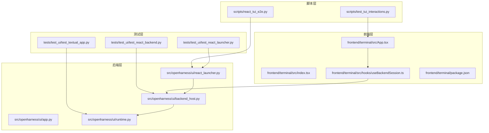
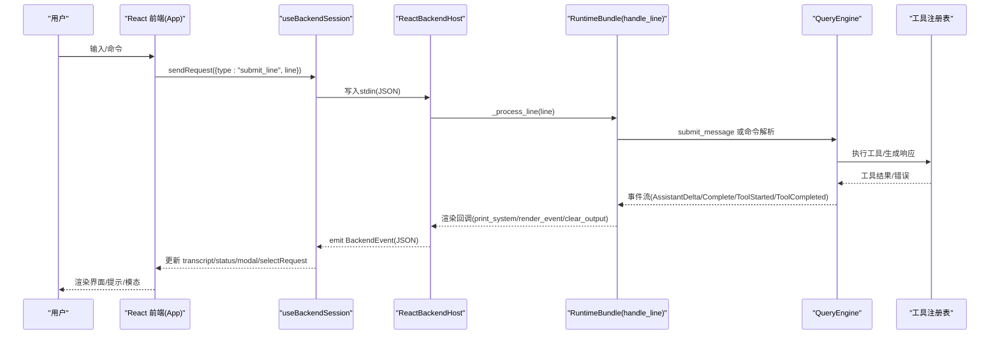
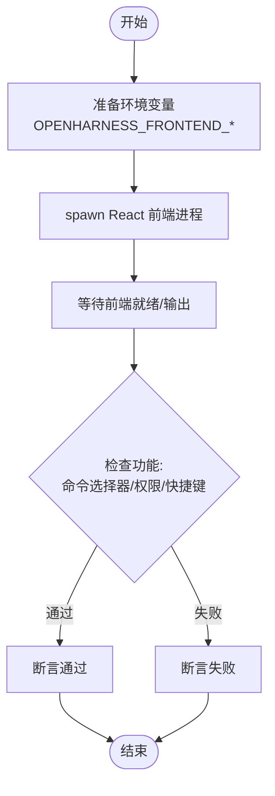
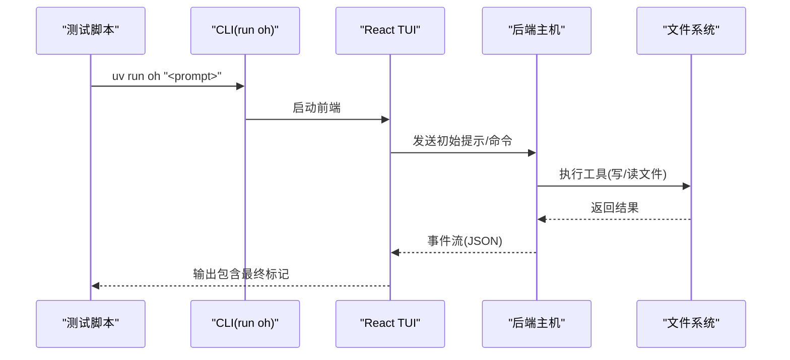
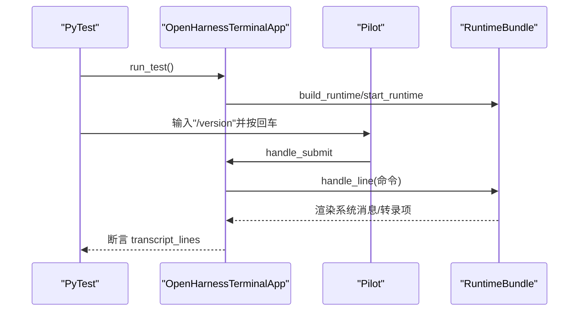
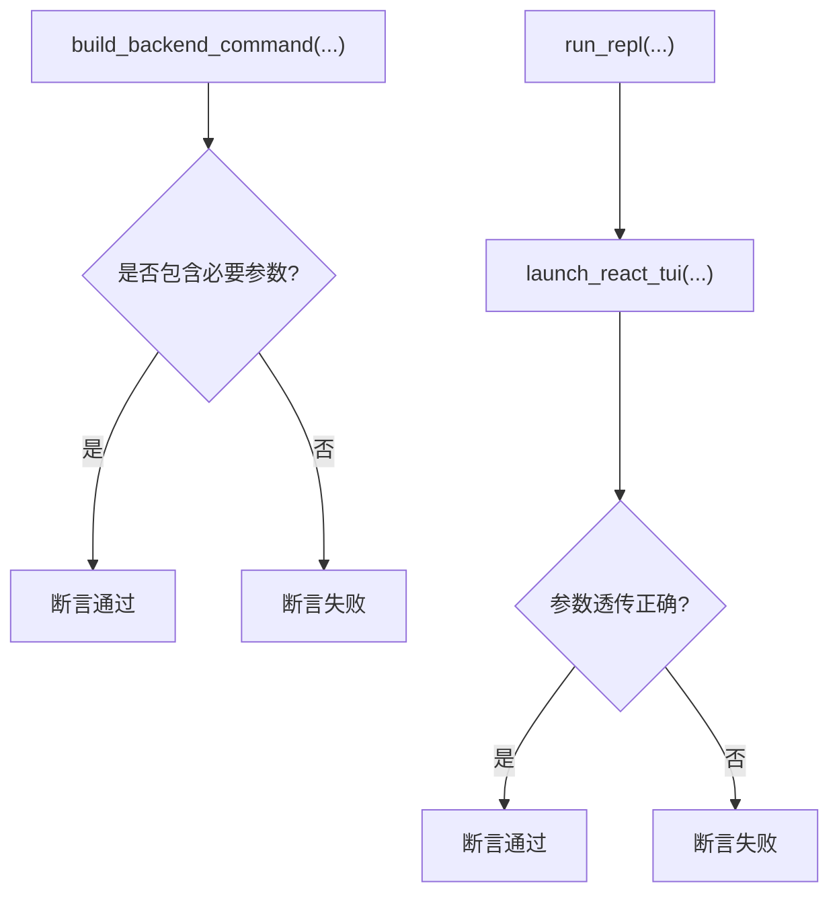
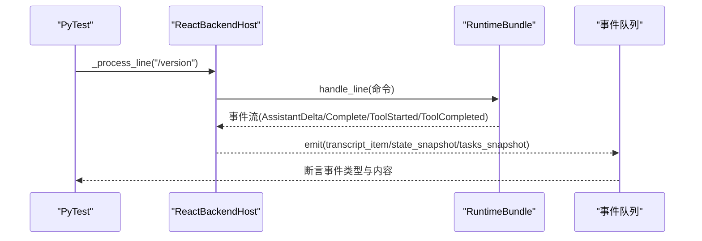
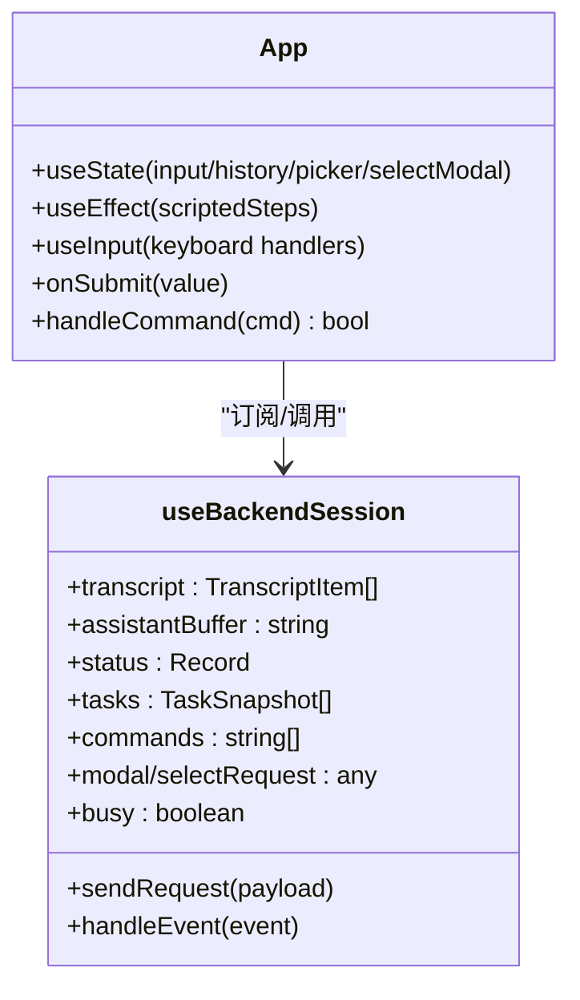
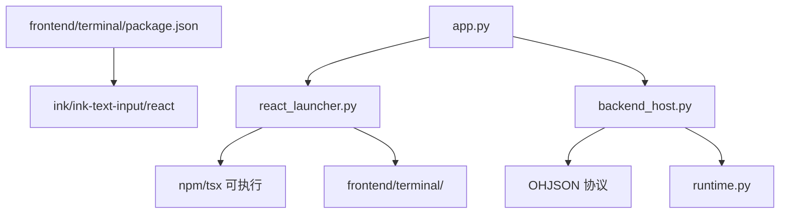

# 用户界面测试套件

<cite>
**本文档引用的文件**
- [scripts/test_tui_interactions.py](file://scripts/test_tui_interactions.py)
- [scripts/react_tui_e2e.py](file://scripts/react_tui_e2e.py)
- [tests/test_ui/test_textual_app.py](file://tests/test_ui/test_textual_app.py)
- [tests/test_ui/test_react_launcher.py](file://tests/test_ui/test_react_launcher.py)
- [tests/test_ui/test_react_backend.py](file://tests/test_ui/test_react_backend.py)
- [src/openharness/ui/textual_app.py](file://src/openharness/ui/textual_app.py)
- [src/openharness/ui/react_launcher.py](file://src/openharness/ui/react_launcher.py)
- [src/openharness/ui/backend_host.py](file://src/openharness/ui/backend_host.py)
- [src/openharness/ui/app.py](file://src/openharness/ui/app.py)
- [src/openharness/ui/runtime.py](file://src/openharness/ui/runtime.py)
- [frontend/terminal/src/App.tsx](file://frontend/terminal/src/App.tsx)
- [frontend/terminal/src/index.tsx](file://frontend/terminal/src/index.tsx)
- [frontend/terminal/src/hooks/useBackendSession.ts](file://frontend/terminal/src/hooks/useBackendSession.ts)
- [frontend/terminal/package.json](file://frontend/terminal/package.json)
</cite>

## 目录
1. [简介](#简介)
2. [项目结构](#项目结构)
3. [核心组件](#核心组件)
4. [架构总览](#架构总览)
5. [详细组件分析](#详细组件分析)
6. [依赖关系分析](#依赖关系分析)
7. [性能考虑](#性能考虑)
8. [故障排除指南](#故障排除指南)
9. [结论](#结论)
10. [附录](#附录)

## 简介
本文件面向 OpenHarness 的用户界面测试套件，系统性阐述 TUI（文本用户界面）与 React 终端界面的测试设计与实现。内容覆盖：
- 模式切换测试：权限模式、计划模式、快速模式等状态变更的验证
- React 后端测试：后端主机协议、命令处理、工具执行事件流
- React 启动器测试：前端启动流程、后端命令构建、进程生命周期
- Textual 应用测试：基于 Textual 的终端 UI 交互、事件渲染、模态对话框
- 界面交互测试方法：用户输入模拟、界面状态验证、事件处理测试
- 测试环境配置与测试数据准备策略
- 调试技巧与自动化测试最佳实践

## 项目结构
OpenHarness 的用户界面测试分布在以下层次：
- 脚本层：端到端测试脚本，使用 pexpect 控制子进程，模拟用户输入与验证输出
- 测试层：PyTest 单元测试，针对 Textual 应用、React 启动器、React 后端主机进行细粒度验证
- 前端层：React 终端界面，通过 Ink 渲染，与后端通过 JSON 协议通信
- 后端层：Python 运行时与后端主机，负责命令解析、工具执行、事件流与状态管理

**图表来源**
- [scripts/test_tui_interactions.py:1-205](file://scripts/test_tui_interactions.py#L1-L205)
- [scripts/react_tui_e2e.py:1-171](file://scripts/react_tui_e2e.py#L1-L171)
- [tests/test_ui/test_textual_app.py:1-117](file://tests/test_ui/test_textual_app.py#L1-L117)
- [tests/test_ui/test_react_launcher.py:1-42](file://tests/test_ui/test_react_launcher.py#L1-L42)
- [tests/test_ui/test_react_backend.py:1-93](file://tests/test_ui/test_react_backend.py#L1-L93)
- [frontend/terminal/src/App.tsx:1-400](file://frontend/terminal/src/App.tsx#L1-L400)
- [frontend/terminal/src/index.tsx:1-10](file://frontend/terminal/src/index.tsx#L1-L10)
- [frontend/terminal/src/hooks/useBackendSession.ts:1-172](file://frontend/terminal/src/hooks/useBackendSession.ts#L1-L172)
- [frontend/terminal/package.json:1-20](file://frontend/terminal/package.json#L1-L20)
- [src/openharness/ui/app.py:1-149](file://src/openharness/ui/app.py#L1-L149)
- [src/openharness/ui/react_launcher.py:1-107](file://src/openharness/ui/react_launcher.py#L1-L107)
- [src/openharness/ui/backend_host.py:1-306](file://src/openharness/ui/backend_host.py#L1-L306)
- [src/openharness/ui/runtime.py:1-297](file://src/openharness/ui/runtime.py#L1-L297)

**章节来源**
- [scripts/test_tui_interactions.py:1-205](file://scripts/test_tui_interactions.py#L1-L205)
- [scripts/react_tui_e2e.py:1-171](file://scripts/react_tui_e2e.py#L1-L171)
- [tests/test_ui/test_textual_app.py:1-117](file://tests/test_ui/test_textual_app.py#L1-L117)
- [tests/test_ui/test_react_launcher.py:1-42](file://tests/test_ui/test_react_launcher.py#L1-L42)
- [tests/test_ui/test_react_backend.py:1-93](file://tests/test_ui/test_react_backend.py#L1-L93)
- [frontend/terminal/src/App.tsx:1-400](file://frontend/terminal/src/App.tsx#L1-L400)
- [frontend/terminal/src/index.tsx:1-10](file://frontend/terminal/src/index.tsx#L1-L10)
- [frontend/terminal/src/hooks/useBackendSession.ts:1-172](file://frontend/terminal/src/hooks/useBackendSession.ts#L1-L172)
- [frontend/terminal/package.json:1-20](file://frontend/terminal/package.json#L1-L20)
- [src/openharness/ui/app.py:1-149](file://src/openharness/ui/app.py#L1-L149)
- [src/openharness/ui/react_launcher.py:1-107](file://src/openharness/ui/react_launcher.py#L1-L107)
- [src/openharness/ui/backend_host.py:1-306](file://src/openharness/ui/backend_host.py#L1-L306)
- [src/openharness/ui/runtime.py:1-297](file://src/openharness/ui/runtime.py#L1-L297)

## 核心组件
- Textual 终端应用：提供键盘快捷键、权限模态、问答模态、侧边栏状态展示与事件渲染
- React 启动器：构建后端命令、安装前端依赖、启动 React 终端前端
- React 后端主机：通过 JSON 协议与前端通信，处理命令、工具执行、状态快照与模态请求
- 前端会话钩子：使用 child_process 启动后端，读取 OHJSON 协议事件，驱动 UI 更新
- 运行时装配：统一构建 API 客户端、工具注册表、查询引擎、状态存储与钩子执行器

**章节来源**
- [src/openharness/ui/textual_app.py:133-412](file://src/openharness/ui/textual_app.py#L133-L412)
- [src/openharness/ui/react_launcher.py:27-107](file://src/openharness/ui/react_launcher.py#L27-L107)
- [src/openharness/ui/backend_host.py:41-306](file://src/openharness/ui/backend_host.py#L41-L306)
- [frontend/terminal/src/hooks/useBackendSession.ts:17-172](file://frontend/terminal/src/hooks/useBackendSession.ts#L17-L172)
- [src/openharness/ui/runtime.py:89-297](file://src/openharness/ui/runtime.py#L89-L297)

## 架构总览
下图展示了从用户输入到界面渲染的完整链路，以及测试如何覆盖各环节。

**图表来源**
- [frontend/terminal/src/App.tsx:292-318](file://frontend/terminal/src/App.tsx#L292-L318)
- [frontend/terminal/src/hooks/useBackendSession.ts:31-170](file://frontend/terminal/src/hooks/useBackendSession.ts#L31-L170)
- [src/openharness/ui/backend_host.py:133-204](file://src/openharness/ui/backend_host.py#L133-L204)
- [src/openharness/ui/runtime.py:223-271](file://src/openharness/ui/runtime.py#L223-L271)

## 详细组件分析

### TUI 交互测试（scripts/test_tui_interactions.py）
该脚本通过 pexpect 控制 React 终端前端，模拟用户输入并断言输出特征，覆盖命令选择器、权限流程、快捷键提示等场景。

- 命令选择器可见性：通过设置 OPENHARNESS_FRONTEND_SCRIPT 触发 /help，断言欢迎横幅与快捷键提示出现
- 权限流程：触发写文件等高风险操作，断言权限模态出现并接受 y/n 响应
- 快捷键提示：断言发送、命令、退出等快捷键提示至少两项可见
- 命令行标志清理：断言 --headless 不再出现在帮助输出中

**图表来源**
- [scripts/test_tui_interactions.py:28-160](file://scripts/test_tui_interactions.py#L28-L160)

**章节来源**
- [scripts/test_tui_interactions.py:28-160](file://scripts/test_tui_interactions.py#L28-L160)

### React 终端端到端测试（scripts/react_tui_e2e.py）
该脚本使用真实 CLI 入口运行 React TUI，隔离配置目录与数据目录，执行文件读写、问答模态、命令流等场景，并断言最终标记字符串。

- 隔离环境：临时目录存放 settings.json，设置 OPENHARNESS_CONFIG_DIR/OPENHARNESS_DATA_DIR
- 文件 IO 场景：使用 write_file 创建文件，read_file 验证，断言内容一致
- 问答模态：ask_user_question 弹出问题，提交答案后写文件并验证
- 命令流：通过 OPENHARNESS_FRONTEND_SCRIPT 注入命令序列，断言状态变更与最终标记

**图表来源**
- [scripts/react_tui_e2e.py:21-166](file://scripts/react_tui_e2e.py#L21-L166)

**章节来源**
- [scripts/react_tui_e2e.py:48-87](file://scripts/react_tui_e2e.py#L48-L87)
- [scripts/react_tui_e2e.py:90-116](file://scripts/react_tui_e2e.py#L90-L116)
- [scripts/react_tui_e2e.py:119-149](file://scripts/react_tui_e2e.py#L119-L149)

### Textual 应用测试（tests/test_ui/test_textual_app.py）
基于 PyTest 的单元测试，使用 Textual 的 run_test 与 pilot 模拟用户交互，断言转录行、工具问答、命令处理等行为。

- 命令处理：在 composer 中输入 /version，按回车，断言转录包含版本信息
- 单轮模型对话：输入普通消息，断言 user/assistant 行均出现
- 问答工具：模拟 ask_user_question，注入回答，断言工具结果与后续回复

**图表来源**
- [tests/test_ui/test_textual_app.py:44-116](file://tests/test_ui/test_textual_app.py#L44-L116)
- [src/openharness/ui/textual_app.py:278-305](file://src/openharness/ui/textual_app.py#L278-L305)
- [src/openharness/ui/runtime.py:223-271](file://src/openharness/ui/runtime.py#L223-L271)

**章节来源**
- [tests/test_ui/test_textual_app.py:44-116](file://tests/test_ui/test_textual_app.py#L44-L116)
- [src/openharness/ui/textual_app.py:133-412](file://src/openharness/ui/textual_app.py#L133-L412)

### React 启动器测试（tests/test_ui/test_react_launcher.py）
验证 React 启动器的命令构建与默认路径选择。

- 命令构建：断言 build_backend_command 包含 --backend-only、--cwd、--model、--base-url、--system-prompt、--api-key 等参数
- 默认启动：断言 run_repl 使用 launch_react_tui 并传递 prompt/cwd/model

**图表来源**
- [tests/test_ui/test_react_launcher.py:11-41](file://tests/test_ui/test_react_launcher.py#L11-L41)
- [src/openharness/ui/react_launcher.py:27-47](file://src/openharness/ui/react_launcher.py#L27-L47)
- [src/openharness/ui/app.py:15-47](file://src/openharness/ui/app.py#L15-L47)

**章节来源**
- [tests/test_ui/test_react_launcher.py:11-41](file://tests/test_ui/test_react_launcher.py#L11-L41)
- [src/openharness/ui/react_launcher.py:27-47](file://src/openharness/ui/react_launcher.py#L27-L47)
- [src/openharness/ui/app.py:15-47](file://src/openharness/ui/app.py#L15-L47)

### React 后端测试（tests/test_ui/test_react_backend.py）
验证 React 后端主机对命令与模型回合的处理，以及事件发射与状态快照。

- 命令处理：断言 /version 产生用户转录项与系统转录项，且包含版本信息
- 模型回合：断言助手完成事件与转录项存在，且包含预期文本
- 事件完整性：断言 state_snapshot 与任务快照被发射

**图表来源**
- [tests/test_ui/test_react_backend.py:29-92](file://tests/test_ui/test_react_backend.py#L29-L92)
- [src/openharness/ui/backend_host.py:133-204](file://src/openharness/ui/backend_host.py#L133-L204)
- [src/openharness/ui/runtime.py:223-271](file://src/openharness/ui/runtime.py#L223-L271)

**章节来源**
- [tests/test_ui/test_react_backend.py:29-92](file://tests/test_ui/test_react_backend.py#L29-L92)
- [src/openharness/ui/backend_host.py:41-306](file://src/openharness/ui/backend_host.py#L41-L306)
- [src/openharness/ui/runtime.py:223-271](file://src/openharness/ui/runtime.py#L223-L271)

### 前端组件与协议（App.tsx、useBackendSession.ts）
- App.tsx：负责命令提示、权限/问答模态、选择模态、脚本化自动输入、键盘提示显示
- useBackendSession.ts：启动后端进程，读取 OHJSON 前缀事件，维护 transcript/status/tasks/commands 等状态

**图表来源**
- [frontend/terminal/src/App.tsx:39-399](file://frontend/terminal/src/App.tsx#L39-L399)
- [frontend/terminal/src/hooks/useBackendSession.ts:17-170](file://frontend/terminal/src/hooks/useBackendSession.ts#L17-L170)

**章节来源**
- [frontend/terminal/src/App.tsx:39-399](file://frontend/terminal/src/App.tsx#L39-L399)
- [frontend/terminal/src/hooks/useBackendSession.ts:17-170](file://frontend/terminal/src/hooks/useBackendSession.ts#L17-L170)

## 依赖关系分析
- 前端依赖：React、Ink、Ink 文本输入，通过 package.json 的 scripts.start 启动
- 启动器依赖：npm/tsx 可执行文件解析，前端目录存在性校验
- 后端主机依赖：标准输入/输出协议、JSON 解析、异步锁与队列
- 运行时依赖：API 客户端、工具注册表、查询引擎、状态存储、钩子执行器

**图表来源**
- [frontend/terminal/package.json:1-20](file://frontend/terminal/package.json#L1-L20)
- [src/openharness/ui/react_launcher.py:13-107](file://src/openharness/ui/react_launcher.py#L13-L107)
- [src/openharness/ui/backend_host.py:27-278](file://src/openharness/ui/backend_host.py#L27-L278)
- [src/openharness/ui/app.py:15-47](file://src/openharness/ui/app.py#L15-L47)
- [src/openharness/ui/runtime.py:89-176](file://src/openharness/ui/runtime.py#L89-L176)

**章节来源**
- [frontend/terminal/package.json:1-20](file://frontend/terminal/package.json#L1-L20)
- [src/openharness/ui/react_launcher.py:13-107](file://src/openharness/ui/react_launcher.py#L13-L107)
- [src/openharness/ui/backend_host.py:27-278](file://src/openharness/ui/backend_host.py#L27-L278)
- [src/openharness/ui/app.py:15-47](file://src/openharness/ui/app.py#L15-L47)
- [src/openharness/ui/runtime.py:89-176](file://src/openharness/ui/runtime.py#L89-L176)

## 性能考虑
- 前端渲染：Ink 组件按需更新，避免不必要的重渲染；命令提示与键盘提示仅在非忙碌状态下显示
- 后端协议：OHJSON 前缀事件逐行读取，减少解析开销；异步锁保护 stdout 写入
- 运行时装配：延迟加载插件与钩子，按需连接 MCP 服务器；会话快照保存在回合结束后进行
- 测试性能：pexpect 超时控制与日志输出可选，隔离环境减少磁盘 IO；PyTest 异步测试提升并发

## 故障排除指南
- 前端依赖缺失：启动 React 启动器前检查 node_modules 是否存在，若不存在则执行 npm install
- 协议解析错误：后端主机对无效请求发出 error 事件；前端忽略不带 OHJSON 前缀的行并记录为日志
- 权限拒绝：权限模态弹出后，前端接收 permission_response；若未收到响应，检查请求 ID 一致性
- 问答模态：前端监听 modal.kind 为 question 时，直接发送 question_response；确认 request_id 与输入值
- 调试输出：设置 OPENHARNESS_E2E_DEBUG=1 以启用 pexpect 日志输出；设置 OPENHARNESS_FRONTEND_RAW_RETURN=1 用于脚本化自动提交

**章节来源**
- [src/openharness/ui/react_launcher.py:67-76](file://src/openharness/ui/react_launcher.py#L67-L76)
- [src/openharness/ui/backend_host.py:127-131](file://src/openharness/ui/backend_host.py#L127-L131)
- [frontend/terminal/src/hooks/useBackendSession.ts:48-55](file://frontend/terminal/src/hooks/useBackendSession.ts#L48-L55)
- [frontend/terminal/src/App.tsx:208-229](file://frontend/terminal/src/App.tsx#L208-L229)

## 结论
OpenHarness 的用户界面测试套件通过脚本层与测试层协同，覆盖了从命令选择器、权限流程、问答模态到后端协议与运行时装配的全链路。测试设计强调：
- 环境隔离与可重复性：临时目录与环境变量控制
- 事件驱动验证：基于 OHJSON 事件与转录行断言
- 交互模拟：pexpect 与 Textual pilot 的组合
- 可观测性：超时控制、日志输出与最终标记字符串

建议在持续集成中结合脚本层与测试层，确保界面稳定性与用户体验。

## 附录
- 测试环境配置要点
  - 设置 OPENHARNESS_CONFIG_DIR/OPENHARNESS_DATA_DIR 指向临时目录
  - 设置 OPENHARNESS_FRONTEND_CONFIG/OPENHARNESS_FRONTEND_SCRIPT 控制前端行为
  - 设置 OPENHARNESS_E2E_DEBUG=1 开启 pexpect 日志
- 测试数据准备策略
  - 使用 isolated_env 生成 settings.json 并覆盖 permission.mode
  - 使用 OPENHARNESS_FRONTEND_SCRIPT 注入命令序列，便于自动化验证
  - 通过最终标记字符串（如 FINAL_OK_REACT_TUI）作为断言锚点