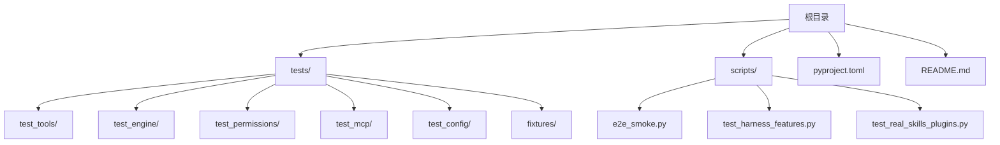
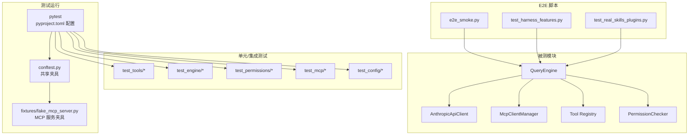
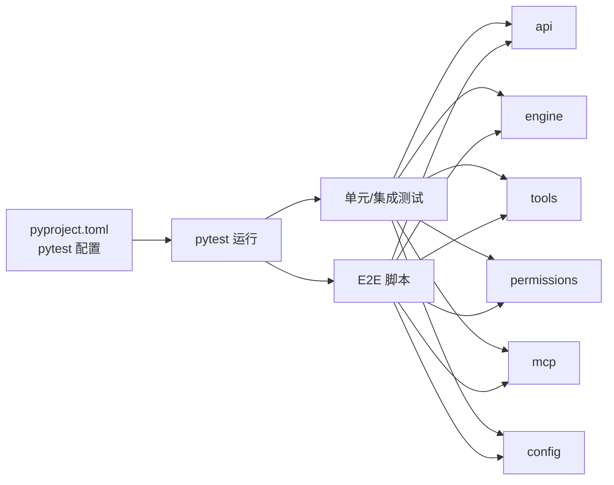

# 测试开发指南

<cite>
**本文引用的文件**
- [README.md](file://README.md)
- [pyproject.toml](file://pyproject.toml)
- [tests/conftest.py](file://tests/conftest.py)
- [tests/fixtures/fake_mcp_server.py](file://tests/fixtures/fake_mcp_server.py)
- [tests/test_tools/test_core_tools.py](file://tests/test_tools/test_core_tools.py)
- [tests/test_permissions/test_checker.py](file://tests/test_permissions/test_checker.py)
- [tests/test_config/test_settings.py](file://tests/test_config/test_settings.py)
- [tests/test_engine/test_query_engine.py](file://tests/test_engine/test_query_engine.py)
- [tests/test_mcp/test_integration.py](file://tests/test_mcp/test_integration.py)
- [scripts/e2e_smoke.py](file://scripts/e2e_smoke.py)
- [scripts/test_harness_features.py](file://scripts/test_harness_features.py)
- [scripts/test_real_skills_plugins.py](file://scripts/test_real_skills_plugins.py)
</cite>

## 目录
1. [简介](#简介)
2. [项目结构](#项目结构)
3. [核心组件](#核心组件)
4. [架构总览](#架构总览)
5. [详细组件分析](#详细组件分析)
6. [依赖分析](#依赖分析)
7. [性能考虑](#性能考虑)
8. [故障排查指南](#故障排查指南)
9. [结论](#结论)
10. [附录](#附录)

## 简介
本指南面向 OpenHarness 的测试开发与维护，目标是帮助开发者系统地编写单元测试、集成测试与端到端（E2E）场景，掌握测试夹具（fixtures）、模拟对象（mocks/fakes）、断言策略与覆盖率提升方法，并建立可维护的测试文档与工作流。OpenHarness 使用 pytest 作为测试运行器，支持异步测试与多种工具链集成。

## 项目结构
OpenHarness 的测试组织遵循按功能域分层的目录结构：
- tests：按模块划分的单元与集成测试
  - fixtures：共享夹具（如小型 MCP 服务器）
  - 各子目录对应核心模块（如 tools、engine、permissions、mcp 等）
- scripts：独立的 E2E 脚本，覆盖真实模型调用与复杂场景
- 根目录 README 提供测试结果概览与运行方式

图表来源
- [README.md:282-299](file://README.md#L282-L299)
- [pyproject.toml:47-49](file://pyproject.toml#L47-L49)

章节来源
- [README.md:282-299](file://README.md#L282-L299)
- [pyproject.toml:47-49](file://pyproject.toml#L47-L49)

## 核心组件
- 测试运行器与配置
  - pytest 配置位于 pyproject.toml，测试路径为 tests，启用 asyncio 模式
- 共享夹具
  - tests/conftest.py 用于注册全局夹具
  - tests/fixtures/fake_mcp_server.py 提供轻量 MCP 服务用于集成测试
- 单元测试示例
  - tools：文件读写、搜索、命令执行、技能与 LSP 工具
  - engine：查询引擎事件流、权限钩子、用户交互
  - permissions：权限决策与规则
  - mcp：MCP 配置合并与工具注册
  - config：设置加载/保存、环境变量覆盖
- E2E 场景
  - scripts/e2e_smoke.py：真实模型驱动的多场景套件
  - scripts/test_harness_features.py：重试、技能、并行工具、路径权限
  - scripts/test_real_skills_plugins.py：真实技能与插件加载验证

章节来源
- [pyproject.toml:47-49](file://pyproject.toml#L47-L49)
- [tests/conftest.py:1-2](file://tests/conftest.py#L1-L2)
- [tests/fixtures/fake_mcp_server.py:1-22](file://tests/fixtures/fake_mcp_server.py#L1-L22)
- [tests/test_tools/test_core_tools.py:1-248](file://tests/test_tools/test_core_tools.py#L1-L248)
- [tests/test_engine/test_query_engine.py:1-252](file://tests/test_engine/test_query_engine.py#L1-L252)
- [tests/test_permissions/test_checker.py:1-32](file://tests/test_permissions/test_checker.py#L1-L32)
- [tests/test_mcp/test_integration.py:1-80](file://tests/test_mcp/test_integration.py#L1-L80)
- [tests/test_config/test_settings.py:1-114](file://tests/test_config/test_settings.py#L1-L114)
- [scripts/e2e_smoke.py:1-808](file://scripts/e2e_smoke.py#L1-L808)
- [scripts/test_harness_features.py:1-241](file://scripts/test_harness_features.py#L1-L241)
- [scripts/test_real_skills_plugins.py:1-348](file://scripts/test_real_skills_plugins.py#L1-L348)

## 架构总览
下图展示测试体系与被测模块的关系：pytest 运行单元与集成测试；scripts 中的 E2E 脚本通过真实 API 客户端驱动 QueryEngine 执行工具调用与权限检查。

图表来源
- [pyproject.toml:47-49](file://pyproject.toml#L47-L49)
- [tests/conftest.py:1-2](file://tests/conftest.py#L1-L2)
- [tests/fixtures/fake_mcp_server.py:1-22](file://tests/fixtures/fake_mcp_server.py#L1-L22)
- [scripts/e2e_smoke.py:1-808](file://scripts/e2e_smoke.py#L1-L808)
- [scripts/test_harness_features.py:1-241](file://scripts/test_harness_features.py#L1-L241)
- [scripts/test_real_skills_plugins.py:1-348](file://scripts/test_real_skills_plugins.py#L1-L348)

## 详细组件分析

### 测试夹具与环境配置
- 共享夹具入口
  - tests/conftest.py 作为 pytest 入口，可用于注册全局夹具（如临时目录、配置目录等）
- MCP 服务夹具
  - tests/fixtures/fake_mcp_server.py 提供一个基于 FastMCP 的小型 stdio 服务器，暴露工具与资源，便于集成测试中模拟外部 MCP 服务

建议
- 在 conftest.py 中集中管理临时目录、配置目录、数据目录等环境变量与上下文
- 对需要外部进程或网络的服务，优先使用轻量级夹具（如本文件中的 MCP 服务）

章节来源
- [tests/conftest.py:1-2](file://tests/conftest.py#L1-L2)
- [tests/fixtures/fake_mcp_server.py:1-22](file://tests/fixtures/fake_mcp_server.py#L1-L22)

### 工具测试（pytest 编程模式与断言策略）
- 文件工具链：写入、读取、编辑、glob/grep
- 命令执行：Bash 工具返回值与输出断言
- 技能与待办：技能内容注入、配置读写
- 笔记本与 LSP：Jupyter 笔记本编辑、符号与定义查询
- Git 工作树：创建/切换/退出工作树
- 计划任务：创建/列出/触发/删除定时任务

最佳实践
- 使用 @pytest.mark.asyncio 标注异步测试
- 使用 tmp_path 等内置夹具隔离文件系统状态
- 使用 monkeypatch 设置环境变量以控制行为（如配置目录）
- 对外部命令（如 git）使用 subprocess.run 并断言返回码与输出

章节来源
- [tests/test_tools/test_core_tools.py:1-248](file://tests/test_tools/test_core_tools.py#L1-L248)

### 引擎与权限测试（事件流与钩子）
- 查询引擎事件流：文本增量、工具调用开始/完成、回合结束
- 权限钩子：PRE_TOOL_USE 阻断工具执行
- 用户交互：ask_user_question 回调注入

测试要点
- 使用伪造的 API 客户端产生确定性事件序列
- 通过 HookRegistry 注册阻断规则，验证错误路径
- 通过 ask_user_prompt 注入回调，验证用户输入路径

章节来源
- [tests/test_engine/test_query_engine.py:1-252](file://tests/test_engine/test_query_engine.py#L1-L252)

### 权限测试（决策与规则）
- 默认模式：只允许只读操作；修改类操作需确认
- 计划模式：禁止写/执行类工具
- 全自动模式：允许写/执行类工具

测试要点
- 针对不同模式评估工具请求，断言 allowed 与 requires_confirmation
- 验证拒绝原因中包含模式信息

章节来源
- [tests/test_permissions/test_checker.py:1-32](file://tests/test_permissions/test_checker.py#L1-L32)

### MCP 集成测试（配置合并与工具注册）
- 配置合并：Settings 与插件提供的 MCP 服务器配置合并
- 工具注册：从 MCP 服务器导出工具注册到默认工具注册表
- 资源列表：列出并读取 MCP 资源

测试要点
- 断言合并后的服务器名前缀包含插件标识
- 断言注册表中存在 mcp__server__tool 名称的工具
- 断言工具输入模式校验通过且执行返回预期输出

章节来源
- [tests/test_mcp/test_integration.py:1-80](file://tests/test_mcp/test_integration.py#L1-L80)

### 配置测试（设置加载/保存与环境覆盖）
- 默认值与实例优先级
- 环境变量覆盖（API Key、Base URL、Model）
- 权限设置嵌套结构加载
- 保存后读回一致性

测试要点
- 分别断言环境变量与实例值的优先级
- 断言保存时自动创建父目录
- 断言权限设置正确解析

章节来源
- [tests/test_config/test_settings.py:1-114](file://tests/test_config/test_settings.py#L1-L114)

### E2E 场景（真实模型与复杂流程）
- e2e_smoke.py：多场景套件，覆盖文件 IO、搜索编辑、任务流、技能流、MCP、代理委托、插件组合、问答、笔记本、LSP、计划任务、工作树、上下文、MCP 认证等
- test_harness_features.py：重试配置与真实调用、技能系统、并行工具路径、路径与命令级权限
- test_real_skills_plugins.py：真实技能与插件安装、加载、钩子结构、命令内容质量

测试要点
- 通过 Scenario 类型封装提示词、期望最终文本、所需工具集与验证函数
- 使用 AnthropicApiClient 驱动 QueryEngine，收集工具启动/完成事件与最终文本
- 对每个场景编写专用验证器，断言文件内容、工具序列与最终文本片段

章节来源
- [scripts/e2e_smoke.py:1-808](file://scripts/e2e_smoke.py#L1-L808)
- [scripts/test_harness_features.py:1-241](file://scripts/test_harness_features.py#L1-L241)
- [scripts/test_real_skills_plugins.py:1-348](file://scripts/test_real_skills_plugins.py#L1-L348)

## 依赖分析
- 测试运行器与配置
  - pytest 与 asyncio 支持由 pyproject.toml 统一配置
- 夹具与工具
  - 测试依赖于 openharness.* 子模块（api、engine、tools、permissions、mcp、config 等）
- E2E 与真实模型
  - E2E 脚本直接导入 openharness.* 并通过 AnthropicApiClient 发起真实调用

图表来源
- [pyproject.toml:47-49](file://pyproject.toml#L47-L49)
- [scripts/e2e_smoke.py:17-33](file://scripts/e2e_smoke.py#L17-L33)

章节来源
- [pyproject.toml:47-49](file://pyproject.toml#L47-L49)
- [scripts/e2e_smoke.py:17-33](file://scripts/e2e_smoke.py#L17-L33)

## 性能考虑
- 异步测试
  - 使用 @pytest.mark.asyncio 与 asyncio.run 或 pytest-asyncio 自动模式，避免同步阻塞
- 轻量级夹具
  - 优先使用内存/本地文件夹与小型进程（如 fake_mcp_server），减少外部依赖带来的延迟
- 事件驱动验证
  - 在引擎测试中通过事件流断言，避免轮询等待
- E2E 限流
  - 控制并发场景数量与超时时间，确保 CI 稳定

## 故障排查指南
- 日志与输出
  - E2E 脚本打印工具启动/完成事件与最终文本，便于定位问题阶段
- 断点调试
  - 在 pytest 中使用 -s 输出实时日志；在 IDE 中设置断点进入异步协程
- 覆盖率
  - 使用 pytest-cov 生成覆盖率报告，识别未覆盖的分支与路径
- 常见问题
  - API Key 缺失：确保环境变量或 stdin 提供有效密钥
  - 权限拒绝：检查权限模式与路径规则是否符合预期
  - MCP 工具不可用：确认服务器已连接、工具名称与输入模式匹配

章节来源
- [scripts/e2e_smoke.py:737-753](file://scripts/e2e_smoke.py#L737-L753)
- [scripts/test_harness_features.py:206-236](file://scripts/test_harness_features.py#L206-L236)
- [scripts/test_real_skills_plugins.py:308-343](file://scripts/test_real_skills_plugins.py#L308-L343)

## 结论
OpenHarness 的测试体系以 pytest 为核心，结合单元/集成测试与多场景 E2E 脚本，覆盖工具、引擎、权限、MCP 与配置等关键领域。通过统一的夹具与验证策略，开发者可以高效编写可维护的测试，并借助覆盖率与 E2E 套件保障功能正确性与稳定性。

## 附录

### 测试命名规范与断言策略
- 命名规范
  - 使用 test_* 前缀，描述具体功能点（如 test_file_write_read_and_edit）
  - 对异步逻辑使用 @pytest.mark.asyncio
- 断言策略
  - 对错误路径断言 is_error 与错误消息
  - 对成功路径断言输出长度、内容片段与文件存在性
  - 对事件流断言事件类型与顺序

章节来源
- [tests/test_tools/test_core_tools.py:33-248](file://tests/test_tools/test_core_tools.py#L33-L248)
- [tests/test_engine/test_query_engine.py:68-252](file://tests/test_engine/test_query_engine.py#L68-L252)

### 测试数据准备与隔离
- 使用 tmp_path 等 pytest 内置夹具创建临时工作目录
- 使用 monkeypatch 设置 OPENHARNESS_CONFIG_DIR、OPENHARNESS_DATA_DIR 等环境变量
- 对外部命令（如 git）先初始化再断言结果

章节来源
- [tests/test_tools/test_core_tools.py:34-248](file://tests/test_tools/test_core_tools.py#L34-L248)

### 测试覆盖率分析与改进
- 启用 pytest-cov，生成 HTML/Coverage 报告
- 关注高风险路径：权限拒绝、工具失败、MCP 认证更新、ask_user 回调
- 为每个模块补充边界条件与异常分支测试

章节来源
- [pyproject.toml:35](file://pyproject.toml#L35)

### 测试文档编写与维护
- 在 README 中记录测试结果与运行方式
- 为复杂 E2E 场景编写场景说明与期望输出约定
- 维护测试变更日志，标注破坏性改动与回归风险

章节来源
- [README.md:282-299](file://README.md#L282-L299)