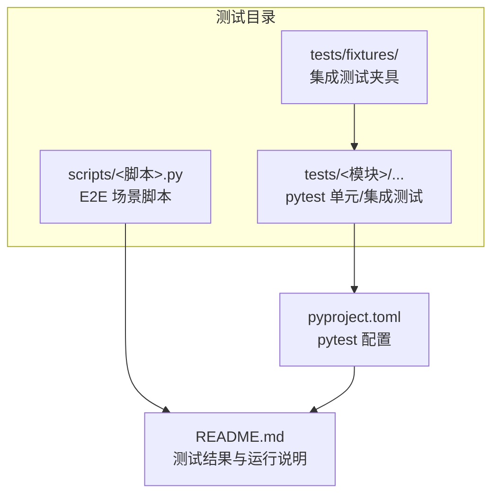
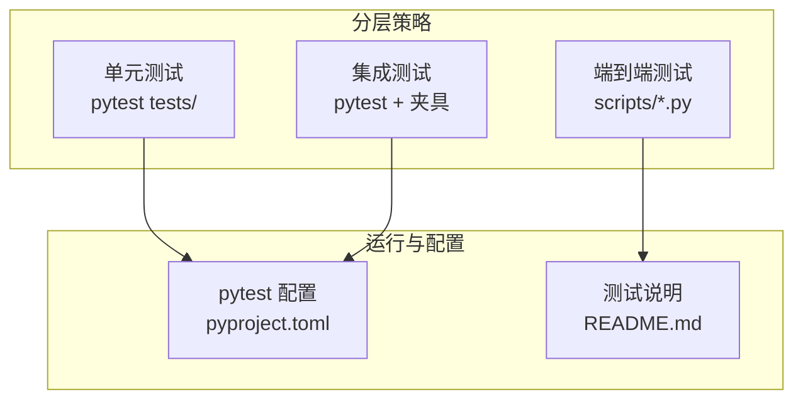
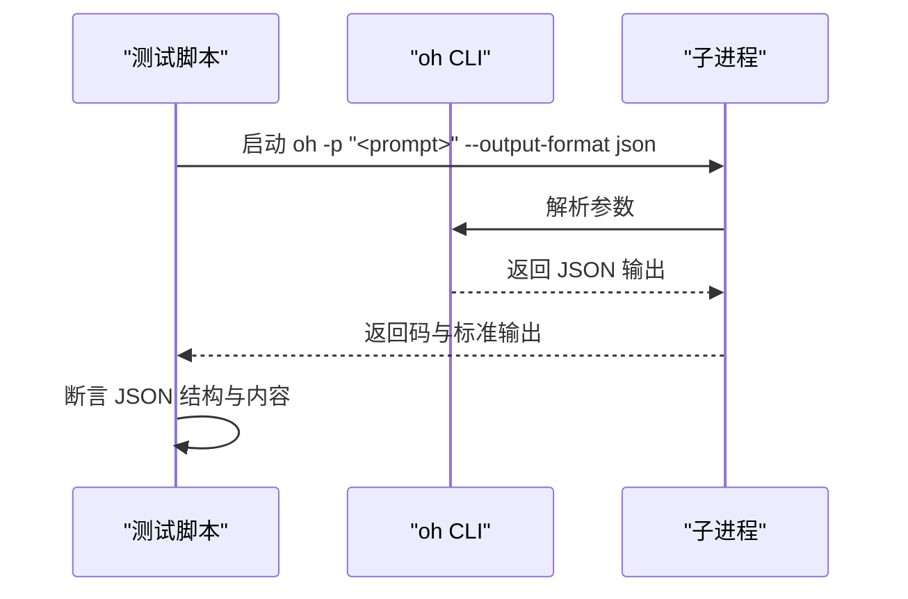
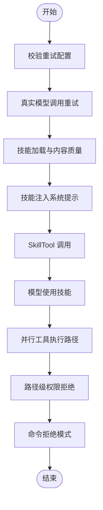
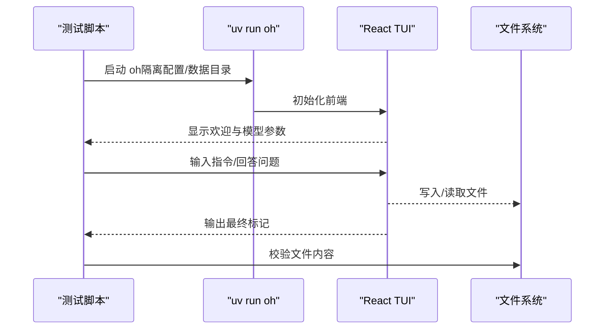
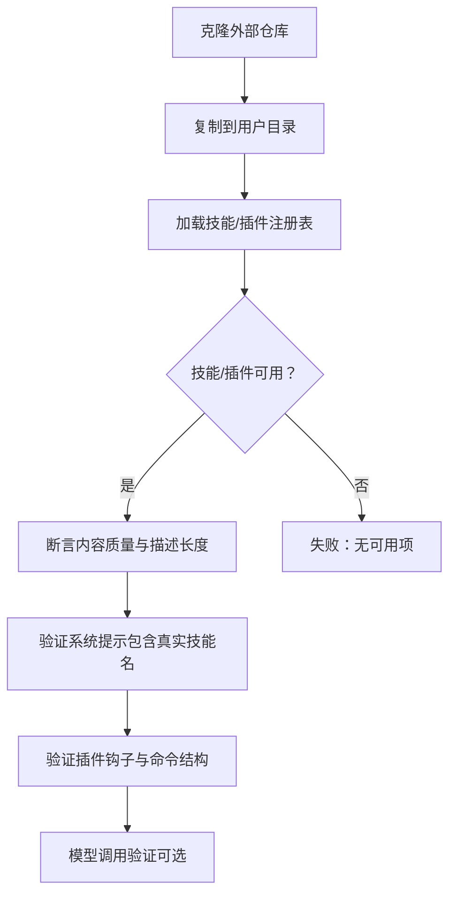
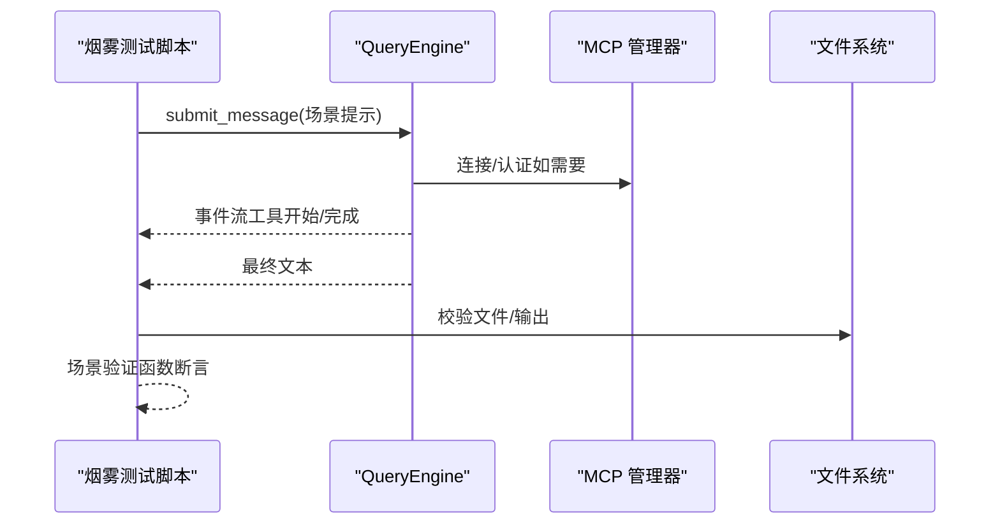
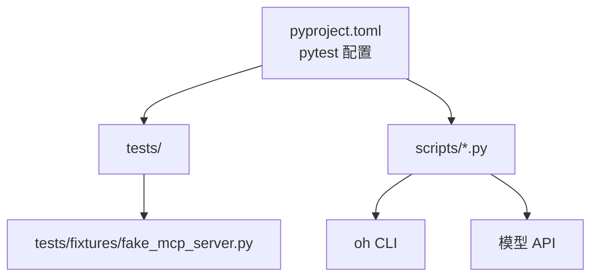

# 测试文档

<cite>
**本文引用的文件**
- [README.md](file://README.md)
- [pyproject.toml](file://pyproject.toml)
- [tests/conftest.py](file://tests/conftest.py)
- [scripts/e2e_smoke.py](file://scripts/e2e_smoke.py)
- [scripts/test_harness_features.py](file://scripts/test_harness_features.py)
- [scripts/test_real_skills_plugins.py](file://scripts/test_real_skills_plugins.py)
- [scripts/react_tui_e2e.py](file://scripts/react_tui_e2e.py)
- [scripts/test_cli_flags.py](file://scripts/test_cli_flags.py)
- [tests/fixtures/fake_mcp_server.py](file://tests/fixtures/fake_mcp_server.py)
</cite>

## 目录
1. [简介](#简介)
2. [项目结构](#项目结构)
3. [核心组件](#核心组件)
4. [架构总览](#架构总览)
5. [详细组件分析](#详细组件分析)
6. [依赖关系分析](#依赖关系分析)
7. [性能考虑](#性能考虑)
8. [故障排查指南](#故障排查指南)
9. [结论](#结论)
10. [附录](#附录)

## 简介
本测试文档面向 OpenHarness 的开发者与质量保证人员，系统化阐述测试体系的设计理念与实现方式，覆盖单元测试、集成测试与端到端（E2E）测试的分层策略；详解测试套件的组织结构、测试分类、用例设计与测试数据准备；说明测试脚本的使用方法（执行、结果分析、故障诊断）；并提供功能测试、性能测试、兼容性测试等场景的实践指南与最佳实践。

## 项目结构
OpenHarness 的测试体系由三部分组成：
- 单元/集成测试：位于 tests/ 下，采用 pytest 运行，覆盖各子系统模块（如 tools、engine、permissions、plugins 等），通过共享夹具与设置进行隔离与复用。
- E2E 脚本：位于 scripts/ 下，分为多类场景（CLI 标志、Harness 特性、React TUI、真实技能与插件、本地系统场景等），直接调用 CLI 或底层引擎，验证真实模型交互与 UI 行为。
- 配置与运行：通过 pyproject.toml 中的 pytest 配置与 README 的测试章节说明，统一管理测试路径与运行方式。

图表来源
- [pyproject.toml:47-49](file://pyproject.toml#L47-L49)
- [README.md:282-299](file://README.md#L282-L299)

章节来源
- [pyproject.toml:47-49](file://pyproject.toml#L47-L49)
- [README.md:282-299](file://README.md#L282-L299)

## 核心组件
- 测试运行器与配置
  - pytest：通过 pyproject.toml 指定 testpaths 与 asyncio_mode，集中运行 tests/ 下的测试。
  - 共享夹具：tests/conftest.py 提供跨模块的共享夹具入口，便于复用。
- E2E 脚本族
  - CLI 标志测试：验证 oh 命令行参数与子命令输出。
  - Harness 特性测试：覆盖重试、技能系统、并行工具执行、路径权限等核心能力。
  - React TUI E2E：通过 pexpect 自动化前端交互，验证 UI 与权限流程。
  - 真实技能与插件测试：加载外部仓库的真实技能与插件，验证兼容性与加载流程。
  - 烟雾测试（综合场景）：以真实模型调用串联文件 IO、搜索编辑、任务流、代理委托、MCP、笔记本、计划模式、定时任务、工作树、上下文注入、认证重配置等场景。
- 夹具与辅助
  - fake_mcp_server.py：轻量 stdio MCP 服务器，用于集成测试中的 MCP 工具与资源访问验证。

章节来源
- [pyproject.toml:47-49](file://pyproject.toml#L47-L49)
- [tests/conftest.py:1-2](file://tests/conftest.py#L1-L2)
- [scripts/test_cli_flags.py:1-159](file://scripts/test_cli_flags.py#L1-L159)
- [scripts/test_harness_features.py:1-241](file://scripts/test_harness_features.py#L1-L241)
- [scripts/react_tui_e2e.py:1-171](file://scripts/react_tui_e2e.py#L1-L171)
- [scripts/test_real_skills_plugins.py:1-348](file://scripts/test_real_skills_plugins.py#L1-L348)
- [scripts/e2e_smoke.py:1-808](file://scripts/e2e_smoke.py#L1-L808)
- [tests/fixtures/fake_mcp_server.py:1-22](file://tests/fixtures/fake_mcp_server.py#L1-L22)

## 架构总览
测试架构遵循“分层策略”：
- 单元测试：最小可测试单元，快速反馈，高覆盖率，确保模块内部逻辑正确。
- 集成测试：在受控环境中组合模块，验证接口契约与协作行为（如 MCP、权限检查、工具注册表）。
- E2E 测试：以真实模型调用与 UI 交互为主，覆盖真实用户路径与复杂场景编排。

图表来源
- [pyproject.toml:47-49](file://pyproject.toml#L47-L49)
- [README.md:282-299](file://README.md#L282-L299)

## 详细组件分析

### 单元/集成测试（pytest）
- 组织方式
  - tests/ 下按子系统划分目录，每个模块下包含若干测试文件，覆盖核心逻辑、错误处理与边界条件。
  - 使用共享夹具（tests/conftest.py）统一初始化与清理，减少重复代码。
- 关键点
  - 通过 pytest 的自动发现与异步模式（asyncio_mode = auto）支持协程测试。
  - 集成测试常依赖夹具（如 fake_mcp_server.py）模拟外部服务，确保可重复与可控。

章节来源
- [pyproject.toml:47-49](file://pyproject.toml#L47-L49)
- [tests/conftest.py:1-2](file://tests/conftest.py#L1-L2)
- [tests/fixtures/fake_mcp_server.py:1-22](file://tests/fixtures/fake_mcp_server.py#L1-L22)

### CLI 标志与子命令测试（scripts/test_cli_flags.py）
- 目标
  - 验证 oh 命令行帮助信息、输出格式（文本/JSON）、子命令（mcp/plugin/auth）可用性与基本输出。
- 执行方式
  - 通过子进程调用 oh，并断言返回码与输出内容。
- 结果分析
  - 成功：所有标志组与子命令均出现在帮助输出；JSON 输出符合结构；子命令返回成功状态。
  - 失败：返回码非零或输出缺失关键字段。

图表来源
- [scripts/test_cli_flags.py:27-98](file://scripts/test_cli_flags.py#L27-L98)

章节来源
- [scripts/test_cli_flags.py:1-159](file://scripts/test_cli_flags.py#L1-L159)

### Harness 特性 E2E（scripts/test_harness_features.py）
- 覆盖范围
  - API 重试配置与延迟计算、真实模型调用是否生效；
  - 技能系统：内置技能加载、系统提示注入、SkillTool 调用、真实模型使用技能；
  - 并行工具执行：查询循环中并行路径与单工具快速路径；
  - 权限控制：路径级拒绝规则、命令拒绝模式。
- 执行方式
  - 子进程调用 oh CLI，或直接导入 openharness 内部模块进行断言。
- 结果分析
  - 成功：重试配置满足阈值；技能内容丰富且被注入系统提示；并行路径存在；权限规则生效。
  - 失败：重试参数不匹配、技能内容过短、未检测到并行路径、权限规则被绕过。

图表来源
- [scripts/test_harness_features.py:44-202](file://scripts/test_harness_features.py#L44-L202)

章节来源
- [scripts/test_harness_features.py:1-241](file://scripts/test_harness_features.py#L1-L241)

### React TUI E2E（scripts/react_tui_e2e.py）
- 目标
  - 验证 React TUI 的交互流程：权限文件 IO、问答流程、命令脚本驱动的 UI 行为。
- 执行方式
  - 使用 pexpect 自动化输入与等待 UI 输出标记，结合临时配置与数据目录隔离环境。
- 结果分析
  - 成功：UI 启动、模型参数显示、交互完成并产出预期文件或输出标记。
  - 失败：超时、UI 未启动、交互未达到最终标记、文件内容不符。

图表来源
- [scripts/react_tui_e2e.py:21-150](file://scripts/react_tui_e2e.py#L21-L150)

章节来源
- [scripts/react_tui_e2e.py:1-171](file://scripts/react_tui_e2e.py#L1-L171)

### 真实技能与插件 E2E（scripts/test_real_skills_plugins.py）
- 目标
  - 安装并加载真实技能（anthropics/skills）与兼容插件，验证加载质量、钩子结构与命令内容。
- 执行方式
  - 将外部仓库复制到用户目录，加载注册表并断言技能/插件数量与内容质量；读取插件 hooks 与命令文件。
- 结果分析
  - 成功：安装后可发现真实技能与插件；系统提示包含真实技能名；插件具备命令与钩子结构。
  - 失败：未找到 SKILL.md/plugin.json；内容过短；钩子结构缺失。

图表来源
- [scripts/test_real_skills_plugins.py:50-302](file://scripts/test_real_skills_plugins.py#L50-L302)

章节来源
- [scripts/test_real_skills_plugins.py:1-348](file://scripts/test_real_skills_plugins.py#L1-L348)

### 烟雾测试（scripts/e2e_smoke.py）
- 目标
  - 以真实模型调用串联多个核心场景：文件 IO、搜索编辑、任务流、代理委托、MCP、笔记本、计划模式、定时任务、工作树、上下文注入、认证重配置等。
- 执行方式
  - 通过 QueryEngine 提交消息，监听事件流（工具开始/完成/助手回合完成），收集工具序列与最终文本，按场景验证。
- 结果分析
  - 成功：工具序列满足要求、最终文本包含期望标记、文件内容符合预期。
  - 失败：缺少必要工具、最终文本不匹配、文件内容异常。

图表来源
- [scripts/e2e_smoke.py:694-757](file://scripts/e2e_smoke.py#L694-L757)

章节来源
- [scripts/e2e_smoke.py:1-808](file://scripts/e2e_smoke.py#L1-L808)

## 依赖关系分析
- 测试运行依赖
  - pytest 与 asyncio 支持：pyproject.toml 指定 testpaths 与 asyncio_mode。
  - 开发依赖：pytest、pytest-asyncio、pytest-cov、ruff、mypy 等。
- E2E 脚本依赖
  - CLI 入口：oh（通过 uv run 或 -m openharness）。
  - 外部工具：pexpect（React TUI）、外部模型 API（Kimi/兼容接口）。
- 夹具依赖
  - fake_mcp_server.py 作为 MCP stdio 服务器，供集成测试使用。

图表来源
- [pyproject.toml:30-38](file://pyproject.toml#L30-L38)
- [scripts/react_tui_e2e.py:13](file://scripts/react_tui_e2e.py#L13)
- [tests/fixtures/fake_mcp_server.py:5-21](file://tests/fixtures/fake_mcp_server.py#L5-L21)

章节来源
- [pyproject.toml:30-38](file://pyproject.toml#L30-L38)
- [scripts/react_tui_e2e.py:1-171](file://scripts/react_tui_e2e.py#L1-L171)
- [tests/fixtures/fake_mcp_server.py:1-22](file://tests/fixtures/fake_mcp_server.py#L1-L22)

## 性能考虑
- 测试执行效率
  - 单元测试应保持短小精悍，避免外部 I/O；对涉及网络的模块建议使用夹具或模拟。
  - E2E 测试尽量并行化（不同场景/脚本），但注意并发模型调用与 UI 交互的资源竞争。
- 资源隔离
  - 使用临时目录隔离配置与数据，避免跨测试污染。
- 可观测性
  - 在 E2E 中记录事件计数（工具开始/完成次数）与最终文本，便于定位耗时瓶颈与失败点。

## 故障排查指南
- pytest 运行问题
  - 确认 testpaths 与 asyncio_mode 正确；若出现异步相关错误，检查测试函数是否正确标注为协程。
- CLI 标志测试失败
  - 检查环境变量（ANTHROPIC_BASE_URL、ANTHROPIC_MODEL）是否设置；确认 oh 可正常启动。
- React TUI E2E 失败
  - 开启调试模式（OPENHARNESS_E2E_DEBUG=1）查看 pexpect 日志；确认 UI 启动与最终标记是否出现。
- 真实技能/插件加载失败
  - 确认外部仓库已克隆至指定路径；检查 SKILL.md/plugin.json 是否存在；验证内容长度与描述完整性。
- 烟雾测试失败
  - 检查工具序列是否包含必需工具；核对最终文本标记；验证文件内容与路径权限设置。

章节来源
- [pyproject.toml:47-49](file://pyproject.toml#L47-L49)
- [scripts/test_cli_flags.py:19-37](file://scripts/test_cli_flags.py#L19-L37)
- [scripts/react_tui_e2e.py:34-62](file://scripts/react_tui_e2e.py#L34-L62)
- [scripts/test_real_skills_plugins.py:50-70](file://scripts/test_real_skills_plugins.py#L50-L70)
- [scripts/e2e_smoke.py:93-104](file://scripts/e2e_smoke.py#L93-L104)

## 结论
OpenHarness 的测试体系以 pytest 为核心，配合多类 E2E 脚本，形成从单元到端到端的完整覆盖。通过清晰的分层策略、可复用的夹具与严格的场景验证，能够稳定保障核心功能（API 重试、技能系统、并行工具、权限控制、MCP、UI 交互）的质量。建议在持续集成中并行运行单元/集成测试与关键 E2E 场景，以尽早发现问题并提升交付质量。

## 附录
- 运行方式参考
  - 单元/集成测试：pytest -q
  - Harness 特性 E2E：python scripts/test_harness_features.py
  - 真实技能与插件 E2E：python scripts/test_real_skills_plugins.py
  - CLI 标志 E2E：python scripts/test_cli_flags.py
  - React TUI E2E：python scripts/react_tui_e2e.py
  - 烟雾测试（综合场景）：python scripts/e2e_smoke.py（可选择场景）

章节来源
- [README.md:293-299](file://README.md#L293-L299)