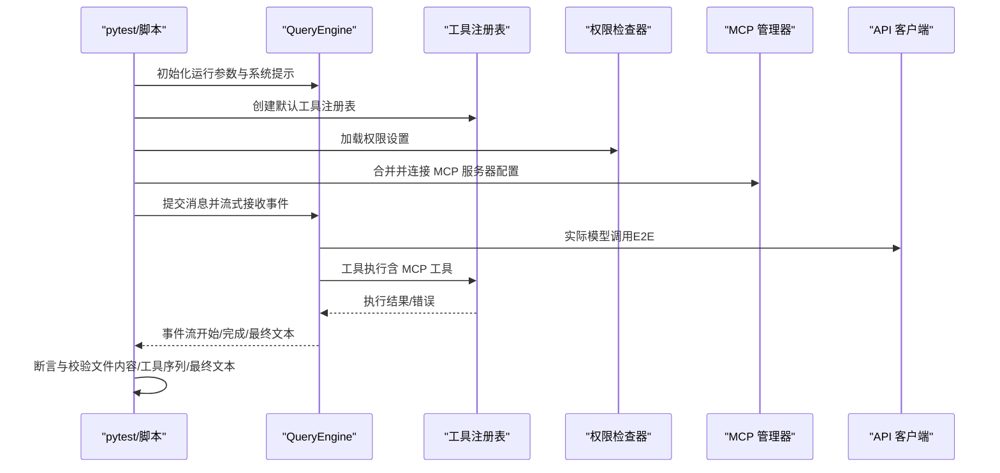
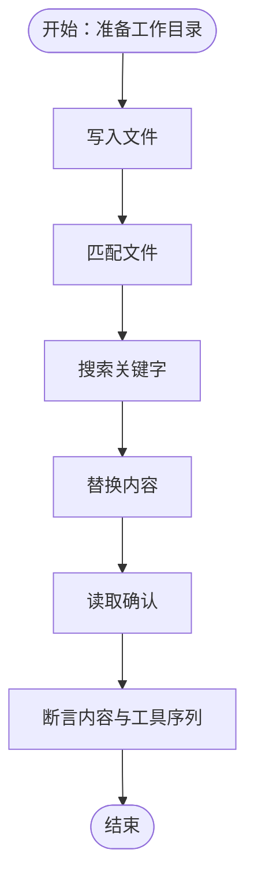
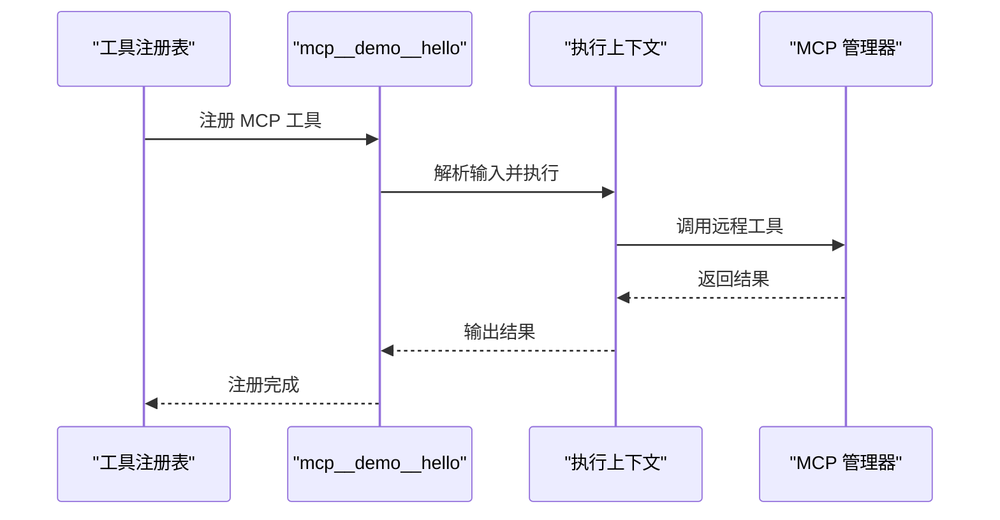
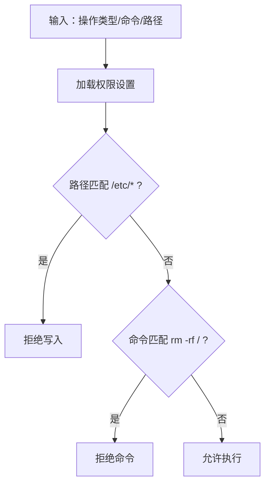
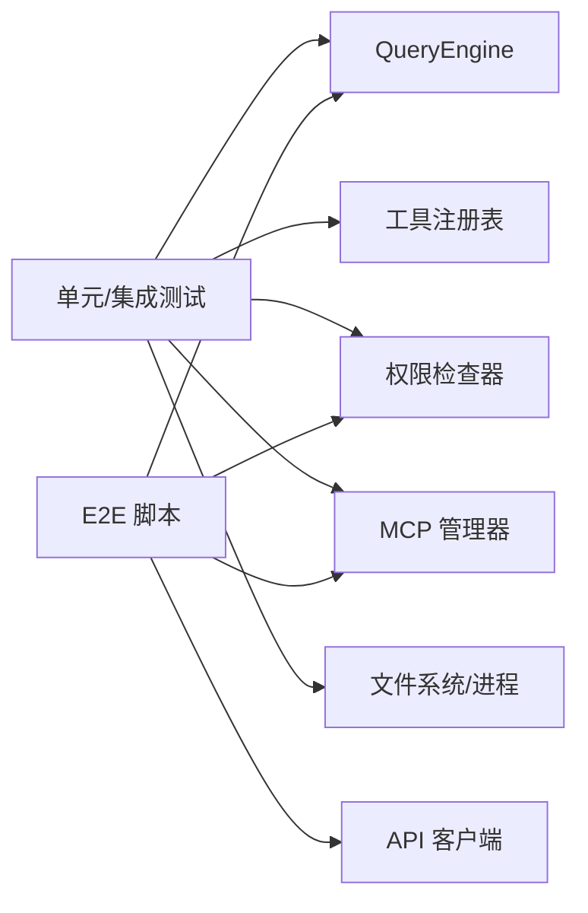

# 测试架构设计

<cite>
**本文引用的文件**
- [pyproject.toml](file://pyproject.toml)
- [README.md](file://README.md)
- [tests/conftest.py](file://tests/conftest.py)
- [tests/fixtures/fake_mcp_server.py](file://tests/fixtures/fake_mcp_server.py)
- [tests/test_bridge/test_core.py](file://tests/test_bridge/test_core.py)
- [tests/test_tools/test_core_tools.py](file://tests/test_tools/test_core_tools.py)
- [tests/test_mcp/test_integration.py](file://tests/test_mcp/test_integration.py)
- [scripts/e2e_smoke.py](file://scripts/e2e_smoke.py)
- [scripts/test_harness_features.py](file://scripts/test_harness_features.py)
- [scripts/test_real_skills_plugins.py](file://scripts/test_real_skills_plugins.py)
</cite>

## 目录
1. [引言](#引言)
2. [项目结构](#项目结构)
3. [核心组件](#核心组件)
4. [架构总览](#架构总览)
5. [详细组件分析](#详细组件分析)
6. [依赖分析](#依赖分析)
7. [性能考虑](#性能考虑)
8. [故障排查指南](#故障排查指南)
9. [结论](#结论)
10. [附录](#附录)

## 引言
本文件系统性梳理 OpenHarness 的测试架构设计，覆盖 pytest 配置、测试夹具与环境隔离、测试分类体系（单元/集成/E2E）、测试数据管理与模拟对象设计、测试运行时配置与并行执行策略，并给出最佳实践建议，帮助开发者理解与扩展测试体系。

## 项目结构
OpenHarness 的测试目录采用按功能域分层的组织方式：tests 下按子系统划分测试套件，如 test_api、test_bridge、test_tools、test_mcp 等；同时提供共享的 conftest.py 用于全局夹具与配置；scripts 目录包含多类端到端（E2E）测试脚本，覆盖真实模型调用与复杂业务流程验证。

```mermaid
graph TB
subgraph "测试根目录 tests"
CFT["tests/conftest.py<br/>共享夹具"]
FIX["tests/fixtures/fake_mcp_server.py<br/>MCP 模拟服务"]
BRG["test_bridge/*<br/>桥接层测试"]
TOOLS["test_tools/*<br/>工具集测试"]
MCP["test_mcp/*<br/>MCP 集成测试"]
API["test_api/*<br/>API 客户端测试"]
CFG["test_config/*<br/>配置测试"]
PERM["test_permissions/*<br/>权限检查测试"]
SKL["test_skills/*<br/>技能加载测试"]
PLG["test_plugins/*<br/>插件加载测试"]
HOOK["test_hooks/*<br/>钩子执行测试"]
COORD["test_coordinator/*<br/>协调器测试"]
PROMPT["test_prompts/*<br/>提示词构建测试"]
MEM["test_memory/*<br/>内存管理测试"]
SRV["test_services/*<br/>服务测试"]
TASK["test_tasks/*<br/>任务管理测试"]
UI["test_ui/*<br/>用户界面测试"]
end
subgraph "E2E 脚本 scripts"
SMOKE["e2e_smoke.py<br/>E2E 冒烟场景"]
HARNESS["test_harness_features.py<br/>特性 E2E"]
REAL["test_real_skills_plugins.py<br/>真实技能与插件 E2E"]
end
CFT --> BRG
CFT --> TOOLS
CFT --> MCP
CFT --> API
CFT --> CFG
CFT --> PERM
CFT --> SKL
CFT --> PLG
CFT --> HOOK
CFT --> COORD
CFT --> PROMPT
CFT --> MEM
CFT --> SRV
CFT --> TASK
CFT --> UI
FIX -. 模拟 MCP 服务器 .-> MCP
SMOKE --> TOOLS
SMOKE --> MCP
HARNESS --> TOOLS
HARNESS --> PERM
REAL --> SKL
REAL --> PLG
```

图表来源
- [tests/conftest.py:1-2](file://tests/conftest.py#L1-L2)
- [tests/fixtures/fake_mcp_server.py:1-22](file://tests/fixtures/fake_mcp_server.py#L1-L22)
- [scripts/e2e_smoke.py:1-808](file://scripts/e2e_smoke.py#L1-L808)
- [scripts/test_harness_features.py:1-241](file://scripts/test_harness_features.py#L1-L241)
- [scripts/test_real_skills_plugins.py:1-348](file://scripts/test_real_skills_plugins.py#L1-L348)

章节来源
- [README.md:282-300](file://README.md#L282-L300)

## 核心组件
- pytest 运行时配置
  - 测试路径与异步模式：通过工具配置自动设置测试目录与 asyncio_mode。
  - 开发依赖：pytest、pytest-asyncio、pytest-cov 等。
- 共享夹具与环境隔离
  - tests/conftest.py 提供共享夹具入口，便于在各子模块复用。
  - E2E 场景通过临时目录与环境变量隔离配置与数据目录，避免跨套件污染。
- 测试分类与覆盖范围
  - 单元/集成：tests 目录下的模块化测试，覆盖工具、桥接、MCP、权限、插件、提示词、任务、UI 等子系统。
  - E2E：scripts 下的脚本，使用真实模型调用与复杂业务流，验证端到端行为。

章节来源
- [pyproject.toml:47-49](file://pyproject.toml#L47-L49)
- [pyproject.toml:31-38](file://pyproject.toml#L31-L38)
- [README.md:282-300](file://README.md#L282-L300)

## 架构总览
下图展示测试架构的关键交互：pytest 发现与执行单元/集成测试；E2E 脚本直接构造运行时引擎、工具注册表、权限检查器与 MCP 管理器，驱动真实模型调用与文件系统操作，最终通过断言与校验函数评估结果。

图表来源
- [scripts/e2e_smoke.py:694-757](file://scripts/e2e_smoke.py#L694-L757)
- [scripts/test_harness_features.py:34-73](file://scripts/test_harness_features.py#L34-L73)
- [scripts/test_real_skills_plugins.py:38-44](file://scripts/test_real_skills_plugins.py#L38-L44)

## 详细组件分析

### pytest 配置与运行时
- 配置要点
  - testpaths 指向 tests 目录，确保 pytest 自动发现单元/集成测试。
  - asyncio_mode 设置为 auto，支持异步测试函数标记为 @pytest.mark.asyncio。
  - 开发依赖包含 pytest、pytest-asyncio、pytest-cov，支持覆盖率统计。
- 运行方式
  - 命令行：uv run pytest -q 可快速运行全部单元/集成测试。
  - E2E：分别运行 scripts 下的脚本，或通过 README 中的示例命令。

章节来源
- [pyproject.toml:47-49](file://pyproject.toml#L47-L49)
- [pyproject.toml:31-38](file://pyproject.toml#L31-L38)
- [README.md:293-298](file://README.md#L293-L298)

### 测试夹具与环境隔离
- 共享夹具
  - tests/conftest.py 作为共享入口，可在此定义全局夹具（如临时目录、会话句柄等），供所有测试模块复用。
- 环境隔离策略
  - E2E 脚本通过临时目录与环境变量隔离配置与数据目录，确保不同场景互不干扰。
  - 示例：在运行前设置 OPENHARNESS_CONFIG_DIR 与 OPENHARNESS_DATA_DIR，结束后恢复原值。

章节来源
- [tests/conftest.py:1-2](file://tests/conftest.py#L1-L2)
- [scripts/e2e_smoke.py:766-799](file://scripts/e2e_smoke.py#L766-L799)
- [scripts/test_harness_features.py:26-32](file://scripts/test_harness_features.py#L26-L32)

### 测试分类体系与适用场景
- 单元测试（Unit）
  - 覆盖：工具执行、桥接辅助函数、配置解析、权限规则、提示词构建、任务管理、UI 组件等。
  - 特点：小而快，依赖最小，常使用夹具与模拟对象。
- 集成测试（Integration）
  - 覆盖：工具注册表与 MCP 工具适配、插件生命周期、钩子执行、内存与缓存、服务层等。
  - 特点：关注组件间协作与接口契约，必要时使用轻量级模拟（如 MCP 模拟服务器）。
- 端到端测试（E2E）
  - 覆盖：真实模型调用、复杂业务流程（文件 IO、搜索编辑、技能加载、插件组合、代理委托、计划模式、工作树、定时任务、LSP、MCP 认证等）。
  - 特点：使用真实 API 密钥与模型，断言最终输出与中间工具序列，强调可重复性与稳定性。

章节来源
- [README.md:282-292](file://README.md#L282-L292)
- [scripts/e2e_smoke.py:415-691](file://scripts/e2e_smoke.py#L415-L691)
- [scripts/test_harness_features.py:206-237](file://scripts/test_harness_features.py#L206-L237)
- [scripts/test_real_skills_plugins.py:308-343](file://scripts/test_real_skills_plugins.py#L308-L343)

### 测试数据管理与模拟对象
- 测试夹具与临时数据
  - 使用 tmp_path 等夹具创建隔离的工作目录，写入/读取文件进行断言。
  - 示例：文件读写、编辑、Glob/Grep、笔记本编辑、LSP 符号查询、工作树创建与退出、定时任务 CRUD。
- 模拟对象与适配器
  - MCP 工具：通过自定义管理器适配器（FakeMcpManager）模拟工具列表、资源列表与调用返回，验证工具注册与输入校验。
  - MCP 服务器：使用 tests/fixtures/fake_mcp_server.py 提供最小化 stdio 服务器，暴露工具与资源，供集成测试使用。
- 系统提示与技能注入
  - 通过构建运行时系统提示，断言技能列表与工具指令出现在提示中，验证技能系统与提示词上下文的正确性。

章节来源
- [tests/test_tools/test_core_tools.py:34-248](file://tests/test_tools/test_core_tools.py#L34-L248)
- [tests/test_mcp/test_integration.py:17-80](file://tests/test_mcp/test_integration.py#L17-L80)
- [tests/fixtures/fake_mcp_server.py:1-22](file://tests/fixtures/fake_mcp_server.py#L1-L22)
- [scripts/test_harness_features.py:94-107](file://scripts/test_harness_features.py#L94-L107)

### 测试运行时配置与并行执行
- 测试发现机制
  - 由 pytest.ini_options.testpaths 控制，tests 目录下按模块与类自动发现。
- 并行执行
  - 当前单元/集成测试未显式启用并行执行；可通过 pytest-xdist 等扩展实现并行（需额外配置）。
- 异步测试
  - 使用 asyncio_mode=auto 与 @pytest.mark.asyncio 支持异步测试函数，常见于工具执行与会话管理。

章节来源
- [pyproject.toml:47-49](file://pyproject.toml#L47-L49)
- [tests/test_bridge/test_core.py:25-31](file://tests/test_bridge/test_core.py#L25-L31)

### 关键流程与断言示例

#### 文件 IO 与搜索编辑冒烟测试

图表来源
- [scripts/e2e_smoke.py:416-444](file://scripts/e2e_smoke.py#L416-L444)
- [scripts/e2e_smoke.py:93-117](file://scripts/e2e_smoke.py#L93-L117)

章节来源
- [scripts/e2e_smoke.py:415-691](file://scripts/e2e_smoke.py#L415-L691)

#### MCP 工具注册与调用

图表来源
- [tests/test_mcp/test_integration.py:52-80](file://tests/test_mcp/test_integration.py#L52-L80)

章节来源
- [tests/test_mcp/test_integration.py:17-80](file://tests/test_mcp/test_integration.py#L17-L80)

#### 权限规则与命令拒绝

图表来源
- [scripts/test_harness_features.py:156-202](file://scripts/test_harness_features.py#L156-L202)

章节来源
- [scripts/test_harness_features.py:156-202](file://scripts/test_harness_features.py#L156-L202)

## 依赖分析
- 组件耦合
  - 测试对被测模块的依赖主要体现在导入与实例化（如 QueryEngine、工具注册表、权限检查器、MCP 管理器），耦合度低，便于替换与模拟。
- 外部依赖与集成点
  - MCP 服务器通过 stdio 与工具注册表对接；API 客户端负责真实模型调用；文件系统与进程执行用于工具与任务测试。
- 潜在循环依赖
  - 测试代码之间无直接循环依赖；通过夹具与共享配置降低耦合。

图表来源
- [scripts/e2e_smoke.py:717-731](file://scripts/e2e_smoke.py#L717-L731)
- [tests/test_mcp/test_integration.py:68-74](file://tests/test_mcp/test_integration.py#L68-L74)

章节来源
- [scripts/e2e_smoke.py:717-731](file://scripts/e2e_smoke.py#L717-L731)
- [tests/test_mcp/test_integration.py:52-80](file://tests/test_mcp/test_integration.py#L52-L80)

## 性能考虑
- 测试执行效率
  - 单元/集成测试应保持短小精悍，避免外部 I/O；对网络与磁盘访问使用最小化夹具与模拟。
- 并行执行
  - 在确保状态隔离的前提下，可引入并行执行以缩短总耗时；注意并发写文件与共享资源的同步。
- 覆盖率与回归
  - 使用 pytest-cov 生成覆盖率报告，识别薄弱环节并补充针对性测试。

## 故障排查指南
- 常见问题定位
  - E2E 失败：检查 API 密钥、模型名称与基础地址是否正确；查看最终文本与工具序列断言细节。
  - MCP 工具未注册：确认服务器配置合并逻辑与工具描述输入模式一致。
  - 权限拒绝异常：核对路径规则与命令拒绝列表，确保测试用例使用允许路径与命令。
- 日志与诊断
  - 在 E2E 脚本中打印工具启动/完成事件与最终文本，有助于快速定位问题阶段。

章节来源
- [scripts/e2e_smoke.py:737-753](file://scripts/e2e_smoke.py#L737-L753)
- [scripts/test_harness_features.py:65-72](file://scripts/test_harness_features.py#L65-L72)

## 结论
OpenHarness 的测试架构以 pytest 为核心，结合单元/集成与 E2E 分层策略，辅以夹具与模拟对象，实现了对工具链、MCP、权限、插件与 UI 的全面覆盖。通过明确的分类体系与隔离机制，既保证了开发效率，也确保了端到端行为的可靠性。建议在现有基础上进一步完善并行执行与覆盖率策略，持续提升测试质量与可维护性。

## 附录

### 最佳实践清单
- 命名约定
  - 测试文件：test_xxx.py；测试类：TestXxx；测试函数：test_xxx。
- 组织结构
  - 与源码同名子目录对齐；公共夹具集中于 tests/conftest.py；模拟服务置于 tests/fixtures。
- 覆盖率要求
  - 优先保障核心路径与边界条件；对关键分支与异常路径补充测试。
- 并行执行
  - 在确保隔离与确定性的前提下，逐步引入并行以提升吞吐。