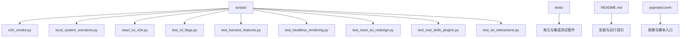
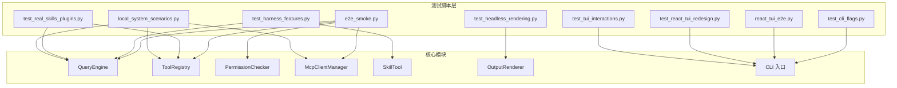
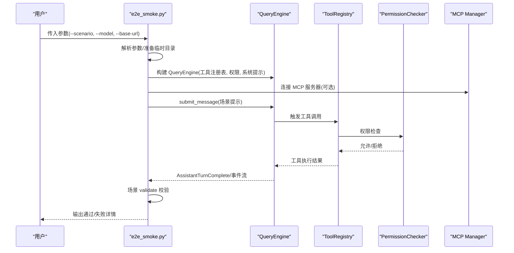
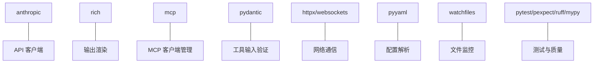

# 测试脚本使用

<cite>
**本文引用的文件**
- [README.md](file://README.md)
- [pyproject.toml](file://pyproject.toml)
- [scripts/e2e_smoke.py](file://scripts/e2e_smoke.py)
- [scripts/local_system_scenarios.py](file://scripts/local_system_scenarios.py)
- [scripts/react_tui_e2e.py](file://scripts/react_tui_e2e.py)
- [scripts/test_cli_flags.py](file://scripts/test_cli_flags.py)
- [scripts/test_harness_features.py](file://scripts/test_harness_features.py)
- [scripts/test_headless_rendering.py](file://scripts/test_headless_rendering.py)
- [scripts/test_react_tui_redesign.py](file://scripts/test_react_tui_redesign.py)
- [scripts/test_real_skills_plugins.py](file://scripts/test_real_skills_plugins.py)
- [scripts/test_tui_interactions.py](file://scripts/test_tui_interactions.py)
</cite>

## 目录
1. [简介](#简介)
2. [项目结构](#项目结构)
3. [核心组件](#核心组件)
4. [架构总览](#架构总览)
5. [详细组件分析](#详细组件分析)
6. [依赖分析](#依赖分析)
7. [性能考虑](#性能考虑)
8. [故障排除指南](#故障排除指南)
9. [结论](#结论)
10. [附录](#附录)

## 简介
本指南面向测试工程师与开发者，系统讲解 OpenHarness 的测试脚本体系与使用方法。内容覆盖：
- 测试脚本分类与用途：功能测试、端到端（E2E）测试、性能与渲染测试、CLI 行为验证、真实技能与插件集成测试等
- 每个脚本的功能、参数配置、执行方式与前置条件
- 运行环境要求与设置要点
- 结果解读：成功/失败标准、日志分析与错误诊断
- 调试技巧与常见问题排查
- 自动化与持续集成配置建议

## 项目结构
OpenHarness 的测试脚本位于 scripts/ 目录，配合 tests/ 单元与集成测试共同构成完整的测试矩阵。关键特性：
- 使用真实模型调用进行 E2E 验证（如 Kimi/k2.5 或 Claude 系列）
- 通过 uv/Python 直接运行脚本或 pytest 执行单元测试
- 部分脚本依赖前端 React TUI（需要 Node.js 与 pexpect）

图表来源
- [scripts/e2e_smoke.py](file://scripts/e2e_smoke.py)
- [scripts/local_system_scenarios.py](file://scripts/local_system_scenarios.py)
- [scripts/react_tui_e2e.py](file://scripts/react_tui_e2e.py)
- [scripts/test_cli_flags.py](file://scripts/test_cli_flags.py)
- [scripts/test_harness_features.py](file://scripts/test_harness_features.py)
- [scripts/test_headless_rendering.py](file://scripts/test_headless_rendering.py)
- [scripts/test_react_tui_redesign.py](file://scripts/test_react_tui_redesign.py)
- [scripts/test_real_skills_plugins.py](file://scripts/test_real_skills_plugins.py)
- [scripts/test_tui_interactions.py](file://scripts/test_tui_interactions.py)
- [README.md](file://README.md)
- [pyproject.toml](file://pyproject.toml)

章节来源
- [README.md:82-125](file://README.md#L82-L125)
- [pyproject.toml:15-38](file://pyproject.toml#L15-L38)

## 核心组件
- 功能测试脚本：验证核心能力（重试、技能系统、并行工具、路径权限等），部分涉及真实模型调用
- E2E 测试脚本：覆盖真实场景（文件 I/O、搜索编辑、任务流、代理委托、插件组合、问答流程、计划模式、LSP、定时任务、工作树、上下文评审、MCP 认证等）
- 前端交互测试：React TUI 欢迎横幅、对话布局、状态栏、命令选择器、权限弹窗、快捷键提示
- CLI 行为测试：帮助输出、打印模式、JSON 输出、子命令列表与状态检查
- 渲染与头模式测试：富文本渲染、工具输出面板格式、旋转指示器、真实模型头模式调用
- 实际技能与插件测试：加载真实技能库与兼容插件，验证钩子与命令发现

章节来源
- [scripts/test_harness_features.py:1-241](file://scripts/test_harness_features.py#L1-L241)
- [scripts/e2e_smoke.py:1-808](file://scripts/e2e_smoke.py#L1-L808)
- [scripts/react_tui_e2e.py:1-171](file://scripts/react_tui_e2e.py#L1-L171)
- [scripts/test_react_tui_redesign.py:1-189](file://scripts/test_react_tui_redesign.py#L1-L189)
- [scripts/test_tui_interactions.py:1-205](file://scripts/test_tui_interactions.py#L1-L205)
- [scripts/test_cli_flags.py:1-159](file://scripts/test_cli_flags.py#L1-L159)
- [scripts/test_headless_rendering.py:1-168](file://scripts/test_headless_rendering.py#L1-L168)
- [scripts/test_real_skills_plugins.py:1-348](file://scripts/test_real_skills_plugins.py#L1-L348)

## 架构总览
下图展示测试脚本与核心模块的交互关系，以及真实模型调用路径。

图表来源
- [scripts/e2e_smoke.py:717-756](file://scripts/e2e_smoke.py#L717-L756)
- [scripts/test_harness_features.py:110-137](file://scripts/test_harness_features.py#L110-L137)
- [scripts/test_cli_flags.py:27-37](file://scripts/test_cli_flags.py#L27-L37)
- [scripts/react_tui_e2e.py:21-36](file://scripts/react_tui_e2e.py#L21-L36)
- [scripts/test_react_tui_redesign.py:44-49](file://scripts/test_react_tui_redesign.py#L44-L49)
- [scripts/test_tui_interactions.py:41-46](file://scripts/test_tui_interactions.py#L41-L46)
- [scripts/test_headless_rendering.py:122-132](file://scripts/test_headless_rendering.py#L122-L132)
- [scripts/test_real_skills_plugins.py:114-132](file://scripts/test_real_skills_plugins.py#L114-L132)
- [scripts/local_system_scenarios.py:43-65](file://scripts/local_system_scenarios.py#L43-L65)

## 详细组件分析

### 功能测试脚本：test_harness_features.py
- 目标：验证重试机制、技能系统、并行工具执行、路径级权限控制等核心能力
- 关键点：
  - 重试配置与延迟计算校验
  - 技能加载与注入系统提示
  - 并行工具执行代码存在性校验
  - 路径规则与命令拒绝规则生效性
- 执行方式：直接运行脚本，内部使用 subprocess 调用 oh CLI，或直接导入核心模块进行单元式验证
- 成功标准：返回元组 (True, 说明)；失败返回 (False, 说明)
- 失败排查：检查 ANTHROPIC_* 环境变量是否正确设置；确认模型可用且有权限访问

章节来源
- [scripts/test_harness_features.py:42-73](file://scripts/test_harness_features.py#L42-L73)
- [scripts/test_harness_features.py:75-138](file://scripts/test_harness_features.py#L75-L138)
- [scripts/test_harness_features.py:140-152](file://scripts/test_harness_features.py#L140-L152)
- [scripts/test_harness_features.py:154-202](file://scripts/test_harness_features.py#L154-L202)

### E2E 测试脚本：e2e_smoke.py
- 目标：在真实模型上运行多场景端到端验证，覆盖文件 I/O、搜索编辑、任务流、代理委托、插件组合、问答、任务更新、笔记本、LSP、定时任务、工作树、上下文评审、MCP 认证等
- 场景选择：支持 --scenario=all 或指定场景名（如 file_io、search_edit、task_flow 等）
- 参数与行为：
  - --model：覆盖模型名称
  - --base-url：覆盖基础 URL
  - --scenario：选择要运行的场景集合
  - --api-key-stdin：从标准输入读取 API Key（否则从环境变量读取）
- 执行流程概览：
  - 解析参数，准备临时目录与环境变量
  - 加载设置、插件、MCP 配置
  - 构建 QueryEngine，提交提示，收集事件
  - 校验最终文本、工具序列、文件内容等
  - 返回失败清单或通过信息
- 成功标准：每个场景的 validate 函数返回 (True, 详情)
- 失败排查：查看最终文本与工具序列；检查场景 setup 是否生成预期文件；确认 MCP 服务器配置与认证

图表来源
- [scripts/e2e_smoke.py:759-799](file://scripts/e2e_smoke.py#L759-L799)
- [scripts/e2e_smoke.py:694-757](file://scripts/e2e_smoke.py#L694-L757)

章节来源
- [scripts/e2e_smoke.py:54-90](file://scripts/e2e_smoke.py#L54-L90)
- [scripts/e2e_smoke.py:415-691](file://scripts/e2e_smoke.py#L415-L691)
- [scripts/e2e_smoke.py:694-757](file://scripts/e2e_smoke.py#L694-L757)

### 本地系统场景：local_system_scenarios.py
- 目标：验证 MCP、插件、桥接（bridge）、命令注册表等本地系统能力
- 关键流程：
  - 写入临时插件源码，安装/卸载插件
  - 连接 MCP 服务器，执行工具
  - 注册命令并执行（安装/启用/禁用/卸载）
  - 启动会话桥接，编码解码工作密钥，构建 SDK URL
- 成功标准：各子流程断言通过，输出 PASS
- 失败排查：确认插件目录结构、MCP 配置、命令注册表可用性

章节来源
- [scripts/local_system_scenarios.py:68-93](file://scripts/local_system_scenarios.py#L68-L93)
- [scripts/local_system_scenarios.py:96-142](file://scripts/local_system_scenarios.py#L96-L142)
- [scripts/local_system_scenarios.py:145-160](file://scripts/local_system_scenarios.py#L145-L160)
- [scripts/local_system_scenarios.py:163-178](file://scripts/local_system_scenarios.py#L163-L178)
- [scripts/local_system_scenarios.py:181-219](file://scripts/local_system_scenarios.py#L181-L219)

### React TUI E2E：react_tui_e2e.py
- 目标：通过 pexpect 驱动 React TUI，验证权限文件 I/O、问答流程、命令流
- 关键点：
  - 通过 OPENHARNESS_CONFIG_DIR/DATA_DIR 隔离配置与数据
  - 使用 OPENHARNESS_FRONTEND_RAW_RETURN 与 OPENHARNESS_FRONTEND_SCRIPT 控制前端行为
  - 通过 uv run oh 启动 CLI，并由 pexpect 输入文本
- 成功标准：等待到最终标记（如 FINAL_OK_*），断言文件内容或输出
- 失败排查：检查 pexpect 安装、超时时间、前端脚本与期望输出

章节来源
- [scripts/react_tui_e2e.py:48-62](file://scripts/react_tui_e2e.py#L48-L62)
- [scripts/react_tui_e2e.py:65-87](file://scripts/react_tui_e2e.py#L65-L87)
- [scripts/react_tui_e2e.py:90-116](file://scripts/react_tui_e2e.py#L90-L116)
- [scripts/react_tui_e2e.py:119-149](file://scripts/react_tui_e2e.py#L119-L149)

### React TUI 重构测试：test_react_tui_redesign.py
- 目标：验证欢迎横幅、对话布局（无侧边栏）、状态栏显示模型信息
- 关键点：通过 npm exec tsx 启动前端，设置 OPENHARNESS_FRONTEND_CONFIG 指向后端命令
- 成功标准：匹配横幅文本、未出现旧侧边栏元素、状态栏包含模型信息
- 失败排查：确认 Node.js 与 pnpm/tsx 可用，检查前端脚本与超时

章节来源
- [scripts/test_react_tui_redesign.py:25-29](file://scripts/test_react_tui_redesign.py#L25-L29)
- [scripts/test_react_tui_redesign.py:32-70](file://scripts/test_react_tui_redesign.py#L32-L70)
- [scripts/test_react_tui_redesign.py:75-117](file://scripts/test_react_tui_redesign.py#L75-L117)
- [scripts/test_react_tui_redesign.py:121-157](file://scripts/test_react_tui_redesign.py#L121-L157)

### TUI 交互测试：test_tui_interactions.py
- 目标：命令选择器可见性、权限弹窗与快捷键提示、移除 --headless 标记
- 关键点：通过 OPENHARNESS_FRONTEND_SCRIPT 驱动交互，等待 EOF 或特定 UI 文本
- 成功标准：命令选择器出现、权限弹窗可交互、快捷键提示可见、--headless 不再出现在帮助中
- 失败排查：确认 pexpect 安装、前端脚本顺序、超时设置

章节来源
- [scripts/test_tui_interactions.py:28-68](file://scripts/test_tui_interactions.py#L28-L68)
- [scripts/test_tui_interactions.py:71-117](file://scripts/test_tui_interactions.py#L71-L117)
- [scripts/test_tui_interactions.py:120-159](file://scripts/test_tui_interactions.py#L120-L159)
- [scripts/test_tui_interactions.py:162-172](file://scripts/test_tui_interactions.py#L162-L172)

### CLI 行为测试：test_cli_flags.py
- 目标：验证帮助输出、打印模式、JSON 输出、子命令列表与认证状态
- 关键点：通过 subprocess 调用 oh，设置 ANTHROPIC_BASE_URL/ANTHROPIC_MODEL 环境变量
- 成功标准：帮助输出包含各组标志与子命令；打印模式输出包含期望关键词；JSON 输出解析成功；子命令返回非零退出码时给出明确错误信息
- 失败排查：确认环境变量设置、模型可用性、子命令权限

章节来源
- [scripts/test_cli_flags.py:19-24](file://scripts/test_cli_flags.py#L19-L24)
- [scripts/test_cli_flags.py:27-37](file://scripts/test_cli_flags.py#L27-L37)
- [scripts/test_cli_flags.py:40-68](file://scripts/test_cli_flags.py#L40-L68)
- [scripts/test_cli_flags.py:82-98](file://scripts/test_cli_flags.py#L82-L98)
- [scripts/test_cli_flags.py:100-124](file://scripts/test_cli_flags.py#L100-L124)

### 头模式渲染测试：test_headless_rendering.py
- 目标：验证富文本渲染、工具输出面板格式、旋转指示器状态、真实模型头模式调用
- 关键点：使用 OutputRenderer 与 Rich 控制台，模拟事件流
- 成功标准：渲染输出包含关键文本、工具输出格式化、旋转指示器启停正常
- 失败排查：确认 ANTHROPIC_AUTH_TOKEN 设置、模型可用性

章节来源
- [scripts/test_headless_rendering.py:31-56](file://scripts/test_headless_rendering.py#L31-L56)
- [scripts/test_headless_rendering.py:59-84](file://scripts/test_headless_rendering.py#L59-L84)
- [scripts/test_headless_rendering.py:87-113](file://scripts/test_headless_rendering.py#L87-L113)
- [scripts/test_headless_rendering.py:116-135](file://scripts/test_headless_rendering.py#L116-L135)

### 真实技能与插件测试：test_real_skills_plugins.py
- 目标：安装并加载真实技能库（anthropics/skills）与兼容插件，验证钩子与命令发现、模型对真实技能的使用
- 关键点：复制 SKILL.md 到用户技能目录；加载插件；检查钩子结构与命令内容
- 成功标准：至少发现若干真实技能与插件；钩子结构有效；命令内容充足；模型调用不崩溃
- 失败排查：确认外部仓库路径存在、插件 manifest 正确、权限与网络可用

章节来源
- [scripts/test_real_skills_plugins.py:50-70](file://scripts/test_real_skills_plugins.py#L50-L70)
- [scripts/test_real_skills_plugins.py:73-110](file://scripts/test_real_skills_plugins.py#L73-L110)
- [scripts/test_real_skills_plugins.py:112-133](file://scripts/test_real_skills_plugins.py#L112-L133)
- [scripts/test_real_skills_plugins.py:135-153](file://scripts/test_real_skills_plugins.py#L135-L153)
- [scripts/test_real_skills_plugins.py:155-166](file://scripts/test_real_skills_plugins.py#L155-L166)
- [scripts/test_real_skills_plugins.py:173-194](file://scripts/test_real_skills_plugins.py#L173-L194)
- [scripts/test_real_skills_plugins.py:197-214](file://scripts/test_real_skills_plugins.py#L197-L214)
- [scripts/test_real_skills_plugins.py:217-238](file://scripts/test_real_skills_plugins.py#L217-L238)
- [scripts/test_real_skills_plugins.py:241-263](file://scripts/test_real_skills_plugins.py#L241-L263)
- [scripts/test_real_skills_plugins.py:266-288](file://scripts/test_real_skills_plugins.py#L266-L288)
- [scripts/test_real_skills_plugins.py:291-301](file://scripts/test_real_skills_plugins.py#L291-L301)

## 依赖分析
- 运行时依赖：anthropic、rich、prompt-toolkit、textual、typer、pydantic、httpx、websockets、mcp、pyperclip、pyyaml、watchfiles
- 开发依赖：pytest、pytest-asyncio、pytest-cov、ruff、mypy、pexpect
- 脚本入口：oh 与 openharness 命令指向 CLI 入口

图表来源
- [pyproject.toml:15-28](file://pyproject.toml#L15-L28)
- [pyproject.toml:30-38](file://pyproject.toml#L30-L38)

章节来源
- [pyproject.toml:15-38](file://pyproject.toml#L15-L38)

## 性能考虑
- 并行工具执行：查询循环支持并行路径，同时保留单工具快速路径，减少不必要的并发开销
- 重试策略：指数退避延迟，避免对上游服务造成压力
- 渲染优化：Rich 控制台按需渲染，避免重复输出
- 建议：
  - 在 CI 中限制并发度，避免过度占用资源
  - 对长耗时场景（如 MCP 服务器连接）设置合理超时
  - 使用临时目录隔离测试数据，避免磁盘 IO 影响

章节来源
- [scripts/test_harness_features.py:142-151](file://scripts/test_harness_features.py#L142-L151)
- [scripts/test_harness_features.py:44-62](file://scripts/test_harness_features.py#L44-L62)
- [scripts/test_headless_rendering.py:31-56](file://scripts/test_headless_rendering.py#L31-L56)

## 故障排除指南
- 环境变量缺失
  - ANTHROPIC_AUTH_TOKEN：用于真实模型调用
  - ANTHROPIC_BASE_URL：模型服务地址
  - ANTHROPIC_MODEL：模型名称
  - OPENHARNESS_CONFIG_DIR/DATA_DIR：隔离测试配置与数据
- pexpect 缺失：前端相关测试需要安装 pexpect
- Node.js/前端：React TUI 相关测试需要 Node.js 与 tsx
- 超时与 EOF：前端测试设置合理 timeout，关注 before 输出定位问题
- MCP 服务器：确保 fixture 服务器可执行，命令与参数正确
- 插件与技能：确认外部仓库路径存在，manifest 文件完整

章节来源
- [scripts/test_cli_flags.py:19-24](file://scripts/test_cli_flags.py#L19-L24)
- [scripts/react_tui_e2e.py:34-36](file://scripts/react_tui_e2e.py#L34-L36)
- [scripts/test_react_tui_redesign.py:36-37](file://scripts/test_react_tui_redesign.py#L36-L37)
- [scripts/test_real_skills_plugins.py:54-55](file://scripts/test_real_skills_plugins.py#L54-L55)

## 结论
OpenHarness 的测试脚本体系覆盖了从功能到端到端、从 CLI 到前端交互、从渲染到真实技能与插件的全链路验证。通过合理的参数配置、环境设置与日志分析，可以高效定位问题并保障系统稳定性。建议在本地与 CI 中结合使用不同类型的测试脚本，形成闭环的质量保障。

## 附录

### 运行环境与前置条件
- Python 3.11+ 与 uv
- Node.js 18+（前端测试）
- pexpect（前端交互测试）
- LLM API Key 与模型配置（ANTHROPIC_*）
- 可选：外部仓库（真实技能与插件测试）

章节来源
- [README.md:84-106](file://README.md#L84-L106)
- [pyproject.toml:10-14](file://pyproject.toml#L10-L14)

### 执行方法与参数速查
- 功能测试：python scripts/test_harness_features.py
- E2E 场景：python scripts/e2e_smoke.py [--scenario all|<场景名>] [--model <模型>] [--base-url <URL>] [--api-key-stdin]
- 本地系统：python scripts/local_system_scenarios.py
- React TUI E2E：python scripts/react_tui_e2e.py [--scenario all|permission_file_io|question_flow|command_flow]
- TUI 重构：python scripts/test_react_tui_redesign.py
- TUI 交互：python scripts/test_tui_interactions.py
- CLI 行为：python scripts/test_cli_flags.py
- 头模式渲染：python scripts/test_headless_rendering.py
- 真实技能与插件：python scripts/test_real_skills_plugins.py

章节来源
- [scripts/e2e_smoke.py:54-90](file://scripts/e2e_smoke.py#L54-L90)
- [scripts/react_tui_e2e.py:152-167](file://scripts/react_tui_e2e.py#L152-L167)
- [scripts/test_cli_flags.py:127-154](file://scripts/test_cli_flags.py#L127-L154)
- [scripts/test_harness_features.py:206-236](file://scripts/test_harness_features.py#L206-L236)
- [scripts/test_react_tui_redesign.py:160-184](file://scripts/test_react_tui_redesign.py#L160-L184)
- [scripts/test_tui_interactions.py:175-200](file://scripts/test_tui_interactions.py#L175-L200)
- [scripts/test_headless_rendering.py:138-163](file://scripts/test_headless_rendering.py#L138-L163)
- [scripts/test_real_skills_plugins.py:308-343](file://scripts/test_real_skills_plugins.py#L308-L343)

### 结果解读与日志分析
- 成功：脚本返回通过计数与失败计数，失败计数为 0 时整体通过
- 失败：逐项输出 FAIL 与原因，便于定位具体断言
- 日志：前端测试可通过 OPENHARNESS_E2E_DEBUG=1 输出实时交互日志；注意超时与 EOF 前的 before 输出
- 错误诊断：优先检查环境变量、网络连通性、MCP 服务器可用性、插件与技能路径

章节来源
- [scripts/test_cli_flags.py:127-154](file://scripts/test_cli_flags.py#L127-L154)
- [scripts/test_react_tui_redesign.py:60-70](file://scripts/test_react_tui_redesign.py#L60-L70)
- [scripts/react_tui_e2e.py:34-36](file://scripts/react_tui_e2e.py#L34-L36)

### 调试技巧
- 使用 --scenario 指定最小化场景，快速定位问题
- 在前端测试中开启调试输出，观察交互序列
- 分步执行：先运行本地系统场景，再运行 E2E 场景
- 对 MCP 与插件场景，先验证服务器与 manifest，再进行工具调用
- 在 CI 中记录完整日志，区分单元测试与 E2E 测试输出

章节来源
- [scripts/e2e_smoke.py:54-90](file://scripts/e2e_smoke.py#L54-L90)
- [scripts/test_react_tui_redesign.py:58-72](file://scripts/test_react_tui_redesign.py#L58-L72)
- [scripts/test_real_skills_plugins.py:173-194](file://scripts/test_real_skills_plugins.py#L173-L194)

### 自动化与持续集成配置建议
- 单元测试：uv run pytest -q
- E2E 功能测试：python scripts/test_harness_features.py
- 真实技能与插件测试：python scripts/test_real_skills_plugins.py（需准备外部仓库）
- 前端测试：分别运行 react_tui_e2e.py、test_react_tui_redesign.py、test_tui_interactions.py
- CLI 行为与渲染：分别运行 test_cli_flags.py、test_headless_rendering.py
- 环境准备：在 CI 中设置 ANTHROPIC_* 与 Node.js/pexpect；为前端测试设置超时与调试输出

章节来源
- [README.md:293-298](file://README.md#L293-L298)
- [pyproject.toml:47-49](file://pyproject.toml#L47-L49)