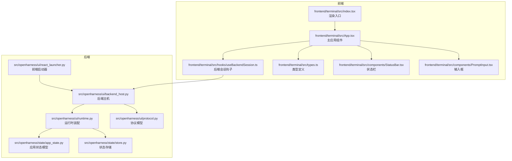
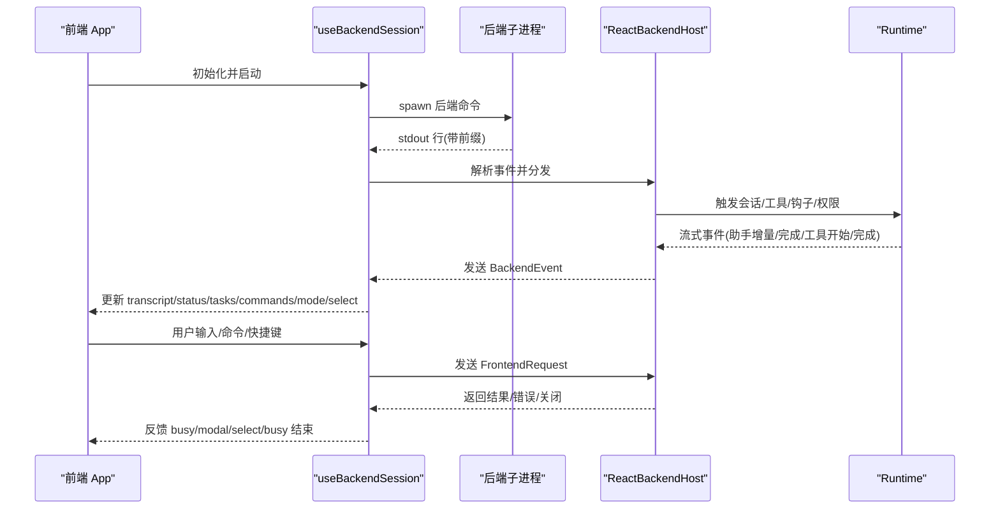
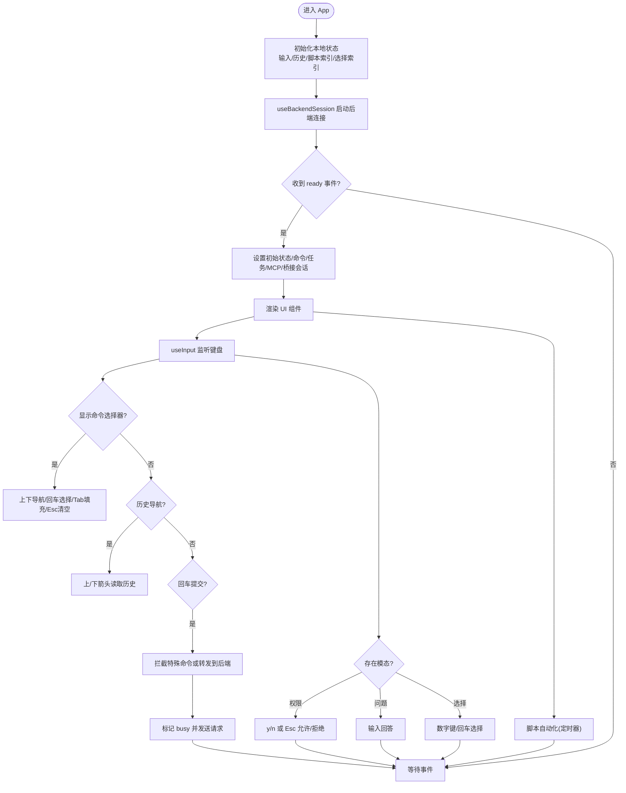
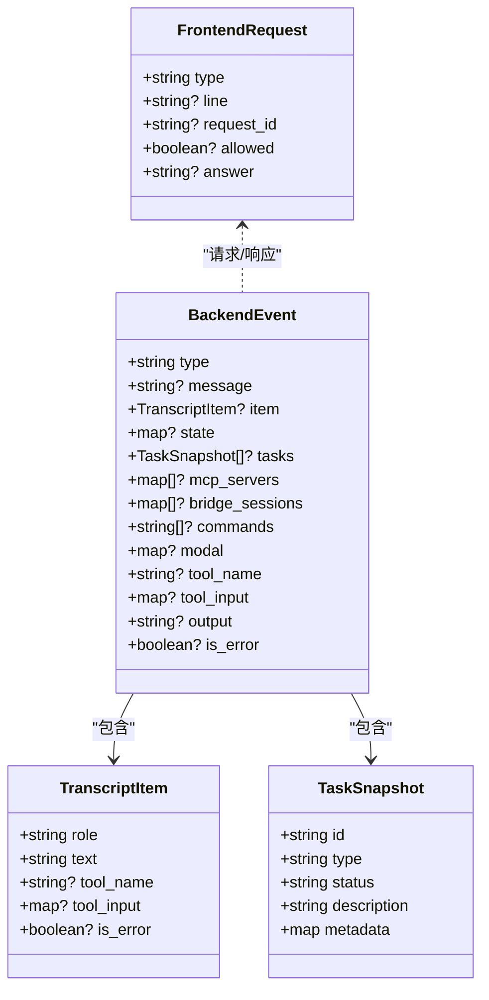
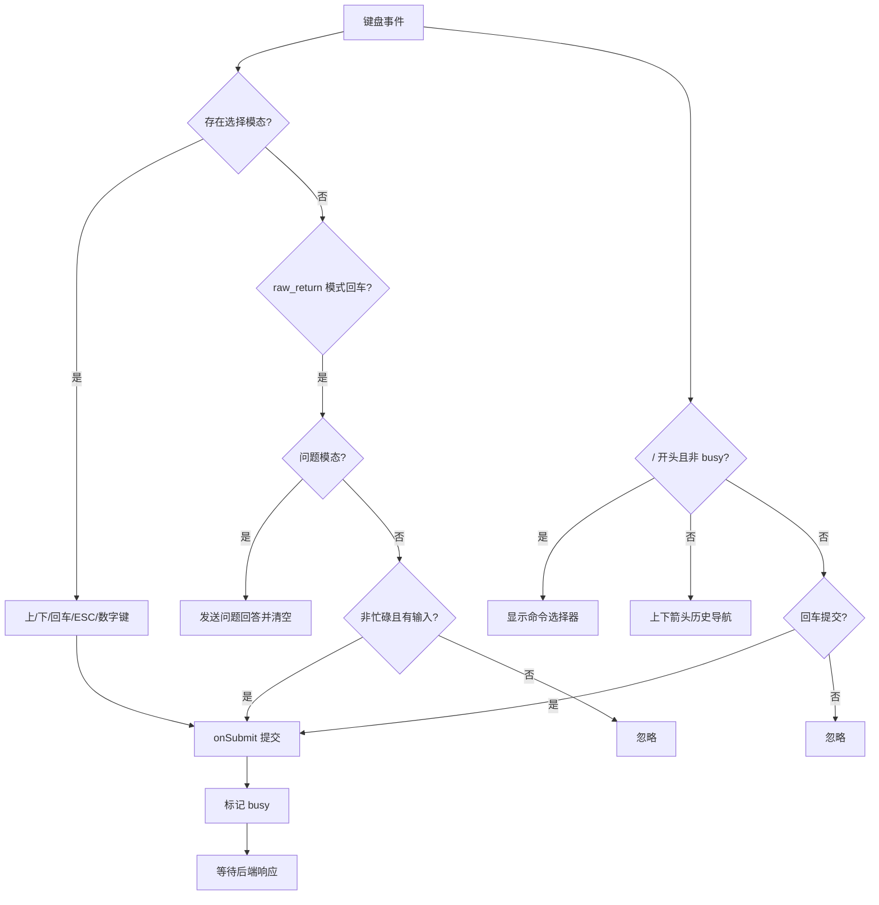
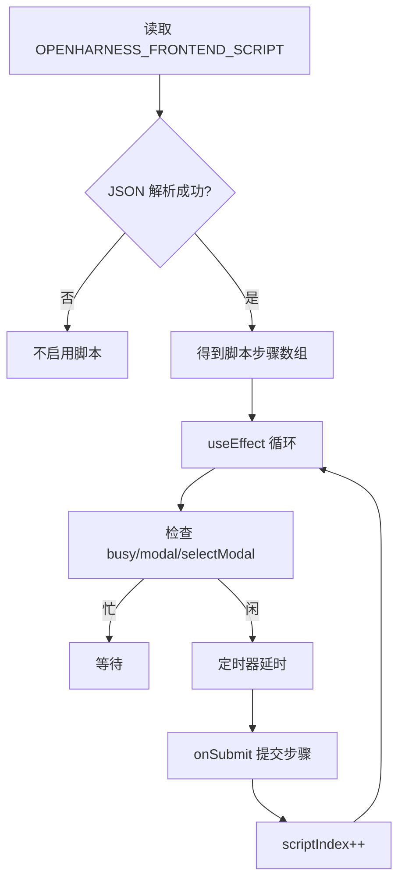
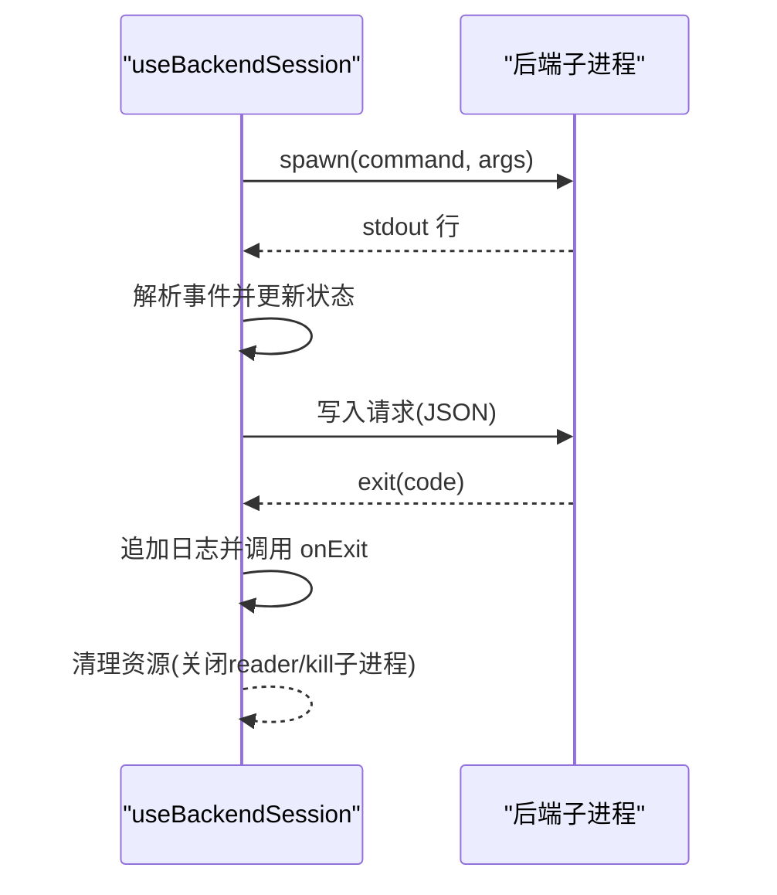
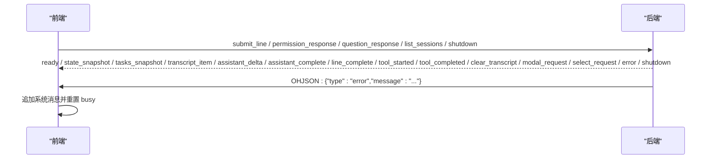
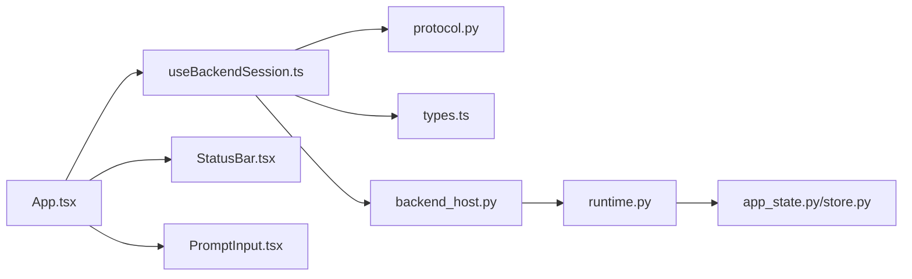

# 主应用组件

<cite>
**本文档引用的文件**
- [frontend/terminal/src/App.tsx](file://frontend/terminal/src/App.tsx)
- [frontend/terminal/src/index.tsx](file://frontend/terminal/src/index.tsx)
- [frontend/terminal/src/hooks/useBackendSession.ts](file://frontend/terminal/src/hooks/useBackendSession.ts)
- [frontend/terminal/src/types.ts](file://frontend/terminal/src/types.ts)
- [frontend/terminal/src/components/StatusBar.tsx](file://frontend/terminal/src/components/StatusBar.tsx)
- [frontend/terminal/src/components/PromptInput.tsx](file://frontend/terminal/src/components/PromptInput.tsx)
- [src/openharness/ui/react_launcher.py](file://src/openharness/ui/react_launcher.py)
- [src/openharness/ui/backend_host.py](file://src/openharness/ui/backend_host.py)
- [src/openharness/ui/protocol.py](file://src/openharness/ui/protocol.py)
- [src/openharness/ui/runtime.py](file://src/openharness/ui/runtime.py)
- [src/openharness/state/app_state.py](file://src/openharness/state/app_state.py)
- [src/openharness/state/store.py](file://src/openharness/state/store.py)
- [src/openharness/hooks/events.py](file://src/openharness/hooks/events.py)
</cite>

## 目录
1. [简介](#简介)
2. [项目结构](#项目结构)
3. [核心组件](#核心组件)
4. [架构总览](#架构总览)
5. [详细组件分析](#详细组件分析)
6. [依赖分析](#依赖分析)
7. [性能考虑](#性能考虑)
8. [故障排除指南](#故障排除指南)
9. [结论](#结论)
10. [附录](#附录)

## 简介
本文件系统性地解析前端主应用组件 App 的整体架构与职责，涵盖状态管理、事件处理、组件协调、会话管理、键盘输入处理、脚本自动化、生命周期与副作用、与后端通信的协议与错误处理，以及配置与扩展的最佳实践。App 作为 React TUI 前端的核心，通过 useBackendSession 钩子与 Python 后端进行双向通信，驱动交互式会话、命令执行、权限确认、问题询问、任务与 MCP 状态展示等能力。

## 项目结构
前端终端应用位于 frontend/terminal，采用 React Ink 构建 TUI 界面；后端运行时由 Python 模块提供，通过 JSON Lines 协议与前端通信。入口通过 npm/tsx 启动前端，前端再以配置参数启动后端进程。

图表来源
- [frontend/terminal/src/index.tsx:1-10](file://frontend/terminal/src/index.tsx#L1-L10)
- [frontend/terminal/src/App.tsx:1-400](file://frontend/terminal/src/App.tsx#L1-L400)
- [frontend/terminal/src/hooks/useBackendSession.ts:1-172](file://frontend/terminal/src/hooks/useBackendSession.ts#L1-L172)
- [frontend/terminal/src/types.ts:1-63](file://frontend/terminal/src/types.ts#L1-L63)
- [frontend/terminal/src/components/StatusBar.tsx:1-54](file://frontend/terminal/src/components/StatusBar.tsx#L1-L54)
- [frontend/terminal/src/components/PromptInput.tsx:1-39](file://frontend/terminal/src/components/PromptInput.tsx#L1-L39)
- [src/openharness/ui/react_launcher.py:1-107](file://src/openharness/ui/react_launcher.py#L1-L107)
- [src/openharness/ui/backend_host.py:1-306](file://src/openharness/ui/backend_host.py#L1-L306)
- [src/openharness/ui/runtime.py:1-297](file://src/openharness/ui/runtime.py#L1-L297)
- [src/openharness/ui/protocol.py:1-198](file://src/openharness/ui/protocol.py#L1-L198)
- [src/openharness/state/app_state.py:1-31](file://src/openharness/state/app_state.py#L1-L31)
- [src/openharness/state/store.py:1-41](file://src/openharness/state/store.py#L1-L41)

章节来源
- [frontend/terminal/src/index.tsx:1-10](file://frontend/terminal/src/index.tsx#L1-L10)
- [src/openharness/ui/react_launcher.py:50-107](file://src/openharness/ui/react_launcher.py#L50-L107)

## 核心组件
- 主应用组件 App：负责 UI 渲染、用户输入处理、命令提示与选择、模态交互（权限、问题、选择）、脚本自动化、状态栏显示、以及与后端会话的协调。
- useBackendSession 钩子：封装与后端的子进程通信，解析 JSON Lines 协议事件，维护会话状态（转录、助手缓冲、状态快照、任务、命令列表、MCP/桥接会话、模态、选择请求、忙碌标志）。
- 类型系统：统一前后端数据结构，确保协议一致性与类型安全。
- 运行时与后端主机：装配引擎、工具注册表、MCP 管理器、状态存储、钩子执行器，驱动会话生命周期与事件流。
- 状态模型：AppState 与 AppStateStore 提供可观察的状态更新与订阅机制。

章节来源
- [frontend/terminal/src/App.tsx:39-400](file://frontend/terminal/src/App.tsx#L39-L400)
- [frontend/terminal/src/hooks/useBackendSession.ts:17-172](file://frontend/terminal/src/hooks/useBackendSession.ts#L17-L172)
- [frontend/terminal/src/types.ts:1-63](file://frontend/terminal/src/types.ts#L1-L63)
- [src/openharness/ui/backend_host.py:41-306](file://src/openharness/ui/backend_host.py#L41-L306)
- [src/openharness/state/app_state.py:8-31](file://src/openharness/state/app_state.py#L8-L31)
- [src/openharness/state/store.py:14-41](file://src/openharness/state/store.py#L14-L41)

## 架构总览
App 通过 useBackendSession 与后端建立 JSON Lines 协议通道，后端以 ReactBackendHost 驱动运行时，按需发送事件（就绪、状态快照、任务快照、转录项、工具执行、模态请求、选择请求、错误、关闭），前端据此更新 UI 并向后端发送请求（提交文本、权限响应、问题响应、列出会话、关闭）。

图表来源
- [frontend/terminal/src/hooks/useBackendSession.ts:39-150](file://frontend/terminal/src/hooks/useBackendSession.ts#L39-L150)
- [src/openharness/ui/backend_host.py:54-204](file://src/openharness/ui/backend_host.py#L54-L204)
- [src/openharness/ui/protocol.py:15-87](file://src/openharness/ui/protocol.py#L15-L87)

## 详细组件分析

### 主应用组件 App
职责与特性
- 状态管理：集中管理输入文本、历史记录、脚本索引、命令选择器索引、选择模态状态、当前工具名等。
- 事件处理：useInput 处理键盘事件（上下箭头、回车、Tab、Esc、Ctrl+C、数字键快速选择），拦截特殊命令（权限模式切换、计划模式、恢复会话）。
- 组件协调：根据会话状态决定是否显示命令选择器、选择模态、权限/问题模态、输入框、状态栏与键盘提示。
- 生命周期与副作用：useEffect 管理脚本自动化（基于环境变量的脚本步骤）、选择请求的自动弹出、命令提示的索引同步。
- 与后端集成：通过 useBackendSession 获取 transcript、status、tasks、commands、modal、selectRequest、busy 等，并发送请求。

图表来源
- [frontend/terminal/src/App.tsx:76-334](file://frontend/terminal/src/App.tsx#L76-L334)
- [frontend/terminal/src/App.tsx:149-290](file://frontend/terminal/src/App.tsx#L149-L290)
- [frontend/terminal/src/App.tsx:292-318](file://frontend/terminal/src/App.tsx#L292-L318)

章节来源
- [frontend/terminal/src/App.tsx:39-400](file://frontend/terminal/src/App.tsx#L39-L400)

### 会话管理与后端通信
- 会话钩子：useBackendSession 负责子进程生命周期、事件解析、状态更新、请求发送。
- 协议模型：FrontendRequest/BackendEvent 定义了请求与事件类型，支持提交文本、权限/问题响应、列出会话、关闭、转录项、助手增量/完成、工具开始/完成、状态/任务快照、模态/选择请求、错误与关闭。
- 后端主机：ReactBackendHost 装载运行时、处理请求队列、触发权限/问题模态、渲染事件流、维护忙碌状态、发出状态快照与任务快照。
- 错误处理：后端对未知请求、重复提交、无效请求进行错误事件反馈；前端在错误事件中追加系统消息并重置忙碌状态。

图表来源
- [src/openharness/ui/protocol.py:15-87](file://src/openharness/ui/protocol.py#L15-L87)
- [src/openharness/ui/protocol.py:25-53](file://src/openharness/ui/protocol.py#L25-L53)
- [src/openharness/ui/protocol.py:35-53](file://src/openharness/ui/protocol.py#L35-L53)

章节来源
- [frontend/terminal/src/hooks/useBackendSession.ts:17-172](file://frontend/terminal/src/hooks/useBackendSession.ts#L17-L172)
- [src/openharness/ui/backend_host.py:41-306](file://src/openharness/ui/backend_host.py#L41-L306)
- [src/openharness/ui/protocol.py:1-198](file://src/openharness/ui/protocol.py#L1-L198)

### 键盘输入处理与命令交互
- 特殊命令拦截：/permissions、/plan、/resume 等，通过内部逻辑转换为后端请求或选择模态。
- 命令提示：当输入以“/”开头且非 busy/modal/select 时，显示命令建议列表，支持上下导航、Tab 填充、Esc 清空。
- 历史导航：在非命令提示状态下使用上下箭头浏览历史。
- 模态交互：权限确认（y/n）、问题回答（直接提交）、选择模态（数字键或回车）。
- 脚本自动化：通过环境变量注入脚本步骤，在空闲时定时自动提交。

图表来源
- [frontend/terminal/src/App.tsx:149-290](file://frontend/terminal/src/App.tsx#L149-L290)
- [frontend/terminal/src/App.tsx:292-318](file://frontend/terminal/src/App.tsx#L292-L318)

章节来源
- [frontend/terminal/src/App.tsx:149-334](file://frontend/terminal/src/App.tsx#L149-L334)

### 脚本自动化
- 环境变量 OPENHARNESS_FRONTEND_SCRIPT：JSON 数组字符串，包含一系列待执行的输入步骤。
- 自动化流程：useEffect 在空闲时（非 busy、非 modal、非 selectModal）按固定间隔提交下一个步骤，推进 scriptIndex。
- 退出条件：遍历完所有步骤后停止。

图表来源
- [frontend/terminal/src/App.tsx:13-25](file://frontend/terminal/src/App.tsx#L13-L25)
- [frontend/terminal/src/App.tsx:320-334](file://frontend/terminal/src/App.tsx#L320-L334)

章节来源
- [frontend/terminal/src/App.tsx:13-25](file://frontend/terminal/src/App.tsx#L13-L25)
- [frontend/terminal/src/App.tsx:320-334](file://frontend/terminal/src/App.tsx#L320-L334)

### 生命周期管理与副作用
- 子进程生命周期：useBackendSession 在挂载时 spawn 后端进程，监听 stdout 行，解析事件；在卸载时关闭 readline、杀死子进程。
- 事件处理副作用：根据事件类型更新 transcript、assistantBuffer、status、tasks、commands、mcpServers、bridgeSessions、modal、selectRequest、busy。
- 请求发送副作用：sendRequest 将 JSON 请求写入子进程 stdin。
- 退出处理：后端 exit 时，前端追加系统消息并调用 exit。

图表来源
- [frontend/terminal/src/hooks/useBackendSession.ts:39-69](file://frontend/terminal/src/hooks/useBackendSession.ts#L39-L69)
- [frontend/terminal/src/hooks/useBackendSession.ts:71-150](file://frontend/terminal/src/hooks/useBackendSession.ts#L71-L150)

章节来源
- [frontend/terminal/src/hooks/useBackendSession.ts:39-69](file://frontend/terminal/src/hooks/useBackendSession.ts#L39-L69)
- [frontend/terminal/src/hooks/useBackendSession.ts:71-150](file://frontend/terminal/src/hooks/useBackendSession.ts#L71-L150)

### 与后端通信的集成与错误处理
- 通信协议：后端以 "OHJSON:" 前缀输出 JSON 行，前端仅处理带该前缀的行；其余视为日志输出。
- 请求类型：submit_line、permission_response、question_response、list_sessions、shutdown。
- 事件类型：ready、state_snapshot、tasks_snapshot、transcript_item、assistant_delta、assistant_complete、line_complete、tool_started、tool_completed、clear_transcript、modal_request、select_request、error、shutdown。
- 错误处理：后端对未知请求、重复提交、无效请求发送 error 事件；前端在 error 事件中追加系统消息并重置忙碌状态。

图表来源
- [src/openharness/ui/protocol.py:15-87](file://src/openharness/ui/protocol.py#L15-L87)
- [frontend/terminal/src/hooks/useBackendSession.ts:47-55](file://frontend/terminal/src/hooks/useBackendSession.ts#L47-L55)
- [frontend/terminal/src/hooks/useBackendSession.ts:142-149](file://frontend/terminal/src/hooks/useBackendSession.ts#L142-L149)

章节来源
- [src/openharness/ui/protocol.py:15-87](file://src/openharness/ui/protocol.py#L15-L87)
- [frontend/terminal/src/hooks/useBackendSession.ts:47-55](file://frontend/terminal/src/hooks/useBackendSession.ts#L47-L55)
- [frontend/terminal/src/hooks/useBackendSession.ts:142-149](file://frontend/terminal/src/hooks/useBackendSession.ts#L142-L149)

### 组件配置与扩展最佳实践
- 前端配置：通过 OPENHARNESS_FRONTEND_CONFIG 注入 backend_command 与 initial_prompt；可通过 OPENHARNESS_FRONTEND_SCRIPT 实现脚本自动化；可通过 OPENHARNESS_FRONTEND_RAW_RETURN 快速提交。
- 后端启动：react_launcher 动态构建后端命令（含工作目录、模型、基础地址、系统提示、API Key），并在需要时安装前端依赖。
- 状态扩展：AppState 与 AppStateStore 支持新增字段与订阅者；后端通过 sync_app_state 刷新 UI 状态。
- 钩子与插件：runtime 装配 HookExecutor 与插件加载，支持会话开始/结束钩子与热重载。
- MCP 与桥接：McpClientManager 与 BridgeManager 状态通过状态快照暴露给前端。

章节来源
- [frontend/terminal/src/index.tsx:7-9](file://frontend/terminal/src/index.tsx#L7-L9)
- [src/openharness/ui/react_launcher.py:78-103](file://src/openharness/ui/react_launcher.py#L78-L103)
- [src/openharness/ui/runtime.py:89-176](file://src/openharness/ui/runtime.py#L89-L176)
- [src/openharness/state/store.py:14-41](file://src/openharness/state/store.py#L14-L41)
- [src/openharness/state/app_state.py:8-31](file://src/openharness/state/app_state.py#L8-L31)

## 依赖分析
- 前端依赖后端：App 依赖 useBackendSession，后者依赖后端进程；后端通过 ReactBackendHost 与运行时交互。
- 类型一致性：前端 types 与后端 protocol 对齐，保证事件与请求的结构一致。
- 状态耦合：前端会话状态与后端 AppStateStore 通过状态快照同步，保持 UI 与运行时的一致性。
- 组件内聚：App 将输入处理、命令提示、模态、脚本自动化整合在一个组件中，便于统一控制。

图表来源
- [frontend/terminal/src/App.tsx:1-400](file://frontend/terminal/src/App.tsx#L1-L400)
- [frontend/terminal/src/hooks/useBackendSession.ts:1-172](file://frontend/terminal/src/hooks/useBackendSession.ts#L1-L172)
- [frontend/terminal/src/types.ts:1-63](file://frontend/terminal/src/types.ts#L1-L63)
- [src/openharness/ui/backend_host.py:1-306](file://src/openharness/ui/backend_host.py#L1-L306)
- [src/openharness/ui/runtime.py:1-297](file://src/openharness/ui/runtime.py#L1-L297)
- [src/openharness/state/app_state.py:1-31](file://src/openharness/state/app_state.py#L1-L31)
- [src/openharness/state/store.py:1-41](file://src/openharness/state/store.py#L1-L41)
- [frontend/terminal/src/components/StatusBar.tsx:1-54](file://frontend/terminal/src/components/StatusBar.tsx#L1-L54)
- [frontend/terminal/src/components/PromptInput.tsx:1-39](file://frontend/terminal/src/components/PromptInput.tsx#L1-L39)

章节来源
- [frontend/terminal/src/App.tsx:1-400](file://frontend/terminal/src/App.tsx#L1-L400)
- [frontend/terminal/src/hooks/useBackendSession.ts:1-172](file://frontend/terminal/src/hooks/useBackendSession.ts#L1-L172)
- [src/openharness/ui/backend_host.py:1-306](file://src/openharness/ui/backend_host.py#L1-L306)
- [src/openharness/ui/runtime.py:1-297](file://src/openharness/ui/runtime.py#L1-L297)

## 性能考虑
- 事件解析与渲染：后端以流式事件推送，前端按事件增量渲染，避免一次性大块更新。
- 状态更新：useMemo 包装返回值，减少不必要的重渲染；useBackendSession 中的状态更新集中在事件处理器内。
- 会话忙碌状态：通过 busy 标志避免并发请求与输入冲突，提升交互稳定性。
- 脚本自动化：定时器间隔与空闲检查降低 CPU 占用，避免阻塞主线程。

## 故障排除指南
- 后端未启动：检查 OPENHARNESS_FRONTEND_CONFIG 是否正确注入 backend_command；确认后端命令可执行。
- 无事件更新：确认后端 stdout 输出是否带有 "OHJSON:" 前缀；排查 readline 解析异常。
- 权限/问题模态无法关闭：检查 permission_response/question_response 是否正确发送 request_id。
- 选择请求无选项：后端 select_request 事件需包含 options；前端需正确设置 selectRequest 并触发 setSelectRequest(null)。
- 错误事件：后端发送 error 事件时，前端会追加系统消息；检查后端日志定位具体原因。

章节来源
- [frontend/terminal/src/hooks/useBackendSession.ts:47-55](file://frontend/terminal/src/hooks/useBackendSession.ts#L47-L55)
- [frontend/terminal/src/hooks/useBackendSession.ts:129-149](file://frontend/terminal/src/hooks/useBackendSession.ts#L129-L149)
- [src/openharness/ui/backend_host.py:214-234](file://src/openharness/ui/backend_host.py#L214-L234)

## 结论
App 组件通过 useBackendSession 与后端形成稳定的 JSON Lines 协议通信，实现了从输入处理、命令交互、模态管理到脚本自动化的完整闭环。其状态管理与副作用控制清晰，错误处理与生命周期管理完善，配合后端运行时与状态存储，提供了可扩展、可观测、可维护的交互式会话体验。

## 附录
- 环境变量
  - OPENHARNESS_FRONTEND_CONFIG：前端配置（backend_command、initial_prompt）
  - OPENHARNESS_FRONTEND_SCRIPT：脚本步骤数组（JSON 字符串）
  - OPENHARNESS_FRONTEND_RAW_RETURN：启用原始回车提交模式
- 关键类型
  - FrontendConfig、TranscriptItem、TaskSnapshot、McpServerSnapshot、BridgeSessionSnapshot、SelectOptionPayload、BackendEvent、FrontendRequest