# 会话视图组件

<cite>
**本文档引用的文件**
- [ConversationView.tsx](file://frontend/terminal/src/components/ConversationView.tsx)
- [ToolCallDisplay.tsx](file://frontend/terminal/src/components/ToolCallDisplay.tsx)
- [TranscriptPane.tsx](file://frontend/terminal/src/components/TranscriptPane.tsx)
- [WelcomeBanner.tsx](file://frontend/terminal/src/components/WelcomeBanner.tsx)
- [useBackendSession.ts](file://frontend/terminal/src/hooks/useBackendSession.ts)
- [types.ts](file://frontend/terminal/src/types.ts)
- [App.tsx](file://frontend/terminal/src/App.tsx)
- [index.tsx](file://frontend/terminal/src/index.tsx)
- [StatusBar.tsx](file://frontend/terminal/src/components/StatusBar.tsx)
- [PromptInput.tsx](file://frontend/terminal/src/components/PromptInput.tsx)
- [ModalHost.tsx](file://frontend/terminal/src/components/ModalHost.tsx)
</cite>

## 目录
1. [简介](#简介)
2. [项目结构](#项目结构)
3. [核心组件](#核心组件)
4. [架构概览](#架构概览)
5. [详细组件分析](#详细组件分析)
6. [依赖关系分析](#依赖关系分析)
7. [性能考虑](#性能考虑)
8. [故障排除指南](#故障排除指南)
9. [结论](#结论)

## 简介

会话视图组件是 OpenHarness 终端前端的核心界面组件，负责展示和渲染用户与 AI 助手之间的对话历史。该组件实现了完整的消息类型区分、工具调用显示、流式输出处理等功能，为用户提供直观的交互体验。

该组件基于 Ink 框架构建，采用 React 组件化架构，支持多种消息类型（系统消息、用户消息、助手回复、工具调用、日志等），并提供了丰富的视觉呈现和交互设计。

## 项目结构

前端终端项目采用模块化的组件架构，主要包含以下关键目录和文件：

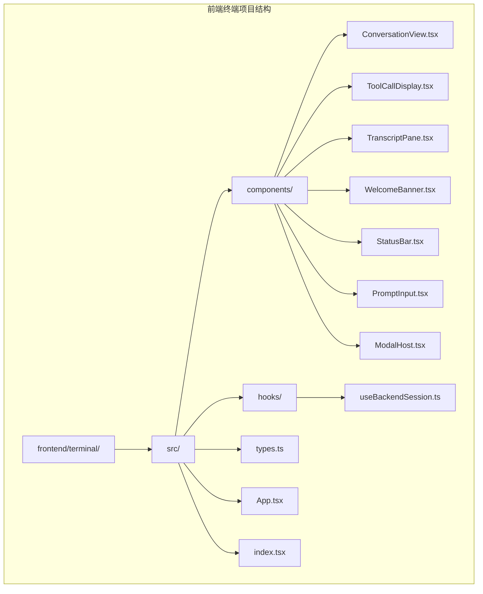

**图表来源**
- [App.tsx:1-400](file://frontend/terminal/src/App.tsx#L1-L400)
- [index.tsx:1-10](file://frontend/terminal/src/index.tsx#L1-L10)

**章节来源**
- [App.tsx:1-400](file://frontend/terminal/src/App.tsx#L1-L400)
- [index.tsx:1-10](file://frontend/terminal/src/index.tsx#L1-L10)

## 核心组件

会话视图组件由多个相互协作的组件构成，每个组件都有特定的功能职责：

### 主要组件职责

1. **ConversationView**: 核心会话渲染组件，负责消息列表的显示和布局
2. **ToolCallDisplay**: 工具调用的专门显示组件，提供工具调用的可视化表示
3. **useBackendSession**: 后端会话管理钩子，处理与后端的通信和状态管理
4. **TranscriptPane**: 转录面板组件，提供另一种会话视图的替代方案
5. **WelcomeBanner**: 欢迎横幅组件，首次启动时显示项目信息

### 数据类型定义

组件使用统一的类型定义确保类型安全：

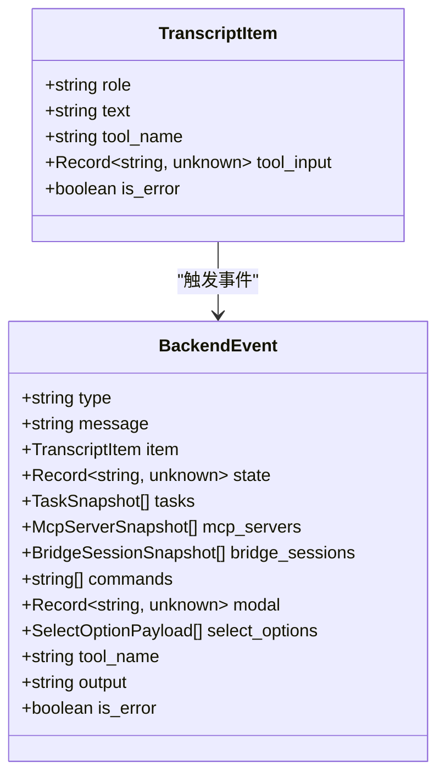

**图表来源**
- [types.ts:6-63](file://frontend/terminal/src/types.ts#L6-L63)

**章节来源**
- [types.ts:1-63](file://frontend/terminal/src/types.ts#L1-L63)

## 架构概览

会话视图组件采用分层架构设计，实现了清晰的关注点分离：

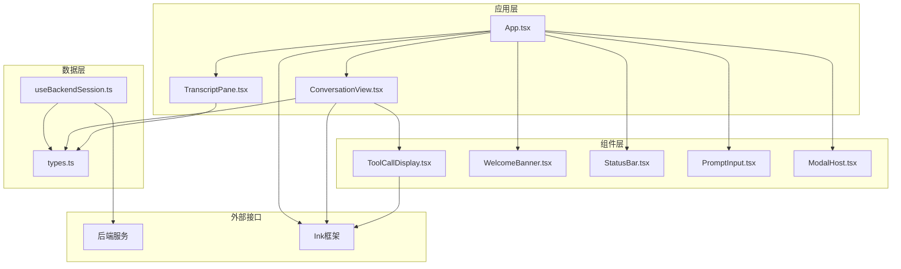

**图表来源**
- [App.tsx:39-399](file://frontend/terminal/src/App.tsx#L39-L399)
- [useBackendSession.ts:17-172](file://frontend/terminal/src/hooks/useBackendSession.ts#L17-L172)

该架构实现了以下关键特性：
- **组件解耦**: 每个组件职责单一，便于维护和测试
- **状态管理**: 使用 React hooks 进行状态管理，避免全局状态污染
- **事件驱动**: 基于后端事件驱动的更新机制
- **类型安全**: 完整的 TypeScript 类型定义确保编译时检查

## 详细组件分析

### ConversationView 组件

ConversationView 是会话视图的核心组件，负责渲染完整的对话历史：

#### 核心功能实现

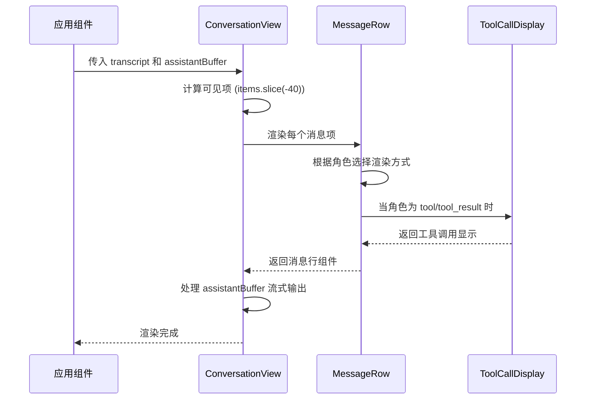

**图表来源**
- [ConversationView.tsx:8-36](file://frontend/terminal/src/components/ConversationView.tsx#L8-L36)
- [ConversationView.tsx:38-88](file://frontend/terminal/src/components/ConversationView.tsx#L38-L88)

#### 消息类型渲染逻辑

组件支持六种不同的消息类型，每种类型都有独特的视觉表现：

| 消息类型 | 角色值 | 视觉特征 | 用途 |
|---------|--------|----------|------|
| 用户消息 | 'user' | 白色粗体 '>' 前缀 | 用户输入内容 |
| 助手回复 | 'assistant' | 绿色粗体 '▶' 符号 | AI 助手回复 |
| 工具调用 | 'tool' | 青色粗体 '▼' 符号 | 工具执行开始 |
| 工具结果 | 'tool_result' | 缩进的多行文本 | 工具执行结果 |
| 系统消息 | 'system' | 黄色 'ℹ' 符号 | 系统通知和状态 |
| 日志消息 | 'log' | 淡色文本 | 后端日志输出 |

#### 流式输出处理

组件实现了智能的流式输出处理机制：

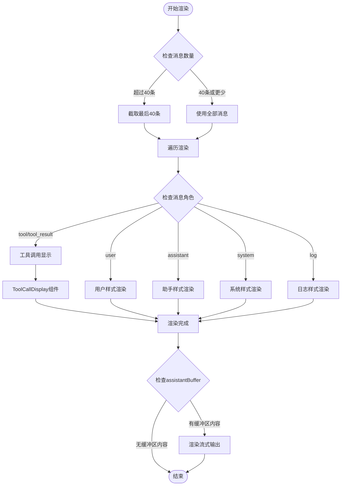

**图表来源**
- [ConversationView.tsx:17-36](file://frontend/terminal/src/components/ConversationView.tsx#L17-L36)
- [ConversationView.tsx:38-88](file://frontend/terminal/src/components/ConversationView.tsx#L38-L88)

**章节来源**
- [ConversationView.tsx:1-89](file://frontend/terminal/src/components/ConversationView.tsx#L1-L89)

### ToolCallDisplay 组件

ToolCallDisplay 专门处理工具调用和结果的显示：

#### 工具调用摘要生成

组件实现了智能的工具调用摘要生成功能：

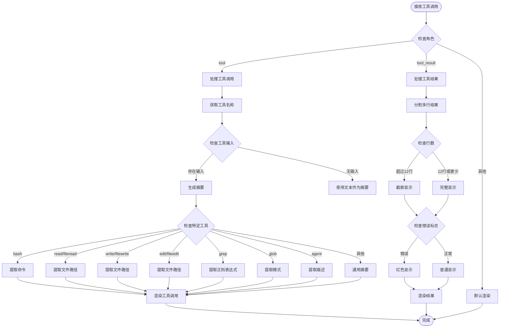

**图表来源**
- [ToolCallDisplay.tsx:6-38](file://frontend/terminal/src/components/ToolCallDisplay.tsx#L6-L38)
- [ToolCallDisplay.tsx:40-74](file://frontend/terminal/src/components/ToolCallDisplay.tsx#L40-L74)

#### 特定工具的智能摘要

组件针对常见工具提供了专门的摘要生成逻辑：

| 工具名称 | 摘要规则 | 示例输出 |
|---------|---------|---------|
| bash | 显示命令内容，限制长度 | `ls -la /home/user` |
| read/fileread | 显示文件路径 | `/etc/passwd` |
| write/filewrite | 显示文件路径 | `README.md` |
| edit/fileedit | 显示文件路径 | `config.json` |
| grep | 显示正则表达式 | `/pattern/i` |
| glob | 显示匹配模式 | `*.txt` |
| agent | 显示任务描述 | `数据分析任务` |
| 其他工具 | 显示第一个键值对 | `param=value` |

**章节来源**
- [ToolCallDisplay.tsx:1-74](file://frontend/terminal/src/components/ToolCallDisplay.tsx#L1-L74)

### useBackendSession Hook

useBackendSession 是会话状态管理的核心钩子，负责与后端服务的通信和状态同步：

#### 事件处理机制

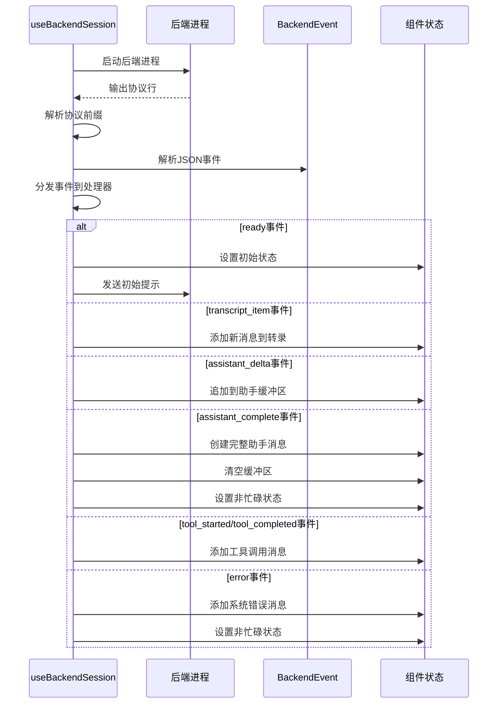

**图表来源**
- [useBackendSession.ts:71-150](file://frontend/terminal/src/hooks/useBackendSession.ts#L71-L150)

#### 状态管理策略

Hook 实现了全面的状态管理机制：

| 状态类型 | 管理字段 | 更新时机 | 用途 |
|---------|---------|---------|------|
| 会话历史 | transcript | 新消息到达时 | 存储完整对话历史 |
| 流式输出 | assistantBuffer | 接收增量输出时 | 实时显示助手回复 |
| 系统状态 | status | ready/state_snapshot事件 | 显示模型、令牌等状态 |
| 任务列表 | tasks | tasks_snapshot事件 | 管理后台任务 |
| 命令列表 | commands | ready事件 | 提供命令补全 |
| MCP服务器 | mcpServers | ready/state_snapshot事件 | 管理MCP连接 |
| 桥接会话 | bridgeSessions | ready/state_snapshot事件 | 管理桥接会话 |
| 模态框 | modal | modal_request事件 | 处理权限确认等 |
| 选择请求 | selectRequest | select_request事件 | 处理交互式选择 |
| 忙碌状态 | busy | 事件转换时 | 控制输入禁用 |

**章节来源**
- [useBackendSession.ts:17-172](file://frontend/terminal/src/hooks/useBackendSession.ts#L17-L172)

### TranscriptPane 组件

TranscriptPane 提供了另一种会话视图的替代方案，具有不同的布局和样式：

#### 布局特点

组件采用了固定宽度和边框的设计：

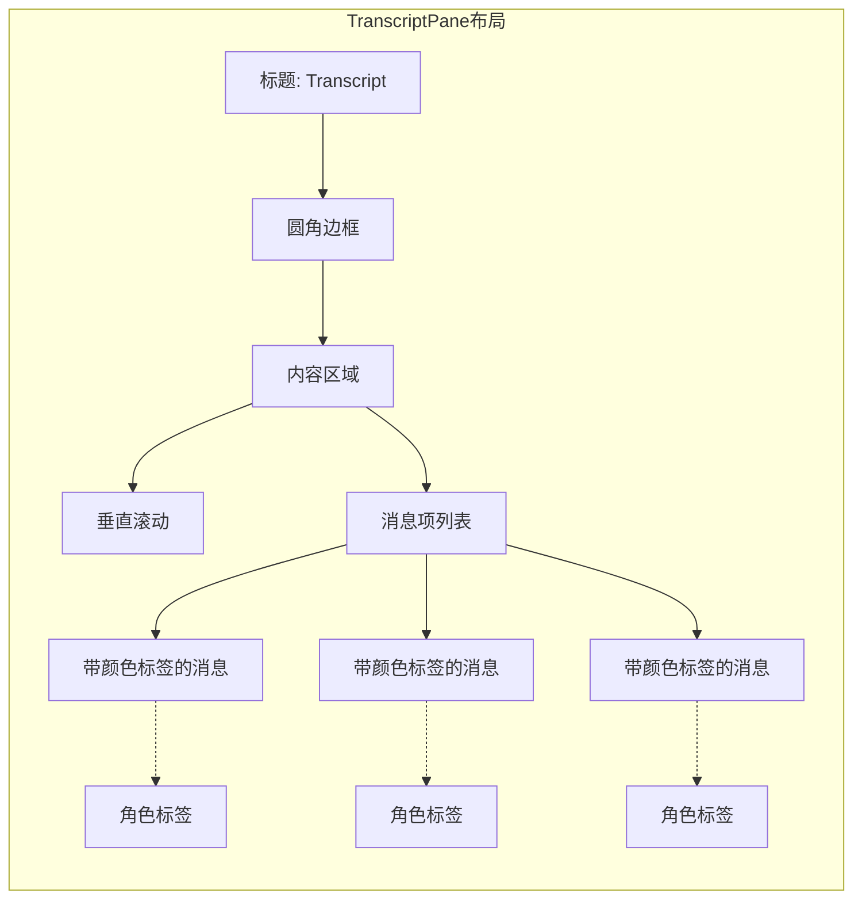

**图表来源**
- [TranscriptPane.tsx:12-26](file://frontend/terminal/src/components/TranscriptPane.tsx#L12-L26)

**章节来源**
- [TranscriptPane.tsx:1-58](file://frontend/terminal/src/components/TranscriptPane.tsx#L1-L58)

## 依赖关系分析

会话视图组件的依赖关系体现了清晰的层次结构：

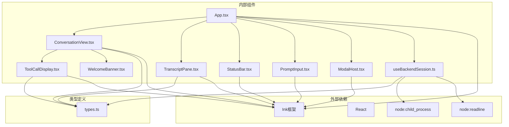

**图表来源**
- [App.tsx:1-400](file://frontend/terminal/src/App.tsx#L1-L400)
- [useBackendSession.ts:1-172](file://frontend/terminal/src/hooks/useBackendSession.ts#L1-L172)

### 关键依赖关系

1. **Ink 框架集成**: 所有 UI 组件都基于 Ink 的 Box 和 Text 组件构建
2. **React Hooks**: 使用 useState、useEffect、useMemo 等现代 React 特性
3. **Node.js 进程通信**: 通过 child_process 和 readline 实现与后端的通信
4. **类型安全**: 完整的 TypeScript 类型定义确保运行时安全

**章节来源**
- [App.tsx:1-400](file://frontend/terminal/src/App.tsx#L1-L400)
- [useBackendSession.ts:1-172](file://frontend/terminal/src/hooks/useBackendSession.ts#L1-L172)

## 性能考虑

会话视图组件在设计时充分考虑了性能优化：

### 内存管理优化

1. **消息截断策略**: ConversationView 只渲染最近的 40 条消息，防止内存无限增长
2. **状态最小化**: 使用 useMemo 优化复杂计算，避免不必要的重渲染
3. **条件渲染**: 根据状态动态决定组件渲染，减少 DOM 结构复杂度

### 渲染性能优化

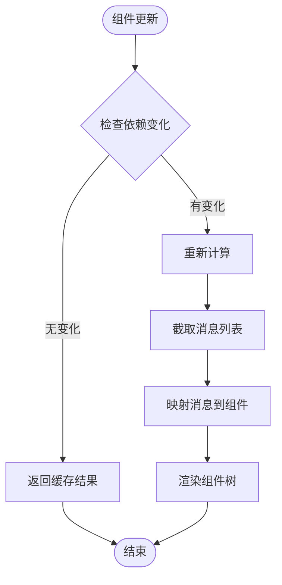

**图表来源**
- [ConversationView.tsx:17-18](file://frontend/terminal/src/components/ConversationView.tsx#L17-L18)
- [useBackendSession.ts:152-171](file://frontend/terminal/src/hooks/useBackendSession.ts#L152-L171)

### 流式输出优化

1. **增量更新**: assistantBuffer 支持增量更新，避免完整重渲染
2. **事件驱动**: 基于事件的更新机制，只在必要时触发重新渲染
3. **缓冲区管理**: 智能的缓冲区管理，平衡内存使用和用户体验

### 错误处理和恢复

组件实现了健壮的错误处理机制：

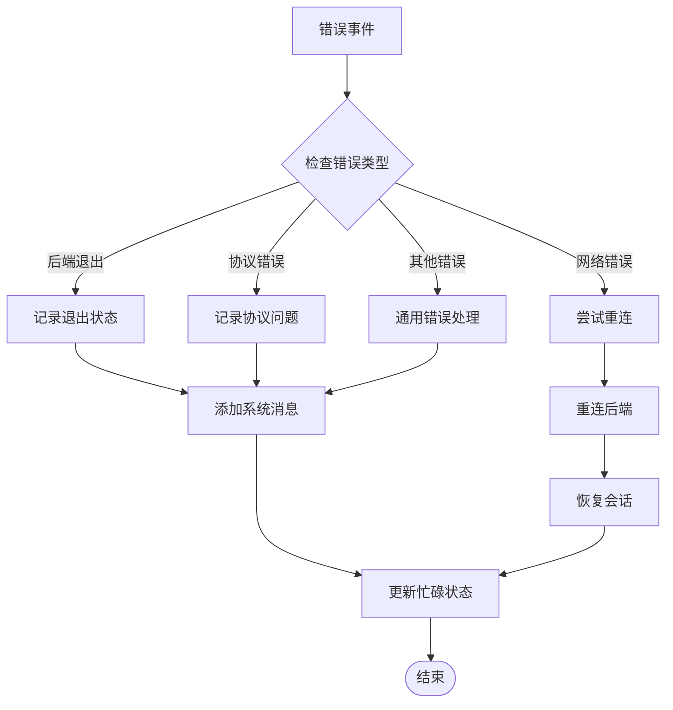

**图表来源**
- [useBackendSession.ts:57-61](file://frontend/terminal/src/hooks/useBackendSession.ts#L57-L61)
- [useBackendSession.ts:142-146](file://frontend/terminal/src/hooks/useBackendSession.ts#L142-L146)

**章节来源**
- [useBackendSession.ts:142-146](file://frontend/terminal/src/hooks/useBackendSession.ts#L142-L146)

## 故障排除指南

### 常见问题诊断

#### 会话无法启动

**症状**: 应用启动后没有响应
**可能原因**:
1. 后端进程启动失败
2. 协议解析错误
3. 配置文件格式不正确

**解决步骤**:
1. 检查后端命令配置
2. 验证协议前缀设置
3. 查看控制台错误输出

#### 消息显示异常

**症状**: 消息显示格式错误或内容缺失
**可能原因**:
1. TranscriptItem 类型不匹配
2. 角色值不在预期范围内
3. 文本编码问题

**解决步骤**:
1. 验证 TranscriptItem 的结构
2. 检查角色值的有效性
3. 确认文本编码格式

#### 流式输出卡顿

**症状**: 助手回复显示延迟或卡顿
**可能原因**:
1. assistantBuffer 过大
2. 事件处理阻塞
3. 渲染性能问题

**解决步骤**:
1. 检查 assistantBuffer 的大小
2. 优化事件处理逻辑
3. 实施虚拟滚动

### 调试技巧

1. **启用详细日志**: 在开发环境中查看后端日志输出
2. **监控状态变化**: 使用 React DevTools 检查组件状态
3. **验证事件序列**: 确保事件按正确的顺序处理

**章节来源**
- [useBackendSession.ts:47-55](file://frontend/terminal/src/hooks/useBackendSession.ts#L47-L55)

## 结论

会话视图组件展现了现代 React 应用的最佳实践，通过精心设计的架构和实现细节，提供了优秀的用户体验和开发体验。

### 主要成就

1. **模块化设计**: 清晰的组件分离和职责划分
2. **类型安全**: 完整的 TypeScript 类型系统
3. **性能优化**: 智能的内存管理和渲染优化
4. **错误处理**: 健壮的错误处理和恢复机制
5. **可扩展性**: 灵活的架构支持未来功能扩展

### 技术亮点

- **事件驱动架构**: 基于后端事件的实时更新机制
- **智能摘要生成**: 针对工具调用的智能化显示
- **流式输出处理**: 平滑的增量内容显示
- **多消息类型支持**: 完整的消息类型体系
- **响应式设计**: 适配不同终端尺寸的布局

该组件为 OpenHarness 项目提供了坚实的基础，展示了如何在终端环境中实现复杂的交互式界面。其设计原则和实现模式可以作为其他类似项目的参考模板。