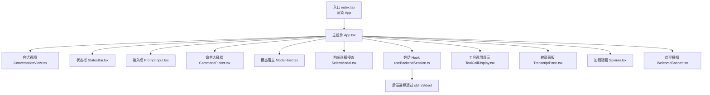
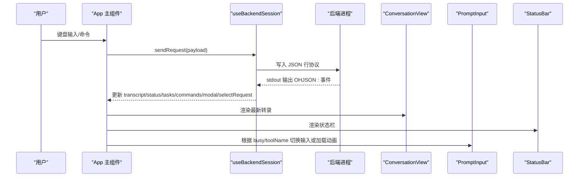
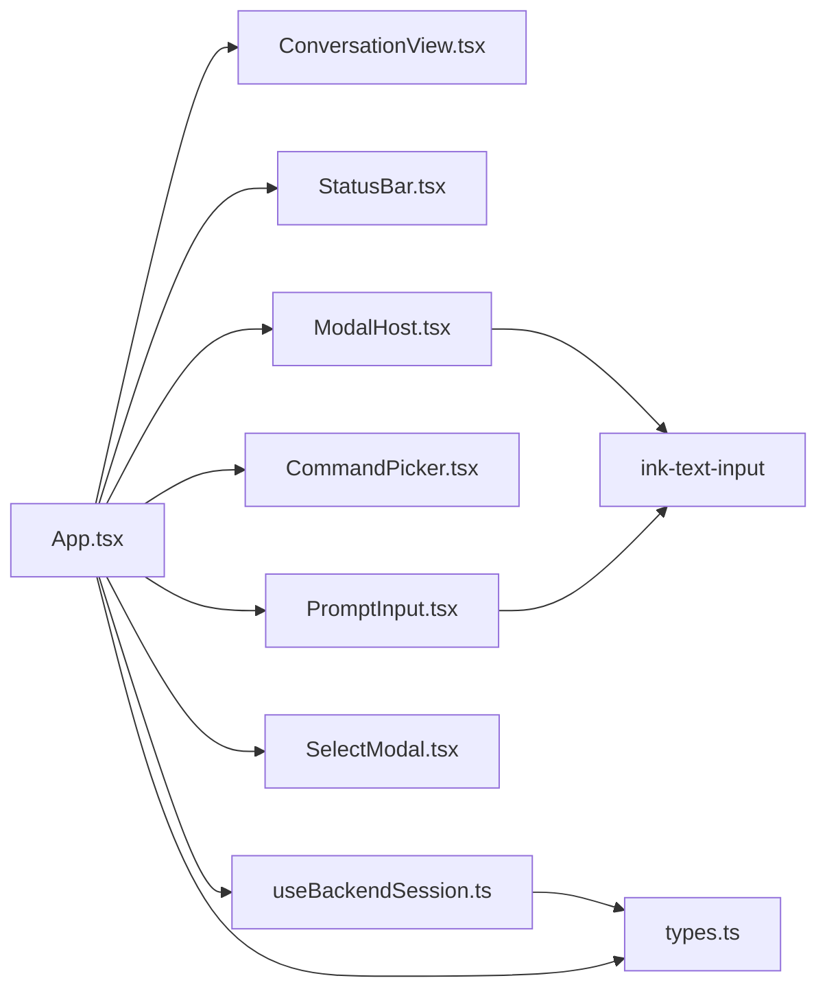
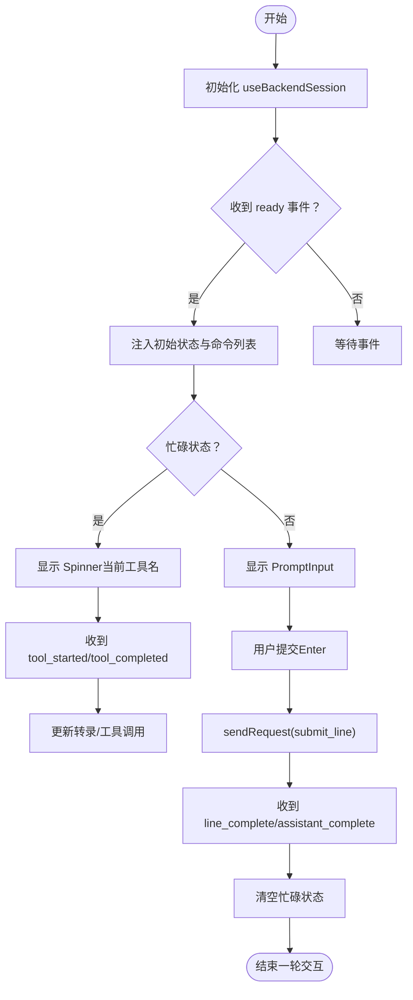
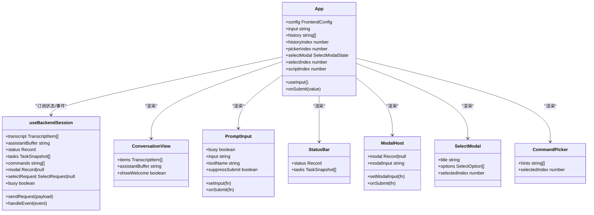

# 前端组件架构

<cite>
**本文引用的文件**
- [frontend/terminal/src/App.tsx](file://frontend/terminal/src/App.tsx)
- [frontend/terminal/src/index.tsx](file://frontend/terminal/src/index.tsx)
- [frontend/terminal/src/types.ts](file://frontend/terminal/src/types.ts)
- [frontend/terminal/package.json](file://frontend/terminal/package.json)
- [frontend/terminal/src/hooks/useBackendSession.ts](file://frontend/terminal/src/hooks/useBackendSession.ts)
- [frontend/terminal/src/components/CommandPicker.tsx](file://frontend/terminal/src/components/CommandPicker.tsx)
- [frontend/terminal/src/components/ConversationView.tsx](file://frontend/terminal/src/components/ConversationView.tsx)
- [frontend/terminal/src/components/PromptInput.tsx](file://frontend/terminal/src/components/PromptInput.tsx)
- [frontend/terminal/src/components/StatusBar.tsx](file://frontend/terminal/src/components/StatusBar.tsx)
- [frontend/terminal/src/components/ModalHost.tsx](file://frontend/terminal/src/components/ModalHost.tsx)
- [frontend/terminal/src/components/SelectModal.tsx](file://frontend/terminal/src/components/SelectModal.tsx)
- [frontend/terminal/src/components/ToolCallDisplay.tsx](file://frontend/terminal/src/components/ToolCallDisplay.tsx)
- [frontend/terminal/src/components/TranscriptPane.tsx](file://frontend/terminal/src/components/TranscriptPane.tsx)
- [frontend/terminal/src/components/Spinner.tsx](file://frontend/terminal/src/components/Spinner.tsx)
- [frontend/terminal/src/components/WelcomeBanner.tsx](file://frontend/terminal/src/components/WelcomeBanner.tsx)
</cite>

## 目录
1. [简介](#简介)
2. [项目结构](#项目结构)
3. [核心组件](#核心组件)
4. [架构总览](#架构总览)
5. [详细组件分析](#详细组件分析)
6. [依赖关系分析](#依赖关系分析)
7. [性能考量](#性能考量)
8. [故障排查指南](#故障排查指南)
9. [结论](#结论)
10. [附录](#附录)

## 简介
本文件系统化梳理 OpenHarness 前端终端 UI 的组件架构与设计理念，重点围绕 React/Ink 生态下的组件组织方式，解释 App 主组件如何协调各子组件完成命令选择、会话展示、输入处理、状态栏显示与模态交互等功能。文档同时阐述组件间通信机制（事件驱动与状态共享）、状态管理模式（集中式会话状态）、可复用性与扩展性设计，并提供使用示例与自定义指南，帮助开发者快速理解与修改前端界面。

## 项目结构
前端位于 terminal 子包中，采用 React/Ink 构建终端 TUI 应用，入口通过 Ink 的 render 渲染 App 根组件。类型定义集中在 types.ts 中，会话状态通过自定义 Hook useBackendSession 管理并与后端进程进行协议化通信。

图表来源
- [frontend/terminal/src/index.tsx:1-10](file://frontend/terminal/src/index.tsx#L1-L10)
- [frontend/terminal/src/App.tsx:1-400](file://frontend/terminal/src/App.tsx#L1-L400)
- [frontend/terminal/src/hooks/useBackendSession.ts:1-172](file://frontend/terminal/src/hooks/useBackendSession.ts#L1-L172)

章节来源
- [frontend/terminal/src/index.tsx:1-10](file://frontend/terminal/src/index.tsx#L1-L10)
- [frontend/terminal/src/App.tsx:1-400](file://frontend/terminal/src/App.tsx#L1-L400)
- [frontend/terminal/src/types.ts:1-63](file://frontend/terminal/src/types.ts#L1-L63)

## 核心组件
- App 主组件：负责全局状态管理、键盘输入处理、脚本自动化、命令拦截与交互式模态触发，并协调渲染 ConversationView、StatusBar、PromptInput、CommandPicker、ModalHost、SelectModal 等子组件。
- ConversationView：渲染对话转录（支持滚动可见窗口、欢迎横幅、助手增量输出缓冲区）。
- PromptInput：在非忙碌状态下提供文本输入；忙碌时以 Spinner 展示当前运行工具名称。
- StatusBar：展示模型、令牌用量、权限模式、任务数、MCP 连接数等状态信息。
- ModalHost：处理后端发起的权限确认、问题问答、MCP 认证等模态请求。
- SelectModal：处理前端发起的选择型交互（如权限模式选择）。
- CommandPicker：基于输入前缀提示命令补全列表，支持上下导航与回车选择。
- 工具调用展示 ToolCallDisplay：美化展示工具调用与结果，含输入摘要与错误高亮。
- 会话 Hook useBackendSession：封装与后端进程的协议通信、事件解析、状态快照与请求发送。

章节来源
- [frontend/terminal/src/App.tsx:1-400](file://frontend/terminal/src/App.tsx#L1-L400)
- [frontend/terminal/src/components/ConversationView.tsx:1-89](file://frontend/terminal/src/components/ConversationView.tsx#L1-L89)
- [frontend/terminal/src/components/PromptInput.tsx:1-39](file://frontend/terminal/src/components/PromptInput.tsx#L1-L39)
- [frontend/terminal/src/components/StatusBar.tsx:1-54](file://frontend/terminal/src/components/StatusBar.tsx#L1-L54)
- [frontend/terminal/src/components/ModalHost.tsx:1-71](file://frontend/terminal/src/components/ModalHost.tsx#L1-L71)
- [frontend/terminal/src/components/SelectModal.tsx:1-45](file://frontend/terminal/src/components/SelectModal.tsx#L1-L45)
- [frontend/terminal/src/components/CommandPicker.tsx:1-34](file://frontend/terminal/src/components/CommandPicker.tsx#L1-L34)
- [frontend/terminal/src/components/ToolCallDisplay.tsx:1-74](file://frontend/terminal/src/components/ToolCallDisplay.tsx#L1-L74)
- [frontend/terminal/src/hooks/useBackendSession.ts:1-172](file://frontend/terminal/src/hooks/useBackendSession.ts#L1-L172)

## 架构总览
整体采用“主组件协调 + Hook 驱动状态 + Ink 终端渲染”的架构。App 作为协调者，通过 useBackendSession 提供统一的会话状态与事件处理能力；各 UI 组件只关注自身职责，通过 props 与回调进行解耦。

图表来源
- [frontend/terminal/src/App.tsx:149-318](file://frontend/terminal/src/App.tsx#L149-L318)
- [frontend/terminal/src/hooks/useBackendSession.ts:31-150](file://frontend/terminal/src/hooks/useBackendSession.ts#L31-L150)

## 详细组件分析

### App 主组件（协调器）
- 职责
  - 维护输入、历史、脚本索引、命令选择器索引、前端选择模态状态等本地状态。
  - 处理键盘输入（命令补全、历史导航、提交、快捷键等），并拦截特殊命令（权限模式切换、计划模式、会话恢复等）。
  - 协调渲染：会话视图、状态栏、输入框、命令选择器、后端模态、前端选择模态。
  - 集成 useBackendSession 提供的会话状态与事件处理。
- 关键行为
  - 命令提示：当输入以“/”开头且未处于忙碌/模态/选择状态时，显示命令补全列表。
  - 选择模态：后端请求选择时，自动弹出前端选择模态，支持上下导航与数字键快速选择。
  - 特殊命令：对 /permissions、/plan、/resume 等命令进行前端交互式处理。
  - 自动化脚本：根据环境变量读取脚本步骤，按序自动提交。
- 设计要点
  - 将“输入处理”和“渲染控制”分离，保持组件职责单一。
  - 使用 useMemo 缓存计算值，减少不必要的重渲染。
  - 通过 setSelectRequest 与 session.selectRequest 实现后端驱动的前端模态联动。

章节来源
- [frontend/terminal/src/App.tsx:13-49](file://frontend/terminal/src/App.tsx#L13-L49)
- [frontend/terminal/src/App.tsx:66-78](file://frontend/terminal/src/App.tsx#L66-L78)
- [frontend/terminal/src/App.tsx:104-147](file://frontend/terminal/src/App.tsx#L104-L147)
- [frontend/terminal/src/App.tsx:149-290](file://frontend/terminal/src/App.tsx#L149-L290)
- [frontend/terminal/src/App.tsx:292-318](file://frontend/terminal/src/App.tsx#L292-L318)
- [frontend/terminal/src/App.tsx:320-334](file://frontend/terminal/src/App.tsx#L320-L334)
- [frontend/terminal/src/App.tsx:336-398](file://frontend/terminal/src/App.tsx#L336-L398)

### ConversationView（会话视图）
- 职责：渲染对话转录，支持欢迎横幅、最近消息截断、助手增量输出缓冲区。
- 数据流：接收 transcript 与 assistantBuffer，内部仅负责展示。
- 扩展点：可通过外部传入 showWelcome 控制是否显示欢迎横幅；消息行根据角色渲染不同样式与图标。

章节来源
- [frontend/terminal/src/components/ConversationView.tsx:8-36](file://frontend/terminal/src/components/ConversationView.tsx#L8-L36)
- [frontend/terminal/src/components/ConversationView.tsx:38-88](file://frontend/terminal/src/components/ConversationView.tsx#L38-L88)
- [frontend/terminal/src/components/WelcomeBanner.tsx:1-44](file://frontend/terminal/src/components/WelcomeBanner.tsx#L1-L44)

### PromptInput（输入框）
- 职责：提供用户输入；在忙碌时以 Spinner 显示当前工具名。
- 交互：支持回车提交；在命令选择器显示时抑制直接提交。
- 可复用性：通过 props 注入 busy、input、setInput、onSubmit、toolName、suppressSubmit，便于在不同场景复用。

章节来源
- [frontend/terminal/src/components/PromptInput.tsx:9-38](file://frontend/terminal/src/components/PromptInput.tsx#L9-L38)
- [frontend/terminal/src/components/Spinner.tsx:16-42](file://frontend/terminal/src/components/Spinner.tsx#L16-L42)

### StatusBar（状态栏）
- 职责：展示模型、令牌用量、权限模式、任务数、MCP 连接数等。
- 格式化：数字以千位分隔格式化显示；无数据时隐藏对应段落。
- 可扩展：新增指标只需在状态对象中添加字段并在渲染中引用。

章节来源
- [frontend/terminal/src/components/StatusBar.tsx:8-45](file://frontend/terminal/src/components/StatusBar.tsx#L8-L45)

### ModalHost（后端模态）
- 职责：渲染后端发起的模态请求（权限确认、问题问答、MCP 认证）。
- 交互：针对不同 kind 渲染不同内容与输入控件；提交后清除模态并更新会话状态。

章节来源
- [frontend/terminal/src/components/ModalHost.tsx:5-70](file://frontend/terminal/src/components/ModalHost.tsx#L5-L70)

### SelectModal（前端选择模态）
- 职责：渲染前端发起的选择请求（如权限模式选择），支持上下导航与回车确认。
- 交互：支持数字键快速选择；选中项高亮并显示当前状态标记。

章节来源
- [frontend/terminal/src/components/SelectModal.tsx:11-44](file://frontend/terminal/src/components/SelectModal.tsx#L11-L44)

### CommandPicker（命令选择器）
- 职责：根据输入前缀过滤可用命令并提供上下导航与选择。
- 交互：Tab 补全、Esc 取消、Enter 选择；与 App 的输入处理协同工作。

章节来源
- [frontend/terminal/src/components/CommandPicker.tsx:4-33](file://frontend/terminal/src/components/CommandPicker.tsx#L4-L33)

### ToolCallDisplay（工具调用展示）
- 职责：美化展示工具调用与结果，包含输入摘要与错误高亮。
- 策略：针对常见工具（bash、read/write/edit/grep/glob/agent 等）生成简要摘要，其余场景展示首项键值对。

章节来源
- [frontend/terminal/src/components/ToolCallDisplay.tsx:6-38](file://frontend/terminal/src/components/ToolCallDisplay.tsx#L6-L38)
- [frontend/terminal/src/components/ToolCallDisplay.tsx:40-73](file://frontend/terminal/src/components/ToolCallDisplay.tsx#L40-L73)

### TranscriptPane（转录面板）
- 职责：在侧边栏布局中展示转录片段，配合颜色与标签区分角色。
- 适用场景：与 SidePanel 结合形成双栏布局（转录面板 + 侧边栏）。

章节来源
- [frontend/terminal/src/components/TranscriptPane.tsx:6-57](file://frontend/terminal/src/components/TranscriptPane.tsx#L6-L57)

### 入口与类型系统
- 入口：index.tsx 从环境变量读取前端配置并渲染 App。
- 类型：FrontendConfig、TranscriptItem、TaskSnapshot、McpServerSnapshot、BridgeSessionSnapshot、SelectOptionPayload、BackendEvent 等统一定义，确保前后端契约清晰。

章节来源
- [frontend/terminal/src/index.tsx:7-9](file://frontend/terminal/src/index.tsx#L7-L9)
- [frontend/terminal/src/types.ts:1-63](file://frontend/terminal/src/types.ts#L1-L63)

## 依赖关系分析
- 组件依赖
  - App 依赖所有子组件与其共同使用的类型与 Hook。
  - 子组件之间低耦合，通过 props 传递数据与回调。
  - ModalHost 与 SelectModal 互斥出现，均由 App 的会话状态控制。
- 外部依赖
  - Ink/React：提供终端渲染与组件生态。
  - ink-text-input：提供终端文本输入组件。
  - 后端进程：通过标准输出以协议行传输事件，标准输入接收请求。

图表来源
- [frontend/terminal/src/App.tsx:336-398](file://frontend/terminal/src/App.tsx#L336-L398)
- [frontend/terminal/src/hooks/useBackendSession.ts:152-170](file://frontend/terminal/src/hooks/useBackendSession.ts#L152-L170)
- [frontend/terminal/package.json:8-12](file://frontend/terminal/package.json#L8-L12)

章节来源
- [frontend/terminal/src/App.tsx:336-398](file://frontend/terminal/src/App.tsx#L336-L398)
- [frontend/terminal/src/hooks/useBackendSession.ts:152-170](file://frontend/terminal/src/hooks/useBackendSession.ts#L152-L170)
- [frontend/terminal/package.json:8-12](file://frontend/terminal/package.json#L8-L12)

## 性能考量
- 渲染优化
  - ConversationView 仅渲染最近若干条消息，避免长对话导致的重排压力。
  - PromptInput 在忙碌时切换为轻量 Spinner，降低输入渲染开销。
- 状态缓存
  - App 使用 useMemo 缓存计算值（如命令提示、当前工具名），减少不必要重渲染。
- 事件处理
  - useBackendSession 对 stdout 逐行解析，避免阻塞主线程；在 ready 时一次性注入初始状态。
- I/O 效率
  - 通过协议行（OHJSON:）与后端通信，减少解析成本；stdin 写入采用单行 JSON 字符串。

章节来源
- [frontend/terminal/src/components/ConversationView.tsx:17-18](file://frontend/terminal/src/components/ConversationView.tsx#L17-L18)
- [frontend/terminal/src/App.tsx:52-63](file://frontend/terminal/src/App.tsx#L52-L63)
- [frontend/terminal/src/hooks/useBackendSession.ts:47-55](file://frontend/terminal/src/hooks/useBackendSession.ts#L47-L55)

## 故障排查指南
- 后端无响应
  - 现象：屏幕无日志、状态栏不变。
  - 排查：检查后端命令是否正确、进程是否存活；查看 stdout 是否输出协议行。
- 输入无法提交
  - 现象：回车无反应。
  - 排查：确认 App 未处于 busy 或 modal/selectModal 状态；检查 CommandPicker 是否覆盖了提交区域。
- 权限确认未生效
  - 现象：权限模式未切换。
  - 排查：确认 /permissions 命令被正确拦截并发送 set 请求；核对后端返回的状态变更。
- 选择模态卡住
  - 现象：前端选择模态不消失。
  - 排查：确认 onSelect 回调已调用并设置 selectModal 为空；检查后端是否正确返回 select_request 结束信号。
- 令牌统计异常
  - 现象：状态栏令牌数不更新。
  - 排查：确认后端事件类型为 state_snapshot/transcript_item/assistant_complete 等；检查数值字段是否为数字类型。

章节来源
- [frontend/terminal/src/App.tsx:149-290](file://frontend/terminal/src/App.tsx#L149-L290)
- [frontend/terminal/src/hooks/useBackendSession.ts:71-150](file://frontend/terminal/src/hooks/useBackendSession.ts#L71-L150)

## 结论
该前端架构以 App 为中心，通过 useBackendSession 将事件驱动与状态管理解耦，使各 UI 组件职责清晰、易于维护与扩展。命令选择、会话展示、输入处理、状态栏与模态交互均通过统一的数据流与事件协议实现，具备良好的可复用性与可定制性。建议在新增功能时遵循现有模式：通过 Hook 抽象状态与事件，通过 props 下发数据与回调，避免跨组件直接共享复杂状态。

## 附录

### 组件通信与状态管理流程

图表来源
- [frontend/terminal/src/hooks/useBackendSession.ts:71-150](file://frontend/terminal/src/hooks/useBackendSession.ts#L71-L150)
- [frontend/terminal/src/App.tsx:292-318](file://frontend/terminal/src/App.tsx#L292-L318)

### 组件类图（代码级）

图表来源
- [frontend/terminal/src/App.tsx:39-49](file://frontend/terminal/src/App.tsx#L39-L49)
- [frontend/terminal/src/hooks/useBackendSession.ts:17-27](file://frontend/terminal/src/hooks/useBackendSession.ts#L17-L27)
- [frontend/terminal/src/components/ConversationView.tsx:8-16](file://frontend/terminal/src/components/ConversationView.tsx#L8-L16)
- [frontend/terminal/src/components/PromptInput.tsx:9-23](file://frontend/terminal/src/components/PromptInput.tsx#L9-L23)
- [frontend/terminal/src/components/StatusBar.tsx:8-11](file://frontend/terminal/src/components/StatusBar.tsx#L8-L11)
- [frontend/terminal/src/components/ModalHost.tsx:5-15](file://frontend/terminal/src/components/ModalHost.tsx#L5-L15)
- [frontend/terminal/src/components/SelectModal.tsx:11-19](file://frontend/terminal/src/components/SelectModal.tsx#L11-L19)
- [frontend/terminal/src/components/CommandPicker.tsx:4-10](file://frontend/terminal/src/components/CommandPicker.tsx#L4-L10)

### 使用示例与自定义指南
- 自定义命令
  - 在后端注册新命令后，App 会在 ready 事件中接收 commands 列表；CommandPicker 会自动过滤显示匹配前缀的命令。
- 新增状态字段
  - 在后端事件中添加新的状态字段；在 StatusBar 中读取并渲染；在 useBackendSession 中同步到状态对象。
- 替换输入组件
  - 保持 onSubmit/setInput 接口一致即可替换为自定义输入组件；注意在 busy 状态下切换为只读或加载态。
- 新增模态类型
  - 在后端事件中增加 modal.kind 并在 ModalHost 中新增分支渲染；在 App 中处理相应交互逻辑。
- 扩展工具摘要
  - 在 ToolCallDisplay 的输入摘要函数中新增工具分支，提升工具调用展示的可读性。

章节来源
- [frontend/terminal/src/App.tsx:66-72](file://frontend/terminal/src/App.tsx#L66-L72)
- [frontend/terminal/src/hooks/useBackendSession.ts:71-150](file://frontend/terminal/src/hooks/useBackendSession.ts#L71-L150)
- [frontend/terminal/src/components/ToolCallDisplay.tsx:40-73](file://frontend/terminal/src/components/ToolCallDisplay.tsx#L40-L73)
- [frontend/terminal/src/components/StatusBar.tsx:8-45](file://frontend/terminal/src/components/StatusBar.tsx#L8-L45)