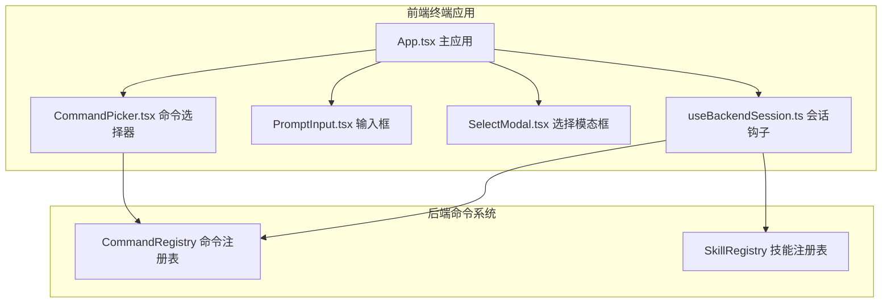
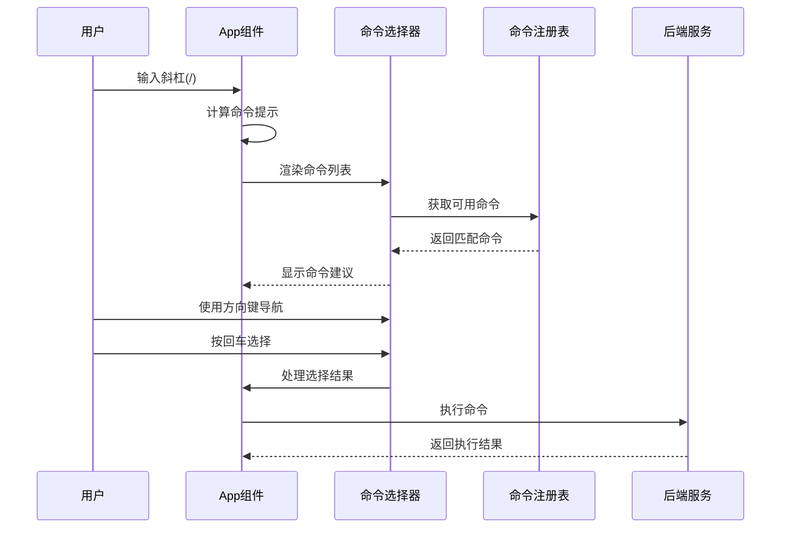
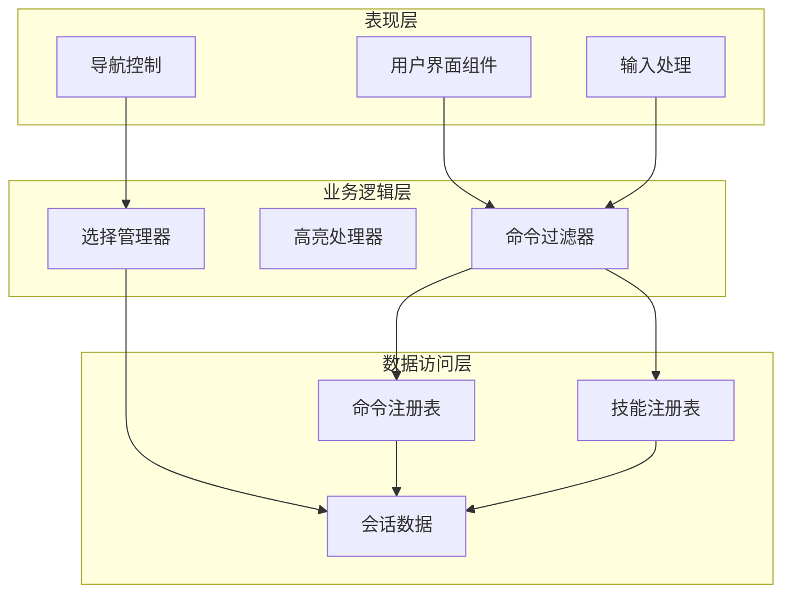
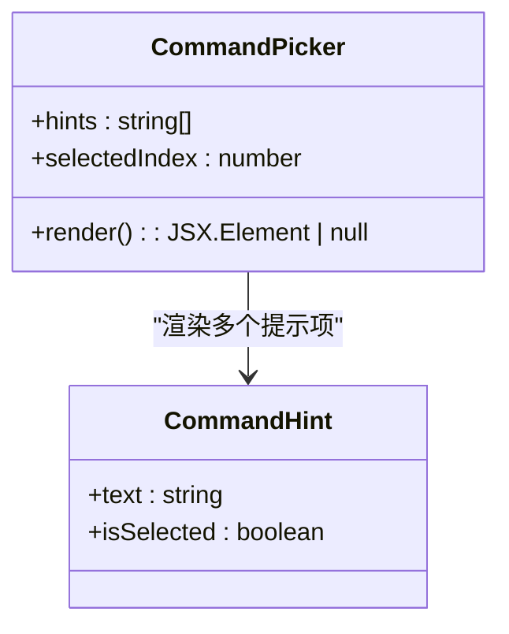
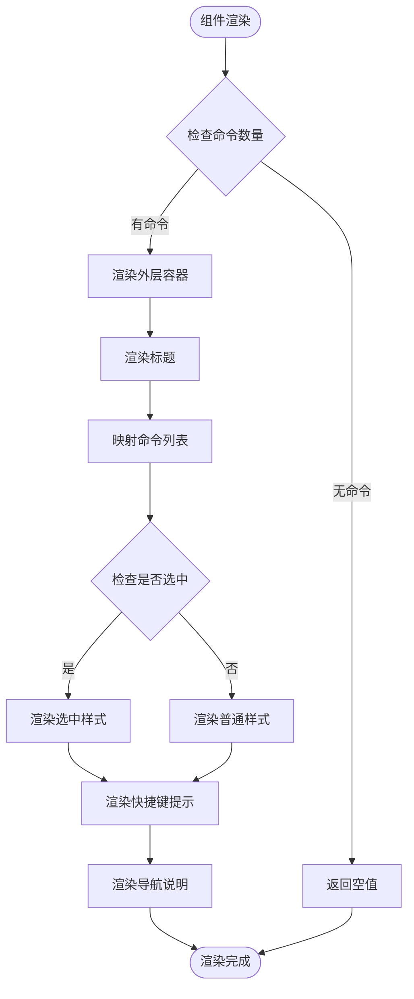
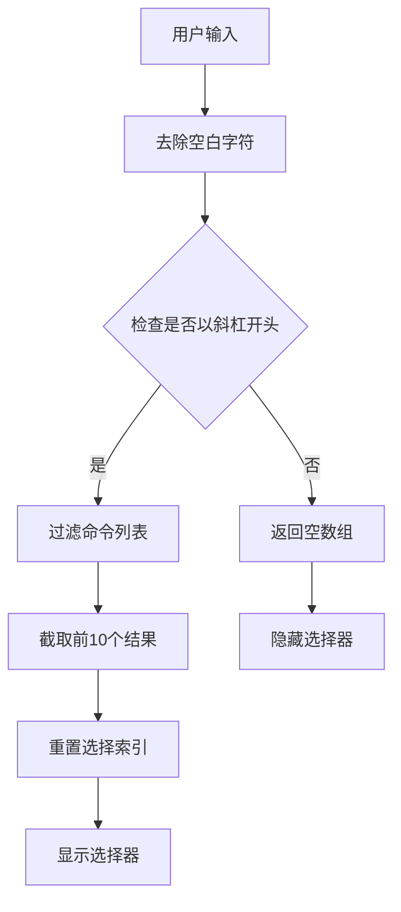
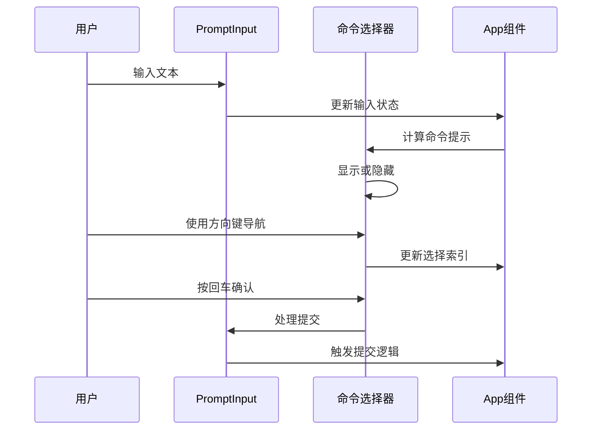
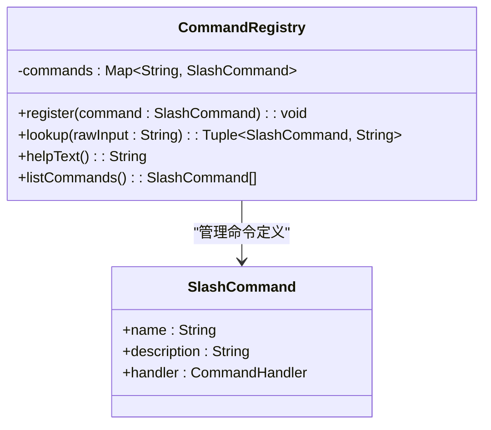
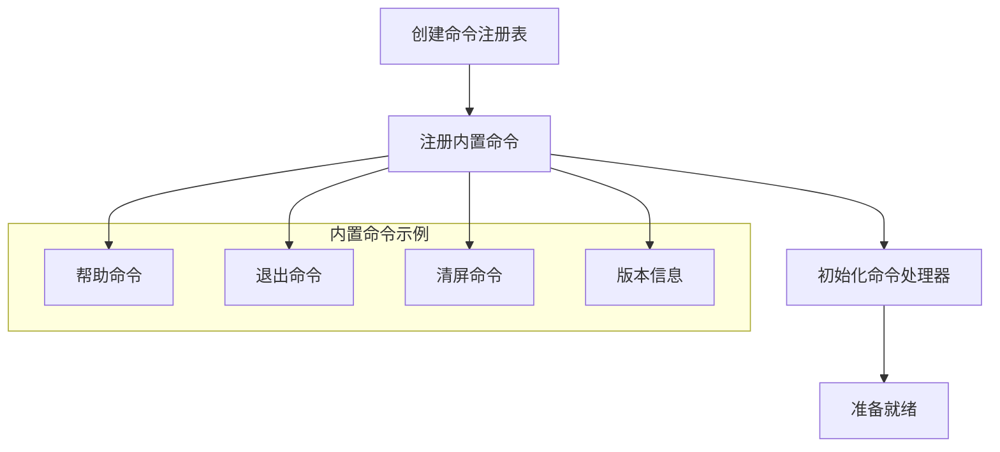
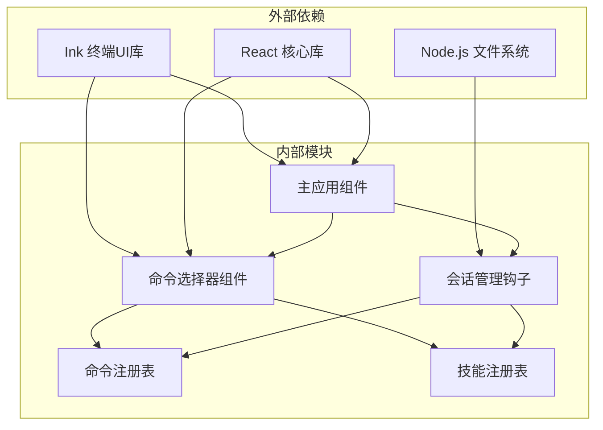

# 命令选择器组件

<cite>
**本文档引用的文件**
- [CommandPicker.tsx](file://frontend/terminal/src/components/CommandPicker.tsx)
- [PromptInput.tsx](file://frontend/terminal/src/components/PromptInput.tsx)
- [App.tsx](file://frontend/terminal/src/App.tsx)
- [SelectModal.tsx](file://frontend/terminal/src/components/SelectModal.tsx)
- [useBackendSession.ts](file://frontend/terminal/src/hooks/useBackendSession.ts)
- [registry.py](file://src/openharness/commands/registry.py)
- [registry.py](file://src/openharness/skills/registry.py)
</cite>

## 目录
1. [简介](#简介)
2. [项目结构](#项目结构)
3. [核心组件](#核心组件)
4. [架构概览](#架构概览)
5. [详细组件分析](#详细组件分析)
6. [依赖关系分析](#依赖关系分析)
7. [性能考虑](#性能考虑)
8. [故障排除指南](#故障排除指南)
9. [结论](#结论)

## 简介

命令选择器组件是 OpenHarness 终端界面中的一个关键交互元素，它为用户提供了一个智能的命令自动完成功能。该组件实现了完整的命令过滤、高亮显示、键盘导航等特性，为用户提供了流畅的命令输入体验。

该组件的核心价值在于：
- 提供实时的命令建议和自动完成功能
- 支持键盘快捷键导航和选择
- 实现智能的命令过滤算法
- 提供清晰的视觉反馈和状态指示
- 集成到整体的终端用户界面中

## 项目结构

命令选择器组件位于前端终端应用的组件目录中，与相关的输入组件和会话管理模块协同工作：

**图表来源**
- [App.tsx:1-400](file://frontend/terminal/src/App.tsx#L1-L400)
- [CommandPicker.tsx:1-34](file://frontend/terminal/src/components/CommandPicker.tsx#L1-L34)
- [useBackendSession.ts:1-172](file://frontend/terminal/src/hooks/useBackendSession.ts#L1-L172)

**章节来源**
- [App.tsx:1-400](file://frontend/terminal/src/App.tsx#L1-L400)
- [CommandPicker.tsx:1-34](file://frontend/terminal/src/components/CommandPicker.tsx#L1-L34)
- [useBackendSession.ts:1-172](file://frontend/terminal/src/hooks/useBackendSession.ts#L1-L172)

## 核心组件

命令选择器组件由多个相互协作的组件构成，每个组件都有特定的功能职责：

### 主要组件职责

1. **CommandPicker 组件**：负责渲染命令建议列表和提供视觉反馈
2. **App 应用容器**：管理整个应用的状态和事件处理逻辑
3. **PromptInput 输入框**：处理用户输入和提交逻辑
4. **SelectModal 选择模态框**：处理需要用户交互的选择操作
5. **useBackendSession 会话钩子**：管理与后端的通信和数据同步

### 数据流架构

**图表来源**
- [App.tsx:65-74](file://frontend/terminal/src/App.tsx#L65-L74)
- [CommandPicker.tsx:10-34](file://frontend/terminal/src/components/CommandPicker.tsx#L10-L34)
- [useBackendSession.ts:75-78](file://frontend/terminal/src/hooks/useBackendSession.ts#L75-L78)

**章节来源**
- [App.tsx:65-74](file://frontend/terminal/src/App.tsx#L65-L74)
- [CommandPicker.tsx:10-34](file://frontend/terminal/src/components/CommandPicker.tsx#L10-L34)
- [useBackendSession.ts:75-78](file://frontend/terminal/src/hooks/useBackendSession.ts#L75-L78)

## 架构概览

命令选择器组件采用分层架构设计，确保了良好的可维护性和扩展性：

**图表来源**
- [App.tsx:65-74](file://frontend/terminal/src/App.tsx#L65-L74)
- [registry.py:94-124](file://src/openharness/commands/registry.py#L94-L124)
- [registry.py:8-25](file://src/openharness/skills/registry.py#L8-L25)

### 核心设计原则

1. **单一职责原则**：每个组件只负责特定的功能领域
2. **开放封闭原则**：对扩展开放，对修改封闭
3. **依赖倒置原则**：高层模块不依赖低层模块
4. **接口隔离原则**：客户端不应该依赖不需要的接口

## 详细组件分析

### CommandPicker 组件分析

CommandPicker 是命令选择器的核心渲染组件，负责将命令建议以用户友好的方式展示出来。

#### 组件结构和属性

**图表来源**
- [CommandPicker.tsx:4-10](file://frontend/terminal/src/components/CommandPicker.tsx#L4-L10)

#### 渲染逻辑分析

组件采用条件渲染策略，只有在有命令建议时才显示：

**图表来源**
- [CommandPicker.tsx:11-34](file://frontend/terminal/src/components/CommandPicker.tsx#L11-L34)

**章节来源**
- [CommandPicker.tsx:11-34](file://frontend/terminal/src/components/CommandPicker.tsx#L11-L34)

### App 组件中的命令选择器集成

App 组件负责协调命令选择器与其他组件的交互，实现了完整的键盘导航和选择逻辑。

#### 命令过滤算法

App 组件使用高效的字符串前缀匹配算法来过滤命令：

**图表来源**
- [App.tsx:65-74](file://frontend/terminal/src/App.tsx#L65-L74)

#### 键盘导航实现

组件支持多种键盘快捷键操作：

| 快捷键 | 功能 | 行为描述 |
|--------|------|----------|
| 上箭头 | 上移选择 | 选择索引减1，到达顶部时循环到末尾 |
| 下箭头 | 下移选择 | 选择索引加1，到达末尾时循环到顶部 |
| 回车 | 确认选择 | 将选中的命令填充到输入框 |
| Tab | 自动补全 | 将选中的命令完整填入输入框 |
| Esc | 取消 | 清空输入并隐藏选择器 |

**章节来源**
- [App.tsx:236-267](file://frontend/terminal/src/App.tsx#L236-L267)
- [App.tsx:65-74](file://frontend/terminal/src/App.tsx#L65-L74)

### PromptInput 组件的交互机制

PromptInput 组件与命令选择器紧密协作，实现了无缝的输入体验：

**图表来源**
- [PromptInput.tsx:9-23](file://frontend/terminal/src/components/PromptInput.tsx#L9-L23)
- [App.tsx:292-318](file://frontend/terminal/src/App.tsx#L292-L318)

**章节来源**
- [PromptInput.tsx:9-23](file://frontend/terminal/src/components/PromptInput.tsx#L9-L23)
- [App.tsx:292-318](file://frontend/terminal/src/App.tsx#L292-L318)

### 后端命令注册表集成

命令选择器与后端的命令注册表深度集成，确保命令列表的实时性和准确性：

#### CommandRegistry 类结构

**图表来源**
- [registry.py:94-124](file://src/openharness/commands/registry.py#L94-L124)
- [registry.py:85-92](file://src/openharness/commands/registry.py#L85-L92)

#### 命令注册流程

**图表来源**
- [registry.py:1265-1320](file://src/openharness/commands/registry.py#L1265-L1320)

**章节来源**
- [registry.py:94-124](file://src/openharness/commands/registry.py#L94-L124)
- [registry.py:1265-1320](file://src/openharness/commands/registry.py#L1265-L1320)

## 依赖关系分析

命令选择器组件的依赖关系相对简单但功能完整，主要依赖于后端的命令注册表和会话管理模块。

**图表来源**
- [CommandPicker.tsx:1-3](file://frontend/terminal/src/components/CommandPicker.tsx#L1-L3)
- [App.tsx:1-12](file://frontend/terminal/src/App.tsx#L1-L12)
- [useBackendSession.ts:1-172](file://frontend/terminal/src/hooks/useBackendSession.ts#L1-L172)

### 关键依赖点

1. **Ink 终端UI库**：提供跨平台的终端界面渲染能力
2. **React 状态管理**：实现组件间的高效状态同步
3. **Node.js 文件系统**：支持本地文件操作和路径管理
4. **命令注册表**：提供动态命令发现和验证能力

**章节来源**
- [CommandPicker.tsx:1-3](file://frontend/terminal/src/components/CommandPicker.tsx#L1-L3)
- [App.tsx:1-12](file://frontend/terminal/src/App.tsx#L1-L12)
- [useBackendSession.ts:1-172](file://frontend/terminal/src/hooks/useBackendSession.ts#L1-L172)

## 性能考虑

命令选择器组件在设计时充分考虑了性能优化，特别是在命令过滤和渲染方面的效率。

### 命令过滤性能优化

1. **前缀匹配算法**：使用高效的字符串前缀比较，时间复杂度为 O(n*m)，其中 n 是命令数量，m 是输入长度
2. **结果集限制**：最多只显示 10 个命令建议，避免渲染大量 DOM 元素
3. **记忆化计算**：使用 useMemo 缓存计算结果，减少重复计算

### 渲染性能优化

1. **条件渲染**：只有在有命令建议时才渲染组件，避免不必要的 DOM 结构
2. **虚拟滚动**：虽然当前版本没有实现虚拟滚动，但通过结果集限制控制了渲染开销
3. **批量更新**：React 的批处理机制确保状态更新的高效性

### 内存管理

1. **及时清理**：组件卸载时自动清理事件监听器和定时器
2. **状态最小化**：只存储必要的状态数据，避免内存泄漏
3. **引用优化**：使用 useMemo 和 useCallback 优化函数引用

## 故障排除指南

### 常见问题及解决方案

#### 命令选择器不显示

**症状**：输入斜杠后没有出现命令建议列表

**可能原因**：
1. 后端命令列表为空
2. 输入不是以斜杠开头
3. 组件处于忙碌状态

**解决步骤**：
1. 检查后端连接状态
2. 确认输入格式正确
3. 等待组件从忙碌状态恢复

#### 键盘导航无效

**症状**：使用方向键无法导航命令列表

**可能原因**：
1. 事件处理器被其他组件拦截
2. 组件处于错误状态
3. 浏览器兼容性问题

**解决步骤**：
1. 检查是否有其他模态框覆盖
2. 刷新页面重新加载组件
3. 尝试使用 Tab 键进行自动补全

#### 命令选择不生效

**症状**：选择了命令但没有执行

**可能原因**：
1. 选择索引超出范围
2. 命令处理逻辑异常
3. 会话状态不一致

**解决步骤**：
1. 重新选择命令
2. 检查后端日志
3. 重启应用程序

**章节来源**
- [App.tsx:236-267](file://frontend/terminal/src/App.tsx#L236-L267)
- [useBackendSession.ts:75-78](file://frontend/terminal/src/hooks/useBackendSession.ts#L75-L78)

## 结论

命令选择器组件是 OpenHarness 终端界面中的一个重要创新，它成功地将复杂的命令管理功能简化为直观的用户界面。通过精心设计的架构和优化的性能策略，该组件为用户提供了流畅、响应迅速的命令输入体验。

### 主要成就

1. **用户体验优化**：通过智能的命令建议和键盘导航，大大提高了命令输入效率
2. **技术架构先进**：采用现代 React 开发模式，确保了代码的可维护性和扩展性
3. **性能表现优秀**：通过多种优化策略，保证了在大量命令情况下的响应速度
4. **集成度高**：与后端系统深度集成，实现了真正的实时命令管理

### 未来改进方向

1. **增强搜索功能**：可以考虑添加模糊匹配和正则表达式支持
2. **个性化定制**：允许用户自定义命令建议的显示顺序和过滤规则
3. **多语言支持**：扩展国际化功能，支持不同语言的命令描述
4. **快捷键配置**：允许用户自定义键盘快捷键映射

该组件的成功实现为 OpenHarness 平台的整体用户体验提升做出了重要贡献，是终端交互设计的一个优秀范例。