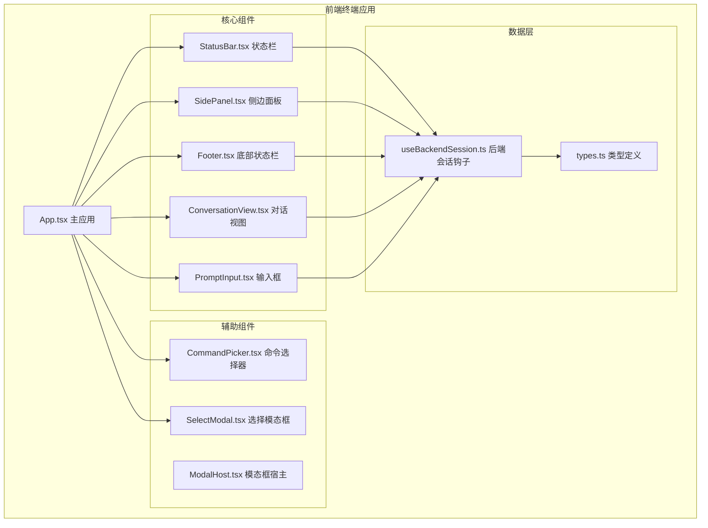
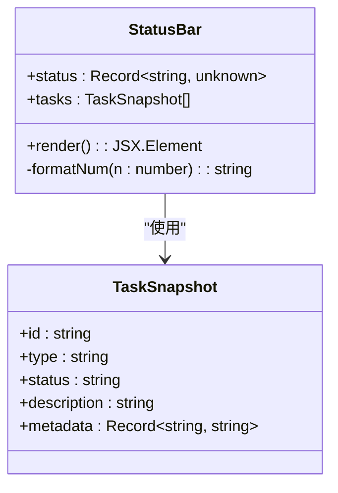
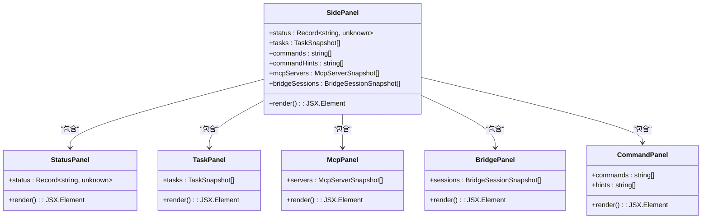
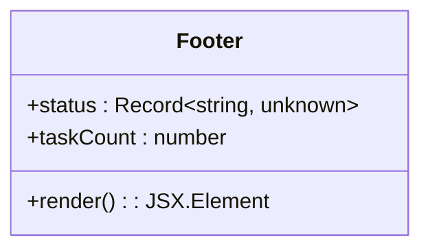
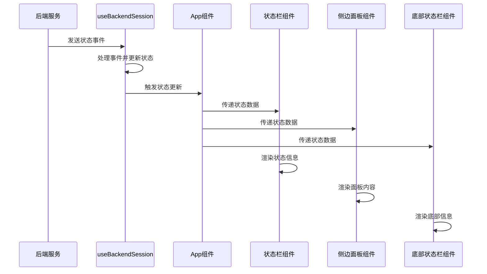
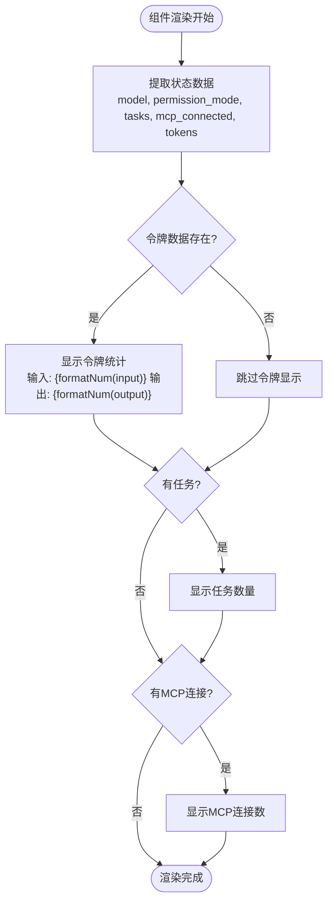
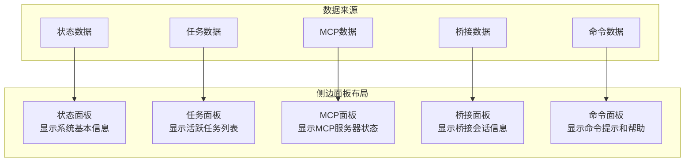
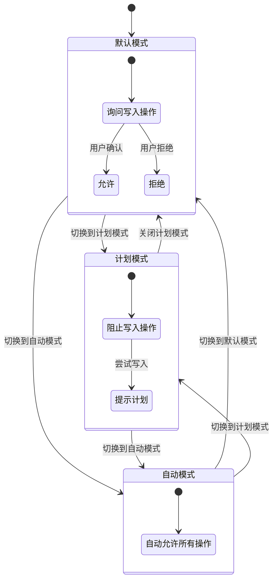
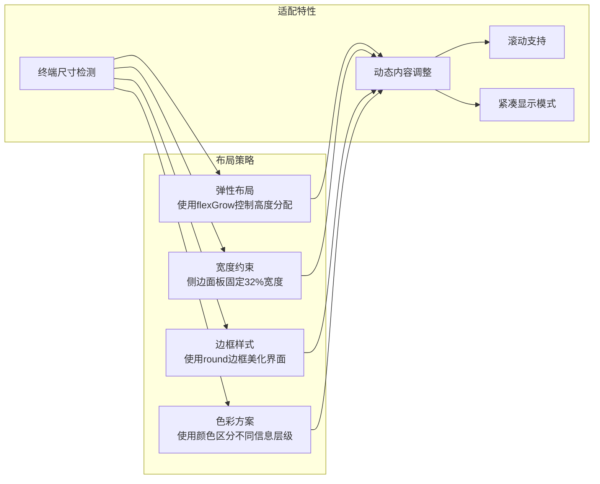
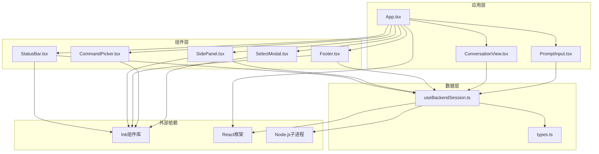

# 状态栏和导航组件

<cite>
**本文档引用的文件**
- [StatusBar.tsx](file://frontend/terminal/src/components/StatusBar.tsx)
- [SidePanel.tsx](file://frontend/terminal/src/components/SidePanel.tsx)
- [Footer.tsx](file://frontend/terminal/src/components/Footer.tsx)
- [App.tsx](file://frontend/terminal/src/App.tsx)
- [types.ts](file://frontend/terminal/src/types.ts)
- [useBackendSession.ts](file://frontend/terminal/src/hooks/useBackendSession.ts)
- [ConversationView.tsx](file://frontend/terminal/src/components/ConversationView.tsx)
- [PromptInput.tsx](file://frontend/terminal/src/components/PromptInput.tsx)
- [CommandPicker.tsx](file://frontend/terminal/src/components/CommandPicker.tsx)
- [SelectModal.tsx](file://frontend/terminal/src/components/SelectModal.tsx)
- [package.json](file://frontend/terminal/package.json)
</cite>

## 目录
1. [简介](#简介)
2. [项目结构](#项目结构)
3. [核心组件](#核心组件)
4. [架构概览](#架构概览)
5. [详细组件分析](#详细组件分析)
6. [依赖关系分析](#依赖关系分析)
7. [性能考虑](#性能考虑)
8. [故障排除指南](#故障排除指南)
9. [结论](#结论)

## 简介

OpenHarness 的状态栏和导航组件是终端界面的重要组成部分，提供了实时的状态监控、任务管理、系统信息展示等功能。该系统采用 Ink 组件库构建，实现了完整的 TUI（文本用户界面）体验，支持权限模式切换、任务状态跟踪、MCP 服务器连接状态监控、桥接会话管理等核心功能。

## 项目结构

前端终端应用采用模块化架构，主要组件分布在 `frontend/terminal/src/components` 目录下，通过 `App.tsx` 作为主入口协调各个组件的交互。

**图表来源**
- [App.tsx:1-400](file://frontend/terminal/src/App.tsx#L1-L400)
- [StatusBar.tsx:1-54](file://frontend/terminal/src/components/StatusBar.tsx#L1-L54)
- [SidePanel.tsx:1-153](file://frontend/terminal/src/components/SidePanel.tsx#L1-L153)
- [Footer.tsx:1-18](file://frontend/terminal/src/components/Footer.tsx#L1-L18)

**章节来源**
- [App.tsx:1-400](file://frontend/terminal/src/App.tsx#L1-L400)
- [package.json:1-20](file://frontend/terminal/package.json#L1-L20)

## 核心组件

### 状态栏组件 (StatusBar)

状态栏组件负责显示系统的核心运行状态信息，包括模型信息、权限模式、任务数量、MCP 连接状态等关键指标。

**图表来源**
- [StatusBar.tsx:8-54](file://frontend/terminal/src/components/StatusBar.tsx#L8-L54)
- [types.ts:14-20](file://frontend/terminal/src/types.ts#L14-L20)

状态栏的主要功能特性：
- **实时信息展示**：显示当前使用的 AI 模型、权限模式、任务计数
- **令牌统计**：显示输入和输出令牌的使用情况，支持千位分隔符格式化
- **MCP 连接状态**：显示 MCP 服务器的连接数量
- **动态格式化**：自动格式化大数值为千位单位

**章节来源**
- [StatusBar.tsx:8-54](file://frontend/terminal/src/components/StatusBar.tsx#L8-L54)

### 侧边面板组件 (SidePanel)

侧边面板提供了一个综合性的信息展示区域，包含系统状态、任务管理、MCP 服务器、桥接会话和命令提示等多个功能模块。

**图表来源**
- [SidePanel.tsx:6-153](file://frontend/terminal/src/components/SidePanel.tsx#L6-L153)

侧边面板的功能布局：
- **状态面板**：显示模型、提供商、认证状态、权限模式、工作目录等系统信息
- **任务面板**：展示当前活跃的任务列表，最多显示 6 个任务
- **MCP 面板**：显示 MCP 服务器连接状态、工具数量、资源数量等信息
- **桥接面板**：展示桥接会话的详细信息，包括进程 ID 和命令
- **命令面板**：提供命令提示和帮助信息

**章节来源**
- [SidePanel.tsx:6-153](file://frontend/terminal/src/components/SidePanel.tsx#L6-L153)

### 底部状态栏组件 (Footer)

底部状态栏提供了简洁的状态摘要信息，适合在终端界面底部显示关键系统状态。

**图表来源**
- [Footer.tsx:4-18](file://frontend/terminal/src/components/Footer.tsx#L4-L18)

底部状态栏的特点：
- **紧凑设计**：在有限的空间内提供最核心的状态信息
- **统一格式**：所有状态信息都采用键值对格式显示
- **实时更新**：与主状态栏保持同步的数据源

**章节来源**
- [Footer.tsx:4-18](file://frontend/terminal/src/components/Footer.tsx#L4-L18)

## 架构概览

整个状态栏和导航系统的架构基于 React + Ink 的组合，通过事件驱动的方式实现实时状态更新。

**图表来源**
- [useBackendSession.ts:71-150](file://frontend/terminal/src/hooks/useBackendSession.ts#L71-L150)
- [App.tsx:392-398](file://frontend/terminal/src/App.tsx#L392-L398)

**章节来源**
- [useBackendSession.ts:17-172](file://frontend/terminal/src/hooks/useBackendSession.ts#L17-L172)
- [App.tsx:392-398](file://frontend/terminal/src/App.tsx#L392-L398)

## 详细组件分析

### 状态栏渲染流程

状态栏组件的渲染过程体现了清晰的数据流和条件渲染逻辑：

**图表来源**
- [StatusBar.tsx:8-46](file://frontend/terminal/src/components/StatusBar.tsx#L8-L46)

### 侧边面板内容组织

侧边面板采用了模块化的布局设计，每个功能模块都有明确的职责边界：

**图表来源**
- [SidePanel.tsx:20-29](file://frontend/terminal/src/components/SidePanel.tsx#L20-L29)

### 权限模式管理系统

应用内置了三种权限模式，通过交互式的选择器进行切换：

**图表来源**
- [App.tsx:27-31](file://frontend/terminal/src/App.tsx#L27-L31)
- [App.tsx:104-147](file://frontend/terminal/src/App.tsx#L104-L147)

**章节来源**
- [App.tsx:27-31](file://frontend/terminal/src/App.tsx#L27-L31)
- [App.tsx:104-147](file://frontend/terminal/src/App.tsx#L104-L147)

### 响应式设计和屏幕适配

系统采用了灵活的布局策略来适应不同的终端尺寸：

**图表来源**
- [App.tsx:337-398](file://frontend/terminal/src/App.tsx#L337-L398)
- [SidePanel.tsx:22](file://frontend/terminal/src/components/SidePanel.tsx#L22)

**章节来源**
- [App.tsx:337-398](file://frontend/terminal/src/App.tsx#L337-L398)
- [SidePanel.tsx:22](file://frontend/terminal/src/components/SidePanel.tsx#L22)

## 依赖关系分析

状态栏和导航组件之间的依赖关系体现了清晰的分层架构：

**图表来源**
- [App.tsx:1-12](file://frontend/terminal/src/App.tsx#L1-L12)
- [useBackendSession.ts:1-13](file://frontend/terminal/src/hooks/useBackendSession.ts#L1-L13)
- [package.json:8-12](file://frontend/terminal/package.json#L8-L12)

**章节来源**
- [App.tsx:1-12](file://frontend/terminal/src/App.tsx#L1-L12)
- [useBackendSession.ts:1-13](file://frontend/terminal/src/hooks/useBackendSession.ts#L1-L13)
- [package.json:8-12](file://frontend/terminal/package.json#L8-L12)

## 性能考虑

### 数据更新优化

系统采用了多种策略来优化性能：

1. **状态缓存**：使用 `useMemo` 缓存计算结果，避免不必要的重新渲染
2. **增量更新**：只更新发生变化的状态部分，而不是整个组件树
3. **虚拟滚动**：对话视图和任务列表只渲染可见的部分内容

### 内存管理

- **事件监听器清理**：在组件卸载时正确清理事件监听器和定时器
- **子进程管理**：确保子进程正确终止，避免内存泄漏
- **状态重置**：在错误情况下正确重置状态，防止状态污染

### 渲染优化

- **条件渲染**：只有在需要时才渲染特定的组件或元素
- **懒加载**：大型数据集采用分页或延迟加载策略
- **最小化重排**：通过合理的布局设计减少 DOM 重排

## 故障排除指南

### 常见问题诊断

1. **状态不更新**
   - 检查后端会话连接是否正常
   - 验证事件处理函数是否正确执行
   - 确认状态更新触发器是否被调用

2. **组件渲染异常**
   - 检查 props 传递是否正确
   - 验证数据类型是否符合预期
   - 确认组件依赖是否正确安装

3. **权限模式切换失败**
   - 检查权限请求是否正确发送
   - 验证权限响应处理逻辑
   - 确认状态更新是否生效

### 调试技巧

- **日志记录**：在关键位置添加日志输出，追踪状态变化
- **断点调试**：使用浏览器开发者工具设置断点
- **单元测试**：为关键组件编写单元测试，验证功能正确性

**章节来源**
- [useBackendSession.ts:71-150](file://frontend/terminal/src/hooks/useBackendSession.ts#L71-L150)
- [App.tsx:149-290](file://frontend/terminal/src/App.tsx#L149-L290)

## 结论

OpenHarness 的状态栏和导航组件展现了优秀的 TUI 设计实践，通过模块化架构、清晰的数据流和灵活的布局策略，为用户提供了一个功能完整、响应迅速的终端界面。系统的关键优势包括：

1. **模块化设计**：各组件职责明确，便于维护和扩展
2. **实时更新**：基于事件驱动的状态管理，确保信息的及时性
3. **用户体验**：直观的权限模式切换和丰富的状态信息展示
4. **性能优化**：多种优化策略确保在各种环境下都能流畅运行
5. **可扩展性**：清晰的架构为未来功能扩展奠定了良好基础

这套组件系统不仅满足了当前的功能需求，也为后续的功能增强和技术演进提供了坚实的技术基础。