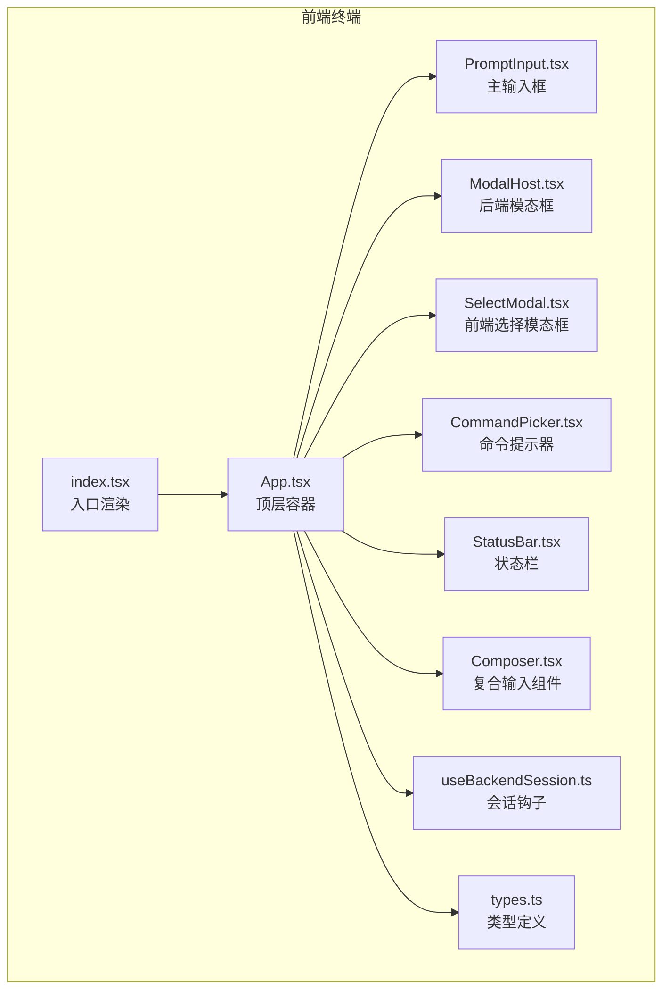
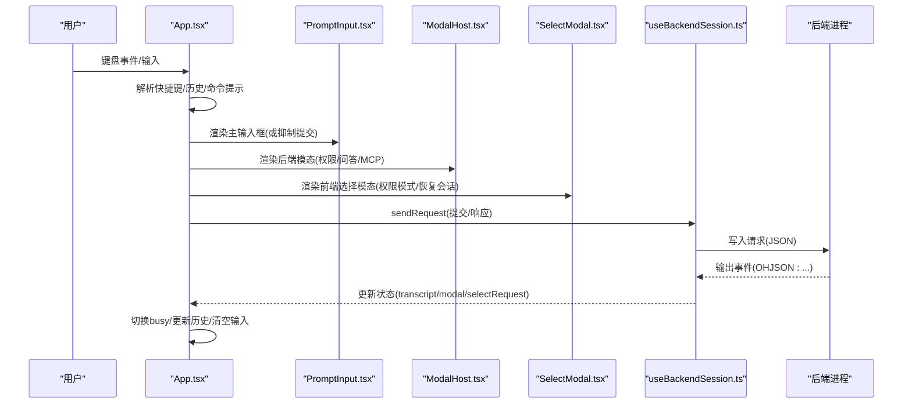
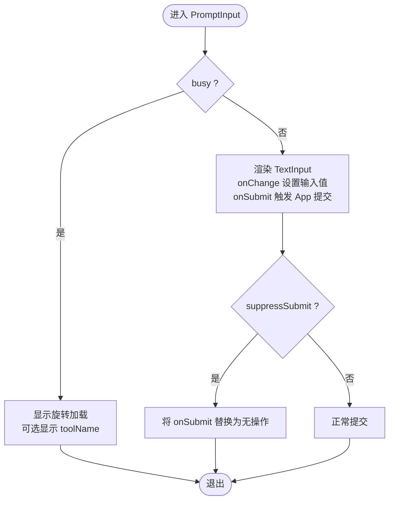
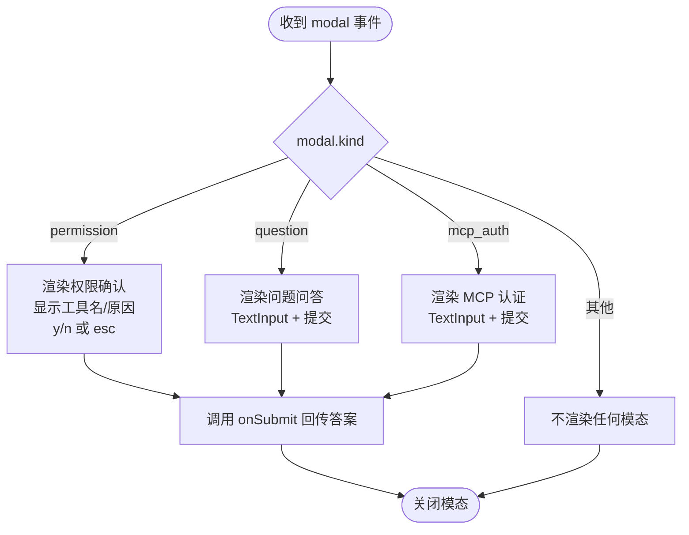
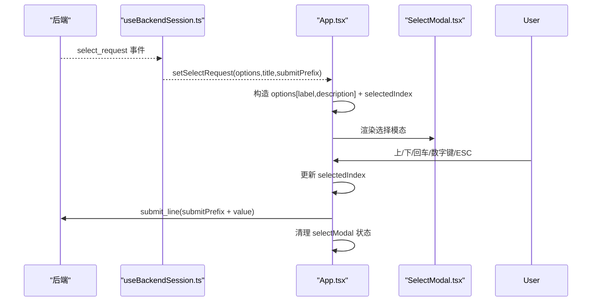
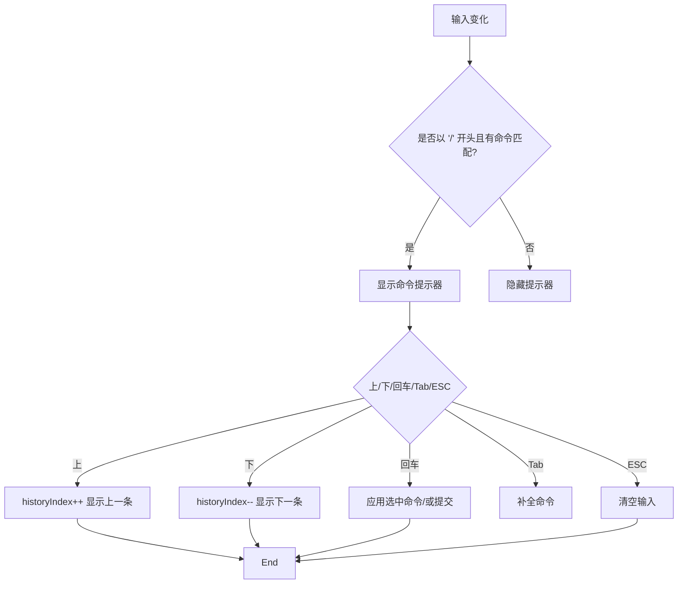
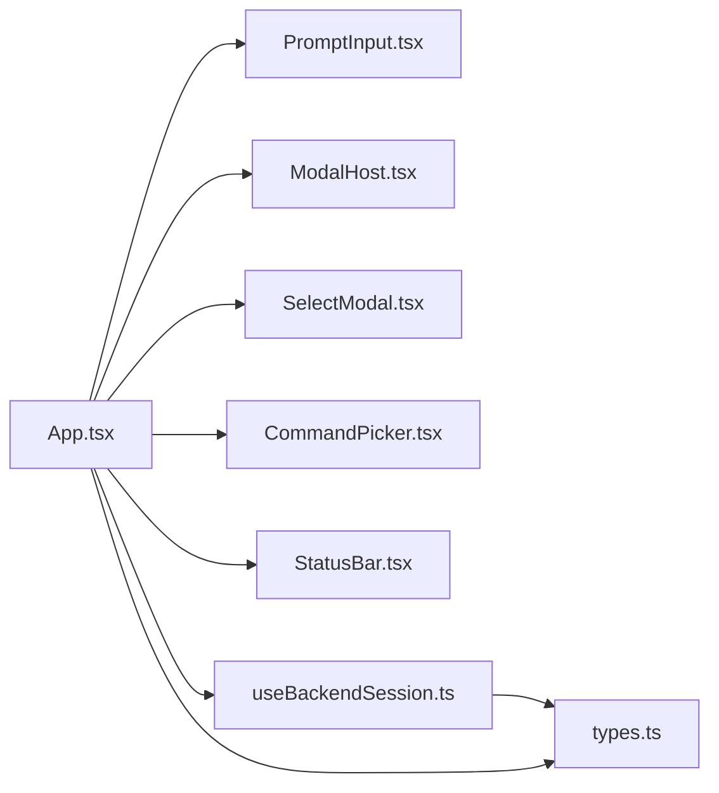

# 输入组件系统

<cite>
**本文引用的文件**
- [PromptInput.tsx](file://frontend/terminal/src/components/PromptInput.tsx)
- [ModalHost.tsx](file://frontend/terminal/src/components/ModalHost.tsx)
- [SelectModal.tsx](file://frontend/terminal/src/components/SelectModal.tsx)
- [App.tsx](file://frontend/terminal/src/App.tsx)
- [useBackendSession.ts](file://frontend/terminal/src/hooks/useBackendSession.ts)
- [types.ts](file://frontend/terminal/src/types.ts)
- [CommandPicker.tsx](file://frontend/terminal/src/components/CommandPicker.tsx)
- [Composer.tsx](file://frontend/terminal/src/components/Composer.tsx)
- [StatusBar.tsx](file://frontend/terminal/src/components/StatusBar.tsx)
- [index.tsx](file://frontend/terminal/src/index.tsx)
</cite>

## 目录
1. [简介](#简介)
2. [项目结构](#项目结构)
3. [核心组件](#核心组件)
4. [架构总览](#架构总览)
5. [详细组件分析](#详细组件分析)
6. [依赖关系分析](#依赖关系分析)
7. [性能考量](#性能考量)
8. [故障排查指南](#故障排查指南)
9. [结论](#结论)
10. [附录](#附录)

## 简介
本文件系统化梳理终端前端的输入组件体系，重点覆盖以下方面：
- PromptInput 主输入框：文本输入、历史记录、提交处理与“忙碌”状态展示
- ModalHost 模态框：通用权限确认、问题问答、MCP 认证等模态场景
- SelectModal 选择模态框：选项导航、快速数字键选择、确认与取消
- 输入验证、键盘快捷键、无障碍访问（可读性）等设计要点
- 组件间协作、事件流与状态管理

## 项目结构
输入组件系统位于前端终端目录，围绕 App 作为顶层容器，通过 useBackendSession 钩子与后端进行双向事件通信，渲染 PromptInput、ModalHost、SelectModal 等组件。

图表来源
- [index.tsx:1-10](file://frontend/terminal/src/index.tsx#L1-L10)
- [App.tsx:1-400](file://frontend/terminal/src/App.tsx#L1-L400)
- [PromptInput.tsx:1-39](file://frontend/terminal/src/components/PromptInput.tsx#L1-L39)
- [ModalHost.tsx:1-71](file://frontend/terminal/src/components/ModalHost.tsx#L1-L71)
- [SelectModal.tsx:1-45](file://frontend/terminal/src/components/SelectModal.tsx#L1-L45)
- [CommandPicker.tsx:1-34](file://frontend/terminal/src/components/CommandPicker.tsx#L1-L34)
- [Composer.tsx:1-33](file://frontend/terminal/src/components/Composer.tsx#L1-L33)
- [StatusBar.tsx:1-54](file://frontend/terminal/src/components/StatusBar.tsx#L1-L54)
- [useBackendSession.ts:1-172](file://frontend/terminal/src/hooks/useBackendSession.ts#L1-L172)
- [types.ts:1-63](file://frontend/terminal/src/types.ts#L1-L63)

章节来源
- [index.tsx:1-10](file://frontend/terminal/src/index.tsx#L1-L10)
- [App.tsx:1-400](file://frontend/terminal/src/App.tsx#L1-L400)

## 核心组件
- PromptInput：在非忙碌状态下提供文本输入，支持“抑制提交”以配合命令提示器；忙碌时显示工具名与旋转指示器
- ModalHost：根据后端事件 kind 渲染不同模态，包括权限确认、问题问答、MCP 认证
- SelectModal：渲染选项列表，支持上下导航、回车选择、Esc 取消、数字键快速选择
- App：集中处理键盘事件、历史记录、命令提示、模态与选择模态的切换与提交
- useBackendSession：负责与后端建立连接、解析事件、维护会话状态（含 modal/select_request）

章节来源
- [PromptInput.tsx:1-39](file://frontend/terminal/src/components/PromptInput.tsx#L1-L39)
- [ModalHost.tsx:1-71](file://frontend/terminal/src/components/ModalHost.tsx#L1-L71)
- [SelectModal.tsx:1-45](file://frontend/terminal/src/components/SelectModal.tsx#L1-L45)
- [App.tsx:1-400](file://frontend/terminal/src/App.tsx#L1-L400)
- [useBackendSession.ts:1-172](file://frontend/terminal/src/hooks/useBackendSession.ts#L1-L172)

## 架构总览
下图展示了从用户输入到后端事件响应的完整链路，以及各输入组件如何协作：

图表来源
- [App.tsx:149-318](file://frontend/terminal/src/App.tsx#L149-L318)
- [PromptInput.tsx:9-38](file://frontend/terminal/src/components/PromptInput.tsx#L9-L38)
- [ModalHost.tsx:5-70](file://frontend/terminal/src/components/ModalHost.tsx#L5-L70)
- [SelectModal.tsx:11-44](file://frontend/terminal/src/components/SelectModal.tsx#L11-L44)
- [useBackendSession.ts:31-150](file://frontend/terminal/src/hooks/useBackendSession.ts#L31-L150)

## 详细组件分析

### PromptInput 主输入框
- 设计目标
  - 在非忙碌时提供简洁的文本输入入口，前置提示符与颜色标识
  - 忙碌时显示当前工具名与旋转加载，避免重复提交
  - 支持“抑制提交”，用于与命令提示器共存时不触发提交
- 关键行为
  - busy 为真时仅渲染加载态；否则渲染 TextInput 并绑定 onChange/onSubmit
  - 当 suppressSubmit 为真时，将 onSubmit 替换为无操作，防止误触
- 交互细节
  - 与 App 的 onSubmit 协作，由 App 负责历史记录与命令拦截
  - toolName 用于动态显示当前执行工具，提升可读性

图表来源
- [PromptInput.tsx:9-38](file://frontend/terminal/src/components/PromptInput.tsx#L9-L38)

章节来源
- [PromptInput.tsx:1-39](file://frontend/terminal/src/components/PromptInput.tsx#L1-L39)
- [App.tsx:374-384](file://frontend/terminal/src/App.tsx#L374-L384)

### ModalHost 模态框（通用）
- 通用性设计
  - 通过 modal.kind 字段区分不同模态场景，统一使用 TextInput 接收用户输入
  - 通过 onSubmit 将答案或确认结果回传给 App，再由 App 发送至后端
- 场景覆盖
  - 权限确认：显示工具名与原因，支持 y/n 或 Esc 拒绝
  - 问题问答：显示问题正文，等待用户输入回答
  - MCP 认证：显示认证提示，等待凭据输入
- 无障碍与可读性
  - 使用颜色与符号增强可读性（如黄色边框、问号、锁图标）
  - 显示简短操作提示，帮助用户理解快捷键

图表来源
- [ModalHost.tsx:5-70](file://frontend/terminal/src/components/ModalHost.tsx#L5-L70)
- [useBackendSession.ts:138-141](file://frontend/terminal/src/hooks/useBackendSession.ts#L138-L141)

章节来源
- [ModalHost.tsx:1-71](file://frontend/terminal/src/components/ModalHost.tsx#L1-L71)
- [useBackendSession.ts:138-141](file://frontend/terminal/src/hooks/useBackendSession.ts#L138-L141)

### SelectModal 选择模态框
- 实现要点
  - 接收标题、选项数组与当前选中索引，渲染带边框的圆角面板
  - 选项包含标签、描述与“当前项”标记；支持 active 字段高亮当前值
  - 提供上下箭头导航、回车确认、Esc 取消、数字键快速选择
- 用户交互流程
  - 后端通过 select_request 事件下发选项；App 转换为前端 SelectModal 状态
  - 用户选择后，App 以 submitPrefix + value 的形式回传给后端
  - 选择完成后清除状态，恢复输入

图表来源
- [useBackendSession.ts:129-137](file://frontend/terminal/src/hooks/useBackendSession.ts#L129-L137)
- [App.tsx:80-101](file://frontend/terminal/src/App.tsx#L80-L101)
- [SelectModal.tsx:11-44](file://frontend/terminal/src/components/SelectModal.tsx#L11-L44)

章节来源
- [SelectModal.tsx:1-45](file://frontend/terminal/src/components/SelectModal.tsx#L1-L45)
- [App.tsx:80-101](file://frontend/terminal/src/App.tsx#L80-L101)
- [types.ts:42-46](file://frontend/terminal/src/types.ts#L42-L46)

### 命令提示器与历史记录
- 命令提示器 CommandPicker
  - 当输入以“/”开头且匹配后端命令时显示候选列表
  - 支持上下导航、Tab 补全、回车选择、Esc 清空
- 历史记录
  - App 维护 history 数组与 historyIndex，支持上下箭头浏览历史
  - 提交成功后将当前输入加入历史并重置索引

图表来源
- [CommandPicker.tsx:4-33](file://frontend/terminal/src/components/CommandPicker.tsx#L4-L33)
- [App.tsx:66-78](file://frontend/terminal/src/App.tsx#L66-L78)
- [App.tsx:269-283](file://frontend/terminal/src/App.tsx#L269-L283)

章节来源
- [CommandPicker.tsx:1-34](file://frontend/terminal/src/components/CommandPicker.tsx#L1-L34)
- [App.tsx:66-78](file://frontend/terminal/src/App.tsx#L66-L78)
- [App.tsx:269-283](file://frontend/terminal/src/App.tsx#L269-L283)

### 输入验证、键盘快捷键与无障碍
- 输入验证
  - 非忙碌且非空字符串才允许提交
  - 对于后端发起的模态（如 question），优先走模态提交路径
- 键盘快捷键
  - Ctrl+C：发送 shutdown 请求并退出
  - 上/下箭头：浏览历史或在选择器中导航
  - 回车：提交输入、确认选择、确认权限
  - Tab：命令补全
  - ESC：取消命令提示器、取消选择器、拒绝权限
  - 数字键 1..N：在选择器中快速跳转到第 N 个选项
- 无障碍与可读性
  - 使用颜色与符号突出关键信息（如提示符、工具名、状态）
  - 底部显示简要快捷键提示，便于新用户上手
  - 旋转加载与“busy/ready”状态提示，减少歧义

章节来源
- [App.tsx:149-290](file://frontend/terminal/src/App.tsx#L149-L290)
- [PromptInput.tsx:24-30](file://frontend/terminal/src/components/PromptInput.tsx#L24-L30)
- [Composer.tsx:17-32](file://frontend/terminal/src/components/Composer.tsx#L17-L32)
- [StatusBar.tsx:8-54](file://frontend/terminal/src/components/StatusBar.tsx#L8-L54)

## 依赖关系分析
- 组件耦合
  - App 是中枢，直接依赖 PromptInput、ModalHost、SelectModal、CommandPicker、StatusBar
  - useBackendSession 为 App 提供状态与事件分发，App 通过它与后端通信
- 外部依赖
  - ink 用于终端渲染（Box、Text、useApp、useInput）
  - ink-text-input 用于文本输入
- 类型契约
  - types.ts 定义了 BackendEvent、SelectOptionPayload 等关键类型，确保前后端一致

图表来源
- [App.tsx:1-400](file://frontend/terminal/src/App.tsx#L1-L400)
- [useBackendSession.ts:1-172](file://frontend/terminal/src/hooks/useBackendSession.ts#L1-L172)
- [types.ts:1-63](file://frontend/terminal/src/types.ts#L1-L63)

章节来源
- [App.tsx:1-400](file://frontend/terminal/src/App.tsx#L1-L400)
- [useBackendSession.ts:1-172](file://frontend/terminal/src/hooks/useBackendSession.ts#L1-L172)
- [types.ts:1-63](file://frontend/terminal/src/types.ts#L1-L63)

## 性能考量
- 渲染优化
  - 使用 useMemo 缓存计算结果（如 currentToolName、commandHints），降低不必要的重渲染
  - 仅在需要时渲染命令提示器与选择模态，避免冗余 DOM
- 事件处理
  - useInput 中对不同场景分支判断，命中即返回，减少无效处理
  - 历史记录与命令提示器的索引更新采用数学边界约束，避免越界
- I/O 与协议
  - 使用固定前缀协议解析后端输出，保证事件解析稳定
  - 通过 stdin 流一次性写入 JSON，减少多次 I/O

章节来源
- [App.tsx:52-63](file://frontend/terminal/src/App.tsx#L52-L63)
- [App.tsx:66-78](file://frontend/terminal/src/App.tsx#L66-L78)
- [useBackendSession.ts:15-15](file://frontend/terminal/src/hooks/useBackendSession.ts#L15-L15)
- [useBackendSession.ts:31-37](file://frontend/terminal/src/hooks/useBackendSession.ts#L31-L37)

## 故障排查指南
- 无法输入
  - 检查 busy 状态：忙碌时 PromptInput 会显示加载态并抑制提交
  - 检查 modal/selectModal 是否存在：存在时主输入框会被隐藏
  - 检查 suppressSubmit：当命令提示器激活时会抑制提交
- 提交无效
  - 确认输入非空且非忙碌
  - 若为后端模态（如 question），需先在模态中提交，再回到主输入
- 历史记录不生效
  - 确认未处于命令提示器状态
  - 检查上下箭头按键是否被其他组件消费
- 模态无法关闭
  - 权限模态：按 y/n 或 ESC
  - 问题模态：输入回答后回车
  - MCP 认证：输入凭据后回车
- 选择模态异常
  - 确认后端已下发 select_request 事件
  - 检查 options 是否为空，空则不会弹出选择器

章节来源
- [PromptInput.tsx:24-30](file://frontend/terminal/src/components/PromptInput.tsx#L24-L30)
- [App.tsx:374-384](file://frontend/terminal/src/App.tsx#L374-L384)
- [App.tsx:149-290](file://frontend/terminal/src/App.tsx#L149-L290)
- [useBackendSession.ts:129-141](file://frontend/terminal/src/hooks/useBackendSession.ts#L129-L141)

## 结论
输入组件系统以 App 为核心，结合 PromptInput、ModalHost、SelectModal、CommandPicker 等组件，形成清晰的输入-反馈闭环。通过 useBackendSession 钩子与后端事件解耦，系统具备良好的扩展性与可维护性。键盘快捷键与可视化提示提升了可用性，颜色与符号增强了可读性。建议后续可在输入校验、错误提示与可访问性方面进一步细化。

## 附录
- 状态与事件类型参考
  - BackendEvent：包含 ready/state_snapshot/tasks_snapshot/transcript_item/assistant_delta/assistant_complete/line_complete/tool_started/tool_completed/clear_transcript/select_request/modal_request/error/shutdown 等
  - SelectOptionPayload：用于前端选择模态的选项载荷

章节来源
- [types.ts:48-62](file://frontend/terminal/src/types.ts#L48-L62)
- [types.ts:42-46](file://frontend/terminal/src/types.ts#L42-L46)