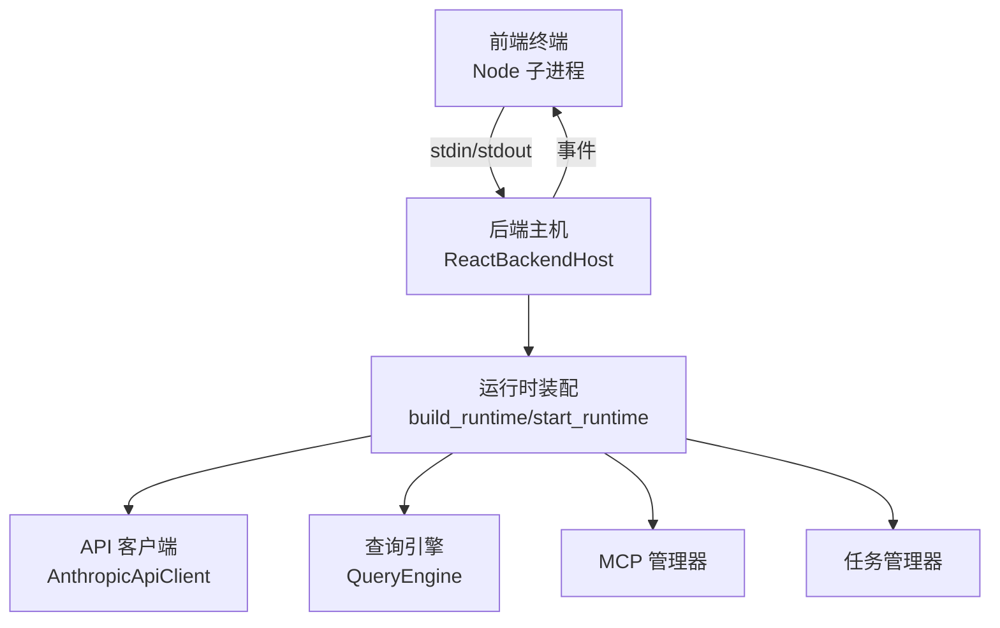
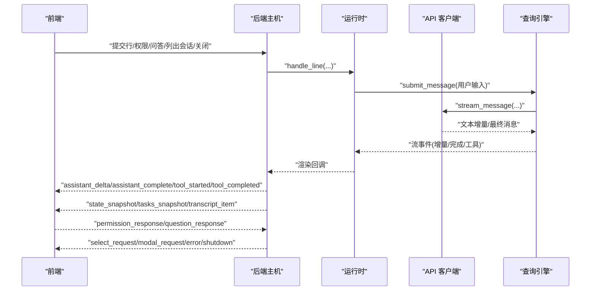
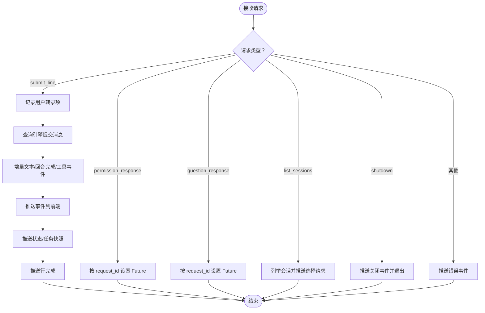
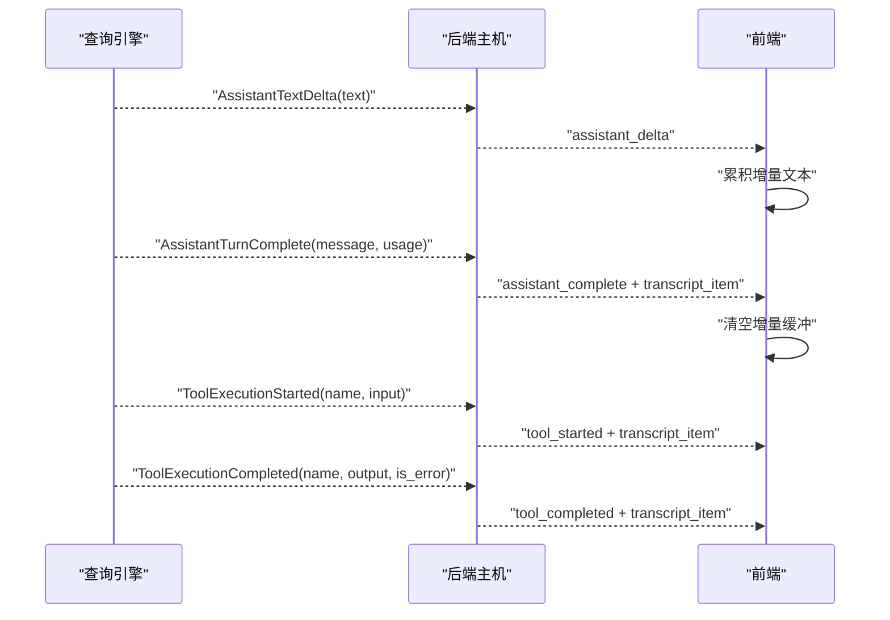
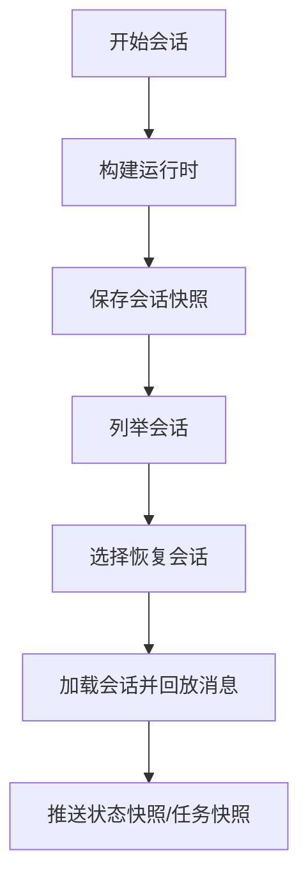
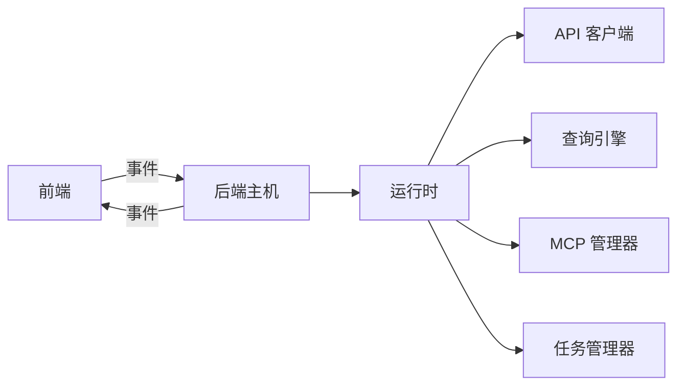

# 后端通信协议

<cite>
**本文引用的文件**
- [src/openharness/ui/protocol.py](file://src/openharness/ui/protocol.py)
- [src/openharness/ui/backend_host.py](file://src/openharness/ui/backend_host.py)
- [src/openharness/engine/messages.py](file://src/openharness/engine/messages.py)
- [src/openharness/engine/stream_events.py](file://src/openharness/engine/stream_events.py)
- [src/openharness/state/app_state.py](file://src/openharness/state/app_state.py)
- [src/openharness/tasks/types.py](file://src/openharness/tasks/types.py)
- [src/openharness/mcp/types.py](file://src/openharness/mcp/types.py)
- [src/openharness/bridge/types.py](file://src/openharness/bridge/types.py)
- [src/openharness/services/session_storage.py](file://src/openharness/services/session_storage.py)
- [src/openharness/api/client.py](file://src/openharness/api/client.py)
- [src/openharness/api/errors.py](file://src/openharness/api/errors.py)
- [src/openharness/ui/runtime.py](file://src/openharness/ui/runtime.py)
- [frontend/terminal/src/hooks/useBackendSession.ts](file://frontend/terminal/src/hooks/useBackendSession.ts)
- [frontend/terminal/src/types.ts](file://frontend/terminal/src/types.ts)
</cite>

## 目录
1. [简介](#简介)
2. [项目结构](#项目结构)
3. [核心组件](#核心组件)
4. [架构总览](#架构总览)
5. [详细组件分析](#详细组件分析)
6. [依赖分析](#依赖分析)
7. [性能考虑](#性能考虑)
8. [故障排查指南](#故障排查指南)
9. [结论](#结论)
10. [附录：协议扩展与自定义消息类型开发指南](#附录协议扩展与自定义消息类型开发指南)

## 简介
本文件系统化梳理 OpenHarness 的后端通信协议，覆盖前端与后端之间的消息格式、事件类型、请求-响应模式、会话管理、状态同步、错误处理、实时增量输出与流式响应机制，并提供协议扩展与自定义消息类型的开发指南。该协议采用基于 JSON Lines 的文本协议，通过标准输入/输出在进程间传递结构化事件与请求。

## 项目结构
- 前端终端（React 终端）通过 Node 子进程启动后端，使用统一的协议前缀进行事件解析与渲染。
- 后端以“运行时”为核心，封装 API 客户端、工具注册表、MCP 管理器、状态存储、查询引擎等模块，按需向前端推送事件。
- 协议模型位于后端协议层，前端类型与钩子负责消费与渲染事件。

图表来源
- [src/openharness/ui/backend_host.py:41-115](file://src/openharness/ui/backend_host.py#L41-L115)
- [src/openharness/ui/runtime.py:89-176](file://src/openharness/ui/runtime.py#L89-L176)
- [src/openharness/api/client.py:98-176](file://src/openharness/api/client.py#L98-L176)

章节来源
- [src/openharness/ui/backend_host.py:1-306](file://src/openharness/ui/backend_host.py#L1-L306)
- [src/openharness/ui/runtime.py:1-297](file://src/openharness/ui/runtime.py#L1-L297)

## 核心组件
- 请求模型：FrontendRequest
  - 类型字段限定为若干受控值，确保协议安全与可演进性。
  - 支持提交行、权限响应、问答响应、列出会话、关闭等请求。
- 事件模型：BackendEvent
  - 类型字段涵盖就绪、状态快照、任务快照、转录项、助手增量、完成、行完成、工具开始/完成、清空转录、模态请求、选择请求、错误、关闭等。
  - 事件携带状态、任务、MCP 服务器、桥接会话、命令列表、模态框、选择项、工具名/输入/输出、错误标记等上下文。
- 转录项：TranscriptItem
  - 角色枚举覆盖系统、用户、助手、工具、工具结果、日志；支持工具调用元数据与错误标记。
- 任务快照：TaskSnapshot
  - UI 安全的任务表示，包含 id、type、status、description、metadata。
- 流事件：StreamEvent
  - 助手文本增量、回合完成（含完整消息与用量）、工具执行开始、工具执行完成（含是否错误）。

章节来源
- [src/openharness/ui/protocol.py:15-197](file://src/openharness/ui/protocol.py#L15-L197)
- [src/openharness/engine/stream_events.py:1-50](file://src/openharness/engine/stream_events.py#L1-L50)

## 架构总览
后端通过 ReactBackendHost 驱动运行时，读取前端请求队列，分发到处理流程；同时将增量事件与状态变更以 BackendEvent 形式推送给前端。前端使用 readline 解析每行事件，过滤协议前缀，按事件类型更新 UI。

图表来源
- [src/openharness/ui/backend_host.py:133-204](file://src/openharness/ui/backend_host.py#L133-L204)
- [src/openharness/ui/runtime.py:223-271](file://src/openharness/ui/runtime.py#L223-L271)
- [src/openharness/api/client.py:107-176](file://src/openharness/api/client.py#L107-L176)

## 详细组件分析

### 1) 消息格式与协议前缀
- 协议前缀：OHJSON:
- 每行一个 JSON 对象，后端在发送前附加前缀，前端解析时去除前缀再反序列化为事件对象。
- 前端在遇到非协议前缀行时，将其作为日志直接渲染到转录区。

章节来源
- [src/openharness/ui/backend_host.py:27-278](file://src/openharness/ui/backend_host.py#L27-L278)
- [frontend/terminal/src/hooks/useBackendSession.ts:15-55](file://frontend/terminal/src/hooks/useBackendSession.ts#L15-L55)

### 2) 请求类型与处理流程
- submit_line：用户输入的自然语言或命令，后端记录为用户转录项，交由查询引擎生成响应。
- permission_response：权限弹窗确认，后端根据 request_id 回填 Future 结果。
- question_response：问答弹窗回答，后端回填 Future。
- list_sessions：列出最近会话，构造选择请求事件。
- shutdown：关闭后端并发出关闭事件。

图表来源
- [src/openharness/ui/backend_host.py:74-108](file://src/openharness/ui/backend_host.py#L74-L108)
- [src/openharness/ui/backend_host.py:214-234](file://src/openharness/ui/backend_host.py#L214-L234)

章节来源
- [src/openharness/ui/backend_host.py:74-108](file://src/openharness/ui/backend_host.py#L74-L108)
- [src/openharness/ui/backend_host.py:214-274](file://src/openharness/ui/backend_host.py#L214-L274)

### 3) 事件类型与语义
- ready：首次建立连接时推送，包含初始状态、任务列表、可用命令、MCP 与桥接会话信息。
- state_snapshot：状态快照，包含模型、工作目录、提供商、鉴权状态、主题、键位绑定、语音、快速模式、努力度、轮次、MCP 连接/失败数、桥接会话数、输出样式等。
- tasks_snapshot：任务列表快照，用于 UI 同步任务状态。
- transcript_item：单条转录项，角色包括 system/user/assistant/tool/tool_result/log。
- assistant_delta：助手文本增量，前端累积显示。
- assistant_complete：回合完成，携带完整消息与转录项。
- tool_started/tool_completed：工具调用开始/完成，携带工具名、输入、输出及错误标记。
- clear_transcript：清空转录区。
- modal_request/select_request：弹窗请求，包含 kind、request_id、问题/权限/选择项等。
- error：错误事件，携带错误消息。
- shutdown：后端主动关闭。

章节来源
- [src/openharness/ui/protocol.py:55-197](file://src/openharness/ui/protocol.py#L55-L197)
- [src/openharness/state/app_state.py:8-31](file://src/openharness/state/app_state.py#L8-L31)
- [src/openharness/tasks/types.py:14-31](file://src/openharness/tasks/types.py#L14-L31)

### 4) 实时增量输出与流式响应
- 查询引擎产生流事件：文本增量、回合完成、工具开始/完成。
- 后端将流事件映射为协议事件：assistant_delta、assistant_complete、tool_started、tool_completed。
- 前端累积 assistant_delta 并在 assistant_complete 时落盘为一条助手转录项，同时清除增量缓冲。

图表来源
- [src/openharness/engine/stream_events.py:12-49](file://src/openharness/engine/stream_events.py#L12-L49)
- [src/openharness/ui/backend_host.py:144-190](file://src/openharness/ui/backend_host.py#L144-L190)
- [frontend/terminal/src/hooks/useBackendSession.ts:99-113](file://frontend/terminal/src/hooks/useBackendSession.ts#L99-L113)

章节来源
- [src/openharness/engine/stream_events.py:1-50](file://src/openharness/engine/stream_events.py#L1-L50)
- [src/openharness/ui/backend_host.py:144-204](file://src/openharness/ui/backend_host.py#L144-L204)
- [frontend/terminal/src/hooks/useBackendSession.ts:71-116](file://frontend/terminal/src/hooks/useBackendSession.ts#L71-L116)

### 5) 会话管理与状态同步
- 会话快照持久化：保存最新会话与命名会话，包含会话 ID、工作目录、模型、系统提示、消息列表、用量、创建时间、摘要与消息数量。
- 列举会话：按创建时间倒序返回最近 N 条会话，供前端选择恢复。
- 状态同步：运行时从设置、MCP 状态、桥接会话等动态刷新 AppState，后端周期性推送状态快照。

图表来源
- [src/openharness/services/session_storage.py:26-67](file://src/openharness/services/session_storage.py#L26-L67)
- [src/openharness/services/session_storage.py:78-138](file://src/openharness/services/session_storage.py#L78-L138)
- [src/openharness/ui/runtime.py:196-220](file://src/openharness/ui/runtime.py#L196-L220)
- [src/openharness/ui/backend_host.py:214-234](file://src/openharness/ui/backend_host.py#L214-L234)

章节来源
- [src/openharness/services/session_storage.py:1-178](file://src/openharness/services/session_storage.py#L1-L178)
- [src/openharness/ui/runtime.py:196-220](file://src/openharness/ui/runtime.py#L196-L220)
- [src/openharness/ui/backend_host.py:206-212](file://src/openharness/ui/backend_host.py#L206-L212)

### 6) 错误处理与重试
- API 客户端支持指数退避+抖动重试，自动处理可重试状态码与网络异常。
- 认证失败、速率限制、通用请求失败分别映射为专用错误类型。
- 后端在请求解析失败、未知请求类型、会话繁忙等场景推送 error 事件。

章节来源
- [src/openharness/api/client.py:67-96](file://src/openharness/api/client.py#L67-L96)
- [src/openharness/api/client.py:107-176](file://src/openharness/api/client.py#L107-L176)
- [src/openharness/api/errors.py:1-20](file://src/openharness/api/errors.py#L1-L20)
- [src/openharness/ui/backend_host.py:126-131](file://src/openharness/ui/backend_host.py#L126-L131)
- [src/openharness/ui/backend_host.py:93-96](file://src/openharness/ui/backend_host.py#L93-L96)

### 7) 数据模型与类型映射
- 前端类型与后端模型保持一一对应，确保跨进程传输的强类型约束。
- MCP 与桥接会话状态在状态快照中聚合展示，便于前端 UI 呈现。

章节来源
- [frontend/terminal/src/types.ts:48-62](file://frontend/terminal/src/types.ts#L48-L62)
- [src/openharness/ui/protocol.py:153-174](file://src/openharness/ui/protocol.py#L153-L174)
- [src/openharness/mcp/types.py:66-77](file://src/openharness/mcp/types.py#L66-L77)
- [src/openharness/bridge/types.py:29-38](file://src/openharness/bridge/types.py#L29-L38)

## 依赖分析
- 后端主机依赖运行时装配、查询引擎、API 客户端、MCP 管理器、任务管理器与状态存储。
- 前端依赖协议模型与事件处理逻辑，通过 readline 逐行解析事件。
- 协议层通过 Pydantic 模型保证请求/事件的结构化与校验。

图表来源
- [src/openharness/ui/backend_host.py:41-115](file://src/openharness/ui/backend_host.py#L41-L115)
- [src/openharness/ui/runtime.py:89-176](file://src/openharness/ui/runtime.py#L89-L176)

章节来源
- [src/openharness/ui/backend_host.py:1-306](file://src/openharness/ui/backend_host.py#L1-L306)
- [src/openharness/ui/runtime.py:1-297](file://src/openharness/ui/runtime.py#L1-L297)

## 性能考虑
- 使用异步锁保护 stdout 写入，避免并发写导致的事件交错。
- 事件按流式增量推送，前端仅累积增量文本，减少一次性大块渲染压力。
- API 客户端内置指数退避与抖动，降低上游限流与瞬时错误的影响。
- 会话快照采用 JSON 文本持久化，I/O 开销可控，建议限制会话列表数量与摘要长度。

## 故障排查指南
- 协议前缀不匹配：检查前端是否正确过滤 OHJSON: 前缀，以及后端是否在发送前缀。
- 请求解析失败：后端会推送错误事件，前端应记录并提示用户重新输入。
- 会话繁忙：当后端正在处理请求时拒绝新请求，前端应禁用输入或提示等待。
- API 错误：认证失败、速率限制、网络异常等会被翻译为专用错误类型，前端可根据错误类型引导用户操作。
- 会话恢复：若选择的会话无法加载，前端应回退到当前会话并提示错误。

章节来源
- [src/openharness/ui/backend_host.py:117-131](file://src/openharness/ui/backend_host.py#L117-L131)
- [src/openharness/ui/backend_host.py:93-107](file://src/openharness/ui/backend_host.py#L93-L107)
- [src/openharness/api/client.py:179-186](file://src/openharness/api/client.py#L179-L186)
- [src/openharness/api/errors.py:1-20](file://src/openharness/api/errors.py#L1-L20)

## 结论
该通信协议以简洁稳定的 JSON Lines 为基础，结合严格的请求/事件模型与流式增量推送，实现了前后端高效协作。通过状态快照、任务快照与会话持久化，协议具备良好的状态同步与恢复能力。配合完善的错误处理与重试策略，能够在复杂网络环境下保持稳健表现。

## 附录：协议扩展与自定义消息类型开发指南
- 新增事件类型
  - 在后端协议层添加新的 BackendEvent 类型字段与必要负载字段。
  - 提供工厂方法以构造事件对象，确保与现有状态快照/任务快照等保持一致的结构。
  - 在状态快照映射函数中补充新字段的序列化逻辑。
- 新增请求类型
  - 在前端类型定义中增加对应字段，并在钩子中构造请求对象。
  - 在后端主机中新增分支处理逻辑，包括队列接收、参数校验、业务处理与事件回推。
- 新增流事件
  - 在流事件模块中定义新的数据类，如 ToolExecutionResult 等。
  - 在后端主机的渲染回调中映射为新的事件类型，前端相应更新事件处理分支。
- 兼容性与演进
  - 所有新增字段应为可选，避免破坏旧版本前端的解析。
  - 事件/请求类型字段应保持受控枚举，防止未授权扩展。
  - 建议在状态快照中保留兼容字段，以便旧前端仍能正确渲染。

章节来源
- [src/openharness/ui/protocol.py:55-197](file://src/openharness/ui/protocol.py#L55-L197)
- [src/openharness/engine/stream_events.py:44-49](file://src/openharness/engine/stream_events.py#L44-L49)
- [src/openharness/ui/backend_host.py:144-190](file://src/openharness/ui/backend_host.py#L144-L190)
- [frontend/terminal/src/types.ts:48-62](file://frontend/terminal/src/types.ts#L48-L62)