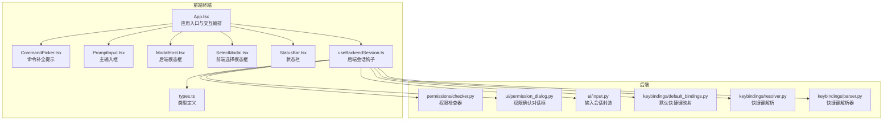
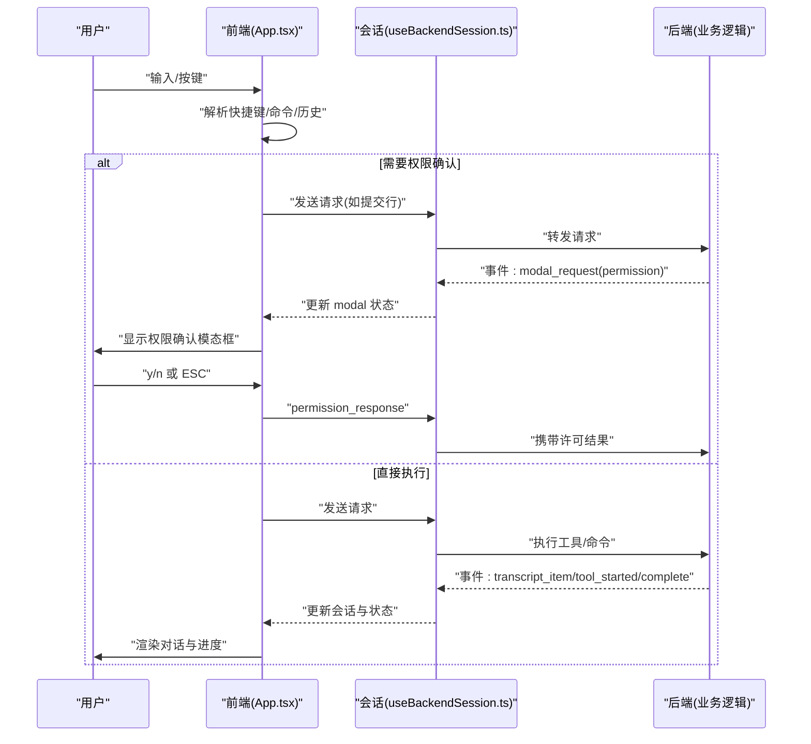
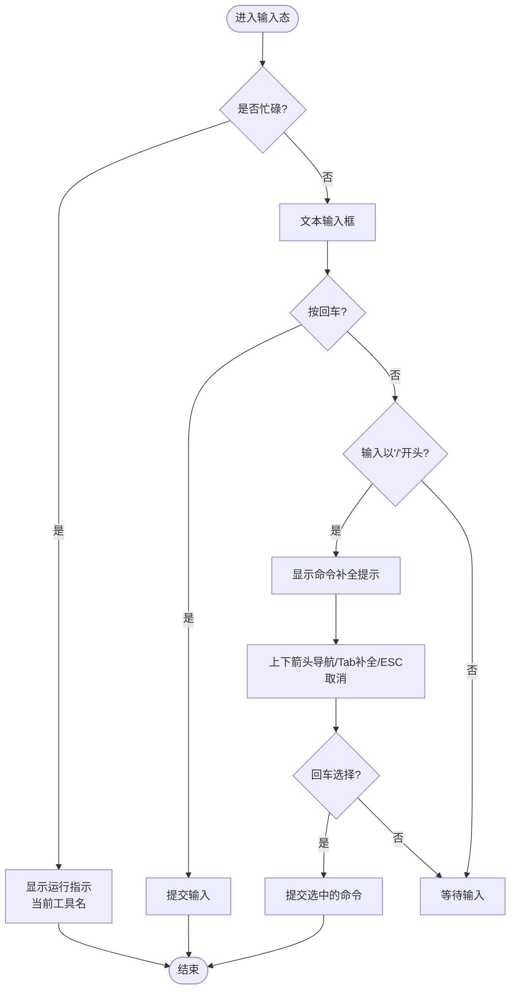
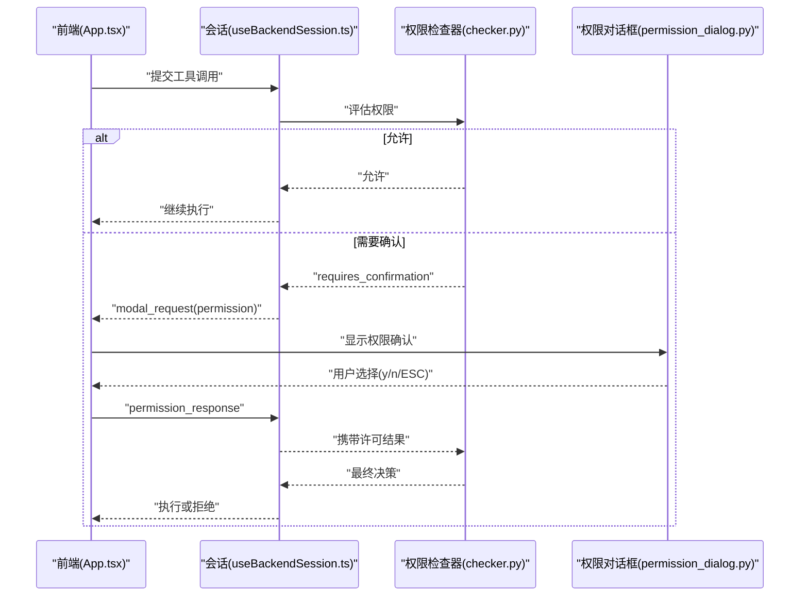
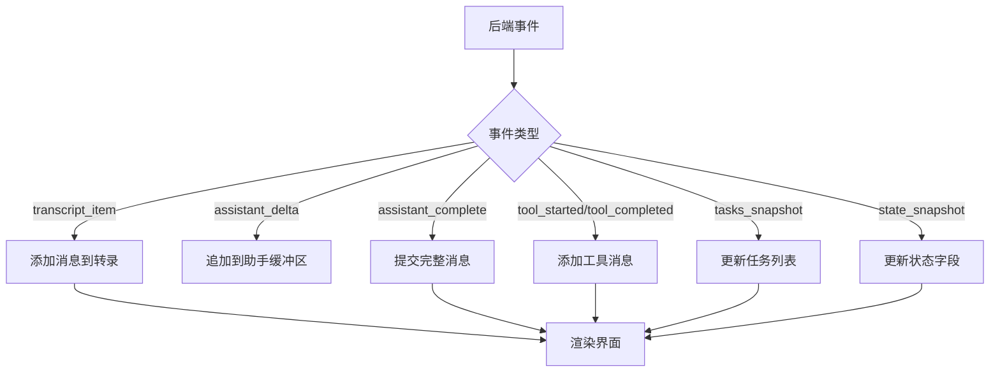
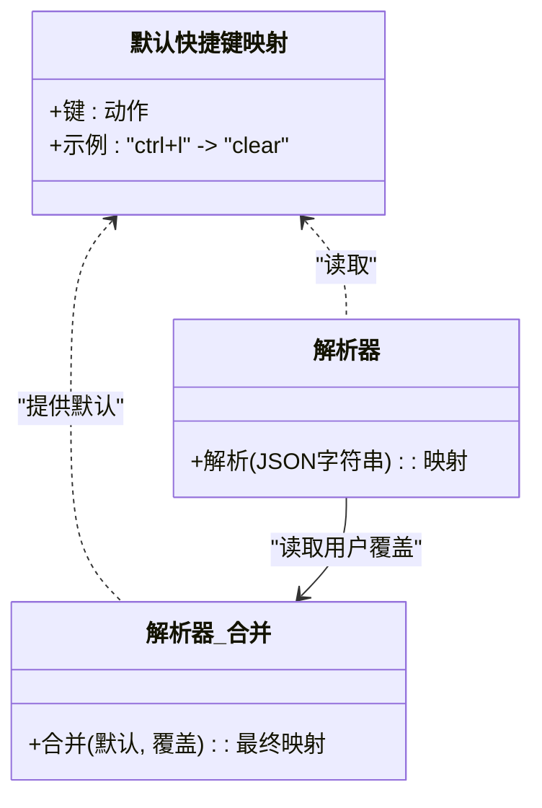
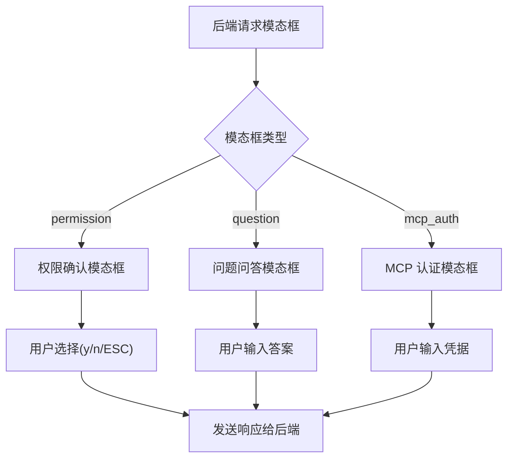
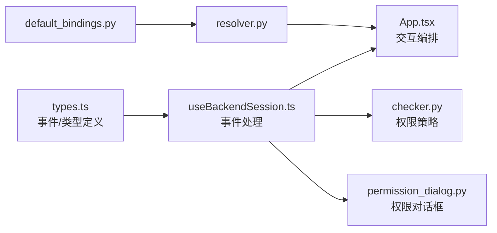

# 用户交互指南

<cite>
**本文引用的文件**
- [App.tsx](file://frontend/terminal/src/App.tsx)
- [PromptInput.tsx](file://frontend/terminal/src/components/PromptInput.tsx)
- [CommandPicker.tsx](file://frontend/terminal/src/components/CommandPicker.tsx)
- [ModalHost.tsx](file://frontend/terminal/src/components/ModalHost.tsx)
- [SelectModal.tsx](file://frontend/terminal/src/components/SelectModal.tsx)
- [StatusBar.tsx](file://frontend/terminal/src/components/StatusBar.tsx)
- [useBackendSession.ts](file://frontend/terminal/src/hooks/useBackendSession.ts)
- [types.ts](file://frontend/terminal/src/types.ts)
- [permission_dialog.py](file://src/openharness/ui/permission_dialog.py)
- [input.py](file://src/openharness/ui/input.py)
- [checker.py](file://src/openharness/permissions/checker.py)
- [default_bindings.py](file://src/openharness/keybindings/default_bindings.py)
- [resolver.py](file://src/openharness/keybindings/resolver.py)
- [parser.py](file://src/openharness/keybindings/parser.py)
</cite>

## 目录
1. [简介](#简介)
2. [项目结构](#项目结构)
3. [核心组件](#核心组件)
4. [架构总览](#架构总览)
5. [详细组件分析](#详细组件分析)
6. [依赖分析](#依赖分析)
7. [性能考虑](#性能考虑)
8. [故障排除指南](#故障排除指南)
9. [结论](#结论)
10. [附录](#附录)

## 简介
本指南面向 OpenHarness 的终端用户与集成开发者，系统性阐述用户交互模式与操作流程，涵盖命令输入、权限确认、工具执行反馈、键盘快捷键系统、上下文感知功能、权限对话框工作流与安全控制机制，以及模态框的使用场景与用户引导设计。文档同时提供最佳实践与用户体验优化建议，帮助读者高效、安全地使用系统。

## 项目结构
OpenHarness 的用户交互由前端终端界面与后端会话管理共同构成：前端负责渲染与输入处理，后端负责业务逻辑、权限校验与工具执行，并通过事件协议与前端通信。

图表来源
- [App.tsx:1-400](file://frontend/terminal/src/App.tsx#L1-L400)
- [useBackendSession.ts:1-172](file://frontend/terminal/src/hooks/useBackendSession.ts#L1-L172)
- [types.ts:1-63](file://frontend/terminal/src/types.ts#L1-L63)
- [checker.py:1-100](file://src/openharness/permissions/checker.py#L1-L100)
- [permission_dialog.py:1-15](file://src/openharness/ui/permission_dialog.py#L1-L15)
- [input.py:1-33](file://src/openharness/ui/input.py#L1-L33)
- [default_bindings.py:1-12](file://src/openharness/keybindings/default_bindings.py#L1-L12)
- [resolver.py:1-14](file://src/openharness/keybindings/resolver.py#L1-L14)
- [parser.py:1-19](file://src/openharness/keybindings/parser.py#L1-L19)

章节来源
- [App.tsx:1-400](file://frontend/terminal/src/App.tsx#L1-L400)
- [useBackendSession.ts:1-172](file://frontend/terminal/src/hooks/useBackendSession.ts#L1-L172)
- [types.ts:1-63](file://frontend/terminal/src/types.ts#L1-L63)

## 核心组件
- 应用入口与交互编排：负责键盘输入处理、命令补全、模态框切换、历史导航、脚本化自动化等。
- 输入组件：在忙碌态显示运行指示与当前工具名，在空闲态提供文本输入。
- 命令补全提示：基于当前输入前缀展示可选命令列表，支持上下导航与 Tab 补全。
- 模态框宿主：渲染后端发起的权限确认、问题问答、MCP 认证等模态框。
- 前端选择模态框：用于权限模式选择、会话恢复等需要用户从选项中选择的场景。
- 状态栏：展示模型、令牌用量、权限模式、任务数量、MCP 连接数等状态信息。
- 后端会话钩子：建立与后端进程的双向通信，接收事件并更新 UI 状态。

章节来源
- [App.tsx:1-400](file://frontend/terminal/src/App.tsx#L1-L400)
- [PromptInput.tsx:1-39](file://frontend/terminal/src/components/PromptInput.tsx#L1-L39)
- [CommandPicker.tsx:1-34](file://frontend/terminal/src/components/CommandPicker.tsx#L1-L34)
- [ModalHost.tsx:1-71](file://frontend/terminal/src/components/ModalHost.tsx#L1-L71)
- [SelectModal.tsx:1-45](file://frontend/terminal/src/components/SelectModal.tsx#L1-L45)
- [StatusBar.tsx:1-54](file://frontend/terminal/src/components/StatusBar.tsx#L1-L54)
- [useBackendSession.ts:1-172](file://frontend/terminal/src/hooks/useBackendSession.ts#L1-L172)

## 架构总览
下图展示了从前端到后端的关键交互路径：用户输入经前端解析后发送至后端；后端根据权限策略决定是否需要用户确认；最终通过事件协议回传到前端进行渲染。

图表来源
- [App.tsx:149-290](file://frontend/terminal/src/App.tsx#L149-L290)
- [useBackendSession.ts:71-150](file://frontend/terminal/src/hooks/useBackendSession.ts#L71-L150)
- [ModalHost.tsx:16-38](file://frontend/terminal/src/components/ModalHost.tsx#L16-L38)

## 详细组件分析

### 命令输入与键盘交互
- 主输入框在忙碌态显示“运行中”指示与当前工具名；空闲态提供文本输入，支持回车提交。
- 命令补全提示在输入以“/”开头时出现，支持上下箭头导航、Tab 补全、回车选择、ESC 取消。
- 历史导航支持上下箭头浏览历史记录，支持在非补全态下直接提交。
- 快捷键：Ctrl+C 退出；其他快捷键由后端键位系统管理（见“键盘快捷键系统”）。

图表来源
- [PromptInput.tsx:24-38](file://frontend/terminal/src/components/PromptInput.tsx#L24-L38)
- [CommandPicker.tsx:16-31](file://frontend/terminal/src/components/CommandPicker.tsx#L16-L31)
- [App.tsx:286-290](file://frontend/terminal/src/App.tsx#L286-L290)

章节来源
- [PromptInput.tsx:1-39](file://frontend/terminal/src/components/PromptInput.tsx#L1-L39)
- [CommandPicker.tsx:1-34](file://frontend/terminal/src/components/CommandPicker.tsx#L1-L34)
- [App.tsx:286-290](file://frontend/terminal/src/App.tsx#L286-L290)

### 权限确认与安全控制
- 权限对话框由后端触发并通过事件下发到前端模态框组件渲染，用户可用 y/n 或 ESC 做出选择。
- 后端权限检查器依据配置的模式与规则评估工具调用是否允许或需要确认，支持显式允许/拒绝、路径规则、命令模式匹配、只读工具豁免、计划模式阻断等。
- 前端在收到权限模态框时暂停其他输入，确保交互明确性与安全性。

图表来源
- [ModalHost.tsx:16-38](file://frontend/terminal/src/components/ModalHost.tsx#L16-L38)
- [checker.py:43-99](file://src/openharness/permissions/checker.py#L43-L99)
- [permission_dialog.py:8-14](file://src/openharness/ui/permission_dialog.py#L8-L14)

章节来源
- [ModalHost.tsx:1-71](file://frontend/terminal/src/components/ModalHost.tsx#L1-L71)
- [checker.py:1-100](file://src/openharness/permissions/checker.py#L1-L100)
- [permission_dialog.py:1-15](file://src/openharness/ui/permission_dialog.py#L1-L15)

### 工具执行反馈与状态栏
- 会话事件包含转录项、助手增量输出、工具开始/完成、任务快照、状态快照等，前端据此更新界面。
- 状态栏聚合显示模型、令牌用量、权限模式、任务数量、MCP 连接数等，便于用户掌握系统状态。

图表来源
- [useBackendSession.ts:71-150](file://frontend/terminal/src/hooks/useBackendSession.ts#L71-L150)
- [StatusBar.tsx:8-46](file://frontend/terminal/src/components/StatusBar.tsx#L8-L46)

章节来源
- [useBackendSession.ts:1-172](file://frontend/terminal/src/hooks/useBackendSession.ts#L1-L172)
- [StatusBar.tsx:1-54](file://frontend/terminal/src/components/StatusBar.tsx#L1-L54)

### 键盘快捷键系统与上下文感知
- 默认快捷键映射包含清屏、切换 Vim、语音、任务面板等，可通过解析器加载用户覆盖配置并由解析器合并。
- 前端对不同上下文（忙碌态、模态框、命令补全）进行输入拦截与行为分流，保证交互一致性与可预测性。

图表来源
- [default_bindings.py:6-11](file://src/openharness/keybindings/default_bindings.py#L6-L11)
- [parser.py:8-18](file://src/openharness/keybindings/parser.py#L8-L18)
- [resolver.py:8-13](file://src/openharness/keybindings/resolver.py#L8-L13)

章节来源
- [default_bindings.py:1-12](file://src/openharness/keybindings/default_bindings.py#L1-L12)
- [parser.py:1-19](file://src/openharness/keybindings/parser.py#L1-L19)
- [resolver.py:1-14](file://src/openharness/keybindings/resolver.py#L1-L14)
- [App.tsx:149-290](file://frontend/terminal/src/App.tsx#L149-L290)

### 模态框使用场景与用户引导设计
- 权限确认：清晰展示工具名与原因，提供“允许/拒绝”的二元选择与 ESC 取消。
- 问题问答：后端提出问题，前端提供输入框，用户直接回复。
- MCP 认证：后端提示认证信息，前端提供输入框收集凭据。
- 前端选择模态框：用于权限模式选择、会话恢复等，支持上下导航与数字键快速选择。

图表来源
- [ModalHost.tsx:16-68](file://frontend/terminal/src/components/ModalHost.tsx#L16-L68)
- [SelectModal.tsx:21-42](file://frontend/terminal/src/components/SelectModal.tsx#L21-L42)
- [App.tsx:104-147](file://frontend/terminal/src/App.tsx#L104-L147)

章节来源
- [ModalHost.tsx:1-71](file://frontend/terminal/src/components/ModalHost.tsx#L1-L71)
- [SelectModal.tsx:1-45](file://frontend/terminal/src/components/SelectModal.tsx#L1-L45)
- [App.tsx:104-147](file://frontend/terminal/src/App.tsx#L104-L147)

## 依赖分析
- 前端与后端通过统一的事件协议通信，事件类型在类型定义中集中声明，便于扩展与维护。
- 权限检查器独立于 UI 层，仅依赖配置与规则，保证策略的一致性与可测试性。
- 键位系统采用“默认 + 用户覆盖”的合并策略，既保证开箱即用，又支持个性化定制。

图表来源
- [types.ts:48-62](file://frontend/terminal/src/types.ts#L48-L62)
- [useBackendSession.ts:71-150](file://frontend/terminal/src/hooks/useBackendSession.ts#L71-L150)
- [checker.py:30-99](file://src/openharness/permissions/checker.py#L30-L99)
- [permission_dialog.py:8-14](file://src/openharness/ui/permission_dialog.py#L8-L14)
- [default_bindings.py:6-11](file://src/openharness/keybindings/default_bindings.py#L6-L11)
- [resolver.py:8-13](file://src/openharness/keybindings/resolver.py#L8-L13)

章节来源
- [types.ts:1-63](file://frontend/terminal/src/types.ts#L1-L63)
- [useBackendSession.ts:1-172](file://frontend/terminal/src/hooks/useBackendSession.ts#L1-L172)
- [checker.py:1-100](file://src/openharness/permissions/checker.py#L1-L100)
- [permission_dialog.py:1-15](file://src/openharness/ui/permission_dialog.py#L1-L15)
- [default_bindings.py:1-12](file://src/openharness/keybindings/default_bindings.py#L1-L12)
- [resolver.py:1-14](file://src/openharness/keybindings/resolver.py#L1-L14)

## 性能考虑
- 事件驱动渲染：前端仅在收到事件时更新，避免轮询带来的开销。
- 状态最小化：会话状态与 UI 状态分离，减少不必要的重渲染。
- 输入抑制：在忙碌态与模态框态抑制部分输入，降低无效请求与渲染压力。
- 建议：对长输出采用分块渲染与滚动优化；对频繁的权限确认场景，合理设置权限模式以减少中断。

## 故障排除指南
- 后端未响应
  - 现象：输入无反应、状态栏停滞。
  - 排查：检查后端进程是否存活、事件协议前缀是否正确、网络/MCP 连接状态。
  - 参考
    - [useBackendSession.ts:39-69](file://frontend/terminal/src/hooks/useBackendSession.ts#L39-L69)
    - [types.ts:14-20](file://frontend/terminal/src/types.ts#L14-L20)
- 权限确认循环
  - 现象：反复弹出权限确认。
  - 排查：检查权限模式与规则配置、工具是否被显式拒绝、命令模式匹配是否过宽。
  - 参考
    - [checker.py:50-99](file://src/openharness/permissions/checker.py#L50-L99)
    - [permission_dialog.py:8-14](file://src/openharness/ui/permission_dialog.py#L8-L14)
- 模态框无法关闭
  - 现象：权限/问答/MCP 模态框持续存在。
  - 排查：确认后端是否正确发送 modal_request 与 permission_response；前端是否正确更新 modal 状态。
  - 参考
    - [ModalHost.tsx:16-68](file://frontend/terminal/src/components/ModalHost.tsx#L16-L68)
    - [useBackendSession.ts:138-141](file://frontend/terminal/src/hooks/useBackendSession.ts#L138-L141)
- 命令补全异常
  - 现象：/ 前缀不触发补全或补全列表为空。
  - 排查：确认后端 commands 列表是否正确下发、输入前缀匹配逻辑、补全索引边界。
  - 参考
    - [App.tsx:66-74](file://frontend/terminal/src/App.tsx#L66-L74)
    - [App.tsx:236-267](file://frontend/terminal/src/App.tsx#L236-L267)

章节来源
- [useBackendSession.ts:39-69](file://frontend/terminal/src/hooks/useBackendSession.ts#L39-L69)
- [types.ts:14-20](file://frontend/terminal/src/types.ts#L14-L20)
- [checker.py:50-99](file://src/openharness/permissions/checker.py#L50-L99)
- [permission_dialog.py:1-15](file://src/openharness/ui/permission_dialog.py#L1-L15)
- [ModalHost.tsx:16-68](file://frontend/terminal/src/components/ModalHost.tsx#L16-L68)
- [useBackendSession.ts:138-141](file://frontend/terminal/src/hooks/useBackendSession.ts#L138-L141)
- [App.tsx:66-74](file://frontend/terminal/src/App.tsx#L66-L74)
- [App.tsx:236-267](file://frontend/terminal/src/App.tsx#L236-L267)

## 结论
OpenHarness 的用户交互以事件驱动为核心，结合前后端协作、权限策略与上下文感知，提供了安全、直观且高效的终端体验。通过规范化的模态框与状态栏设计，用户能够在复杂任务中保持清晰的控制感与可见性。建议在实际部署中结合团队工作流完善键位映射与权限策略，并持续关注长输出与高频权限确认场景的性能优化。

## 附录
- 最佳实践
  - 使用“自动”模式提升效率，但仅在受信任环境启用；在开发/测试阶段优先使用“默认”模式。
  - 对高风险命令与路径制定明确的拒绝规则，避免误操作。
  - 在多人协作场景中，统一键位映射与权限策略，减少沟通成本。
  - 对长输出内容采用分页/折叠策略，提升可读性。
- 用户体验优化建议
  - 增加“一键跳过”或“批量确认”能力（在安全可控的前提下），减少重复交互。
  - 提供“最近使用”命令优先展示，缩短常用命令的输入路径。
  - 在权限确认中增加“记住选择”选项，减少重复确认频率。
  - 为状态栏添加点击展开/收起的详情视图，满足高级用户的深度信息需求。