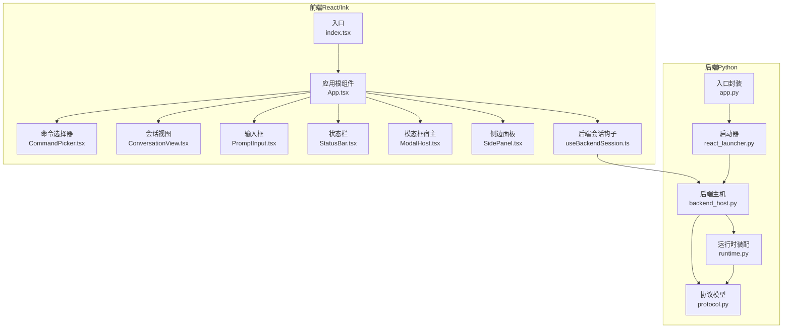
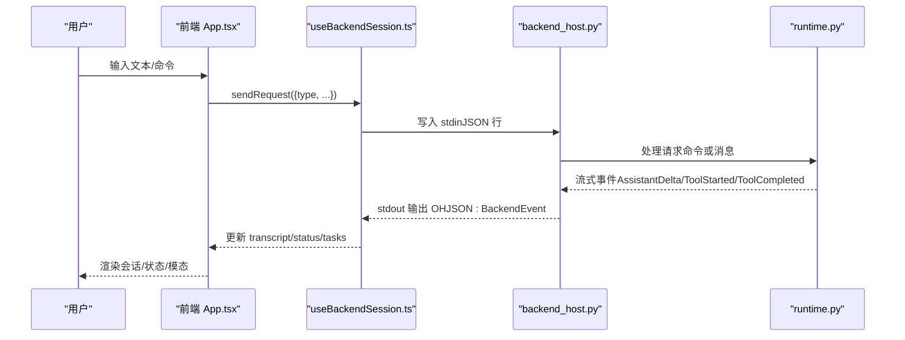
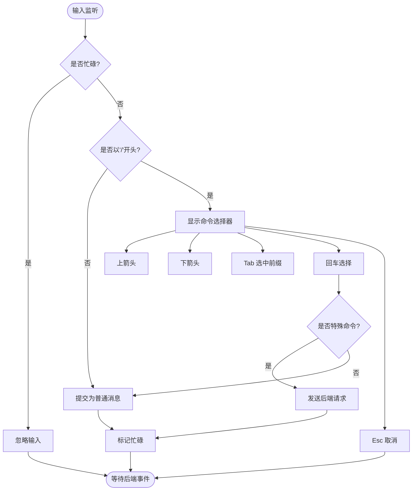
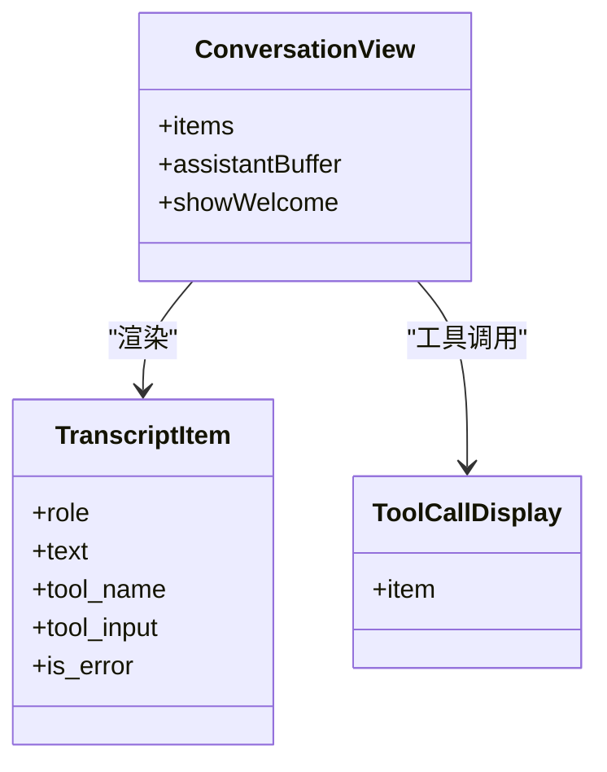
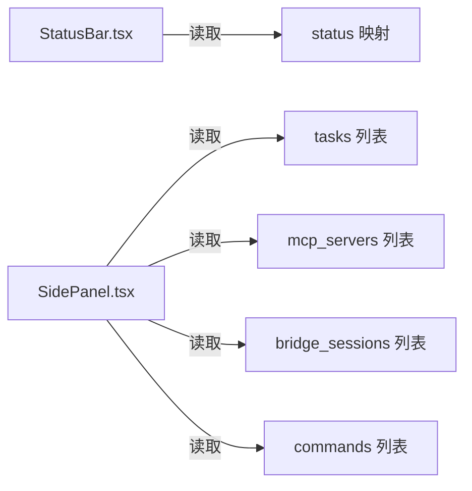
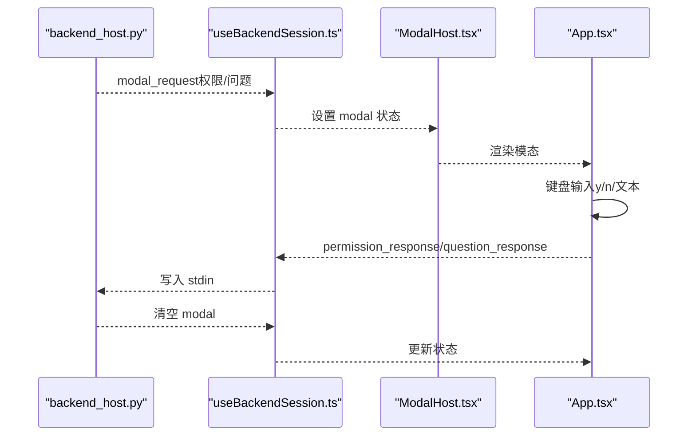
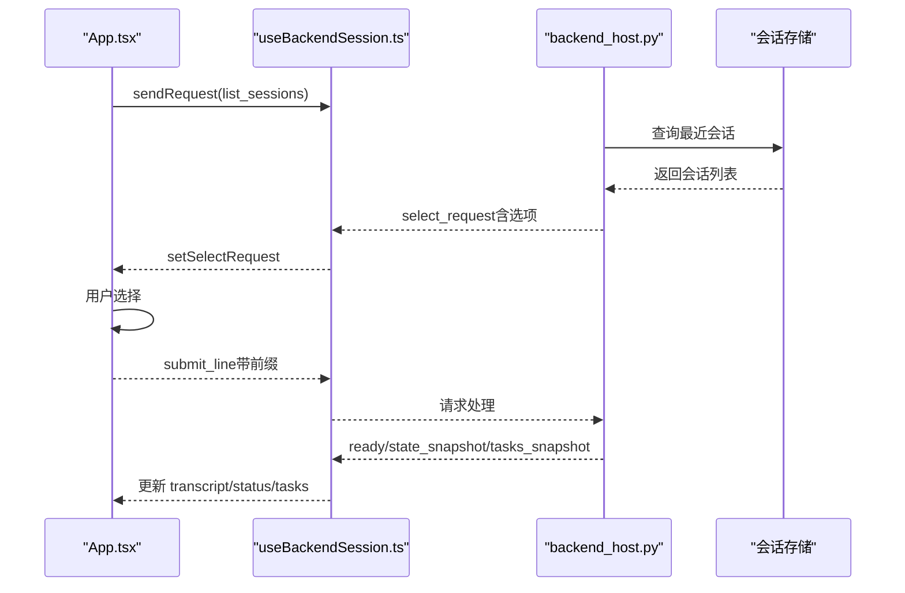
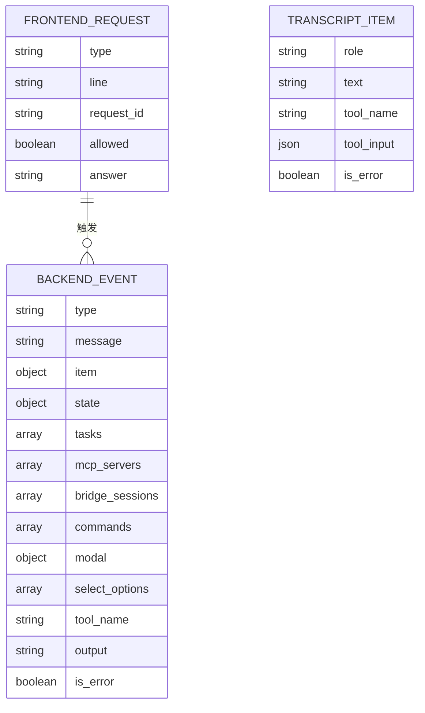
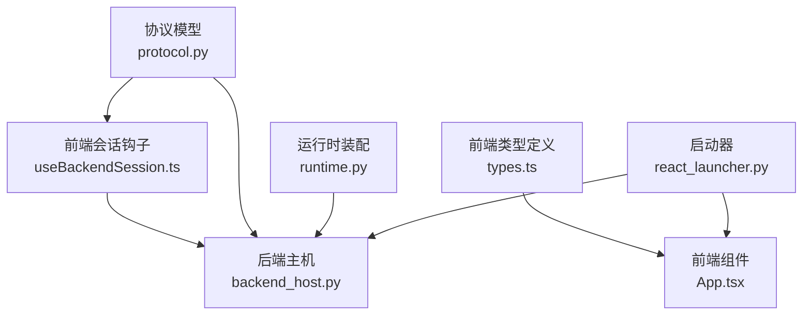

# 用户界面系统

<cite>
**本文引用的文件**
- [App.tsx](file://frontend/terminal/src/App.tsx)
- [index.tsx](file://frontend/terminal/src/index.tsx)
- [types.ts](file://frontend/terminal/src/types.ts)
- [useBackendSession.ts](file://frontend/terminal/src/hooks/useBackendSession.ts)
- [CommandPicker.tsx](file://frontend/terminal/src/components/CommandPicker.tsx)
- [ConversationView.tsx](file://frontend/terminal/src/components/ConversationView.tsx)
- [PromptInput.tsx](file://frontend/terminal/src/components/PromptInput.tsx)
- [StatusBar.tsx](file://frontend/terminal/src/components/StatusBar.tsx)
- [ModalHost.tsx](file://frontend/terminal/src/components/ModalHost.tsx)
- [SidePanel.tsx](file://frontend/terminal/src/components/SidePanel.tsx)
- [protocol.py](file://src/openharness/ui/protocol.py)
- [backend_host.py](file://src/openharness/ui/backend_host.py)
- [runtime.py](file://src/openharness/ui/runtime.py)
- [react_launcher.py](file://src/openharness/ui/react_launcher.py)
- [app.py](file://src/openharness/ui/app.py)
</cite>

## 目录
1. [简介](#简介)
2. [项目结构](#项目结构)
3. [核心组件](#核心组件)
4. [架构总览](#架构总览)
5. [详细组件分析](#详细组件分析)
6. [依赖分析](#依赖分析)
7. [性能考虑](#性能考虑)
8. [故障排查指南](#故障排查指南)
9. [结论](#结论)
10. [附录](#附录)

## 简介
本文件面向 OpenHarness 的用户界面系统，重点解释基于 React/Ink 的终端用户界面（TUI）架构与前后端通信协议。文档覆盖前端组件组织（命令选择器、会话视图、侧边面板、状态栏等）、用户交互流程（命令输入、权限确认、工具执行反馈）、键盘快捷键与上下文感知功能、会话管理（会话恢复、历史记录查看），以及 UI 扩展与定制建议。为便于理解，文档提供了多幅架构与数据流图，并在需要时标注具体源码位置以便进一步查阅。

## 项目结构
OpenHarness 的 UI 分为两部分：
- 前端（React/Ink）：位于 frontend/terminal，负责渲染对话、命令提示、状态栏、模态框等，并通过标准输入/输出与后端进行结构化通信。
- 后端（Python）：位于 src/openharness/ui，负责运行时装配、命令解析、工具执行、事件流式传输、会话持久化与状态快照。

图表来源
- [index.tsx:1-10](file://frontend/terminal/src/index.tsx#L1-L10)
- [App.tsx:39-398](file://frontend/terminal/src/App.tsx#L39-L398)
- [useBackendSession.ts:17-171](file://frontend/terminal/src/hooks/useBackendSession.ts#L17-L171)
- [react_launcher.py:50-103](file://src/openharness/ui/react_launcher.py#L50-L103)
- [backend_host.py:41-302](file://src/openharness/ui/backend_host.py#L41-L302)
- [runtime.py:89-271](file://src/openharness/ui/runtime.py#L89-L271)
- [protocol.py:15-197](file://src/openharness/ui/protocol.py#L15-L197)
- [app.py:15-47](file://src/openharness/ui/app.py#L15-L47)

章节来源
- [index.tsx:1-10](file://frontend/terminal/src/index.tsx#L1-L10)
- [react_launcher.py:50-103](file://src/openharness/ui/react_launcher.py#L50-L103)
- [backend_host.py:41-302](file://src/openharness/ui/backend_host.py#L41-L302)
- [runtime.py:89-271](file://src/openharness/ui/runtime.py#L89-L271)
- [protocol.py:15-197](file://src/openharness/ui/protocol.py#L15-L197)
- [app.py:15-47](file://src/openharness/ui/app.py#L15-L47)

## 核心组件
- 应用根组件 App：协调会话状态、命令提示、输入处理、模态框与键盘事件，驱动前端 UI 渲染与后端请求发送。
- 会话视图 ConversationView：渲染消息历史、工具调用、欢迎横幅与助手增量输出。
- 命令选择器 CommandPicker：在输入以“/”开头时提供命令补全与导航。
- 输入框 PromptInput：在非忙碌状态下接收用户输入；忙碌时显示工具执行指示器。
- 状态栏 StatusBar：展示模型、令牌用量、权限模式、任务数与 MCP 连接状态。
- 模态框宿主 ModalHost：呈现权限确认、问题输入、MCP 认证等交互式模态。
- 侧边面板 SidePanel：展示状态、任务、MCP、桥接会话与可用命令提示。
- 后端会话钩子 useBackendSession：管理子进程生命周期、协议读写、事件分发与状态更新。
- 协议模型 protocol.py：定义前端请求与后端事件的结构化数据格式。
- 后端主机 backend_host.py：实现请求队列、事件发射、权限与问题请求处理、会话列表查询。
- 运行时 runtime.py：构建共享运行时对象、执行命令、流式渲染事件、保存会话快照。
- 启动器 react_launcher.py：解析前端配置、安装依赖、启动前端进程并传递后端命令。
- 入口封装 app.py：对外暴露 REPL 与打印模式入口，控制 UI 启动与后端仅运行模式。

章节来源
- [App.tsx:39-398](file://frontend/terminal/src/App.tsx#L39-L398)
- [ConversationView.tsx:8-88](file://frontend/terminal/src/components/ConversationView.tsx#L8-L88)
- [CommandPicker.tsx:4-33](file://frontend/terminal/src/components/CommandPicker.tsx#L4-L33)
- [PromptInput.tsx:9-38](file://frontend/terminal/src/components/PromptInput.tsx#L9-L38)
- [StatusBar.tsx:8-53](file://frontend/terminal/src/components/StatusBar.tsx#L8-L53)
- [ModalHost.tsx:5-70](file://frontend/terminal/src/components/ModalHost.tsx#L5-L70)
- [SidePanel.tsx:6-152](file://frontend/terminal/src/components/SidePanel.tsx#L6-L152)
- [useBackendSession.ts:17-171](file://frontend/terminal/src/hooks/useBackendSession.ts#L17-L171)
- [protocol.py:15-197](file://src/openharness/ui/protocol.py#L15-L197)
- [backend_host.py:41-302](file://src/openharness/ui/backend_host.py#L41-L302)
- [runtime.py:89-271](file://src/openharness/ui/runtime.py#L89-L271)
- [react_launcher.py:50-103](file://src/openharness/ui/react_launcher.py#L50-L103)
- [app.py:15-47](file://src/openharness/ui/app.py#L15-L47)

## 架构总览
React TUI 采用“前端渲染 + 后端执行”的双进程架构。前端通过 Ink 渲染 UI，使用结构化协议与后端通信；后端以 JSON 行协议（OHJSON:）在 stdout 发送事件、stdin 接收请求，内部通过 QueryEngine 执行工具与命令，实时流式输出事件。

图表来源
- [App.tsx:292-318](file://frontend/terminal/src/App.tsx#L292-L318)
- [useBackendSession.ts:31-37](file://frontend/terminal/src/hooks/useBackendSession.ts#L31-L37)
- [backend_host.py:74-132](file://src/openharness/ui/backend_host.py#L74-L132)
- [runtime.py:223-271](file://src/openharness/ui/runtime.py#L223-L271)
- [protocol.py:15-87](file://src/openharness/ui/protocol.py#L15-L87)

## 详细组件分析

### 组件 A：命令选择器与命令输入流程
命令选择器在输入以“/”开头且匹配后端提供的命令前缀时出现，支持上下箭头导航、Tab 插入、回车选择与 Esc 取消。App 对输入进行拦截，优先处理特殊命令（如权限模式切换、计划模式、会话恢复），否则提交为普通消息。

图表来源
- [App.tsx:149-290](file://frontend/terminal/src/App.tsx#L149-L290)
- [CommandPicker.tsx:4-33](file://frontend/terminal/src/components/CommandPicker.tsx#L4-L33)

章节来源
- [App.tsx:149-290](file://frontend/terminal/src/App.tsx#L149-L290)
- [CommandPicker.tsx:4-33](file://frontend/terminal/src/components/CommandPicker.tsx#L4-L33)

### 组件 B：会话视图与工具调用显示
会话视图根据角色渲染不同样式的消息，包括用户输入、助手回复、工具调用与结果、系统消息与日志。助手的增量文本通过缓冲区实时追加，完整回复完成后刷新为 assistant 角色项。

图表来源
- [ConversationView.tsx:8-88](file://frontend/terminal/src/components/ConversationView.tsx#L8-L88)
- [types.ts:6-20](file://frontend/terminal/src/types.ts#L6-L20)

章节来源
- [ConversationView.tsx:8-88](file://frontend/terminal/src/components/ConversationView.tsx#L8-L88)
- [types.ts:6-20](file://frontend/terminal/src/types.ts#L6-L20)

### 组件 C：状态栏与任务/MCP 展示
状态栏聚合模型、令牌用量、权限模式、任务数量与 MCP 连接数等信息；侧边面板进一步细分展示状态、任务、MCP、桥接会话与命令提示，帮助用户快速掌握系统状态。

图表来源
- [StatusBar.tsx:8-53](file://frontend/terminal/src/components/StatusBar.tsx#L8-L53)
- [SidePanel.tsx:6-152](file://frontend/terminal/src/components/SidePanel.tsx#L6-L152)
- [types.ts:14-46](file://frontend/terminal/src/types.ts#L14-L46)

章节来源
- [StatusBar.tsx:8-53](file://frontend/terminal/src/components/StatusBar.tsx#L8-L53)
- [SidePanel.tsx:6-152](file://frontend/terminal/src/components/SidePanel.tsx#L6-L152)
- [types.ts:14-46](file://frontend/terminal/src/types.ts#L14-L46)

### 组件 D：权限确认与问题输入模态
当后端触发权限请求或问题请求时，前端弹出相应模态。用户可通过 y/n 或键盘输入回答，前端将响应作为后端请求发送，随后关闭模态并继续会话。

图表来源
- [backend_host.py:236-273](file://src/openharness/ui/backend_host.py#L236-L273)
- [useBackendSession.ts:138-141](file://frontend/terminal/src/hooks/useBackendSession.ts#L138-L141)
- [ModalHost.tsx:16-70](file://frontend/terminal/src/components/ModalHost.tsx#L16-L70)
- [App.tsx:209-229](file://frontend/terminal/src/App.tsx#L209-L229)

章节来源
- [backend_host.py:236-273](file://src/openharness/ui/backend_host.py#L236-L273)
- [useBackendSession.ts:138-141](file://frontend/terminal/src/hooks/useBackendSession.ts#L138-L141)
- [ModalHost.tsx:16-70](file://frontend/terminal/src/components/ModalHost.tsx#L16-L70)
- [App.tsx:209-229](file://frontend/terminal/src/App.tsx#L209-L229)

### 组件 E：会话管理与历史记录
- 会话恢复：后端提供列出会话快照的能力，前端收到 select_request 后弹出选择模态，用户选择后提交带前缀的选项值，后端据此恢复对话。
- 历史记录：前端维护输入历史数组与索引，支持上下箭头浏览历史；同时后端在每次处理完成时发出 line_complete 事件，前端重置忙碌状态。

图表来源
- [App.tsx:140-144](file://frontend/terminal/src/App.tsx#L140-L144)
- [useBackendSession.ts:129-136](file://frontend/terminal/src/hooks/useBackendSession.ts#L129-L136)
- [backend_host.py:214-234](file://src/openharness/ui/backend_host.py#L214-L234)
- [runtime.py:262-269](file://src/openharness/ui/runtime.py#L262-L269)

章节来源
- [App.tsx:140-144](file://frontend/terminal/src/App.tsx#L140-L144)
- [useBackendSession.ts:129-136](file://frontend/terminal/src/hooks/useBackendSession.ts#L129-L136)
- [backend_host.py:214-234](file://src/openharness/ui/backend_host.py#L214-L234)
- [runtime.py:262-269](file://src/openharness/ui/runtime.py#L262-L269)

### 组件 F：前后端通信协议
- 前端请求（FrontendRequest）：submit_line、permission_response、question_response、list_sessions、shutdown。
- 后端事件（BackendEvent）：ready、state_snapshot、tasks_snapshot、transcript_item、assistant_delta、assistant_complete、line_complete、tool_started、tool_completed、clear_transcript、modal_request、select_request、error、shutdown。
- 协议前缀：OHJSON:，用于区分普通日志与结构化事件。

图表来源
- [protocol.py:15-87](file://src/openharness/ui/protocol.py#L15-L87)
- [types.ts:48-62](file://frontend/terminal/src/types.ts#L48-L62)

章节来源
- [protocol.py:15-87](file://src/openharness/ui/protocol.py#L15-L87)
- [types.ts:48-62](file://frontend/terminal/src/types.ts#L48-L62)

## 依赖分析
- 前端对后端的耦合通过协议模型解耦，前端仅依赖事件类型与字段结构，不关心后端内部实现。
- 后端对前端的耦合通过事件类型与模态结构约束，保证交互一致性。
- 启动器负责环境变量注入与子进程管理，避免前端直接接触后端细节。
- 运行时装配集中于 runtime.py，统一提供工具注册、引擎、钩子、状态等能力，供后端主机复用。

图表来源
- [types.ts:1-63](file://frontend/terminal/src/types.ts#L1-L63)
- [App.tsx:39-398](file://frontend/terminal/src/App.tsx#L39-L398)
- [useBackendSession.ts:17-171](file://frontend/terminal/src/hooks/useBackendSession.ts#L17-L171)
- [protocol.py:15-197](file://src/openharness/ui/protocol.py#L15-L197)
- [backend_host.py:41-302](file://src/openharness/ui/backend_host.py#L41-L302)
- [runtime.py:89-271](file://src/openharness/ui/runtime.py#L89-L271)
- [react_launcher.py:50-103](file://src/openharness/ui/react_launcher.py#L50-L103)

章节来源
- [types.ts:1-63](file://frontend/terminal/src/types.ts#L1-L63)
- [App.tsx:39-398](file://frontend/terminal/src/App.tsx#L39-L398)
- [useBackendSession.ts:17-171](file://frontend/terminal/src/hooks/useBackendSession.ts#L17-L171)
- [protocol.py:15-197](file://src/openharness/ui/protocol.py#L15-L197)
- [backend_host.py:41-302](file://src/openharness/ui/backend_host.py#L41-L302)
- [runtime.py:89-271](file://src/openharness/ui/runtime.py#L89-L271)
- [react_launcher.py:50-103](file://src/openharness/ui/react_launcher.py#L50-L103)

## 性能考虑
- 事件流式传输：后端按事件推送增量文本，前端仅渲染可见窗口内的消息，降低渲染压力。
- 会话快照：每次处理完成后保存会话快照，减少恢复成本并提升稳定性。
- 并发控制：后端使用锁保护输出，避免竞争条件；请求队列串行处理，确保状态一致。
- 依赖安装：启动器在首次运行时自动安装前端依赖，避免阻塞用户交互。

## 故障排查指南
- 前端无法连接后端：检查前端是否正确设置 OPENHARNESS_FRONTEND_CONFIG，确认后端命令可执行；查看子进程退出码与日志。
- 协议错误：确认后端输出以 OHJSON: 前缀开头；前端仅解析符合协议模型的事件。
- 权限/问题模态未关闭：确认前端已发送 permission_response/question_response；检查后端是否正确返回 modal_request。
- 会话恢复无选项：确认后端已正确查询会话存储并返回 select_request；检查前端是否正确设置选择模态。

章节来源
- [useBackendSession.ts:47-61](file://frontend/terminal/src/hooks/useBackendSession.ts#L47-L61)
- [backend_host.py:127-131](file://src/openharness/ui/backend_host.py#L127-L131)
- [backend_host.py:240-254](file://src/openharness/ui/backend_host.py#L240-L254)
- [backend_host.py:228-234](file://src/openharness/ui/backend_host.py#L228-L234)

## 结论
OpenHarness 的 React TUI 通过清晰的协议与职责分离，实现了高效、可扩展的终端交互体验。前端专注于渲染与交互，后端专注推理与执行，二者通过结构化事件流协同工作。该架构为后续扩展 UI 主题、命令系统、工具集与插件生态提供了良好基础。

## 附录
- 快捷键参考（由前端键盘监听实现）
  - 回车：发送消息或确认选择
  - 上/下箭头：命令选择器导航或历史记录浏览
  - Tab：填充命令前缀
  - Esc：取消命令选择器或模态
  - Ctrl+C：请求后端关闭
- 交互示例路径
  - 命令输入与处理：[App.tsx:292-318](file://frontend/terminal/src/App.tsx#L292-L318)
  - 权限确认流程：[App.tsx:209-229](file://frontend/terminal/src/App.tsx#L209-L229)
  - 会话恢复流程：[App.tsx:140-144](file://frontend/terminal/src/App.tsx#L140-L144)
  - 事件流式渲染：[backend_host.py:144-204](file://src/openharness/ui/backend_host.py#L144-L204)
  - 运行时装配与命令执行：[runtime.py:223-271](file://src/openharness/ui/runtime.py#L223-L271)