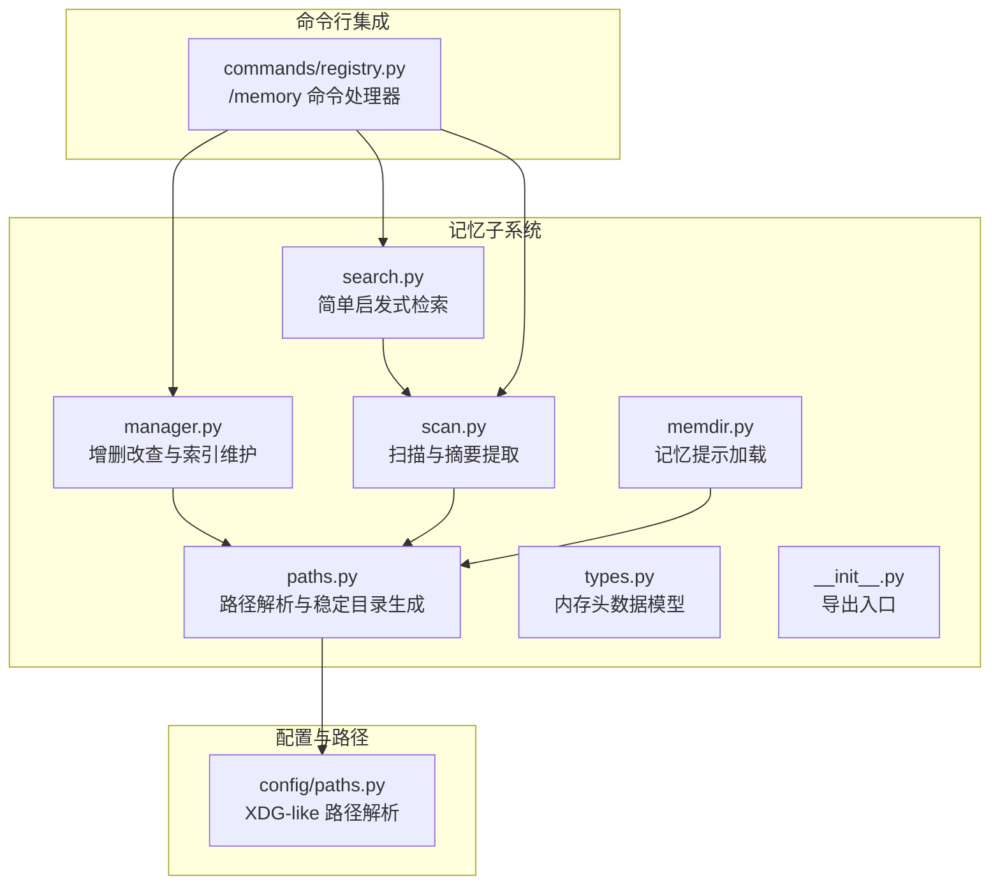
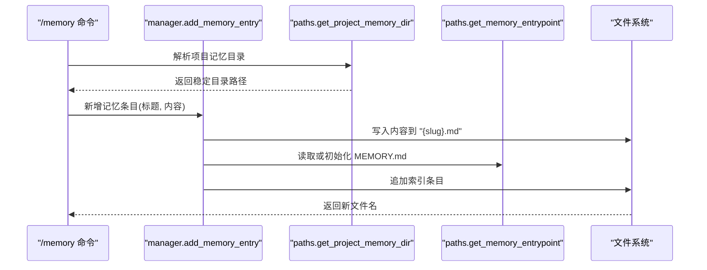
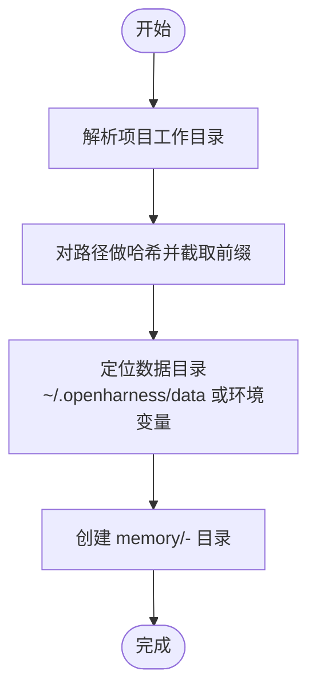
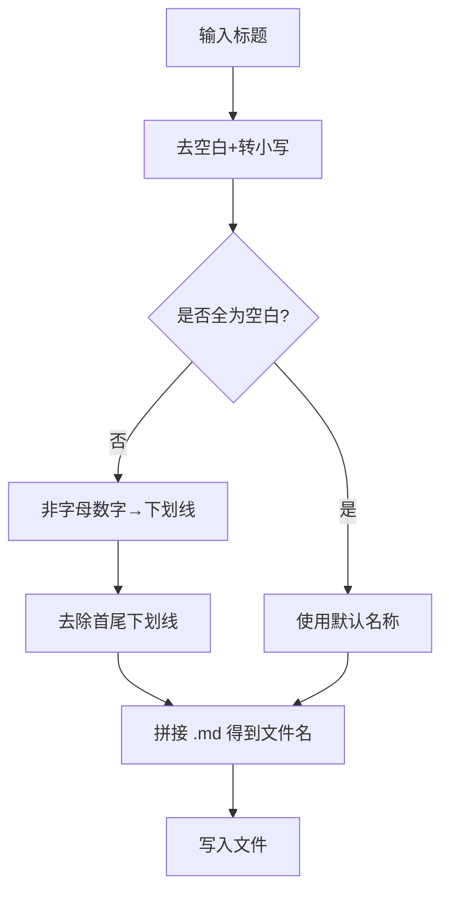
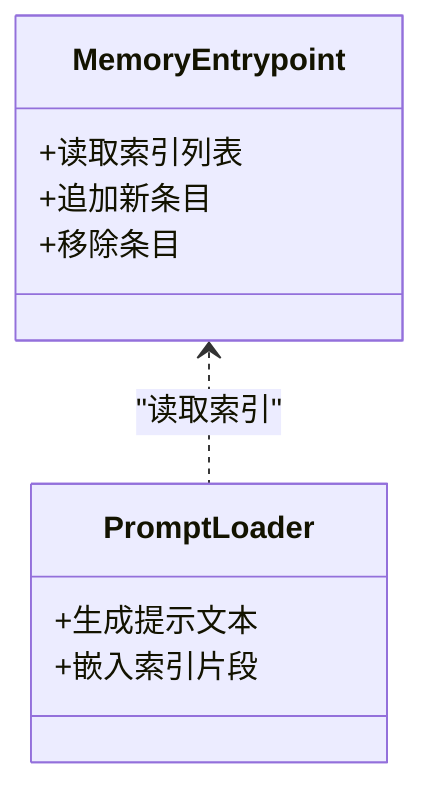
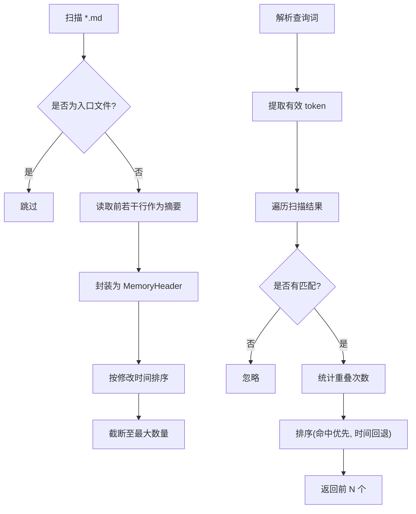
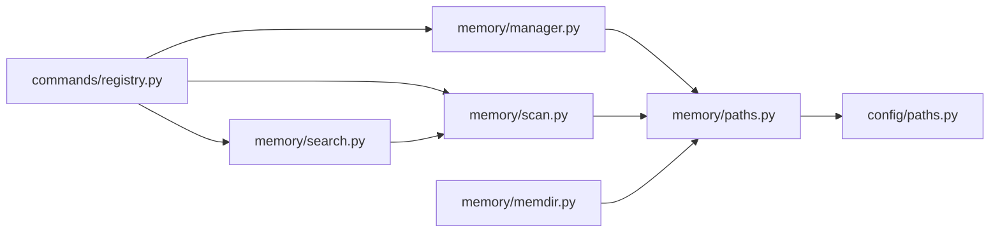

# 存储结构与目录组织

<cite>
**本文引用的文件**
- [src/openharness/memory/__init__.py](file://src/openharness/memory/__init__.py)
- [src/openharness/memory/manager.py](file://src/openharness/memory/manager.py)
- [src/openharness/memory/memdir.py](file://src/openharness/memory/memdir.py)
- [src/openharness/memory/paths.py](file://src/openharness/memory/paths.py)
- [src/openharness/memory/types.py](file://src/openharness/memory/types.py)
- [src/openharness/memory/scan.py](file://src/openharness/memory/scan.py)
- [src/openharness/memory/search.py](file://src/openharness/memory/search.py)
- [src/openharness/config/paths.py](file://src/openharness/config/paths.py)
- [src/openharness/commands/registry.py](file://src/openharness/commands/registry.py)
- [tests/test_memory/test_memdir.py](file://tests/test_memory/test_memdir.py)
</cite>

## 目录
1. [简介](#简介)
2. [项目结构](#项目结构)
3. [核心组件](#核心组件)
4. [架构总览](#架构总览)
5. [详细组件分析](#详细组件分析)
6. [依赖关系分析](#依赖关系分析)
7. [性能考量](#性能考量)
8. [故障排查指南](#故障排查指南)
9. [结论](#结论)
10. [附录：自定义存储策略实现指南](#附录自定义存储策略实现指南)

## 简介
本文件面向开发者与高级用户，系统性阐述 OpenHarness 记忆存储结构与目录组织方式。内容涵盖：
- 记忆目录的组织架构与创建机制
- 记忆文件命名规范（标题到 slug 的转换、特殊字符处理、重复冲突解决）
- 记忆入口文件 MEMORY.md 的作用与格式要求
- 记忆文件的存储位置策略（项目根目录下的隐藏目录结构）
- 版本控制与备份策略建议
- 存储性能优化与大文件处理方案
- 自定义存储策略的实现指南

## 项目结构
记忆子系统位于 src/openharness/memory 目录，围绕“项目级持久化记忆”构建，采用“数据目录 + 项目哈希”的隔离策略，并通过命令行接口提供统一的管理能力。

图表来源
- [src/openharness/memory/manager.py:1-51](file://src/openharness/memory/manager.py#L1-L51)
- [src/openharness/memory/scan.py:1-39](file://src/openharness/memory/scan.py#L1-L39)
- [src/openharness/memory/search.py:1-31](file://src/openharness/memory/search.py#L1-L31)
- [src/openharness/memory/paths.py:1-23](file://src/openharness/memory/paths.py#L1-L23)
- [src/openharness/memory/memdir.py:1-35](file://src/openharness/memory/memdir.py#L1-L35)
- [src/openharness/memory/types.py:1-17](file://src/openharness/memory/types.py#L1-L17)
- [src/openharness/memory/__init__.py:1-19](file://src/openharness/memory/__init__.py#L1-L19)
- [src/openharness/config/paths.py:1-117](file://src/openharness/config/paths.py#L1-L117)
- [src/openharness/commands/registry.py:320-356](file://src/openharness/commands/registry.py#L320-L356)

章节来源
- [src/openharness/memory/__init__.py:1-19](file://src/openharness/memory/__init__.py#L1-L19)
- [src/openharness/memory/paths.py:1-23](file://src/openharness/memory/paths.py#L1-L23)
- [src/openharness/config/paths.py:1-117](file://src/openharness/config/paths.py#L1-L117)
- [src/openharness/commands/registry.py:320-356](file://src/openharness/commands/registry.py#L320-L356)

## 核心组件
- 记忆路径解析：根据项目路径生成稳定的持久化目录，确保跨会话一致。
- 记忆管理器：负责新增、列出、删除记忆条目，并维护入口索引。
- 扫描器：遍历记忆目录，提取标题与描述摘要，用于检索与展示。
- 检索器：基于关键词与评分进行简单启发式匹配。
- 提示加载器：生成记忆模块的上下文提示，包含入口索引片段。
- 数据模型：MemoryHeader 封装单个记忆文件的元信息。
- 命令集成：/memory 命令提供交互式管理体验。

章节来源
- [src/openharness/memory/manager.py:1-51](file://src/openharness/memory/manager.py#L1-L51)
- [src/openharness/memory/scan.py:1-39](file://src/openharness/memory/scan.py#L1-L39)
- [src/openharness/memory/search.py:1-31](file://src/openharness/memory/search.py#L1-L31)
- [src/openharness/memory/memdir.py:1-35](file://src/openharness/memory/memdir.py#L1-L35)
- [src/openharness/memory/types.py:1-17](file://src/openharness/memory/types.py#L1-L17)
- [src/openharness/commands/registry.py:320-356](file://src/openharness/commands/registry.py#L320-L356)

## 架构总览
记忆系统遵循“路径稳定 + 文件索引 + 简单检索”的设计，保证在多会话、多项目间可移植且易用。

图表来源
- [src/openharness/commands/registry.py:345-350](file://src/openharness/commands/registry.py#L345-L350)
- [src/openharness/memory/manager.py:17-29](file://src/openharness/memory/manager.py#L17-L29)
- [src/openharness/memory/paths.py:11-23](file://src/openharness/memory/paths.py#L11-L23)

## 详细组件分析

### 组件A：记忆路径与目录组织
- 目录生成策略
  - 使用项目工作目录绝对路径计算短哈希，拼接项目名与哈希，形成稳定子目录。
  - 默认位于用户数据目录下的 memory 子树，避免与项目源码混杂。
- 入口文件位置
  - MEMORY.md 固定位于项目记忆目录内，作为索引导航。
- 稳定性保障
  - 通过哈希绑定项目身份，同一项目在不同机器或路径下指向相同目录。
  - 受环境变量影响：可通过数据目录环境变量覆盖默认位置。

图表来源
- [src/openharness/memory/paths.py:11-17](file://src/openharness/memory/paths.py#L11-L17)
- [src/openharness/config/paths.py:37-51](file://src/openharness/config/paths.py#L37-L51)

章节来源
- [src/openharness/memory/paths.py:1-23](file://src/openharness/memory/paths.py#L1-L23)
- [src/openharness/config/paths.py:1-117](file://src/openharness/config/paths.py#L1-L117)
- [tests/test_memory/test_memdir.py:15-25](file://tests/test_memory/test_memdir.py#L15-L25)

### 组件B：记忆文件命名规范与冲突处理
- 标题到 slug 的转换
  - 规则：去除首尾空白，转为小写；非字母数字字符替换为下划线；最终去除非空校验。
  - 结果：生成仅含字母数字与下划线的文件名基础，扩展名为 .md。
- 文件名冲突
  - 当前实现未内置自动重命名机制；若同名文件存在，写入时将覆盖同名文件。
  - 建议：在调用前进行预检查，或在上层逻辑中引入计数后缀以避免覆盖。
- 特殊字符处理
  - 非字母数字字符统一替换为下划线，确保跨平台兼容性。

图表来源
- [src/openharness/memory/manager.py:20-21](file://src/openharness/memory/manager.py#L20-L21)

章节来源
- [src/openharness/memory/manager.py:17-29](file://src/openharness/memory/manager.py#L17-L29)

### 组件C：记忆入口文件 MEMORY.md 的作用与格式
- 作用
  - 作为记忆索引导航，记录各主题文件的链接，便于快速访问。
  - 在提示加载器中被读取并嵌入到系统提示中，帮助模型感知当前项目的记忆状态。
- 格式要求
  - 支持 Markdown 列表项，每行一个条目，形如 “- [标题](文件名.md)”。
  - 若不存在，系统会在首次添加条目时创建。
- 展示策略
  - 提示加载器会截取指定行数以避免过长内容影响上下文窗口。

图表来源
- [src/openharness/memory/manager.py:24-28](file://src/openharness/memory/manager.py#L24-L28)
- [src/openharness/memory/memdir.py:21-32](file://src/openharness/memory/memdir.py#L21-L32)

章节来源
- [src/openharness/memory/manager.py:17-29](file://src/openharness/memory/manager.py#L17-L29)
- [src/openharness/memory/memdir.py:10-35](file://src/openharness/memory/memdir.py#L10-L35)
- [tests/test_memory/test_memdir.py:27-38](file://tests/test_memory/test_memdir.py#L27-L38)

### 组件D：记忆文件存储位置策略
- 位置策略
  - 项目记忆目录位于用户数据目录下的 memory 子树，结合项目名与哈希，确保唯一性。
  - 该目录独立于项目源码，避免被版本控制系统跟踪。
- 与项目隐藏目录的关系
  - 项目级配置通常位于项目根的隐藏目录（例如 .openharness），而记忆目录位于用户数据空间，二者解耦。
- 环境变量覆盖
  - 可通过数据目录环境变量改变默认位置，便于测试或迁移。

章节来源
- [src/openharness/memory/paths.py:11-23](file://src/openharness/memory/paths.py#L11-L23)
- [src/openharness/config/paths.py:37-51](file://src/openharness/config/paths.py#L37-L51)
- [src/openharness/commands/registry.py:1119-1121](file://src/openharness/commands/registry.py#L1119-L1121)

### 组件E：扫描与检索
- 扫描
  - 遍历记忆目录中的 .md 文件，跳过入口文件，提取前若干行作为描述摘要。
  - 按修改时间倒序返回，限制最大数量。
- 检索
  - 对查询词进行分词与过滤，统计命中文本的重叠次数，综合评分与时间排序返回结果。

图表来源
- [src/openharness/memory/scan.py:11-39](file://src/openharness/memory/scan.py#L11-L39)
- [src/openharness/memory/search.py:12-31](file://src/openharness/memory/search.py#L12-L31)

章节来源
- [src/openharness/memory/scan.py:1-39](file://src/openharness/memory/scan.py#L1-L39)
- [src/openharness/memory/search.py:1-31](file://src/openharness/memory/search.py#L1-L31)
- [src/openharness/memory/types.py:1-17](file://src/openharness/memory/types.py#L1-L17)

### 组件F：命令行集成与交互
- /memory 命令支持的操作
  - list：列出当前项目记忆文件
  - show NAME：显示指定记忆文件内容
  - add TITLE :: CONTENT：新增记忆条目并更新索引
  - remove NAME：删除记忆条目并从索引移除
- 与管理器的对接
  - 命令处理器直接调用管理器与扫描/检索函数，提供端到端体验。

章节来源
- [src/openharness/commands/registry.py:322-356](file://src/openharness/commands/registry.py#L322-L356)
- [src/openharness/memory/manager.py:11-51](file://src/openharness/memory/manager.py#L11-L51)
- [src/openharness/memory/scan.py:11-39](file://src/openharness/memory/scan.py#L11-L39)
- [src/openharness/memory/search.py:12-31](file://src/openharness/memory/search.py#L12-L31)

## 依赖关系分析
- 内部依赖
  - manager 依赖 paths 生成目录与入口文件路径
  - scan 与 search 依赖 paths 获取目录
  - memdir 依赖 paths 读取入口文件并注入提示
  - __init__ 统一导出公共 API
- 外部依赖
  - config.paths 提供 XDG-like 路径解析，决定默认数据目录
  - 命令注册表提供 CLI 入口，驱动记忆子系统

图表来源
- [src/openharness/commands/registry.py:320-356](file://src/openharness/commands/registry.py#L320-L356)
- [src/openharness/memory/manager.py:1-51](file://src/openharness/memory/manager.py#L1-L51)
- [src/openharness/memory/scan.py:1-39](file://src/openharness/memory/scan.py#L1-L39)
- [src/openharness/memory/search.py:1-31](file://src/openharness/memory/search.py#L1-L31)
- [src/openharness/memory/memdir.py:1-35](file://src/openharness/memory/memdir.py#L1-L35)
- [src/openharness/memory/paths.py:1-23](file://src/openharness/memory/paths.py#L1-L23)
- [src/openharness/config/paths.py:1-117](file://src/openharness/config/paths.py#L1-L117)

章节来源
- [src/openharness/memory/__init__.py:1-19](file://src/openharness/memory/__init__.py#L1-L19)
- [src/openharness/memory/paths.py:1-23](file://src/openharness/memory/paths.py#L1-L23)
- [src/openharness/config/paths.py:1-117](file://src/openharness/config/paths.py#L1-L117)
- [src/openharness/commands/registry.py:320-356](file://src/openharness/commands/registry.py#L320-L356)

## 性能考量
- I/O 与扫描
  - 扫描阶段对每个文件执行读取与 stat 操作，建议限制扫描文件数量与最大行数，避免在大型仓库中产生开销。
- 检索复杂度
  - 检索为线性扫描，时间复杂度 O(N×M)，其中 N 为扫描文件数，M 为平均文件行数。可通过缓存或增量索引优化。
- 缓存与增量
  - 可在应用层缓存最近访问的记忆摘要，减少重复读取。
- 大文件处理
  - 建议将长内容拆分为多个主题文件，避免单文件过大导致读写与检索成本上升。
- 并发与锁
  - 多进程/多线程同时写入时需考虑文件锁或原子写入策略，防止竞态条件。

## 故障排查指南
- 目录不可见或权限不足
  - 检查数据目录是否存在且具备读写权限；必要时设置数据目录环境变量。
- 入口索引缺失
  - 首次添加条目时会自动创建；若手动删除，请重新添加条目以重建索引。
- 查找不到记忆文件
  - 使用 /memory list 确认文件名；注意大小写与扩展名。
- 检索无结果
  - 确认查询词长度与组成；适当简化关键词或增加描述性内容。
- 冲突覆盖问题
  - 当前实现不处理同名冲突，建议在上层逻辑中先检查再写入，或引入编号后缀策略。

章节来源
- [src/openharness/memory/manager.py:32-50](file://src/openharness/memory/manager.py#L32-L50)
- [src/openharness/memory/scan.py:11-39](file://src/openharness/memory/scan.py#L11-L39)
- [src/openharness/memory/search.py:12-31](file://src/openharness/memory/search.py#L12-L31)
- [src/openharness/commands/registry.py:332-356](file://src/openharness/commands/registry.py#L332-L356)

## 结论
OpenHarness 的记忆存储体系以“稳定路径 + 索引文件 + 简单检索”为核心，既保证了跨会话一致性，又提供了直观的命令行管理体验。通过合理的命名规范、索引导航与性能优化策略，可在保持易用性的同时满足较大规模项目的长期演进需求。

## 附录：自定义存储策略实现指南
- 替换路径解析
  - 实现自定义 get_project_memory_dir，返回新的目录策略（例如按项目 UUID 或 Git 仓库 SHA）。
- 替换命名规则
  - 在新增流程中插入自定义 slug 生成器，支持更严格的字符集与冲突检测。
- 替换索引格式
  - 修改入口文件的写入与读取逻辑，支持更丰富的元数据（如标签、分类、权重）。
- 增量检索
  - 引入外部索引（如 JSON 索引文件）或数据库，提升检索效率与准确性。
- 备份与版本控制
  - 定期将记忆目录打包归档；对敏感内容进行加密存储；在 CI 中保留关键记忆快照。
- 大文件治理
  - 引入分片写入与懒加载；对超大文件提供摘要与链接策略，避免一次性加载。

章节来源
- [src/openharness/memory/paths.py:11-23](file://src/openharness/memory/paths.py#L11-L23)
- [src/openharness/memory/manager.py:17-29](file://src/openharness/memory/manager.py#L17-L29)
- [src/openharness/memory/scan.py:11-39](file://src/openharness/memory/scan.py#L11-L39)
- [src/openharness/memory/search.py:12-31](file://src/openharness/memory/search.py#L12-L31)