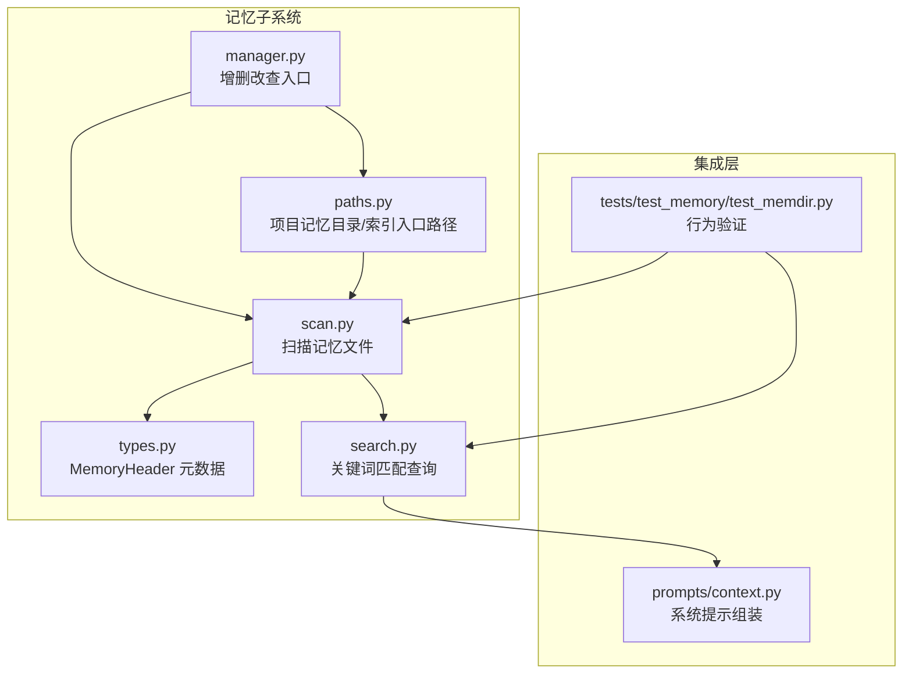
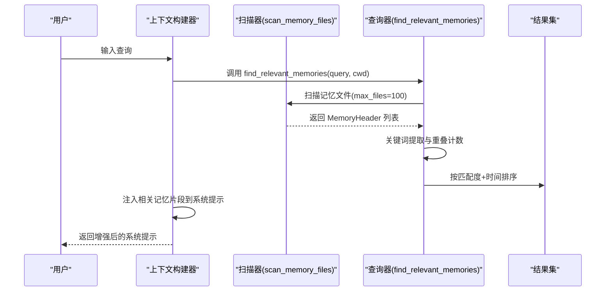
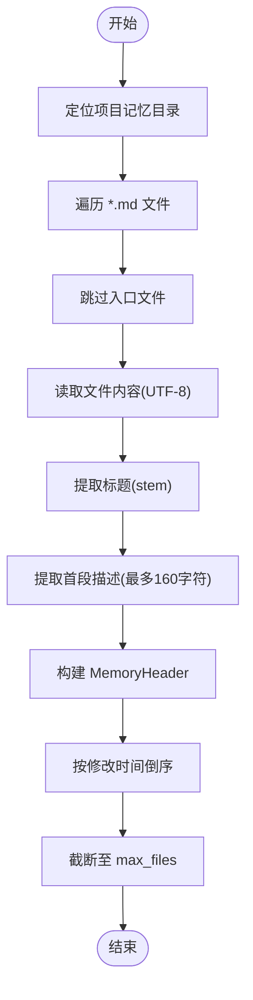
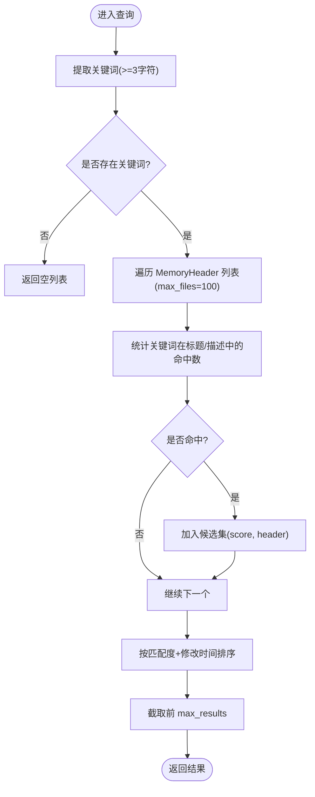
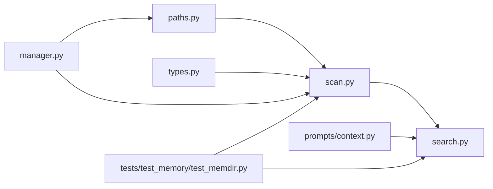

# 搜索与索引机制

<cite>
**本文引用的文件列表**
- [search.py](file://src/openharness/memory/search.py)
- [scan.py](file://src/openharness/memory/scan.py)
- [manager.py](file://src/openharness/memory/manager.py)
- [types.py](file://src/openharness/memory/types.py)
- [paths.py](file://src/openharness/memory/paths.py)
- [context.py](file://src/openharness/prompts/context.py)
- [test_memdir.py](file://tests/test_memory/test_memdir.py)
</cite>

## 目录
1. [简介](#简介)
2. [项目结构](#项目结构)
3. [核心组件](#核心组件)
4. [架构总览](#架构总览)
5. [详细组件分析](#详细组件分析)
6. [依赖关系分析](#依赖关系分析)
7. [性能考量](#性能考量)
8. [故障排查指南](#故障排查指南)
9. [结论](#结论)
10. [附录：扩展与定制指南](#附录扩展与定制指南)

## 简介
本文件面向开发者，系统化梳理 OpenHarness 记忆搜索系统的设计与实现，重点覆盖以下方面：
- 搜索算法实现原理：关键词匹配、全文检索（基于标题与描述）、排序与过滤策略
- 索引建立流程：文件扫描、元数据提取、倒排索引（当前实现为启发式匹配）
- 相关性评分机制：当前采用基于关键词重叠的启发式打分与时间衰减排序
- 扫描功能工作流：文件遍历、内容提取、索引更新
- 性能优化建议：缓存、并发、增量更新
- 排序与过滤机制：按匹配度与修改时间综合排序
- 自定义与扩展指南：如何在现有框架上引入 TF-IDF、余弦相似度、模糊匹配等高级能力

## 项目结构
记忆子系统位于 src/openharness/memory 目录，围绕“扫描-索引-查询-排序”闭环组织：
- 路径与入口：通过路径工具确定项目记忆目录与索引入口文件
- 扫描器：遍历记忆目录，解析 Markdown 文件，提取标题与首段描述
- 数据模型：MemoryHeader 封装文件路径、标题、描述、修改时间
- 查询器：对用户查询进行分词，统计与标题/描述的关键词重叠，按匹配度与时间排序
- 集成点：在运行时系统提示中动态注入相关记忆片段

图表来源
- [paths.py:11-23](file://src/openharness/memory/paths.py#L11-L23)
- [scan.py:11-39](file://src/openharness/memory/scan.py#L11-L39)
- [types.py:9-17](file://src/openharness/memory/types.py#L9-L17)
- [search.py:12-31](file://src/openharness/memory/search.py#L12-L31)
- [manager.py:11-51](file://src/openharness/memory/manager.py#L11-L51)
- [context.py:80-99](file://src/openharness/prompts/context.py#L80-L99)
- [test_memdir.py:41-53](file://tests/test_memory/test_memdir.py#L41-L53)

章节来源
- [paths.py:11-23](file://src/openharness/memory/paths.py#L11-L23)
- [scan.py:11-39](file://src/openharness/memory/scan.py#L11-L39)
- [types.py:9-17](file://src/openharness/memory/types.py#L9-L17)
- [search.py:12-31](file://src/openharness/memory/search.py#L12-L31)
- [manager.py:11-51](file://src/openharness/memory/manager.py#L11-L51)
- [context.py:80-99](file://src/openharness/prompts/context.py#L80-L99)
- [test_memdir.py:41-53](file://tests/test_memory/test_memdir.py#L41-L53)

## 核心组件
- MemoryHeader：封装单个记忆文件的元信息，用于后续排序与展示
- scan_memory_files：扫描项目记忆目录，读取每个 Markdown 的标题与首段描述，生成 MemoryHeader 列表
- find_relevant_memories：对查询进行关键词提取，统计与标题/描述的重叠次数，按匹配度与修改时间排序
- get_project_memory_dir/get_memory_entrypoint：确定持久化存储位置与索引入口文件
- add_memory_entry/remove_memory_entry/list_memory_files：管理记忆条目的增删改查与索引同步

章节来源
- [types.py:9-17](file://src/openharness/memory/types.py#L9-L17)
- [scan.py:11-39](file://src/openharness/memory/scan.py#L11-L39)
- [search.py:12-31](file://src/openharness/memory/search.py#L12-L31)
- [paths.py:11-23](file://src/openharness/memory/paths.py#L11-L23)
- [manager.py:11-51](file://src/openharness/memory/manager.py#L11-L51)

## 架构总览
记忆搜索的端到端流程如下：
- 用户输入查询
- 扫描器遍历记忆目录，提取标题与描述
- 查询器对查询进行分词，统计与标题/描述的关键词重叠
- 结果按匹配度降序、修改时间降序排序
- 在系统提示中注入相关记忆片段供模型参考

图表来源
- [context.py:80-99](file://src/openharness/prompts/context.py#L80-L99)
- [search.py:12-31](file://src/openharness/memory/search.py#L12-L31)
- [scan.py:11-39](file://src/openharness/memory/scan.py#L11-L39)

## 详细组件分析

### 组件一：扫描器 scan_memory_files
职责
- 定位项目记忆目录
- 遍历 .md 文件，跳过索引入口文件
- 读取文件内容，提取标题与首段描述
- 生成 MemoryHeader 并按修改时间倒序返回

关键逻辑要点
- 使用 glob 匹配 *.md，排除入口文件
- 读取前若干行，取首个非空行作为描述，限制长度
- 以 st_mtime 作为时间戳，便于后续排序

图表来源
- [scan.py:11-39](file://src/openharness/memory/scan.py#L11-L39)

章节来源
- [scan.py:11-39](file://src/openharness/memory/scan.py#L11-L39)

### 组件二：查询器 find_relevant_memories
职责
- 对查询进行关键词提取
- 遍历扫描结果，统计关键词在标题/描述中的出现次数
- 按匹配度降序、修改时间降序排序，返回前 N 条

当前实现特性
- 基于正则提取字母数字下划线组成的 token，过滤短词
- 采用“包含匹配”，统计命中数量作为得分
- 排序键：(-匹配度, -修改时间)

图表来源
- [search.py:12-31](file://src/openharness/memory/search.py#L12-L31)

章节来源
- [search.py:12-31](file://src/openharness/memory/search.py#L12-L31)

### 组件三：数据模型 MemoryHeader
职责
- 封装记忆文件的元信息，便于排序与展示

字段
- path：文件路径
- title：标题
- description：首段描述
- modified_at：修改时间戳

章节来源
- [types.py:9-17](file://src/openharness/memory/types.py#L9-L17)

### 组件四：路径与入口管理
职责
- 生成项目记忆目录（基于项目路径哈希）
- 提供索引入口文件路径

章节来源
- [paths.py:11-23](file://src/openharness/memory/paths.py#L11-L23)

### 组件五：记忆条目管理
职责
- 新增记忆条目并写入索引入口
- 删除记忆条目并同步索引入口
- 列出所有记忆文件

章节来源
- [manager.py:11-51](file://src/openharness/memory/manager.py#L11-L51)

### 组件六：系统提示集成
职责
- 在构建系统提示时调用查询器，注入相关记忆片段
- 控制最大结果数量与片段长度

章节来源
- [context.py:80-99](file://src/openharness/prompts/context.py#L80-L99)

## 依赖关系分析
- 查询器依赖扫描器与数据模型
- 扫描器依赖路径工具与数据模型
- 管理器依赖路径工具，负责维护索引入口与文件增删
- 上下文构建器依赖查询器与管理器，用于动态注入相关记忆

图表来源
- [paths.py:11-23](file://src/openharness/memory/paths.py#L11-L23)
- [scan.py:11-39](file://src/openharness/memory/scan.py#L11-L39)
- [types.py:9-17](file://src/openharness/memory/types.py#L9-L17)
- [search.py:12-31](file://src/openharness/memory/search.py#L12-L31)
- [manager.py:11-51](file://src/openharness/memory/manager.py#L11-L51)
- [context.py:80-99](file://src/openharness/prompts/context.py#L80-L99)
- [test_memdir.py:41-53](file://tests/test_memory/test_memdir.py#L41-L53)

## 性能考量
当前实现的性能特征与优化方向
- 时间复杂度
  - 扫描阶段：O(F)，F 为扫描文件数
  - 查询阶段：O(F·T)，T 为查询关键词数；若采用集合查找可降至 O(F·T)
- 空间复杂度
  - 存储 MemoryHeader 列表，空间约为 O(F)
- 当前瓶颈
  - 查询阶段为线性扫描与字符串包含判断，未使用倒排索引或向量索引
  - 描述提取仅取前若干行，可能遗漏关键信息
- 优化建议
  - 倒排索引：为标题与描述建立 token->文档集合的映射，查询时做集合交并操作
  - 向量化与余弦相似度：对文档与查询向量计算相似度，支持语义近似匹配
  - 缓存策略：对热门查询结果与最近修改的文档进行缓存
  - 并发处理：多线程/异步扫描与解析，I/O 密集场景收益显著
  - 增量更新：监听文件系统事件，仅对变更文件重建索引
  - 过滤与剪枝：对短词与停用词进行过滤，减少无效匹配

[本节为通用性能讨论，不直接分析具体文件]

## 故障排查指南
常见问题与定位方法
- 查询无结果
  - 检查查询是否包含足够长度的关键词（当前实现过滤长度小于3的 token）
  - 确认记忆目录存在且包含 .md 文件
- 结果顺序异常
  - 确认 MemoryHeader 的修改时间是否正确更新
  - 检查排序键是否为“匹配度降序、修改时间降序”
- 内容缺失
  - 确认描述提取逻辑仅取前若干行，必要时扩大行数上限
- 集成问题
  - 检查系统提示中是否正确调用查询器并注入片段
  - 确认索引入口文件存在且包含预期条目

章节来源
- [search.py:19-29](file://src/openharness/memory/search.py#L19-L29)
- [scan.py:18-36](file://src/openharness/memory/scan.py#L18-L36)
- [context.py:80-99](file://src/openharness/prompts/context.py#L80-L99)
- [test_memdir.py:41-53](file://tests/test_memory/test_memdir.py#L41-L53)

## 结论
当前的记忆搜索系统采用轻量级启发式匹配，具备良好的可读性与易维护性，适合小规模项目与快速原型。对于更大规模与更复杂的检索需求，建议引入倒排索引、TF-IDF/余弦相似度、向量检索与增量更新等机制，在保证性能的同时提升召回与精度。

[本节为总结性内容，不直接分析具体文件]

## 附录：扩展与定制指南

### 如何引入 TF-IDF 与余弦相似度
- 文档预处理
  - 分词：使用更健壮的分词器（如基于规则或外部库），去除停用词与标点
  - 归一化：统一大小写、词形还原（可选）
- 词频统计
  - 统计每个 token 在各文档中的频率，结合全局逆文档频率（IDF）计算 TF-IDF
- 向量化
  - 将文档映射为向量，查询同样向量化
- 相似度计算
  - 使用余弦相似度或内积衡量查询与文档的相似度
- 排序
  - 按相似度降序排序，必要时叠加时间衰减权重

[本节为概念性指导，不直接分析具体文件]

### 如何实现模糊搜索
- 字符串近似匹配
  - 使用编辑距离（Levenshtein）、Jaro-Winkler 或模糊匹配库
- 多粒度匹配
  - 同时支持精确词匹配与模糊匹配，按权重融合得分
- 交互式反馈
  - 支持用户对结果进行“相关/不相关”反馈，动态调整权重

[本节为概念性指导，不直接分析具体文件]

### 如何实现倒排索引
- 构建阶段
  - 遍历文档，建立 token->文档集合的映射
  - 可选：记录 token 在文档中的位置，支持短语匹配
- 查询阶段
  - 对查询分词后，利用集合交并操作快速定位候选文档
  - 对候选文档重新计算精确得分（如 TF-IDF 或 BM25）
- 更新策略
  - 增量更新：监听文件变更，仅更新受影响的 token 映射
  - 批量重建：定期全量重建，确保一致性

[本节为概念性指导，不直接分析具体文件]

### 如何实现缓存与并发
- 缓存
  - 查询结果缓存：热点查询命中缓存，避免重复计算
  - 文档内容缓存：近期访问的文档内容缓存，降低 I/O
- 并发
  - 异步扫描：使用异步 I/O 与线程池并行解析多个文件
  - 并行向量化：对候选文档并行计算向量与相似度
- 增量更新
  - 文件系统监控：使用 watchdog 或平台原生事件，实时感知变更
  - 局部重建：仅对变更文档重建索引，减少全量开销

[本节为概念性指导，不直接分析具体文件]

### 如何扩展排序与过滤
- 排序键
  - 多维组合：匹配度、时间、重要性（可由用户标记或启发式规则计算）
  - 动态权重：根据任务类型或用户偏好调整权重
- 过滤
  - 类型过滤：仅返回特定类型的文档
  - 时间范围：限定最近 N 天内的文档
  - 主题过滤：基于标签或元数据过滤

[本节为概念性指导，不直接分析具体文件]